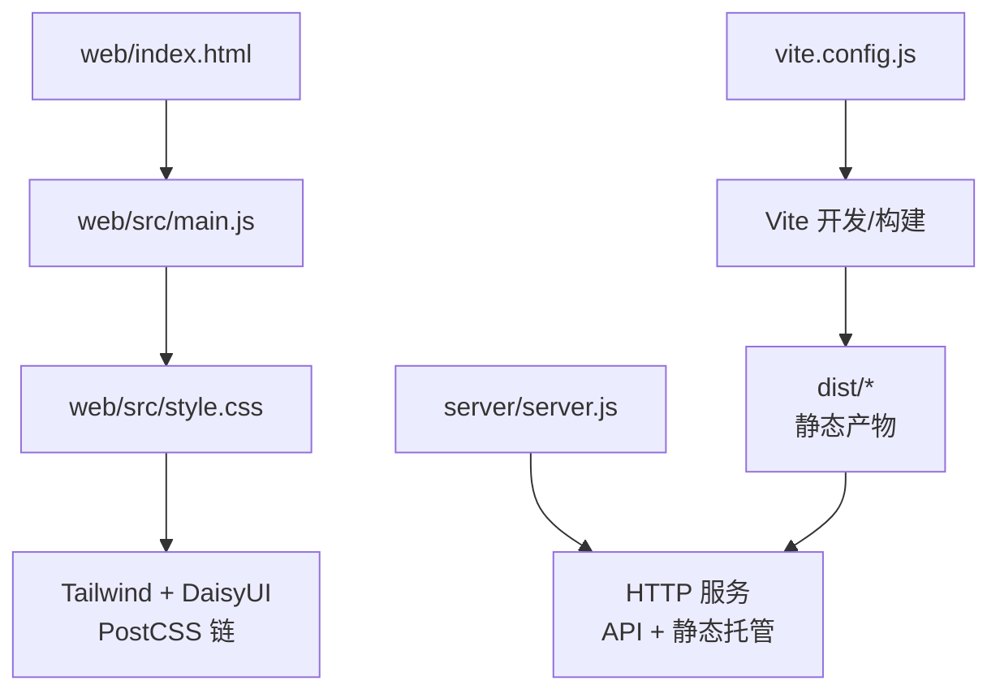
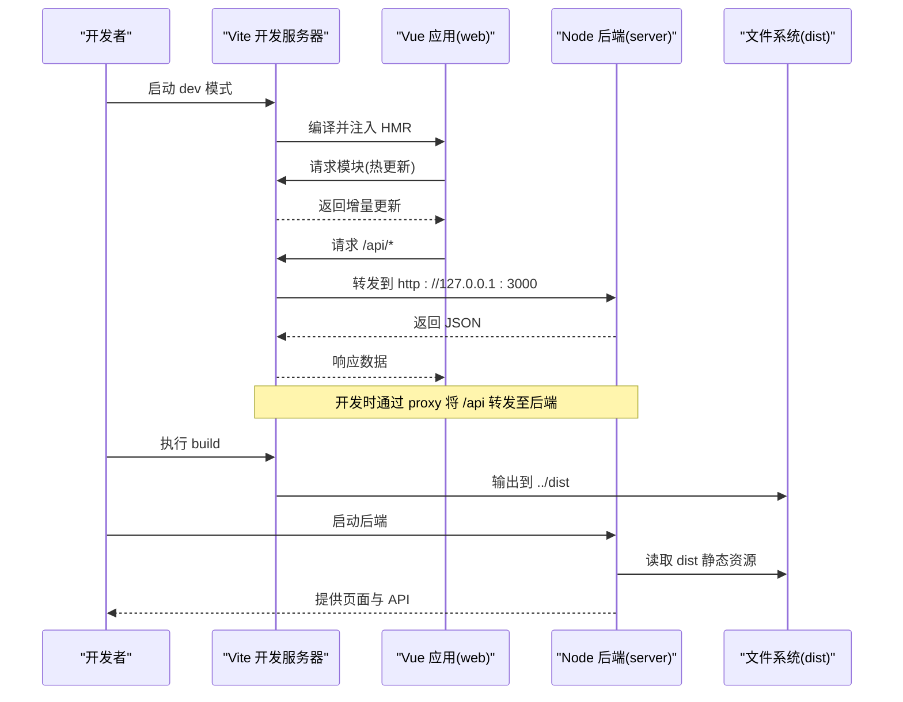
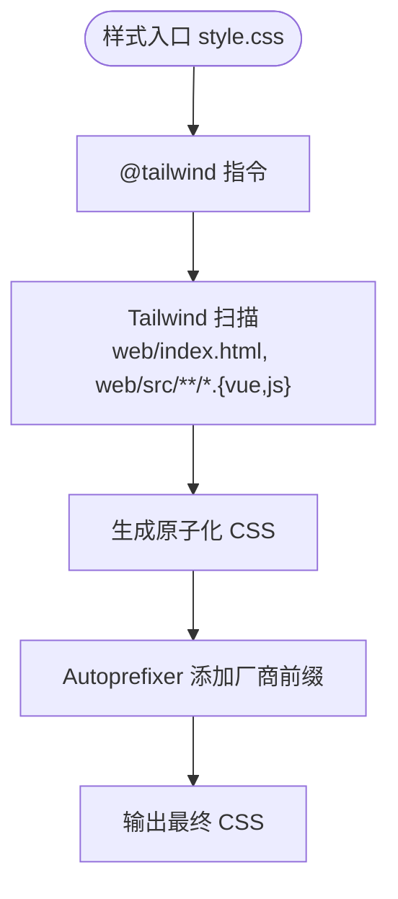
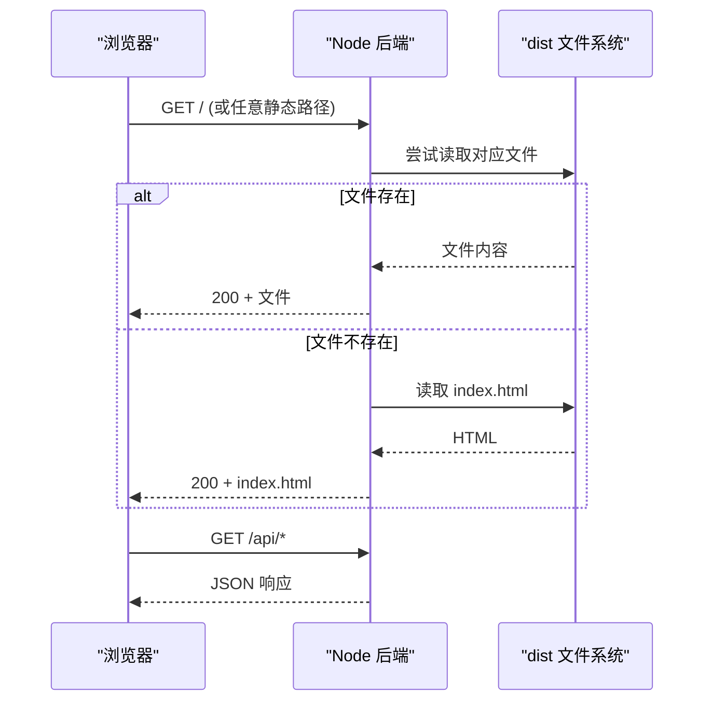
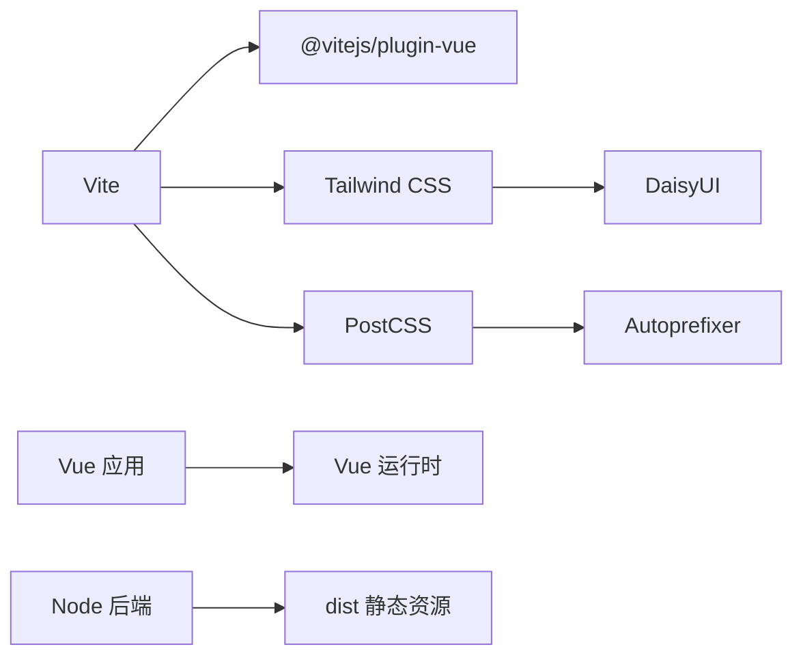

# 构建配置

<cite>
**本文引用的文件**
- [vite.config.js](file://vite.config.js)
- [postcss.config.js](file://postcss.config.js)
- [tailwind.config.js](file://tailwind.config.js)
- [package.json](file://package.json)
- [web/index.html](file://web/index.html)
- [web/src/main.js](file://web/src/main.js)
- [web/src/style.css](file://web/src/style.css)
- [server/server.js](file://server/server.js)
- [config.json](file://config.json)
</cite>

## 目录
1. [简介](#简介)
2. [项目结构](#项目结构)
3. [核心组件](#核心组件)
4. [架构总览](#架构总览)
5. [详细组件分析](#详细组件分析)
6. [依赖关系分析](#依赖关系分析)
7. [性能考量](#性能考量)
8. [故障排查指南](#故障排查指南)
9. [结论](#结论)
10. [附录](#附录)

## 简介
本文件面向 Stock Advisor 项目的构建与打包配置，聚焦以下方面：
- Vite 构建工具的配置选项与优化设置（开发服务器、生产构建、插件）
- PostCSS 处理流程（Autoprefixer、Tailwind CSS、样式链）
- 包管理与脚本命令、环境变量约定
- 构建性能优化策略（代码分割、资源压缩、缓存）
- 开发工作流（热重载、调试、代理）
- 部署与 CI/CD 集成建议

## 项目结构
前端源码位于 web 子目录，由 Vite 以 web 为根进行开发与构建；后端 Node 服务在 server 目录，负责托管 API 与静态产物。构建产物输出到项目根 dist，由后端统一提供静态资源与 SPA 路由兜底。

图表来源
- [vite.config.js:7-24](file://vite.config.js#L7-L24)
- [web/index.html:1-13](file://web/index.html#L1-L13)
- [web/src/main.js:1-6](file://web/src/main.js#L1-L6)
- [web/src/style.css:1-34](file://web/src/style.css#L1-L34)
- [server/server.js:35-53](file://server/server.js#L35-L53)

章节来源
- [vite.config.js:7-24](file://vite.config.js#L7-L24)
- [web/index.html:1-13](file://web/index.html#L1-L13)
- [web/src/main.js:1-6](file://web/src/main.js#L1-L6)
- [web/src/style.css:1-34](file://web/src/style.css#L1-L34)
- [server/server.js:35-53](file://server/server.js#L35-L53)

## 核心组件
- Vite 配置：定义 root、插件、构建输出、开发服务器与代理
- PostCSS 配置：启用 Tailwind CSS 与 Autoprefixer
- Tailwind 配置：主题、内容扫描范围、DaisyUI 主题
- 包管理：脚本命令、依赖声明、Node 版本要求
- 服务端：静态资源托管与 API 路由，SPA 回退逻辑

章节来源
- [vite.config.js:7-24](file://vite.config.js#L7-L24)
- [postcss.config.js:1-7](file://postcss.config.js#L1-L7)
- [tailwind.config.js:4-53](file://tailwind.config.js#L4-L53)
- [package.json:7-30](file://package.json#L7-L30)
- [server/server.js:35-53](file://server/server.js#L35-L53)

## 架构总览
下图展示了从源码到最终产物的构建链路，以及运行时前后端交互方式。

图表来源
- [vite.config.js:7-24](file://vite.config.js#L7-L24)
- [server/server.js:35-53](file://server/server.js#L35-L53)

## 详细组件分析

### Vite 构建配置
- 入口与插件
  - root 指向 web，使用 @vitejs/plugin-vue 支持 Vue 单文件组件
- 构建输出
  - outDir 指向项目根 dist，emptyOutDir 确保每次构建清理旧产物
- 开发服务器
  - host 绑定 0.0.0.0，便于局域网访问
  - port 默认 5173
  - proxy 将 /api 请求转发到本地后端 127.0.0.1:3000，开启 changeOrigin 避免跨域问题
- 生产构建
  - 当前未显式配置 chunk 拆分、sourcemap、minify 等，采用 Vite 默认策略

优化建议（可选）
- 按需引入与 Tree-shaking：保持 Vue 3 与第三方库的 ESM 导入，利于摇树
- 代码分割：可按路由或大组件拆分 chunk，减少首屏体积
- 资源压缩：可启用 gzip/brotli 并在 Nginx/反向代理层开启
- 缓存策略：利用文件名哈希（Vite 默认），配合 CDN 长缓存

章节来源
- [vite.config.js:7-24](file://vite.config.js#L7-L24)

### PostCSS 处理流程
- 插件链
  - tailwindcss：解析 @tailwind 指令与类名扫描
  - autoprefixer：根据目标浏览器自动添加前缀
- 样式入口
  - web/src/style.css 中引入 base/components/utilities，并通过自定义样式覆盖滚动条与按钮样式
- 主题与内容
  - tailwind.config.js 指定 content 扫描 web/index.html 与 web/src 下的 .vue/.js
  - 启用 darkMode: class，结合 <html data-theme="stockdark"> 实现深浅主题切换
  - 通过 daisyui 配置 stocklight/stockdark 两套主题色板

图表来源
- [postcss.config.js:1-7](file://postcss.config.js#L1-L7)
- [tailwind.config.js:4-53](file://tailwind.config.js#L4-L53)
- [web/src/style.css:1-34](file://web/src/style.css#L1-L34)

章节来源
- [postcss.config.js:1-7](file://postcss.config.js#L1-L7)
- [tailwind.config.js:4-53](file://tailwind.config.js#L4-L53)
- [web/src/style.css:1-34](file://web/src/style.css#L1-L34)

### 包管理与脚本命令
- 脚本命令
  - start：启动后端服务
  - dev：启动 Vite 开发服务器（含 HMR、代理）
  - build：执行生产构建，输出到 dist
  - preview：预览构建产物
  - import:csv / import:csv:new：运行 CSV 导入脚本
- 依赖与引擎
  - 依赖包含 Vue、Tailwind、DaisyUI、PostCSS、Autoprefixer、Vite 等
  - engines.node >= 18，保证现代语法与特性可用

章节来源
- [package.json:7-30](file://package.json#L7-L30)

### 环境变量与配置
- 前端
  - 当前未使用 Vite 环境变量注入（如 VITE_ 前缀变量），如需可在 vite.config.js 中通过 defineConfig 暴露
- 后端
  - 通过 config.json 加载运行时配置（调度间隔、服务器端口、飞书 Webhook、通知冷却等）
  - server/server.js 读取 DIST 路径用于静态资源托管

章节来源
- [config.json:1-19](file://config.json#L1-L19)
- [server/server.js:18-21](file://server/server.js#L18-L21)

### 构建产物与服务端托管
- 构建产物
  - 由 Vite 输出到项目根 dist，包含 HTML、JS、CSS 及资源文件
- 服务端托管
  - server/server.js 提供 HTTP 服务，优先匹配精确静态文件，不存在则回退到 index.html（SPA 路由）
  - 对 /api/* 的请求交由 handleApi 处理，返回 JSON 数据

图表来源
- [server/server.js:35-53](file://server/server.js#L35-L53)

章节来源
- [server/server.js:35-53](file://server/server.js#L35-L53)

## 依赖关系分析
- 构建期依赖
  - Vite 作为构建与开发服务器核心
  - @vitejs/plugin-vue 提供 Vue SFC 支持
  - Tailwind CSS + DaisyUI 提供原子化样式与组件主题
  - PostCSS + Autoprefixer 完成样式后处理与前缀补全
- 运行期依赖
  - Vue 3 渲染前端界面
  - Node 后端提供 API 与静态资源托管

图表来源
- [package.json:19-30](file://package.json#L19-L30)
- [vite.config.js:7-24](file://vite.config.js#L7-L24)
- [postcss.config.js:1-7](file://postcss.config.js#L1-L7)
- [tailwind.config.js:4-53](file://tailwind.config.js#L4-L53)

章节来源
- [package.json:19-30](file://package.json#L19-L30)
- [vite.config.js:7-24](file://vite.config.js#L7-L24)
- [postcss.config.js:1-7](file://postcss.config.js#L1-L7)
- [tailwind.config.js:4-53](file://tailwind.config.js#L4-L53)

## 性能考量
- 代码分割
  - 当前未显式配置 splitChunks，可按需拆分路由或大型组件，降低首屏体积
- 资源压缩
  - 可使用 gzip/brotli 压缩静态资源，并在 Nginx/反向代理层开启
- 缓存策略
  - Vite 默认对 JS/CSS 输出带哈希文件名，适合 CDN 长缓存
  - 建议对 index.html 禁用长缓存或使用短缓存，以便及时获取新入口
- 构建速度
  - 保持依赖稳定，避免不必要的 polyfill
  - 合理配置 Tailwind content 扫描范围，减少无用 CSS 生成
- 运行时性能
  - 合理使用 Vue 3 组合式 API 与异步组件
  - 图片等资源按需懒加载

[本节为通用指导，不直接分析具体文件]

## 故障排查指南
- 开发环境无法访问后端 API
  - 检查 vite.config.js 中的 proxy 是否指向正确的后端地址与端口
  - 确认后端服务已启动且监听 3000 端口
- 构建后页面 404
  - 确认构建产物已输出到 dist，且后端能正确读取
  - 检查 server/server.js 的静态托管逻辑与 SPA 回退
- 样式未生效或主题异常
  - 检查 postcss.config.js 与 tailwind.config.js 是否正确启用
  - 确认 web/src/style.css 引入了 @tailwind 指令
  - 检查 <html> 的 data-theme 或 class 是否与主题切换逻辑一致
- 热重载不生效
  - 确认使用 npm run dev 启动，而非直接打开 HTML
  - 检查浏览器控制台是否有网络错误

章节来源
- [vite.config.js:14-24](file://vite.config.js#L14-L24)
- [server/server.js:35-53](file://server/server.js#L35-L53)
- [postcss.config.js:1-7](file://postcss.config.js#L1-L7)
- [tailwind.config.js:4-53](file://tailwind.config.js#L4-L53)
- [web/src/style.css:1-34](file://web/src/style.css#L1-L34)

## 结论
本项目采用 Vite + Vue 3 的现代前端构建方案，结合 Tailwind CSS 与 DaisyUI 快速构建 UI，PostCSS 链完成样式后处理。后端 Node 服务统一托管 API 与静态资源，简化部署。当前构建配置简洁清晰，建议在后续迭代中按需增强代码分割、资源压缩与缓存策略，以提升首屏性能与可维护性。

[本节为总结性内容，不直接分析具体文件]

## 附录

### 开发工作流
- 启动开发服务器：npm run dev
  - 自动热重载、HMR、代理 /api 到后端
- 构建生产版本：npm run build
  - 输出到 dist，随后启动后端服务即可访问
- 预览构建产物：npm run preview
  - 本地验证构建结果

章节来源
- [package.json:7-14](file://package.json#L7-L14)
- [vite.config.js:7-24](file://vite.config.js#L7-L24)

### 部署与 CI/CD 建议
- 构建阶段
  - 安装依赖并执行 npm run build，产出 dist
- 运行阶段
  - 启动后端服务，静态资源由 server/server.js 托管
- 反向代理
  - 可将域名映射到后端端口，并开启 gzip/brotli
- 环境变量
  - 可通过配置文件（如 config.json）或环境变量注入后端参数
- 持续集成
  - 在 CI 中执行构建与基础测试，校验产物完整性

章节来源
- [server/server.js:35-53](file://server/server.js#L35-L53)
- [config.json:1-19](file://config.json#L1-L19)