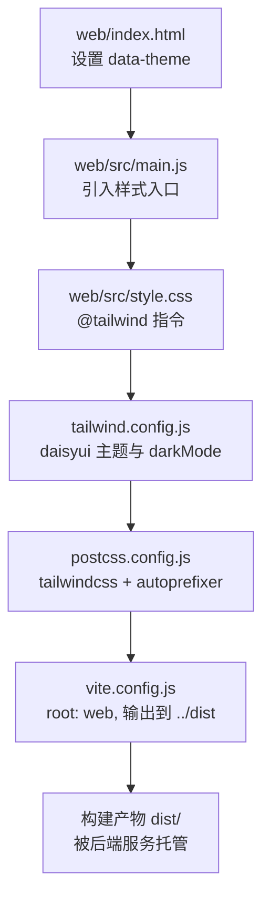
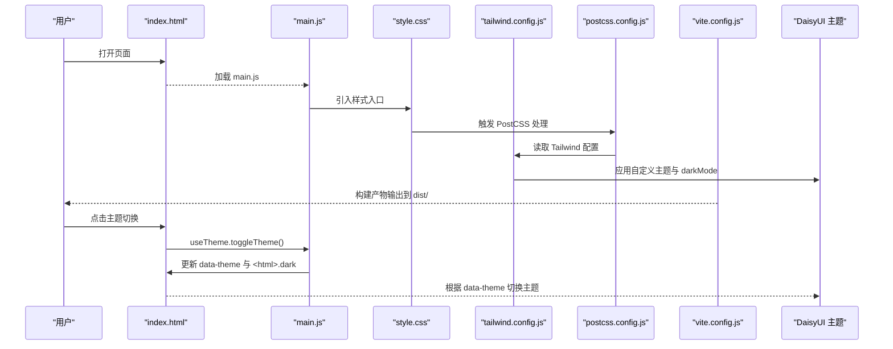
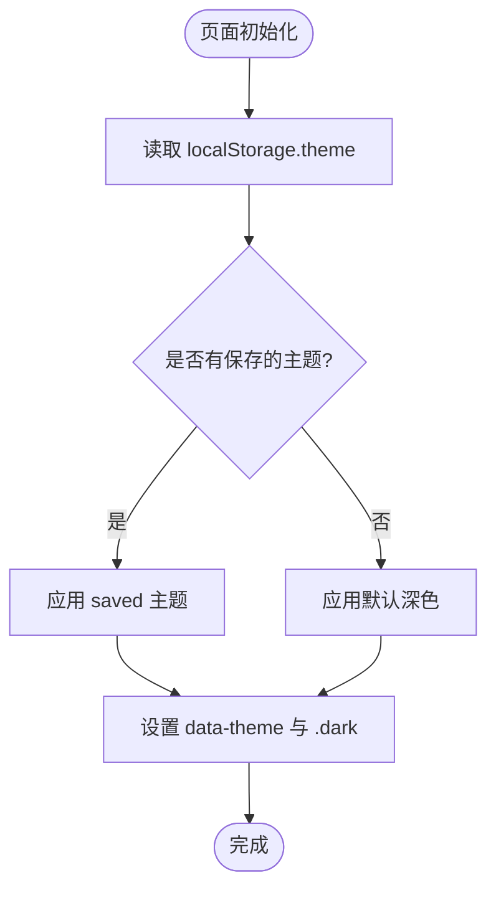
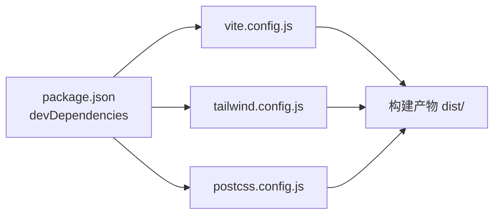

# 样式系统

<cite>
**本文引用的文件**
- [tailwind.config.js](file://tailwind.config.js)
- [postcss.config.js](file://postcss.config.js)
- [vite.config.js](file://vite.config.js)
- [web/src/style.css](file://web/src/style.css)
- [web/index.html](file://web/index.html)
- [web/src/main.js](file://web/src/main.js)
- [web/src/App.vue](file://web/src/App.vue)
- [web/src/composables/useTheme.js](file://web/src/composables/useTheme.js)
- [web/src/components/AppHeader.vue](file://web/src/components/AppHeader.vue)
- [web/src/components/OverviewCards.vue](file://web/src/components/OverviewCards.vue)
- [web/src/components/HoldingCard.vue](file://web/src/components/HoldingCard.vue)
- [package.json](file://package.json)
</cite>

## 目录
1. [简介](#简介)
2. [项目结构](#项目结构)
3. [核心组件](#核心组件)
4. [架构总览](#架构总览)
5. [详细组件分析](#详细组件分析)
6. [依赖关系分析](#依赖关系分析)
7. [性能考虑](#性能考虑)
8. [故障排查指南](#故障排查指南)
9. [结论](#结论)
10. [附录](#附录)

## 简介
本文件为 Stock Advisor 前端样式系统的完整技术文档，聚焦 Tailwind CSS 与 DaisyUI 的集成配置、主题与暗色模式、响应式布局策略、组件样式组织、样式性能优化、浏览器兼容性与调试方法。目标是帮助开发者快速理解并高效维护该项目的视觉与交互一致性。

## 项目结构
前端源码位于 web/ 子目录，使用 Vite + Vue 3 构建；Tailwind CSS 与 DaisyUI 通过 PostCSS 接入，主题由 Tailwind 配置与 HTML data-theme 共同驱动。

图表来源
- [web/index.html:1-13](file://web/index.html#L1-L13)
- [web/src/main.js:1-6](file://web/src/main.js#L1-L6)
- [web/src/style.css:1-34](file://web/src/style.css#L1-L34)
- [tailwind.config.js:1-54](file://tailwind.config.js#L1-L54)
- [postcss.config.js:1-7](file://postcss.config.js#L1-L7)
- [vite.config.js:1-26](file://vite.config.js#L1-L26)

章节来源
- [vite.config.js:1-26](file://vite.config.js#L1-L26)
- [package.json:1-32](file://package.json#L1-L32)

## 核心组件
- Tailwind 与 DaisyUI 集成：通过 tailwind.config.js 启用 daisyui 插件，定义两套自定义主题 stocklight 与 stockdark，并开启 class 模式的暗色切换。
- 主题与暗色模式：在 index.html 中设置 data-theme 初始值；useTheme 组合式函数负责读取本地存储、切换 html 的 dark 类与 data-theme，实现亮/暗主题切换。
- 样式入口：style.css 引入 @tailwind base/components/utilities，并补充全局滚动条与按钮文字等微调。
- 构建管线：Vite 以 web 为根目录构建，PostCSS 处理 Tailwind 与 Autoprefixer，最终产物输出到项目根 dist/ 并由后端统一托管。

章节来源
- [tailwind.config.js:1-54](file://tailwind.config.js#L1-L54)
- [web/src/composables/useTheme.js:1-26](file://web/src/composables/useTheme.js#L1-L26)
- [web/index.html:1-13](file://web/index.html#L1-L13)
- [web/src/style.css:1-34](file://web/src/style.css#L1-L34)
- [postcss.config.js:1-7](file://postcss.config.js#L1-L7)
- [vite.config.js:1-26](file://vite.config.js#L1-L26)

## 架构总览
下图展示了从页面初始化到主题切换的样式链路，以及 Tailwind/DaisyUI 在构建时的作用位置。

图表来源
- [web/index.html:1-13](file://web/index.html#L1-L13)
- [web/src/main.js:1-6](file://web/src/main.js#L1-L6)
- [web/src/style.css:1-34](file://web/src/style.css#L1-L34)
- [tailwind.config.js:1-54](file://tailwind.config.js#L1-L54)
- [postcss.config.js:1-7](file://postcss.config.js#L1-L7)
- [vite.config.js:1-26](file://vite.config.js#L1-L26)

## 详细组件分析

### Tailwind 与 DaisyUI 集成配置
- 内容扫描范围：仅扫描 web/index.html 与 web/src 下的 .vue/.js，减少无用 CSS。
- 暗色模式：采用 class 模式，配合 <html class="dark"> 与 data-theme 联动。
- 主题定义：
  - 亮色主题 stocklight：以白/浅灰为基底，功能色 primary/success/warning/error/info 来自产品规范。
  - 暗色主题 stockdark：以黑/深灰为基底，base-content 反转为白色，确保可读性。
  - darkTheme 指定为 stockdark，当 <html> 存在 dark 类时自动切换。
- 插件：启用 daisyui 插件，提供丰富的 UI 组件类（如 btn、badge、input、modal 等）。

章节来源
- [tailwind.config.js:1-54](file://tailwind.config.js#L1-L54)

### 主题与暗色模式实现
- 默认主题：index.html 设置 data-theme="stockdark"，保证首次加载为深色。
- 状态管理：useTheme 维护 isDark，initTheme 从 localStorage 恢复偏好，toggleTheme 写入本地存储并同步到 DOM。
- 切换机制：
  - 设置 document.documentElement.dataset.theme = 'stocklight' | 'stockdark'
  - 同时 toggle <html> 的 dark 类，使 Tailwind 的 dark: 前缀生效
- 组件联动：AppHeader 暴露 toggle-theme 事件，调用 useTheme.toggleTheme。

图表来源
- [web/src/composables/useTheme.js:1-26](file://web/src/composables/useTheme.js#L1-L26)
- [web/index.html:1-13](file://web/index.html#L1-L13)
- [web/src/App.vue:1-197](file://web/src/App.vue#L1-L197)

章节来源
- [web/src/composables/useTheme.js:1-26](file://web/src/composables/useTheme.js#L1-L26)
- [web/index.html:1-13](file://web/index.html#L1-L13)
- [web/src/App.vue:1-197](file://web/src/App.vue#L1-L197)

### 响应式设计模式
- 断点与栅格：广泛使用 Tailwind 的 sm/md/lg 等断点与 grid-cols-* 进行多列布局，例如概览卡片在小屏双列、中屏三列、大屏五列。
- 弹性布局：header 与卡片头部使用 flex 与 wrap，适配窄屏换行。
- 间距与排版：通过 px-*/py*、gap-*、text-xs/sm/base 等工具类控制密度与层级。
- 可访问性：使用 tabular-nums 对齐数字，提升数据表格的可读性。

章节来源
- [web/src/components/OverviewCards.vue:1-41](file://web/src/components/OverviewCards.vue#L1-L41)
- [web/src/components/AppHeader.vue:1-64](file://web/src/components/AppHeader.vue#L1-L64)
- [web/src/components/HoldingCard.vue:1-161](file://web/src/components/HoldingCard.vue#L1-L161)

### 组件样式组织与复用
- 命名规范：
  - 优先使用 Tailwind 原子类描述布局与外观，避免自定义类泛滥。
  - 仅在必要时扩展全局样式（如滚动条、按钮文字），集中在 style.css。
- 复用模式：
  - 颜色与语义：通过 DaisyUI 的语义化变量（primary/success/warning/error/info）与 base-*/base-content 保持主题一致。
  - 组件内样式：将样式直接写在模板类名中，便于按组件粒度维护。
- 主题切换：所有组件通过 data-theme 与 dark: 前缀自适应明暗主题，无需额外逻辑。

章节来源
- [web/src/style.css:1-34](file://web/src/style.css#L1-L34)
- [web/src/components/HoldingCard.vue:1-161](file://web/src/components/HoldingCard.vue#L1-L161)
- [web/src/components/AppHeader.vue:1-64](file://web/src/components/AppHeader.vue#L1-L64)

### 暗色模式的样式处理
- 颜色变量管理：
  - 亮/暗主题分别定义 base-100/200/300 与 base-content，确保背景与文本对比度。
  - 功能色保持一致，但通过 base-content 变化保证可读性。
- 界面适配：
  - 使用 backdrop-blur 与半透明背景营造层次。
  - 滚动条与按钮在暗色下仍保持良好对比度。

章节来源
- [tailwind.config.js:1-54](file://tailwind.config.js#L1-L54)
- [web/src/style.css:1-34](file://web/src/style.css#L1-L34)

## 依赖关系分析
- 构建依赖：
  - vite、@vitejs/plugin-vue：Vue 单文件组件与开发服务器。
  - tailwindcss、daisyui、postcss、autoprefixer：样式生成与兼容性前缀。
- 运行时依赖：
  - vue：组件框架。
- 构建流程：
  - Vite 以 web 为 root，编译 Vue 与 CSS，PostCSS 处理 Tailwind 与 Autoprefixer，输出到 ../dist。
  - 后端 Node 服务托管 dist 静态资源。

图表来源
- [package.json:1-32](file://package.json#L1-L32)
- [vite.config.js:1-26](file://vite.config.js#L1-L26)
- [tailwind.config.js:1-54](file://tailwind.config.js#L1-L54)
- [postcss.config.js:1-7](file://postcss.config.js#L1-L7)

章节来源
- [package.json:1-32](file://package.json#L1-L32)
- [vite.config.js:1-26](file://vite.config.js#L1-L26)

## 性能考虑
- 按需引入与内容裁剪：
  - tailwind.config.js 的 content 精确指向 web/index.html 与 web/src/**/*.{vue,js}，避免打包未使用的样式。
- 构建优化：
  - Vite 生产构建会压缩 CSS/JS，配合 Purge/Tailwind 的内容扫描，进一步减小体积。
  - postcss 启用 autoprefixer，确保跨浏览器兼容且不影响体积过大。
- 主题与暗色模式：
  - 使用 data-theme 切换，避免重复加载多套样式，减少运行时开销。
- 建议：
  - 保持 content 路径最小化，避免包含测试或无关目录。
  - 谨慎添加全局样式，优先使用原子类与 DaisyUI 组件类。
  - 对大列表或复杂卡片，注意懒加载与虚拟滚动（业务层），避免样式重排过多。

[本节为通用指导，不直接分析具体文件]

## 故障排查指南
- 主题不生效：
  - 检查 index.html 的 data-theme 是否设置正确。
  - 确认 useTheme 是否正确写入 localStorage 并更新 <html>.dark。
  - 验证 tailwind.config.js 的 darkMode 是否为 class，且 darkTheme 指向 stockdark。
- 样式未生效：
  - 检查 style.css 是否引入了 @tailwind base/components/utilities。
  - 确认 vite.config.js 的 root 指向 web，构建产物输出到 ../dist。
  - 查看 postcss.config.js 是否包含 tailwindcss 与 autoprefixer。
- 移动端显示异常：
  - 检查 viewport meta 标签是否存在。
  - 核对栅格断点与 flex-wrap 的使用是否符合预期。
- 浏览器兼容问题：
  - 确认 autoprefixer 已启用，必要时调整目标浏览器配置。
  - 对于旧版浏览器，检查 CSS 特性（如 backdrop-blur）的降级方案。

章节来源
- [web/src/composables/useTheme.js:1-26](file://web/src/composables/useTheme.js#L1-L26)
- [tailwind.config.js:1-54](file://tailwind.config.js#L1-L54)
- [web/src/style.css:1-34](file://web/src/style.css#L1-L34)
- [postcss.config.js:1-7](file://postcss.config.js#L1-L7)
- [vite.config.js:1-26](file://vite.config.js#L1-L26)

## 结论
本项目通过 Tailwind CSS 与 DaisyUI 的组合，实现了高度一致的视觉体系与便捷的暗色模式切换。主题以 data-theme 为核心，结合 Tailwind 的 class 模式暗色开关，既保证了构建期样式裁剪，又提供了灵活的运行时主题切换。响应式布局基于原子类与栅格系统，易于维护与扩展。建议在后续迭代中继续保持“原子类优先、全局样式克制”的原则，并结合业务场景持续优化性能与可访问性。

[本节为总结性内容，不直接分析具体文件]

## 附录
- 常用主题变量参考：
  - base-100/200/300：背景层级
  - base-content：文本与图标主色
  - primary/success/warning/error/info：功能语义色
- 常用组件类参考：
  - btn/badge/input/modal/card 等，遵循 DaisyUI 命名约定
- 断点参考：
  - sm/md/lg/xl 等，用于栅格与间距调整

[本节为概念性说明，不直接分析具体文件]