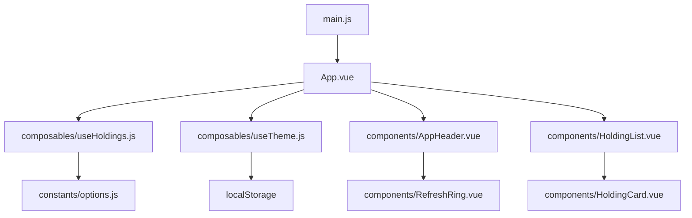
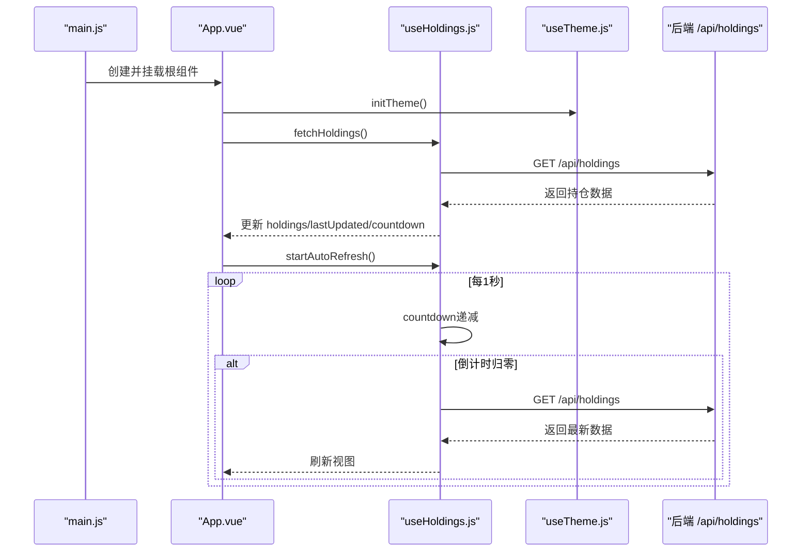
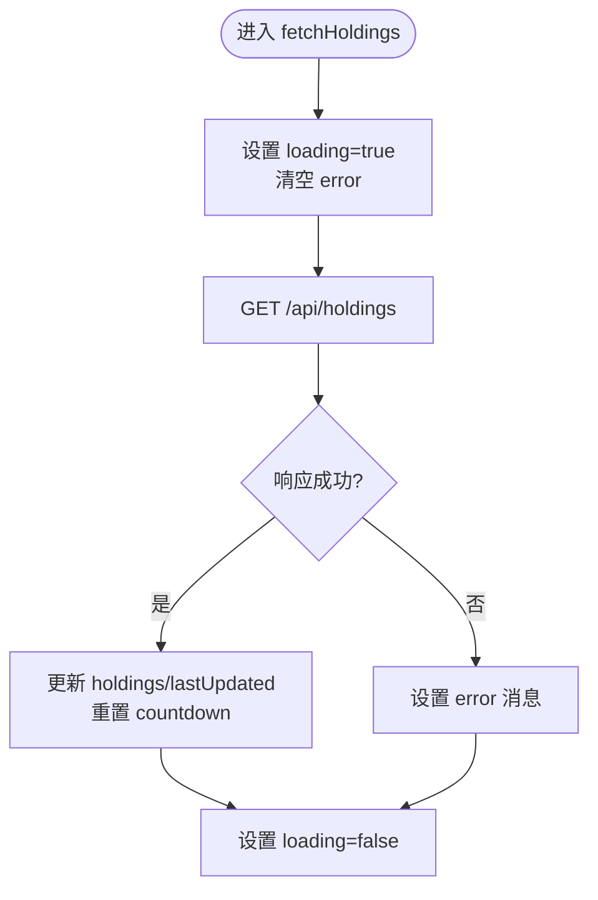
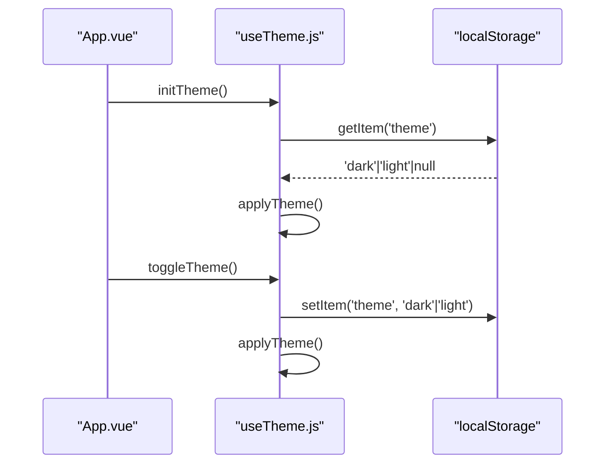
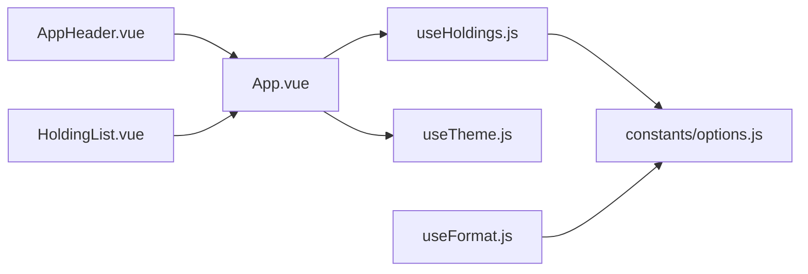

# 状态管理

<cite>
**本文引用的文件**
- [web/src/composables/useHoldings.js](file://web/src/composables/useHoldings.js)
- [web/src/composables/useTheme.js](file://web/src/composables/useTheme.js)
- [web/src/composables/useFormat.js](file://web/src/composables/useFormat.js)
- [web/src/App.vue](file://web/src/App.vue)
- [web/src/components/AppHeader.vue](file://web/src/components/AppHeader.vue)
- [web/src/components/HoldingList.vue](file://web/src/components/HoldingList.vue)
- [web/src/constants/options.js](file://web/src/constants/options.js)
- [web/src/main.js](file://web/src/main.js)
</cite>

## 目录
1. [简介](#简介)
2. [项目结构](#项目结构)
3. [核心组件](#核心组件)
4. [架构总览](#架构总览)
5. [详细组件分析](#详细组件分析)
6. [依赖关系分析](#依赖关系分析)
7. [性能考量](#性能考量)
8. [故障排查指南](#故障排查指南)
9. [结论](#结论)
10. [附录](#附录)

## 简介
本文件面向 Stock Advisor 前端的状态管理，重点阐述基于 Vue Composition API 的组合式函数模式。文档深入解析 useHoldings 的设计与实现，覆盖持仓数据的获取、缓存、更新机制（自动刷新、错误处理、加载状态），主题切换（深色/浅色）的本地存储与动态切换，以及格式化函数的封装与使用模式。同时提供状态管理的最佳实践（性能优化、内存管理、调试技巧）和自定义组合式函数的开发规范与测试方法。

## 项目结构
前端采用“组合式函数 + 组件”的分层组织方式：
- composables：组合式函数，负责状态、副作用与业务逻辑（useHoldings、useTheme、useFormat）。
- components：UI 组件，消费组合式函数暴露的状态与方法。
- constants：常量与枚举（如刷新间隔、地区标签等）。
- App.vue：应用根组件，初始化主题、启动自动刷新、编排弹窗与过滤。
- main.js：应用入口，挂载根组件。

图表来源
- [web/src/main.js:1-6](file://web/src/main.js#L1-L6)
- [web/src/App.vue:1-197](file://web/src/App.vue#L1-L197)
- [web/src/composables/useHoldings.js:1-154](file://web/src/composables/useHoldings.js#L1-L154)
- [web/src/composables/useTheme.js:1-26](file://web/src/composables/useTheme.js#L1-L26)
- [web/src/constants/options.js:1-33](file://web/src/constants/options.js#L1-L33)

章节来源
- [web/src/main.js:1-6](file://web/src/main.js#L1-L6)
- [web/src/App.vue:1-197](file://web/src/App.vue#L1-L197)
- [web/src/composables/useHoldings.js:1-154](file://web/src/composables/useHoldings.js#L1-L154)
- [web/src/composables/useTheme.js:1-26](file://web/src/composables/useTheme.js#L1-L26)
- [web/src/constants/options.js:1-33](file://web/src/constants/options.js#L1-L33)

## 核心组件
- useHoldings：模块级单例状态，集中管理持仓数据、加载/错误状态、自动刷新倒计时、汇总计算与写操作（添加、交易、买入记录、删除、更新）。
- useTheme：主题状态（深色/浅色），持久化到 localStorage，并同步到 DOM 属性与类名。
- useFormat：纯格式化函数集合（金额、价格、数量、百分比、日期、收益颜色、徽章映射），无副作用便于复用与测试。

章节来源
- [web/src/composables/useHoldings.js:1-154](file://web/src/composables/useHoldings.js#L1-L154)
- [web/src/composables/useTheme.js:1-26](file://web/src/composables/useTheme.js#L1-L26)
- [web/src/composables/useFormat.js:1-70](file://web/src/composables/useFormat.js#L1-L70)

## 架构总览
整体流程：应用启动时初始化主题、拉取一次持仓数据并启动自动刷新；各组件通过 useHoldings 共享同一份数据与操作方法；主题切换通过 useTheme 在根级别生效；格式化函数在各组件中按需调用。

图表来源
- [web/src/main.js:1-6](file://web/src/main.js#L1-L6)
- [web/src/App.vue:121-129](file://web/src/App.vue#L121-L129)
- [web/src/composables/useHoldings.js:15-43](file://web/src/composables/useHoldings.js#L15-L43)
- [web/src/composables/useTheme.js:10-15](file://web/src/composables/useTheme.js#L10-L15)

## 详细组件分析

### useHoldings：持仓状态管理
- 状态设计
  - 模块级单例 ref：holdings、lastUpdated、loading、error、countdown。所有组件共享同一份数据，避免重复请求与状态不一致。
  - 定时器 tick：单一定时器驱动自动刷新，避免多定时器漂移。
- 数据获取与缓存
  - fetchHoldings：发起 GET /api/holdings，成功后写入 holdings、更新时间、重置倒计时；失败时设置 error；finally 关闭 loading。
  - 自动刷新：startAutoRefresh 启动每秒心跳递减，倒计时归零触发 fetchHoldings；stopAutoRefresh 清理定时器。
- 写操作与一致性
  - addHolding、submitTransaction、savePurchase、deletePurchase、updateHolding：统一通过 fetch 调用后端接口，成功后 await fetchHoldings 保证列表与详情一致。
- 汇总计算
  - computed 派生 totalCost、totalMarket、totalHoldingProfit、totalTodayProfit，用于概览卡片展示。
- 错误处理与加载状态
  - loading 控制全局加载态；error 显示错误信息；finally 确保 loading 复位。
- 导出接口
  - 暴露状态、方法与汇总值，供 App 及子组件使用。

图表来源
- [web/src/composables/useHoldings.js:15-29](file://web/src/composables/useHoldings.js#L15-L29)

章节来源
- [web/src/composables/useHoldings.js:1-154](file://web/src/composables/useHoldings.js#L1-L154)

### useTheme：主题切换与持久化
- 状态与渲染
  - isDark：布尔状态，默认 true（深色）。
  - applyTheme：根据 isDark 设置 documentElement 的 data-theme 与 dark 类名，实现 Tailwind 深色模式切换。
- 初始化与持久化
  - initTheme：从 localStorage 读取 theme，若不存在则默认深色；调用 applyTheme。
  - toggleTheme：切换 isDark，写入 localStorage，并应用主题。
- 使用方式
  - App 在 onMounted 调用 initTheme，并在模板中绑定 isDark 与 toggleTheme。

图表来源
- [web/src/composables/useTheme.js:10-21](file://web/src/composables/useTheme.js#L10-L21)
- [web/src/App.vue:121-125](file://web/src/App.vue#L121-L125)

章节来源
- [web/src/composables/useTheme.js:1-26](file://web/src/composables/useTheme.js#L1-L26)
- [web/src/App.vue:121-129](file://web/src/App.vue#L121-L129)

### useFormat：格式化函数封装
- 设计原则
  - 纯函数、无副作用、可单测、易复用。
- 主要能力
  - 数值格式化：fmt、fmtMoney、fmtPrice、fmtQty、fmtPct、fmtDate。
  - 视觉辅助：profitCls（收益红绿）、triggerBadge（策略状态徽章）、regionBadge（地区徽章）、strategyBadge（策略徽章）。
- 使用模式
  - 在模板或逻辑中直接调用，传入原始数据，输出格式化后的字符串或样式类。

章节来源
- [web/src/composables/useFormat.js:1-70](file://web/src/composables/useFormat.js#L1-L70)

### App.vue：编排与生命周期
- 初始化
  - onMounted：initTheme、fetchHoldings、startAutoRefresh。
  - onUnmounted：stopAutoRefresh、清理测试消息定时器。
- 状态透传
  - 将 useHoldings 暴露的 holdings、loading、error、countdown、汇总值等传递给 AppHeader、OverviewCards、HoldingList。
- 用户交互
  - 事件转发：toggle-theme、refresh、test-feishu、add、import-csv。
  - 弹窗状态：showAdd/showTxn/showBuy/showImport 与表单数据。
- 过滤
  - activeFilters 多选过滤类型与市场，computed filteredHoldings 派生过滤结果。

章节来源
- [web/src/App.vue:1-197](file://web/src/App.vue#L1-L197)

### AppHeader.vue：头部状态展示
- 接收 props：lastUpdated、loading、error、countdown、isDark、testing、testMsg、ringC、ringOffset。
- 事件 emit：toggle-theme、refresh、test-feishu、add、import-csv。
- 展示：更新时间、加载提示、倒计时环形进度、主题切换按钮、导入 CSV、刷新、飞书测试、添加持仓。

章节来源
- [web/src/components/AppHeader.vue:1-64](file://web/src/components/AppHeader.vue#L1-L64)

### HoldingList.vue：列表容器
- 接收 holdings 数组，渲染 HoldingCard。
- 事件透传：open-txn、open-add-buy、edit-buy、delete-buy，携带对应 holding 对象。

章节来源
- [web/src/components/HoldingList.vue:1-36](file://web/src/components/HoldingList.vue#L1-L36)

## 依赖关系分析
- 组件依赖组合式函数：App.vue 依赖 useHoldings 与 useTheme；各弹窗组件通过 useHoldings 的方法进行写操作。
- 常量依赖：useHoldings 依赖 REFRESH_MS；useFormat 依赖 INVEST_STRATEGIES 与 REGION_LABEL。
- 外部依赖：浏览器 localStorage、Fetch API、Vue 响应式系统。

图表来源
- [web/src/App.vue:1-197](file://web/src/App.vue#L1-L197)
- [web/src/composables/useHoldings.js:1-154](file://web/src/composables/useHoldings.js#L1-L154)
- [web/src/composables/useTheme.js:1-26](file://web/src/composables/useTheme.js#L1-L26)
- [web/src/composables/useFormat.js:1-70](file://web/src/composables/useFormat.js#L1-L70)
- [web/src/constants/options.js:1-33](file://web/src/constants/options.js#L1-L33)

章节来源
- [web/src/App.vue:1-197](file://web/src/App.vue#L1-L197)
- [web/src/composables/useHoldings.js:1-154](file://web/src/composables/useHoldings.js#L1-L154)
- [web/src/composables/useTheme.js:1-26](file://web/src/composables/useTheme.js#L1-L26)
- [web/src/composables/useFormat.js:1-70](file://web/src/composables/useFormat.js#L1-L70)
- [web/src/constants/options.js:1-33](file://web/src/constants/options.js#L1-L33)

## 性能考量
- 单例状态与单一数据源
  - useHoldings 使用模块级 ref 作为单一数据源，避免多实例导致的数据不一致与重复请求。
- 自动刷新节流
  - 单一定时器驱动，每秒递减倒计时，归零才刷新，减少频繁网络请求与 UI 抖动。
- 计算属性优化
  - 汇总指标使用 computed 派生，仅在 holdings 变化时重新计算。
- 资源释放
  - onUnmounted 中 stopAutoRefresh 与清理测试消息定时器，防止内存泄漏。
- 本地存储
  - 主题切换使用 localStorage，避免每次启动重新选择。
- 建议
  - 对大列表渲染考虑虚拟滚动或分页；对高频更新字段可引入防抖；在网络不稳定时可加入重试与退避策略。

[本节为通用指导，不直接分析具体文件]

## 故障排查指南
- 无法获取持仓数据
  - 检查 loading/error 状态；查看控制台网络请求是否成功；确认后端 /api/holdings 可用。
- 自动刷新未生效
  - 确认 startAutoRefresh 已调用且未重复创建定时器；检查 onUnmounted 是否正确清理；核对 REFRESH_MS 配置。
- 主题未持久化
  - 检查 localStorage 是否被浏览器限制；确认 initTheme 在 onMounted 执行；验证 applyTheme 是否正确设置 data-theme 与 dark 类。
- 写操作失败
  - 查看对应方法的错误捕获与错误提示；确认后端接口返回码与错误字段；必要时增加日志与重试。
- 内存泄漏
  - 确保组件卸载时清理定时器与监听器；避免闭包持有大对象引用。

章节来源
- [web/src/composables/useHoldings.js:15-43](file://web/src/composables/useHoldings.js#L15-L43)
- [web/src/App.vue:121-129](file://web/src/App.vue#L121-L129)
- [web/src/composables/useTheme.js:10-21](file://web/src/composables/useTheme.js#L10-L21)

## 结论
本项目以组合式函数为核心，实现了清晰的状态分层与职责分离。useHoldings 统一管理持仓数据与生命周期，useTheme 提供轻量主题切换与持久化，useFormat 提供可复用的纯函数。通过单例状态、计算属性、定时器管理与完善的错误处理，系统在易用性与性能之间取得平衡。遵循本文的最佳实践与规范，可进一步提升可维护性与可扩展性。

[本节为总结性内容，不直接分析具体文件]

## 附录

### 自定义组合式函数开发规范
- 命名：useXxx，语义清晰。
- 职责单一：每个组合式函数聚焦一个领域（如数据、主题、格式化）。
- 状态最小化：仅暴露必要状态与方法，内部细节私有化。
- 副作用管理：在合适的生命周期启动/清理副作用（如定时器、监听器）。
- 可测试性：尽量将纯逻辑抽离为无副作用函数（如 useFormat）。
- 错误处理：统一错误捕获与提示，保持 UI 稳定。
- 文档化：对外接口注释清晰，参数与返回值明确。

[本节为通用规范，不直接分析具体文件]

### 测试方法建议
- 单元测试
  - 对 useFormat 的纯函数进行断言（输入/输出）。
  - 对 useTheme 的 initTheme/toggleTheme 行为进行模拟（localStorage、DOM 属性）。
  - 对 useHoldings 的网络请求进行 Mock，验证状态流转与错误分支。
- 集成测试
  - 模拟完整流程：初始化主题、拉取数据、自动刷新、写操作后列表更新。
- 工具建议
  - Vitest/Jest 用于单元与集成测试；Mock Service Worker 或 jest-fetch-mock 模拟网络；jsdom 模拟 DOM。

[本节为通用测试指导，不直接分析具体文件]