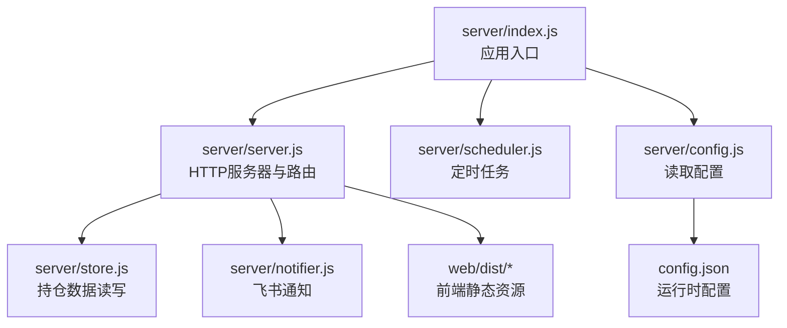
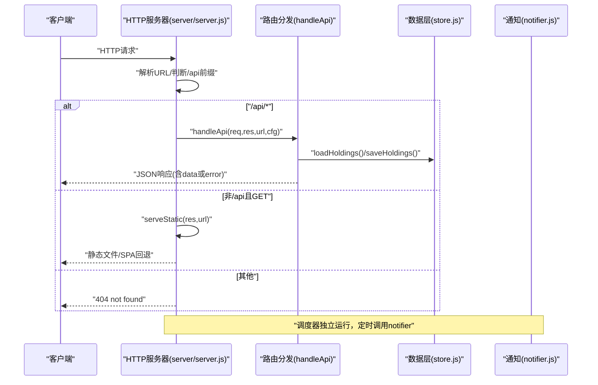
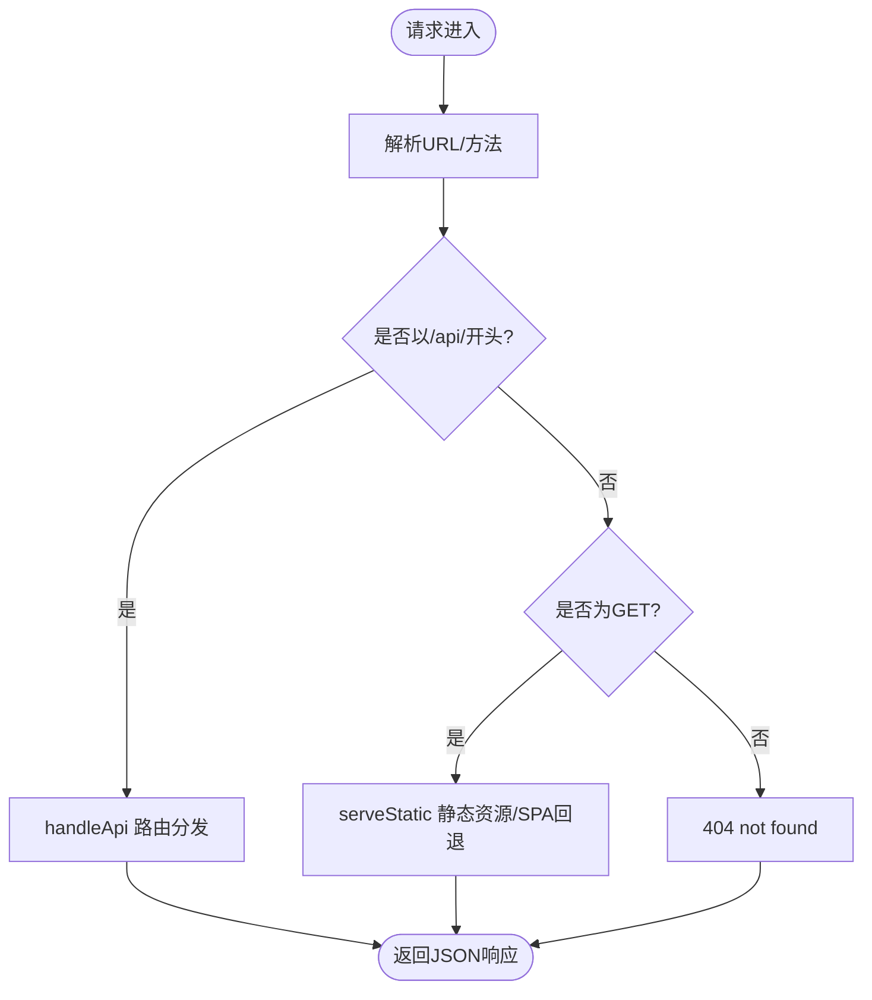
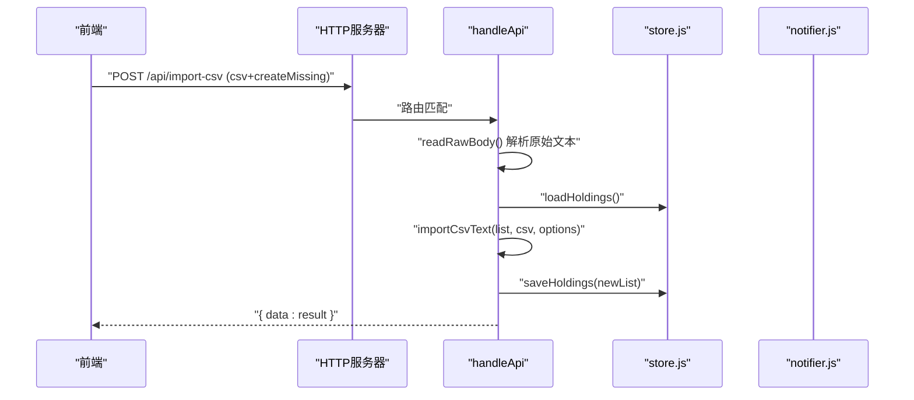
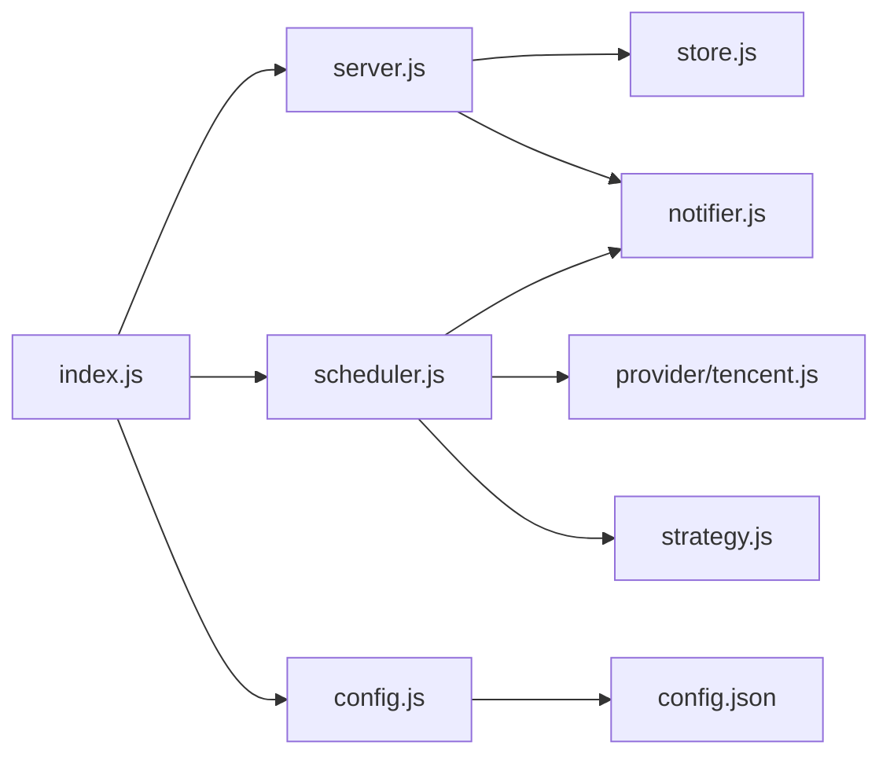

# HTTP服务器实现

<cite>
**本文引用的文件**
- [server/index.js](file://server/index.js)
- [server/server.js](file://server/server.js)
- [server/config.js](file://server/config.js)
- [server/store.js](file://server/store.js)
- [server/notifier.js](file://server/notifier.js)
- [server/scheduler.js](file://server/scheduler.js)
- [config.json](file://config.json)
- [package.json](file://package.json)
</cite>

## 目录
1. [简介](#简介)
2. [项目结构](#项目结构)
3. [核心组件](#核心组件)
4. [架构总览](#架构总览)
5. [详细组件分析](#详细组件分析)
6. [依赖关系分析](#依赖关系分析)
7. [性能考虑](#性能考虑)
8. [故障排查指南](#故障排查指南)
9. [结论](#结论)
10. [附录：API与路由参考](#附录api与路由参考)

## 简介
本文件为 Stock Advisor 的 Node.js 原生 HTTP 服务器开发文档。重点说明：
- 使用 Node.js 原生 http 模块创建服务器、处理请求与响应
- 静态资源服务（前端构建产物）与 API 路由分发机制
- 请求体解析器（JSON 与原始文本）
- 错误处理机制（全局异常捕获与标准化响应格式）
- 中间件模式的实践建议
- 性能优化与调试技巧

## 项目结构
后端入口位于 server/index.js，负责加载配置、启动 HTTP 服务器与调度任务。HTTP 服务器逻辑集中在 server/server.js，数据持久化在 server/store.js，通知能力在 server/notifier.js，定时任务在 server/scheduler.js。

图表来源
- [server/index.js:1-17](file://server/index.js#L1-L17)
- [server/server.js:1-594](file://server/server.js#L1-L594)
- [server/store.js:1-71](file://server/store.js#L1-L71)
- [server/notifier.js:1-112](file://server/notifier.js#L1-L112)
- [server/scheduler.js:1-178](file://server/scheduler.js#L1-L178)
- [server/config.js:1-11](file://server/config.js#L1-L11)
- [config.json:1-19](file://config.json#L1-L19)

章节来源
- [server/index.js:1-17](file://server/index.js#L1-L17)
- [server/server.js:1-594](file://server/server.js#L1-L594)
- [server/config.js:1-11](file://server/config.js#L1-L11)
- [config.json:1-19](file://config.json#L1-L19)

## 核心组件
- HTTP 服务器与路由分发：基于 node:http 创建服务器，统一解析 URL，按路径前缀区分 /api/ 接口与静态资源
- 静态资源服务：提供 Vite 构建产物，支持 SPA 回退到 index.html
- 请求体解析器：提供 JSON 解析与原始文本读取（用于 CSV 导入）
- 业务处理器：持仓 CRUD、CSV 导入、飞书测试消息等
- 数据层：内存缓存 + 串行写盘，避免并发冲突
- 通知与调度：定时拉取行情、评估策略、推送飞书卡片

章节来源
- [server/server.js:567-594](file://server/server.js#L567-L594)
- [server/server.js:35-83](file://server/server.js#L35-L83)
- [server/server.js:409-565](file://server/server.js#L409-L565)
- [server/store.js:40-70](file://server/store.js#L40-L70)
- [server/notifier.js:80-112](file://server/notifier.js#L80-L112)
- [server/scheduler.js:65-178](file://server/scheduler.js#L65-L178)

## 架构总览
下图展示从请求进入到响应返回的关键流程，包括路由分发、静态资源与 API 处理、以及错误兜底。

图表来源
- [server/server.js:567-594](file://server/server.js#L567-L594)
- [server/server.js:409-565](file://server/server.js#L409-L565)
- [server/store.js:40-70](file://server/store.js#L40-L70)
- [server/notifier.js:80-112](file://server/notifier.js#L80-L112)

## 详细组件分析

### HTTP 服务器与请求处理流程
- 服务器创建：通过 http.createServer 注册请求回调，统一解析 URL，区分 /api/ 路由与静态资源
- 请求体解析：
  - readBody：累积 data 事件，end 时尝试 JSON.parse，失败抛出“invalid json”
  - readRawBody：仅累积原始文本，适用于 CSV 等非 JSON 载荷
- 响应封装：sendJSON 统一设置 Content-Type 并序列化对象
- 静态资源：serveStatic 根据扩展名设置 MIME，不存在时回退到 index.html（SPA）
- 全局异常：catch 块中记录日志并以 500 + { error } 形式返回，确保未发送头时安全返回

图表来源
- [server/server.js:567-594](file://server/server.js#L567-L594)
- [server/server.js:35-83](file://server/server.js#L35-L83)
- [server/server.js:409-565](file://server/server.js#L409-L565)

章节来源
- [server/server.js:567-594](file://server/server.js#L567-L594)
- [server/server.js:35-83](file://server/server.js#L35-L83)
- [server/server.js:409-565](file://server/server.js#L409-L565)

### 路由分发机制（API 与静态资源）
- API 路由：所有 /api/* 请求交由 handleApi，内部按方法与路径精确匹配
- 静态资源：非 /api 且 GET 的请求由 serveStatic 处理，优先返回具体文件，否则返回 index.html
- 未匹配：返回 404

章节来源
- [server/server.js:567-594](file://server/server.js#L567-L594)
- [server/server.js:409-565](file://server/server.js#L409-L565)

### 请求体解析器（JSON 与原始文本）
- JSON 解析：readBody 将流式数据拼接后尝试 JSON.parse，失败则拒绝并返回“invalid json”
- 原始文本：readRawBody 仅收集字符串，供 CSV 导入等场景使用
- 最佳实践：对大体积请求应限制大小与超时；当前实现适合小负载

章节来源
- [server/server.js:60-83](file://server/server.js#L60-L83)

### 静态文件服务与 SPA 回退
- 路径规范化：decodeURIComponent、normalize，防止目录穿越
- MIME 映射：根据扩展名设置合适的 Content-Type
- SPA 回退：找不到文件时返回 index.html，使前端路由接管

章节来源
- [server/server.js:22-53](file://server/server.js#L22-L53)

### 业务处理器与数据流
- 列表获取：GET /api/holdings → loadHoldings → withDerived 派生展示字段 → 返回 data
- CSV 导入：POST /api/import-csv → readRawBody → importCsvText → saveHoldings → 返回结果
- 新建持仓：POST /api/holdings → createHolding → saveHoldings → 返回新持仓
- 更新持仓阈值：PATCH /api/holdings/:id → 修改告警阈值 → saveHoldings
- 追加买入记录：POST /api/holdings/:id/purchases → normalizePurchase → syncFromPurchases → saveHoldings
- 修改买入记录：PATCH /api/holdings/:id/purchases/:pid → 更新字段 → syncFromPurchases
- 删除买入记录：DELETE /api/holdings/:id/purchases/:pid → 过滤记录 → syncFromPurchases
- 兼容交易接口：POST /api/holdings/:id/transactions → applyTransaction（BUY/SELL）→ saveHoldings
- 飞书测试：POST /api/test-feishu → sendCard → 返回结果

图表来源
- [server/server.js:416-435](file://server/server.js#L416-L435)
- [server/store.js:40-70](file://server/store.js#L40-L70)

章节来源
- [server/server.js:409-565](file://server/server.js#L409-L565)
- [server/store.js:40-70](file://server/store.js#L40-L70)

### 错误处理机制
- 全局异常：服务器级 try/catch 捕获未处理异常，记录日志并以 500 + { error } 返回
- 业务校验：参数缺失、类型不合法等抛出错误，统一转为 400 + { error }
- 外部依赖：飞书推送失败返回 502 + { error }，并在 notifier 内重试
- 响应标准化：所有 JSON 响应通过 sendJSON 封装，保证 Content-Type 一致

章节来源
- [server/server.js:567-594](file://server/server.js#L567-L594)
- [server/server.js:409-565](file://server/server.js#L409-L565)
- [server/notifier.js:80-112](file://server/notifier.js#L80-L112)

### 中间件模式实践与建议
当前实现采用“单回调 + 条件分支”的路由分发，简洁高效。若需扩展，可引入轻量中间件模式：
- 建议分层：认证/鉴权、限流、日志、CORS、压缩等作为前置中间件
- 顺序执行：按注册顺序依次调用 next()，任一中间件提前返回则后续跳过
- 错误透传：中间件捕获异常后调用 next(err)，由统一错误处理中间件输出
- 示例思路：
  - 日志中间件：记录请求方法、路径、耗时
  - 限流中间件：基于 IP 或用户维度限制频率
  - CORS 中间件：设置跨域相关头部
  - 认证中间件：校验 Token 或签名

[本节为通用实践建议，不直接引用具体代码]

## 依赖关系分析
- 入口依赖：index.js 依赖 config、scheduler、server
- 服务器依赖：server.js 依赖 store、notifier、import-csv-core
- 数据层：store.js 管理 holdings.json 的内存缓存与串行写盘
- 调度器：scheduler.js 依赖 provider（腾讯/基金）、strategy、notifier
- 配置：config.json 提供端口、主机、飞书 webhook、冷却时间等

图表来源
- [server/index.js:1-17](file://server/index.js#L1-L17)
- [server/server.js:1-594](file://server/server.js#L1-L594)
- [server/store.js:1-71](file://server/store.js#L1-L71)
- [server/notifier.js:1-112](file://server/notifier.js#L1-L112)
- [server/scheduler.js:1-178](file://server/scheduler.js#L1-L178)
- [server/config.js:1-11](file://server/config.js#L1-L11)
- [config.json:1-19](file://config.json#L1-L19)

章节来源
- [server/index.js:1-17](file://server/index.js#L1-L17)
- [server/server.js:1-594](file://server/server.js#L1-L594)
- [server/store.js:1-71](file://server/store.js#L1-L71)
- [server/notifier.js:1-112](file://server/notifier.js#L1-L112)
- [server/scheduler.js:1-178](file://server/scheduler.js#L1-L178)
- [server/config.js:1-11](file://server/config.js#L1-L11)
- [config.json:1-19](file://config.json#L1-L19)

## 性能考虑
- 静态资源：
  - 启用 gzip/brotli 压缩（可通过上游反向代理如 Nginx）
  - 合理设置 Cache-Control/ETag 提升浏览器缓存命中率
- 请求体：
  - 对大请求增加大小限制与超时保护，避免内存占用过高
- 数据层：
  - 使用内存缓存减少磁盘 IO；writeChain 串行写盘避免覆盖
  - 定期备份 holdings.json 以防数据丢失
- 网络：
  - 对外部 API（腾讯/基金/飞书）增加重试与超时控制
- 监控：
  - 记录关键指标：QPS、错误率、平均响应时间、慢请求
  - 使用结构化日志便于检索与分析

[本节为通用指导，不直接引用具体代码]

## 故障排查指南
- 常见问题定位：
  - 404：检查路由路径与方法是否正确；确认静态资源路径与构建产物存在
  - 400：检查请求体格式与必填字段；关注 readBody 抛出的“invalid json”
  - 500：查看服务器日志中的异常堆栈；确认业务校验逻辑
  - 502：检查飞书 webhook 与 secret 配置；关注 notifier 的重试日志
- 调试技巧：
  - 在 handleApi 各分支前后添加日志，确认命中路径
  - 使用 curl 或 Postman 构造最小复现请求
  - 临时关闭调度器（环境变量 ONCE）聚焦接口验证
  - 观察 holdings.json 变化，确认写入是否成功

章节来源
- [server/server.js:567-594](file://server/server.js#L567-L594)
- [server/server.js:409-565](file://server/server.js#L409-L565)
- [server/notifier.js:80-112](file://server/notifier.js#L80-L112)
- [server/store.js:40-70](file://server/store.js#L40-L70)

## 结论
该 HTTP 服务器基于 Node.js 原生模块实现，具备清晰的路由分发、稳定的静态资源服务、可靠的请求体解析与统一的错误处理。配合内存缓存与串行写盘的数据层，满足高并发下的数据一致性需求。通过引入中间件模式、性能优化与完善的监控，可进一步提升系统的可维护性与稳定性。

[本节为总结性内容，不直接引用具体代码]

## 附录：API与路由参考
- GET /api/holdings：获取持仓列表（含派生字段）
- POST /api/holdings：新建持仓（买入建仓）
- PATCH /api/holdings/:id：更新持仓级字段（如日涨跌告警阈值）
- POST /api/holdings/:id/purchases：追加买入记录
- PATCH /api/holdings/:id/purchases/:pid：修改某条买入记录
- DELETE /api/holdings/:id/purchases/:pid：删除某条买入记录
- POST /api/holdings/:id/transactions：兼容旧接口，提交 BUY/SELL 交易
- POST /api/import-csv：导入 CSV 买卖记录（原始文本 body.csv）
- POST /api/test-feishu：发送飞书测试消息

章节来源
- [server/server.js:409-565](file://server/server.js#L409-L565)