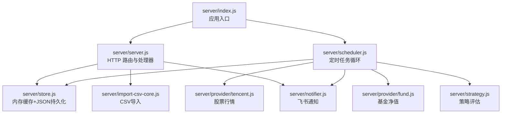
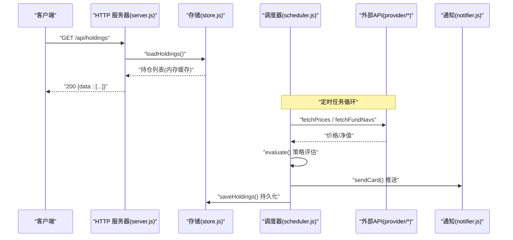
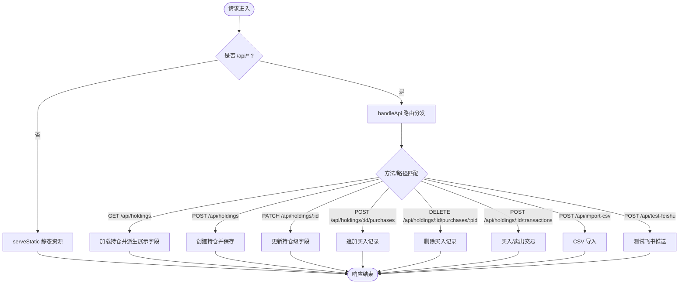
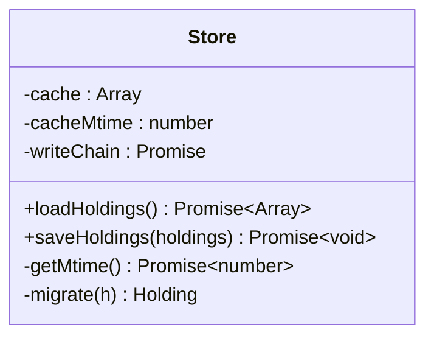
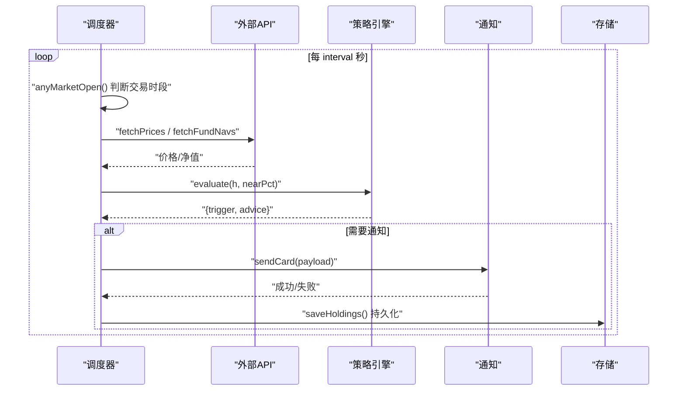
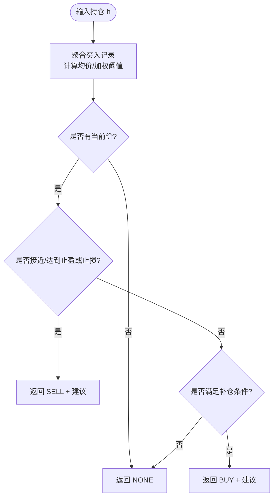
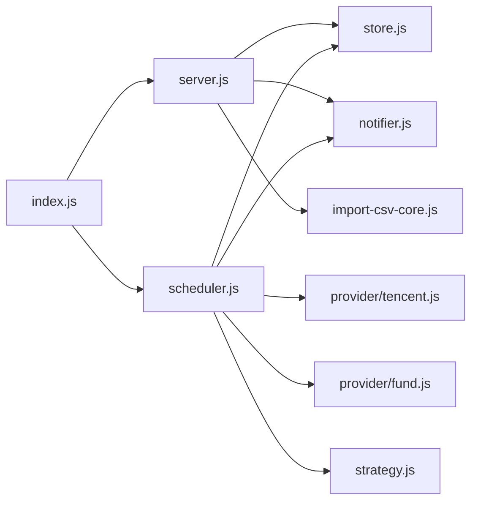

# 后端开发流程

<cite>
**本文引用的文件**
- [server/index.js](file://server/index.js)
- [server/server.js](file://server/server.js)
- [server/store.js](file://server/store.js)
- [server/scheduler.js](file://server/scheduler.js)
- [server/config.js](file://server/config.js)
- [server/provider/tencent.js](file://server/provider/tencent.js)
- [server/provider/fund.js](file://server/provider/fund.js)
- [server/strategy.js](file://server/strategy.js)
- [server/notifier.js](file://server/notifier.js)
- [server/import-csv-core.js](file://server/import-csv-core.js)
- [config.json](file://config.json)
- [package.json](file://package.json)
</cite>

## 目录
1. [简介](#简介)
2. [项目结构](#项目结构)
3. [核心组件](#核心组件)
4. [架构总览](#架构总览)
5. [详细组件分析](#详细组件分析)
6. [依赖关系分析](#依赖关系分析)
7. [性能考虑](#性能考虑)
8. [故障排查指南](#故障排查指南)
9. [结论](#结论)
10. [附录：API 接口规范与示例](#附录api-接口规范与示例)

## 简介
本指南面向 Stock Advisor 的后端开发，聚焦以下目标：
- HTTP 服务器实现模式：路由定义、请求处理流程、静态资源托管。
- 数据存储层设计：内存缓存机制与 JSON 文件持久化，读写并发控制与数据迁移。
- 定时任务调度器：任务注册、执行间隔控制（交易时段与非交易时段）、错误处理与冷却策略。
- 外部 API 集成：行情抓取（腾讯财经、东方财富基金净值）的最佳实践，包括错误重试、超时与日志记录。
- API 接口开发规范与示例：RESTful 风格、参数校验、幂等性、错误码约定。
- 异步编程与错误处理策略：Promise 链式调用、异常捕获、降级与容错。
- 性能监控与日志记录：关键路径耗时、错误告警、可观测性建议。

## 项目结构
后端采用 Node.js 原生 http 模块构建轻量服务，按职责拆分模块：
- server/index.js：应用入口，加载配置、启动 HTTP 服务与调度器。
- server/server.js：HTTP 路由与业务处理器，包含持仓 CRUD、CSV 导入、飞书测试消息。
- server/store.js：内存缓存 + JSON 文件持久化，串行写盘与 mtime 检测。
- server/scheduler.js：定时任务循环，行情拉取、策略评估、通知推送。
- server/provider/*：外部数据源适配器（股票、基金）。
- server/strategy.js：策略引擎（止盈/止损/补仓判断）。
- server/notifier.js：飞书机器人卡片消息构造与发送（含签名与重试）。
- server/import-csv-core.js：CSV 解析与导入逻辑（可复用）。
- config.json：运行时配置（端口、调度间隔、飞书 webhook、通知阈值等）。
- package.json：脚本与运行环境声明。

图表来源
- [server/index.js:1-17](file://server/index.js#L1-L17)
- [server/server.js:567-594](file://server/server.js#L567-L594)
- [server/scheduler.js:167-178](file://server/scheduler.js#L167-L178)
- [server/store.js:40-71](file://server/store.js#L40-L71)
- [server/provider/tencent.js:6-42](file://server/provider/tencent.js#L6-L42)
- [server/provider/fund.js:6-55](file://server/provider/fund.js#L6-L55)
- [server/strategy.js:34-91](file://server/strategy.js#L34-L91)
- [server/notifier.js:81-112](file://server/notifier.js#L81-L112)
- [server/import-csv-core.js:170-307](file://server/import-csv-core.js#L170-L307)

章节来源
- [server/index.js:1-17](file://server/index.js#L1-L17)
- [package.json:1-32](file://package.json#L1-L32)

## 核心组件
- HTTP 服务器：基于 Node http.createServer，统一拦截 /api/* 路由，其余 GET 请求返回前端静态页面（SPA 兜底）。
- 存储层：内存缓存 holdings 列表，首次或文件变更时从 data/holdings.json 读取；写操作通过 Promise 链串行化，避免并发覆盖。
- 调度器：根据市场交易时段动态调整刷新间隔；批量拉取行情，逐条评估策略并推送通知；支持冷却与日涨跌告警。
- 外部 API：股票使用腾讯财经批量接口；基金使用东方财富单只接口（JSONP 解析）；均设置 UA/Referer 头，失败时降级为空结果。
- 策略引擎：基于多次买入记录的加权成本计算止盈/止损线，结合最近买入价与补仓条件生成买点建议。
- 通知模块：构造飞书 interactive 卡片，支持 secret 签名；内置指数退避重试（最多 3 次）。
- CSV 导入：解析 CSV，按代码匹配或自动新建持仓，幂等插入买卖明细，同步汇总字段。

章节来源
- [server/server.js:35-83](file://server/server.js#L35-L83)
- [server/store.js:8-71](file://server/store.js#L8-L71)
- [server/scheduler.js:58-178](file://server/scheduler.js#L58-L178)
- [server/provider/tencent.js:6-42](file://server/provider/tencent.js#L6-L42)
- [server/provider/fund.js:6-55](file://server/provider/fund.js#L6-L55)
- [server/strategy.js:34-91](file://server/strategy.js#L34-L91)
- [server/notifier.js:81-112](file://server/notifier.js#L81-L112)
- [server/import-csv-core.js:170-307](file://server/import-csv-core.js#L170-L307)

## 架构总览
系统由“入口 -> 服务/调度 -> 存储/策略/通知”构成。入口负责装配配置与启动；服务提供 REST 接口；调度器周期性执行行情拉取、策略评估与通知；存储层保证数据一致性与持久化。

图表来源
- [server/server.js:409-565](file://server/server.js#L409-L565)
- [server/store.js:40-71](file://server/store.js#L40-L71)
- [server/scheduler.js:65-165](file://server/scheduler.js#L65-L165)
- [server/provider/tencent.js:6-42](file://server/provider/tencent.js#L6-L42)
- [server/provider/fund.js:6-55](file://server/provider/fund.js#L6-L55)
- [server/notifier.js:81-112](file://server/notifier.js#L81-L112)

## 详细组件分析

### HTTP 服务器与路由
- 路由组织：所有 /api/* 请求进入 handleApi，内部按 method + pathname 分支处理；非 /api 的 GET 请求返回静态 SPA。
- 请求体解析：readBody 解析 JSON；readRawBody 用于 CSV 等非 JSON 载荷。
- 响应封装：sendJSON 统一 JSON 响应格式。
- 错误处理：顶层 try/catch 捕获未处理异常，返回 500 并输出错误日志。

图表来源
- [server/server.js:567-594](file://server/server.js#L567-L594)
- [server/server.js:409-565](file://server/server.js#L409-L565)

章节来源
- [server/server.js:35-83](file://server/server.js#L35-L83)
- [server/server.js:409-565](file://server/server.js#L409-L565)
- [server/server.js:567-594](file://server/server.js#L567-L594)

### 数据存储层（内存缓存 + JSON 持久化）
- 内存缓存：全局 cache 持有 holdings 列表，避免重复 IO。
- 文件变更检测：维护 cacheMtime，当文件被外部修改时重新加载。
- 串行写盘：writeChain 将多次写入排队，防止并发覆盖；写后更新 mtime。
- 数据迁移：首次加载时若为旧版扁平结构，自动迁移为 purchases 数组模型并落盘。

图表来源
- [server/store.js:8-71](file://server/store.js#L8-L71)

章节来源
- [server/store.js:8-71](file://server/store.js#L8-L71)

### 定时任务调度器
- 交易时段判断：依据 region 与时区，判断当前是否在交易时段；任一持仓处于交易时段则视为“交易中”。
- 动态间隔：交易时段使用短间隔（如 20 秒），非交易时段使用长间隔（如 300 秒）。
- 任务执行：
  - 并行拉取股票与基金价格（失败降级为空对象）。
  - 对每个活跃持仓计算当日涨跌幅，触发日涨跌告警（每日一次）。
  - 调用策略引擎 evaluate，结合 nearThresholdPct 判定接近阈值。
  - 冷却机制：同一触发态在 cooldownSeconds 内不重复推送。
  - 推送成功后更新 triggerState 与 notifiedAt，必要时持久化。
- 错误处理：单次任务异常不影响下一次循环，延迟一个周期继续。

图表来源
- [server/scheduler.js:37-178](file://server/scheduler.js#L37-L178)
- [server/strategy.js:34-91](file://server/strategy.js#L34-L91)
- [server/notifier.js:81-112](file://server/notifier.js#L81-L112)
- [server/store.js:62-71](file://server/store.js#L62-L71)

章节来源
- [server/scheduler.js:37-178](file://server/scheduler.js#L37-L178)

### 外部 API 集成最佳实践
- 股票行情（腾讯）：
  - 批量查询，URL 拼接多个 code，设置 UA/Referer 头。
  - 响应文本可能为 GBK，先尝试 GBK 解码，失败回退 UTF-8。
  - 解析 v_xxx="..." 行，提取当前价与昨收。
  - 失败时抛出错误，上层 catch 降级为空结果。
- 基金净值（东方财富）：
  - 单只查询，JSONP 回调包裹，需正则去除 jQuery(...) 再解析。
  - 取最新净值与上一交易日净值，缺失时置空。
  - 单个失败不影响其他基金查询。
- 通用建议：
  - 设置合理 UA/Referer，模拟浏览器访问。
  - 对网络异常进行捕获与降级，避免影响整体流程。
  - 记录关键日志（状态码、解析失败原因）。

章节来源
- [server/provider/tencent.js:6-42](file://server/provider/tencent.js#L6-L42)
- [server/provider/fund.js:6-55](file://server/provider/fund.js#L6-L55)

### 策略引擎与收益计算
- 聚合买入记录：计算总成本、总数量、均价、最近买入价、加权止盈/止损比例。
- 卖点判断：
  - 达到预期止盈（考虑 nearPct 接近阈值）。
  - 任一买入记录触发止损（按该笔买入价的跌幅）。
- 买点判断：较最近买入价跌幅达到补仓条件或触及补仓价。
- 派生展示字段：
  - 每次买入派生成本、市值、收益、收益率、目标价、止损价。
  - 合并买入/卖出记录为 transactions 统一展示。
  - 持仓级指标：剩余成本、均价、未实现/已实现收益、今日收益与收益率、最近买入价、加权止盈/止损、跌幅等。

图表来源
- [server/strategy.js:34-91](file://server/strategy.js#L34-L91)
- [server/server.js:89-245](file://server/server.js#L89-L245)

章节来源
- [server/strategy.js:34-91](file://server/strategy.js#L34-L91)
- [server/server.js:89-245](file://server/server.js#L89-L245)

### 通知模块（飞书机器人）
- 卡片构造：根据触发类型（BUY/SELL/DAILY_RISE/DAILY_DROP）生成不同标题与模板颜色。
- 签名支持：可选 secret，计算 timestamp + secret 的 HMAC-SHA256 签名。
- 重试机制：最多 3 次，指数退避（1s、2s），失败抛错供上层处理。
- 日志记录：推送失败记录错误信息，便于排查。

章节来源
- [server/notifier.js:4-112](file://server/notifier.js#L4-L112)

### CSV 导入
- 解析：支持 BOM、引号包裹、逗号分隔；表头映射到列索引。
- 匹配：精确匹配 holdings.code，或数字归一化匹配（如 hk00700 → 700）。
- 幂等：以 (日期, 数量, 价格) 作为唯一键，已存在则跳过。
- 新建持仓：可选 createMissing，按地区/类型自动新建持仓。
- 同步：导入后同步汇总字段（成本、数量、均价、状态等）。

章节来源
- [server/import-csv-core.js:8-307](file://server/import-csv-core.js#L8-L307)

## 依赖关系分析
- 入口依赖：index.js 依赖 config、scheduler、server。
- 服务依赖：server.js 依赖 store、notifier、import-csv-core。
- 调度器依赖：scheduler.js 依赖 store、provider/*、strategy、notifier。
- 存储依赖：store.js 仅依赖 fs/promises 与 path/url。
- 外部依赖：provider/* 依赖 fetch（Node 18+ 内置）。

图表来源
- [server/index.js:1-17](file://server/index.js#L1-L17)
- [server/server.js:1-8](file://server/server.js#L1-L8)
- [server/scheduler.js:1-5](file://server/scheduler.js#L1-L5)
- [server/store.js:1-6](file://server/store.js#L1-L6)
- [server/notifier.js:1-2](file://server/notifier.js#L1-L2)
- [server/provider/tencent.js:1-5](file://server/provider/tencent.js#L1-L5)
- [server/provider/fund.js:1-5](file://server/provider/fund.js#L1-L5)
- [server/strategy.js:1-3](file://server/strategy.js#L1-L3)
- [server/import-csv-core.js:1-6](file://server/import-csv-core.js#L1-L6)

章节来源
- [server/index.js:1-17](file://server/index.js#L1-L17)
- [server/server.js:1-8](file://server/server.js#L1-L8)
- [server/scheduler.js:1-5](file://server/scheduler.js#L1-L5)

## 性能考虑
- 内存缓存减少磁盘 IO：仅在首次或文件变更时读盘，提升高频读取性能。
- 串行写盘避免竞争：writeChain 确保写操作的顺序性，防止数据覆盖。
- 动态刷新间隔：交易时段短间隔提高实时性，非交易时段长间隔降低负载。
- 批量请求：股票行情批量获取，减少网络往返。
- 冷确机制：避免频繁推送造成通知风暴。
- 建议增强：
  - 增加关键路径计时（如 fetch、evaluate、save）以便定位瓶颈。
  - 对大文件写入考虑分片或临时文件原子替换。
  - 对外部 API 增加超时控制与熔断策略。

[本节为通用指导，无需特定文件引用]

## 故障排查指南
- 行情拉取失败：检查 provider 中 UA/Referer 是否正确；查看控制台日志中的状态码与解析错误；确认网络可达。
- 通知推送失败：检查飞书 webhook 与 secret；查看 notifier 的重试日志；确认卡片 payload 字段完整。
- 数据不一致：确认 store 的 writeChain 是否阻塞；检查外部是否手动修改 holdings.json；观察 mtime 变化。
- 策略误判：核对 strategy 的加权计算与 nearPct 配置；检查买入记录的价格与数量合法性。
- CSV 导入异常：确认表头包含必需列；检查日期格式与数值合法性；查看 errors 列表定位问题行。

章节来源
- [server/provider/tencent.js:6-42](file://server/provider/tencent.js#L6-L42)
- [server/provider/fund.js:6-55](file://server/provider/fund.js#L6-L55)
- [server/notifier.js:81-112](file://server/notifier.js#L81-L112)
- [server/store.js:40-71](file://server/store.js#L40-L71)
- [server/strategy.js:34-91](file://server/strategy.js#L34-L91)
- [server/import-csv-core.js:170-307](file://server/import-csv-core.js#L170-L307)

## 结论
Stock Advisor 后端以简洁清晰的模块化设计实现了持仓管理、行情抓取、策略评估与通知推送的全链路能力。通过内存缓存与串行写盘保障数据一致性，利用动态调度与冷却机制平衡实时性与资源消耗。外部 API 集成遵循健壮的错误处理与降级策略，CSV 导入提供灵活的批量数据处理能力。建议在现有基础上进一步增强可观测性（计时、指标、结构化日志）与稳定性（超时、熔断、重试策略），以提升系统的可靠性与可维护性。

[本节为总结性内容，无需特定文件引用]

## 附录：API 接口规范与示例

### 通用约定
- 内容类型：application/json; charset=utf-8
- 成功响应：{ data: ... }
- 失败响应：{ error: "描述" }
- 状态码：200/201/400/404/500/502（视场景）

### 接口清单
- GET /api/holdings
  - 功能：获取持仓列表（带派生展示字段）
  - 响应：200 { data: [...] }
  - 参考路径：[server/server.js:410-414](file://server/server.js#L410-L414)

- POST /api/import-csv
  - 功能：导入 CSV 买卖记录（按代码匹配，已有明细忽略）
  - 请求体：{ csv: string, createMissing?: boolean }
  - 响应：200 { data: { added, skipped, created, createdCodes, missing, errors, total } }
  - 参考路径：[server/server.js:416-435](file://server/server.js#L416-L435)

- POST /api/holdings
  - 功能：新建持仓（买入建仓）
  - 请求体：name, code, region, type, 可选 purchases 等
  - 响应：201 { data: withDerived(h) }
  - 参考路径：[server/server.js:437-450](file://server/server.js#L437-L450)

- PATCH /api/holdings/:id
  - 功能：更新持仓级字段（如日涨跌告警阈值）
  - 请求体：dailyDropAlertPct?, dailyRiseAlertPct?
  - 响应：200 { data: withDerived(h) }
  - 参考路径：[server/server.js:452-465](file://server/server.js#L452-L465)

- POST /api/holdings/:id/purchases
  - 功能：追加买入记录
  - 请求体：buyPrice, buyQuantity, buyTime/date, targetProfitRate?, stopLossRate?
  - 响应：200 { data: withDerived(h) }
  - 参考路径：[server/server.js:467-488](file://server/server.js#L467-L488)

- PATCH /api/holdings/:id/purchases/:pid
  - 功能：修改某条买入记录的止盈/止亏比例等
  - 请求体：buyPrice?, buyQuantity?, buyTime?, targetProfitRate?, stopLossRate?
  - 响应：200 { data: withDerived(h) }
  - 参考路径：[server/server.js:490-513](file://server/server.js#L490-L513)

- DELETE /api/holdings/:id/purchases/:pid
  - 功能：删除某条买入记录
  - 响应：200 { data: withDerived(h) }
  - 参考路径：[server/server.js:515-527](file://server/server.js#L515-L527)

- POST /api/holdings/:id/transactions
  - 功能：对已有持仓追加买入/卖出记录（兼容旧接口）
  - 请求体：type(BUY/SELL), price, quantity, date
  - 响应：200 { data: withDerived(h) }
  - 参考路径：[server/server.js:529-543](file://server/server.js#L529-L543)

- POST /api/test-feishu
  - 功能：发送一条测试消息到飞书机器人
  - 响应：200 { ok: true, data } 或 502 { error }
  - 参考路径：[server/server.js:545-562](file://server/server.js#L545-L562)

### 错误处理策略
- 参数校验失败：返回 400 与错误描述。
- 资源不存在：返回 404。
- 外部服务失败：返回 502 并附带错误信息。
- 未捕获异常：返回 500 并记录错误日志。

章节来源
- [server/server.js:409-565](file://server/server.js#L409-L565)
- [server/notifier.js:81-112](file://server/notifier.js#L81-L112)