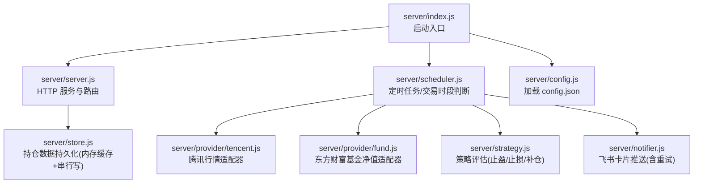
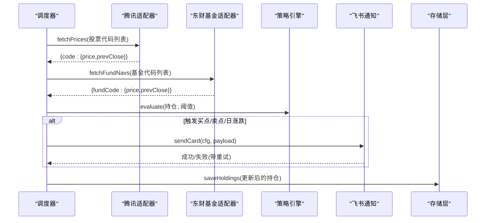
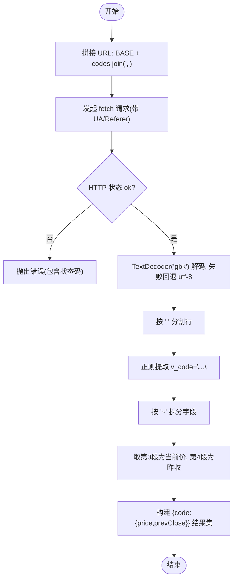
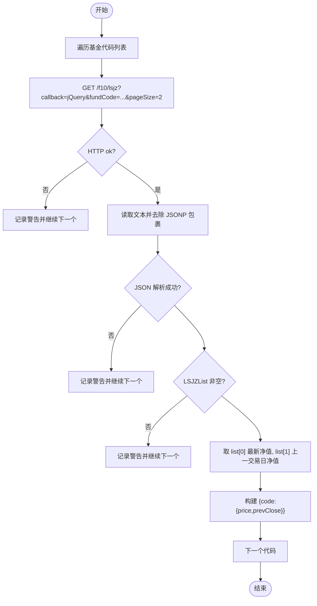
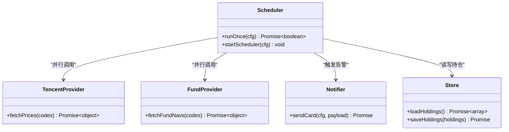
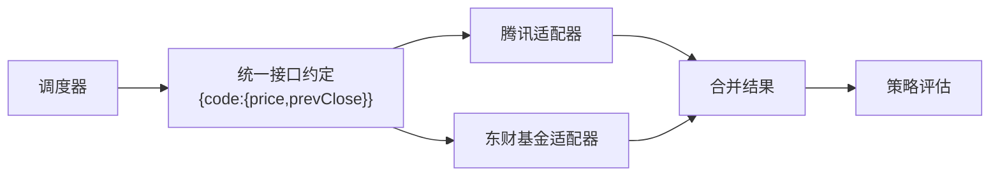
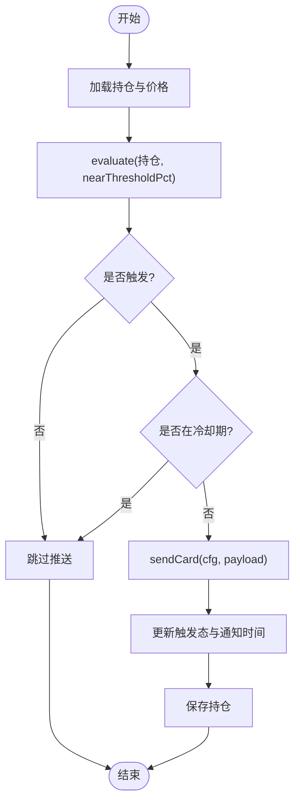
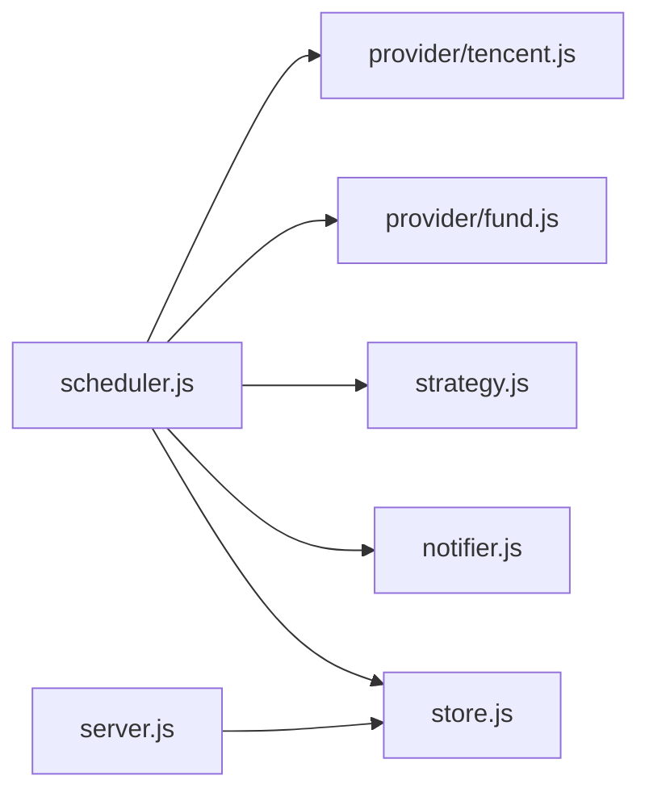

# 外部API集成

<cite>
**本文引用的文件**
- [server/provider/tencent.js](file://server/provider/tencent.js)
- [server/provider/fund.js](file://server/provider/fund.js)
- [server/scheduler.js](file://server/scheduler.js)
- [server/server.js](file://server/server.js)
- [server/store.js](file://server/store.js)
- [server/notifier.js](file://server/notifier.js)
- [server/config.js](file://server/config.js)
- [config.json](file://config.json)
- [package.json](file://package.json)
</cite>

## 目录
1. [简介](#简介)
2. [项目结构](#项目结构)
3. [核心组件](#核心组件)
4. [架构总览](#架构总览)
5. [详细组件分析](#详细组件分析)
6. [依赖关系分析](#依赖关系分析)
7. [性能与可靠性](#性能与可靠性)
8. [故障排查指南](#故障排查指南)
9. [结论](#结论)
10. [附录：接口清单与安全配置](#附录接口清单与安全配置)

## 简介
本指南面向需要在 Stock Advisor 中接入外部金融数据源的开发者，重点说明：
- 腾讯财经行情 API 的对接实现（请求构造、响应解析、数据转换）
- 东方财富基金净值 API 的使用方法（净值获取与数据处理逻辑）
- API 客户端设计模式（错误重试、超时处理、缓存策略）
- 数据源抽象层设计（统一接口定义、多数据源支持）
- API 密钥管理与安全配置最佳实践
- 性能监控与错误诊断工具使用指南

## 项目结构
后端以 Node.js 原生 HTTP 服务承载前端静态资源与 REST API；调度器定时拉取行情并触发告警；数据持久化采用本地 JSON 文件并通过内存缓存提升并发读写性能。

图表来源
- [server/index.js:1-17](file://server/index.js#L1-L17)
- [server/server.js:567-593](file://server/server.js#L567-L593)
- [server/scheduler.js:65-177](file://server/scheduler.js#L65-L177)
- [server/provider/tencent.js:1-42](file://server/provider/tencent.js#L1-L42)
- [server/provider/fund.js:1-55](file://server/provider/fund.js#L1-L55)
- [server/notifier.js:80-112](file://server/notifier.js#L80-L112)
- [server/store.js:40-71](file://server/store.js#L40-L71)
- [server/config.js:7-10](file://server/config.js#L7-L10)

章节来源
- [server/index.js:1-17](file://server/index.js#L1-L17)
- [package.json:1-32](file://package.json#L1-L32)

## 核心组件
- 数据源适配层
  - 腾讯行情适配器：批量获取股票实时价与昨收，返回统一价格对象
  - 东方财富基金净值适配器：逐个基金拉取最新与上一交易日净值，返回统一价格对象
- 调度器：按市场交易时段动态调整刷新频率，聚合多数据源价格，执行策略评估与告警
- 存储层：内存缓存 + 串行写盘，避免并发冲突，自动迁移旧数据结构
- 通知层：飞书机器人卡片推送，内置指数退避重试与签名校验
- 配置层：从配置文件加载调度间隔、服务器端口、飞书 webhook 与 secret 等

章节来源
- [server/provider/tencent.js:1-42](file://server/provider/tencent.js#L1-L42)
- [server/provider/fund.js:1-55](file://server/provider/fund.js#L1-L55)
- [server/scheduler.js:65-177](file://server/scheduler.js#L65-L177)
- [server/store.js:40-71](file://server/store.js#L40-L71)
- [server/notifier.js:80-112](file://server/notifier.js#L80-L112)
- [server/config.js:7-10](file://server/config.js#L7-L10)
- [config.json:1-19](file://config.json#L1-L19)

## 架构总览
系统通过调度器周期性调用两个数据源适配器，合并价格后进入策略引擎评估，必要时通过通知层发送飞书卡片。HTTP 服务提供管理接口与前端页面托管。

图表来源
- [server/scheduler.js:65-177](file://server/scheduler.js#L65-L177)
- [server/provider/tencent.js:6-41](file://server/provider/tencent.js#L6-L41)
- [server/provider/fund.js:6-54](file://server/provider/fund.js#L6-L54)
- [server/notifier.js:80-112](file://server/notifier.js#L80-L112)
- [server/store.js:62-71](file://server/store.js#L62-L71)

## 详细组件分析

### 腾讯财经行情 API 对接
- 请求构造
  - 基础地址拼接多个股票代码，使用逗号分隔
  - 设置 User-Agent 与 Referer 头，模拟浏览器访问
- 响应解析
  - 读取二进制缓冲，优先尝试 GBK 解码，失败回退 UTF-8
  - 正则提取每行 v_代码="..." 字段，按分隔符拆分得到当前价与昨收
- 数据转换
  - 输出统一结构：{ code: { price, prevClose } }
  - 对缺失或非法值进行容错处理（如 prevClose 为空时置 null）

图表来源
- [server/provider/tencent.js:6-41](file://server/provider/tencent.js#L6-L41)

章节来源
- [server/provider/tencent.js:1-42](file://server/provider/tencent.js#L1-L42)

### 东方财富基金净值 API 使用方法
- 请求构造
  - 单个基金一次请求，参数包括 fundCode、pageIndex、pageSize
  - 设置 User-Agent 与 Referer 头
- 响应解析
  - 返回 JSONP，需去除 jQuery(...) 包裹后再 JSON.parse
  - 从 Data.LSJZList 中取最新与上一交易日净值
- 数据转换
  - 将 DWJZ 字段转为数值，构建统一价格对象
  - 对无净值或解析失败的情况记录警告并跳过

图表来源
- [server/provider/fund.js:6-54](file://server/provider/fund.js#L6-L54)

章节来源
- [server/provider/fund.js:1-55](file://server/provider/fund.js#L1-L55)

### API 客户端设计模式（错误重试、超时处理、缓存策略）
- 错误重试
  - 飞书通知模块实现了最多 3 次重试，采用指数退避（等待 1s、2s、3s），并在最后一次失败时抛出异常
- 超时处理
  - 当前未显式设置 fetch 超时；建议在调用方增加 AbortController 或封装超时逻辑以避免长时间阻塞
- 缓存策略
  - 存储层使用内存缓存与文件 mtime 检测，避免重复读盘；写操作串行化防止覆盖
  - 行情数据在调度周期内由调度器聚合，未做跨周期缓存；可按需引入短期内存缓存（如 LRU）减少网络开销

图表来源
- [server/notifier.js:80-112](file://server/notifier.js#L80-L112)
- [server/provider/tencent.js:6-41](file://server/provider/tencent.js#L6-L41)
- [server/provider/fund.js:6-54](file://server/provider/fund.js#L6-L54)
- [server/scheduler.js:65-177](file://server/scheduler.js#L65-L177)
- [server/store.js:40-71](file://server/store.js#L40-L71)

章节来源
- [server/notifier.js:80-112](file://server/notifier.js#L80-L112)
- [server/store.js:40-71](file://server/store.js#L40-L71)

### 数据源抽象层设计（统一接口定义、多数据源支持）
- 统一接口约定
  - 输入：代码数组
  - 输出：映射表 { code: { price, prevClose } }
  - 错误处理：网络异常或解析失败时返回空对象或跳过该条目，保证整体流程不中断
- 多数据源支持
  - 调度器根据持仓类型分流：股票走腾讯，基金走东方财富
  - 通过 Promise.all 并行拉取，合并结果后统一进入策略评估

图表来源
- [server/scheduler.js:72-87](file://server/scheduler.js#L72-L87)
- [server/provider/tencent.js:6-41](file://server/provider/tencent.js#L6-L41)
- [server/provider/fund.js:6-54](file://server/provider/fund.js#L6-L54)

章节来源
- [server/scheduler.js:72-87](file://server/scheduler.js#L72-L87)

### 策略评估与告警流程
- 策略评估
  - 基于多次买入记录计算加权平均成本与最近买入价
  - 触发条件：接近止盈、触及止损、接近补仓价或跌幅达到补仓阈值
- 日涨跌告警
  - 根据当日涨跌幅与配置的阈值触发 DAILY_RISE/DAILY_DROP
  - 同一日内去重，避免重复推送
- 冷却机制
  - 同一触发态在冷却时间内不重复推送

图表来源
- [server/scheduler.js:101-164](file://server/scheduler.js#L101-L164)
- [server/strategy.js:34-90](file://server/strategy.js#L34-L90)
- [server/notifier.js:80-112](file://server/notifier.js#L80-L112)

章节来源
- [server/scheduler.js:101-164](file://server/scheduler.js#L101-L164)
- [server/strategy.js:1-91](file://server/strategy.js#L1-L91)

## 依赖关系分析
- 调度器依赖
  - 存储层：加载与保存持仓
  - 数据源适配器：并行拉取股票与基金价格
  - 策略引擎：评估买卖点
  - 通知层：发送飞书卡片
- 存储层依赖
  - 文件系统：读写 holdings.json
  - 内存缓存：避免重复 IO 与并发冲突
- 通知层依赖
  - 加密模块：生成 HMAC 签名（可选）
  - 网络请求：POST 到飞书 webhook

图表来源
- [server/scheduler.js:1-6](file://server/scheduler.js#L1-L6)
- [server/server.js:1-8](file://server/server.js#L1-L8)

章节来源
- [server/scheduler.js:1-6](file://server/scheduler.js#L1-L6)
- [server/server.js:1-8](file://server/server.js#L1-L8)

## 性能与可靠性
- 并发与吞吐
  - 并行拉取股票与基金价格，降低端到端延迟
  - 存储层串行写盘，避免竞态条件
- 降级与容错
  - 单条数据源失败不影响整体流程（catch 后返回空对象）
  - 飞书推送具备重试与签名校验，增强稳定性
- 建议优化
  - 为外部请求增加超时控制（AbortController）
  - 为高频查询引入短期内存缓存（如 LRU），减少网络压力
  - 对东方财富 JSONP 解析增加更严格的校验与日志

章节来源
- [server/scheduler.js:77-86](file://server/scheduler.js#L77-L86)
- [server/notifier.js:96-110](file://server/notifier.js#L96-L110)
- [server/store.js:62-71](file://server/store.js#L62-L71)

## 故障排查指南
- 无法获取港股行情
  - 检查 region 前缀是否正确拼接（如 hk07709）
  - 确认 isMarketOpen 使用的区域键与 REGION_TZ 一致
- 基金净值解析失败
  - 检查 JSONP 包裹是否被正确去除
  - 查看 LSJZList 是否存在且包含 DWJZ 字段
- 飞书推送失败
  - 验证 webhook 与 secret 配置
  - 查看重试日志与返回码，定位具体错误信息
- 数据不同步
  - 检查 store.js 的 mtime 检测与串行写链是否正常
  - 确认外部编辑 holdings.json 后是否触发重新加载

章节来源
- [server/scheduler.js:37-54](file://server/scheduler.js#L37-L54)
- [server/provider/fund.js:25-50](file://server/provider/fund.js#L25-L50)
- [server/notifier.js:80-112](file://server/notifier.js#L80-L112)
- [server/store.js:14-22](file://server/store.js#L14-L22)

## 结论
本项目通过清晰的适配器抽象与调度编排，实现了对腾讯财经与东方财富基金净值的多数据源整合。存储层与通知层的健壮性设计保障了系统在弱网与第三方不稳定场景下的可用性。后续可进一步增强超时控制、缓存策略与监控指标，以提升整体性能与可观测性。

## 附录：接口清单与安全配置
- 调度与配置
  - 调度间隔：交易时段与非交易时段分别配置
  - 服务器主机与端口：默认监听 0.0.0.0:3000
  - 飞书 Webhook 与 Secret：用于推送告警卡片
- 安全最佳实践
  - 将敏感配置（如飞书 secret）放入环境变量或受保护的配置文件
  - 对外部请求添加超时与重试上限，避免资源泄露
  - 对第三方响应进行严格校验，防止注入与格式错误导致崩溃
- 监控与诊断
  - 关键路径日志：网络请求状态、解析结果、策略触发、通知发送
  - 指标采集：请求耗时、错误率、重试次数、缓存命中率（建议扩展）

章节来源
- [config.json:1-19](file://config.json#L1-L19)
- [server/config.js:7-10](file://server/config.js#L7-L10)
- [server/notifier.js:80-112](file://server/notifier.js#L80-L112)