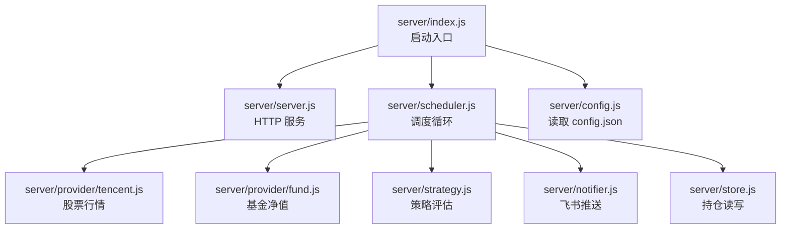
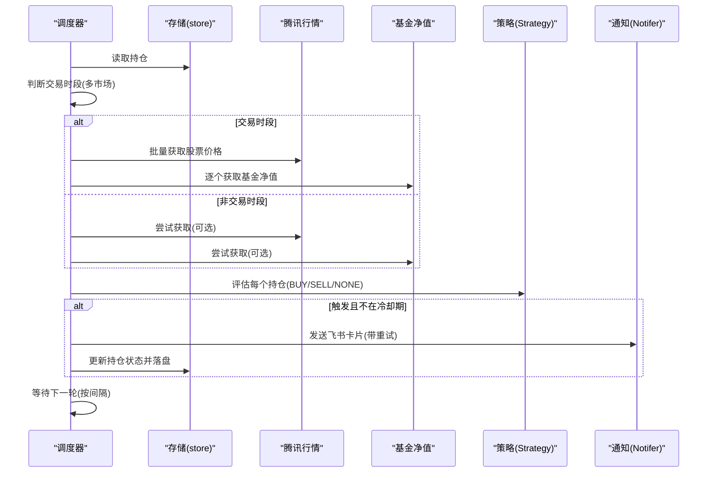
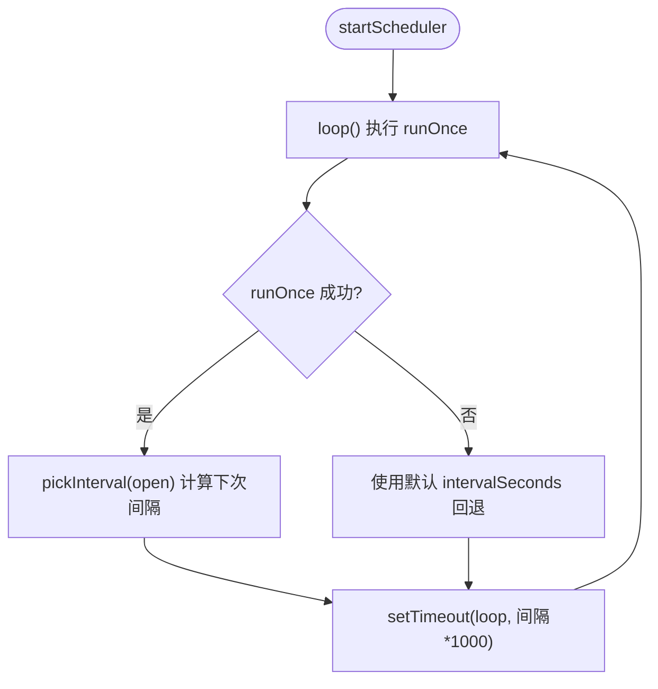
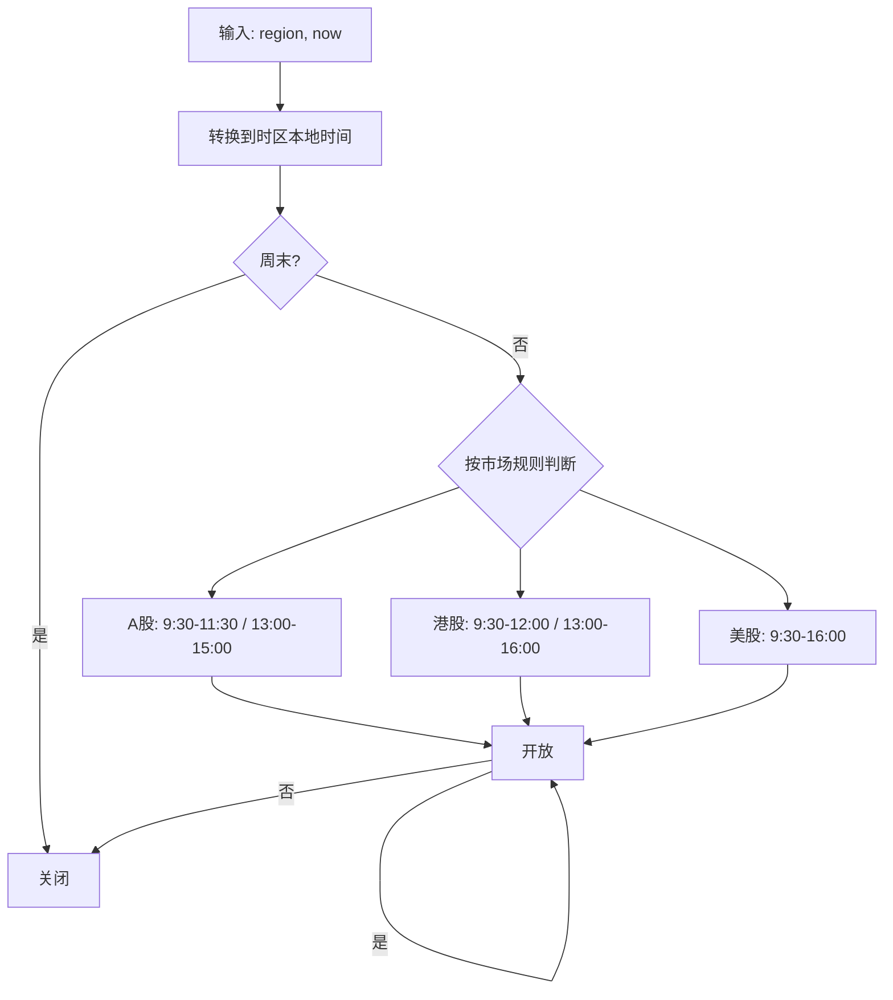
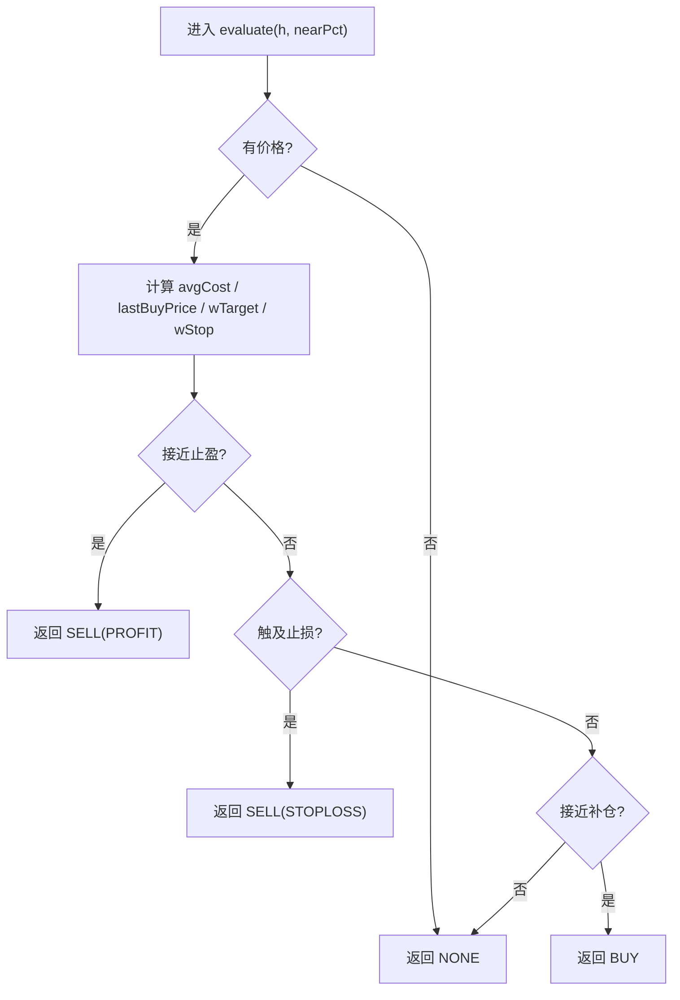
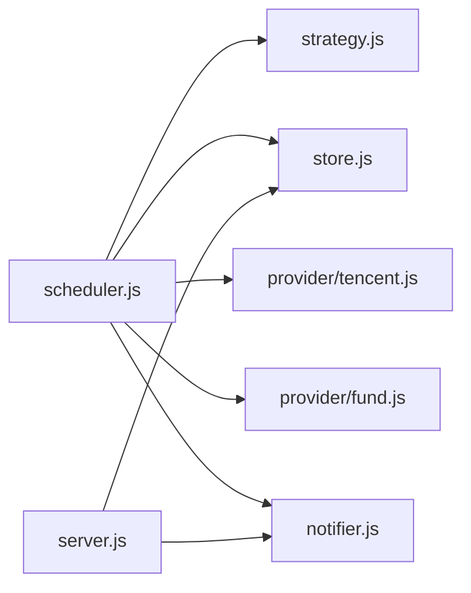

# 定时任务调度

<cite>
**本文引用的文件**
- [server/index.js](file://server/index.js)
- [server/scheduler.js](file://server/scheduler.js)
- [server/server.js](file://server/server.js)
- [server/config.js](file://server/config.js)
- [config.json](file://config.json)
- [server/store.js](file://server/store.js)
- [server/provider/tencent.js](file://server/provider/tencent.js)
- [server/provider/fund.js](file://server/provider/fund.js)
- [server/notifier.js](file://server/notifier.js)
- [server/strategy.js](file://server/strategy.js)
- [package.json](file://package.json)
</cite>

## 目录
1. [简介](#简介)
2. [项目结构](#项目结构)
3. [核心组件](#核心组件)
4. [架构总览](#架构总览)
5. [详细组件分析](#详细组件分析)
6. [依赖关系分析](#依赖关系分析)
7. [性能考量](#性能考量)
8. [故障排查指南](#故障排查指南)
9. [结论](#结论)
10. [附录](#附录)

## 简介
本文件面向 Stock Advisor 的“定时任务调度系统”，聚焦以下目标：
- 任务注册与管理机制、生命周期控制与执行状态跟踪
- 交易时段判断逻辑（A股、港股、美股）及不同市场开盘收盘时间处理
- 调度算法：间隔控制、重试机制、错误恢复
- 外部 API 集成：超时与限流策略
- 任务监控与日志记录方法
- 性能调优与故障排查建议

## 项目结构
后端采用 Node.js 原生 HTTP 服务，结合模块化职责划分：
- 入口与启动：server/index.js
- 配置加载：server/config.js + config.json
- 调度器：server/scheduler.js（行情抓取、策略评估、通知推送、循环调度）
- Web 服务与数据接口：server/server.js
- 持久化存储：server/store.js（内存缓存 + 串行写盘）
- 外部数据源：server/provider/tencent.js（股票）、server/provider/fund.js（基金净值）
- 通知推送：server/notifier.js（飞书机器人卡片消息）
- 策略引擎：server/strategy.js（止盈/止损/补仓触发）

图表来源
- [server/index.js:1-17](file://server/index.js#L1-L17)
- [server/scheduler.js:1-178](file://server/scheduler.js#L1-L178)
- [server/server.js:567-594](file://server/server.js#L567-L594)
- [server/config.js:1-11](file://server/config.js#L1-L11)

章节来源
- [server/index.js:1-17](file://server/index.js#L1-L17)
- [server/config.js:1-11](file://server/config.js#L1-L11)
- [config.json:1-19](file://config.json#L1-L19)

## 核心组件
- 调度器 scheduler.js：负责按间隔轮询，区分交易/非交易时段，拉取行情，评估策略，发送通知，并维护持仓状态。
- 存储 store.js：内存缓存 + 串行写盘，避免并发冲突；支持旧模型迁移。
- 策略 strategy.js：基于多次买入记录计算加权成本与阈值，输出 BUY/SELL/NONE。
- 通知 notifier.js：构建飞书 interactive 卡片，支持签名与重试。
- 数据源 provider：tencent.js（批量股票行情）、fund.js（逐只基金净值）。
- 服务 server.js：提供 REST 接口管理持仓、导入 CSV、测试飞书等，同时托管前端静态资源。

章节来源
- [server/scheduler.js:65-178](file://server/scheduler.js#L65-L178)
- [server/store.js:40-71](file://server/store.js#L40-L71)
- [server/strategy.js:34-91](file://server/strategy.js#L34-L91)
- [server/notifier.js:80-112](file://server/notifier.js#L80-L112)
- [server/provider/tencent.js:6-42](file://server/provider/tencent.js#L6-L42)
- [server/provider/fund.js:6-55](file://server/provider/fund.js#L6-L55)
- [server/server.js:409-565](file://server/server.js#L409-L565)

## 架构总览
调度流程从入口启动后，并行启动 Web 服务与调度循环。调度循环每次执行：
- 读取持仓与当前时间
- 判断是否处于交易时段（按市场时区与时间段）
- 根据时段选择刷新间隔（交易时段短间隔，非交易时段长间隔）
- 并行拉取股票与基金价格
- 对每个活跃持仓进行策略评估与告警冷却
- 必要时写入飞书通知并更新持仓状态
- 保存变更到磁盘

图表来源
- [server/scheduler.js:65-178](file://server/scheduler.js#L65-L178)
- [server/provider/tencent.js:6-42](file://server/provider/tencent.js#L6-L42)
- [server/provider/fund.js:6-55](file://server/provider/fund.js#L6-L55)
- [server/notifier.js:80-112](file://server/notifier.js#L80-L112)
- [server/store.js:40-71](file://server/store.js#L40-L71)

## 详细组件分析

### 任务注册与管理机制
- 任务注册：通过 startScheduler(cfg) 启动一个无限循环 loop()，内部调用 runOnce(cfg) 完成一次完整任务。
- 生命周期控制：
  - 成功路径：runOnce 返回 open 标志，pickInterval 根据是否交易时段决定下一次延迟。
  - 失败路径：catch 中统一回退到固定间隔继续循环，保证调度不中断。
- 执行状态跟踪：
  - 持仓对象包含 triggerState、notifiedAt、dailyAlertSentDate、lastUpdated 等字段，用于记录最近触发类型、上次通知时间、日涨跌告警标记与更新时间。
  - 每次运行结束后若发生状态变化则持久化到 data/holdings.json。

图表来源
- [server/scheduler.js:167-178](file://server/scheduler.js#L167-L178)
- [server/scheduler.js:58-63](file://server/scheduler.js#L58-L63)

章节来源
- [server/scheduler.js:65-178](file://server/scheduler.js#L65-L178)
- [server/store.js:40-71](file://server/store.js#L40-L71)

### 交易时段判断逻辑
- 市场时区映射：hk=Asia/Hong_Kong，sh/sz=Asia/Shanghai，us=America/New_York。
- 本地时间解析：使用 Intl.DateTimeFormat 在指定时区下获取 weekday/hour/minute。
- 交易时段规则（简化，未含法定节假日）：
  - A股(sh/sz)：上午 9:30-11:30，下午 13:00-15:00
  - 港股(hk)：上午 9:30-12:00，下午 13:00-16:00
  - 美股(us)：9:30-16:00
- anyMarketOpen：只要任一“持有”状态的持仓所在市场处于交易时段，即视为交易时段。

图表来源
- [server/scheduler.js:7-47](file://server/scheduler.js#L7-L47)

章节来源
- [server/scheduler.js:7-56](file://server/scheduler.js#L7-L56)

### 任务调度算法：间隔控制、重试机制、错误恢复
- 间隔控制：
  - 交易时段：cfg.schedule.intervalSeconds（默认 20s）
  - 非交易时段：cfg.schedule.offHoursIntervalSeconds（默认 300s）
- 重试机制：
  - 飞书通知 sendCard 内置最多 3 次重试，指数退避（1s、2s、3s）
- 错误恢复：
  - 行情拉取失败：Promise.all 中分别 catch，记录错误并返回空结果，不影响其他数据源
  - 调度异常：catch 中回退到固定间隔继续循环，确保调度不断链

章节来源
- [server/scheduler.js:58-63](file://server/scheduler.js#L58-L63)
- [server/scheduler.js:77-86](file://server/scheduler.js#L77-L86)
- [server/notifier.js:96-110](file://server/notifier.js#L96-L110)
- [server/scheduler.js:167-178](file://server/scheduler.js#L167-L178)

### 外部 API 调用集成：超时与限流
- 股票行情（tencent.js）：
  - 批量请求：codes.join(',') 单次拉取多只股票
  - 编码兼容：优先 GBK 解码，失败回退 UTF-8
  - 无显式超时：可考虑在 fetch 选项中添加 signal 实现超时控制
- 基金净值（fund.js）：
  - 单只请求：东方财富 JSONP，需去除 jQuery(...) 包裹
  - 顺序遍历：天然限流（串行），避免瞬时高并发
- 飞书推送（notifier.js）：
  - 支持 secret 签名（timestamp + secret -> HMAC-SHA256 -> base64）
  - 重试 3 次，指数退避

优化建议：
- 为所有 fetch 添加 AbortSignal 超时（如 5-10s），防止阻塞调度循环
- 对 tencent 批量请求增加最大 codes 长度限制，避免 URL 过长
- 对 fund 请求增加并发上限（如 Promise.allSettled 分批）以平衡吞吐与稳定性

章节来源
- [server/provider/tencent.js:6-42](file://server/provider/tencent.js#L6-L42)
- [server/provider/fund.js:6-55](file://server/provider/fund.js#L6-L55)
- [server/notifier.js:80-112](file://server/notifier.js#L80-L112)

### 策略评估与告警冷却
- 策略评估（strategy.js）：
  - 计算加权平均成本与最近买入价
  - 卖点：接近或达到预期止盈（wTarget），或触及单笔止损线（stopLossRate）
  - 买点：较最近买入价跌幅达到 refillDropRate，或价格低于 refillPrice
- 告警冷却：
  - 同一触发态且在 cooldownSeconds 内不重复推送
  - 日涨跌告警：每日仅推送一次（dailyAlertSentDate 标记）

图表来源
- [server/strategy.js:34-91](file://server/strategy.js#L34-L91)

章节来源
- [server/strategy.js:34-91](file://server/strategy.js#L34-L91)
- [server/scheduler.js:101-158](file://server/scheduler.js#L101-L158)

### 数据存储与并发安全
- 内存缓存：loadHoldings 首次或文件 mtime 变化时读盘，否则复用内存
- 串行写盘：saveHoldings 使用 writeChain 队列串行写入，避免覆盖
- 模型迁移：旧版扁平结构自动迁移为 purchases 数组模型

章节来源
- [server/store.js:24-71](file://server/store.js#L24-L71)

### Web 服务与接口
- 静态资源托管：/api 之外的 GET 请求返回 dist 下的前端页面
- 主要接口：
  - GET /api/holdings：返回持仓列表（附带派生字段）
  - POST /api/holdings：新建持仓
  - PATCH /api/holdings/:id：更新持仓级字段（如日涨跌告警阈值）
  - POST /api/holdings/:id/purchases：追加买入记录
  - PATCH /api/holdings/:id/purchases/:pid：修改某条买入记录
  - DELETE /api/holdings/:id/purchases/:pid：删除某条买入记录
  - POST /api/import-csv：导入 CSV 买卖记录
  - POST /api/test-feishu：测试飞书推送

章节来源
- [server/server.js:35-58](file://server/server.js#L35-L58)
- [server/server.js:409-565](file://server/server.js#L409-L565)

## 依赖关系分析
- 模块耦合：
  - scheduler.js 依赖 store、provider、strategy、notifier
  - server.js 依赖 store、notifier、import-csv-core
  - notifier.js 依赖 crypto（签名）
  - provider 均依赖 fetch（Node 18+ 内置）
- 外部依赖：
  - Node.js >= 18（ESM、fetch）
  - 第三方库：vue（前端）、vite 等（开发工具）

图表来源
- [server/scheduler.js:1-5](file://server/scheduler.js#L1-L5)
- [server/server.js:5-7](file://server/server.js#L5-L7)
- [server/notifier.js:1](file://server/notifier.js#L1)

章节来源
- [package.json:1-32](file://package.json#L1-L32)

## 性能考量
- 并发拉取：股票与基金价格并行获取（Promise.all），降低整体耗时
- 串行写盘：避免并发写导致的竞态条件
- 冷却机制：减少重复通知，降低网络开销与用户打扰
- 非交易时段降频：缩短 CPU 与网络占用
- 建议优化：
  - 为 fetch 添加超时与重试（指数退避），增强鲁棒性
  - 对 tencent 批量请求设置最大批次大小，避免 URL 过大
  - 对 fund 请求增加并发上限，平衡吞吐与稳定性
  - 引入指标采集（如每次 tick 耗时、错误率、通知成功率）

[本节为通用指导，无需特定文件引用]

## 故障排查指南
- 行情拉取失败：
  - 检查网络与代理设置；查看控制台错误日志（[stock-fetch]/[fund-fetch]）
  - 确认代码格式（A股 sh/sz，港股 hk，美股 usAAPL 等）
- 飞书推送失败：
  - 校验 webhook 与 secret；确认签名生成正确
  - 关注重试日志与最终错误信息
- 调度不生效：
  - 检查 config.json 中的 schedule 配置
  - 确认进程已启动（ONCE 模式仅执行一次）
- 数据不一致：
  - 检查 store.js 的 mtime 检测与串行写盘逻辑
  - 确认外部编辑 holdings.json 后会被重新加载

章节来源
- [server/scheduler.js:77-86](file://server/scheduler.js#L77-L86)
- [server/notifier.js:96-110](file://server/notifier.js#L96-L110)
- [server/store.js:40-71](file://server/store.js#L40-L71)
- [server/index.js:12-16](file://server/index.js#L12-L16)

## 结论
该调度系统以简洁可靠的 Node.js 原生能力为基础，实现了跨市场交易时段感知、并行数据拉取、策略评估与通知推送，并通过冷却机制与串行写盘保障稳定性与一致性。建议在现有基础上补充统一的超时与重试策略、指标采集与更细粒度的限流，以提升在高可用场景下的健壮性与可观测性。

[本节为总结，无需特定文件引用]

## 附录

### 关键配置项说明（config.json）
- schedule.intervalSeconds：交易时段刷新间隔（秒）
- schedule.offHoursIntervalSeconds：非交易时段刷新间隔（秒）
- server.host/port：Web 服务监听地址与端口
- feishu.webhook/secret：飞书机器人 webhook 与签名密钥
- notify.cooldownSeconds：通知冷却窗口（秒）
- notify.nearThresholdPct：接近阈值百分比（用于“快达到”判定）

章节来源
- [config.json:1-19](file://config.json#L1-L19)

### 运行时入口与脚本
- 启动命令：node server/index.js
- 开发/构建：vite dev/build/preview
- 一次性执行：设置环境变量 ONCE=1 后启动，仅执行一次调度

章节来源
- [package.json:7-14](file://package.json#L7-L14)
- [server/index.js:12-16](file://server/index.js#L12-L16)