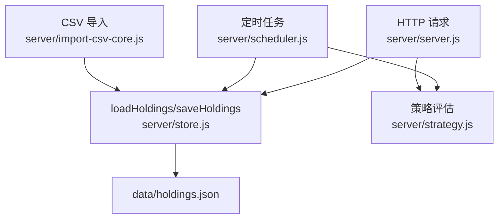
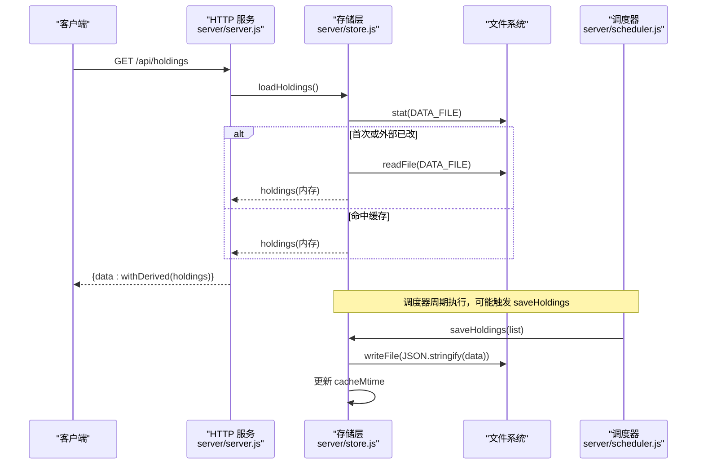
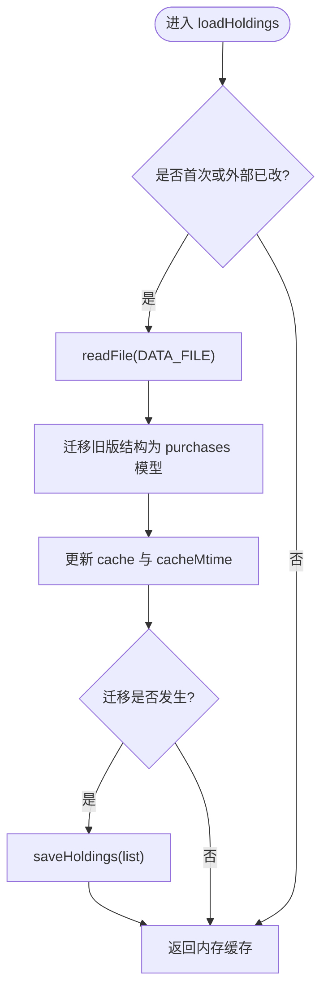
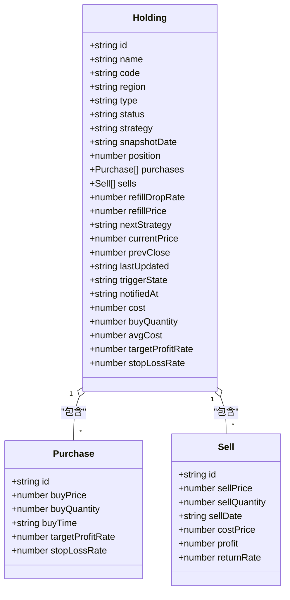
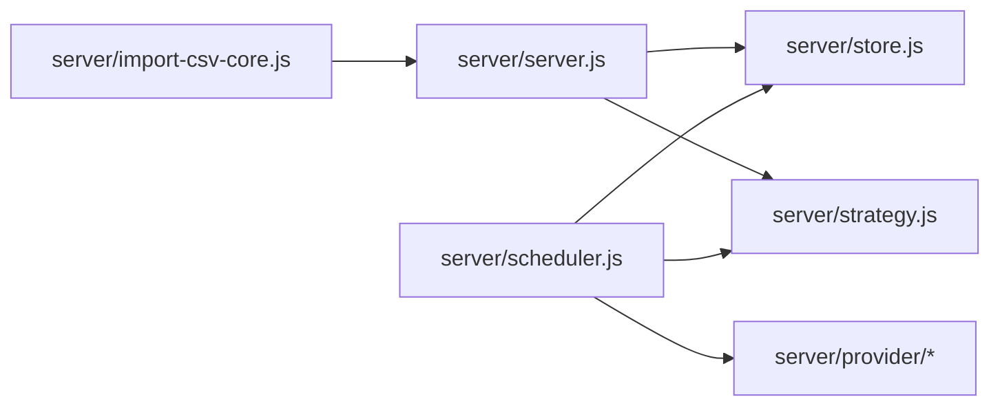

# 数据存储层

<cite>
**本文引用的文件**
- [server/store.js](file://server/store.js)
- [data/holdings.json](file://data/holdings.json)
- [server/server.js](file://server/server.js)
- [server/scheduler.js](file://server/scheduler.js)
- [server/import-csv-core.js](file://server/import-csv-core.js)
- [server/strategy.js](file://server/strategy.js)
- [config.json](file://config.json)
</cite>

## 目录
1. [简介](#简介)
2. [项目结构](#项目结构)
3. [核心组件](#核心组件)
4. [架构总览](#架构总览)
5. [详细组件分析](#详细组件分析)
6. [依赖关系分析](#依赖关系分析)
7. [性能考虑](#性能考虑)
8. [故障排查指南](#故障排查指南)
9. [结论](#结论)
10. [附录：数据模型与字段说明](#附录数据模型与字段说明)

## 简介
本指南聚焦 Stock Advisor 的数据存储层，围绕内存缓存、JSON 持久化、数据模型设计、数据迁移、并发一致性、性能优化与故障恢复等方面，提供从原理到实践的完整开发参考。系统以 JSON 文件作为唯一持久化载体，通过进程内内存缓存减少磁盘 I/O；通过串行写队列保证并发安全；通过 mtime 检测实现外部变更感知；通过迁移函数保障历史数据向后兼容。

## 项目结构
数据存储相关的关键位置与职责：
- server/store.js：内存缓存、加载/保存、版本迁移、并发写控制
- data/holdings.json：持仓数据的 JSON 持久化文件
- server/server.js：HTTP API 路由，调用 store 进行读写，并做数据校验与派生计算
- server/scheduler.js：定时任务，拉取行情后评估策略并落盘
- server/import-csv-core.js：CSV 导入逻辑，复用同一数据模型与同步逻辑
- server/strategy.js：策略引擎（止盈/止损/补仓），影响触发状态与通知
- config.json：调度间隔、冷却时间等运行配置

图表来源
- [server/server.js:409-565](file://server/server.js#L409-L565)
- [server/store.js:40-70](file://server/store.js#L40-L70)
- [server/scheduler.js:65-165](file://server/scheduler.js#L65-L165)
- [server/import-csv-core.js:170-306](file://server/import-csv-core.js#L170-L306)
- [server/strategy.js:34-90](file://server/strategy.js#L34-L90)

章节来源
- [server/store.js:1-71](file://server/store.js#L1-L71)
- [server/server.js:1-594](file://server/server.js#L1-L594)
- [server/scheduler.js:1-178](file://server/scheduler.js#L1-L178)
- [server/import-csv-core.js:1-307](file://server/import-csv-core.js#L1-L307)
- [server/strategy.js:1-91](file://server/strategy.js#L1-L91)
- [data/holdings.json:1-462](file://data/holdings.json#L1-L462)
- [config.json:1-19](file://config.json#L1-L19)

## 核心组件
- 内存缓存与并发写控制：使用模块级变量缓存 holdings 数组与文件修改时间戳，并通过 Promise 链串行化所有写入操作，避免调度器与 HTTP 接口同时写导致的覆盖问题。
- JSON 持久化：基于 Node fs/promises 的异步读写，统一格式化输出，写后更新 mtime 防止误判外部变更。
- 数据迁移：首次加载时检测旧版扁平结构，自动转换为「多次买入记录」模型，并回写磁盘，确保后续始终以新模型持久化。
- 数据校验与派生：API 层对新增/更新数据进行必填字段与数值校验；在读取时派生出交易明细、盈亏、均价、今日收益等展示字段。
- 策略与通知：根据当前价与成本加权阈值判断买卖信号，结合冷却时间避免重复通知，必要时更新触发态并落盘。

章节来源
- [server/store.js:8-70](file://server/store.js#L8-L70)
- [server/server.js:286-407](file://server/server.js#L286-L407)
- [server/scheduler.js:101-165](file://server/scheduler.js#L101-L165)

## 架构总览
系统采用“内存缓存 + 单文件 JSON”的轻量存储方案，HTTP 与定时任务共享同一份内存数据，通过串行写队列保证一致性。读路径支持外部文件变更检测，写路径保证幂等与顺序。

图表来源
- [server/server.js:409-414](file://server/server.js#L409-L414)
- [server/store.js:40-70](file://server/store.js#L40-L70)
- [server/scheduler.js:65-165](file://server/scheduler.js#L65-L165)

## 详细组件分析

### 内存缓存机制与数据结构
- 缓存对象：模块级变量持有 holdings 数组，以及对应的文件 mtime（毫秒）。
- 加载策略：
  - 首次加载或文件被外部修改（mtime > cacheMtime）时重新从磁盘读取。
  - 读取后进行数据迁移（旧版→新版 purchases 模型），如有变更则立即回写。
  - 否则直接返回内存中的 holdings。
- 写入策略：
  - 所有写入通过 writeChain 串行排队，避免并发覆盖。
  - 写入成功后重新获取 mtime，避免将自身写入误判为外部变更。

图表来源
- [server/store.js:14-59](file://server/store.js#L14-L59)
- [server/store.js:61-70](file://server/store.js#L61-L70)

章节来源
- [server/store.js:8-70](file://server/store.js#L8-L70)

### JSON 文件持久化的读写与错误处理
- 读：使用异步 readFile，捕获异常时按空结果处理（如 mtime 不存在返回 0）。
- 写：使用异步 writeFile，通过 Promise 链串行化；错误通过 console.error 记录，不中断调用方流程。
- 外部变更检测：stat 获取 mtime，若大于缓存 mtime 则重载，避免脏读。

章节来源
- [server/store.js:14-22](file://server/store.js#L14-L22)
- [server/store.js:40-70](file://server/store.js#L40-L70)

### 数据模型设计与字段验证规则
- 持仓对象（Holding）关键字段：
  - 标识与元信息：id、name、code、region、type、status、strategy、snapshotDate 等
  - 交易明细：purchases[]（多次买入）、sells[]（卖出记录）
  - 补仓计划：refillDropRate、refillPrice、nextStrategy
  - 行情快照：currentPrice、prevClose、lastUpdated
  - 触发与通知：triggerState、notifiedAt
  - 汇总字段：cost、buyQuantity、avgCost、targetProfitRate、stopLossRate 等（由 syncFromPurchases 计算）
- 字段验证：
  - 新建持仓必填 name/code/region/type，缺失抛错
  - 买入记录需 buyPrice>0、buyQuantity>0，否则抛错
  - 交易类型必须为 BUY/SELL，数量/价格必须为正
- 派生计算：
  - 每次买入派生 cost/marketValue/profit/returnRate/targetPrice/stopLossPrice
  - 汇总计算剩余仓位成本、均价、未实现/已实现盈利、今日收益等

图表来源
- [data/holdings.json:1-462](file://data/holdings.json#L1-L462)
- [server/server.js:286-407](file://server/server.js#L286-L407)

章节来源
- [server/server.js:286-407](file://server/server.js#L286-L407)
- [data/holdings.json:1-462](file://data/holdings.json#L1-L462)

### 数据迁移策略与向后兼容
- 旧版结构：单条买入（无 purchases 数组）
- 新版结构：purchases[] 多次买入记录
- 迁移逻辑：
  - 首次加载时检测 h.purchases 是否为数组，若非则构造默认 purchase 并替换
  - 迁移完成后立即回写磁盘，后续均以新模型持久化
  - 兼容字段映射：buyPrice/buyQuantity/buyTime/targetProfitRate/stopLossRate

章节来源
- [server/store.js:24-38](file://server/store.js#L24-L38)
- [server/store.js:47-57](file://server/store.js#L47-L57)

### 并发访问控制与事务处理
- 并发控制：writeChain 串行化所有写入，避免调度器与 HTTP 接口同时写造成覆盖
- 一致性保证：
  - 读路径通过 mtime 检测外部变更，保证最终一致
  - 写路径写后更新 cacheMtime，避免自写误判
- 事务语义：
  - 单文件 JSON 不支持 ACID 事务，但通过“先内存修改、再串行落盘”的方式实现近似原子性
  - 建议在业务层将一次操作的多个修改合并为一次 saveHoldings，降低不一致窗口

章节来源
- [server/store.js:8-12](file://server/store.js#L8-L12)
- [server/store.js:61-70](file://server/store.js#L61-L70)

### CSV 导入与数据一致性
- 幂等导入：以 (代码, 操作, 日期, 数量, 价格) 为唯一键，重复记录忽略
- 匹配策略：精确匹配 code，或数字归一化匹配（如 hk00700 → 700）
- 自动创建：可选 createMissing，按地区/类型新建持仓
- 成本计算：卖出按 LIFO 计算成本价，并同步汇总字段
- 错误隔离：逐行 try/catch，收集 errors 列表，不影响其他记录导入

章节来源
- [server/import-csv-core.js:170-306](file://server/import-csv-core.js#L170-L306)

### 策略评估与通知
- 策略输入：当前价、成本加权阈值、最近买入价、补仓计划
- 卖点：达到预期止盈（含 nearThreshold 容差）或任一买入记录触发止损
- 买点：接近补仓价或较最近买入价跌幅达到阈值
- 通知冷却：同一触发态在冷却时间内不重复推送，避免刷屏
- 状态更新：触发后设置 triggerState 与 notifiedAt，并落盘

章节来源
- [server/strategy.js:34-90](file://server/strategy.js#L34-L90)
- [server/scheduler.js:101-165](file://server/scheduler.js#L101-L165)
- [config.json:1-19](file://config.json#L1-L19)

## 依赖关系分析
- server/server.js 依赖 store.js 进行数据读写，依赖 strategy.js 进行策略评估，依赖 notifier.js 发送通知
- server/scheduler.js 依赖 store.js、provider/*、strategy.js、notifier.js
- server/import-csv-core.js 可独立复用，与 server.js 共享 normalizePurchase/syncFromPurchases 等逻辑

图表来源
- [server/server.js:1-8](file://server/server.js#L1-L8)
- [server/scheduler.js:1-5](file://server/scheduler.js#L1-L5)
- [server/import-csv-core.js:1-6](file://server/import-csv-core.js#L1-L6)

章节来源
- [server/server.js:1-594](file://server/server.js#L1-L594)
- [server/scheduler.js:1-178](file://server/scheduler.js#L1-L178)
- [server/import-csv-core.js:1-307](file://server/import-csv-core.js#L1-L307)

## 性能考虑
- 读路径优化：
  - 内存缓存避免重复磁盘读取
  - 仅当 mtime 变化或首次加载时读盘
- 写路径优化：
  - 串行写队列减少锁竞争与覆盖风险
  - 批量合并修改后再落盘，减少 I/O 次数
- 网络与策略：
  - 并行拉取股票与基金净值（Promise.all）
  - 非交易时段降频刷新，降低资源消耗
- 显示层优化：
  - 派生字段按需计算，避免冗余计算

[本节为通用指导，不直接分析具体文件]

## 故障排查指南
- 常见错误与定位：
  - 缺少必填字段：检查新建持仓与买入记录的必填项
  - 卖出数量超过持仓：检查 LIFO 成本计算与剩余数量
  - CSV 表头缺失：确认包含必需列（代码/操作/日期/数量/价格）
  - 飞书推送失败：检查 webhook 与 secret 配置
- 日志与调试：
  - 存储层写错误会打印到控制台，便于定位 IO 问题
  - 调度器跳过无行情品种并记录警告
- 恢复建议：
  - 若 holdings.json 损坏，可从备份恢复（仓库中提供多份备份）
  - 通过 CSV 导入重建交易明细，再执行一次 runOnce 刷新行情

章节来源
- [server/server.js:437-543](file://server/server.js#L437-L543)
- [server/import-csv-core.js:170-306](file://server/import-csv-core.js#L170-L306)
- [server/scheduler.js:72-86](file://server/scheduler.js#L72-L86)

## 结论
该数据存储层以简洁可靠的内存缓存与单文件 JSON 持久化为核心，通过串行写队列、mtime 检测与迁移机制，实现了高可用的一致性保障。配合策略引擎与通知冷却，系统在低复杂度下提供了稳定的交易辅助能力。未来可扩展方向包括：引入 WAL/快照提升可靠性、增加索引加速查询、扩展更多市场与资产类型。

[本节为总结，不直接分析具体文件]

## 附录：数据模型与字段说明
- 持仓（Holding）
  - 标识：id、name、code、region、type、status、strategy
  - 快照：snapshotDate、snapshotProfit、snapshotReturnRate、position
  - 交易明细：purchases[]、sells[]
  - 补仓：refillDropRate、refillPrice、nextStrategy
  - 行情：currentPrice、prevClose、lastUpdated
  - 触发：triggerState、notifiedAt
  - 汇总：cost、buyQuantity、avgCost、targetProfitRate、stopLossRate、marketValue、holdingProfit、todayProfit 等（派生）
- 买入（Purchase）
  - id、buyPrice、buyQuantity、buyTime、targetProfitRate、stopLossRate
- 卖出（Sell）
  - id、sellPrice、sellQuantity、sellDate、costPrice、profit、returnRate

章节来源
- [data/holdings.json:1-462](file://data/holdings.json#L1-L462)
- [server/server.js:146-245](file://server/server.js#L146-L245)
- [server/import-csv-core.js:82-128](file://server/import-csv-core.js#L82-L128)