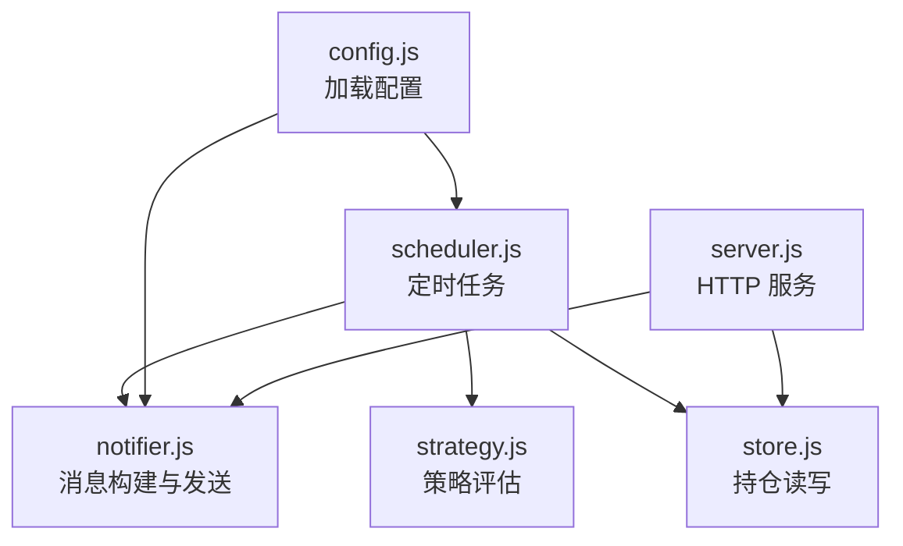
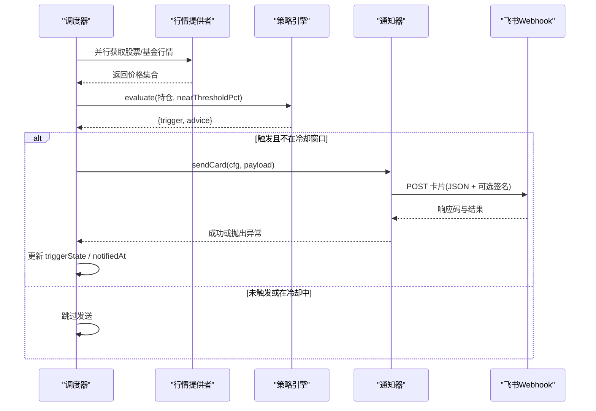
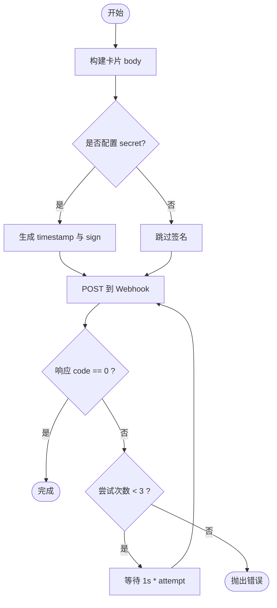
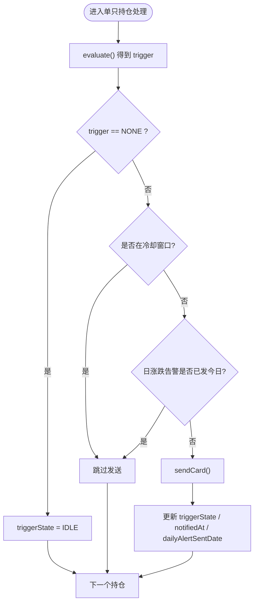
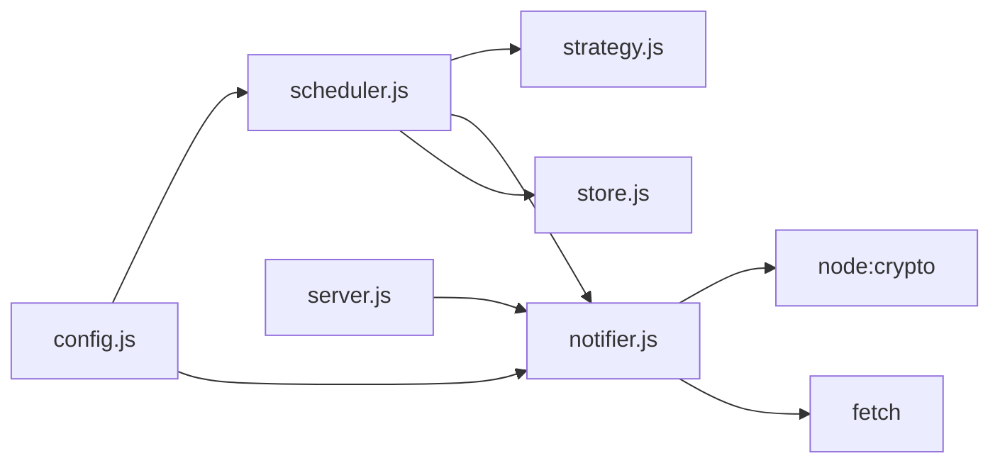

# 通知系统

<cite>
**本文引用的文件**
- [server/notifier.js](file://server/notifier.js)
- [server/scheduler.js](file://server/scheduler.js)
- [server/config.js](file://server/config.js)
- [config.json](file://config.json)
- [server/server.js](file://server/server.js)
- [server/store.js](file://server/store.js)
- [server/strategy.js](file://server/strategy.js)
</cite>

## 目录
1. [简介](#简介)
2. [项目结构](#项目结构)
3. [核心组件](#核心组件)
4. [架构总览](#架构总览)
5. [详细组件分析](#详细组件分析)
6. [依赖关系分析](#依赖关系分析)
7. [性能与扩展性](#性能与扩展性)
8. [故障排查指南](#故障排查指南)
9. [结论](#结论)
10. [附录：测试与调试](#附录测试与调试)

## 简介
本开发文档聚焦 Stock Advisor 的通知子系统，围绕飞书机器人 Webhook 的集成实现、消息模板设计、通知冷却机制、错误处理策略、自定义通知渠道扩展方法以及消息测试与调试工具进行系统化说明。目标是帮助开发者快速理解并安全地扩展通知能力，确保在交易时段与非交易时段均能稳定、可控地推送告警。

## 项目结构
通知相关代码主要分布在以下模块：
- 调度器：负责定时拉取行情、评估策略、触发通知与冷却控制
- 通知器：构造飞书卡片消息并通过 Webhook 发送（含签名与重试）
- 配置加载：从配置文件读取调度间隔、Webhook、冷却时间等
- 存储层：持久化持仓数据，包含通知状态字段
- 策略引擎：根据价格与买入记录计算触发类型与建议文案
- HTTP 服务：提供测试接口与前端静态资源托管

图表来源
- [server/scheduler.js:65-177](file://server/scheduler.js#L65-L177)
- [server/notifier.js:4-111](file://server/notifier.js#L4-L111)
- [server/strategy.js:34-90](file://server/strategy.js#L34-L90)
- [server/store.js:40-70](file://server/store.js#L40-L70)
- [server/config.js:7-10](file://server/config.js#L7-L10)
- [server/server.js:545-562](file://server/server.js#L545-L562)

章节来源
- [server/scheduler.js:65-177](file://server/scheduler.js#L65-L177)
- [server/notifier.js:4-111](file://server/notifier.js#L4-L111)
- [server/config.js:7-10](file://server/config.js#L7-L10)
- [server/server.js:545-562](file://server/server.js#L545-L562)

## 核心组件
- 飞书消息模板与发送：支持日涨跌告警与买卖点提醒两类卡片，自动注入动态内容；可选 secret 签名；内置指数退避重试
- 调度与冷却：按市场交易时段切换刷新频率；同一触发态在冷却窗口内不重复推送；每日涨跌告警按日期去重
- 策略评估：基于加权止盈/止损与补仓条件生成触发类型与建议文案
- 配置与持久化：从 config.json 读取 Webhook、冷却时间、近阈值等；持仓数据包含通知状态字段用于冷却与去重

章节来源
- [server/notifier.js:4-111](file://server/notifier.js#L4-L111)
- [server/scheduler.js:101-157](file://server/scheduler.js#L101-L157)
- [server/strategy.js:34-90](file://server/strategy.js#L34-L90)
- [config.json:1-18](file://config.json#L1-L18)
- [server/store.js:40-70](file://server/store.js#L40-L70)

## 架构总览
通知系统的整体流程如下：
- 调度器周期性运行，判断是否处于交易时段以选择刷新间隔
- 并行获取股票与基金行情，更新持仓当前价与前收
- 对每个活跃持仓执行策略评估，结合日涨跌阈值判定是否触发
- 若触发且不在冷却窗口，则调用通知器发送飞书卡片
- 更新持仓中的触发状态与最近通知时间，必要时落盘

图表来源
- [server/scheduler.js:65-177](file://server/scheduler.js#L65-L177)
- [server/notifier.js:81-111](file://server/notifier.js#L81-L111)

## 详细组件分析

### 飞书 Webhook 集成与消息模板
- 消息类型：interactive 卡片，启用宽屏模式
- 模板分支：
  - 日涨跌告警：标题区分“大涨/大跌”，头部模板色不同，元素包含品种、代码、市场/类型、当前价、详情与建议、摘要
  - 买卖点提醒：标题区分“买点/卖点”，头部模板色不同，元素结构与日涨跌类似
- 动态填充：通过 payload 注入 name、code、region、type、currentPrice、advice、summary 等字段
- 签名校验：当配置中存在 secret 时，使用 timestamp 与 secret 生成 HMAC-SHA256 签名并附加到请求体
- 发送与重试：POST 到 webhook，Content-Type 为 application/json；最多尝试 3 次，失败后指数退避等待

图表来源
- [server/notifier.js:4-111](file://server/notifier.js#L4-L111)

章节来源
- [server/notifier.js:4-111](file://server/notifier.js#L4-L111)
- [config.json:10-13](file://config.json#L10-L13)

### 消息模板设计与动态内容
- 卡片头部：标题与模板颜色随触发类型变化，便于视觉区分
- 信息区块：采用 fields 展示关键指标（品种、代码、市场/类型、当前价），使用 lark_md 富文本
- 建议与摘要：advice 由策略引擎生成，summary 用于卡片底部标注来源与上下文
- 可扩展性：如需新增字段或布局，可在 buildCard 中增加 elements 或 fields 节点

章节来源
- [server/notifier.js:4-78](file://server/notifier.js#L4-L78)
- [server/strategy.js:34-90](file://server/strategy.js#L34-L90)

### 通知冷却机制与防重复
- 冷却窗口：同一触发态且在 notifiedAt 之后 cfg.notify.cooldownSeconds 秒内不重复发送，避免刷屏
- 每日涨跌告警去重：使用 dailyAlertSentDate 记录已发送日期，同一天仅发一次
- 状态回滚：若无触发，将 triggerState 重置为 IDLE，保证下一轮重新评估
- 持久化：changed 标志决定是否保存 holdings，从而持久化 notifiedAt 与 triggerState

图表来源
- [server/scheduler.js:101-157](file://server/scheduler.js#L101-L157)
- [server/store.js:62-70](file://server/store.js#L62-L70)

章节来源
- [server/scheduler.js:101-157](file://server/scheduler.js#L101-L157)
- [config.json:14-17](file://config.json#L14-L17)

### 错误处理策略
- 网络异常重试：sendCard 内部循环最多 3 次，每次失败后等待 1s * attempt 再重试
- 业务错误处理：若飞书返回 code !== 0，立即抛错；上层 catch 记录日志
- 调度容错：runOnce 异常会被捕获，仍继续下一次循环，避免整个调度崩溃
- 日志定位：统一输出带前缀的错误日志（如 [notify]、[notify-daily]、[stock-fetch]、[fund-fetch]）

章节来源
- [server/notifier.js:96-111](file://server/notifier.js#L96-L111)
- [server/scheduler.js:77-86](file://server/scheduler.js#L77-L86)
- [server/scheduler.js:167-177](file://server/scheduler.js#L167-L177)

### 自定义通知渠道扩展方法
- 抽象发送接口：当前 sendCard 作为单一出口，可封装为适配器模式，新增渠道只需实现相同签名
- 配置驱动：在 config.json 中新增 channels 数组，调度器按配置路由到对应发送器
- 模板复用：buildCard 可保留为通用模板工厂，各渠道按需转换
- 示例扩展点：
  - 新增企业微信/钉钉 Webhook：复制 sendCard 逻辑，替换目标 URL 与签名算法
  - 多通道广播：在 sendCard 中遍历多个 channel 并发发送
  - 降级策略：主通道失败时切换到备用通道

章节来源
- [server/notifier.js:81-111](file://server/notifier.js#L81-L111)
- [config.json:10-13](file://config.json#L10-L13)

### 策略引擎与通知联动
- 评估维度：加权止盈、单笔止损、补仓条件（补仓价或跌幅）
- 输出字段：trigger（BUY/SELL/NONE）、advice（操作建议）、returnRate/dropRate（用于卡片展示）
- 联动方式：scheduler 根据 evaluate 结果决定是否发送通知，并结合冷却与日涨跌阈值

章节来源
- [server/strategy.js:34-90](file://server/strategy.js#L34-L90)
- [server/scheduler.js:126-157](file://server/scheduler.js#L126-L157)

## 依赖关系分析
- scheduler.js 依赖：
  - store.js：读取与保存持仓数据（含通知状态）
  - provider/tencent.js 与 provider/fund.js：获取行情
  - strategy.js：策略评估
  - notifier.js：发送通知
- notifier.js 依赖：
  - node:crypto：生成签名
  - fetch：HTTP 请求
- server.js 暴露测试接口 /api/test-feishu，直接调用 notifier.sendCard
- config.js 提供统一的配置加载入口

图表来源
- [server/scheduler.js:1-6](file://server/scheduler.js#L1-L6)
- [server/notifier.js:1-2](file://server/notifier.js#L1-L2)
- [server/server.js:5-7](file://server/server.js#L5-L7)
- [server/config.js:7-10](file://server/config.js#L7-L10)

章节来源
- [server/scheduler.js:1-6](file://server/scheduler.js#L1-L6)
- [server/notifier.js:1-2](file://server/notifier.js#L1-L2)
- [server/server.js:5-7](file://server/server.js#L5-L7)
- [server/config.js:7-10](file://server/config.js#L7-L10)

## 性能与扩展性
- 并行拉取：股票与基金行情使用 Promise.all 并行获取，降低延迟
- 冷却降频：非交易时段拉长刷新间隔，减少无效请求与通知
- 串行写盘：saveHoldings 使用队列串行写入，避免并发覆盖
- 可扩展点：
  - 新增行情源：在 scheduler 中扩展 provider 列表
  - 新增通知渠道：在 notifier 中增加适配器
  - 新增策略：在 strategy 中扩展评估规则

章节来源
- [server/scheduler.js:77-86](file://server/scheduler.js#L77-L86)
- [server/scheduler.js:58-63](file://server/scheduler.js#L58-L63)
- [server/store.js:62-70](file://server/store.js#L62-L70)

## 故障排查指南
- 无法收到通知：
  - 检查 config.json 中 feishu.webhook 与 secret 是否正确
  - 查看控制台日志是否有 [notify] 或 [notify-daily] 错误
  - 使用 /api/test-feishu 接口验证连通性
- 频繁刷屏：
  - 调整 notify.cooldownSeconds 增大冷却窗口
  - 确认 dailyDropAlertPct / dailyRiseAlertPct 设置合理
- 行情缺失导致不触发：
  - 检查 stock-fetch / fund-fetch 日志，确认 API 返回
  - 核对 region 与 code 匹配规则（股票为 region+code，基金为 code）
- 状态未持久化：
  - 检查 data/holdings.json 是否被外部修改导致缓存失效
  - 确认 saveHoldings 是否被调用（changed 标志）

章节来源
- [server/notifier.js:96-111](file://server/notifier.js#L96-L111)
- [server/scheduler.js:77-86](file://server/scheduler.js#L77-L86)
- [server/scheduler.js:101-157](file://server/scheduler.js#L101-L157)
- [server/store.js:40-70](file://server/store.js#L40-L70)

## 结论
该通知系统以调度器为核心，结合策略引擎与通知器，实现了面向飞书的卡片消息推送。通过冷却机制与每日去重，有效避免了重复与刷屏问题；通过重试与日志，提升了鲁棒性与可观测性。系统具备良好的扩展性，可按需新增通知渠道与策略规则。配合测试接口与配置项，便于开发与运维阶段的调试与调优。

## 附录：测试与调试
- 启动服务后，访问 http://{host}:{port}/api/test-feishu 发送一条测试消息到飞书机器人，验证 Webhook 与签名是否正常
- 观察控制台日志：
  - [tick] 显示每轮调度结果与模式（交易时段/非交易时段）
  - [notify] / [notify-daily] 显示通知发送结果
  - [stock-fetch] / [fund-fetch] 显示行情拉取情况
- 常用配置项：
  - schedule.intervalSeconds：交易时段刷新间隔（秒）
  - schedule.offHoursIntervalSeconds：非交易时段刷新间隔（秒）
  - feishu.webhook：飞书机器人 Webhook 地址
  - feishu.secret：可选签名密钥
  - notify.cooldownSeconds：通知冷却窗口（秒）
  - notify.nearThresholdPct：接近阈值百分比

章节来源
- [server/server.js:545-562](file://server/server.js#L545-L562)
- [config.json:1-18](file://config.json#L1-L18)
- [server/scheduler.js:161-164](file://server/scheduler.js#L161-L164)