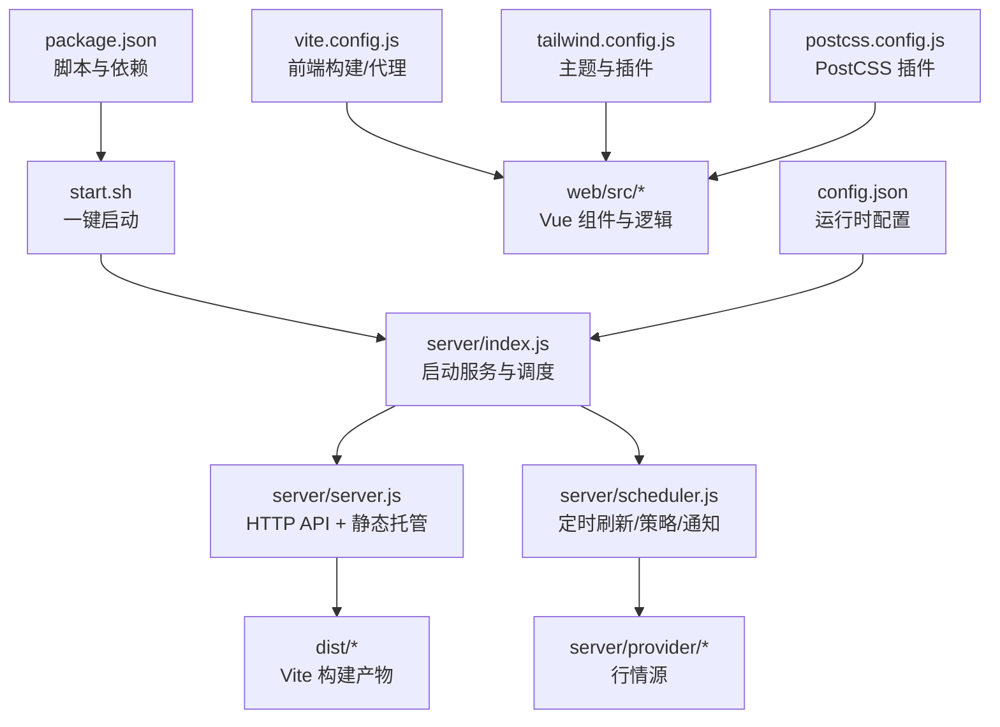
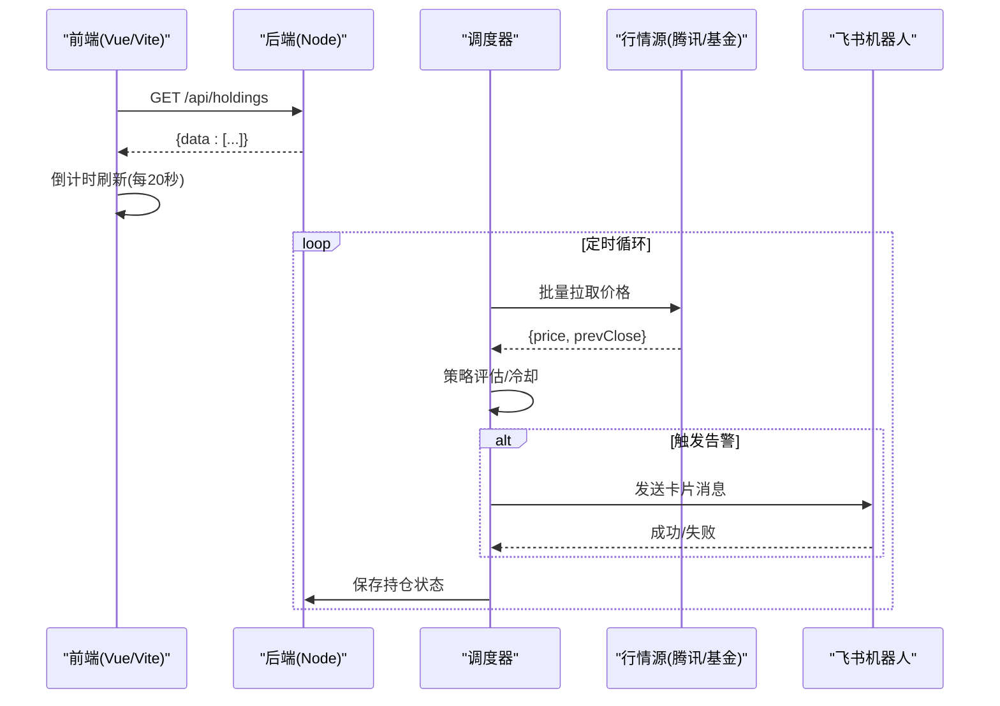
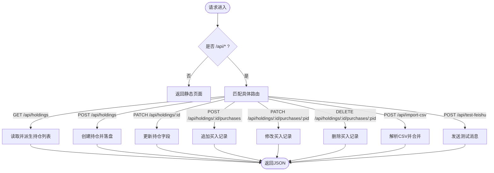
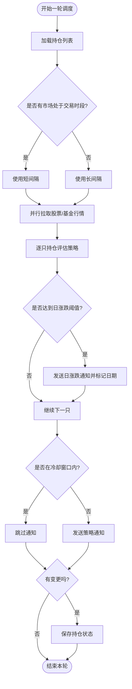
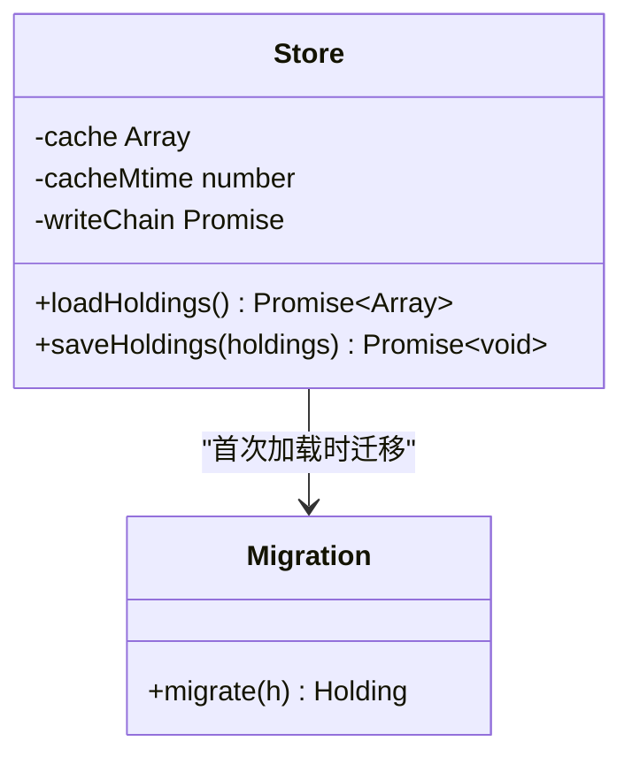
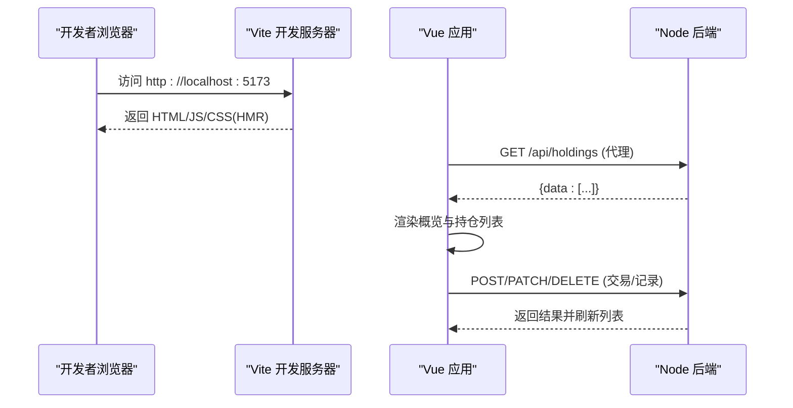
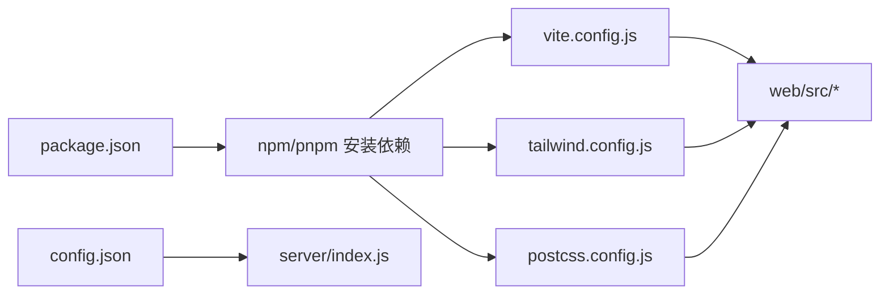

# 开发指南

<cite>
**本文引用的文件**
- [package.json](file://package.json)
- [config.json](file://config.json)
- [start.sh](file://start.sh)
- [vite.config.js](file://vite.config.js)
- [tailwind.config.js](file://tailwind.config.js)
- [postcss.config.js](file://postcss.config.js)
- [server/index.js](file://server/index.js)
- [server/server.js](file://server/server.js)
- [server/config.js](file://server/config.js)
- [server/scheduler.js](file://server/scheduler.js)
- [server/store.js](file://server/store.js)
- [web/src/main.js](file://web/src/main.js)
- [web/src/App.vue](file://web/src/App.vue)
- [web/src/composables/useHoldings.js](file://web/src/composables/useHoldings.js)
- [web/src/constants/options.js](file://web/src/constants/options.js)
- [docs/项目计划.md](file://docs/项目计划.md)
</cite>

## 目录
1. [简介](#简介)
2. [项目结构](#项目结构)
3. [核心组件](#核心组件)
4. [架构总览](#架构总览)
5. [详细组件分析](#详细组件分析)
6. [依赖关系分析](#依赖关系分析)
7. [性能与构建优化](#性能与构建优化)
8. [调试与排错指南](#调试与排错指南)
9. [结论](#结论)
10. [附录：新功能开发示例](#附录：新功能开发示例)

## 简介
本指南面向希望快速上手 Stock Advisor（股票秘书）项目的开发者，涵盖开发环境搭建、前后端工作流、代码规范、调试技巧、测试策略以及新功能开发的完整流程。项目采用 Node.js 后端 + Vue 3 + Vite 前端，提供多市场持仓管理、实时行情抓取、阈值策略判断与飞书机器人推送能力。

## 项目结构
- 根目录包含配置与脚本：package.json、config.json、start.sh、vite.config.js、tailwind.config.js、postcss.config.js。
- server/ 为后端服务：入口 index.js，HTTP 路由与静态资源托管 server.js，调度器 scheduler.js，数据持久化 store.js，配置加载 config.js，行情提供方 provider/ 等。
- web/ 为前端源码：Vue 应用入口 main.js，根组件 App.vue，组合式逻辑 composables/，常量 constants/，样式与构建由 Vite/Tailwind/DaisyUI 管理。
- data/ 存放持久化数据 holdings.json。
- docs/ 包含项目计划等业务文档。

图表来源
- [package.json:1-32](file://package.json#L1-L32)
- [start.sh:1-100](file://start.sh#L1-L100)
- [server/index.js:1-17](file://server/index.js#L1-L17)
- [server/server.js:1-594](file://server/server.js#L1-L594)
- [server/scheduler.js:1-178](file://server/scheduler.js#L1-L178)
- [vite.config.js:1-26](file://vite.config.js#L1-L26)
- [tailwind.config.js:1-54](file://tailwind.config.js#L1-L54)
- [postcss.config.js:1-7](file://postcss.config.js#L1-L7)
- [config.json:1-19](file://config.json#L1-L19)

章节来源
- [package.json:1-32](file://package.json#L1-L32)
- [start.sh:1-100](file://start.sh#L1-L100)
- [vite.config.js:1-26](file://vite.config.js#L1-L26)
- [tailwind.config.js:1-54](file://tailwind.config.js#L1-L54)
- [postcss.config.js:1-7](file://postcss.config.js#L1-L7)
- [server/index.js:1-17](file://server/index.js#L1-L17)
- [server/server.js:1-594](file://server/server.js#L1-L594)
- [server/scheduler.js:1-178](file://server/scheduler.js#L1-L178)
- [config.json:1-19](file://config.json#L1-L19)

## 核心组件
- 后端入口与启动流程：加载配置、启动 HTTP 服务、启动调度循环或单次运行模式。
- HTTP 服务与 API：统一处理 /api/* 接口，返回 JSON；非 /api 请求托管 dist 下的静态页面。
- 调度器：按交易时段选择刷新间隔，拉取行情，执行策略评估，发送飞书通知，状态冷却与落盘。
- 数据存储：内存缓存 + 串行写盘，支持旧模型迁移，避免并发覆盖。
- 前端应用：Vue 3 + Vite，自动刷新倒计时，组合式函数 useHoldings 封装数据获取与写操作，Tailwind + DaisyUI 主题。

章节来源
- [server/index.js:1-17](file://server/index.js#L1-L17)
- [server/server.js:1-594](file://server/server.js#L1-L594)
- [server/scheduler.js:1-178](file://server/scheduler.js#L1-L178)
- [server/store.js:1-71](file://server/store.js#L1-L71)
- [web/src/main.js:1-6](file://web/src/main.js#L1-L6)
- [web/src/App.vue:1-197](file://web/src/App.vue#L1-L197)
- [web/src/composables/useHoldings.js:1-154](file://web/src/composables/useHoldings.js#L1-L154)

## 架构总览
系统由“前端 + 后端 + 调度 + 外部行情源 + 飞书”构成。前端通过 Vite 开发服务器提供热更新，并代理 /api 到本地后端；生产模式下由后端直接托管 dist 静态资源。调度器周期性拉取行情，计算策略触发，必要时向飞书推送卡片消息。

图表来源
- [server/scheduler.js:65-178](file://server/scheduler.js#L65-L178)
- [server/server.js:409-565](file://server/server.js#L409-L565)
- [web/src/composables/useHoldings.js:15-43](file://web/src/composables/useHoldings.js#L15-L43)
- [vite.config.js:14-24](file://vite.config.js#L14-L24)

## 详细组件分析

### 后端服务与API
- 路由与响应：/api/holdings 列表、新增、更新、买入记录增删改、CSV 导入、飞书测试消息等；非 /api 路径返回静态页面。
- 数据派生：对每条持仓计算成本、市值、收益、今日涨跌、均价、目标/止损价等，供前端展示。
- 错误处理：参数校验失败返回 400，不存在资源返回 404，未知路径 404，未捕获异常 500。

图表来源
- [server/server.js:35-594](file://server/server.js#L35-L594)

章节来源
- [server/server.js:1-594](file://server/server.js#L1-L594)

### 调度器与策略
- 交易时段判断：基于各市场时区与本地时间，区分交易与非交易时段，动态调整刷新间隔。
- 行情获取：股票走腾讯行情，基金走净值接口，失败降级不中断整体流程。
- 策略评估：根据持仓当前价、成本、止盈/止损比例、日涨跌阈值等计算触发态，结合冷却机制避免重复通知。
- 通知与落盘：触发后发送飞书卡片，更新触发状态与最近通知时间，变更时写回磁盘。

图表来源
- [server/scheduler.js:7-178](file://server/scheduler.js#L7-L178)

章节来源
- [server/scheduler.js:1-178](file://server/scheduler.js#L1-L178)

### 数据存储与迁移
- 内存缓存：首次加载或检测到文件被外部修改时重新读盘，否则复用内存缓存。
- 串行写盘：通过 Promise 链保证多次写入顺序，避免并发覆盖。
- 模型迁移：旧版单条买入记录自动迁移为 purchases 数组，并在首次发现时写回磁盘。

图表来源
- [server/store.js:1-71](file://server/store.js#L1-L71)

章节来源
- [server/store.js:1-71](file://server/store.js#L1-L71)

### 前端应用与工作流
- 入口与挂载：main.js 创建 Vue 应用并挂载到 #app。
- 组合式逻辑：useHoldings 封装数据获取、自动刷新倒计时、写操作（新增持仓、交易、买入记录、删除、更新）。
- 主题与样式：Tailwind + DaisyUI，darkMode 通过 html class 切换，预定义 stocklight/stockdark 主题。
- 构建与代理：Vite root 指向 web，输出到 ../dist；开发时 /api 代理到本地后端 3000 端口。

图表来源
- [web/src/main.js:1-6](file://web/src/main.js#L1-L6)
- [web/src/composables/useHoldings.js:15-154](file://web/src/composables/useHoldings.js#L15-L154)
- [vite.config.js:7-24](file://vite.config.js#L7-L24)
- [tailwind.config.js:4-53](file://tailwind.config.js#L4-L53)

章节来源
- [web/src/main.js:1-6](file://web/src/main.js#L1-L6)
- [web/src/App.vue:1-197](file://web/src/App.vue#L1-L197)
- [web/src/composables/useHoldings.js:1-154](file://web/src/composables/useHoldings.js#L1-L154)
- [web/src/constants/options.js:1-33](file://web/src/constants/options.js#L1-L33)
- [vite.config.js:1-26](file://vite.config.js#L1-L26)
- [tailwind.config.js:1-54](file://tailwind.config.js#L1-L54)
- [postcss.config.js:1-7](file://postcss.config.js#L1-L7)

## 依赖关系分析
- 运行时依赖：Vue 3（前端框架）。
- 开发依赖：Vite、@vitejs/plugin-vue、Tailwind CSS、DaisyUI、PostCSS、Autoprefixer、Puppeteer Core（用于截图/自动化场景）。
- 关键配置文件：
  - package.json：脚本 start/dev/build/preview、engines.node >= 18。
  - vite.config.js：root=web，outDir=../dist，/api 代理至 127.0.0.1:3000。
  - tailwind.config.js：启用 daisyui，定义 stocklight/stockdark 主题。
  - postcss.config.js：启用 Tailwind 与 Autoprefixer。
  - config.json：调度间隔、服务器地址端口、飞书 Webhook、通知冷却与阈值。

图表来源
- [package.json:1-32](file://package.json#L1-L32)
- [vite.config.js:1-26](file://vite.config.js#L1-L26)
- [tailwind.config.js:1-54](file://tailwind.config.js#L1-L54)
- [postcss.config.js:1-7](file://postcss.config.js#L1-L7)
- [config.json:1-19](file://config.json#L1-L19)

章节来源
- [package.json:1-32](file://package.json#L1-L32)
- [vite.config.js:1-26](file://vite.config.js#L1-L26)
- [tailwind.config.js:1-54](file://tailwind.config.js#L1-L54)
- [postcss.config.js:1-7](file://postcss.config.js#L1-L7)
- [config.json:1-19](file://config.json#L1-L19)

## 性能与构建优化
- 前端构建：Vite 以 web 为根，产物输出到 ../dist；生产模式由后端直接托管静态资源，减少请求开销。
- 自动刷新：前端每秒心跳递减，归零触发一次刷新，避免多定时器漂移；后端调度按交易时段动态调整间隔，非交易时段降频。
- 数据读写：store.js 使用内存缓存与串行写盘，降低并发冲突与磁盘压力。
- 主题与样式：Tailwind + DaisyUI 按需生成样式，减少冗余；darkMode 通过 class 切换，避免重绘代价。

[本节为通用指导，无需特定文件引用]

## 调试与排错指南
- 启动方式：
  - 开发模式：./start.sh dev，同时启动后端(:3000)与 Vite(:5173)，/api 自动代理到后端。
  - 生产模式：./start.sh，先构建前端（如缺失），再启动后端托管 dist。
- 常见问题：
  - Node 版本过低：脚本会检查并提示需要 >= 18。
  - 依赖缺失：首次运行会自动安装依赖。
  - 端口占用：修改 config.json 的 server.port 或 vite.config.js 的 server.port。
  - 飞书推送失败：使用 /api/test-feishu 验证 Webhook 与签名配置是否正确。
  - 行情无数据：检查 provider 实现与网络连通性，调度日志会打印 skip 警告。
- 调试建议：
  - 在浏览器 Network 面板查看 /api 请求与响应。
  - 在后端控制台查看调度日志与错误堆栈。
  - 使用 ONCE 环境变量单次运行调度，便于定位问题。

章节来源
- [start.sh:1-100](file://start.sh#L1-L100)
- [server/server.js:545-565](file://server/server.js#L545-L565)
- [server/scheduler.js:65-178](file://server/scheduler.js#L65-L178)
- [vite.config.js:14-24](file://vite.config.js#L14-L24)
- [config.json:1-19](file://config.json#L1-L19)

## 结论
Stock Advisor 提供了轻量而实用的个人股票秘书方案：前端可视化、后端稳定托管、调度灵活、策略可配、通知及时。遵循本指南可以快速完成环境搭建、理解架构、开展开发与调试，并按需扩展功能。

[本节为总结性内容，无需特定文件引用]

## 附录：新功能开发示例
以下以“新增一个持仓字段并展示”为例，说明从需求到实现的步骤：

- 需求分析
  - 明确字段用途、数据来源、默认值、是否允许为空、是否参与计算。
  - 确定是否需要影响策略评估或通知模板。

- 后端改动
  - 在创建/更新持仓时接收新字段，并保存到持久化数据。
  - 在派生逻辑中计算展示字段（如需）。
  - 在 API 响应中包含新字段，确保向后兼容。

- 前端改动
  - 在表单与表格中添加输入与展示。
  - 在 useHoldings 中处理新增字段的提交与刷新。
  - 在常量或枚举中维护选项（如有下拉）。

- 测试与验证
  - 单元测试：针对派生逻辑与边界条件。
  - 集成测试：调用 /api 接口验证新增字段写入与读取。
  - 端到端测试：在 UI 中录入并观察展示与行为。

- 发布与回归
  - 构建前端并部署，验证生产环境行为。
  - 检查调度与通知是否受新字段影响。

章节来源
- [server/server.js:302-450](file://server/server.js#L302-L450)
- [web/src/App.vue:48-74](file://web/src/App.vue#L48-L74)
- [web/src/composables/useHoldings.js:67-130](file://web/src/composables/useHoldings.js#L67-L130)
- [docs/项目计划.md:32-67](file://docs/项目计划.md#L32-L67)