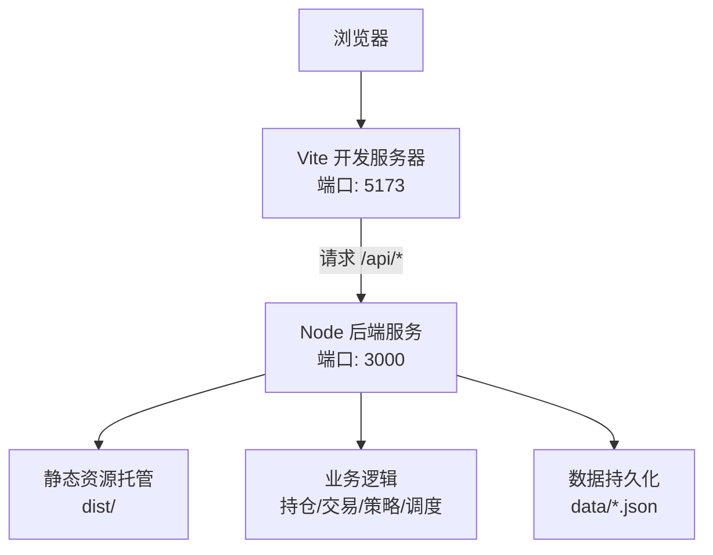
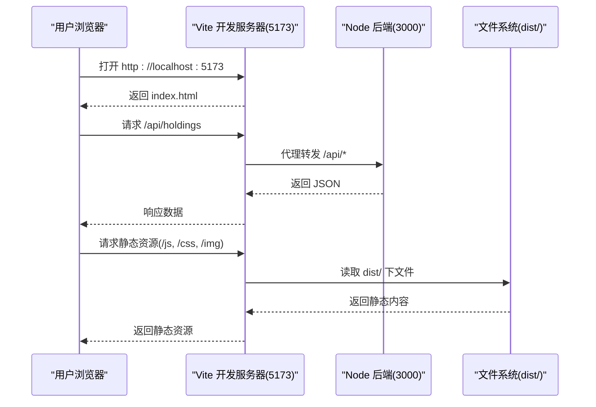

# 开发环境搭建

<cite>
**本文引用的文件**
- [package.json](file://package.json)
- [vite.config.js](file://vite.config.js)
- [server/index.js](file://server/index.js)
- [server/server.js](file://server/server.js)
- [config.json](file://config.json)
- [start.sh](file://start.sh)
- [web/src/main.js](file://web/src/main.js)
- [web/index.html](file://web/index.html)
</cite>

## 目录
1. [简介](#简介)
2. [项目结构](#项目结构)
3. [核心组件](#核心组件)
4. [架构总览](#架构总览)
5. [详细组件分析](#详细组件分析)
6. [依赖与安装](#依赖与安装)
7. [IDE 配置建议](#ide-配置建议)
8. [启动方式](#启动方式)
9. [常见问题排查](#常见问题排查)
10. [Docker 容器化（可选）](#docker-容器化可选)
11. [结论](#结论)

## 简介
本指南面向首次接触 Stock Advisor（股票秘书）的开发者，目标是帮助你在本地快速搭建可运行的开发环境。内容涵盖 Node.js 版本要求、包管理器选择、依赖安装、IDE 配置、前后端启动命令、常见环境问题定位与解决，以及可选的 Docker 容器化部署方案。

## 项目结构
Stock Advisor 采用前后端分离的工程组织：
- 前端位于 web/，基于 Vue 3 + Vite，开发时通过 Vite 提供热更新；生产构建产物输出到根目录 dist/。
- 后端位于 server/，使用原生 Node.js http 模块提供 API，并托管静态资源。
- 根目录包含脚本与配置文件，如 start.sh（一键启动）、config.json（运行时配置）、vite.config.js（前端构建与代理）。

图表来源
- [vite.config.js:14-24](file://vite.config.js#L14-L24)
- [server/server.js:567-593](file://server/server.js#L567-L593)

章节来源
- [vite.config.js:1-26](file://vite.config.js#L1-L26)
- [server/server.js:1-594](file://server/server.js#L1-L594)
- [web/index.html:1-13](file://web/index.html#L1-L13)
- [web/src/main.js:1-6](file://web/src/main.js#L1-L6)

## 核心组件
- 前端入口与路由挂载：web/src/main.js 创建 Vue 应用并挂载到 #app。
- 前端构建与开发服务器：vite.config.js 指定 root=web，构建输出到 ../dist，开发时 host=true、port=5173，并将 /api 代理到后端 :3000。
- 后端主入口：server/index.js 加载配置、启动 HTTP 服务、启动行情抓取与调度。
- 后端 HTTP 服务：server/server.js 实现静态资源托管与 /api/* 接口路由。
- 运行配置：config.json 定义刷新间隔、服务监听地址与端口、飞书通知等。

章节来源
- [web/src/main.js:1-6](file://web/src/main.js#L1-L6)
- [vite.config.js:1-26](file://vite.config.js#L1-L26)
- [server/index.js:1-17](file://server/index.js#L1-L17)
- [server/server.js:567-593](file://server/server.js#L567-L593)
- [config.json:1-19](file://config.json#L1-L19)

## 架构总览
下图展示了开发模式下的请求链路：浏览器访问 Vite 开发服务器，页面发起 /api 请求时由 Vite 代理转发至本地 Node 后端，后端处理业务并返回 JSON，同时托管 dist/ 下的静态资源。

图表来源
- [vite.config.js:14-24](file://vite.config.js#L14-L24)
- [server/server.js:567-593](file://server/server.js#L567-L593)

## 详细组件分析

### 前端（Vue 3 + Vite）
- 入口：web/src/main.js 创建并挂载 Vue 应用。
- 构建与开发：vite.config.js 将 root 指向 web，构建产物输出到 ../dist；开发服务器默认绑定 0.0.0.0，端口 5173，并通过 proxy 将 /api 转发到 http://127.0.0.1:3000。
- 模板：web/index.html 引入 main.js 作为模块入口。

章节来源
- [web/src/main.js:1-6](file://web/src/main.js#L1-L6)
- [vite.config.js:1-26](file://vite.config.js#L1-L26)
- [web/index.html:1-13](file://web/index.html#L1-L13)

### 后端（Node.js HTTP 服务）
- 启动流程：server/index.js 加载 config.json，调用 startServer(cfg) 启动 HTTP 服务，并根据环境变量 ONCE 决定是否执行一次性任务后退出，否则启动调度器。
- 路由与静态托管：server/server.js 中，所有 /api/* 走 handleApi，其他 GET 请求尝试从 dist/ 读取静态文件，不存在则回退到 index.html。
- 配置：config.json 中的 server.host 与 server.port 决定服务监听地址与端口。

章节来源
- [server/index.js:1-17](file://server/index.js#L1-L17)
- [server/server.js:35-53](file://server/server.js#L35-L53)
- [server/server.js:567-593](file://server/server.js#L567-L593)
- [config.json:6-9](file://config.json#L6-L9)

### 配置与调度
- 配置加载：server/config.js 读取根目录 config.json。
- 调度与刷新：server/index.js 在启动后根据 schedule.intervalSeconds 与 offHoursIntervalSeconds 控制刷新频率，并在非交易时段降频。

章节来源
- [server/config.js:1-10](file://server/config.js#L1-L10)
- [config.json:1-19](file://config.json#L1-L19)
- [server/index.js:5-17](file://server/index.js#L5-L17)

## 依赖与安装

### Node.js 版本要求
- 要求 Node.js >= 18。项目通过 engines 字段声明最低版本，启动脚本也会校验版本。

章节来源
- [package.json:15-17](file://package.json#L15-L17)
- [start.sh:25-36](file://start.sh#L25-L36)

### 包管理器选择
- 推荐 pnpm。pnpm 具备更快的安装速度与更严格的依赖隔离，适合现代前端工程。
- 若未安装 pnpm，可通过 npm 全局安装：npm install -g pnpm。

### 依赖安装
- 生产依赖：package.json 的 dependencies 中包含 vue 等运行时依赖。
- 开发依赖：devDependencies 包含 vite、@vitejs/plugin-vue、tailwindcss、autoprefixer、daisyui、puppeteer-core 等开发与构建工具。
- 安装命令（推荐）：pnpm install
- 备选命令：npm install

章节来源
- [package.json:19-30](file://package.json#L19-L30)

## IDE 配置建议

### VS Code 扩展推荐
- Vue Language Features（或官方 Vue 插件）：提供 Vue 单文件组件语法高亮、智能提示与格式化。
- Tailwind CSS IntelliSense：自动补全与类名检查。
- Prettier / ESLint：统一代码风格与质量检查（可按团队规范启用）。
- Error Lens：增强错误与警告提示显示。

### 调试配置
- 后端调试：在 VS Code 中创建 Node.js 调试配置，程序指向 server/index.js，工作目录为项目根。可在关键函数处设置断点（例如 server/server.js 的路由处理）。
- 前端调试：使用浏览器开发者工具进行调试；如需调试 Vite 构建产物，可使用 Source Maps（默认开启）。

### 代码格式化
- 建议在 VS Code 设置中启用保存时格式化，并选择 Prettier 作为默认格式化器。
- 针对 Vue 与 JS/TS，确保已安装对应语言支持。

[本节为通用实践说明，不直接分析具体文件]

## 启动方式

### 开发模式（推荐）
- 启动后端与前端热更新：
  - 方式一：./start.sh dev
    - 该脚本会后台启动后端（:3000），前台启动 Vite（:5173），并按 Ctrl+C 同时停止两个进程。
  - 方式二：手动启动
    - 后端：node server/index.js
    - 前端：npx vite --host
- 访问地址：
  - 前端：http://localhost:5173
  - 后端 API：http://127.0.0.1:3000/api/*

章节来源
- [start.sh:51-77](file://start.sh#L51-L77)
- [vite.config.js:14-24](file://vite.config.js#L14-L24)
- [server/index.js:8-17](file://server/index.js#L8-L17)

### 生产模式
- 构建前端：npm run build（产物输出到 dist/）
- 启动服务：npm start（即 node server/index.js）
- 访问地址：http://127.0.0.1:3000

章节来源
- [package.json:7-13](file://package.json#L7-L13)
- [start.sh:79-99](file://start.sh#L79-L99)
- [server/server.js:35-53](file://server/server.js#L35-L53)

### 常用脚本
- 启动后端：npm start
- 启动前端开发服务器：npm run dev
- 构建前端：npm run build
- 预览构建产物：npm run preview
- 导入 CSV：npm run import:csv 或 npm run import:csv:new

章节来源
- [package.json:7-13](file://package.json#L7-L13)

## 常见问题排查

### 端口冲突
- 现象：启动时报端口占用。
- 原因：默认后端端口 3000、前端端口 5173 被其他进程占用。
- 解决：
  - 修改后端端口：编辑 config.json 的 server.port。
  - 修改前端端口：编辑 vite.config.js 的 server.port。
  - 释放端口：查找并结束占用进程。

章节来源
- [config.json:6-9](file://config.json#L6-L9)
- [vite.config.js:14-18](file://vite.config.js#L14-L18)

### 权限问题
- 现象：写入 data/*.json 失败或无法执行脚本。
- 解决：
  - 确保对 data/ 目录有读写权限。
  - 给 start.sh 添加执行权限：chmod +x start.sh。

[本节为通用实践说明，不直接分析具体文件]

### 网络访问问题
- 现象：前端无法访问后端 API。
- 排查：
  - 确认后端已启动且监听正确地址（config.json 的 server.host）。
  - 开发模式下，Vite 已将 /api 代理到 http://127.0.0.1:3000，请检查代理是否生效。
  - 防火墙或安全软件拦截了 3000/5173 端口。

章节来源
- [vite.config.js:14-24](file://vite.config.js#L14-L24)
- [config.json:6-9](file://config.json#L6-L9)

### 前端资源 404
- 现象：访问页面空白或资源 404。
- 原因：生产模式下需要构建 dist/，或后端未正确托管静态资源。
- 解决：
  - 执行 npm run build 生成 dist/。
  - 确认后端按 server/server.js 的逻辑托管 dist/。

章节来源
- [server/server.js:35-53](file://server/server.js#L35-L53)

### 行情刷新不生效
- 现象：价格不更新或推送异常。
- 排查：
  - 检查 config.json 的 schedule.intervalSeconds 与 offHoursIntervalSeconds。
  - 查看日志输出，确认调度器已启动。
  - 检查外部网络与第三方行情源可达性。

章节来源
- [config.json:1-5](file://config.json#L1-L5)
- [server/index.js:5-17](file://server/index.js#L5-L17)

## Docker 容器化（可选）
以下为可选的容器化思路，便于在任意环境中一致地运行项目：
- 基础镜像：使用 node:18-alpine 或 node:18-slim。
- 多阶段构建：
  - 构建阶段：安装依赖并执行 npm run build，产出 dist/。
  - 运行阶段：仅拷贝 dist/ 与 server/，安装生产依赖并启动后端。
- 暴露端口：3000（后端）。
- 环境变量：
  - 可通过环境变量覆盖 config.json 中的敏感信息（如飞书 webhook、secret）。
- 数据持久化：将 data/ 目录挂载为卷，避免重启丢失。
- 健康检查：可对 /api/holdings 或根路径做简单健康探测。

[本节为概念性指导，不直接映射到具体源码文件]

## 结论
通过以上步骤，你可以在本地快速搭建 Stock Advisor 的开发环境：安装 Node.js >= 18，推荐使用 pnpm 管理依赖，按需配置 IDE，使用 start.sh 或 npm 脚本启动前后端，并根据常见问题进行排障。生产环境建议构建静态资源并由后端统一托管，结合 Docker 实现跨平台部署与运维。