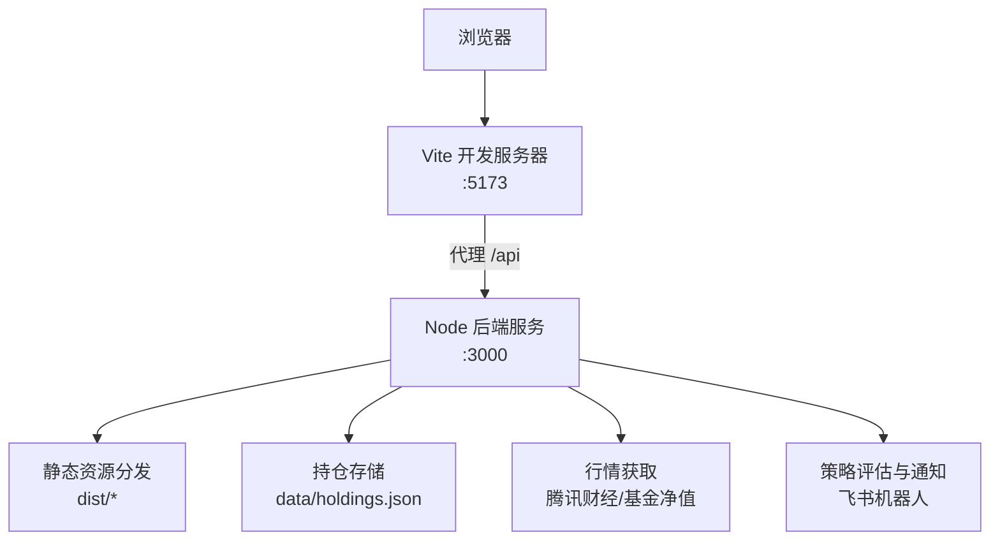
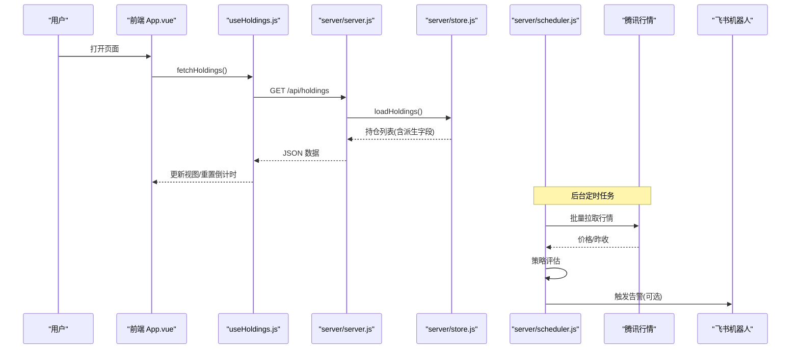
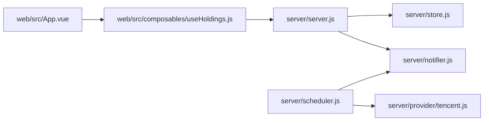

# 调试与测试

<cite>
**本文引用的文件**
- [package.json](file://package.json)
- [vite.config.js](file://vite.config.js)
- [server/index.js](file://server/index.js)
- [server/server.js](file://server/server.js)
- [server/config.js](file://server/config.js)
- [server/scheduler.js](file://server/scheduler.js)
- [server/store.js](file://server/store.js)
- [server/provider/tencent.js](file://server/provider/tencent.js)
- [server/notifier.js](file://server/notifier.js)
- [web/src/main.js](file://web/src/main.js)
- [web/src/App.vue](file://web/src/App.vue)
- [web/src/composables/useHoldings.js](file://web/src/composables/useHoldings.js)
- [config.json](file://config.json)
</cite>

## 目录
1. [简介](#简介)
2. [项目结构](#项目结构)
3. [核心组件](#核心组件)
4. [架构总览](#架构总览)
5. [详细组件分析](#详细组件分析)
6. [依赖关系分析](#依赖关系分析)
7. [性能考虑](#性能考虑)
8. [故障排查指南](#故障排查指南)
9. [结论](#结论)
10. [附录](#附录)

## 简介
本指南面向 Stock Advisor（股票秘书）项目的开发与维护，聚焦“调试与测试”的完整实践：前端浏览器调试、Vue DevTools 配置、网络请求调试；后端 Node.js 调试器、日志输出与性能分析；单元测试框架选择与用例规范；API 接口测试（手动与自动化）；端到端测试策略与工具推荐；常见问题诊断与解决步骤；性能分析与优化技巧。内容基于仓库现有实现，确保可操作、可追溯。

## 项目结构
- 前端位于 web/，使用 Vue 3 + Vite，开发服务器默认端口 5173，并通过代理将 /api 转发到本地后端 3000。
- 后端位于 server/，提供静态页面托管与 REST API，数据持久化在 data/holdings.json。
- 调度器周期性抓取行情并评估策略，必要时通过飞书机器人推送提醒。
- 配置文件 config.json 控制刷新间隔、服务端口、飞书 Webhook 等。

图表来源
- [vite.config.js:14-24](file://vite.config.js#L14-L24)
- [server/server.js:567-593](file://server/server.js#L567-L593)
- [server/store.js:40-70](file://server/store.js#L40-L70)
- [server/scheduler.js:65-178](file://server/scheduler.js#L65-L178)

章节来源
- [vite.config.js:1-26](file://vite.config.js#L1-L26)
- [server/index.js:1-17](file://server/index.js#L1-L17)
- [config.json:1-19](file://config.json#L1-L19)

## 核心组件
- 前端入口与状态管理
  - main.js 挂载应用，App.vue 组织页面与弹窗，useHoldings.js 封装数据获取、自动刷新与写操作。
- 后端服务与 API
  - server.js 提供静态资源与 /api 路由，store.js 负责数据加载/保存与并发保护，scheduler.js 定时任务与策略评估，provider/tencent.js 拉取行情，notifier.js 发送飞书卡片。
- 配置与启动
  - package.json 定义脚本与依赖；config.json 控制运行时参数；server/index.js 串联配置加载、服务启动与调度。

章节来源
- [web/src/main.js:1-6](file://web/src/main.js#L1-L6)
- [web/src/App.vue:1-197](file://web/src/App.vue#L1-L197)
- [web/src/composables/useHoldings.js:1-154](file://web/src/composables/useHoldings.js#L1-L154)
- [server/server.js:1-594](file://server/server.js#L1-L594)
- [server/store.js:1-71](file://server/store.js#L1-L71)
- [server/scheduler.js:1-178](file://server/scheduler.js#L1-L178)
- [server/provider/tencent.js:1-42](file://server/provider/tencent.js#L1-L42)
- [server/notifier.js:1-112](file://server/notifier.js#L1-L112)
- [server/index.js:1-17](file://server/index.js#L1-L17)
- [config.json:1-19](file://config.json#L1-L19)
- [package.json:1-32](file://package.json#L1-L32)

## 架构总览
前后端分离但由同一进程统一托管：Vite 开发时代理 /api 到 Node 后端；生产构建后由 Node 服务直接返回 dist 下的静态页面。调度器按交易时段动态调整刷新频率，拉取行情后评估策略并推送通知。

图表来源
- [web/src/App.vue:121-129](file://web/src/App.vue#L121-L129)
- [web/src/composables/useHoldings.js:15-43](file://web/src/composables/useHoldings.js#L15-L43)
- [server/server.js:409-414](file://server/server.js#L409-L414)
- [server/store.js:40-59](file://server/store.js#L40-L59)
- [server/scheduler.js:65-178](file://server/scheduler.js#L65-L178)
- [server/provider/tencent.js:6-42](file://server/provider/tencent.js#L6-L42)
- [server/notifier.js:81-112](file://server/notifier.js#L81-L112)

## 详细组件分析

### 前端调试技巧
- 浏览器开发者工具
  - 使用 Network 面板查看 /api/holdings、/api/test-feishu 等请求的 URL、方法、请求体与响应体，确认跨域与代理是否生效。
  - 使用 Console 面板执行临时脚本或打印关键变量；Sources 面板设置断点调试 Vue 组件生命周期与事件处理。
  - 使用 Performance 面板录制页面交互，定位渲染卡顿与重复计算。
- Vue DevTools 配置
  - 在 Chrome/Edge 安装 Vue DevTools 扩展，打开后在 Components 面板检查组件树、Props/State，在 Timeline 中观察重渲染。
  - 若使用 Vite 开发模式，DevTools 通常自动注入；如遇问题，确认浏览器未拦截扩展且已启用“允许访问文件 URL”。
- 网络请求调试
  - 开发期通过 vite.config.js 的 proxy 将 /api 转发至 :3000；若需直连后端，可在浏览器中修改请求地址或使用 curl 验证。
  - 对 POST/PATCH/DELETE 请求，重点检查 Content-Type 与 JSON 字段是否符合后端校验规则。

章节来源
- [vite.config.js:14-24](file://vite.config.js#L14-L24)
- [web/src/App.vue:27-46](file://web/src/App.vue#L27-L46)
- [web/src/composables/useHoldings.js:15-154](file://web/src/composables/useHoldings.js#L15-L154)

### 后端调试方法
- Node.js 调试器
  - 使用 VS Code 或命令行附加调试器到 node 进程；在 server/server.js 的路由分支、store.js 的读写处设置断点，逐步跟踪数据流。
  - 结合环境变量 ONCE 运行一次性任务，便于单步验证调度逻辑。
- 日志输出
  - 关注控制台中的启动信息、[stock-fetch]、[fund-fetch]、[notify]、[notify-daily]、[store] 等前缀日志，快速定位外部调用失败与写入异常。
  - 在 scheduler.js 的 runOnce 中记录每次 tick 的模式（交易时段/非交易时段）、持仓数量与变更情况。
- 性能分析
  - 使用 --prof 生成 v8 性能快照，或用 --inspect-brk 配合 Chrome DevTools 进行 CPU Profiling。
  - 针对批量行情拉取与 JSON 解析热点，评估并行度与错误重试策略。

章节来源
- [server/index.js:5-16](file://server/index.js#L5-L16)
- [server/server.js:567-593](file://server/server.js#L567-L593)
- [server/scheduler.js:65-178](file://server/scheduler.js#L65-L178)
- [server/store.js:61-70](file://server/store.js#L61-L70)
- [server/provider/tencent.js:6-42](file://server/provider/tencent.js#L6-L42)
- [server/notifier.js:81-112](file://server/notifier.js#L81-L112)

### 单元测试框架选择与用例规范
- 框架建议
  - 轻量级：Vitest（与 Vite 生态一致），适合函数与组合式逻辑测试。
  - 通用型：Jest，生态成熟，适合复杂场景。
- 用例规范
  - 覆盖边界条件：空数组、缺失字段、非法数值、网络超时与重试。
  - 隔离外部依赖：对 fetch 与文件系统调用进行 Mock，保证测试稳定。
  - 命名清晰：describe/it 描述业务语义，断言明确可读。
  - 幂等性：多次运行结果一致，避免共享状态污染。

[本节为通用指导，不直接分析具体文件]

### API 接口测试方法
- 手动测试
  - 使用浏览器 Network 或 Postman/curl 调用以下接口：
    - GET /api/holdings：获取持仓列表（含派生字段）。
    - POST /api/holdings：新建持仓（必填 name/code/region/type）。
    - PATCH /api/holdings/:id：更新日涨跌告警阈值等字段。
    - POST /api/holdings/:id/purchases：追加买入记录。
    - PATCH /api/holdings/:id/purchases/:pid：修改某条买入记录的止盈/止损比例等。
    - DELETE /api/holdings/:id/purchases/:pid：删除买入记录。
    - POST /api/holdings/:id/transactions：兼容旧接口的买入/卖出。
    - POST /api/import-csv：导入 CSV 买卖记录（支持 createMissing）。
    - POST /api/test-feishu：发送测试消息到飞书机器人。
  - 验证要点：状态码、JSON 结构、错误消息、副作用（如持仓状态变化）。
- 自动化测试
  - 使用 Vitest/Jest 编写 HTTP 集成测试，启动内存态服务或 Mock 文件系统，断言 CRUD 行为与派生计算。
  - 对 scheduler.js 的策略评估与 notifier.js 的通知构造进行纯函数测试，无需真实网络。

章节来源
- [server/server.js:409-565](file://server/server.js#L409-L565)
- [web/src/composables/useHoldings.js:66-130](file://web/src/composables/useHoldings.js#L66-L130)

### 端到端测试实施策略与工具推荐
- 策略
  - 以用户旅程为中心：添加持仓 → 刷新行情 → 触发告警 → 查看飞书消息。
  - 环境隔离：使用独立 config.json 与 data 目录，避免污染生产数据。
  - 数据准备：预置 holdings.json 样例，确保可重复执行。
- 工具推荐
  - Playwright：跨浏览器、内置网络拦截与截图，适合 UI 流程与 API 混合测试。
  - Cypress：侧重前端交互，适合表单输入与弹窗流程。
  - 结合 Puppeteer Core（已在 devDependencies）：用于无头浏览器自动化。

[本节为通用指导，不直接分析具体文件]

## 依赖关系分析
- 模块耦合
  - server/server.js 依赖 store.js、notifier.js、import-csv-core.js；scheduler.js 依赖 provider/tencent.js、strategy.js、notifier.js。
  - 前端 useHoldings.js 依赖常量与后端 /api 路由；App.vue 聚合多个子组件与弹窗。
- 外部依赖
  - 腾讯财经 API（免 Key，批量拉取）；飞书自定义机器人 Webhook（支持 secret 签名）。
- 潜在循环依赖
  - 当前未见循环 import；保持 scheduler 与 server 职责分离，利于测试与替换。

图表来源
- [server/server.js:1-8](file://server/server.js#L1-L8)
- [server/scheduler.js:1-5](file://server/scheduler.js#L1-L5)
- [web/src/App.vue:1-13](file://web/src/App.vue#L1-L13)
- [web/src/composables/useHoldings.js:1-3](file://web/src/composables/useHoldings.js#L1-L3)

章节来源
- [server/server.js:1-594](file://server/server.js#L1-L594)
- [server/scheduler.js:1-178](file://server/scheduler.js#L1-L178)
- [web/src/App.vue:1-197](file://web/src/App.vue#L1-L197)
- [web/src/composables/useHoldings.js:1-154](file://web/src/composables/useHoldings.js#L1-L154)

## 性能考虑
- 前端
  - 减少不必要的重渲染：合理使用 computed 与 v-if，避免在高频刷新中创建大对象。
  - 利用浏览器缓存：对静态资源开启强缓存，减少首屏加载时间。
  - 监控长任务：Performance 面板识别主线程阻塞，拆分耗时计算。
- 后端
  - 批量拉取行情：provider/tencent.js 已采用批量接口，注意 User-Agent/Referer 防封。
  - 串行写盘：store.js 通过 writeChain 防止并发覆盖，避免数据损坏。
  - 冷却机制：scheduler.js 的 cooldownSeconds 避免频繁通知导致负载升高。
  - 降级与重试：外部 API 失败时记录日志并跳过，保障整体稳定性。

[本节为通用指导，不直接分析具体文件]

## 故障排查指南
- 无法加载持仓数据
  - 检查 /api/holdings 是否返回 200 与正确 JSON；确认 data/holdings.json 存在且格式合法。
  - 查看 store.js 的 save error 日志，确认磁盘写入权限。
- 行情为空或报错
  - 检查腾讯 API 返回状态码与编码解码；确认 codes 列表有效。
  - 查看 [stock-fetch]/[fund-fetch] 日志，定位网络或解析错误。
- 飞书推送失败
  - 使用 /api/test-feishu 验证 Webhook 与 secret；检查 notifier.js 的重试与错误信息。
- 前端自动刷新不工作
  - 确认 Vite 代理 /api 指向 :3000；检查 Network 是否有 CORS 或 404。
  - 在 useHoldings.js 中打断点，验证 countdown 与 fetch 调用。
- 策略不触发或误触发
  - 核对 config.json 的 nearThresholdPct、cooldownSeconds；检查 scheduler.js 的交易时段判断与冷却逻辑。

章节来源
- [server/store.js:61-70](file://server/store.js#L61-L70)
- [server/provider/tencent.js:6-42](file://server/provider/tencent.js#L6-L42)
- [server/notifier.js:81-112](file://server/notifier.js#L81-L112)
- [web/src/composables/useHoldings.js:15-43](file://web/src/composables/useHoldings.js#L15-L43)
- [server/scheduler.js:58-178](file://server/scheduler.js#L58-L178)
- [config.json:1-19](file://config.json#L1-L19)

## 结论
本指南围绕 Stock Advisor 的前后端实现，提供了从浏览器调试、Node 调试、日志与性能分析，到单元与 API 测试、端到端策略的系统化方法。结合仓库现有代码与配置，读者可按步骤定位问题、验证功能并持续优化性能与稳定性。

[本节为总结，不直接分析具体文件]

## 附录
- 常用命令
  - 启动后端服务：node server/index.js
  - 启动前端开发服务器：npm run dev（Vite :5173，代理 /api 到 :3000）
  - 构建前端产物：npm run build（输出到 dist/）
  - 一次性运行调度：ONCE=1 npm start
- 关键配置项
  - schedule.intervalSeconds/offHoursIntervalSeconds：交易时段/非交易时段刷新间隔
  - server.host/port：后端监听地址与端口
  - feishu.webhook/secret：飞书机器人通知配置
  - notify.cooldownSeconds/nearThresholdPct：通知冷却与阈值

章节来源
- [package.json:7-13](file://package.json#L7-L13)
- [config.json:1-19](file://config.json#L1-L19)