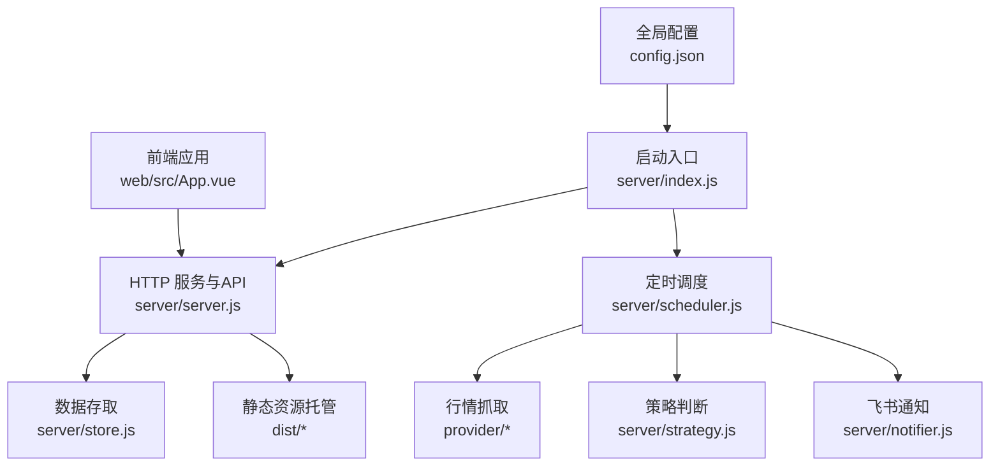
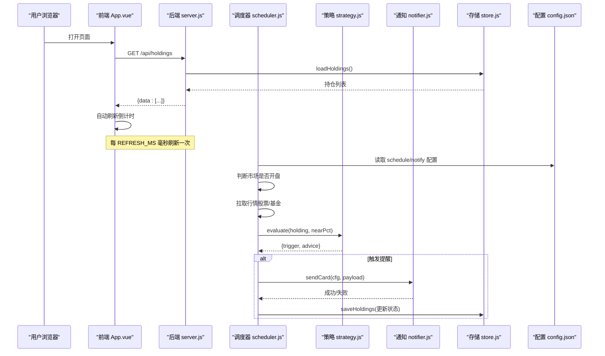
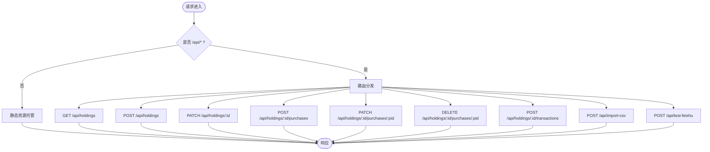
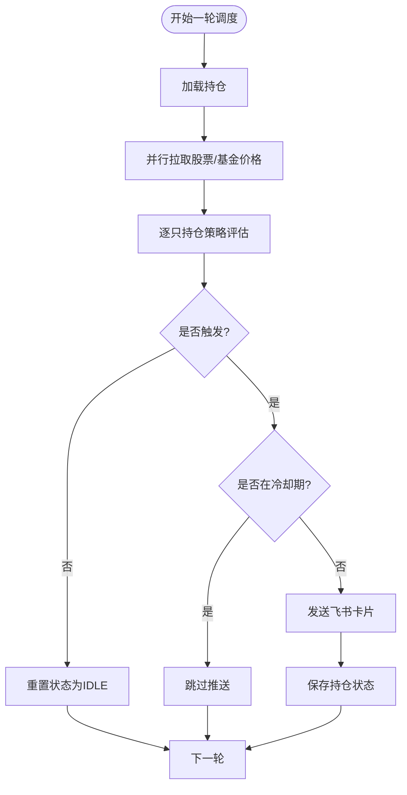
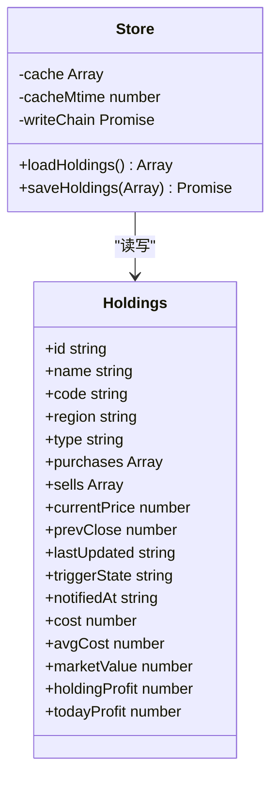
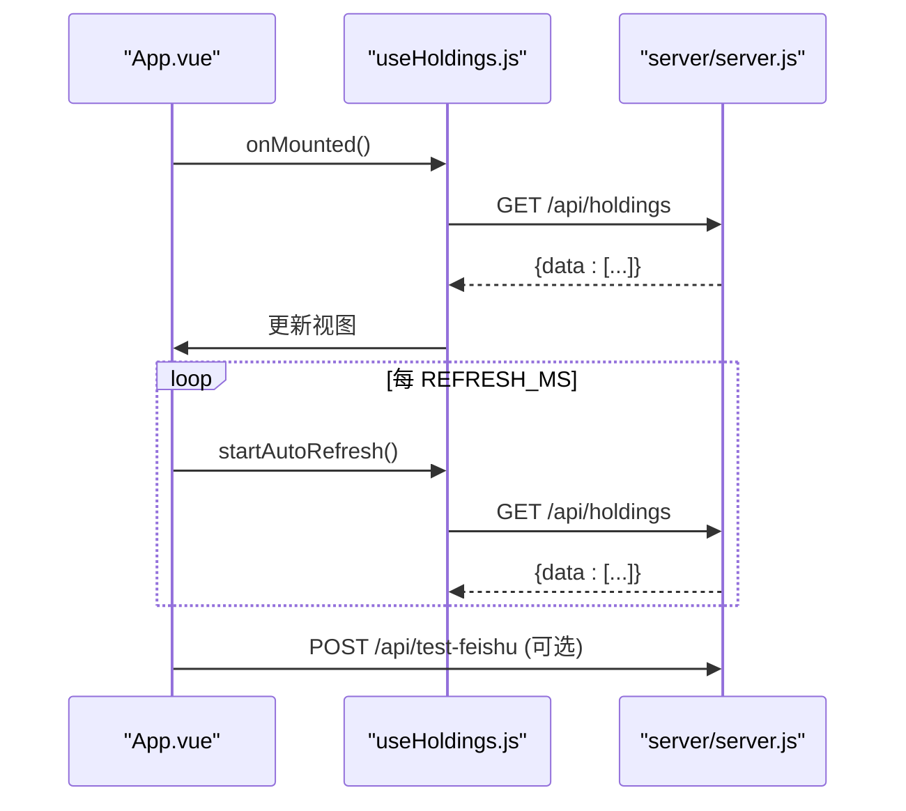
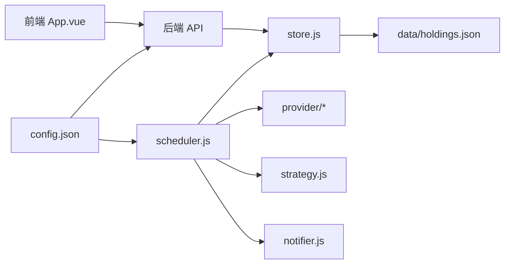

# 项目结构说明

<cite>
**本文引用的文件**
- [server/index.js](file://server/index.js)
- [server/server.js](file://server/server.js)
- [server/config.js](file://server/config.js)
- [server/scheduler.js](file://scheduler.js)
- [server/store.js](file://store.js)
- [server/strategy.js](file://strategy.js)
- [server/notifier.js](file://notifier.js)
- [config.json](file://config.json)
- [web/src/App.vue](file://web/src/App.vue)
- [web/src/main.js](file://web/src/main.js)
- [web/src/composables/useHoldings.js](file://web/src/composables/useHoldings.js)
- [web/src/constants/options.js](file://web/src/constants/options.js)
- [vite.config.js](file://vite.config.js)
- [package.json](file://package.json)
- [data/holdings.json](file://data/holdings.json)
</cite>

## 目录与组织原则
- server（后端服务）：提供 HTTP API、静态资源托管、定时调度、策略计算、通知推送与数据持久化。入口为 server/index.js，核心路由与业务在 server/server.js，调度循环在 scheduler.js，存储层在 store.js，策略引擎在 strategy.js，飞书通知在 notifier.js，配置加载在 config.js。
- web（前端应用）：基于 Vue 3 + Vite，源码位于 web/，打包产物输出到根目录 dist/，由 Node 后端统一托管。主组件为 web/src/App.vue，入口脚本为 web/src/main.js，常量与枚举集中在 web/src/constants/options.js，状态与接口封装在 composables/useHoldings.js。
- data（数据存储）：使用 JSON 文件作为轻量级持久化，核心文件为 data/holdings.json，包含持仓、买入/卖出记录及派生字段。
- docs（项目文档）：存放需求与计划等说明性文档，如 docs/项目计划.md。

**图表来源**
- [server/index.js:1-17](file://server/index.js#L1-L17)
- [server/server.js:567-594](file://server/server.js#L567-L594)
- [server/scheduler.js:167-178](file://server/scheduler.js#L167-L178)
- [server/store.js:40-71](file://server/store.js#L40-L71)
- [server/strategy.js:34-91](file://server/strategy.js#L34-L91)
- [server/notifier.js:81-112](file://server/notifier.js#L81-L112)
- [config.json:1-19](file://config.json#L1-L19)
- [web/src/App.vue:1-197](file://web/src/App.vue#L1-L197)

**章节来源**
- [server/index.js:1-17](file://server/index.js#L1-L17)
- [server/server.js:35-58](file://server/server.js#L35-L58)
- [server/scheduler.js:65-178](file://server/scheduler.js#L65-L178)
- [server/store.js:1-71](file://server/store.js#L1-L71)
- [config.json:1-19](file://config.json#L1-L19)
- [web/src/App.vue:1-197](file://web/src/App.vue#L1-L197)

## 核心组件与职责
- 后端入口与启动流程
  - server/index.js：加载配置、启动 HTTP 服务、根据环境变量决定是否单次运行并退出，或启动持续调度器。
  - server/server.js：实现静态资源托管、RESTful API（持仓列表、新建/更新、买入/卖出记录、CSV导入、飞书测试）、请求体解析与错误处理。
  - server/config.js：从项目根读取 config.json 并返回配置对象。
- 数据与持久化
  - server/store.js：内存缓存 + 文件读写，支持旧模型迁移，串行写盘避免并发覆盖。
  - data/holdings.json：持仓主数据，包含多次买入记录、卖出记录、派生收益与状态。
- 行情与策略
  - server/scheduler.js：按市场时区判断交易时段，选择刷新间隔；批量拉取股票/基金价格；执行策略评估；冷却与去重；触发飞书通知；保存变更。
  - server/strategy.js：基于成本加权止盈、单笔止损、补仓条件进行买点/卖点判断。
  - provider/*：行情源适配器（腾讯股票、基金净值）。
- 通知
  - server/notifier.js：构造飞书交互式卡片消息，支持签名与重试。
- 前端
  - web/src/App.vue：页面主组件，聚合概览、持仓列表、弹窗交互、自动刷新倒计时、飞书测试。
  - web/src/composables/useHoldings.js：封装持仓数据状态、自动刷新、CRUD 操作与汇总计算。
  - web/src/constants/options.js：策略、地区、类型等枚举与刷新间隔常量。
  - vite.config.js：开发代理 /api 到后端 3000 端口，构建产物输出到 ../dist。

**章节来源**
- [server/index.js:1-17](file://server/index.js#L1-L17)
- [server/server.js:409-565](file://server/server.js#L409-L565)
- [server/config.js:7-10](file://server/config.js#L7-L10)
- [server/store.js:24-71](file://server/store.js#L24-L71)
- [server/scheduler.js:65-178](file://server/scheduler.js#L65-L178)
- [server/strategy.js:34-91](file://server/strategy.js#L34-L91)
- [server/notifier.js:81-112](file://server/notifier.js#L81-L112)
- [web/src/App.vue:1-197](file://web/src/App.vue#L1-L197)
- [web/src/composables/useHoldings.js:1-154](file://web/src/composables/useHoldings.js#L1-L154)
- [web/src/constants/options.js:1-33](file://web/src/constants/options.js#L1-L33)
- [vite.config.js:1-26](file://vite.config.js#L1-L26)

## 架构总览
系统采用“前后端同进程”部署：Node 后端同时提供 API 与静态页面；Vite 仅用于开发与构建。调度器周期性拉取行情、评估策略、发送通知，并将结果持久化到 JSON 文件；前端通过 REST API 获取数据并展示。

**图表来源**
- [web/src/App.vue:121-129](file://web/src/App.vue#L121-L129)
- [web/src/composables/useHoldings.js:15-43](file://web/src/composables/useHoldings.js#L15-L43)
- [server/server.js:567-594](file://server/server.js#L567-L594)
- [server/scheduler.js:65-178](file://server/scheduler.js#L65-L178)
- [server/strategy.js:34-91](file://server/strategy.js#L34-L91)
- [server/notifier.js:81-112](file://server/notifier.js#L81-L112)
- [server/store.js:40-71](file://server/store.js#L40-L71)
- [config.json:1-19](file://config.json#L1-L19)

## 详细组件分析

### 后端服务（server/server.js）
- 静态资源托管：将 dist 下的前端产物以 SPA 方式提供服务，未知路径回退到 index.html。
- API 路由：
  - GET /api/holdings：返回带派生字段的持仓列表。
  - POST /api/holdings：新建持仓（含多次买入记录）。
  - PATCH /api/holdings/:id：更新持仓级字段（如日涨跌告警阈值）。
  - POST /api/holdings/:id/purchases：追加买入记录。
  - PATCH /api/holdings/:id/purchases/:pid：修改某条买入记录的止盈/止损等。
  - DELETE /api/holdings/:id/purchases/:pid：删除买入记录。
  - POST /api/holdings/:id/transactions：兼容旧接口的买入/卖出。
  - POST /api/import-csv：导入 CSV 买卖记录。
  - POST /api/test-feishu：测试飞书推送。
- 错误处理：统一捕获异常并返回 JSON 错误。

**图表来源**
- [server/server.js:35-58](file://server/server.js#L35-L58)
- [server/server.js:409-565](file://server/server.js#L409-L565)

**章节来源**
- [server/server.js:35-58](file://server/server.js#L35-L58)
- [server/server.js:409-565](file://server/server.js#L409-L565)

### 调度与策略（scheduler.js + strategy.js）
- 交易时段判断：按市场时区判断周末与交易时间，决定刷新频率。
- 行情拉取：股票走腾讯接口，基金走基金净值接口，合并为统一价格表。
- 策略评估：
  - 卖点：达到成本加权止盈或任一买入记录触发止损。
  - 买点：接近补仓价或较最近买入价跌幅达到阈值。
- 冷却机制：同一触发态在冷却时间内不重复推送。
- 持久化：仅在发生状态变化时写入 holdings.json。

**图表来源**
- [server/scheduler.js:65-178](file://server/scheduler.js#L65-L178)
- [server/strategy.js:34-91](file://server/strategy.js#L34-L91)

**章节来源**
- [server/scheduler.js:65-178](file://server/scheduler.js#L65-L178)
- [server/strategy.js:34-91](file://server/strategy.js#L34-L91)

### 数据持久化（store.js + data/holdings.json）
- 内存缓存：首次加载或检测到外部文件变更时重新读盘，否则复用内存缓存。
- 模型迁移：旧版单条买入记录自动迁移为 purchases 数组。
- 串行写盘：通过 Promise 链保证并发安全。
- 数据结构：持仓包含多次买入记录、卖出记录、派生字段（均价、市值、今日收益、持仓收益等）。

**图表来源**
- [server/store.js:40-71](file://server/store.js#L40-L71)
- [data/holdings.json:1-200](file://data/holdings.json#L1-L200)

**章节来源**
- [server/store.js:24-71](file://server/store.js#L24-L71)
- [data/holdings.json:1-200](file://data/holdings.json#L1-L200)

### 前端应用（web/src/App.vue + useHoldings.js）
- 主组件：聚合头部、概览卡片、持仓列表、多种弹窗（新增持仓、交易、买入记录、CSV导入），并提供主题切换与飞书测试。
- 状态管理：useHoldings 维护持仓列表、加载状态、错误信息、自动刷新倒计时与汇总指标。
- 自动刷新：每秒递减倒计时，归零时调用 /api/holdings 刷新。
- 过滤与展示：支持按类型与市场多选过滤，地区标签映射。

**图表来源**
- [web/src/App.vue:121-129](file://web/src/App.vue#L121-L129)
- [web/src/composables/useHoldings.js:15-43](file://web/src/composables/useHoldings.js#L15-L43)
- [server/server.js:567-594](file://server/server.js#L567-L594)

**章节来源**
- [web/src/App.vue:1-197](file://web/src/App.vue#L1-L197)
- [web/src/composables/useHoldings.js:1-154](file://web/src/composables/useHoldings.js#L1-L154)

## 依赖关系与数据流
- 模块耦合
  - server/index.js 依赖 config.js、scheduler.js、server.js。
  - server/server.js 依赖 store.js、notifier.js、import-csv-core.js。
  - scheduler.js 依赖 store.js、provider/*、strategy.js、notifier.js。
  - web/src/App.vue 依赖 constants/options.js、composables/useHoldings.js 与各子组件。
- 数据流向
  - 前端 → /api/holdings → 后端 → store.js → holdings.json。
  - 调度器 → 行情源 → 策略 → 通知 → store.js → holdings.json。
  - 配置 → 调度器/服务器 → 行为控制（刷新间隔、冷却、通知开关）。

**图表来源**
- [server/index.js:1-17](file://server/index.js#L1-L17)
- [server/server.js:409-565](file://server/server.js#L409-L565)
- [server/scheduler.js:65-178](file://server/scheduler.js#L65-L178)
- [server/store.js:40-71](file://server/store.js#L40-L71)
- [config.json:1-19](file://config.json#L1-L19)
- [web/src/App.vue:1-197](file://web/src/App.vue#L1-L197)

**章节来源**
- [server/index.js:1-17](file://server/index.js#L1-L17)
- [server/server.js:409-565](file://server/server.js#L409-L565)
- [server/scheduler.js:65-178](file://server/scheduler.js#L65-L178)
- [server/store.js:40-71](file://server/store.js#L40-L71)
- [config.json:1-19](file://config.json#L1-L19)
- [web/src/App.vue:1-197](file://web/src/App.vue#L1-L197)

## 配置文件结构与含义（config.json）
- schedule
  - intervalSeconds：交易时段刷新间隔（秒）。
  - offHoursIntervalSeconds：非交易时段刷新间隔（秒）。
- server
  - host：监听地址（默认 0.0.0.0）。
  - port：监听端口（默认 3000）。
- feishu
  - webhook：飞书机器人 Webhook 地址。
  - secret：Webhook 签名密钥（可选）。
- notify
  - cooldownSeconds：同一触发态的冷却时长（秒）。
  - nearThresholdPct：接近阈值判定容差（百分比）。

**章节来源**
- [config.json:1-19](file://config.json#L1-L19)
- [server/config.js:7-10](file://server/config.js#L7-L10)

## 新模块添加指导与最佳实践
- 新增后端 API
  - 在 server/server.js 的 handleApi 中增加路由分支，遵循 REST 风格，输入校验与错误处理统一返回 JSON。
  - 涉及数据变更需调用 store.saveHoldings，并在必要时重置触发状态。
- 新增行情源
  - 在 server/provider 下新增适配器，保持与现有 fetchPrices/fetchFundNavs 一致的返回结构。
  - 在 scheduler.js 中按需接入，注意异常降级与日志。
- 新增策略规则
  - 在 server/strategy.js 扩展 evaluate 逻辑，保持返回值结构一致（trigger、advice 等）。
  - 如需新字段，同步更新 withDerived/syncFromPurchases 与前端展示。
- 新增前端功能
  - 在 web/src/components 下创建组件，通过 props/events 与 App.vue 通信。
  - 共享状态与接口封装放入 composables，保持单一职责。
  - 枚举与常量集中到 web/src/constants/options.js，与后端保持一致。
- 命名约定
  - 后端文件：小写下划线或驼峰均可，但建议统一为小写+点分隔（如 import-csv.js）。
  - 前端组件：PascalCase（如 HoldingList.vue）。
  - 组合式函数：useXxx.js（如 useHoldings.js）。
  - 常量：全大写常量名（如 REFRESH_MS）。
- 数据一致性
  - 所有写操作必须经过 store.saveHoldings，避免直接写文件。
  - 对 holdings.json 的手动编辑需谨慎，确保 purchases 模型正确。

**章节来源**
- [server/server.js:409-565](file://server/server.js#L409-L565)
- [server/scheduler.js:65-178](file://server/scheduler.js#L65-L178)
- [server/strategy.js:34-91](file://server/strategy.js#L34-L91)
- [web/src/App.vue:1-197](file://web/src/App.vue#L1-L197)
- [web/src/composables/useHoldings.js:1-154](file://web/src/composables/useHoldings.js#L1-L154)
- [web/src/constants/options.js:1-33](file://web/src/constants/options.js#L1-L33)
- [server/store.js:40-71](file://server/store.js#L40-L71)

## 性能与可靠性
- 刷新频率：交易时段短间隔、非交易时段长间隔，减少不必要请求。
- 并发写保护：store.js 使用 Promise 链串行写盘，避免覆盖。
- 网络容错：行情拉取失败不影响整体流程，记录日志并继续。
- 通知去重：冷却机制避免刷屏。
- 前端优化：单一定时器驱动自动刷新，避免多定时器漂移。

[本节为通用性能建议，无需特定文件引用]

## 故障排查指南
- 无法访问前端页面
  - 检查构建产物是否存在于 dist/，后端是否监听指定端口。
  - 确认 vite.config.js 的 outDir 与 server.js 的 DIST 路径一致。
- API 报错
  - 查看后端控制台错误日志，确认请求路径与方法匹配。
  - 检查 holdings.json 数据完整性与 purchases 模型。
- 行情无数据
  - 检查 provider 返回结构与代码映射（region+code）。
  - 关注调度日志中的 skip 提示。
- 飞书推送失败
  - 核对 webhook 与 secret，确认签名生成逻辑。
  - 查看 notifier 的重试与错误信息。

**章节来源**
- [server/server.js:567-594](file://server/server.js#L567-L594)
- [server/scheduler.js:65-178](file://server/scheduler.js#L65-L178)
- [server/notifier.js:81-112](file://server/notifier.js#L81-L112)
- [vite.config.js:10-24](file://vite.config.js#L10-L24)

## 结论
本项目采用清晰的模块化设计：后端负责数据、调度与通知，前端专注交互与展示，JSON 文件作为轻量存储，配置文件驱动运行时行为。通过统一的 API、可插拔的行情源与策略引擎，系统具备良好的扩展性与可维护性。新增功能应遵循既定的目录划分、命名约定与数据一致性规范，以确保长期稳定演进。

[本节为总结性内容，无需特定文件引用]