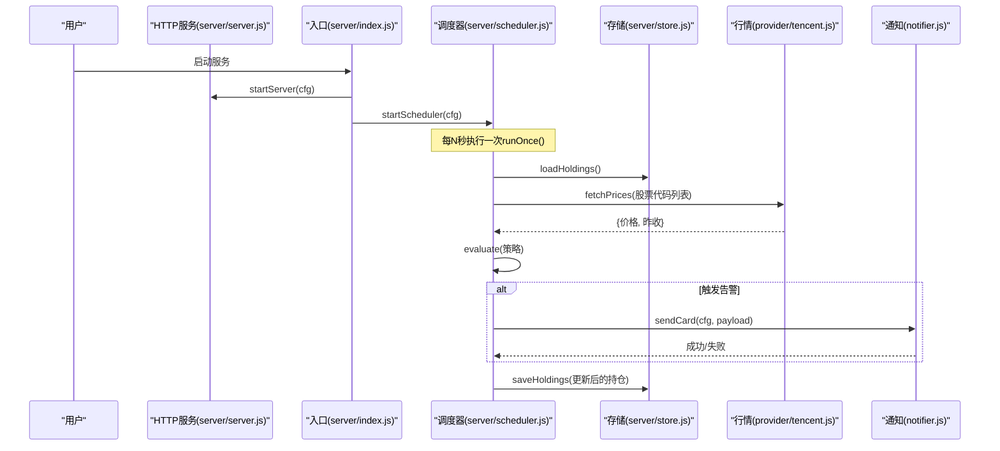
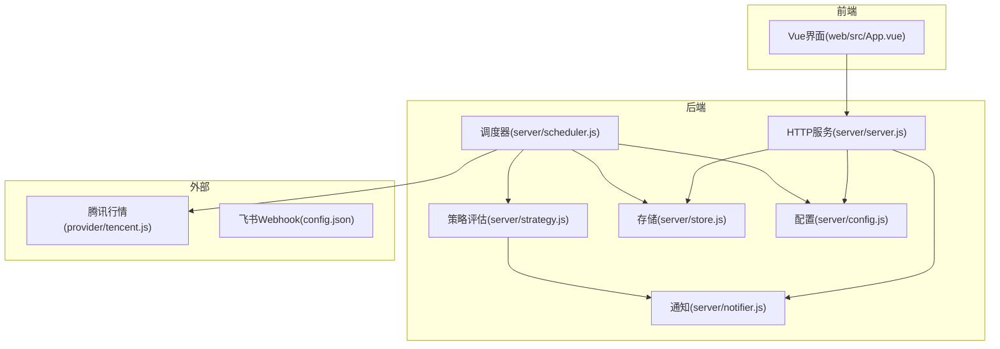

# 快速开始

<cite>
**本文引用的文件**
- [config.json](file://config.json)
- [package.json](file://package.json)
- [start.sh](file://start.sh)
- [server/index.js](file://server/index.js)
- [server/config.js](file://server/config.js)
- [server/server.js](file://server/server.js)
- [server/scheduler.js](file://server/scheduler.js)
- [server/notifier.js](file://server/notifier.js)
- [server/store.js](file://server/store.js)
- [server/provider/tencent.js](file://server/provider/tencent.js)
- [server/strategy.js](file://server/strategy.js)
- [web/src/App.vue](file://web/src/App.vue)
- [data/holdings.json](file://data/holdings.json)
</cite>

## 目录
1. [简介](#简介)
2. [环境要求](#环境要求)
3. [安装与初始配置](#安装与初始配置)
4. [启动流程](#启动流程)
5. [配置文件说明](#配置文件说明)
6. [常用操作示例](#常用操作示例)
7. [架构概览](#架构概览)
8. [依赖关系分析](#依赖关系分析)
9. [性能与调度特性](#性能与调度特性)
10. [故障排除指南](#故障排除指南)
11. [结论](#结论)

## 简介
Stock Advisor（股票秘书）是一个本地运行的持仓管理与行情提醒工具。它支持：
- 记录多笔买入、卖出，自动计算成本、均价、盈亏与今日涨跌
- 定时抓取A股/港股/美股及基金净值，按策略判断买点/卖点并推送飞书卡片
- 提供Web界面查看实时行情、管理持仓与交易记录、导入CSV、测试通知

## 环境要求
- Node.js >= 18（项目声明了引擎版本限制）
- 操作系统：任意可运行Node.js的桌面或服务器环境
- 网络：需要访问腾讯财经行情接口；如需飞书通知，需能访问飞书自定义机器人Webhook

**章节来源**
- [package.json:15-17](file://package.json#L15-L17)

## 安装与初始配置
1. 克隆或下载项目到本地目录
2. 安装依赖
   - 使用 npm：执行 npm install
   - 或使用 pnpm/yarn：pnpm install / yarn install
3. 准备数据文件
   - 确保 data/holdings.json 存在且为合法JSON数组（项目已内置示例数据）
4. 配置通知（可选）
   - 在根目录 config.json 中填写 feishu.webhook 与 feishu.secret（如不需要飞书通知，可跳过）
5. 启动服务
   - 生产模式：执行 ./start.sh 或 npm start
   - 开发模式：执行 ./start.sh dev

提示：首次启动时，脚本会自动检测 node_modules 是否存在并安装依赖；生产模式会先构建前端静态资源。

**章节来源**
- [start.sh:25-46](file://start.sh#L25-L46)
- [start.sh:80-99](file://start.sh#L80-L99)
- [package.json:7-14](file://package.json#L7-L14)

## 启动流程
- 入口：server/index.js 加载配置后启动HTTP服务与调度器
- HTTP服务：server/server.js 提供前端页面托管与REST API（/api/*）
- 调度器：server/scheduler.js 定时抓取行情、评估策略、发送通知
- 存储：server/store.js 将持仓数据持久化到 data/holdings.json，并提供内存缓存避免并发冲突
- 通知：server/notifier.js 构造飞书interactive卡片并通过Webhook推送
- 行情源：server/provider/tencent.js 批量拉取A股/港股/美股行情；基金净值由对应provider处理

**图表来源**
- [server/index.js:1-17](file://server/index.js#L1-L17)
- [server/server.js:567-593](file://server/server.js#L567-L593)
- [server/scheduler.js:65-178](file://server/scheduler.js#L65-L178)
- [server/store.js:40-71](file://server/store.js#L40-L71)
- [server/provider/tencent.js:6-42](file://server/provider/tencent.js#L6-L42)
- [server/notifier.js:81-112](file://server/notifier.js#L81-L112)

**章节来源**
- [server/index.js:1-17](file://server/index.js#L1-L17)
- [server/server.js:567-593](file://server/server.js#L567-L593)
- [server/scheduler.js:65-178](file://server/scheduler.js#L65-L178)

## 配置文件说明
根目录 config.json 包含以下关键参数：
- schedule.intervalSeconds：交易时段刷新间隔（秒）
- schedule.offHoursIntervalSeconds：非交易时段刷新间隔（秒），默认降频以减少请求
- server.host：服务监听地址（默认 0.0.0.0）
- server.port：服务端口（默认 3000）
- feishu.webhook：飞书自定义机器人Webhook地址
- feishu.secret：飞书签名密钥（启用签名校验）
- notify.cooldownSeconds：同一触发态冷却时间（秒），避免频繁推送
- notify.nearThresholdPct：接近阈值百分比（用于“快达到”提示）

注意：
- 若未设置 feishu.secret，通知仍会发送但不带签名
- 非交易时段调度器会自动降低频率，减少外部API压力

**章节来源**
- [config.json:1-19](file://config.json#L1-L19)
- [server/config.js:7-10](file://server/config.js#L7-L10)
- [server/scheduler.js:58-63](file://server/scheduler.js#L58-L63)
- [server/notifier.js:81-94](file://server/notifier.js#L81-L94)

## 常用操作示例
以下为常见使用场景与对应后端接口路径（通过Web界面或HTTP调用均可）：
- 添加第一个持仓（建仓）
  - 接口：POST /api/holdings
  - 必填字段：name、code、region、type
  - 可选：purchases（可后续补录）、targetProfitRate、stopLossRate、refillDropRate/refillPrice等
  - 成功后返回派生字段（成本、均价、盈亏等）
- 追加买入记录（加仓）
  - 接口：POST /api/holdings/{id}/purchases
  - 字段：buyPrice、buyQuantity、buyTime（或date）、targetProfitRate、stopLossRate
- 修改某条买入记录的止盈/止损比例
  - 接口：PATCH /api/holdings/{id}/purchases/{purchaseId}
- 删除某条买入记录
  - 接口：DELETE /api/holdings/{id}/purchases/{purchaseId}
- 查看实时行情与持仓汇总
  - 接口：GET /api/holdings
  - 返回包含当前价、昨收、今日收益、持仓收益等派生字段
- 导入CSV买卖记录
  - 接口：POST /api/import-csv
  - 请求体：{ csv: string, createMissing?: boolean }
- 测试飞书通知
  - 接口：POST /api/test-feishu
  - 成功后会在飞书收到一条测试卡片消息

前端交互要点：
- Web界面默认每若干秒自动刷新（顶部倒计时可见）
- 支持按类型与市场过滤持仓
- 提供弹窗新增持仓、录入交易、导入CSV、测试飞书等功能

**章节来源**
- [server/server.js:409-565](file://server/server.js#L409-L565)
- [web/src/App.vue:27-46](file://web/src/App.vue#L27-L46)
- [web/src/App.vue:121-129](file://web/src/App.vue#L121-L129)

## 架构概览
系统分为四层：
- 前端：Vue应用，提供可视化界面与交互
- HTTP服务：原生Node http服务，托管静态资源并暴露REST API
- 业务逻辑：调度器、策略评估、通知、数据存储
- 外部集成：腾讯财经行情接口、飞书Webhook

**图表来源**
- [web/src/App.vue:1-197](file://web/src/App.vue#L1-L197)
- [server/server.js:567-593](file://server/server.js#L567-L593)
- [server/scheduler.js:65-178](file://server/scheduler.js#L65-L178)
- [server/strategy.js:34-91](file://server/strategy.js#L34-L91)
- [server/store.js:40-71](file://server/store.js#L40-L71)
- [server/notifier.js:81-112](file://server/notifier.js#L81-L112)
- [server/config.js:7-10](file://server/config.js#L7-L10)
- [server/provider/tencent.js:6-42](file://server/provider/tencent.js#L6-L42)
- [config.json:1-19](file://config.json#L1-L19)

## 依赖关系分析
- 入口依赖：server/index.js 依赖配置加载、调度器与服务启动
- 服务层：server/server.js 依赖存储、通知、CSV导入与策略枚举
- 调度层：scheduler.js 依赖存储、行情提供者、策略评估与通知
- 存储层：store.js 提供内存缓存与串行写盘，保证并发安全
- 通知层：notifier.js 负责构造飞书卡片并发送，支持重试与签名
- 行情层：provider/tencent.js 解析腾讯返回文本，提取当前价与昨收
- 策略层：strategy.js 基于多次买入记录计算加权止盈/止损与补仓信号

耦合与内聚：
- 模块职责清晰，低耦合高内聚
- 通过函数导出与模块化组织，便于扩展（如新增行情源或通知渠道）

潜在循环依赖：
- 未发现直接循环引用；各模块单向依赖

**章节来源**
- [server/index.js:1-17](file://server/index.js#L1-L17)
- [server/server.js:1-8](file://server/server.js#L1-L8)
- [server/scheduler.js:1-5](file://server/scheduler.js#L1-L5)
- [server/store.js:1-7](file://server/store.js#L1-L7)
- [server/notifier.js:1-3](file://server/notifier.js#L1-L3)
- [server/provider/tencent.js:1-5](file://server/provider/tencent.js#L1-L5)
- [server/strategy.js:1-5](file://server/strategy.js#L1-L5)

## 性能与调度特性
- 交易时段与非交易时段差异化刷新：非交易时段自动降频，减少外部请求
- 内存缓存：loadHoldings 仅在文件mtime变化时重新读盘，避免重复IO
- 串行写盘：saveHoldings 使用Promise链串行写入，防止并发覆盖
- 通知冷却：同一触发态在 cooldownSeconds 内不重复推送，避免刷屏
- 批量行情：tencent provider 支持一次性拉取多个代码，降低网络开销

优化建议：
- 合理设置 intervalSeconds 与 offHoursIntervalSeconds，平衡实时性与负载
- 对高频告警品种设置合适的 nearThresholdPct，减少误报
- 监控飞书Webhook响应与错误日志，必要时调整重试策略

**章节来源**
- [server/scheduler.js:58-63](file://server/scheduler.js#L58-L63)
- [server/store.js:40-71](file://server/store.js#L40-L71)
- [server/notifier.js:96-110](file://server/notifier.js#L96-L110)
- [server/provider/tencent.js:6-42](file://server/provider/tencent.js#L6-L42)

## 故障排除指南
常见问题与解决步骤：
- Node.js版本过低
  - 现象：启动时报错或脚本提示版本不满足要求
  - 解决：升级至 Node.js >= 18
  - 参考：[start.sh:25-36](file://start.sh#L25-L36)、[package.json:15-17](file://package.json#L15-L17)
- 依赖未安装或损坏
  - 现象：启动时报模块缺失
  - 解决：删除 node_modules 后重新执行 npm install 或 pnpm install
  - 参考：[start.sh:38-46](file://start.sh#L38-L46)
- 前端构建产物缺失（生产模式）
  - 现象：访问首页404或无法加载静态资源
  - 解决：执行 npm run build 生成 dist/ 目录
  - 参考：[start.sh:80-90](file://start.sh#L80-L90)
- 行情获取失败
  - 现象：持仓无当前价或昨日收盘价
  - 排查：检查网络连通性、腾讯接口是否可用；查看控制台错误日志
  - 参考：[server/scheduler.js:77-86](file://server/scheduler.js#L77-L86)、[server/provider/tencent.js:6-42](file://server/provider/tencent.js#L6-L42)
- 飞书通知失败
  - 现象：测试消息未到达或报错
  - 排查：确认 webhook 地址正确、secret 配置无误；检查网络与签名；查看错误日志
  - 参考：[server/notifier.js:81-112](file://server/notifier.js#L81-L112)、[config.json:10-13](file://config.json#L10-L13)
- 数据文件读写异常
  - 现象：保存失败或数据不同步
  - 排查：检查 data/holdings.json 权限与磁盘空间；确认进程未锁定文件
  - 参考：[server/store.js:62-71](file://server/store.js#L62-L71)
- 端口占用
  - 现象：服务启动失败
  - 解决：修改 config.json 中的 server.port 或释放占用端口
  - 参考：[server/server.js:567-570](file://server/server.js#L567-L570)

**章节来源**
- [start.sh:25-46](file://start.sh#L25-L46)
- [start.sh:80-99](file://start.sh#L80-L99)
- [server/scheduler.js:77-86](file://server/scheduler.js#L77-L86)
- [server/provider/tencent.js:6-42](file://server/provider/tencent.js#L6-L42)
- [server/notifier.js:81-112](file://server/notifier.js#L81-L112)
- [server/store.js:62-71](file://server/store.js#L62-L71)
- [server/server.js:567-570](file://server/server.js#L567-L570)
- [config.json:10-13](file://config.json#L10-L13)

## 结论
通过以上步骤，您可以在10分钟内完成Stock Advisor的安装、配置与启动，体验持仓管理、实时行情与飞书通知等核心功能。建议初次使用时：
- 先用“测试飞书通知”验证通知通道
- 添加一个简单持仓并观察行情更新与策略评估结果
- 根据实际交易习惯调整 config.json 的刷新间隔与告警阈值

如需进一步定制，可扩展行情源、通知渠道或策略规则，保持模块化的设计使改动更灵活。