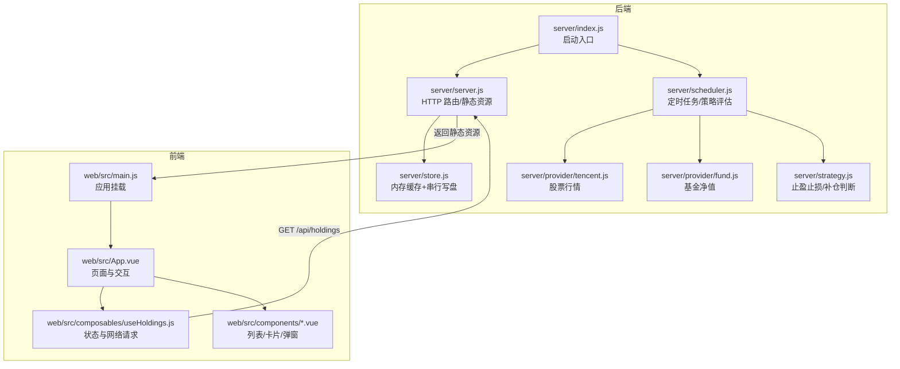
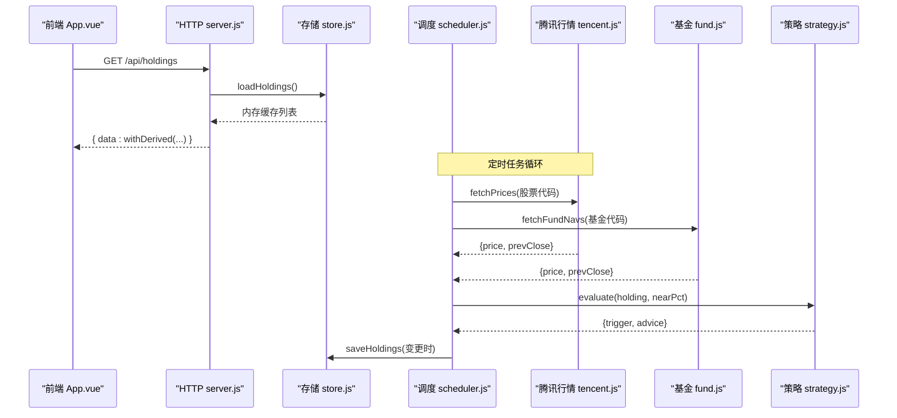
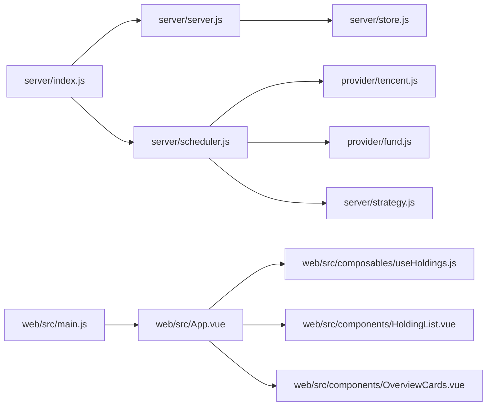

# 性能优化

<cite>
**本文引用的文件**
- [server/index.js](file://server/index.js)
- [server/server.js](file://server/server.js)
- [server/store.js](file://server/store.js)
- [server/scheduler.js](file://server/scheduler.js)
- [server/provider/tencent.js](file://server/provider/tencent.js)
- [server/provider/fund.js](file://server/provider/fund.js)
- [server/strategy.js](file://server/strategy.js)
- [web/src/main.js](file://web/src/main.js)
- [web/src/App.vue](file://web/src/App.vue)
- [web/src/composables/useHoldings.js](file://web/src/composables/useHoldings.js)
- [web/src/components/HoldingList.vue](file://web/src/components/HoldingList.vue)
- [web/src/components/OverviewCards.vue](file://web/src/components/OverviewCards.vue)
- [package.json](file://package.json)
- [config.json](file://config.json)
</cite>

## 目录
1. [简介](#简介)
2. [项目结构](#项目结构)
3. [核心组件](#核心组件)
4. [架构总览](#架构总览)
5. [详细组件分析](#详细组件分析)
6. [依赖关系分析](#依赖关系分析)
7. [性能注意事项](#性能注意事项)
8. [故障排查指南](#故障排查指南)
9. [结论](#结论)
10. [附录](#附录)

## 简介
本指南面向“股票秘书”项目的性能优化，覆盖后端 Node.js 内存与 CPU、数据持久化与并发、外部 API 调用、前端渲染与网络请求，以及系统级监控与瓶颈定位。目标是帮助你在不改变业务语义的前提下，提升响应速度、降低资源占用、增强稳定性。

## 项目结构
本项目采用前后端同仓部署：
- 后端基于原生 http 模块提供 REST API，并托管 Vite 构建的前端静态资源；
- 调度器周期性抓取行情、评估策略、推送通知；
- 前端使用 Vue 3 + Tailwind/DaisyUI，通过组合式函数管理状态与自动刷新。

图表来源
- [server/index.js:1-17](file://server/index.js#L1-L17)
- [server/server.js:35-58](file://server/server.js#L35-L58)
- [server/store.js:40-70](file://server/store.js#L40-L70)
- [server/scheduler.js:65-178](file://server/scheduler.js#L65-L178)
- [web/src/App.vue:121-129](file://web/src/App.vue#L121-L129)
- [web/src/composables/useHoldings.js:15-43](file://web/src/composables/useHoldings.js#L15-L43)

章节来源
- [server/index.js:1-17](file://server/index.js#L1-L17)
- [package.json:1-32](file://package.json#L1-L32)

## 核心组件
- HTTP 服务与路由：统一处理 /api/* 接口与静态资源回退，集中错误处理与 JSON 响应封装。
- 存储层：内存缓存 holdings.json，按文件 mtime 失效，写操作串行化避免竞态。
- 调度器：交易时段与非交易时段差异化刷新间隔；并行拉取股票与基金价格；策略评估与冷却去重；条件落盘。
- 策略引擎：基于多次买入记录计算加权成本、止盈/止损、补仓触发。
- 前端：组合式函数集中状态与网络请求，单定时器控制自动刷新倒计时，计算属性汇总指标。

章节来源
- [server/server.js:55-58](file://server/server.js#L55-L58)
- [server/store.js:8-12](file://server/store.js#L8-L12)
- [server/scheduler.js:58-63](file://server/scheduler.js#L58-L63)
- [server/strategy.js:34-90](file://server/strategy.js#L34-L90)
- [web/src/composables/useHoldings.js:35-43](file://web/src/composables/useHoldings.js#L35-L43)

## 架构总览

图表来源
- [server/server.js:409-414](file://server/server.js#L409-L414)
- [server/store.js:40-59](file://server/store.js#L40-L59)
- [server/scheduler.js:65-165](file://server/scheduler.js#L65-L165)
- [server/provider/tencent.js:6-41](file://server/provider/tencent.js#L6-L41)
- [server/provider/fund.js:6-54](file://server/provider/fund.js#L6-L54)
- [server/strategy.js:34-90](file://server/strategy.js#L34-L90)

## 详细组件分析

### 后端 HTTP 服务与数据处理
- 路由分发：/api/holdings 读取持仓并派生展示字段（收益、均价、今日涨跌等），/api/import-csv 批量导入，交易类接口追加买入/卖出记录并重新同步成本。
- 静态资源：精确路径命中失败时回退到 index.html，支持 SPA。
- 错误处理：统一 try/catch 捕获异常并返回 500 JSON。

优化要点
- 减少重复计算：withDerived 在每次查询时都会对 purchases/sells 排序与归约，数据量大时可考虑缓存派生结果或增量更新。
- 流式响应：当前为一次性 readAll 再 end，适合小负载；大 CSV 导入可考虑分块解析与流式写入。

章节来源
- [server/server.js:35-58](file://server/server.js#L35-L58)
- [server/server.js:409-565](file://server/server.js#L409-L565)

### 存储层与并发写保护
- 内存缓存：首次加载或文件 mtime 变化时从磁盘读取，否则复用内存对象，避免频繁 IO。
- 串行写：writeChain 保证多次保存顺序执行，防止调度器与接口并发写互相覆盖。
- 迁移兼容：旧版扁平结构自动迁移为 purchases 模型。

优化要点
- 写放大：saveHoldings 每次全量序列化写入，数据增长后建议引入增量合并或 WAL 日志。
- 读放大：loadHoldings 未做分页/过滤，前端应仅请求必要字段（当前已返回完整对象）。

章节来源
- [server/store.js:8-12](file://server/store.js#L8-L12)
- [server/store.js:24-59](file://server/store.js#L24-L59)
- [server/store.js:61-70](file://server/store.js#L61-L70)

### 调度器与外部 API
- 交易时段感知：根据 region 与时区判断是否处于交易时间，非交易时段拉长间隔。
- 并行拉取：Promise.all 同时请求股票与基金数据，降低整体延迟。
- 策略评估与冷却：evaluate 计算触发类型，notifiedAt + cooldownSeconds 防抖。
- 条件落盘：仅当有变更才写入磁盘，减少 IO。

优化要点
- 外部 API 容错：单个 provider 失败不影响其他，但可加入重试与熔断。
- 批量化：基金接口单次只支持一个 code，可考虑队列化并发上限以避免被限流。

章节来源
- [server/scheduler.js:7-63](file://server/scheduler.js#L7-L63)
- [server/scheduler.js:65-165](file://server/scheduler.js#L65-L165)
- [server/provider/tencent.js:6-41](file://server/provider/tencent.js#L6-L41)
- [server/provider/fund.js:6-54](file://server/provider/fund.js#L6-L54)

### 策略引擎
- 加权成本：按买入金额加权平均，用于止盈阈值比较。
- 止损：逐笔买入独立止损线，任一触及即触发。
- 补仓：相对最近买入价跌幅或达到补仓价触发。

优化要点
- 复杂度：遍历 purchases 进行加权与排序，数据规模小时无压力；未来可扩展为增量维护。

章节来源
- [server/strategy.js:4-32](file://server/strategy.js#L4-L32)
- [server/strategy.js:34-90](file://server/strategy.js#L34-L90)

### 前端状态与网络请求
- 单一定时器：useHoldings 中用 setInterval 每秒递减 countdown，归零触发一次刷新，避免多定时器漂移。
- 计算属性汇总：totalCost、totalMarket、todayProfit 等通过 reduce 聚合，避免重复计算。
- 事件透传：HoldingList 将事件带上 holding 对象向上冒泡，简化父组件逻辑。

优化要点
- 请求合并：当前每个动作后都 fetchHoldings，可考虑短时间内的请求去抖与合并。
- 虚拟滚动：若持仓数量显著增长，列表可考虑虚拟化渲染。

章节来源
- [web/src/composables/useHoldings.js:15-43](file://web/src/composables/useHoldings.js#L15-L43)
- [web/src/composables/useHoldings.js:52-64](file://web/src/composables/useHoldings.js#L52-L64)
- [web/src/components/HoldingList.vue:10-13](file://web/src/components/HoldingList.vue#L10-L13)

## 依赖关系分析

图表来源
- [server/index.js:1-17](file://server/index.js#L1-L17)
- [server/server.js:1-8](file://server/server.js#L1-L8)
- [server/store.js:1-6](file://server/store.js#L1-L6)
- [server/scheduler.js:1-5](file://server/scheduler.js#L1-L5)
- [web/src/main.js:1-6](file://web/src/main.js#L1-L6)
- [web/src/App.vue:1-20](file://web/src/App.vue#L1-L20)

章节来源
- [server/index.js:1-17](file://server/index.js#L1-L17)
- [web/src/App.vue:1-20](file://web/src/App.vue#L1-L20)

## 性能注意事项

### 内存泄漏检测与堆分析（Node.js）
- 常用手段
  - 使用 Chrome DevTools 连接运行中的 Node 进程，采集堆快照对比差异，定位持续增长的对象引用链。
  - 使用 --heapsnapshot-always-on 或 process.memoryUsage() 定期采样 RSS/HeapUsed，观察趋势。
  - 使用 clinic.js/heapsnapshot 工具生成可视化报告，识别大对象与闭包持有。
- 结合本项目的关注点
  - 存储层内存缓存：确认 loadHoldings 仅在 mtime 变化时重建，避免意外保留旧引用。
  - 调度器循环：确保 runOnce 的 Promise 链不会因未捕获异常导致隐式全局变量累积。
  - 外部 API 响应体：tencent/fund 解析文本/Buffer 后及时释放，避免长生命周期引用。

章节来源
- [server/store.js:40-59](file://server/store.js#L40-L59)
- [server/scheduler.js:167-178](file://server/scheduler.js#L167-L178)
- [server/provider/tencent.js:17-23](file://server/provider/tencent.js#L17-L23)
- [server/provider/fund.js:25-33](file://server/provider/fund.js#L25-L33)

### 垃圾回收监控与内存使用模式优化
- 监控指标
  - process.memoryUsage().heapTotal/heapUsed/rss 随时间曲线；
  - GC 次数与停顿（可通过 --trace-gc 输出）。
- 优化建议
  - 避免在高频路径创建临时大对象（如大量字符串拼接、数组拷贝）；
  - 对大数据集（purchases/sells）尽量使用原地修改或惰性计算；
  - 写盘前最小化序列化体积（必要时剔除冗余字段）。

章节来源
- [server/server.js:146-245](file://server/server.js#L146-L245)
- [server/store.js:61-70](file://server/store.js#L61-L70)

### CPU 使用率过高诊断与热点优化
- 诊断工具
  - node --prof 生成 v8 日志，配合 chrome://inspect 或 speedscope 分析热点；
  - 使用 --cpu-prof 与浏览器 Profiler 定位高耗时函数。
- 本项目潜在热点
  - withDerived 中对 purchases/sells 的排序与多次 reduce；
  - 策略 evaluate 中逐笔止损检查；
  - 前端 useHoldings 中每次刷新后的聚合计算。
- 优化策略
  - 缓存派生结果并按需失效；
  - 将排序与聚合拆分为增量更新；
  - 前端使用 computed 缓存中间结果，避免重复计算。

章节来源
- [server/server.js:146-245](file://server/server.js#L146-L245)
- [server/strategy.js:34-90](file://server/strategy.js#L34-L90)
- [web/src/composables/useHoldings.js:52-64](file://web/src/composables/useHoldings.js#L52-L64)

### 数据库查询优化（本地 JSON 文件）
- 现状
  - 使用 JSON 文件作为“数据库”，全量读写；
  - 通过内存缓存与串行写保护降低冲突。
- 优化建议
  - 索引思维：对 holdings 增加 id/code 索引映射，加速查找；
  - 批量操作：import-csv 可改为分批写入与合并，减少写放大；
  - 查询计划：当前无查询计划，可按 region/type 建立二级索引以支持快速过滤。

章节来源
- [server/store.js:40-70](file://server/store.js#L40-L70)
- [server/server.js:416-435](file://server/server.js#L416-L435)

### 前端性能优化
- 组件渲染
  - 使用 computed 缓存过滤与汇总结果；
  - 列表过长时考虑虚拟化（如 vue-virtual-scroller）。
- 网络请求
  - 合并短周期内重复请求（去抖/节流）；
  - 使用 AbortController 取消过期请求。
- 缓存策略
  - 利用浏览器缓存与 Service Worker 缓存静态资源；
  - 对 /api/holdings 做短期缓存（如 5 秒内相同请求直接返回）。

章节来源
- [web/src/App.vue:76-119](file://web/src/App.vue#L76-L119)
- [web/src/composables/useHoldings.js:35-43](file://web/src/composables/useHoldings.js#L35-L43)
- [web/src/components/OverviewCards.vue:1-41](file://web/src/components/OverviewCards.vue#L1-L41)

### 系统级性能监控方案
- 资源使用监控
  - 使用 PM2 或 systemd 监控进程 CPU/RSS；
  - 集成 Prometheus + node_exporter 暴露自定义指标（如请求数、错误率、GC 次数）。
- 响应时间分析
  - 在 server.js 中为关键路由添加计时中间件，统计 P50/P95/P99；
  - 前端使用 Performance API 记录首屏与关键交互耗时。
- 瓶颈识别工具
  - APM（如 OpenTelemetry）埋点追踪跨模块调用链；
  - 日志结构化输出，关联请求 ID 便于回溯。

[本节为通用指导，不直接分析具体文件]

## 故障排查指南
- 常见问题
  - 飞书推送失败：检查 webhook 与 secret，查看 notifier 的错误日志；
  - 行情缺失：tencent/fund 接口可能返回空或解析失败，需重试与降级；
  - 数据不同步：确认 writeChain 串行写是否生效，避免并发覆盖。
- 定位步骤
  - 开启 --trace-gc 与 --prof，结合浏览器 Profiler 分析；
  - 打印关键路径耗时（fetch、parse、evaluate、save）；
  - 对比内存快照，定位持续增长的对象。

章节来源
- [server/server.js:545-565](file://server/server.js#L545-L565)
- [server/scheduler.js:77-86](file://server/scheduler.js#L77-L86)
- [server/store.js:61-70](file://server/store.js#L61-L70)

## 结论
本项目在后端采用轻量 HTTP + 内存缓存 + 串行写盘，在前端使用 Vue 组合式函数与单定时器刷新，整体简洁高效。进一步优化可从以下方面入手：
- 后端：缓存派生结果、限制外部 API 并发、增量写盘；
- 前端：请求合并与缓存、列表虚拟化；
- 监控：接入 APM 与指标采集，持续跟踪性能基线与回归。

[本节为总结性内容，不直接分析具体文件]

## 附录

### 配置项速览
- 调度间隔：交易时段 intervalSeconds，非交易时段 offHoursIntervalSeconds；
- 服务器：host/port；
- 通知：cooldownSeconds、nearThresholdPct；
- 飞书：webhook/secret。

章节来源
- [config.json:1-19](file://config.json#L1-L19)

### 启动与脚本
- start：启动后端服务；
- dev/build：前端开发/构建；
- import:csv：命令行导入 CSV。

章节来源
- [package.json:7-14](file://package.json#L7-L14)