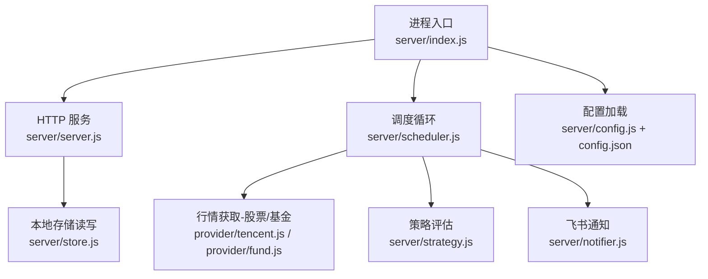
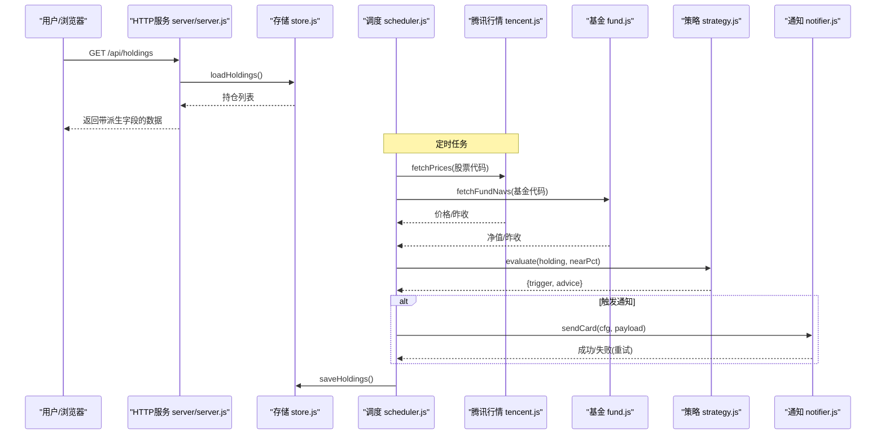
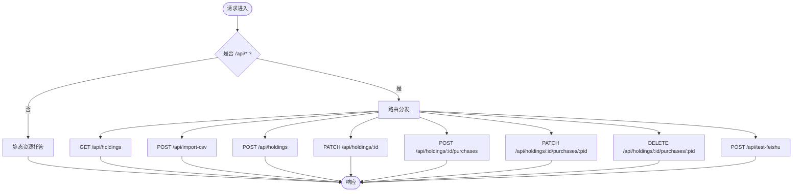
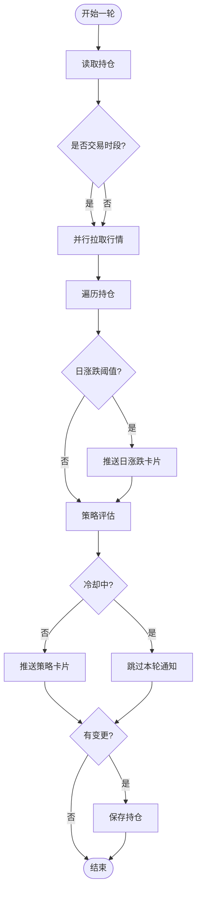
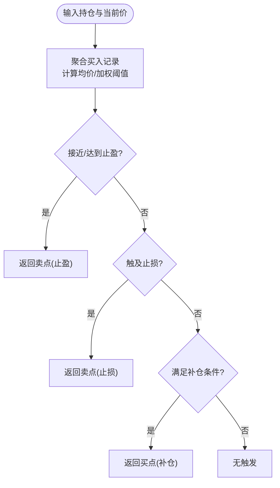
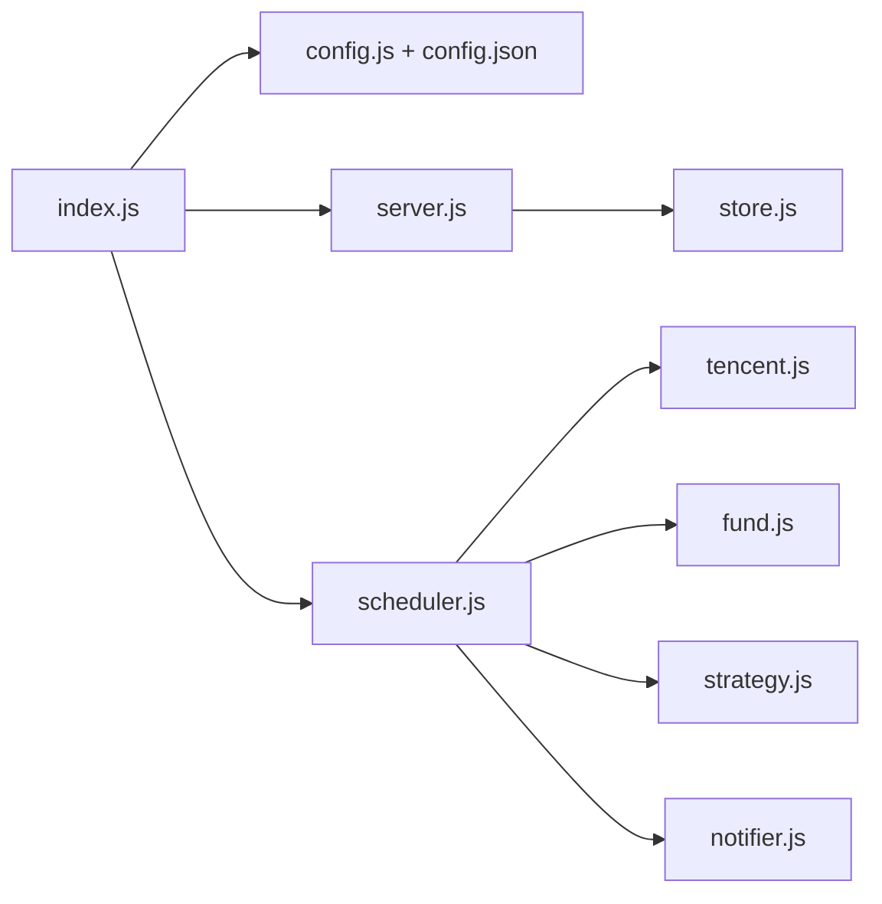

# 故障排除

<cite>
**本文引用的文件**
- [server/index.js](file://server/index.js)
- [server/server.js](file://server/server.js)
- [server/config.js](file://server/config.js)
- [config.json](file://config.json)
- [server/scheduler.js](file://server/scheduler.js)
- [server/provider/tencent.js](file://server/provider/tencent.js)
- [server/provider/fund.js](file://server/provider/fund.js)
- [server/notifier.js](file://server/notifier.js)
- [server/store.js](file://server/store.js)
- [server/strategy.js](file://server/strategy.js)
- [package.json](file://package.json)
- [start.sh](file://start.sh)
</cite>

## 目录
1. [简介](#简介)
2. [项目结构](#项目结构)
3. [核心组件](#核心组件)
4. [架构总览](#架构总览)
5. [详细组件分析](#详细组件分析)
6. [依赖关系分析](#依赖关系分析)
7. [性能考虑](#性能考虑)
8. [故障排除指南](#故障排除指南)
9. [结论](#结论)
10. [附录](#附录)

## 简介
本指南面向 Stock Advisor（股票秘书）的运维与使用者，聚焦于常见问题定位与解决，覆盖网络连接、API 调用失败、数据同步异常、日志分析方法、性能问题诊断、配置错误修复、第三方服务集成排查以及调试工具使用。目标是帮助你快速恢复系统稳定并提升响应速度。

## 项目结构
Stock Advisor 由后端 Node.js 服务、行情抓取与调度、策略评估、飞书通知、前端静态托管及本地 JSON 数据存储组成。启动入口负责加载配置、启动 Web 服务与调度循环；调度器按交易时段选择刷新频率，拉取行情、评估策略并推送告警；Web 层提供持仓管理与导入等 API；存储模块对 holdings.json 进行并发安全的读写。

图示来源
- [server/index.js:1-17](file://server/index.js#L1-L17)
- [server/server.js:567-594](file://server/server.js#L567-L594)
- [server/scheduler.js:65-177](file://server/scheduler.js#L65-L177)
- [server/provider/tencent.js:6-41](file://server/provider/tencent.js#L6-L41)
- [server/provider/fund.js:6-55](file://server/provider/fund.js#L6-L55)
- [server/strategy.js:34-91](file://server/strategy.js#L34-L91)
- [server/notifier.js:81-112](file://server/notifier.js#L81-L112)
- [server/store.js:40-71](file://server/store.js#L40-L71)
- [server/config.js:7-10](file://server/config.js#L7-L10)
- [config.json:1-19](file://config.json#L1-L19)

章节来源
- [server/index.js:1-17](file://server/index.js#L1-L17)
- [server/server.js:567-594](file://server/server.js#L567-L594)
- [server/scheduler.js:65-177](file://server/scheduler.js#L65-L177)
- [server/config.js:7-10](file://server/config.js#L7-L10)
- [config.json:1-19](file://config.json#L1-L19)

## 核心组件
- 进程入口：加载配置、启动 HTTP 服务与调度循环，支持一次性运行模式。
- HTTP 服务：托管前端静态资源，暴露持仓管理、CSV 导入、测试飞书等接口。
- 调度器：判断市场交易时段，批量拉取行情，计算日涨跌与策略触发，执行冷却与持久化。
- 行情提供者：腾讯财经（股票）、东方财富（基金净值）。
- 策略引擎：基于成本加权止盈/止损与补仓逻辑生成触发建议。
- 通知器：构造飞书卡片消息，支持签名与重试。
- 存储：内存缓存 + 串行写盘，避免并发冲突，自动迁移旧版数据结构。

章节来源
- [server/index.js:1-17](file://server/index.js#L1-L17)
- [server/server.js:35-87](file://server/server.js#L35-L87)
- [server/scheduler.js:65-177](file://server/scheduler.js#L65-L177)
- [server/provider/tencent.js:6-41](file://server/provider/tencent.js#L6-L41)
- [server/provider/fund.js:6-55](file://server/provider/fund.js#L6-L55)
- [server/strategy.js:34-91](file://server/strategy.js#L34-L91)
- [server/notifier.js:81-112](file://server/notifier.js#L81-L112)
- [server/store.js:40-71](file://server/store.js#L40-L71)

## 架构总览
下图展示了从请求到数据落盘的完整链路，包括行情拉取、策略评估与通知推送。

图示来源
- [server/server.js:409-565](file://server/server.js#L409-L565)
- [server/store.js:40-71](file://server/store.js#L40-L71)
- [server/scheduler.js:65-177](file://server/scheduler.js#L65-L177)
- [server/provider/tencent.js:6-41](file://server/provider/tencent.js#L6-L41)
- [server/provider/fund.js:6-55](file://server/provider/fund.js#L6-L55)
- [server/strategy.js:34-91](file://server/strategy.js#L34-L91)
- [server/notifier.js:81-112](file://server/notifier.js#L81-L112)

## 详细组件分析

### HTTP 服务与 API
- 静态资源托管：优先精确匹配文件，不存在时回退到 index.html，便于 SPA 路由。
- 请求体解析：JSON 与非 JSON（如 CSV）分别处理，错误时返回明确错误信息。
- 主要 API：
  - GET /api/holdings：返回持仓列表并附加派生指标。
  - POST /api/import-csv：导入买卖记录，支持 createMissing 选项。
  - POST /api/holdings：新建持仓（含买入记录）。
  - PATCH /api/holdings/:id：更新持仓级字段（如日涨跌告警阈值）。
  - POST /api/holdings/:id/purchases：追加买入记录。
  - PATCH /api/holdings/:id/purchases/:pid：修改某条买入记录的参数。
  - DELETE /api/holdings/:id/purchases/:pid：删除买入记录。
  - POST /api/test-feishu：发送测试飞书卡片。

图示来源
- [server/server.js:35-87](file://server/server.js#L35-L87)
- [server/server.js:409-565](file://server/server.js#L409-L565)

章节来源
- [server/server.js:35-87](file://server/server.js#L35-L87)
- [server/server.js:409-565](file://server/server.js#L409-L565)

### 调度器与行情拉取
- 交易时段判断：根据持仓所在市场时区与时间窗口判断是否在交易时段，非交易时段降频。
- 并行拉取：股票走腾讯接口，基金走东方财富接口，任一失败不影响其他。
- 日涨跌告警：当日涨跌幅超过阈值即推送一次，同日去重。
- 策略评估与冷却：依据近阈值比例与冷却时间避免重复通知。
- 持久化：仅当状态变化时写入磁盘。

图示来源
- [server/scheduler.js:65-177](file://server/scheduler.js#L65-L177)
- [server/provider/tencent.js:6-41](file://server/provider/tencent.js#L6-L41)
- [server/provider/fund.js:6-55](file://server/provider/fund.js#L6-L55)
- [server/notifier.js:81-112](file://server/notifier.js#L81-L112)
- [server/store.js:40-71](file://server/store.js#L40-L71)

章节来源
- [server/scheduler.js:65-177](file://server/scheduler.js#L65-L177)

### 策略引擎
- 成本加权：按各笔买入的成本权重计算平均成本与加权止盈/止损比例。
- 卖点触发：接近或达到预期止盈；单笔买入触及止损线。
- 买点触发：较最近买入价跌幅接近补仓条件或到达补仓价。
- 输出：包含触发类型与建议文案，供通知器展示。

图示来源
- [server/strategy.js:34-91](file://server/strategy.js#L34-L91)

章节来源
- [server/strategy.js:34-91](file://server/strategy.js#L34-L91)

### 存储与并发安全
- 内存缓存：首次或外部文件变更后重新读盘，减少 IO。
- 串行写盘：通过 Promise 链保证多次写入顺序，避免互相覆盖。
- 数据迁移：旧版单条买入模型自动迁移为多次买入记录模型。

章节来源
- [server/store.js:40-71](file://server/store.js#L40-L71)

## 依赖关系分析
- 进程入口依赖配置加载、调度与服务器。
- 调度器依赖行情提供者、策略与通知器，并通过存储持久化。
- HTTP 服务依赖存储与通知器，提供数据与测试能力。
- 配置来自配置文件，影响调度间隔、服务器端口与通知参数。

图示来源
- [server/index.js:1-17](file://server/index.js#L1-L17)
- [server/config.js:7-10](file://server/config.js#L7-L10)
- [config.json:1-19](file://config.json#L1-L19)
- [server/server.js:567-594](file://server/server.js#L567-L594)
- [server/scheduler.js:65-177](file://server/scheduler.js#L65-L177)
- [server/provider/tencent.js:6-41](file://server/provider/tencent.js#L6-L41)
- [server/provider/fund.js:6-55](file://server/provider/fund.js#L6-L55)
- [server/strategy.js:34-91](file://server/strategy.js#L34-L91)
- [server/notifier.js:81-112](file://server/notifier.js#L81-L112)
- [server/store.js:40-71](file://server/store.js#L40-L71)

章节来源
- [server/index.js:1-17](file://server/index.js#L1-L17)
- [server/config.js:7-10](file://server/config.js#L7-L10)
- [config.json:1-19](file://config.json#L1-L19)

## 性能考虑
- 网络 I/O 并行：股票与基金行情并行拉取，降低整体延迟。
- 交易时段自适应：非交易时段拉长刷新间隔，减少无效请求。
- 内存缓存：避免频繁读盘，仅在必要时重载。
- 串行写盘：防止并发写导致的数据竞争与覆盖。
- 通知冷却：同一触发态在冷却期内不重复推送，降低外部服务压力。

[本节为通用指导，无需具体文件引用]

## 故障排除指南

### 一、网络连接问题
症状
- 行情长时间不更新或报错。
- 启动后无法访问前端页面。

可能原因
- 腾讯/东方财富接口不可达或返回非 2xx。
- 防火墙/代理限制出站请求。
- 服务器监听地址或端口被占用。

排查步骤
- 检查调度日志中的网络错误标记与状态码。
- 确认外部网络可达性（DNS、代理、防火墙）。
- 验证服务监听地址与端口是否与配置一致。

参考实现位置
- 行情拉取与错误处理：[server/provider/tencent.js:6-41](file://server/provider/tencent.js#L6-L41)、[server/provider/fund.js:6-55](file://server/provider/fund.js#L6-L55)
- 调度循环与错误捕获：[server/scheduler.js:65-177](file://server/scheduler.js#L65-L177)
- 服务监听与端口：[server/server.js:567-594](file://server/server.js#L567-L594)

章节来源
- [server/provider/tencent.js:6-41](file://server/provider/tencent.js#L6-L41)
- [server/provider/fund.js:6-55](file://server/provider/fund.js#L6-L55)
- [server/scheduler.js:65-177](file://server/scheduler.js#L65-L177)
- [server/server.js:567-594](file://server/server.js#L567-L594)

### 二、API 调用失败
症状
- 创建/更新/删除持仓失败。
- CSV 导入失败或数据未生效。
- 测试飞书推送失败。

可能原因
- 请求体格式不正确（字段缺失、类型错误）。
- 路径或方法不匹配。
- 外部服务返回错误（如飞书机器人 webhook 拒绝）。

排查步骤
- 核对请求体必填字段与类型（例如买入价/数量必须为正）。
- 使用 API 测试工具复现请求，观察返回码与错误信息。
- 针对飞书推送，先调用测试接口验证配置。

参考实现位置
- 请求体解析与校验：[server/server.js:60-87](file://server/server.js#L60-L87)
- 持仓与交易处理：[server/server.js:409-565](file://server/server.js#L409-L565)
- 飞书测试接口：[server/server.js:545-562](file://server/server.js#L545-L562)

章节来源
- [server/server.js:60-87](file://server/server.js#L60-L87)
- [server/server.js:409-565](file://server/server.js#L409-L565)

### 三、数据同步异常
症状
- 持仓显示与文件不一致。
- 手动编辑 holdings.json 后未生效或覆盖。
- 导入 CSV 后数据未合并或丢失。

可能原因
- 并发写盘导致覆盖。
- 外部修改未触发重载。
- CSV 列名或数据格式不符合预期。

排查步骤
- 确认存储模块的串行写盘与 mtime 检测机制。
- 检查导入接口的错误返回与结果对象。
- 确保只通过 API 或受控方式修改数据文件。

参考实现位置
- 存储缓存与串行写盘：[server/store.js:40-71](file://server/store.js#L40-L71)
- CSV 导入处理：[server/server.js:416-435](file://server/server.js#L416-L435)

章节来源
- [server/store.js:40-71](file://server/store.js#L40-L71)
- [server/server.js:416-435](file://server/server.js#L416-L435)

### 四、日志分析方法
- 关键日志标记
  - 行情拉取错误：stock-fetch、fund-fetch
  - 通知相关：notify-daily、notify
  - 存储错误：store
  - 服务错误：server
  - 调度周期：tick
- 日志级别建议
  - 生产环境：INFO 及以上，关注错误与警告。
  - 开发环境：可临时提高详细度，便于定位。
- 提取技巧
  - 按时间范围筛选 tick 日志，观察调度频率与模式。
  - 搜索 stock-fetch/fund-fetch 定位网络问题。
  - 搜索 notify 系列日志确认通知是否触发与失败原因。

参考实现位置
- 调度日志与错误：[server/scheduler.js:65-177](file://server/scheduler.js#L65-L177)
- 通知错误捕获：[server/notifier.js:81-112](file://server/notifier.js#L81-L112)
- 存储错误：[server/store.js:62-71](file://server/store.js#L62-L71)
- 服务错误：[server/server.js:571-586](file://server/server.js#L571-L586)

章节来源
- [server/scheduler.js:65-177](file://server/scheduler.js#L65-L177)
- [server/notifier.js:81-112](file://server/notifier.js#L81-L112)
- [server/store.js:62-71](file://server/store.js#L62-L71)
- [server/server.js:571-586](file://server/server.js#L571-L586)

### 五、性能问题诊断
- 内存泄漏检测
  - 使用 Node.js 堆快照对比（heap snapshot），关注持续增长的对象图。
  - 重点检查长生命周期缓存与事件监听器。
- CPU 使用率分析
  - 使用 CPU Profiler 识别热点函数（如大量字符串处理或循环）。
  - 结合调度频率与请求量评估负载。
- 数据库查询优化
  - 本项目使用本地 JSON 文件，避免频繁全量读写。
  - 利用内存缓存与串行写盘减少 IO 压力。
  - 合理设置调度间隔，非交易时段降频。

[本节为通用指导，无需具体文件引用]

### 六、配置错误的识别与修复
- JSON 格式验证
  - 确保配置文件语法正确，键名与层级符合预期。
  - 若启动时报错，优先检查配置文件解析阶段。
- 环境变量配置
  - 一次性运行模式通过环境变量控制（如 ONCE）。
  - 开发/生产模式通过启动脚本切换。
- 权限设置问题
  - 确保 data 目录与 holdings.json 可读写。
  - 避免多进程同时直接编辑数据文件。

参考实现位置
- 配置加载：[server/config.js:7-10](file://server/config.js#L7-L10)
- 配置文件结构：[config.json:1-19](file://config.json#L1-L19)
- 一次性运行标志：[server/index.js:11-16](file://server/index.js#L11-L16)
- 启动脚本模式：[start.sh:48-99](file://start.sh#L48-L99)

章节来源
- [server/config.js:7-10](file://server/config.js#L7-L10)
- [config.json:1-19](file://config.json#L1-L19)
- [server/index.js:11-16](file://server/index.js#L11-L16)
- [start.sh:48-99](file://start.sh#L48-L99)

### 七、第三方服务集成问题
- 腾讯财经 API 限流或不可用
  - 现象：股票行情为空或返回非 2xx。
  - 处理：调度器已做错误捕获与降级（返回空映射），等待下次重试。
  - 建议：增加重试与退避策略，或引入缓存与备用源。
- 飞书机器人配置错误
  - 现象：测试推送失败或报签名错误。
  - 处理：检查 webhook 与 secret 配置，使用测试接口验证。
  - 建议：定期轮换密钥，监控推送成功率。

参考实现位置
- 腾讯行情错误处理：[server/provider/tencent.js:6-41](file://server/provider/tencent.js#L6-L41)
- 调度错误捕获：[server/scheduler.js:77-86](file://server/scheduler.js#L77-L86)
- 飞书通知与重试：[server/notifier.js:81-112](file://server/notifier.js#L81-L112)
- 测试接口：[server/server.js:545-562](file://server/server.js#L545-L562)

章节来源
- [server/provider/tencent.js:6-41](file://server/provider/tencent.js#L6-L41)
- [server/scheduler.js:77-86](file://server/scheduler.js#L77-L86)
- [server/notifier.js:81-112](file://server/notifier.js#L81-L112)
- [server/server.js:545-562](file://server/server.js#L545-L562)

### 八、调试工具与命令
- Node.js 调试器
  - 使用调试参数启动进程，配合 IDE 断点调试。
  - 关注调度循环与 API 处理函数的执行路径。
- 浏览器开发者工具
  - 查看网络面板，确认前端请求与响应。
  - 检查控制台错误与跨域问题。
- API 测试工具
  - 使用 curl 或 Postman 调用 /api/test-feishu 验证通知配置。
  - 调用 /api/holdings 检查数据结构与派生字段。

参考实现位置
- 启动入口与脚本：[server/index.js:1-17](file://server/index.js#L1-L17)、[start.sh:48-99](file://start.sh#L48-L99)
- 测试接口：[server/server.js:545-562](file://server/server.js#L545-L562)

章节来源
- [server/index.js:1-17](file://server/index.js#L1-L17)
- [start.sh:48-99](file://start.sh#L48-L99)
- [server/server.js:545-562](file://server/server.js#L545-L562)

### 九、性能调优建议与最佳实践
- 调整调度间隔：根据业务需求与外部服务限制，合理设置交易时段与非交易时段间隔。
- 减少不必要请求：仅在交易时段高频拉取，非交易时段降频。
- 缓存与复用：利用内存缓存减少 IO 与网络开销。
- 通知节流：保持冷却期，避免刷屏与限流。
- 监控与告警：建立对外部服务可用性的监控，及时发现问题。

[本节为通用指导，无需具体文件引用]

## 结论
通过理解系统架构与关键组件的职责边界，结合日志分析与调试工具，可以快速定位并解决网络、API、数据同步与第三方集成等问题。遵循配置规范与性能调优建议，有助于提升系统的稳定性与响应速度。

## 附录
- 启动方式
  - 生产模式：构建前端并启动后端服务。
  - 开发模式：同时启动后端与 Vite 开发服务器，支持热更新。
- 常用命令
  - 安装依赖、构建、预览与导入 CSV。

参考实现位置
- 脚本与命令定义：[start.sh:48-99](file://start.sh#L48-L99)、[package.json:7-14](file://package.json#L7-L14)

章节来源
- [start.sh:48-99](file://start.sh#L48-L99)
- [package.json:7-14](file://package.json#L7-L14)