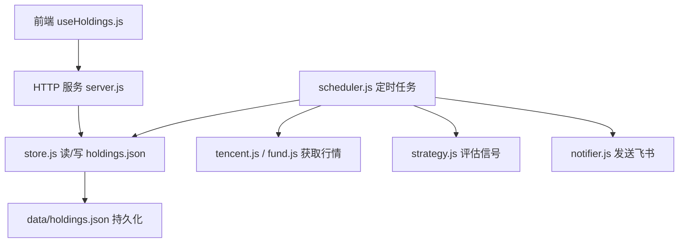
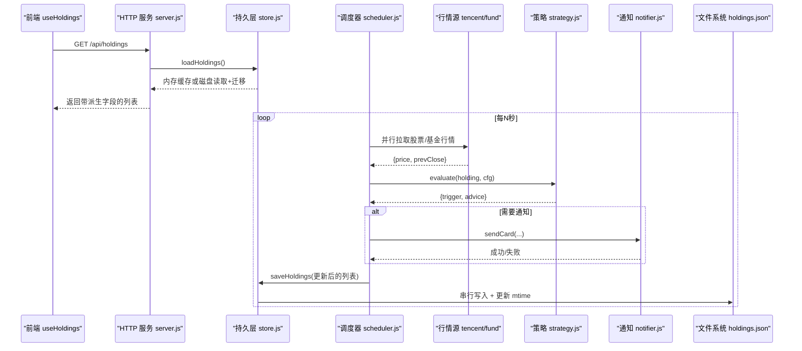
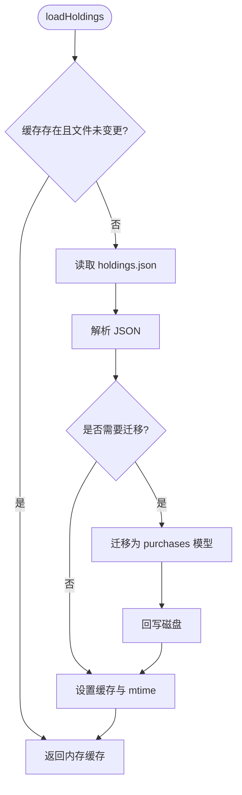
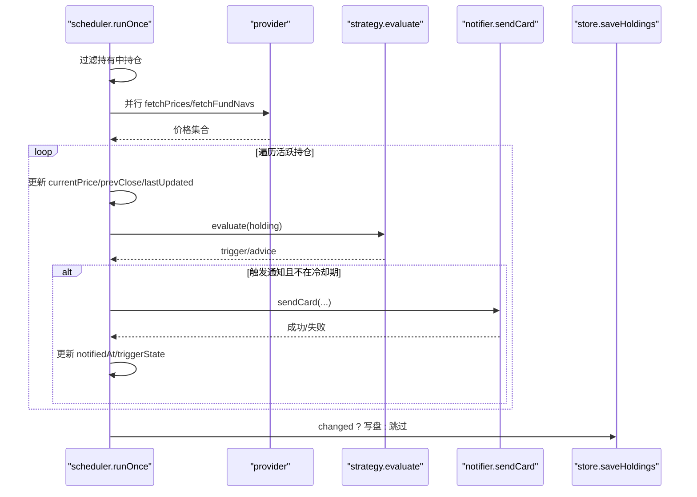
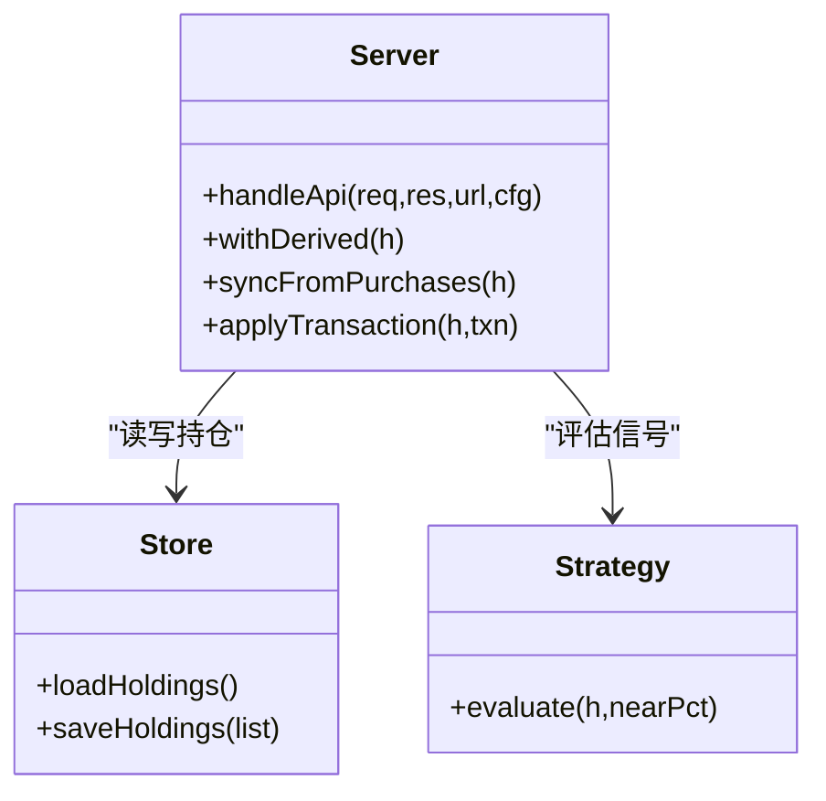

# 数据同步问题

<cite>
**本文引用的文件**
- [server/store.js](file://server/store.js)
- [server/scheduler.js](file://server/scheduler.js)
- [server/server.js](file://server/server.js)
- [server/provider/tencent.js](file://server/provider/tencent.js)
- [server/provider/fund.js](file://server/provider/fund.js)
- [server/strategy.js](file://server/strategy.js)
- [server/notifier.js](file://server/notifier.js)
- [web/src/composables/useHoldings.js](file://web/src/composables/useHoldings.js)
- [data/holdings.json](file://data/holdings.json)
- [config.json](file://config.json)
</cite>

## 目录
1. [简介](#简介)
2. [项目结构](#项目结构)
3. [核心组件](#核心组件)
4. [架构总览](#架构总览)
5. [详细组件分析](#详细组件分析)
6. [依赖关系分析](#依赖关系分析)
7. [性能考虑](#性能考虑)
8. [故障排查指南](#故障排查指南)
9. [结论](#结论)
10. [附录](#附录)

## 简介
本指南聚焦“持仓数据与行情数据不同步”的问题，围绕缓存失效、更新延迟、一致性保证展开；同时覆盖 JSON 文件存储的并发访问（写串行化、mtime 检测）、数据迁移与版本兼容（旧版扁平结构到多次买入记录模型）、数据完整性验证与修复工具（校验脚本、备份恢复流程），以及大数据量场景下的性能优化建议（分页加载、增量更新、内存管理）。

## 项目结构
系统由后端 Node.js HTTP 服务、调度器、行情/基金数据源适配器、策略引擎、飞书通知模块、前端 Vue 应用及本地 JSON 持久化组成。关键路径：
- 数据持久层：server/store.js 负责读取 holdings.json、内存缓存、写串行化与 mtime 检测
- 定时任务：server/scheduler.js 按交易时段拉取行情并更新持仓状态
- API 层：server/server.js 暴露 REST 接口，统一读写持仓数据
- 数据源：provider/tencent.js（股票）、provider/fund.js（基金）
- 策略：server/strategy.js 计算买卖信号
- 通知：server/notifier.js 推送飞书卡片
- 前端：web/src/composables/useHoldings.js 轮询 /api/holdings 展示最新数据
- 配置：config.json 控制调度间隔、冷却时间等



**图表来源**
- [server/server.js:567-594](file://server/server.js#L567-L594)
- [server/store.js:40-70](file://server/store.js#L40-L70)
- [server/scheduler.js:65-177](file://server/scheduler.js#L65-L177)
- [server/provider/tencent.js:6-41](file://server/provider/tencent.js#L6-L41)
- [server/provider/fund.js:6-54](file://server/provider/fund.js#L6-L54)
- [server/strategy.js:34-90](file://server/strategy.js#L34-L90)
- [server/notifier.js:81-111](file://server/notifier.js#L81-L111)
- [data/holdings.json:1-462](file://data/holdings.json#L1-L462)

**章节来源**
- [server/server.js:567-594](file://server/server.js#L567-L594)
- [server/store.js:40-70](file://server/store.js#L40-L70)
- [server/scheduler.js:65-177](file://server/scheduler.js#L65-L177)
- [config.json:1-19](file://config.json#L1-L19)

## 核心组件
- 数据持久与缓存（store.js）
  - 内存缓存 + mtime 检测：首次或外部修改后重新读盘，避免重复 IO
  - 写串行化：writeChain 队列防止调度器与接口并发写导致覆盖
  - 数据迁移：旧版扁平结构自动迁移为 purchases 数组模型
- 定时刷新（scheduler.js）
  - 根据市场时区判断交易时段，动态调整刷新频率
  - 并行拉取股票与基金行情，合并后更新 currentPrice/prevClose/lastUpdated
  - 触发日涨跌告警与策略信号，必要时写入通知时间与状态
- API 服务（server/server.js）
  - 提供列表、新增、更新、追加买入/卖出、CSV 导入等接口
  - 派生字段计算（均价、未实现收益、今日收益等）与同步逻辑
- 数据源（tencent.js, fund.js）
  - 批量股票行情与逐只基金净值，容错处理缺失数据
- 策略（strategy.js）
  - 基于成本加权止盈、单笔止损、补仓条件评估
- 通知（notifier.js）
  - 构建飞书卡片消息，支持签名与重试

**章节来源**
- [server/store.js:24-70](file://server/store.js#L24-L70)
- [server/scheduler.js:65-177](file://server/scheduler.js#L65-L177)
- [server/server.js:146-284](file://server/server.js#L146-L284)
- [server/provider/tencent.js:6-41](file://server/provider/tencent.js#L6-L41)
- [server/provider/fund.js:6-54](file://server/provider/fund.js#L6-L54)
- [server/strategy.js:34-90](file://server/strategy.js#L34-L90)
- [server/notifier.js:81-111](file://server/notifier.js#L81-L111)

## 架构总览
下图展示了从前端请求到数据落盘的完整链路，以及定时任务对行情的拉取与状态更新。



**图表来源**
- [server/server.js:410-449](file://server/server.js#L410-L449)
- [server/store.js:40-70](file://server/store.js#L40-L70)
- [server/scheduler.js:65-177](file://server/scheduler.js#L65-L177)
- [server/provider/tencent.js:6-41](file://server/provider/tencent.js#L6-L41)
- [server/provider/fund.js:6-54](file://server/provider/fund.js#L6-L54)
- [server/strategy.js:34-90](file://server/strategy.js#L34-L90)
- [server/notifier.js:81-111](file://server/notifier.js#L81-L111)

## 详细组件分析

### 数据持久与缓存（store.js）
- 内存缓存与 mtime 检测
  - 仅在首次加载或文件被外部修改时重新读盘，减少不必要的 I/O
  - 写盘后同步 mtime，避免误判为外部改动而重复重载
- 写串行化
  - writeChain 确保所有保存操作顺序执行，避免并发覆盖
- 数据迁移
  - 旧版扁平结构自动转换为 purchases 数组，并在首次迁移后落盘



**图表来源**
- [server/store.js:14-58](file://server/store.js#L14-L58)
- [server/store.js:61-70](file://server/store.js#L61-L70)

**章节来源**
- [server/store.js:14-70](file://server/store.js#L14-L70)

### 定时刷新与行情同步（scheduler.js）
- 交易时段判断
  - 依据 region 与时区，区分交易与非交易时段，非交易时段降频
- 行情拉取
  - 股票走腾讯接口批量拉取，基金逐个查询东方财富净值
  - 无行情时跳过并记录警告
- 状态更新与通知
  - 更新 currentPrice/prevClose/lastUpdated
  - 日涨跌阈值触发当日告警，策略信号触发通知并冷却
  - changed 标志决定是否写盘



**图表来源**
- [server/scheduler.js:65-177](file://server/scheduler.js#L65-L177)
- [server/provider/tencent.js:6-41](file://server/provider/tencent.js#L6-L41)
- [server/provider/fund.js:6-54](file://server/provider/fund.js#L6-L54)
- [server/strategy.js:34-90](file://server/strategy.js#L34-L90)
- [server/notifier.js:81-111](file://server/notifier.js#L81-L111)
- [server/store.js:61-70](file://server/store.js#L61-L70)

**章节来源**
- [server/scheduler.js:65-177](file://server/scheduler.js#L65-L177)

### API 层与派生字段（server/server.js）
- 列表接口返回带派生字段的持仓，便于前端直接展示
- 新增/更新/追加买入/卖出均调用 syncFromPurchases 保持 cost/avgCost/unsoldQuantity 一致
- CSV 导入幂等：以 (code, 操作, 日期, 数量, 价格) 去重，避免重复插入



**图表来源**
- [server/server.js:146-284](file://server/server.js#L146-L284)
- [server/server.js:346-407](file://server/server.js#L346-L407)
- [server/store.js:40-70](file://server/store.js#L40-L70)
- [server/strategy.js:34-90](file://server/strategy.js#L34-L90)

**章节来源**
- [server/server.js:146-284](file://server/server.js#L146-L284)
- [server/server.js:346-407](file://server/server.js#L346-L407)

### 前端轮询与展示（useHoldings.js）
- 单定时器倒计时刷新，避免多定时器漂移
- 写操作后统一刷新列表，保证 UI 与后端一致

**章节来源**
- [web/src/composables/useHoldings.js:15-50](file://web/src/composables/useHoldings.js#L15-L50)
- [web/src/composables/useHoldings.js:67-130](file://web/src/composables/useHoldings.js#L67-L130)

## 依赖关系分析
- 低耦合高内聚：store.js 仅关注持久化与缓存；scheduler.js 专注定时任务；server.js 路由与业务编排
- 外部依赖：
  - 行情源：tencent.js（股票）、fund.js（基金）
  - 通知：notifier.js（飞书）
  - 配置：config.json（调度间隔、冷却时间等）
- 潜在循环依赖：当前未见循环引用；store.js 被 scheduler.js 与 server.js 共同使用，职责清晰

```mermaid
graph LR
store["store.js"] <- --> server["server.js"]
store <- --> scheduler["scheduler.js"]
scheduler --> provider_t["provider/tencent.js"]
scheduler --> provider_f["provider/fund.js"]
scheduler --> strategy["strategy.js"]
scheduler --> notifier["notifier.js"]
server --> notifier
```

**图表来源**
- [server/server.js:567-594](file://server/server.js#L567-L594)
- [server/scheduler.js:1-5](file://server/scheduler.js#L1-L5)
- [server/store.js:1-6](file://server/store.js#L1-L6)

**章节来源**
- [server/server.js:567-594](file://server/server.js#L567-L594)
- [server/scheduler.js:1-5](file://server/scheduler.js#L1-L5)
- [server/store.js:1-6](file://server/store.js#L1-L6)

## 性能考虑
- 行情拉取并行化：股票与基金分别并行请求，缩短整体耗时
- 非交易时段降频：通过 pickInterval 降低空闲时段刷新频率，减少无效 IO
- 写串行化：writeChain 避免并发写竞争，但会排队等待，建议在高频写入场景下合并写或引入批处理
- 内存缓存：减少重复读盘，提升列表接口响应速度
- 大数据量优化建议
  - 分页加载：前端可按页拉取 holdings 列表，减少单次传输体积
  - 增量更新：服务端可返回 diff（如仅变更的持仓项），前端局部更新
  - 内存管理：对超大 holdings.json 考虑分片存储或数据库替代；当前 JSON 适合中小规模
  - 网络超时与重试：对行情源增加超时与指数退避重试，提高鲁棒性

[本节为通用指导，不直接分析具体文件]

## 故障排查指南

### 症状一：持仓数据与行情数据不同步
- 可能原因
  - 行情源不可用或返回空：scheduler 中 catch 后返回空对象，导致跳过该标的
  - 非交易时段：isMarketOpen 判断为 false，使用 offHoursIntervalSeconds 长间隔
  - 缓存未失效：外部修改 holdings.json 但未触发 mtime 变化（极少见）
- 排查步骤
  - 检查日志中的 “[stock-fetch]”、“[fund]” 错误信息
  - 确认 config.json 的 schedule.intervalSeconds 与 offHoursIntervalSeconds
  - 查看 holdings.json 中 lastUpdated 是否为 null 或陈旧时间
- 修复建议
  - 增加行情源健康检查与降级策略（如缓存上次有效价）
  - 在 API 层暴露 “强制刷新” 接口，手动触发 runOnce
  - 若发现缓存未失效，重启服务或清理内存缓存

**章节来源**
- [server/scheduler.js:72-87](file://server/scheduler.js#L72-L87)
- [server/scheduler.js:37-56](file://server/scheduler.js#L37-L56)
- [server/store.js:14-22](file://server/store.js#L14-L22)
- [config.json:1-19](file://config.json#L1-L19)

### 症状二：JSON 文件损坏或并发写冲突
- 现象
  - 启动时报 JSON 解析错误
  - 持仓状态异常（如 cost/avgCost 不一致）
- 根因
  - 并发写导致部分写入（当前已串行化，但仍需防范外部进程写入）
  - 外部编辑器直接修改文件导致 mtime 变化，下次加载触发迁移或覆盖
- 修复流程
  - 使用备份恢复：从 holdings-备份*.json 或 holdings-before-import.json 恢复
  - 运行导入脚本进行幂等合并，避免重复记录
  - 校验数据完整性（见附录校验脚本）

**章节来源**
- [server/store.js:61-70](file://server/store.js#L61-L70)
- [server/import-csv-core.js:212-306](file://server/import-csv-core.js#L212-L306)
- [server/import-csv.js:24-52](file://server/import-csv.js#L24-L52)

### 症状三：数据迁移失败或版本不兼容
- 现象
  - 旧版扁平结构无法正确计算均价与收益
- 机制
  - store.js 的 migrate 函数将旧结构转换为 purchases 数组，并在首次迁移后落盘
- 处理建议
  - 保留历史备份，迁移前备份 holdings.json
  - 迁移后校验派生字段（cost/avgCost/unsoldQuantity）是否合理

**章节来源**
- [server/store.js:24-58](file://server/store.js#L24-L58)

### 症状四：通知频繁或遗漏
- 现象
  - 同一信号重复通知或长时间未通知
- 原因
  - cooldownSeconds 设置过小或过大
  - 行情缺失导致 evaluate 返回 NONE
- 处理建议
  - 调整 config.json 的 notify.cooldownSeconds
  - 检查行情源返回，必要时缓存最近有效价

**章节来源**
- [server/scheduler.js:135-157](file://server/scheduler.js#L135-L157)
- [config.json:14-17](file://config.json#L14-L17)

## 结论
本项目通过内存缓存、mtime 检测与写串行化实现了基本的并发安全与一致性保障；调度器按交易时段动态刷新，结合策略引擎与通知形成闭环。针对数据同步问题，建议增强行情源健壮性、引入增量更新与分页加载，并完善数据校验与备份恢复流程，以提升系统在大数据量与高并发场景下的稳定性与性能。

[本节为总结，不直接分析具体文件]

## 附录

### 数据完整性校验脚本（建议）
- 目标
  - 校验 holdings.json 的结构完整性（必填字段、数值范围、purchases/sells 一致性）
  - 校验派生字段（cost/avgCost/unsoldQuantity）与原始记录的一致性
- 步骤
  - 读取 holdings.json，遍历每个持仓
  - 校验必填字段：id/name/code/region/type/status
  - 校验 purchases 与 sells 的数量与成本一致性
  - 输出异常清单，支持生成修复建议

[本节为通用指导，不直接分析具体文件]

### 备份与恢复流程
- 备份
  - 定期复制 holdings.json 为 holdings-YYYYMMDD.json
  - 导入前备份为 holdings-before-import.json
- 恢复
  - 若当前文件损坏，替换为最近一次备份
  - 使用 import-csv.js 进行幂等导入，避免重复记录

**章节来源**
- [server/import-csv.js:24-52](file://server/import-csv.js#L24-L52)

### 大数据量优化清单
- 前端
  - 分页加载 holdings 列表，按需渲染
  - 使用虚拟滚动减少 DOM 节点数量
- 后端
  - 对 holdings.json 分片存储或迁移至轻量数据库
  - 提供增量接口（diff）与批量更新接口
  - 增加行情源超时与重试，缓存最近有效价
- 调度
  - 非交易时段进一步降频
  - 对频繁更新的字段采用懒更新策略

[本节为通用指导，不直接分析具体文件]