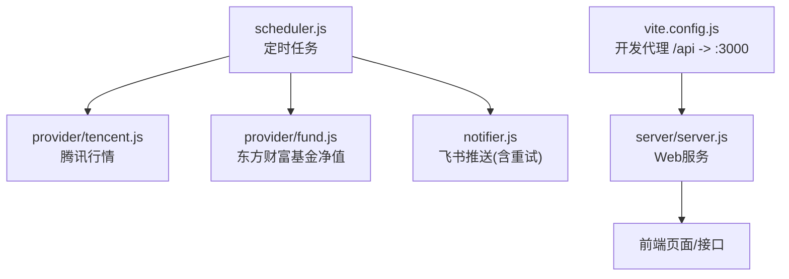
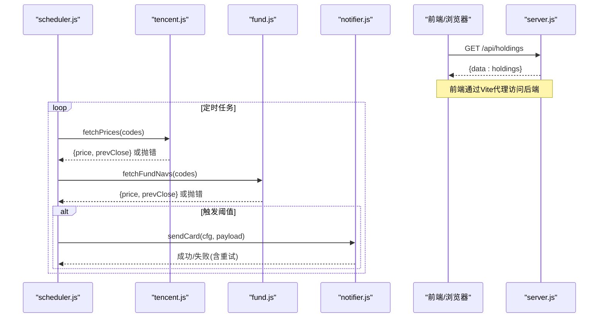
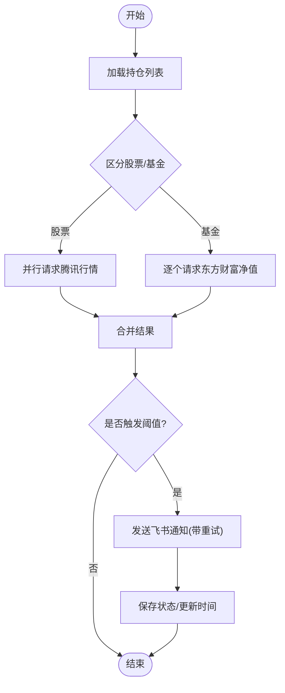
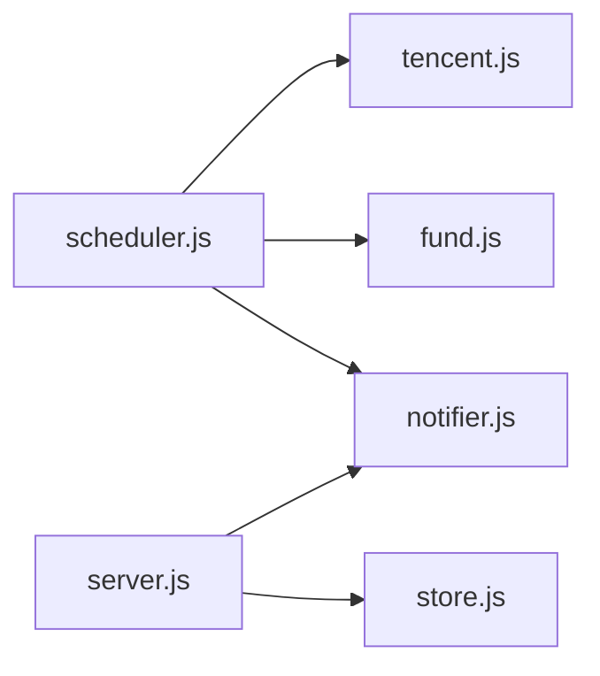

# 网络连接问题

<cite>
**本文引用的文件**
- [server/provider/tencent.js](file://server/provider/tencent.js)
- [server/provider/fund.js](file://server/provider/fund.js)
- [server/scheduler.js](file://server/scheduler.js)
- [server/notifier.js](file://server/notifier.js)
- [server/server.js](file://server/server.js)
- [server/config.js](file://server/config.js)
- [config.json](file://config.json)
- [vite.config.js](file://vite.config.js)
</cite>

## 目录
1. [简介](#简介)
2. [项目结构](#项目结构)
3. [核心组件](#核心组件)
4. [架构总览](#架构总览)
5. [详细组件分析](#详细组件分析)
6. [依赖关系分析](#依赖关系分析)
7. [性能与限流](#性能与限流)
8. [故障排查指南](#故障排查指南)
9. [结论](#结论)
10. [附录：网络连通性测试方法](#附录：网络连通性测试方法)

## 简介
本指南聚焦于本项目中调用腾讯财经API（股票行情）与东方财富API（基金净值）时可能出现的网络连接问题，包括网络超时、DNS解析失败、SSL证书验证失败、HTTP状态码异常、API限流等。文档同时给出代理服务器配置、防火墙策略对调用的影响，以及在不同网络环境（企业网、移动网络、跨境网络）下的调整建议，并提供可操作的诊断方法与工具。

## 项目结构
本项目后端使用Node.js内置的fetch发起对外部金融数据源的请求；前端通过Vite开发服务器将/api请求代理到本地后端服务。关键路径如下：
- 行情抓取调度：scheduler.js 负责定时拉取并更新持仓价格
- 外部API适配层：provider/tencent.js（腾讯）、provider/fund.js（东方财富）
- 通知推送：notifier.js（飞书机器人）
- Web服务：server/server.js 提供静态页面与API
- 配置加载：config.js 读取 config.json

**图表来源**
- [server/scheduler.js:65-86](file://server/scheduler.js#L65-L86)
- [server/provider/tencent.js:6-15](file://server/provider/tencent.js#L6-L15)
- [server/provider/fund.js:6-23](file://server/provider/fund.js#L6-L23)
- [server/notifier.js:81-111](file://server/notifier.js#L81-L111)
- [server/server.js:567-593](file://server/server.js#L567-L593)
- [vite.config.js:14-24](file://vite.config.js#L14-L24)

**章节来源**
- [server/scheduler.js:65-86](file://server/scheduler.js#L65-L86)
- [server/provider/tencent.js:6-15](file://server/provider/tencent.js#L6-L15)
- [server/provider/fund.js:6-23](file://server/provider/fund.js#L6-L23)
- [server/notifier.js:81-111](file://server/notifier.js#L81-L111)
- [server/server.js:567-593](file://server/server.js#L567-L593)
- [vite.config.js:14-24](file://vite.config.js#L14-L24)

## 核心组件
- 腾讯行情适配器：批量获取A股/港股/美股实时价与昨收，返回GBK或UTF-8文本，内部解析为价格对象。
- 东方财富基金净值适配器：逐个基金查询JSONP格式净值，提取最新与上一交易日净值。
- 调度器：按交易时段选择刷新间隔，并行拉取股票与基金数据，计算涨跌并触发告警。
- 通知器：向飞书发送卡片消息，内置指数退避重试机制。
- Web服务：提供静态页面与REST接口，统一托管前端资源。
- 配置加载：从根目录config.json读取调度与服务端口等配置。

**章节来源**
- [server/provider/tencent.js:6-40](file://server/provider/tencent.js#L6-L40)
- [server/provider/fund.js:6-54](file://server/provider/fund.js#L6-L54)
- [server/scheduler.js:65-165](file://server/scheduler.js#L65-L165)
- [server/notifier.js:81-111](file://server/notifier.js#L81-L111)
- [server/server.js:567-593](file://server/server.js#L567-L593)
- [server/config.js:7-10](file://server/config.js#L7-L10)
- [config.json:1-18](file://config.json#L1-L18)

## 架构总览
下图展示了从调度器到外部API再到通知的完整链路，以及错误处理与重试点。

**图表来源**
- [server/scheduler.js:65-86](file://server/scheduler.js#L65-L86)
- [server/provider/tencent.js:6-15](file://server/provider/tencent.js#L6-L15)
- [server/provider/fund.js:6-23](file://server/provider/fund.js#L6-L23)
- [server/notifier.js:96-111](file://server/notifier.js#L96-L111)
- [vite.config.js:14-24](file://vite.config.js#L14-L24)

## 详细组件分析

### 腾讯财经API连接问题定位
- 请求方式：使用全局fetch，设置User-Agent与Referer以兼容服务端校验。
- 编码处理：优先尝试GBK解码，回退UTF-8，避免乱码导致解析失败。
- 常见异常：
  - DNS解析失败：域名无法解析，检查系统DNS、企业DNS或代理设置。
  - SSL证书验证失败：HTTPS握手失败，检查系统信任库、代理MITM或时间同步。
  - HTTP状态码非2xx：直接抛出包含状态码的错误，便于日志定位。
  - 限流/封禁：频繁请求触发429/403等，需降低频率或增加随机抖动。
- 建议增强：
  - 增加请求超时与重试（指数退避），避免瞬时网络抖动导致失败。
  - 在代理环境下配置环境变量（如HTTPS_PROXY/HTTP_PROXY）或使用自定义Agent。
  - 记录每次请求耗时与状态码，辅助限流与稳定性分析。

**章节来源**
- [server/provider/tencent.js:6-40](file://server/provider/tencent.js#L6-L40)

### 东方财富基金API连接问题定位
- 请求方式：逐个基金查询JSONP，设置User-Agent与Referer。
- 响应解析：去除jQuery(...)包裹后JSON.parse，若格式不符则跳过该基金。
- 常见异常：
  - JSONP格式变化或跨域限制导致解析失败。
  - 高频请求被限流，返回非2xx状态码。
  - DNS/SSL问题同上。
- 建议增强：
  - 增加请求间延迟与整体并发控制，避免触发风控。
  - 增加重试与降级策略（例如缓存上次有效净值）。
  - 记录解析失败的具体原因，便于快速定位。

**章节来源**
- [server/provider/fund.js:6-54](file://server/provider/fund.js#L6-L54)

### 调度器与重试机制
- 调度逻辑：根据市场交易时段动态选择刷新间隔，非交易时段降频。
- 并行拉取：股票与基金数据并行请求，提升效率但需注意外部限流。
- 错误处理：捕获外部API异常并记录日志，不影响其他品种更新。
- 通知重试：飞书推送内置最多3次重试，指数退避，提高可靠性。

**图表来源**
- [server/scheduler.js:65-165](file://server/scheduler.js#L65-L165)
- [server/notifier.js:96-111](file://server/notifier.js#L96-L111)

**章节来源**
- [server/scheduler.js:65-165](file://server/scheduler.js#L65-L165)
- [server/notifier.js:96-111](file://server/notifier.js#L96-L111)

### Web服务与前端代理
- 后端服务：基于node:http创建HTTP服务器，提供静态页面与API。
- 前端代理：开发模式下Vite将/api请求代理到http://127.0.0.1:3000，便于联调。
- 常见问题：
  - 生产环境未正确代理或反向代理配置错误，导致/api不可达。
  - 跨域问题：确保后端响应头允许跨域（如需）。
  - 端口占用：确认server.js监听端口未被占用。

**章节来源**
- [server/server.js:567-593](file://server/server.js#L567-L593)
- [vite.config.js:14-24](file://vite.config.js#L14-L24)

## 依赖关系分析
- scheduler.js 依赖 tencent.js、fund.js、notifier.js 完成数据拉取与通知。
- server.js 提供HTTP服务，不直接调用外部金融API，仅承载前端与业务接口。
- notifier.js 依赖系统crypto模块进行签名，并通过fetch发送请求。
- provider层均依赖全局fetch，未显式配置超时与代理，需结合运行环境与系统变量。

**图表来源**
- [server/scheduler.js:1-5](file://server/scheduler.js#L1-L5)
- [server/server.js:1-7](file://server/server.js#L1-L7)
- [server/notifier.js:1-2](file://server/notifier.js#L1-L2)

**章节来源**
- [server/scheduler.js:1-5](file://server/scheduler.js#L1-L5)
- [server/server.js:1-7](file://server/server.js#L1-L7)
- [server/notifier.js:1-2](file://server/notifier.js#L1-L2)

## 性能与限流
- 并发控制：当前股票与基金请求并行执行，建议在大规模持仓场景下引入队列或限速器，避免触发外部限流。
- 重试策略：通知已实现指数退避重试；外部API建议增加重试与熔断，防止雪崩。
- 缓存策略：对东方财富基金净值可增加短期缓存，减少重复请求。
- 监控指标：记录请求成功率、平均耗时、状态码分布，用于识别限流与不稳定节点。

[本节为通用性能建议，不直接分析具体代码]

## 故障排查指南

### 网络超时
- 现象：请求长时间无响应或抛出超时错误。
- 排查步骤：
  - 检查系统代理与环境变量（HTTPS_PROXY/HTTP_PROXY）。
  - 使用curl测试目标域名连通性与TLS握手。
  - 在provider层增加超时配置与重试（建议指数退避）。
  - 观察scheduler日志中的错误信息，定位具体品种与接口。

**章节来源**
- [server/scheduler.js:77-86](file://server/scheduler.js#L77-L86)

### DNS解析错误
- 现象：域名无法解析，报错类似ENOTFOUND。
- 排查步骤：
  - 检查系统DNS服务器与hosts文件。
  - 企业网络可能使用内部DNS，确认能解析外部域名。
  - 切换公共DNS（如8.8.8.8/1.1.1.1）测试。
  - 在代理环境下确认代理支持域名解析。

**章节来源**
- [server/provider/tencent.js:6-15](file://server/provider/tencent.js#L6-L15)
- [server/provider/fund.js:6-23](file://server/provider/fund.js#L6-L23)

### SSL证书验证失败
- 现象：HTTPS握手失败，报CERTIFICATE_VERIFY_FAILED或类似错误。
- 排查步骤：
  - 检查系统时间是否正确（时间偏差会导致证书无效）。
  - 企业代理可能进行MITM拦截，需导入企业根证书到系统信任库。
  - 临时禁用证书验证仅用于诊断（生产环境不建议）。
  - 使用curl --insecure测试（仅诊断）。

**章节来源**
- [server/notifier.js:96-111](file://server/notifier.js#L96-L111)

### HTTP状态码分析与限流诊断
- 常见状态码：
  - 2xx：成功。
  - 4xx：客户端错误（如403禁止访问、429限流）。
  - 5xx：服务端错误（如503服务不可用）。
- 诊断方法：
  - 查看provider层日志中的状态码与错误信息。
  - 降低请求频率，增加随机抖动，避免集中触发限流。
  - 对429实施退避重试，对5xx实施熔断与降级。
  - 记录状态码分布，绘制趋势图以便发现限流模式。

**章节来源**
- [server/provider/tencent.js:15-15](file://server/provider/tencent.js#L15-L15)
- [server/provider/fund.js:20-23](file://server/provider/fund.js#L20-L23)

### 代理服务器配置与防火墙影响
- 代理配置：
  - Node.js默认遵循HTTPS_PROXY/HTTP_PROXY环境变量。
  - 企业网络通常要求配置代理才能访问外网。
  - 若使用自定义Agent，需在fetch调用处传入代理选项。
- 防火墙策略：
  - 确认出站规则允许访问443端口及目标域名。
  - 某些企业网络会阻断特定域名或IP段，需申请白名单。
  - 检查DNS是否被劫持或污染。

**章节来源**
- [vite.config.js:14-24](file://vite.config.js#L14-L24)
- [server/server.js:567-593](file://server/server.js#L567-L593)

### 不同网络环境的配置建议
- 企业网络：
  - 配置HTTPS_PROXY指向公司代理，必要时设置no_proxy排除内网域名。
  - 导入企业根证书到系统信任库，避免SSL验证失败。
  - 与IT部门协调开放必要域名与端口。
- 移动网络：
  - 注意运营商DNS与CDN策略，可能出现解析异常。
  - 切换Wi-Fi/蜂窝网络对比测试。
  - 避免在高延迟环境下高并发请求。
- 跨境网络：
  - 使用稳定DNS与CDN，减少跨国路由抖动。
  - 考虑多地域镜像或备用数据源。
  - 增加重试与超时容忍度，适应网络波动。

[本节为通用网络环境建议，不直接分析具体代码]

## 结论
本项目通过scheduler统一调度外部金融API，并在通知层实现了重试机制。当前provider层未显式配置超时与重试，易受网络波动与限流影响。建议在生产环境中为外部API调用增加超时、重试、熔断与监控，并结合代理与防火墙策略进行端到端优化。通过本文提供的排查方法与测试工具，可快速定位并解决常见的网络连接问题。

[本节为总结性内容，不直接分析具体代码]

## 附录：网络连通性测试方法

### curl命令示例
- 测试DNS解析：
  - nslookup qt.gtimg.cn
  - dig qt.gtimg.cn
- 测试HTTPS连通与TLS握手：
  - curl -v https://qt.gtimg.cn/q=sh600519,hk00700
  - curl -v --resolve api.fund.eastmoney.com:443:<IP> https://api.fund.eastmoney.com/f10/lsjz?callback=jQuery&fundCode=005827&pageIndex=1&pageSize=2
- 测试代理：
  - curl -x https://proxy-host:port https://qt.gtimg.cn/q=sh600519
- 诊断SSL：
  - openssl s_client -connect qt.gtimg.cn:443
  - curl -v --insecure https://qt.gtimg.cn/q=sh600519（仅诊断）

### Node.js网络模块调试技巧
- 启用调试输出：
  - NODE_DEBUG=http,https,node:fetch node server/index.js
- 打印请求详情：
  - 在provider层记录URL、Headers、状态码与耗时。
- 模拟限流：
  - 使用wrk或ab对本地/api接口压测，观察后端行为。
- 抓包分析：
  - 使用tcpdump或Wireshark捕获TCP/TLS握手过程，定位DNS与SSL问题。

[本节为通用测试方法，不直接分析具体代码]