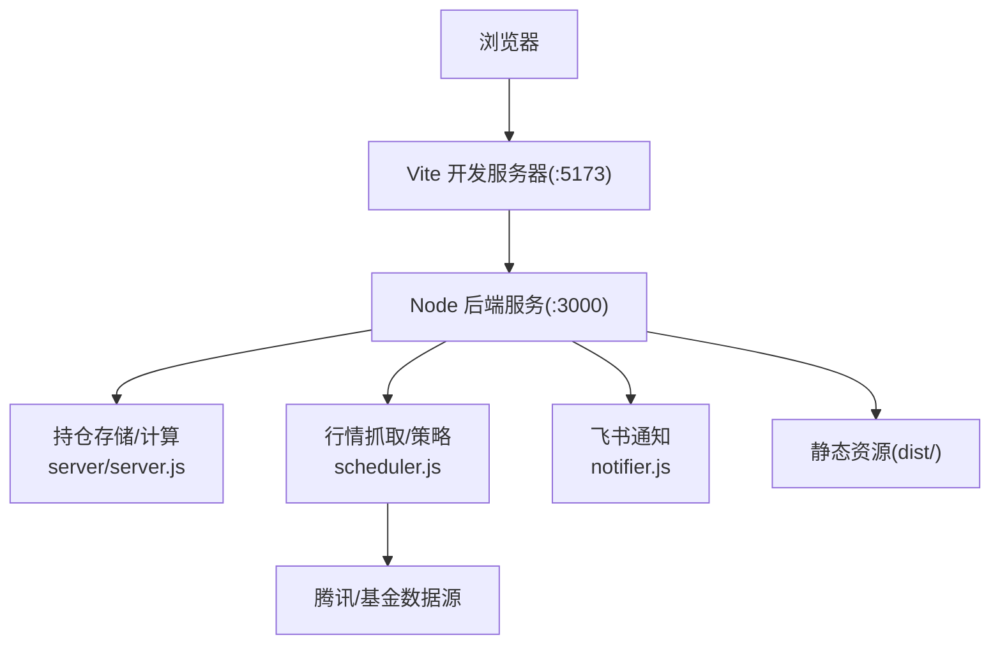
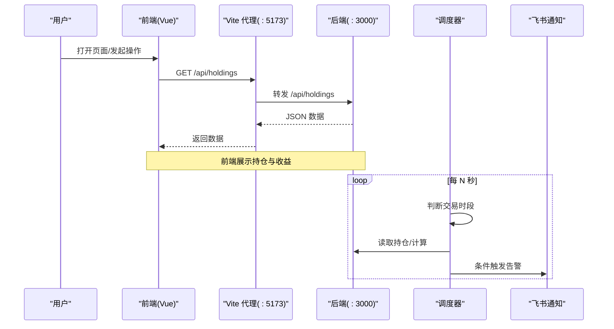
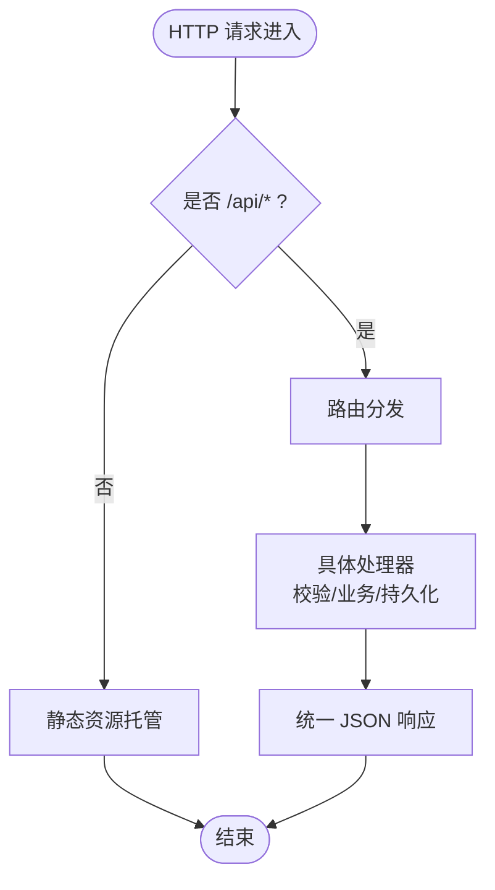
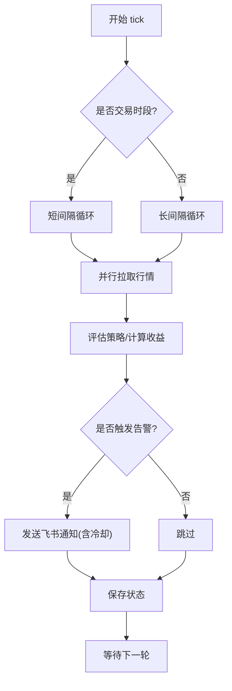
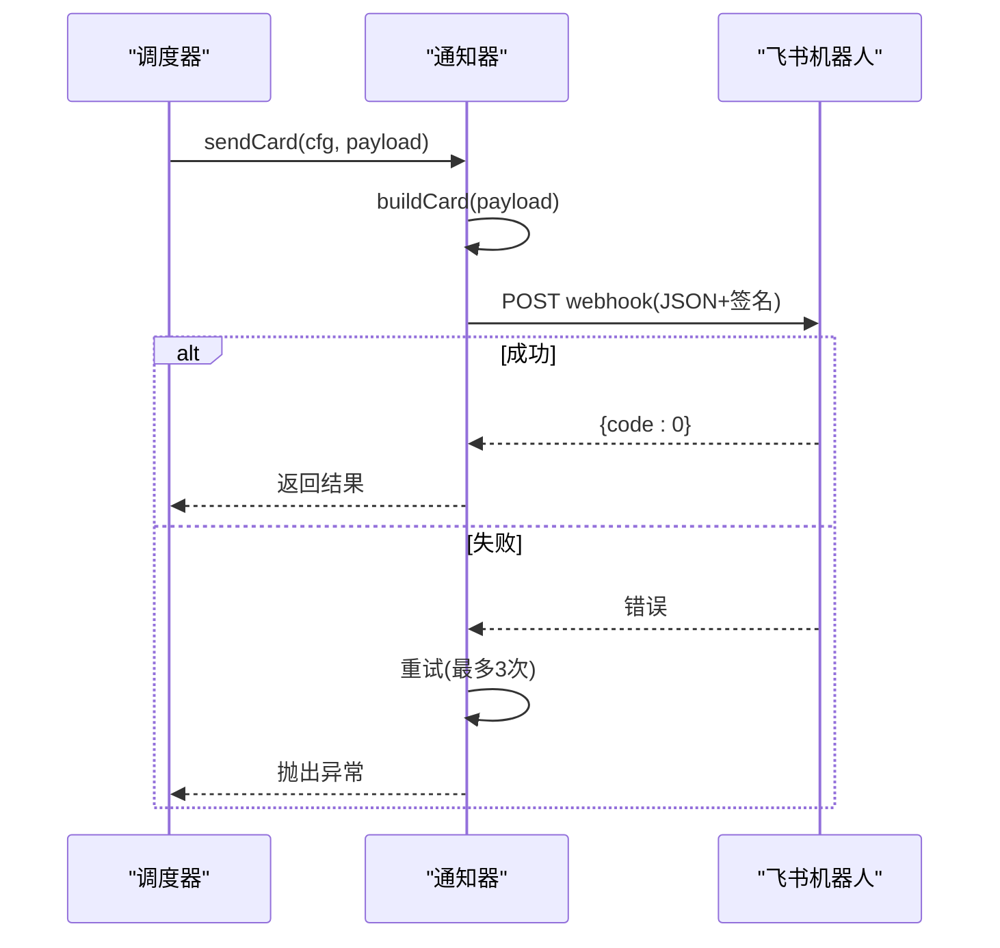
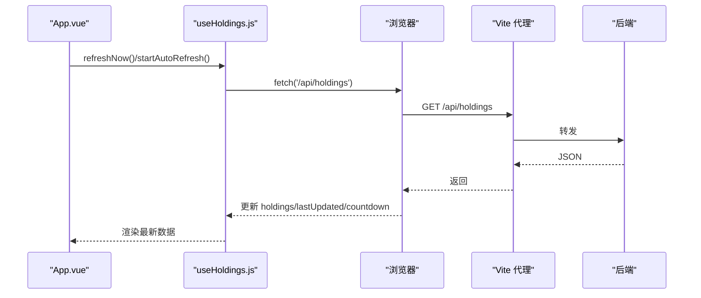
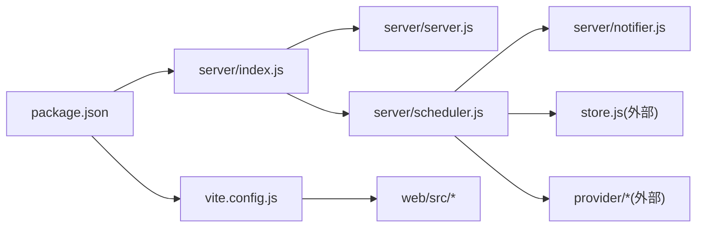

# 调试工具

<cite>
**本文引用的文件**
- [server/index.js](file://server/index.js)
- [server/server.js](file://server/server.js)
- [server/scheduler.js](file://server/scheduler.js)
- [server/notifier.js](file://server/notifier.js)
- [server/config.js](file://server/config.js)
- [web/src/main.js](file://web/src/main.js)
- [web/src/App.vue](file://web/src/App.vue)
- [web/src/composables/useHoldings.js](file://web/src/composables/useHoldings.js)
- [vite.config.js](file://vite.config.js)
- [package.json](file://package.json)
- [config.json](file://config.json)
- [start.sh](file://start.sh)
</cite>

## 目录
1. [简介](#简介)
2. [项目结构](#项目结构)
3. [核心组件](#核心组件)
4. [架构总览](#架构总览)
5. [详细组件分析](#详细组件分析)
6. [依赖关系分析](#依赖关系分析)
7. [性能与稳定性考量](#性能与稳定性考量)
8. [故障排查指南](#故障排查指南)
9. [结论](#结论)
10. [附录：常用调试命令与技巧](#附录：常用调试命令与技巧)

## 简介
本指南面向使用本项目的开发者，聚焦“如何高效调试”这一目标。内容覆盖：
- Node.js 内置调试器（断点、变量检查、调用栈）
- 浏览器开发者工具高级用法（网络面板、Vue DevTools、前端性能分析）
- API 测试（Postman、curl、自定义脚本）
- 日志调试技巧（级别控制、结构化输出、问题追踪）
- 生产环境调试要点（远程调试、日志收集、性能监控集成）

本项目由后端 Node.js HTTP 服务与前端 Vue3 + Vite 组成，后端提供 REST 接口并托管静态页面，同时运行行情抓取与策略调度任务；前端通过 Vite 开发服务器代理 /api 到后端。

## 项目结构
- 后端入口 server/index.js 加载配置、启动 Web 服务与定时任务
- 路由与业务逻辑集中在 server/server.js（REST 接口、静态资源托管）
- 定时任务在 server/scheduler.js（按市场交易时段降频刷新、触发告警）
- 飞书通知封装在 server/notifier.js
- 前端入口 web/src/main.js，主视图 web/src/App.vue，数据交互在 web/src/composables/useHoldings.js
- 开发时通过 vite.config.js 将 /api 代理到本地后端 :3000
- 启动脚本 start.sh 支持 dev/prod 两种模式

图表来源
- [vite.config.js:14-24](file://vite.config.js#L14-L24)
- [server/index.js:5-16](file://server/index.js#L5-L16)
- [server/server.js:567-593](file://server/server.js#L567-L593)
- [server/scheduler.js:65-177](file://server/scheduler.js#L65-L177)
- [server/notifier.js:81-111](file://server/notifier.js#L81-L111)

章节来源
- [server/index.js:1-16](file://server/index.js#L1-L16)
- [vite.config.js:1-26](file://vite.config.js#L1-L26)
- [package.json:7-14](file://package.json#L7-L14)

## 核心组件
- 后端服务：统一处理 /api/* 请求与静态资源托管，集中错误处理与 JSON 响应
- 调度器：根据市场交易时段选择刷新间隔，拉取行情、评估策略、发送告警
- 通知器：构造飞书卡片消息，带签名与重试机制
- 前端：Vue3 应用，自动轮询获取持仓与实时行情，提供操作弹窗与过滤

章节来源
- [server/server.js:55-87](file://server/server.js#L55-L87)
- [server/scheduler.js:58-177](file://server/scheduler.js#L58-L177)
- [server/notifier.js:4-111](file://server/notifier.js#L4-L111)
- [web/src/App.vue:15-46](file://web/src/App.vue#L15-L46)
- [web/src/composables/useHoldings.js:15-130](file://web/src/composables/useHoldings.js#L15-L130)

## 架构总览
后端以 Node 原生 http 模块提供服务，前端通过 Vite 开发服务器进行热更新，并通过代理转发 /api 请求到后端。调度器周期性执行行情拉取与策略评估，必要时通过飞书机器人推送告警。

图表来源
- [vite.config.js:18-23](file://vite.config.js#L18-L23)
- [server/server.js:571-586](file://server/server.js#L571-L586)
- [server/scheduler.js:65-177](file://server/scheduler.js#L65-L177)
- [server/notifier.js:81-111](file://server/notifier.js#L81-L111)

## 详细组件分析

### 后端服务与 API（server/server.js）
- 静态资源托管：优先精确匹配文件，不存在则回退到 index.html，适合 SPA
- 请求体解析：JSON 与原始文本两种读取方式，便于 CSV 导入等场景
- API 路由：
  - GET /api/holdings：返回带派生字段的持仓列表
  - POST /api/holdings：新建持仓
  - PATCH /api/holdings/:id：更新持仓级字段（如日涨跌告警阈值）
  - POST /api/holdings/:id/purchases：追加买入记录
  - PATCH /api/holdings/:id/purchases/:pid：修改买入记录
  - DELETE /api/holdings/:id/purchases/:pid：删除买入记录
  - POST /api/holdings/:id/transactions：兼容旧接口的买入/卖出
  - POST /api/import-csv：批量导入 CSV 买卖记录
  - POST /api/test-feishu：测试飞书推送
- 错误处理：统一 try/catch，返回 JSON 错误信息

图表来源
- [server/server.js:35-53](file://server/server.js#L35-L53)
- [server/server.js:55-87](file://server/server.js#L55-L87)
- [server/server.js:409-565](file://server/server.js#L409-L565)
- [server/server.js:567-593](file://server/server.js#L567-L593)

章节来源
- [server/server.js:35-593](file://server/server.js#L35-L593)

### 调度器（server/scheduler.js）
- 交易时段判断：基于市场时区与时间范围，区分交易与非交易时段
- 刷新间隔：交易时段短间隔，非交易时段长间隔
- 数据拉取：并行拉取股票与基金价格，失败降级为无数据
- 策略评估与告警：根据阈值触发 BUY/SELL/DAILY_RISE/DAILY_DROP，并写入冷却时间避免刷屏
- 状态同步：保存持仓状态与通知时间戳

图表来源
- [server/scheduler.js:32-63](file://server/scheduler.js#L32-L63)
- [server/scheduler.js:65-177](file://server/scheduler.js#L65-L177)

章节来源
- [server/scheduler.js:1-177](file://server/scheduler.js#L1-L177)

### 通知器（server/notifier.js）
- 卡片构建：根据触发类型生成不同模板的飞书卡片
- 安全签名：可选 secret 签名，附带 timestamp
- 重试机制：最多 3 次，指数退避式等待

图表来源
- [server/notifier.js:4-78](file://server/notifier.js#L4-L78)
- [server/notifier.js:81-111](file://server/notifier.js#L81-L111)

章节来源
- [server/notifier.js:1-112](file://server/notifier.js#L1-L112)

### 前端与数据流（web/src/App.vue, useHoldings.js）
- 自动刷新：单一定时器每秒递减倒计时，归零即刷新，避免多定时器漂移
- 数据获取：GET /api/holdings，成功后重置倒计时
- 写操作：新增持仓、交易、买入记录、删除记录、更新持仓级字段均通过 fetch 调用后端
- 错误提示：捕获网络或业务错误并显示

图表来源
- [web/src/App.vue:121-129](file://web/src/App.vue#L121-L129)
- [web/src/composables/useHoldings.js:15-43](file://web/src/composables/useHoldings.js#L15-L43)
- [vite.config.js:18-23](file://vite.config.js#L18-L23)

章节来源
- [web/src/App.vue:1-197](file://web/src/App.vue#L1-L197)
- [web/src/composables/useHoldings.js:1-154](file://web/src/composables/useHoldings.js#L1-L154)

## 依赖关系分析
- 后端入口依赖配置加载、调度器与服务启动
- 调度器依赖存储、行情提供者、策略评估与通知器
- 前端依赖 Vite 插件与 Vue3，开发时通过代理访问后端 API
- 配置文件集中管理端口、调度间隔、飞书 Webhook 与通知冷却

图表来源
- [package.json:7-14](file://package.json#L7-L14)
- [server/index.js:1-16](file://server/index.js#L1-L16)
- [vite.config.js:1-26](file://vite.config.js#L1-L26)

章节来源
- [package.json:1-32](file://package.json#L1-L32)
- [server/index.js:1-16](file://server/index.js#L1-L16)
- [vite.config.js:1-26](file://vite.config.js#L1-L26)

## 性能与稳定性考量
- 并发拉取：股票与基金价格并行获取，降低整体延迟
- 冷却机制：同一触发态在冷却窗口内不重复推送，避免刷屏
- 降级策略：行情拉取失败不影响其他流程，仅跳过对应品种
- 前端计时：单一定时器保证刷新节奏稳定，避免抖动

章节来源
- [server/scheduler.js:77-86](file://server/scheduler.js#L77-L86)
- [server/scheduler.js:135-141](file://server/scheduler.js#L135-L141)
- [web/src/composables/useHoldings.js:35-43](file://web/src/composables/useHoldings.js#L35-L43)

## 故障排查指南

### Node.js 内置调试器
- 启动调试：使用 node --inspect 启动后端进程，或在 IDE 中配置调试参数指向 server/index.js
- 设置断点：在关键路径打断点，例如：
  - server/server.js 的路由分发与错误处理区域
  - server/scheduler.js 的交易时段判断与行情拉取
  - server/notifier.js 的通知发送与重试逻辑
- 变量检查：在断点处查看请求体、配置对象、持仓数据与派生字段
- 调用栈分析：当出现错误时，查看堆栈定位到具体函数与行号

章节来源
- [server/server.js:571-586](file://server/server.js#L571-L586)
- [server/scheduler.js:65-177](file://server/scheduler.js#L65-L177)
- [server/notifier.js:81-111](file://server/notifier.js#L81-L111)

### 浏览器开发者工具
- 网络面板：观察 /api/holdings、/api/test-feishu 等请求的 URL、方法、状态码、请求体与响应体，快速定位前后端数据不一致问题
- Vue DevTools：检查 App.vue 与 useHoldings.js 中的响应式状态（holdings、loading、error、countdown），验证数据绑定与事件触发
- 性能面板：录制页面加载与刷新过程，识别重渲染瓶颈与不必要的计算

章节来源
- [web/src/App.vue:15-46](file://web/src/App.vue#L15-L46)
- [web/src/composables/useHoldings.js:15-43](file://web/src/composables/useHoldings.js#L15-L43)
- [vite.config.js:14-24](file://vite.config.js#L14-L24)

### API 测试工具
- Postman：
  - GET /api/holdings：验证数据结构与派生字段
  - POST /api/holdings：创建新持仓，检查必填字段与错误提示
  - POST /api/test-feishu：验证飞书机器人连通性与签名
- curl：
  - 示例：curl -X GET http://127.0.0.1:3000/api/holdings
  - 示例：curl -X POST -H "Content-Type: application/json" -d '{"name":"...","code":"...","region":"...","type":"..."}' http://127.0.0.1:3000/api/holdings
- 自定义脚本：
  - 使用 Node 的 fetch 或 axios 编写自动化测试用例，覆盖正常与异常分支
  - 对 /api/import-csv 进行批量导入测试，验证错误报告与数据落盘

章节来源
- [server/server.js:409-565](file://server/server.js#L409-L565)
- [web/src/App.vue:27-46](file://web/src/App.vue#L27-L46)

### 日志调试技巧
- 日志级别控制：
  - 开发环境：保留更多 console.log/warn/error，便于定位问题
  - 生产环境：减少冗余日志，仅保留关键错误与告警
- 结构化日志输出：
  - 在关键路径添加上下文信息（如品种代码、当前价、触发态）
  - 统一前缀标识（如 [server]、[notify-daily]、[stock-fetch]）
- 问题追踪方法：
  - 结合时间戳与唯一 ID（如 pid）关联一次请求或一次 tick 的所有日志
  - 对飞书通知失败与行情拉取失败增加重试与错误详情

章节来源
- [server/scheduler.js:77-86](file://server/scheduler.js#L77-L86)
- [server/scheduler.js:101-124](file://server/scheduler.js#L101-L124)
- [server/notifier.js:96-111](file://server/notifier.js#L96-L111)

### 生产环境调试特殊考虑
- 远程调试：
  - 使用 node --inspect=host:port 暴露调试端口，配合 IDE 远程连接
  - 注意防火墙与安全策略，限制可访问地址
- 日志收集：
  - 将 stdout/stderr 输出到日志系统（如容器日志、ELK）
  - 对关键错误进行告警聚合
- 性能监控集成：
  - 在调度器与 API 处理中加入耗时统计
  - 监控行情拉取成功率与延迟，设置阈值告警

章节来源
- [server/index.js:5-16](file://server/index.js#L5-L16)
- [server/scheduler.js:167-177](file://server/scheduler.js#L167-L177)
- [start.sh:48-99](file://start.sh#L48-L99)

## 结论
通过合理运用 Node.js 调试器、浏览器开发者工具、API 测试工具与日志技巧，可以高效定位前后端问题。结合项目的调度与通知机制，建议在生产环境启用结构化日志与性能监控，确保系统稳定与可观测性。

## 附录：常用调试命令与技巧
- 启动开发模式：bash start.sh dev（后端 :3000，前端 :5173，/api 自动代理）
- 启动生产模式：bash start.sh prod（构建 dist 后启动后端）
- 直接运行后端：npm start（node server/index.js）
- 调试后端：node --inspect server/index.js
- 测试飞书推送：POST /api/test-feishu（前端按钮或 Postman/curl）
- 查看网络请求：浏览器开发者工具 Network 面板
- 检查 Vue 状态：Vue DevTools 中查看响应式数据与事件

章节来源
- [package.json:7-14](file://package.json#L7-L14)
- [start.sh:48-99](file://start.sh#L48-L99)
- [vite.config.js:14-24](file://vite.config.js#L14-L24)
- [web/src/App.vue:27-46](file://web/src/App.vue#L27-L46)