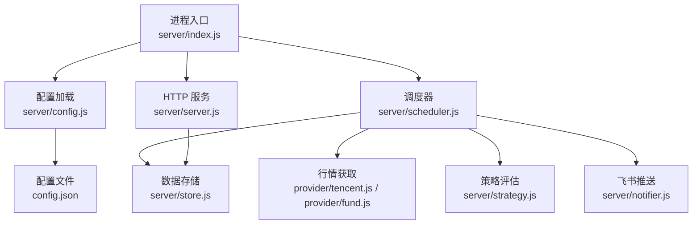
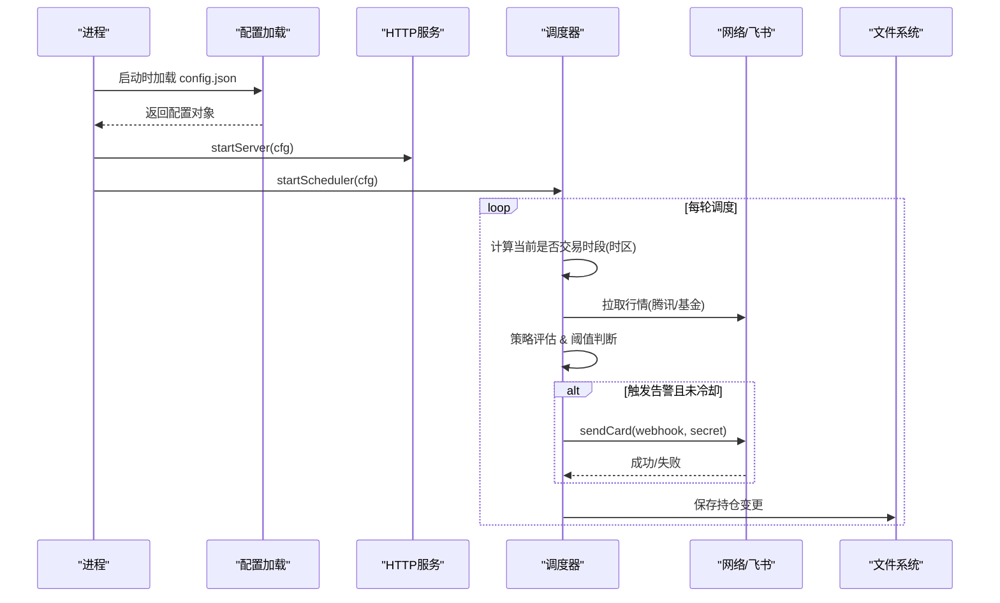
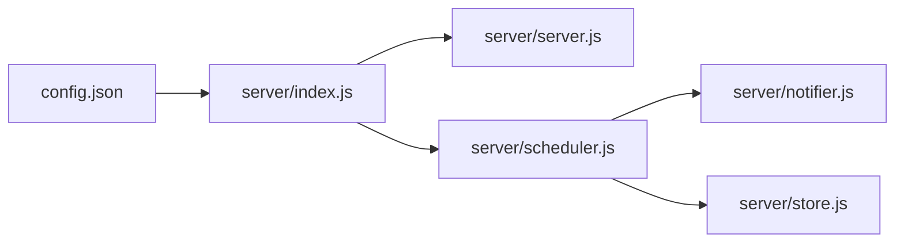

# 配置错误

<cite>
**本文引用的文件**
- [config.json](file://config.json)
- [server/config.js](file://server/config.js)
- [server/index.js](file://server/index.js)
- [server/server.js](file://server/server.js)
- [server/notifier.js](file://server/notifier.js)
- [server/scheduler.js](file://server/scheduler.js)
- [server/store.js](file://server/store.js)
- [start.sh](file://start.sh)
- [package.json](file://package.json)
</cite>

## 目录
1. [简介](#简介)
2. [项目结构](#项目结构)
3. [核心组件](#核心组件)
4. [架构总览](#架构总览)
5. [详细组件分析](#详细组件分析)
6. [依赖关系分析](#依赖关系分析)
7. [性能与稳定性考量](#性能与稳定性考量)
8. [故障排查指南](#故障排查指南)
9. [结论](#结论)
10. [附录：配置校验清单与热重载建议](#附录：配置校验清单与热重载建议)

## 简介
本指南聚焦于“配置错误”的诊断与修复，覆盖以下方面：
- config.json 的 JSON 格式验证方法（语法、字段类型、必填项）
- 环境变量配置错误的识别（如 ONCE 模式、飞书 Webhook/Secret、通知阈值等）
- 权限相关配置问题（文件读写、网络访问、第三方服务认证）
- 配置热重载机制的使用方法与配置验证工具建议
- 常见配置错误示例与解决方案（时区、调度间隔、阈值不合理等）

## 项目结构
本项目采用 Node.js 后端 + Vue 前端。后端通过 server/index.js 启动，加载根目录的 config.json，并分别启动 HTTP 服务与行情调度器；调度器根据持仓市场判断交易时段，按 schedule.intervalSeconds/offHoursIntervalSeconds 循环拉取行情并评估策略，必要时通过 notifier 推送飞书消息。数据持久化在 data/holdings.json。

图表来源
- [server/index.js:1-17](file://server/index.js#L1-L17)
- [server/config.js:7-10](file://server/config.js#L7-L10)
- [server/server.js:567-593](file://server/server.js#L567-L593)
- [server/scheduler.js:167-178](file://server/scheduler.js#L167-L178)
- [server/notifier.js:81-111](file://server/notifier.js#L81-L111)
- [server/store.js:40-69](file://server/store.js#L40-L69)

章节来源
- [server/index.js:1-17](file://server/index.js#L1-L17)
- [server/config.js:7-10](file://server/config.js#L7-L10)
- [server/server.js:567-593](file://server/server.js#L567-L593)
- [server/scheduler.js:167-178](file://server/scheduler.js#L167-L178)
- [server/notifier.js:81-111](file://server/notifier.js#L81-L111)
- [server/store.js:40-69](file://server/store.js#L40-L69)

## 核心组件
- 配置加载：从根目录读取 config.json 并解析为对象，供后续模块使用。
- 服务器：提供静态页面托管与 REST API，端口和主机来自 cfg.server。
- 调度器：基于 cfg.schedule.intervalSeconds/offHoursIntervalSeconds 定时执行一次任务，结合持仓市场时区判断交易时段。
- 通知器：构造飞书卡片并通过 webhook 发送，支持 secret 签名。
- 存储：以 data/holdings.json 持久化持仓，带内存缓存与写锁。

章节来源
- [server/config.js:7-10](file://server/config.js#L7-L10)
- [server/server.js:567-593](file://server/server.js#L567-L593)
- [server/scheduler.js:58-63](file://server/scheduler.js#L58-L63)
- [server/notifier.js:81-111](file://server/notifier.js#L81-L111)
- [server/store.js:40-69](file://server/store.js#L40-L69)

## 架构总览
下图展示了配置在系统中的流转路径及关键校验点：

图表来源
- [server/index.js:1-17](file://server/index.js#L1-L17)
- [server/scheduler.js:58-63](file://server/scheduler.js#L58-L63)
- [server/notifier.js:81-111](file://server/notifier.js#L81-L111)
- [server/store.js:40-69](file://server/store.js#L40-L69)

## 详细组件分析

### 配置加载与 JSON 验证
- 加载位置：server/config.js 中 loadConfig() 读取根目录 config.json 并 JSON.parse。
- 典型错误：
  - JSON 语法错误（缺少逗号、引号不匹配、尾随逗号等）会导致启动即抛错。
  - 字段缺失或类型不符会在运行时引发逻辑异常（例如 schedule.intervalSeconds 非数字导致间隔计算异常）。
- 建议验证步骤：
  - 使用任意 JSON 校验工具对 config.json 进行语法检查。
  - 逐项核对字段类型与必填性（见附录清单）。
  - 修改后重启服务观察日志。

章节来源
- [server/config.js:7-10](file://server/config.js#L7-L10)
- [config.json:1-19](file://config.json#L1-L19)

### 服务器配置（host/port）
- 行为：server/server.js 中 startServer(cfg) 使用 cfg.server.host 与 cfg.server.port 启动 HTTP 服务。
- 常见问题：
  - port 被占用导致启动失败。
  - host 绑定到 0.0.0.0 时需注意防火墙/安全组放行。
- 诊断要点：
  - 查看启动日志中的监听地址与端口。
  - 若无法访问，检查系统防火墙与容器端口映射。

章节来源
- [server/server.js:567-593](file://server/server.js#L567-L593)

### 调度器与间隔配置
- 行为：scheduler.js 根据持仓的市场时区判断是否处于交易时段，选择 cfg.schedule.intervalSeconds（交易时段）或 offHoursIntervalSeconds（非交易时段）作为下一次执行间隔。
- 常见问题：
  - intervalSeconds 过小导致频繁请求外部接口，可能触发限流或被拒绝。
  - offHoursIntervalSeconds 过大导致非交易时段长时间无更新。
- 诊断要点：
  - 观察控制台输出中的刷新间隔与模式（交易时段/非交易时段降频）。
  - 调整间隔前确认外部接口限制与服务资源。

章节来源
- [server/scheduler.js:58-63](file://server/scheduler.js#L58-L63)
- [server/scheduler.js:167-178](file://server/scheduler.js#L167-L178)

### 时区与交易时段判断
- 行为：scheduler.js 内置 REGION_TZ 映射（hk/sh/sz/us），使用 Intl.DateTimeFormat 在对应时区下判断周几与时段。
- 常见问题：
  - 服务器系统时区设置不正确可能导致交易时段误判。
  - 某些云环境默认 UTC，需确保运行环境时区正确或使用显式时区。
- 诊断要点：
  - 检查运行环境的时区设置。
  - 观察调度日志中“交易时段/非交易时段”切换是否符合预期。

章节来源
- [server/scheduler.js:7-47](file://server/scheduler.js#L7-L47)

### 飞书机器人通知配置
- 行为：notifier.js 使用 cfg.feishu.webhook 与可选 secret 构造卡片消息并 POST 到飞书自定义机器人。支持重试最多 3 次。
- 常见问题：
  - webhook 地址错误或失效导致推送失败。
  - secret 未配置或签名不匹配导致鉴权失败。
  - 网络不可达或域名解析失败。
- 诊断要点：
  - 使用 /api/test-feishu 接口测试推送。
  - 检查日志中的错误信息（包含飞书返回码与消息体）。
  - 确认网络安全策略允许出站 HTTPS 访问 open.feishu.cn。

章节来源
- [server/notifier.js:81-111](file://server/notifier.js#L81-L111)
- [server/server.js:545-562](file://server/server.js#L545-L562)

### 通知阈值与冷却
- 行为：scheduler.js 使用 cfg.notify.nearThresholdPct 参与策略评估；cfg.notify.cooldownSeconds 控制同一触发态的冷却时间，避免刷屏。
- 常见问题：
  - nearThresholdPct 设置过宽导致频繁触发。
  - cooldownSeconds 过小导致短时间内重复通知。
- 诊断要点：
  - 观察日志中触发态与 notifiedAt 的变化。
  - 根据业务需求调优阈值与冷却时间。

章节来源
- [server/scheduler.js:126-141](file://server/scheduler.js#L126-L141)

### 数据存储与权限
- 行为：store.js 将持仓数据持久化到 data/holdings.json，并在内存中缓存，写操作串行化以避免并发冲突。
- 常见问题：
  - data 目录或 holdings.json 无写入权限导致保存失败。
  - 磁盘空间不足导致写入失败。
- 诊断要点：
  - 检查应用运行用户对 data 目录的读写权限。
  - 关注 store 层错误日志。

章节来源
- [server/store.js:40-69](file://server/store.js#L40-L69)

### 环境变量与启动脚本
- 行为：index.js 通过 process.env.ONCE 控制是否仅执行一次行情抓取并退出；start.sh 负责安装依赖、构建前端与启动服务。
- 常见问题：
  - 忘记设置 ONCE 导致期望的一次性任务未执行。
  - 开发/生产模式混用导致端口或代理不一致。
- 诊断要点：
  - 确认启动参数与环境变量。
  - 使用 start.sh 的不同模式进行验证。

章节来源
- [server/index.js:1-17](file://server/index.js#L1-L17)
- [start.sh:25-99](file://start.sh#L25-L99)
- [package.json:7-16](file://package.json#L7-L16)

## 依赖关系分析
- 配置依赖：config.json 是全局配置中心，被 server/index.js 加载后注入到 server 与 scheduler。
- 运行时依赖：
  - 网络：scheduler 调用外部行情接口；notifier 调用飞书 webhook。
  - 文件系统：store 读写 data/holdings.json。
- 耦合点：
  - scheduler 同时依赖 notifier 与 store，任何一方的失败不应阻塞整体循环（代码中已做 try/catch 与降级处理）。

图表来源
- [server/index.js:1-17](file://server/index.js#L1-L17)
- [server/scheduler.js:1-5](file://server/scheduler.js#L1-L5)
- [server/notifier.js:1-2](file://server/notifier.js#L1-L2)
- [server/store.js:1-6](file://server/store.js#L1-L6)

## 性能与稳定性考量
- 合理设置 schedule.intervalSeconds：避免过于频繁的请求造成外部限流或服务端压力。
- 合理使用 cooldownSeconds：降低通知风暴风险。
- 时区正确性：确保交易时段判断准确，减少无效请求。
- 存储写锁：store.js 已实现串行写盘，避免并发写冲突。

[本节为通用指导，无需特定文件引用]

## 故障排查指南

### 1) config.json 语法错误
- 现象：启动即报错，无法进入服务。
- 定位：server/config.js 中 JSON.parse 抛出异常。
- 解决：使用 JSON 校验工具检查语法，修正后重启。

章节来源
- [server/config.js:7-10](file://server/config.js#L7-L10)

### 2) 字段类型错误
- 现象：运行时出现 NaN、undefined 或逻辑异常。
- 定位：scheduler 使用 cfg.schedule.* 作为数值；server 使用 cfg.server.* 作为字符串/数字。
- 解决：确保 schedule.intervalSeconds/offHoursIntervalSeconds 为数字；server.host 为字符串；server.port 为数字。

章节来源
- [server/scheduler.js:58-63](file://server/scheduler.js#L58-L63)
- [server/server.js:567-593](file://server/server.js#L567-L593)

### 3) 必填项缺失
- 现象：功能异常（如无法推送通知、无法监听端口）。
- 定位：cfg.feishu.webhook/secret 缺失导致通知失败；cfg.server 缺失导致默认值生效但可能与预期不符。
- 解决：补齐必填字段，参考附录清单逐项核对。

章节来源
- [config.json:1-19](file://config.json#L1-L19)
- [server/notifier.js:81-111](file://server/notifier.js#L81-L111)
- [server/server.js:567-593](file://server/server.js#L567-L593)

### 4) 飞书 Webhook/Secret 配置错误
- 现象：/api/test-feishu 返回 502 或错误信息包含飞书返回码。
- 定位：notifier.js 中 fetch 调用失败或 code !== 0。
- 解决：
  - 校验 webhook URL 是否正确。
  - 若启用 secret，确保签名一致。
  - 检查网络可达性与域名解析。

章节来源
- [server/notifier.js:81-111](file://server/notifier.js#L81-L111)
- [server/server.js:545-562](file://server/server.js#L545-L562)

### 5) 通知阈值设置不当
- 现象：通知过多或过少。
- 定位：scheduler.js 中 nearThresholdPct 与 cooldownSeconds 影响触发频率。
- 解决：适当增大 nearThresholdPct 或 cooldownSeconds，观察日志变化。

章节来源
- [server/scheduler.js:126-141](file://server/scheduler.js#L126-L141)

### 6) 时区设置错误
- 现象：交易时段判断不准确，导致在非交易时段仍高频刷新或交易时段不刷新。
- 定位：scheduler.js 使用 Intl.DateTimeFormat 指定时区，受运行环境时区影响。
- 解决：校正系统时区或容器时区，确保 Asia/Shanghai、Asia/Hong_Kong、America/New_York 等与实际市场一致。

章节来源
- [server/scheduler.js:7-47](file://server/scheduler.js#L7-L47)

### 7) 文件读写权限问题
- 现象：保存持仓失败或无法启动导入。
- 定位：store.js 写入 data/holdings.json 失败。
- 解决：授予运行用户对 data 目录的读写权限，检查磁盘空间。

章节来源
- [server/store.js:40-69](file://server/store.js#L40-L69)

### 8) 环境变量配置错误
- 现象：一次性任务未按预期执行或重复执行。
- 定位：server/index.js 通过 process.env.ONCE 控制流程。
- 解决：按需设置 ONCE=1 或移除该变量，确认启动日志。

章节来源
- [server/index.js:1-17](file://server/index.js#L1-L17)

### 9) 启动脚本问题
- 现象：依赖未安装、前端未构建、端口冲突。
- 定位：start.sh 负责安装依赖、构建与启动。
- 解决：重新执行 start.sh，检查输出日志与端口占用情况。

章节来源
- [start.sh:25-99](file://start.sh#L25-L99)

## 结论
- 配置错误通常集中在 JSON 语法、字段类型与必填项、网络与权限三个方面。
- 通过逐步定位（配置加载 → 服务器 → 调度器 → 通知器 → 存储）可快速缩小问题范围。
- 建议在生产环境中引入配置校验与热重载能力，提升可维护性与可用性。

[本节为总结性内容，无需特定文件引用]

## 附录：配置校验清单与热重载建议

### config.json 字段校验清单
- schedule
  - intervalSeconds：必须为数字，建议 > 0。
  - offHoursIntervalSeconds：必须为数字，建议 > 0。
- server
  - host：必须为字符串，常用 0.0.0.0 或 127.0.0.1。
  - port：必须为数字，建议 > 0 且未被占用。
- feishu
  - webhook：必须为字符串，且为有效的飞书机器人 Webhook URL。
  - secret：可选字符串；若启用，需与飞书机器人设置一致。
- notify
  - cooldownSeconds：必须为数字，建议 > 0。
  - nearThresholdPct：必须为数字，建议 >= 0。

章节来源
- [config.json:1-19](file://config.json#L1-L19)
- [server/server.js:567-593](file://server/server.js#L567-L593)
- [server/scheduler.js:58-63](file://server/scheduler.js#L58-L63)
- [server/notifier.js:81-111](file://server/notifier.js#L81-L111)

### 环境变量说明
- ONCE：设置为真值时，启动后仅执行一次行情抓取并退出，便于调试或一次性任务。

章节来源
- [server/index.js:1-17](file://server/index.js#L1-L17)

### 热重载机制建议
- 现状：当前配置在进程启动时加载一次，未实现运行时热重载。
- 建议方案：
  - 在 server/index.js 中增加定时器或文件监听，检测 config.json 变更并重新加载配置。
  - 对关键配置（如 schedule、notify、feishu）变更时，平滑应用到正在运行的调度器与通知器。
  - 为避免频繁重连，加入最小变更间隔与幂等更新逻辑。
- 验证方式：
  - 修改 config.json 后观察调度间隔与通知行为是否按新配置生效。
  - 记录配置变更日志以便审计。

[本节为概念性建议，无需特定文件引用]