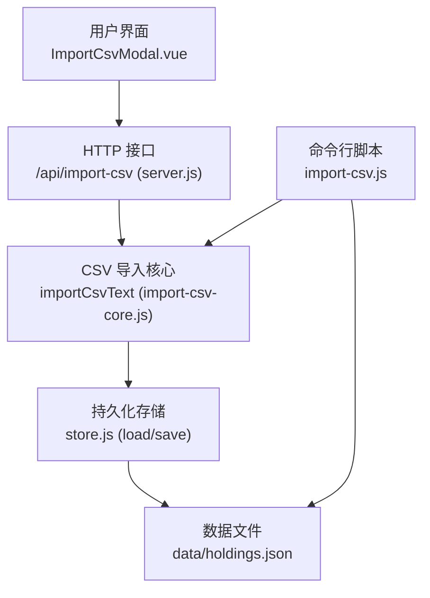
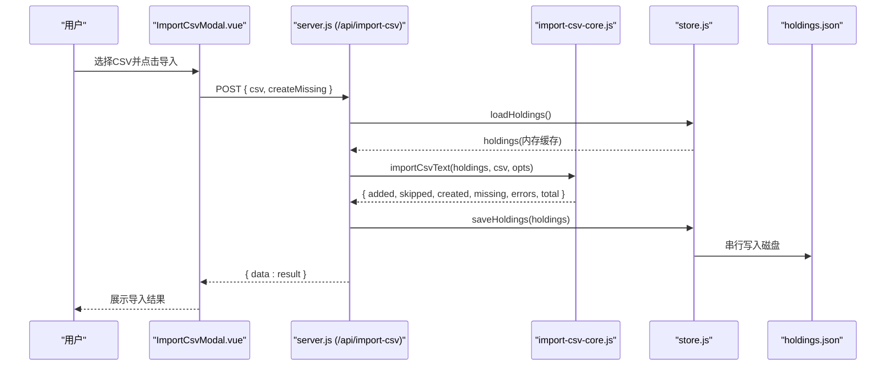
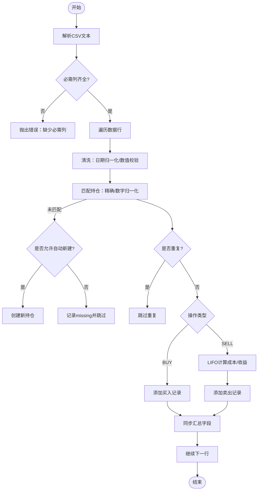
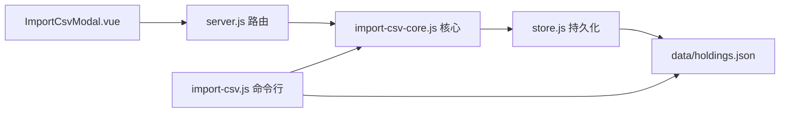

# 导入导出功能

<cite>
**本文引用的文件**
- [server/import-csv-core.js](file://server/import-csv-core.js)
- [server/import-csv.js](file://server/import-csv.js)
- [server/server.js](file://server/server.js)
- [web/src/components/ImportCsvModal.vue](file://web/src/components/ImportCsvModal.vue)
- [data/买入-卖出记录 - Sheet1.csv](file://data/买入-卖出记录 - Sheet1.csv)
- [data/holdings.json](file://data/holdings.json)
- [server/store.js](file://server/store.js)
</cite>

## 目录
1. [简介](#简介)
2. [项目结构](#项目结构)
3. [核心组件](#核心组件)
4. [架构总览](#架构总览)
5. [详细组件分析](#详细组件分析)
6. [依赖关系分析](#依赖关系分析)
7. [性能与并发特性](#性能与并发特性)
8. [故障排查指南](#故障排查指南)
9. [结论](#结论)
10. [附录：CSV模板与配置](#附录csv模板与配置)

## 简介
本章节面向Stock Advisor的“导入导出”能力，重点说明：
- CSV文件格式规范（必填/可选字段、数据格式）
- 批量导入流程（解析→验证→匹配→幂等插入→汇总）
- 数据清洗与转换（日期归一化、数值解析、错误处理）
- 导入过程中的错误处理（重复检测、完整性校验、回滚策略）
- 导出能力现状与建议（当前实现为导入为主，导出可基于现有接口扩展）
- 使用示例、配置选项与常见问题

## 项目结构
与导入导出相关的代码主要分布在以下位置：
- 服务端核心逻辑：import-csv-core.js（CSV解析、匹配、幂等、计算）、import-csv.js（命令行一键导入）、server.js（HTTP路由与持久化）、store.js（内存缓存与串行写盘）
- Web前端：ImportCsvModal.vue（选择CSV、提交导入、展示结果）
- 数据文件：data/买入-卖出记录 - Sheet1.csv（示例CSV）、data/holdings.json（持仓数据）

图表来源
- [server/server.js:416-435](file://server/server.js#L416-L435)
- [server/import-csv-core.js:170-306](file://server/import-csv-core.js#L170-L306)
- [server/import-csv.js:37-79](file://server/import-csv.js#L37-L79)
- [server/store.js:40-70](file://server/store.js#L40-L70)

章节来源
- [server/import-csv-core.js:1-306](file://server/import-csv-core.js#L1-L306)
- [server/import-csv.js:1-87](file://server/import-csv.js#L1-L87)
- [server/server.js:409-435](file://server/server.js#L409-L435)
- [web/src/components/ImportCsvModal.vue:1-169](file://web/src/components/ImportCsvModal.vue#L1-L169)
- [server/store.js:1-71](file://server/store.js#L1-L71)

## 核心组件
- CSV解析与清洗：支持BOM、引号包裹、逗号分隔；自动去除空行；日期归一化为YYYY-MM-DD；数字列强制为正数。
- 匹配规则：精确匹配代码；若失败则提取数字进行兜底匹配（如 hk00700 → 700）。
- 幂等性：以(code, 操作, 日期, 数量, 价格)为唯一键，已存在则跳过。
- 自动新建持仓：当createMissing为true且未匹配到时，按名称/代码/地区/类型创建新持仓。
- 成本与收益计算：卖出采用LIFO（后进先出）计算成本价、利润与收益率；同步更新持仓汇总字段。
- 持久化：通过store.js进行内存缓存与串行写盘，避免并发覆盖。

章节来源
- [server/import-csv-core.js:7-36](file://server/import-csv-core.js#L7-L36)
- [server/import-csv-core.js:212-239](file://server/import-csv-core.js#L212-L239)
- [server/import-csv-core.js:249-303](file://server/import-csv-core.js#L249-L303)
- [server/store.js:40-70](file://server/store.js#L40-L70)

## 架构总览
从Web或命令行发起导入请求，最终由核心模块完成解析、验证、匹配与写入。

图表来源
- [web/src/components/ImportCsvModal.vue:49-73](file://web/src/components/ImportCsvModal.vue#L49-L73)
- [server/server.js:416-435](file://server/server.js#L416-L435)
- [server/import-csv-core.js:170-306](file://server/import-csv-core.js#L170-L306)
- [server/store.js:40-70](file://server/store.js#L40-L70)

## 详细组件分析

### CSV文件格式规范
- 表头要求：必须包含以下列名之一（大小写不敏感，允许别名）：
  - 代码：['代码']
  - 操作：['操作']（支持“买入”“卖出”，内部映射为BUY/SELL）
  - 日期：['买入日期' | '卖出日期' | '日期']
  - 数量：['买入数量' | '卖出数量' | '数量']
  - 价格：['买入价' | '卖出价' | '价格']
- 可选列：序号、股票/基金名称/名称、地区、类型（用于自动新建持仓时填充）
- 数据格式：
  - 日期：支持YYYY-MM/DD.MM等常见格式，会被归一化为YYYY-MM-DD
  - 数量/价格：必须为正数，否则该行被跳过
  - 编码：支持UTF-8含BOM
- 示例参考：data/买入-卖出记录 - Sheet1.csv

章节来源
- [server/import-csv-core.js:175-188](file://server/import-csv-core.js#L175-L188)
- [server/import-csv-core.js:190-210](file://server/import-csv-core.js#L190-L210)
- [data/买入-卖出记录 - Sheet1.csv:1-16](file://data/买入-卖出记录 - Sheet1.csv#L1-L16)

### 批量导入处理流程
- 解析：parseCsvText将文本转为二维数组，过滤空行，处理引号与BOM
- 校验：检查必需列是否存在；逐行校验日期/数量/价格合法性
- 匹配：建立代码到持仓的映射（精确+数字归一化），定位目标持仓
- 幂等：以(code, 操作, 日期, 数量, 价格)去重，已存在则跳过
- 插入：
  - 买入：生成购买记录，带时间戳与止盈止损比例继承
  - 卖出：按LIFO计算成本价、利润、收益率，写入卖出记录
- 汇总：syncFromPurchases更新持仓的成本、数量、均价、状态等
- 持久化：saveHoldings串行写盘

图表来源
- [server/import-csv-core.js:170-306](file://server/import-csv-core.js#L170-L306)

章节来源
- [server/import-csv-core.js:7-36](file://server/import-csv-core.js#L7-L36)
- [server/import-csv-core.js:170-306](file://server/import-csv-core.js#L170-L306)

### 数据清洗与转换逻辑
- 日期格式化：normalizeDate将多种日期格式统一为YYYY-MM-DD，保证幂等比较一致
- 数值解析：数量与价格必须为正数，否则该行被忽略
- 错误数据处理：非法行直接跳过；结构性错误（如缺失必需列）抛出异常；业务错误（如卖出超仓）记录到errors并继续处理其他行

章节来源
- [server/import-csv-core.js:30-36](file://server/import-csv-core.js#L30-L36)
- [server/import-csv-core.js:190-210](file://server/import-csv-core.js#L190-L210)
- [server/import-csv-core.js:273-303](file://server/import-csv-core.js#L273-L303)

### 导入过程中的错误处理机制
- 重复记录检测：existingKey以(code, 操作, 日期, 数量, 价格)为键，浮点误差容忍度1e-9
- 数据完整性验证：必需列校验；数量/价格为正数；卖出时校验不超过持仓数量
- 回滚策略：
  - 单条记录级try/catch捕获错误，记录到errors并继续处理后续行
  - 整体事务：HTTP接口在成功解析后调用saveHoldings一次性写盘；若解析阶段抛错，不会修改数据
  - 命令行模式：在全部解析完成后写盘，便于查看完整结果后再落盘

章节来源
- [server/import-csv-core.js:226-239](file://server/import-csv-core.js#L226-L239)
- [server/import-csv-core.js:273-303](file://server/import-csv-core.js#L273-L303)
- [server/server.js:416-435](file://server/server.js#L416-L435)
- [server/import-csv.js:47-52](file://server/import-csv.js#L47-L52)

### 导出功能的实现现状与建议
- 当前仓库未提供独立的“导出持仓为CSV”的后端接口或前端按钮
- 建议方案：
  - 后端新增GET /api/export-csv，读取holdings.json，将purchases/sells展开为标准CSV并返回下载
  - 前端增加“导出CSV”按钮，调用该接口并触发浏览器下载
  - 输出字段建议：序号、名称、代码、地区、类型、操作、日期、数量、价格、成本价、利润、收益率等
- 由于当前无具体实现，本节为概念性建议，不附源码引用

[本节为概念性说明，不涉及具体文件]

## 依赖关系分析
- ImportCsvModal.vue依赖useHoldings获取数据刷新，并通过fetch调用/api/import-csv
- server.js负责路由分发，调用importCsvText并持久化
- import-csv-core.js提供纯函数式导入逻辑，可被命令行与HTTP复用
- store.js提供内存缓存与串行写盘，避免并发冲突

图表来源
- [web/src/components/ImportCsvModal.vue:49-73](file://web/src/components/ImportCsvModal.vue#L49-L73)
- [server/server.js:416-435](file://server/server.js#L416-L435)
- [server/import-csv-core.js:170-306](file://server/import-csv-core.js#L170-L306)
- [server/import-csv.js:37-79](file://server/import-csv.js#L37-L79)
- [server/store.js:40-70](file://server/store.js#L40-L70)

章节来源
- [web/src/components/ImportCsvModal.vue:1-169](file://web/src/components/ImportCsvModal.vue#L1-L169)
- [server/server.js:409-435](file://server/server.js#L409-L435)
- [server/import-csv-core.js:170-306](file://server/import-csv-core.js#L170-L306)
- [server/import-csv.js:1-87](file://server/import-csv.js#L1-L87)
- [server/store.js:1-71](file://server/store.js#L1-L71)

## 性能与并发特性
- 内存缓存：store.js维护内存中的holdings列表，仅在首次加载或外部文件变更时重新读盘，减少IO开销
- 串行写盘：writeChain确保多次保存顺序执行，避免并发覆盖导致的数据不一致
- 幂等导入：通过唯一键去重，避免重复插入带来的冗余计算
- LIFO成本计算：对卖出记录按时间倒序匹配，复杂度O(n)，n为买入记录数，通常较小

章节来源
- [server/store.js:8-12](file://server/store.js#L8-L12)
- [server/store.js:40-70](file://server/store.js#L40-L70)
- [server/import-csv-core.js:60-80](file://server/import-csv-core.js#L60-L80)

## 故障排查指南
- 表头缺失：若CSV缺少必需列，会抛出错误并提示当前表头
  - 解决：确保包含“代码/操作/日期/数量/价格”任一别名列
- 数据行被跳过：数量为0或负数、价格为非正数、日期无法识别的行将被忽略
  - 解决：检查原始数据，确保数值为正、日期格式正确
- 匹配不到持仓：当未启用自动新建时，相关记录进入missing列表
  - 解决：勾选“自动新建持仓”或在holdings中预先创建对应持仓
- 卖出超仓：卖出数量超过可用持仓时，记录错误并继续处理其他行
  - 解决：核对买入与卖出数量，确保不超卖
- 重复导入：相同明细会被跳过
  - 解决：确认是否需要增量导入，或清理历史数据后重试

章节来源
- [server/import-csv-core.js:175-188](file://server/import-csv-core.js#L175-L188)
- [server/import-csv-core.js:190-210](file://server/import-csv-core.js#L190-L210)
- [server/import-csv-core.js:226-239](file://server/import-csv-core.js#L226-L239)
- [server/import-csv-core.js:273-303](file://server/import-csv-core.js#L273-L303)

## 结论
- 导入功能具备完善的解析、清洗、匹配、幂等与错误处理能力，适合批量管理交易记录
- 通过命令行与HTTP两种方式复用同一核心逻辑，便于自动化与集成
- 当前未提供导出CSV的独立实现，可按建议在后端新增导出接口并在前端提供下载入口
- 建议在导入前准备标准CSV模板，并确保数据质量，以获得最佳导入体验

[本节为总结性内容，不涉及具体文件]

## 附录：CSV模板与配置

### CSV模板字段说明
- 必填列（至少包含其一）：
  - 代码：['代码']
  - 操作：['操作']（支持“买入”“卖出”）
  - 日期：['买入日期' | '卖出日期' | '日期']
  - 数量：['买入数量' | '卖出数量' | '数量']
  - 价格：['买入价' | '卖出价' | '价格']
- 可选列：
  - 序号、股票/基金名称/名称、地区、类型（用于自动新建持仓）

章节来源
- [server/import-csv-core.js:175-188](file://server/import-csv-core.js#L175-L188)
- [data/买入-卖出记录 - Sheet1.csv:1-16](file://data/买入-卖出记录 - Sheet1.csv#L1-L16)

### 导入配置选项
- createMissing：布尔值，控制是否在匹配不到时自动新建持仓
  - HTTP方式：POST /api/import-csv 的body中包含createMissing字段
  - 命令行方式：node server/import-csv.js --create-missing
- 默认CSV路径：优先使用data/买入-卖出记录 - Sheet1.csv，不存在则扫描data目录下首个非holdings的CSV

章节来源
- [web/src/components/ImportCsvModal.vue:57-66](file://web/src/components/ImportCsvModal.vue#L57-L66)
- [server/import-csv.js:24-35](file://server/import-csv.js#L24-L35)
- [server/import-csv.js:37-49](file://server/import-csv.js#L37-L49)

### 常见问题解决方案
- 为什么部分行没有导入？
  - 检查是否满足“数量/价格为正”“日期有效”“必需列存在”
- 为什么出现“匹配不到持仓”？
  - 未启用自动新建或代码确实不存在于holdings中
- 如何避免重复导入？
  - 系统已做幂等处理，重复明细会被跳过
- 如何导出数据？
  - 当前版本未提供导出CSV接口，可考虑手动复制holdings.json或通过后端新增导出接口

章节来源
- [server/import-csv-core.js:190-210](file://server/import-csv-core.js#L190-L210)
- [server/import-csv-core.js:226-239](file://server/import-csv-core.js#L226-L239)
- [server/server.js:416-435](file://server/server.js#L416-L435)