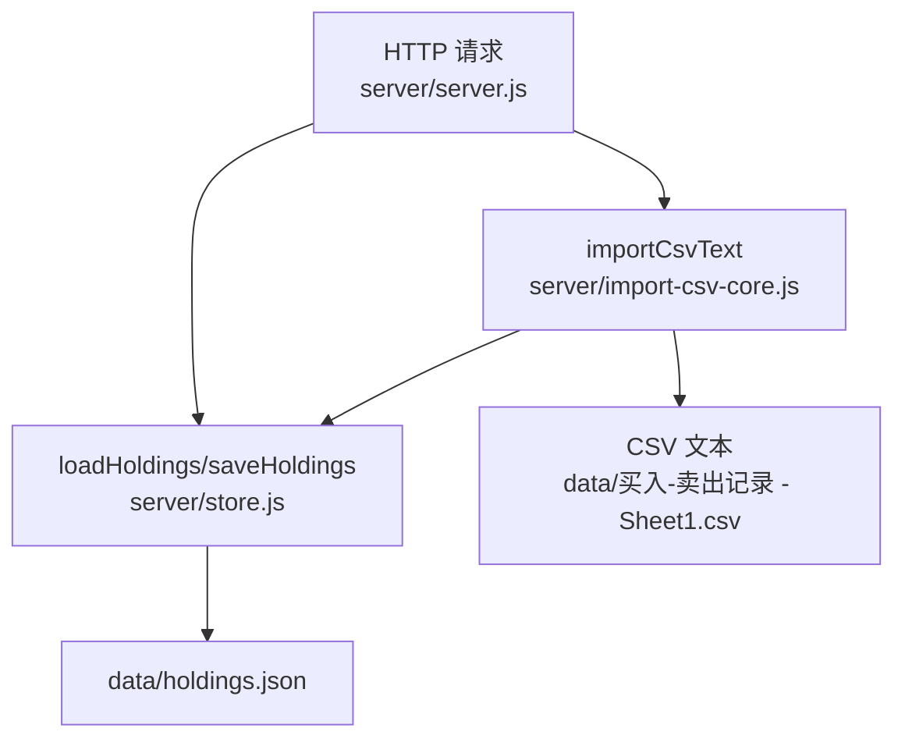
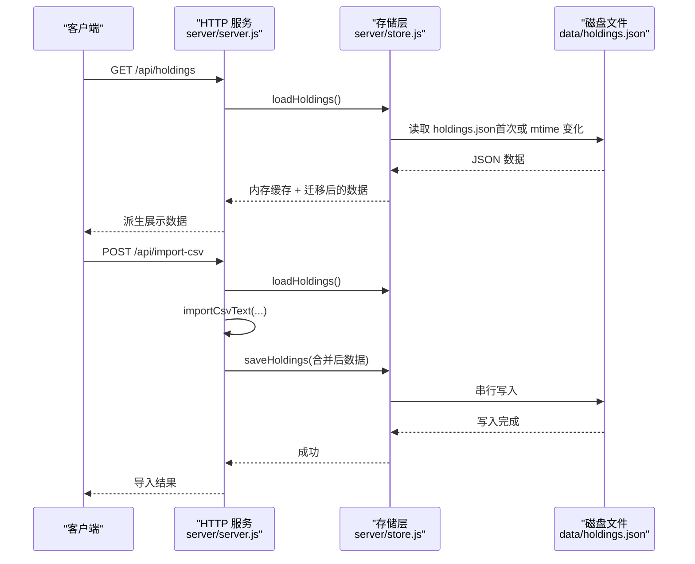
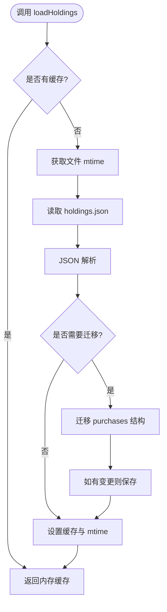
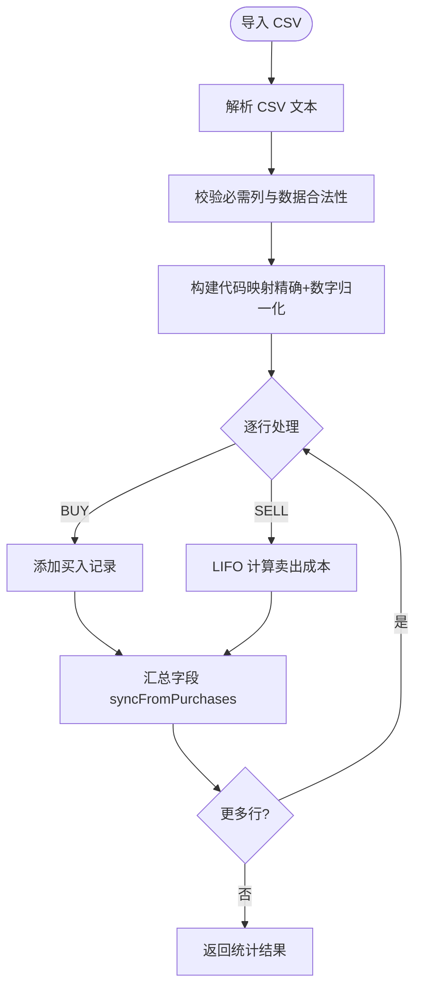
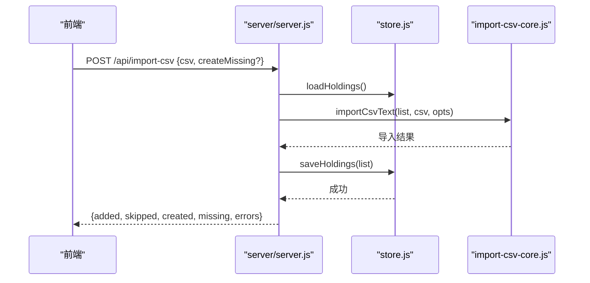
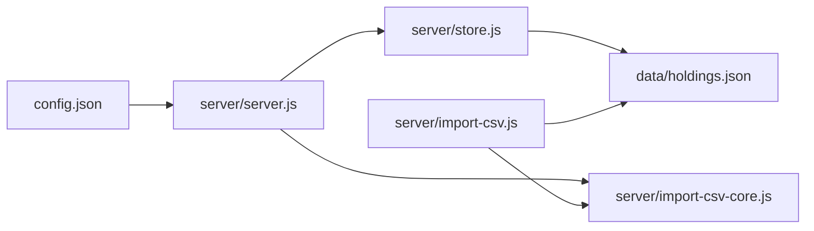
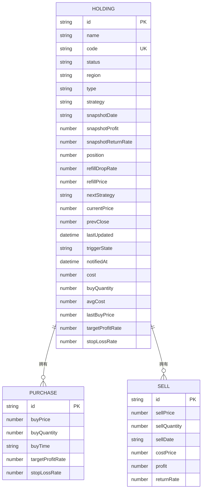

# 数据存储

<cite>
**本文引用的文件**
- [server/store.js](file://server/store.js)
- [data/holdings.json](file://data/holdings.json)
- [server/import-csv-core.js](file://server/import-csv-core.js)
- [server/import-csv.js](file://server/import-csv.js)
- [server/server.js](file://server/server.js)
- [config.json](file://config.json)
- [data/买入-卖出记录 - Sheet1.csv](file://data/买入-卖出记录 - Sheet1.csv)
</cite>

## 目录
1. [简介](#简介)
2. [项目结构](#项目结构)
3. [核心组件](#核心组件)
4. [架构总览](#架构总览)
5. [详细组件分析](#详细组件分析)
6. [依赖关系分析](#依赖关系分析)
7. [性能考虑](#性能考虑)
8. [故障排查指南](#故障排查指南)
9. [结论](#结论)
10. [附录：数据模型与使用示例](#附录数据模型与使用示例)

## 简介
本文件为 Stock Advisor 的数据存储系统文档，聚焦于基于 JSON 文件的持久化方案。内容涵盖：
- 数据模型设计（持仓对象、交易记录、关联关系）
- 缓存机制（内存缓存、文件持久化、数据同步策略）
- 数据迁移机制（版本升级时的数据结构变更）
- CSV 导入导出流程（格式验证、批量处理、错误恢复）
- 数据完整性检查、备份恢复与并发访问控制
- 性能优化策略（读写分离、增量更新、查询优化）
- 数据模型图与具体使用示例

## 项目结构
数据存储相关的关键位置与职责：
- server/store.js：提供加载与保存持仓的封装，内置内存缓存与串行写盘
- data/holdings.json：实际落盘的持仓数据文件
- server/import-csv-core.js：CSV 解析与导入的核心逻辑（可复用）
- server/import-csv.js：命令行一键导入脚本（调用核心逻辑并落盘）
- server/server.js：HTTP API 入口，组合 store 与导入逻辑，对外暴露接口
- config.json：调度与服务器配置（影响读取频率等）
- data/买入-卖出记录 - Sheet1.csv：示例 CSV 数据源

图表来源
- [server/server.js:409-565](file://server/server.js#L409-L565)
- [server/store.js:40-70](file://server/store.js#L40-L70)
- [server/import-csv-core.js:170-306](file://server/import-csv-core.js#L170-L306)

章节来源
- [server/store.js:1-71](file://server/store.js#L1-L71)
- [server/server.js:1-594](file://server/server.js#L1-L594)
- [server/import-csv-core.js:1-307](file://server/import-csv-core.js#L1-L307)
- [server/import-csv.js:1-87](file://server/import-csv.js#L1-L87)
- [config.json:1-19](file://config.json#L1-L19)
- [data/买入-卖出记录 - Sheet1.csv:1-26](file://data/买入-卖出记录 - Sheet1.csv#L1-L26)

## 核心组件
- 内存缓存与并发控制：通过模块级变量缓存 holdings 列表，并使用 Promise 链串行化写入，避免并发覆盖
- 文件监控与增量重载：通过 mtime 判断外部是否修改了 holdings.json，必要时重新读盘并迁移
- 数据迁移：将旧版扁平持仓结构迁移到包含 purchases 数组的新模型，并在首次加载时自动落盘
- CSV 导入：支持精确匹配与数字归一化匹配，幂等插入，自动新建缺失持仓（可选），计算卖出成本并汇总字段
- HTTP 接口：统一读写入口，组合 load/save 与导入逻辑，返回派生展示数据

章节来源
- [server/store.js:8-70](file://server/store.js#L8-L70)
- [server/import-csv-core.js:8-306](file://server/import-csv-core.js#L8-L306)
- [server/server.js:409-565](file://server/server.js#L409-L565)

## 架构总览
整体数据流：
- 读取：HTTP 或调度器调用 loadHoldings，优先从内存缓存返回；若检测到文件被外部修改则重新读盘并迁移
- 写入：saveHoldings 使用 Promise 链串行写盘，写后更新 mtime，避免误判外部改动
- 导入：CSV 解析→匹配持仓→幂等插入→计算卖出成本→汇总字段→保存
- 展示：API 返回 withDerived 派生数据（收益、均价、状态等）

图表来源
- [server/server.js:409-565](file://server/server.js#L409-L565)
- [server/store.js:40-70](file://server/store.js#L40-L70)
- [server/import-csv-core.js:170-306](file://server/import-csv-core.js#L170-L306)

## 详细组件分析

### 存储层（内存缓存与并发控制）
- 内存缓存：模块级变量 cache 持有当前 holdings 列表，减少重复 IO
- 文件监控：getMtime 获取文件修改时间，loadHoldings 仅在首次或外部修改时重读
- 串行写入：writeChain 保证多次 saveHoldings 顺序执行，避免覆盖
- 迁移：migrate 将旧版单条买入结构转换为 purchases 数组，并在需要时落盘

图表来源
- [server/store.js:14-59](file://server/store.js#L14-L59)

章节来源
- [server/store.js:8-70](file://server/store.js#L8-L70)

### CSV 导入核心（解析、匹配、幂等、汇总）
- 解析：parseCsvText 支持 BOM、引号包裹、逗号分隔
- 匹配：精确匹配 code，或提取数字进行归一化匹配
- 幂等：以 (code, 操作, 日期, 数量, 价格) 作为唯一键，已存在则跳过
- 新增持仓：可选 createMissing，按地区/类型新建持仓
- 卖出成本：LIFO 计算成本价、利润、收益率
- 汇总：syncFromPurchases 计算剩余成本、数量、均价、加权止盈止损、状态等

图表来源
- [server/import-csv-core.js:8-306](file://server/import-csv-core.js#L8-L306)

章节来源
- [server/import-csv-core.js:8-306](file://server/import-csv-core.js#L8-L306)
- [server/import-csv.js:14-87](file://server/import-csv.js#L14-L87)

### HTTP 接口与数据派生
- 列表：GET /api/holdings 返回 withDerived 派生数据（含交易明细、收益、状态）
- 导入：POST /api/import-csv 接收 CSV 文本，调用 importCsvText 并保存
- 新建/更新：POST/PATCH /api/holdings 创建或更新持仓字段
- 交易：POST /api/holdings/:id/purchases 追加买入记录；POST /api/holdings/:id/transactions 兼容旧接口
- 删除：DELETE /api/holdings/:id/purchases/:pid 删除买入记录

图表来源
- [server/server.js:416-435](file://server/server.js#L416-L435)
- [server/import-csv-core.js:170-306](file://server/import-csv-core.js#L170-L306)
- [server/store.js:40-70](file://server/store.js#L40-L70)

章节来源
- [server/server.js:409-565](file://server/server.js#L409-L565)

## 依赖关系分析
- server/server.js 依赖 store.js 与 import-csv-core.js
- store.js 直接操作 data/holdings.json
- import-csv.js 为命令行工具，复用 import-csv-core.js 并直接写盘
- config.json 提供调度间隔与服务器端口等配置

图表来源
- [server/server.js:1-594](file://server/server.js#L1-L594)
- [server/store.js:1-71](file://server/store.js#L1-L71)
- [server/import-csv-core.js:1-307](file://server/import-csv-core.js#L1-L307)
- [server/import-csv.js:1-87](file://server/import-csv.js#L1-L87)
- [config.json:1-19](file://config.json#L1-L19)

章节来源
- [server/server.js:1-594](file://server/server.js#L1-L594)
- [server/store.js:1-71](file://server/store.js#L1-L71)
- [server/import-csv-core.js:1-307](file://server/import-csv-core.js#L1-L307)
- [server/import-csv.js:1-87](file://server/import-csv.js#L1-L87)
- [config.json:1-19](file://config.json#L1-L19)

## 性能考虑
- 读写分离与缓存：内存缓存减少重复 IO；mtime 检测实现增量重载
- 串行写入：Promise 链避免并发写冲突
- 查询优化：API 返回 withDerived 派生数据，前端无需二次计算
- 增量更新：CSV 导入仅对差异行进行处理，幂等避免重复计算
- 建议：
  - 大文件场景下可考虑分片或索引（如按 code 建立 Map）
  - 高频写入时可引入批处理与节流
  - 定期备份与压缩以减少 I/O 压力

[本节为通用性能建议，不直接分析具体文件]

## 故障排查指南
- CSV 表头缺失：会抛出错误提示需包含“代码/操作/日期/数量/价格”
- 数据非法：买入价/数量为负或缺失会报错
- 卖出超仓：卖出数量超过持仓时会抛出错误
- 并发写冲突：通过串行 writeChain 避免覆盖；如遇异常会记录日志
- 文件权限：确保 data/holdings.json 可读写
- 外部修改：mtime 变化会触发重载；若频繁变动可能导致重复迁移

章节来源
- [server/import-csv-core.js:170-306](file://server/import-csv-core.js#L170-L306)
- [server/store.js:62-70](file://server/store.js#L62-L70)

## 结论
该数据存储系统以 JSON 文件为核心，结合内存缓存与 mtime 监控实现高效读写；通过串行写入保障并发安全；CSV 导入具备强校验、幂等与错误恢复能力；数据迁移机制平滑支持版本升级；API 层提供统一的增删改查与导入能力，便于前后端协作与维护。

[本节为总结性内容，不直接分析具体文件]

## 附录：数据模型与使用示例

### 数据模型图

图表来源
- [data/holdings.json:1-462](file://data/holdings.json#L1-L462)

### 使用示例
- 启动服务：根据 config.json 配置 host/port，启动 HTTP 服务
- 读取持仓：GET /api/holdings 获取派生后的持仓列表
- 导入 CSV：POST /api/import-csv，传入 CSV 文本与可选 createMissing
- 新建持仓：POST /api/holdings，提交 name/code/region/type 等必填字段
- 追加买入：POST /api/holdings/:id/purchases，提交 buyPrice/buyQuantity/buyTime
- 删除买入：DELETE /api/holdings/:id/purchases/:pid
- 命令行导入：node server/import-csv.js [--create-missing] [csv路径]

章节来源
- [server/server.js:409-565](file://server/server.js#L409-L565)
- [server/import-csv.js:1-87](file://server/import-csv.js#L1-L87)
- [config.json:1-19](file://config.json#L1-L19)