# 数据模型设计

<cite>
**本文引用的文件**
- [holdings.json](file://data/holdings.json)
- [store.js](file://server/store.js)
- [server.js](file://server/server.js)
- [盈亏计算规则.md](file://docs/盈亏计算规则.md)
- [useHoldings.js](file://web/src/composables/useHoldings.js)
- [PurchaseTable.vue](file://web/src/components/PurchaseTable.vue)
- [BuyRecordModal.vue](file://web/src/components/BuyRecordModal.vue)
- [TransactionModal.vue](file://web/src/components/TransactionModal.vue)
- [import-csv-core.js](file://server/import-csv-core.js)
- [config.json](file://config.json)
- [tencent.js](file://server/provider/tencent.js)
- [scheduler.js](file://server/scheduler.js)
- [options.js](file://web/src/constants/options.js)
</cite>

## 更新摘要
**变更内容**
- 新增美股市场支持，包括SK海力士等美股持仓实例
- currentPrice、prevClose字段现在支持美股行情数据获取
- 扩展了多市场支持架构（A股、港股、美股）
- 更新了行情数据提供商以支持美股股票代码格式

## 目录
1. [简介](#简介)
2. [项目结构](#项目结构)
3. [核心组件](#核心组件)
4. [架构总览](#架构总览)
5. [详细组件分析](#详细组件分析)
6. [依赖关系分析](#依赖关系分析)
7. [性能考虑](#性能考虑)
8. [故障排查指南](#故障排查指南)
9. [结论](#结论)
10. [附录](#附录)

## 简介
本文件围绕 Stock Advisor 的"持仓对象"数据模型进行系统化说明，重点覆盖：
- 持仓对象的基本字段、买入记录数组 purchases[]、卖出记录数组 sells[] 以及计算字段的定义与用途。
- **新增**：美股市场支持，包括SK海力士等美股持仓实例的数据结构和行情数据处理。
- 买入记录的 LIFO（后进先出）成本结转机制与多次买入场景下的加权平均算法。
- 从旧版扁平结构到新版 purchases 数组的自动迁移策略。
- 数据验证规则与业务约束（价格、数量、时间戳有效性检查）。
- 完整的数据模型图、字段类型说明与示例数据路径，帮助开发者理解数据结构设计与业务逻辑实现。

## 项目结构
Stock Advisor 采用前后端分离的结构，现已扩展支持多市场交易：
- 后端 Node.js 服务负责数据持久化、交易处理、行情刷新与调度。
- 前端 Vue 应用提供交互界面，调用后端 API 完成持仓与交易操作。
- 数据以 JSON 文件形式持久化在 data/holdings.json。
- **新增**：支持 A股、港股、美股三个市场的统一数据模型。

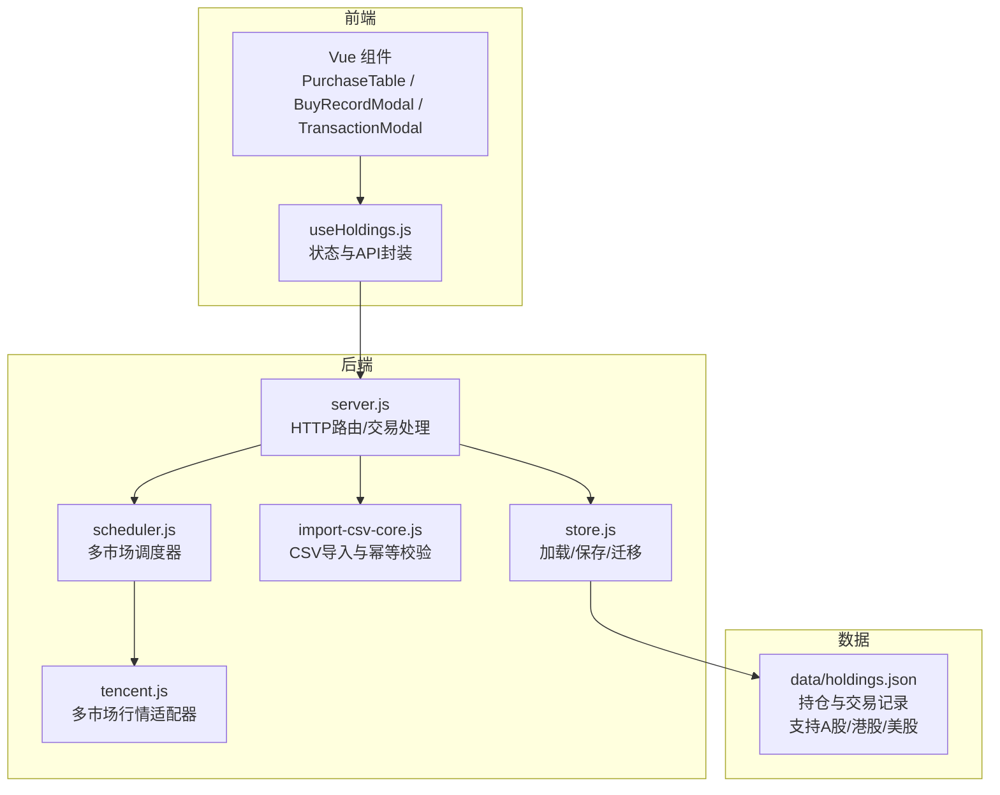

**图表来源**
- [server.js:309-414](file://server/server.js#L309-L414)
- [store.js:24-58](file://server/store.js#L24-L58)
- [useHoldings.js:67-130](file://web/src/composables/useHoldings.js#L67-L130)
- [import-csv-core.js:82-247](file://server/import-csv-core.js#L82-L247)
- [scheduler.js:1-178](file://server/scheduler.js#L1-L178)
- [tencent.js:1-42](file://server/provider/tencent.js#L1-L42)

**章节来源**
- [server.js:309-414](file://server/server.js#L309-L414)
- [store.js:24-58](file://server/store.js#L24-L58)
- [useHoldings.js:67-130](file://web/src/composables/useHoldings.js#L67-L130)
- [import-csv-core.js:82-247](file://server/import-csv-core.js#L82-L247)

## 核心组件
- 持仓对象 Holding：包含基本信息、purchases[]、sells[]、行情快照与汇总指标。
- 买入记录 Purchase：单笔买入的单价、数量、日期及止盈止损比例。
- 卖出记录 Sell：单笔卖出的单价、数量、日期、成本均价、盈亏与收益率。
- 计算字段：如 cost、buyQuantity、avgCost、marketValue、holdingProfit、todayProfit 等，由 syncFromPurchases 或 withDerived 派生。
- **新增**：多市场支持字段，包括 region（sh/hk/us）、type（股票/基金等）和市场特定的行情处理。

**章节来源**
- [holdings.json:1-462](file://data/holdings.json#L1-L462)
- [盈亏计算规则.md:9-145](file://docs/盈亏计算规则.md#L9-L145)
- [import-csv-core.js:82-110](file://server/import-csv-core.js#L82-L110)

## 架构总览
系统通过前端发起交易请求，后端路由解析并执行交易逻辑，更新 holdings.json，并在读取时进行数据迁移与派生字段计算。**新增**：支持多市场行情的统一调度与处理。

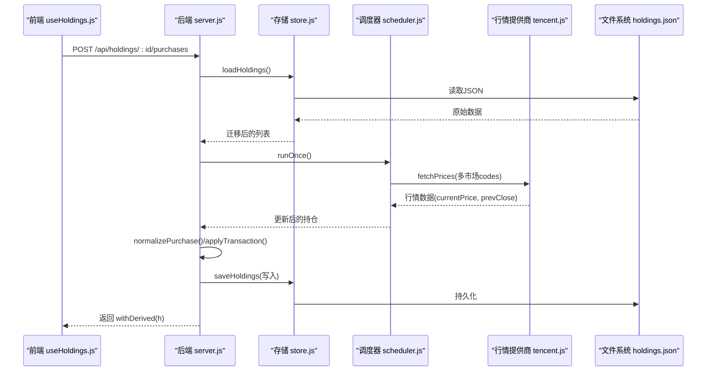

**图表来源**
- [useHoldings.js:94-104](file://web/src/composables/useHoldings.js#L94-L104)
- [server.js:467-487](file://server/server.js#L467-L487)
- [store.js:40-58](file://server/store.js#L40-L58)
- [scheduler.js:65-165](file://server/scheduler.js#L65-L165)
- [tencent.js:6-41](file://server/provider/tencent.js#L6-L41)

## 详细组件分析

### 数据模型总览（Holding / Purchase / Sell）
- Holding
  - 基本信息：id、name、code、status、region、type、strategy、snapshotDate、snapshotProfit、snapshotReturnRate、position
  - 交易明细：purchases[]、sells[]
  - 补仓计划：refillDropRate、refillPrice、nextStrategy
  - 行情快照：currentPrice、prevClose、lastUpdated
  - 触发与通知：triggerState、notifiedAt
  - 计算字段：cost、buyQuantity、lastBuyPrice、avgCost、targetProfitRate、stopLossRate、marketValue、holdingProfit、todayProfit 等
- Purchase
  - id、buyPrice、buyQuantity、buyTime、targetProfitRate、stopLossRate
- Sell
  - id、sellPrice、sellQuantity、sellDate、costPrice、profit、returnRate

**新增**：美股市场支持示例
- SK海力士（SKHY）：region="美股", code="SKHY", currentPrice和prevClose支持美股行情数据
- 南方两倍做多海力士（07709）：region="hk", 港股杠杆ETF

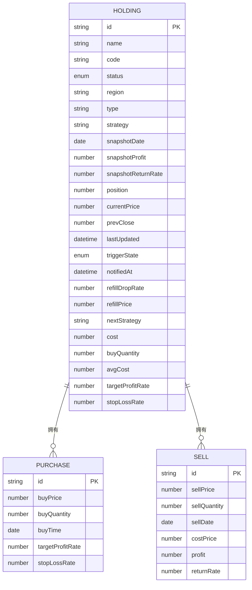

**图表来源**
- [holdings.json:1-462](file://data/holdings.json#L1-L462)
- [盈亏计算规则.md:21-46](file://docs/盈亏计算规则.md#L21-L46)

**章节来源**
- [holdings.json:1-462](file://data/holdings.json#L1-L462)
- [盈亏计算规则.md:21-46](file://docs/盈亏计算规则.md#L21-L46)

### 买入记录与多次买入的成本加权平均
- 总买入成本 = Σ(purchases[].buyPrice × purchases[].buyQuantity)
- 总买入数量 = Σ(purchases[].buyQuantity)
- 剩余均价 = (总买入成本 − 已卖出成本) / (总买入数量 − 已卖出数量)，当剩余数量 > 0
- 该均价用于未实现盈亏计算与展示

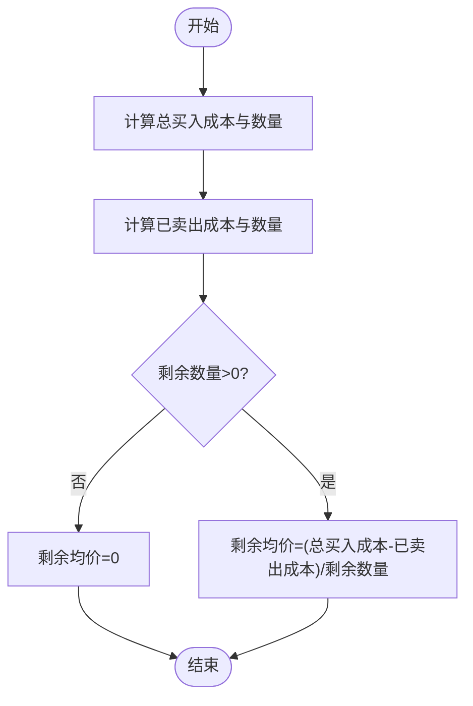

**图表来源**
- [盈亏计算规则.md:52-90](file://docs/盈亏计算规则.md#L52-L90)
- [import-csv-core.js:82-110](file://server/import-csv-core.js#L82-L110)

**章节来源**
- [盈亏计算规则.md:52-90](file://docs/盈亏计算规则.md#L52-L90)
- [import-csv-core.js:82-110](file://server/import-csv-core.js#L82-L110)

### 卖出成本结转：LIFO（后进先出）
- 每次卖出按 buyTime 降序匹配买入记录，逐笔扣减数量，累计成本，得到 costPrice
- 若卖出数量超过持仓数量则报错
- 不修改任何买入记录，仅追加一条卖出记录

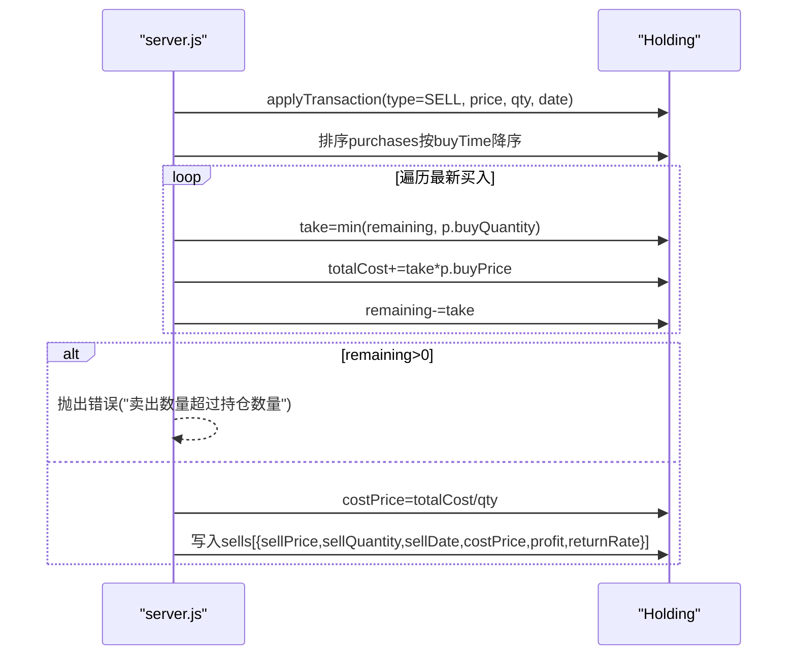

**图表来源**
- [server.js:346-407](file://server/server.js#L346-L407)
- [盈亏计算规则.md:59-80](file://docs/盈亏计算规则.md#L59-L80)

**章节来源**
- [server.js:346-407](file://server/server.js#L346-L407)
- [盈亏计算规则.md:59-80](file://docs/盈亏计算规则.md#L59-L80)

### 数据迁移：从旧版扁平结构到新版 purchases 数组
- 首次加载 holdings.json 时检测是否已有 purchases 数组
- 若无，则将旧版单条买入字段映射为 purchases[0]，并写回磁盘
- 之后始终以 purchases 模型持久化

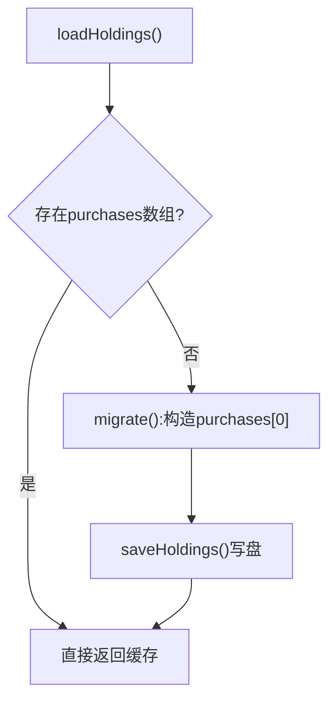

**图表来源**
- [store.js:24-58](file://server/store.js#L24-L58)

**章节来源**
- [store.js:24-58](file://server/store.js#L24-L58)

### 数据验证规则与业务约束
- 价格与数量必须为正数；否则拒绝交易
- 卖出数量不得超过当前持仓数量；否则报错
- 时间戳需为有效日期字符串（YYYY-MM-DD），缺失时使用默认值
- 新增/修改买入记录时对 buyPrice、buyQuantity、buyTime 进行规范化与校验
- 重复导入时基于（日期、数量、价格）去重，避免重复记录

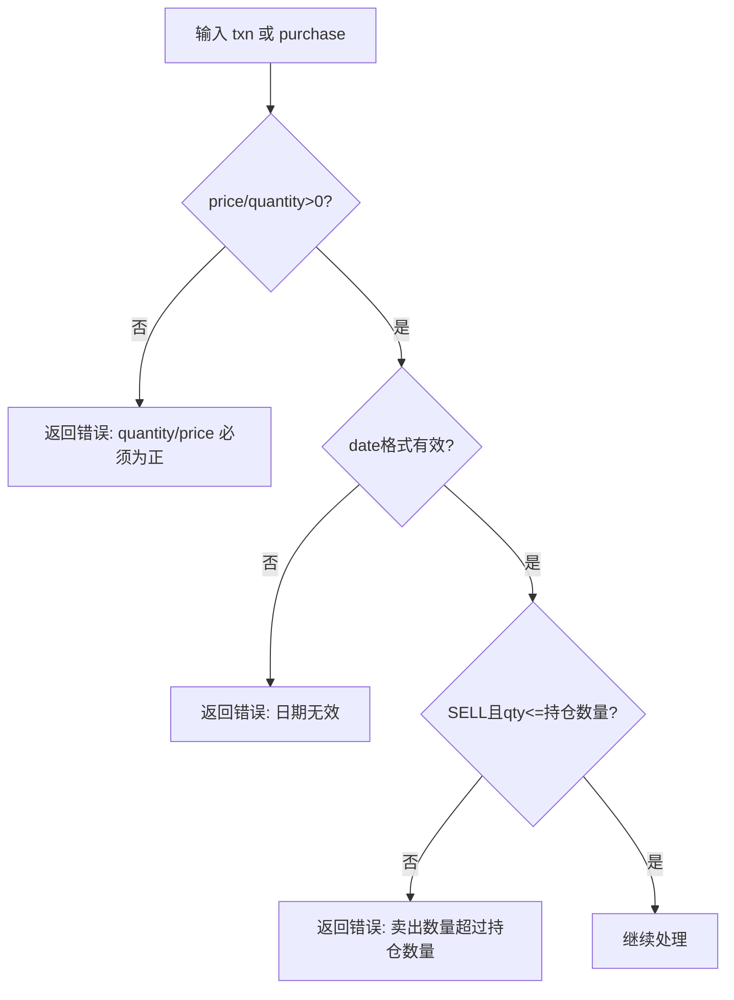

**图表来源**
- [server.js:346-407](file://server/server.js#L346-L407)
- [server.js:467-513](file://server/server.js#L467-L513)
- [import-csv-core.js:226-239](file://server/import-csv-core.js#L226-L239)

**章节来源**
- [server.js:346-407](file://server/server.js#L346-L407)
- [server.js:467-513](file://server/server.js#L467-L513)
- [import-csv-core.js:226-239](file://server/import-csv-core.js#L226-L239)

### 计算字段与派生指标
- 剩余成本/数量/均价：由 purchases 与 sells 派生
- 市值：currentPrice × 剩余数量
- 未实现盈亏：(currentPrice − 剩余均价) × 剩余数量
- 已实现盈亏：Σ(sells[].profit)
- 持仓总盈亏：未实现 + 已实现
- 今日盈亏：(currentPrice − prevClose) × 剩余数量

**新增**：多市场今日盈亏计算
- A股：使用 sh/sz 前缀的股票代码
- 港股：使用 hk 前缀的股票代码  
- 美股：使用 us 前缀的股票代码

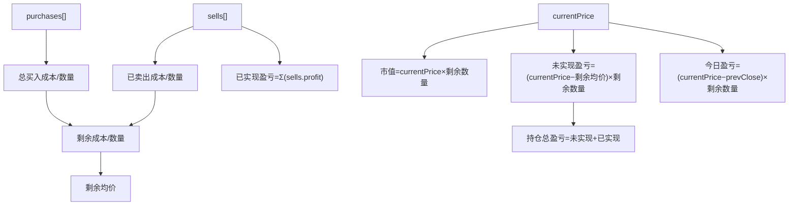

**图表来源**
- [盈亏计算规则.md:107-145](file://docs/盈亏计算规则.md#L107-L145)
- [import-csv-core.js:82-110](file://server/import-csv-core.js#L82-L110)

**章节来源**
- [盈亏计算规则.md:107-145](file://docs/盈亏计算规则.md#L107-L145)
- [import-csv-core.js:82-110](file://server/import-csv-core.js#L82-L110)

### 多市场行情数据支持
**新增功能**：系统现已支持A股、港股、美股三个市场的行情数据获取和处理。

- **行情提供商**：腾讯财经API支持批量查询，格式为 `region+code`（如：usSKHY、hk00700、sh600519）
- **时区处理**：美股使用America/New_York时区，支持美东交易时段判断
- **数据格式**：currentPrice和prevClose字段统一支持所有市场
- **前端适配**：地区选项包含美股(us)，显示标签为"美股"

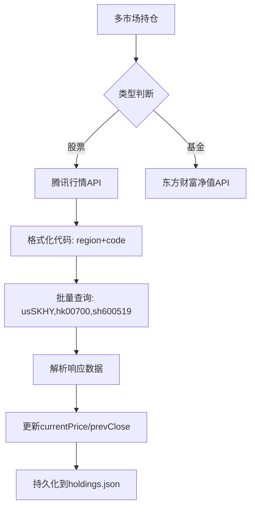

**图表来源**
- [scheduler.js:72-100](file://server/scheduler.js#L72-L100)
- [tencent.js:6-41](file://server/provider/tencent.js#L6-L41)

**章节来源**
- [scheduler.js:72-100](file://server/scheduler.js#L72-L100)
- [tencent.js:6-41](file://server/provider/tencent.js#L6-L41)

### 前端交互与数据流
- 添加/修改/删除买入记录：通过 useHoldings.savePurchase 调用后端 /api/holdings/:id/purchases
- 提交交易（买入/卖出）：通过 useHoldings.submitTransaction 调用 /api/holdings/:id/transactions
- 列表获取：GET /api/holdings，返回 withDerived 的派生数据
- 交易流水展示：合并 purchases 与 sells 并按日期倒序显示

**新增**：多市场过滤支持
- 前端支持按市场区域过滤（A股、港股、美股）
- 地区映射：REGION_SHORT包含美股(us)映射
- 徽章显示：美股显示为"美股"标签

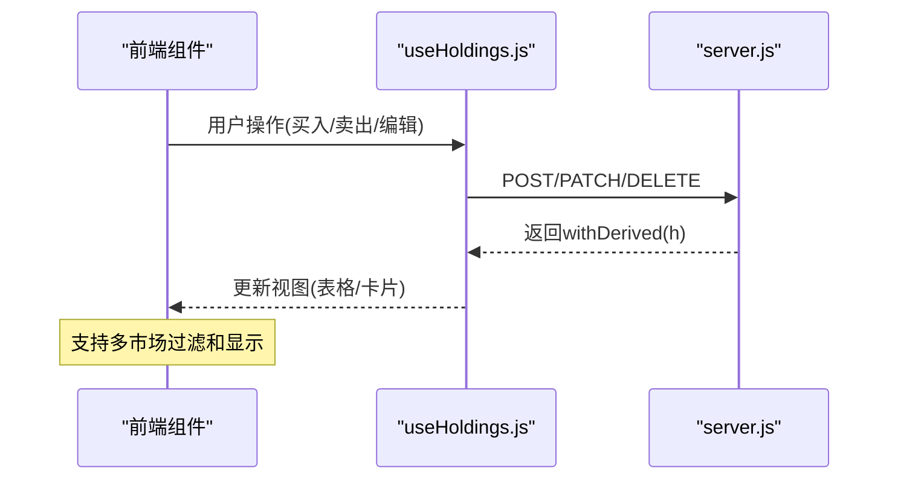

**图表来源**
- [useHoldings.js:67-130](file://web/src/composables/useHoldings.js#L67-L130)
- [server.js:409-543](file://server/server.js#L409-L543)
- [PurchaseTable.vue:31-71](file://web/src/components/PurchaseTable.vue#L31-L71)
- [App.vue:107-118](file://web/src/App.vue#L107-L118)

**章节来源**
- [useHoldings.js:67-130](file://web/src/composables/useHoldings.js#L67-L130)
- [server.js:409-543](file://server/server.js#L409-L543)
- [PurchaseTable.vue:31-71](file://web/src/components/PurchaseTable.vue#L31-L71)

## 依赖关系分析
- 前端 useHoldings.js 依赖后端 REST API，封装了增删改查与交易提交。
- 后端 server.js 依赖 store.js 进行数据读写与迁移，依赖 import-csv-core.js 进行 CSV 导入与幂等校验。
- **新增**：scheduler.js 依赖 tencent.js 进行多市场行情数据获取。
- 数据层 holdings.json 作为单一事实源，所有变更最终落盘。

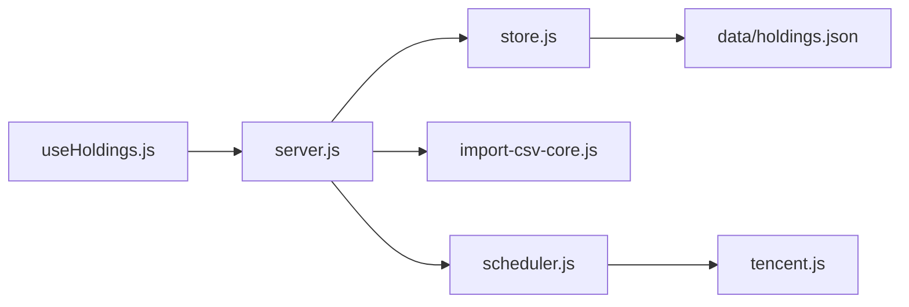

**图表来源**
- [useHoldings.js:67-130](file://web/src/composables/useHoldings.js#L67-L130)
- [server.js:409-543](file://server/server.js#L409-L543)
- [store.js:40-70](file://server/store.js#L40-L70)
- [import-csv-core.js:212-247](file://server/import-csv-core.js#L212-L247)
- [scheduler.js:1-178](file://server/scheduler.js#L1-L178)
- [tencent.js:1-42](file://server/provider/tencent.js#L1-L42)

**章节来源**
- [useHoldings.js:67-130](file://web/src/composables/useHoldings.js#L67-L130)
- [server.js:409-543](file://server/server.js#L409-L543)
- [store.js:40-70](file://server/store.js#L40-L70)
- [import-csv-core.js:212-247](file://server/import-csv-core.js#L212-L247)

## 性能考虑
- 内存缓存与并发写保护：store.js 使用内存缓存与串行写链，避免调度器与接口并发写造成覆盖。
- 增量读取：仅在文件 mtime 变化或首次加载时重新读盘，减少 IO 开销。
- 派生字段按需计算：withDerived/syncFromPurchases 在关键路径计算，避免全量重算。
- CSV 导入幂等：基于（日期、数量、价格）去重，降低重复导入带来的冗余计算。
- **新增**：多市场行情批量查询，减少网络请求次数。

**章节来源**
- [store.js:8-12](file://server/store.js#L8-L12)
- [store.js:40-70](file://server/store.js#L40-L70)
- [import-csv-core.js:226-239](file://server/import-csv-core.js#L226-L239)

## 故障排查指南
- 常见错误
  - "quantity / price 必须为正"：检查前端表单数值与后端校验逻辑
  - "卖出数量超过持仓数量"：确认当前持仓数量与卖出申请数量
  - "type 必须为 BUY 或 SELL"：检查交易类型参数
  - "买入记录不存在/持仓不存在"：检查 ID 是否正确
- **新增**：美股相关故障
  - "美股行情获取失败"：检查网络连接和股票代码格式（应为usSKHY）
  - "美股时区判断错误"：确认region字段为"us"而非其他值
  - "美股数据为空"：检查是否在美股交易时段内
- 定位方法
  - 查看后端日志输出（save error、error message）
  - 检查 holdings.json 中对应记录的 purchases/sells 是否一致
  - 使用 GET /api/holdings 观察 withDerived 返回的派生字段是否合理

**章节来源**
- [server.js:346-407](file://server/server.js#L346-L407)
- [server.js:467-543](file://server/server.js#L467-L543)
- [store.js:62-70](file://server/store.js#L62-L70)

## 结论
Stock Advisor 的数据模型以 Holding 为核心，通过 purchases[] 与 sells[] 解耦买入与卖出行为，结合 LIFO 成本结转与加权平均算法，确保成本与盈亏计算的准确性与可追溯性。**新增的美股市场支持**使系统能够统一管理A股、港股、美股三类资产，通过统一的currentPrice和prevClose字段处理不同市场的行情数据。数据迁移机制保障了历史数据的平滑升级，严格的验证规则与幂等导入提升了系统的健壮性。前端通过统一的 composable 封装 API，简化了交互复杂度，提升了开发效率。

## 附录

### 字段类型与说明（节选）
- Holding
  - id: string（唯一标识）
  - name: string（名称）
  - code: string（代码）
  - status: enum（持有/全部卖出/已卖出）
  - region: enum（sh/hk/sz/us - 支持A股沪市、港股、A股深市、美股）
  - type: string（品种类型：股票、股票型基金等）
  - strategy: string（策略）
  - snapshotDate: date（快照日期）
  - snapshotProfit: number（快照盈亏）
  - snapshotReturnRate: number（快照收益率）
  - position: number（初始仓位）
  - purchases: array<Purchase>
  - sells: array<Sell>
  - currentPrice: number（当前价，支持多市场）
  - prevClose: number（昨收，支持多市场）
  - lastUpdated: datetime（更新时间）
  - triggerState: enum（IDLE/BUY/SELL）
  - notifiedAt: datetime（通知时间）
  - cost: number（总买入成本）
  - buyQuantity: number（总买入数量）
  - avgCost: number（剩余均价）
  - targetProfitRate: number（加权目标止盈%）
  - stopLossRate: number（加权止损%）
- Purchase
  - id: string
  - buyPrice: number
  - buyQuantity: number
  - buyTime: date
  - targetProfitRate: number
  - stopLossRate: number
- Sell
  - id: string
  - sellPrice: number
  - sellQuantity: number
  - sellDate: date
  - costPrice: number
  - profit: number
  - returnRate: number

**新增**：美股持仓示例
- SK海力士：region="美股", code="SKHY", currentPrice=null（待行情更新）
- 南方两倍做多海力士：region="hk", code="07709", currentPrice=36.82

**章节来源**
- [holdings.json:1-462](file://data/holdings.json#L1-L462)
- [盈亏计算规则.md:21-46](file://docs/盈亏计算规则.md#L21-L46)

### 示例数据
- 示例持仓与交易记录位于 data/holdings.json，包含多只基金与股票的多次买入与部分卖出记录，可用于验证 LIFO 与加权平均计算结果。
- **新增**：包含美股SK海力士和多市场混合持仓示例，展示多市场支持的完整数据格式。

**章节来源**
- [holdings.json:1-462](file://data/holdings.json#L1-L462)

### 多市场配置参考
- **地区选项**：REGION_OPTIONS包含美股(us)选项
- **地区标签**：REGION_LABEL将us映射为"美股"
- **时区配置**：美股使用America/New_York时区
- **交易时段**：美股交易时间为美东时间9:30-16:00

**章节来源**
- [options.js:12-17](file://web/src/constants/options.js#L12-L17)
- [options.js:29](file://web/src/constants/options.js#L29)
- [scheduler.js:8-13](file://server/scheduler.js#L8-L13)
- [scheduler.js:45](file://server/scheduler.js#L45)