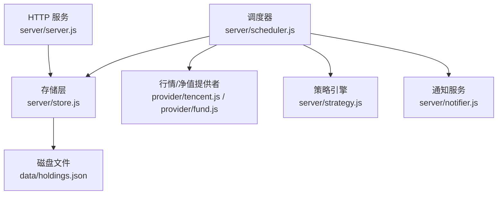
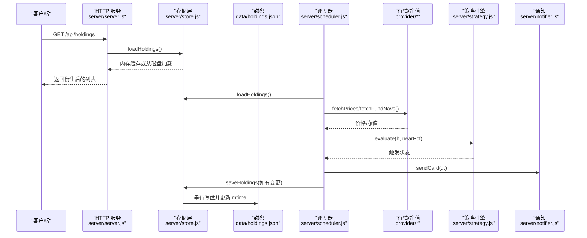
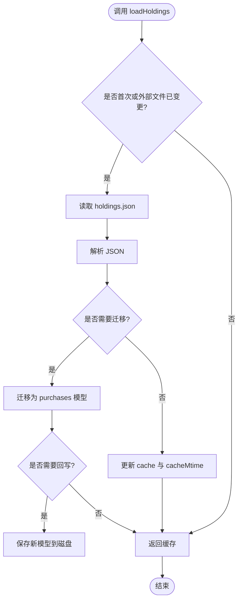
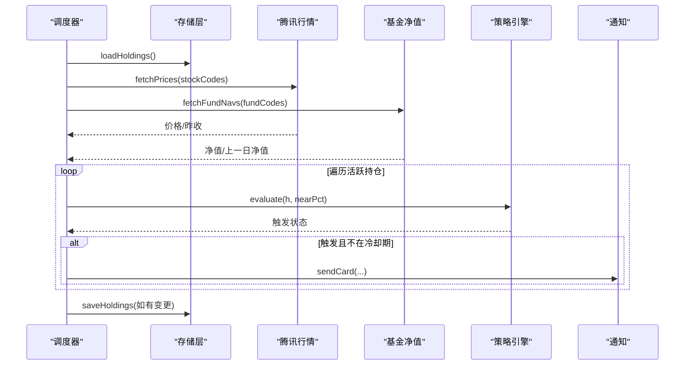
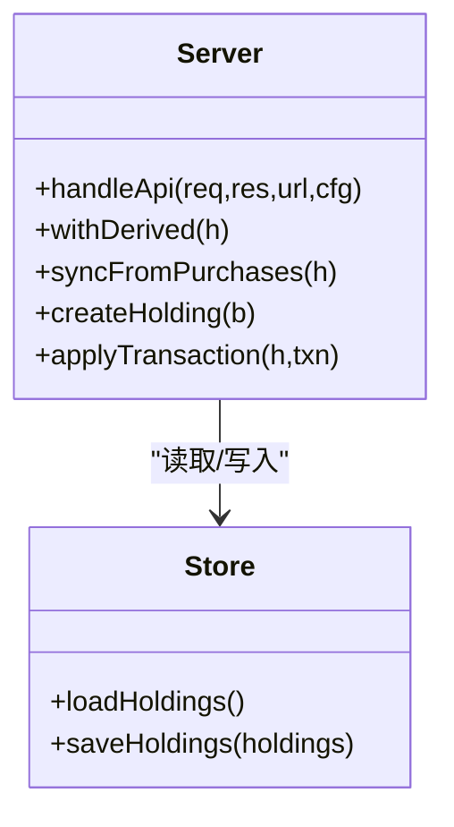
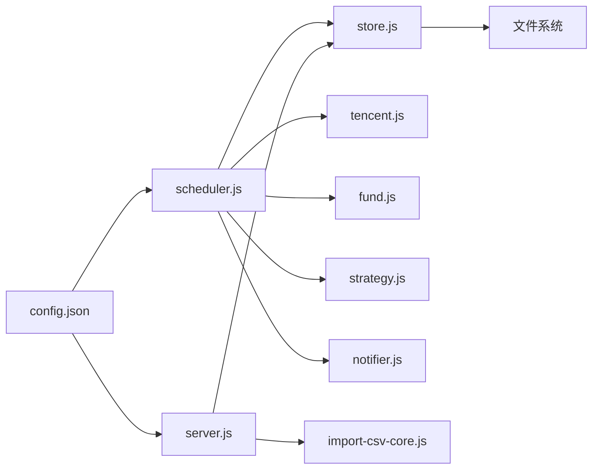

# 缓存机制

<cite>
**本文引用的文件**
- [server/store.js](file://server/store.js)
- [server/scheduler.js](file://server/scheduler.js)
- [server/server.js](file://server/server.js)
- [config.json](file://config.json)
- [data/holdings.json](file://data/holdings.json)
- [server/provider/tencent.js](file://server/provider/tencent.js)
- [server/provider/fund.js](file://server/provider/fund.js)
- [server/strategy.js](file://server/strategy.js)
- [server/notifier.js](file://server/notifier.js)
- [server/import-csv-core.js](file://server/import-csv-core.js)
</cite>

## 目录
1. [简介](#简介)
2. [项目结构](#项目结构)
3. [核心组件](#核心组件)
4. [架构总览](#架构总览)
5. [详细组件分析](#详细组件分析)
6. [依赖关系分析](#依赖关系分析)
7. [性能考量](#性能考量)
8. [故障排查指南](#故障排查指南)
9. [结论](#结论)

## 简介
本文件围绕 Stock Advisor 的缓存机制进行系统化说明，重点包括：
- 内存缓存的设计与单例式共享（模块级变量）
- 并发访问控制（串行写入队列）
- 文件修改时间监控（mtime 检测外部变更并触发重新加载）
- 缓存失效策略（首次加载、外部修改检测、错误恢复）
- 性能优化技巧（读写分离、增量更新、批量操作）
- 代码示例路径与故障排查建议

该机制确保调度器与 HTTP 接口在高频读取与写入时，既能保证数据一致性，又能避免重复 I/O 和覆盖写问题。

## 项目结构
Stock Advisor 的后端由 Node.js 提供 HTTP API，并通过调度器周期性拉取行情、评估策略、推送通知；所有持仓数据以 JSON 文件持久化，并在进程内维护一份内存缓存。关键文件职责如下：
- server/store.js：内存缓存、文件 mtime 监控、串行写入队列
- server/scheduler.js：定时任务，拉取行情、评估策略、落盘
- server/server.js：HTTP 路由与业务处理，调用 store 读写
- data/holdings.json：持久化的持仓数据
- config.json：调度间隔、服务器端口、通知冷却等配置
- provider/*：行情与基金净值数据源
- strategy.js：策略评估（买点/卖点）
- notifier.js：飞书通知
- import-csv-core.js：CSV 导入逻辑（复用幂等与同步计算）

图表来源
- [server/server.js:409-565](file://server/server.js#L409-L565)
- [server/store.js:40-70](file://server/store.js#L40-L70)
- [server/scheduler.js:65-177](file://server/scheduler.js#L65-L177)

章节来源
- [server/server.js:1-594](file://server/server.js#L1-L594)
- [server/store.js:1-71](file://server/store.js#L1-L71)
- [server/scheduler.js:1-178](file://server/scheduler.js#L1-L178)
- [config.json:1-19](file://config.json#L1-L19)

## 核心组件
- 内存缓存与单例式共享：模块级变量 cache 作为唯一数据源，被调度器和 HTTP 接口共同使用，避免多份副本导致的竞争条件。
- 文件修改时间监控：通过 getMtime 获取 holdings.json 的 mtimeMs，loadHoldings 仅在首次或外部文件变更后重新读盘，否则返回内存缓存。
- 串行写入队列：writeChain 为 Promise 链，saveHoldings 将每次写操作追加到队列末尾，确保写盘顺序执行，防止覆盖。
- 迁移与幂等：migrate 将旧版扁平结构迁移为 purchases 模型，并在需要时自动回写磁盘，后续统一按新模型持久化。
- 错误恢复：写盘失败仅记录日志，不中断调用方；网络请求失败会降级为空结果，不影响整体流程。

章节来源
- [server/store.js:8-12](file://server/store.js#L8-L12)
- [server/store.js:14-22](file://server/store.js#L14-L22)
- [server/store.js:24-38](file://server/store.js#L24-L38)
- [server/store.js:40-70](file://server/store.js#L40-L70)

## 架构总览
缓存机制贯穿“读取—处理—写入”的全链路：
- 读取：HTTP 接口与调度器均通过 loadHoldings 获取数据，优先命中内存缓存；若检测到外部文件变更则重新加载。
- 处理：调度器拉取行情/净值，结合策略评估生成告警；HTTP 接口支持创建/更新/删除买入卖出记录。
- 写入：所有写操作经 saveHoldings 进入串行队列，写后更新 cacheMtime，避免误判为外部修改而重复加载。

图表来源
- [server/server.js:409-450](file://server/server.js#L409-L450)
- [server/store.js:40-70](file://server/store.js#L40-L70)
- [server/scheduler.js:65-177](file://server/scheduler.js#L65-L177)
- [server/provider/tencent.js:6-41](file://server/provider/tencent.js#L6-L41)
- [server/provider/fund.js:6-54](file://server/provider/fund.js#L6-L54)
- [server/strategy.js:34-90](file://server/strategy.js#L34-L90)
- [server/notifier.js:81-111](file://server/notifier.js#L81-L111)

## 详细组件分析

### 存储层（store.js）：内存缓存与串行写入
- 单例式共享：模块级变量 cache 与 cacheMtime 构成全局唯一缓存与版本标记，所有调用方共享同一份数据。
- 读取逻辑：
  - 首次加载或外部文件变更（mtime > cacheMtime）时，读取磁盘 JSON，解析并迁移旧结构，更新 cache 与 cacheMtime。
  - 否则直接返回内存缓存，避免重复 I/O。
- 写入逻辑：
  - writeChain 为 Promise 链，saveHoldings 将写操作追加到队列末尾，确保串行执行。
  - 写盘成功后立即刷新 cacheMtime，避免把自身写入误判为外部修改。
  - 写盘异常仅记录日志，不中断调用方。

图表来源
- [server/store.js:40-59](file://server/store.js#L40-L59)
- [server/store.js:24-38](file://server/store.js#L24-L38)

章节来源
- [server/store.js:8-12](file://server/store.js#L8-L12)
- [server/store.js:14-22](file://server/store.js#L14-L22)
- [server/store.js:24-38](file://server/store.js#L24-L38)
- [server/store.js:40-70](file://server/store.js#L40-L70)

### 调度器（scheduler.js）：行情拉取与策略评估
- 交易时段判断：基于市场时区与本地时间，决定刷新间隔（交易时段短间隔，非交易时段长间隔）。
- 并行拉取：股票与基金分别调用不同 provider，使用 Promise.all 并行获取，提升吞吐。
- 策略评估：对每个活跃持仓调用 evaluate，根据止盈/止损/补仓规则生成触发状态。
- 通知与落盘：满足阈值且不在冷却期时发送通知；有变更时调用 saveHoldings 落盘。

图表来源
- [server/scheduler.js:65-177](file://server/scheduler.js#L65-L177)
- [server/provider/tencent.js:6-41](file://server/provider/tencent.js#L6-L41)
- [server/provider/fund.js:6-54](file://server/provider/fund.js#L6-L54)
- [server/strategy.js:34-90](file://server/strategy.js#L34-L90)
- [server/notifier.js:81-111](file://server/notifier.js#L81-L111)

章节来源
- [server/scheduler.js:1-178](file://server/scheduler.js#L1-L178)

### HTTP 服务（server/server.js）：API 与派生字段
- 读取接口：GET /api/holdings 调用 loadHoldings，并对每条持仓应用 withDerived 计算展示字段（均价、收益、目标价、止损价等）。
- 写入接口：POST/PATCH/DELETE 多种路径用于创建持仓、追加买入/卖出记录、修改买入记录参数等，最终统一调用 saveHoldings。
- 幂等与校验：normalizePurchase、applyTransaction、syncFromPurchases 保证数据一致性与完整性。

图表来源
- [server/server.js:146-284](file://server/server.js#L146-L284)
- [server/server.js:409-565](file://server/server.js#L409-L565)
- [server/store.js:40-70](file://server/store.js#L40-L70)

章节来源
- [server/server.js:1-594](file://server/server.js#L1-L594)

### CSV 导入（import-csv-core.js）：幂等与同步
- 幂等导入：以 (code, 操作, 日期, 数量, 价格) 为键去重，已存在则跳过。
- 同步计算：导入后调用 syncFromPurchases 更新成本、数量、均价、状态等汇总字段。
- 新建持仓：可选 createMissing，按地区/类型自动创建缺失的持仓。

章节来源
- [server/import-csv-core.js:1-307](file://server/import-csv-core.js#L1-L307)

## 依赖关系分析
- 存储层依赖文件系统（fs/promises），通过 stat/readFile/writeFile 实现 mtime 监控与读写。
- 调度器依赖 provider 获取行情/净值，依赖 strategy 进行评估，依赖 notifier 发送通知。
- HTTP 服务依赖 store 进行数据存取，依赖 import-csv-core 处理导入，依赖 notifier 测试通知。
- 配置文件 config.json 控制调度间隔、服务器端口、通知冷却等。

图表来源
- [server/store.js:1-70](file://server/store.js#L1-L70)
- [server/scheduler.js:1-178](file://server/scheduler.js#L1-L178)
- [server/server.js:1-594](file://server/server.js#L1-L594)
- [config.json:1-19](file://config.json#L1-L19)

章节来源
- [server/store.js:1-71](file://server/store.js#L1-L71)
- [server/scheduler.js:1-178](file://server/scheduler.js#L1-L178)
- [server/server.js:1-594](file://server/server.js#L1-L594)
- [config.json:1-19](file://config.json#L1-L19)

## 性能考量
- 读写分离：读取优先命中内存缓存，减少磁盘 I/O；仅在首次或外部文件变更时读盘。
- 增量更新：调度器仅对活跃持仓进行价格更新与策略评估，避免全量重算。
- 批量操作：provider 支持批量查询（如腾讯行情），减少网络往返。
- 串行写入：writeChain 保证写盘顺序，避免并发写导致的数据覆盖。
- 降频策略：非交易时段拉长刷新间隔，降低资源消耗。

[本节为通用性能指导，不直接分析具体文件]

## 故障排查指南
- 现象：频繁重复加载文件
  - 可能原因：cacheMtime 未正确更新，导致误判为外部修改
  - 定位位置：saveHoldings 写盘后应更新 cacheMtime
  - 参考路径：[server/store.js:62-70](file://server/store.js#L62-L70)
- 现象：写盘失败导致数据不一致
  - 可能原因：磁盘权限不足或路径错误
  - 处理：检查日志输出，确认 writeChain 的错误捕获
  - 参考路径：[server/store.js:62-70](file://server/store.js#L62-L70)
- 现象：行情拉取失败
  - 可能原因：网络错误或接口限流
  - 处理：provider 内部已做容错，返回空结果；检查日志与网络连通性
  - 参考路径：[server/provider/tencent.js:6-41](file://server/provider/tencent.js#L6-L41), [server/provider/fund.js:6-54](file://server/provider/fund.js#L6-L54)
- 现象：通知未送达
  - 可能原因：飞书 webhook 或签名配置错误
  - 处理：检查 config.json 中 feishu.webhook 与 secret，使用测试接口验证
  - 参考路径：[config.json:10-17](file://config.json#L10-L17), [server/notifier.js:81-111](file://server/notifier.js#L81-L111)
- 现象：CSV 导入重复或丢失
  - 可能原因：幂等键不一致或列名不匹配
  - 处理：确认表头包含必需列，日期格式归一化；检查 existingKey 逻辑
  - 参考路径：[server/import-csv-core.js:170-306](file://server/import-csv-core.js#L170-L306)

章节来源
- [server/store.js:62-70](file://server/store.js#L62-L70)
- [server/provider/tencent.js:6-41](file://server/provider/tencent.js#L6-L41)
- [server/provider/fund.js:6-54](file://server/provider/fund.js#L6-L54)
- [config.json:10-17](file://config.json#L10-L17)
- [server/notifier.js:81-111](file://server/notifier.js#L81-L111)
- [server/import-csv-core.js:170-306](file://server/import-csv-core.js#L170-L306)

## 结论
Stock Advisor 的缓存机制通过模块级单例缓存、mtime 监控与串行写入队列，实现了高并发下的数据一致性与低 I/O 开销。调度器与 HTTP 接口共享同一份内存缓存，既保证了读取性能，又避免了写覆盖风险。配合策略评估与通知机制，系统能够在交易时段与非交易时段自适应地运行，并提供可靠的告警与数据管理功能。开发者可依据本文档的定位与流程图快速理解与维护缓存系统的稳定性。