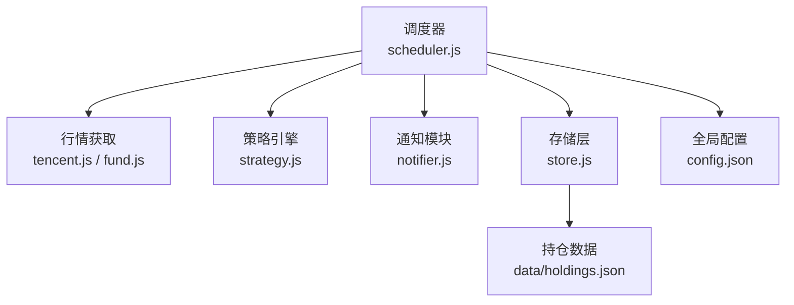
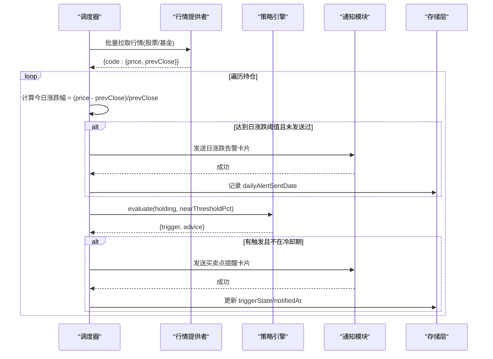
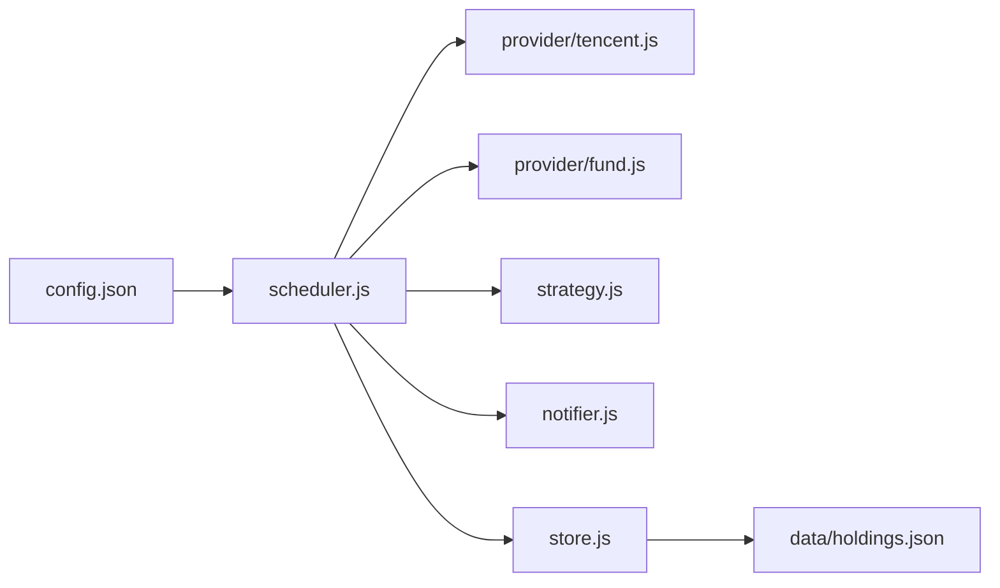

# 日涨跌告警策略

<cite>
**本文引用的文件**
- [scheduler.js](file://server/scheduler.js)
- [notifier.js](file://server/notifier.js)
- [strategy.js](file://server/strategy.js)
- [config.json](file://config.json)
- [store.js](file://server/store.js)
- [tencent.js](file://server/provider/tencent.js)
- [fund.js](file://server/provider/fund.js)
- [holdings.json](file://data/holdings.json)
- [盈亏计算规则.md](file://docs/盈亏计算规则.md)
</cite>

## 目录
1. [简介](#简介)
2. [项目结构](#项目结构)
3. [核心组件](#核心组件)
4. [架构总览](#架构总览)
5. [详细组件分析](#详细组件分析)
6. [依赖关系分析](#依赖关系分析)
7. [性能与稳定性](#性能与稳定性)
8. [故障排查指南](#故障排查指南)
9. [结论](#结论)
10. [附录：配置与调优示例](#附录配置与调优示例)

## 简介
本文件围绕“日涨跌告警策略”进行系统化说明，覆盖涨跌幅计算、基准价格选择、时间周期定义、波动率统计方法、告警触发条件（阈值、市场时段、异常波动识别）、通知频率控制（冷却期、重复告警过滤、批量优化）、飞书机器人消息模板设计（结构化数据、富文本渲染、交互按钮集成）、告警历史记录与统计分析、以及不同市场类型的参数调优与效果评估建议。

## 项目结构
系统由调度器驱动，定时拉取行情并执行策略判断，必要时通过飞书机器人推送告警卡片；持仓数据持久化在本地 JSON，支持多次买入记录与卖出记录，便于成本与收益的精确计算。

图表来源
- [scheduler.js:65-165](file://server/scheduler.js#L65-L165)
- [tencent.js:6-41](file://server/provider/tencent.js#L6-L41)
- [fund.js:6-54](file://server/provider/fund.js#L6-L54)
- [strategy.js:34-90](file://server/strategy.js#L34-L90)
- [notifier.js:4-112](file://server/notifier.js#L4-L112)
- [store.js:40-70](file://server/store.js#L40-L70)
- [config.json:1-19](file://config.json#L1-L19)

章节来源
- [scheduler.js:65-165](file://server/scheduler.js#L65-L165)
- [config.json:1-19](file://config.json#L1-L19)

## 核心组件
- 调度器：负责交易时段判断、刷新间隔选择、行情聚合、日涨跌告警判定、冷却期控制、状态持久化。
- 行情提供者：A股/港股/美股走腾讯接口；场外基金净值走东方财富接口。
- 策略引擎：基于多次买入记录的止盈/止损/补仓判断，同时为日涨跌告警提供统一入口。
- 通知模块：构造飞书 interactive 卡片，支持签名校验与重试。
- 存储层：内存缓存 + 串行写盘，避免并发冲突，自动迁移旧版数据结构。
- 配置：调度间隔、非交易时段降频、飞书 webhook/secret、冷却期与近阈值等。

章节来源
- [scheduler.js:65-165](file://server/scheduler.js#L65-L165)
- [tencent.js:6-41](file://server/provider/tencent.js#L6-L41)
- [fund.js:6-54](file://server/provider/fund.js#L6-L54)
- [strategy.js:34-90](file://server/strategy.js#L34-L90)
- [notifier.js:4-112](file://server/notifier.js#L4-L112)
- [store.js:40-70](file://server/store.js#L40-L70)
- [config.json:1-19](file://config.json#L1-L19)

## 架构总览
调度器在每个 tick 中：
- 读取持仓，筛选“持有”状态标的。
- 根据市场时区判断是否处于交易时段，决定刷新间隔。
- 并行拉取股票与基金行情，合并为统一价格字典。
- 对每个标的计算当日涨跌幅（以昨收为基准），若达到预设阈值则发送日涨跌告警，并记录已发送日期以避免同日重复。
- 调用策略引擎评估买点/卖点，结合冷却期与触发态去重后发送提醒。
- 更新持仓状态并持久化。

图表来源
- [scheduler.js:65-165](file://server/scheduler.js#L65-L165)
- [notifier.js:4-112](file://server/notifier.js#L4-L112)
- [strategy.js:34-90](file://server/strategy.js#L34-L90)
- [store.js:40-70](file://server/store.js#L40-L70)

## 详细组件分析

### 涨跌幅计算算法
- 基准价格选择：使用“昨收”作为基准，即前一个交易日的收盘价。对于股票/ETF，来自腾讯接口字段；对于场外基金，来自东方财富净值接口的上一交易日净值。
- 时间周期定义：按自然日计算“今日涨跌幅”，以当前服务器时间的日期切片作为“今日”。
- 波动率统计方法：当前实现未内置滚动波动率统计；可通过外部工具对历史 price/prevClose 序列进行标准差或区间振幅统计，用于动态阈值调整。

章节来源
- [scheduler.js:101-124](file://server/scheduler.js#L101-L124)
- [tencent.js:6-41](file://server/provider/tencent.js#L6-L41)
- [fund.js:6-54](file://server/provider/fund.js#L6-L54)
- [盈亏计算规则.md:136-143](file://docs/盈亏计算规则.md#L136-L143)

### 告警触发条件
- 预设阈值设置：每个持仓可配置上涨阈值与下跌阈值（百分比）。当“今日涨跌幅”大于等于上涨阈值或小于等于负的下跌幅度阈值时触发。
- 市场时段判断：调度器依据各市场时区与周末判断是否处于交易时段，用于选择刷新间隔；日涨跌告警不依赖交易时段开关，但实际行情仅在交易时段更新。
- 异常波动识别：当前未内置异常波动检测；可在外部引入波动率模型（如ATR、布林带）或阈值自适应机制，结合历史波动率放大/缩小阈值。

章节来源
- [scheduler.js:37-63](file://server/scheduler.js#L37-L63)
- [scheduler.js:101-124](file://server/scheduler.js#L101-L124)
- [config.json:14-17](file://config.json#L14-L17)

### 通知频率控制机制
- 冷却期管理：同一触发态且在冷却窗口内跳过重复通知，避免刷屏。冷却期由全局配置项控制。
- 重复告警过滤：日涨跌告警按“日”维度去重，记录已发送日期，确保同一天只发一次。
- 批量通知优化：行情拉取采用 Promise.all 并行请求；通知失败具备重试机制（最多三次，指数退避式等待）。

章节来源
- [scheduler.js:135-141](file://server/scheduler.js#L135-L141)
- [scheduler.js:112-123](file://server/scheduler.js#L112-L123)
- [notifier.js:96-110](file://server/notifier.js#L96-L110)
- [config.json:14-17](file://config.json#L14-L17)

### 飞书机器人消息模板设计
- 结构化数据格式：统一 payload 包含品种、代码、市场/类型、当前价、触发类型、操作建议与摘要。
- 富文本渲染：使用 lark_md 展示关键信息，标题模板颜色区分涨跌（红/黄/绿/红）。
- 交互按钮集成：当前模板不包含交互按钮；如需扩展，可在 elements 中添加按钮元素并在业务侧处理回调。

章节来源
- [notifier.js:4-78](file://server/notifier.js#L4-L78)
- [notifier.js:80-112](file://server/notifier.js#L80-L112)

### 告警历史记录与统计分析
- 历史记录：持仓对象中包含触发状态与最近通知时间；日涨跌告警记录“已发送日期”，可用于回溯当日是否触发。
- 统计分析：可基于 holdings.json 中的字段（currentPrice、prevClose、lastUpdated、triggerState、notifiedAt、dailyAlertSentDate）导出日志，计算触发频次、平均涨幅/跌幅、误报率等指标。
- 建议：增加独立告警日志表或文件，记录每次触发的完整上下文（阈值、当时价格、市场时段、冷却期状态），便于后续分析与可视化。

章节来源
- [scheduler.js:112-123](file://server/scheduler.js#L112-L123)
- [scheduler.js:155-157](file://server/scheduler.js#L155-L157)
- [holdings.json:336-338](file://data/holdings.json#L336-L338)

### 策略引擎与买卖点联动
- 策略引擎基于多次买入记录计算加权止盈/止损与补仓条件，与日涨跌告警并行运行；两者共享持仓数据与价格源。
- 买卖点提醒同样受冷却期保护，避免频繁打扰。

章节来源
- [strategy.js:34-90](file://server/strategy.js#L34-L90)
- [scheduler.js:126-157](file://server/scheduler.js#L126-L157)

## 依赖关系分析
- 调度器依赖行情提供者、策略引擎、通知模块与存储层。
- 行情提供者分别对接腾讯财经与东方财富接口，返回统一的价格与昨收结构。
- 存储层保证并发安全与数据迁移，避免重复加载与写入冲突。
- 配置集中管理调度间隔、冷却期与近阈值等关键参数。

图表来源
- [scheduler.js:1-6](file://server/scheduler.js#L1-L6)
- [tencent.js:1-42](file://server/provider/tencent.js#L1-L42)
- [fund.js:1-55](file://server/provider/fund.js#L1-L55)
- [strategy.js:1-91](file://server/strategy.js#L1-L91)
- [notifier.js:1-112](file://server/notifier.js#L1-L112)
- [store.js:1-71](file://server/store.js#L1-L71)
- [config.json:1-19](file://config.json#L1-L19)

章节来源
- [scheduler.js:1-6](file://server/scheduler.js#L1-L6)
- [config.json:1-19](file://config.json#L1-L19)

## 性能与稳定性
- 并行拉取：股票与基金行情使用 Promise.all 并行请求，降低整体延迟。
- 降级与容错：单个行情源失败不影响其他源；通知失败具备重试与错误日志。
- 存储并发：串行写盘避免竞态条件；内存缓存减少磁盘 IO。
- 时段感知：交易时段高频刷新，非交易时段降频，节省资源。

章节来源
- [scheduler.js:77-86](file://server/scheduler.js#L77-L86)
- [scheduler.js:167-177](file://server/scheduler.js#L167-L177)
- [notifier.js:96-110](file://server/notifier.js#L96-L110)
- [store.js:62-70](file://server/store.js#L62-L70)

## 故障排查指南
- 无行情：检查对应市场代码是否正确、网络连通性与接口可用性；查看控制台日志中的 “[skip] 无行情” 提示。
- 通知失败：确认飞书 webhook 与 secret 配置正确；查看重试日志与错误码；必要时临时关闭签名校验定位问题。
- 重复告警：检查冷却期配置与触发态；确认日涨跌告警的“已发送日期”是否被正确记录。
- 数据不一致：核对 holdings.json 中 currentPrice/prevClose/lastUpdated 是否与最新行情一致；必要时重启服务重新加载。

章节来源
- [scheduler.js:93-96](file://server/scheduler.js#L93-L96)
- [notifier.js:96-110](file://server/notifier.js#L96-L110)
- [scheduler.js:112-123](file://server/scheduler.js#L112-L123)

## 结论
该日涨跌告警策略以“昨收”为基准，按自然日计算涨跌幅，结合阈值与市场时段进行触发，并通过冷却期与日级去重控制通知频率。飞书卡片消息清晰呈现关键信息，便于快速决策。未来可引入波动率统计与动态阈值，增强异常波动识别能力，并完善告警日志与分析看板，持续优化策略效果。

## 附录：配置与调优示例
- 基础配置
  - 调度间隔：交易时段每 20 秒，非交易时段每 300 秒。
  - 冷却期：默认 3600 秒，可根据市场波动性调整。
  - 近阈值：用于接近阈值时的提前提醒，可按品种风险偏好微调。
- 不同市场类型调优建议
  - A股/港股：波动相对温和，可将日涨跌阈值设为 3%-5%；冷却期 1-2 小时。
  - 美股：波动较大，阈值可放宽至 5%-8%；冷却期 2-3 小时。
  - 高杠杆/衍生品：阈值需更敏感（如 2%-4%），冷却期缩短至 30-60 分钟，并配合更严格的止损策略。
- 效果评估与优化建议
  - 指标：触发次数、误报率（未达预期波动）、漏报率（错过显著波动）、平均响应延迟。
  - 方法：基于 holdings.json 与通知日志，统计每日触发分布与幅度；结合历史波动率（标准差、ATR）动态调整阈值。
  - 优化：引入波动率自适应阈值、分时段差异化阈值（开盘/收盘波动更大）、异常波动识别（Z-Score、极值检测）。

章节来源
- [config.json:1-19](file://config.json#L1-L19)
- [scheduler.js:58-63](file://server/scheduler.js#L58-L63)
- [scheduler.js:101-124](file://server/scheduler.js#L101-L124)
- [holdings.json:336-338](file://data/holdings.json#L336-L338)