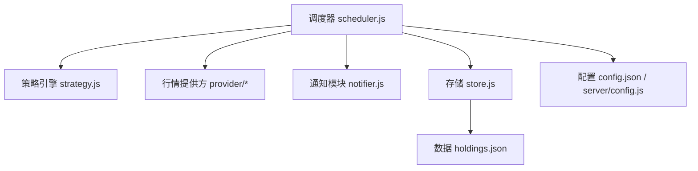
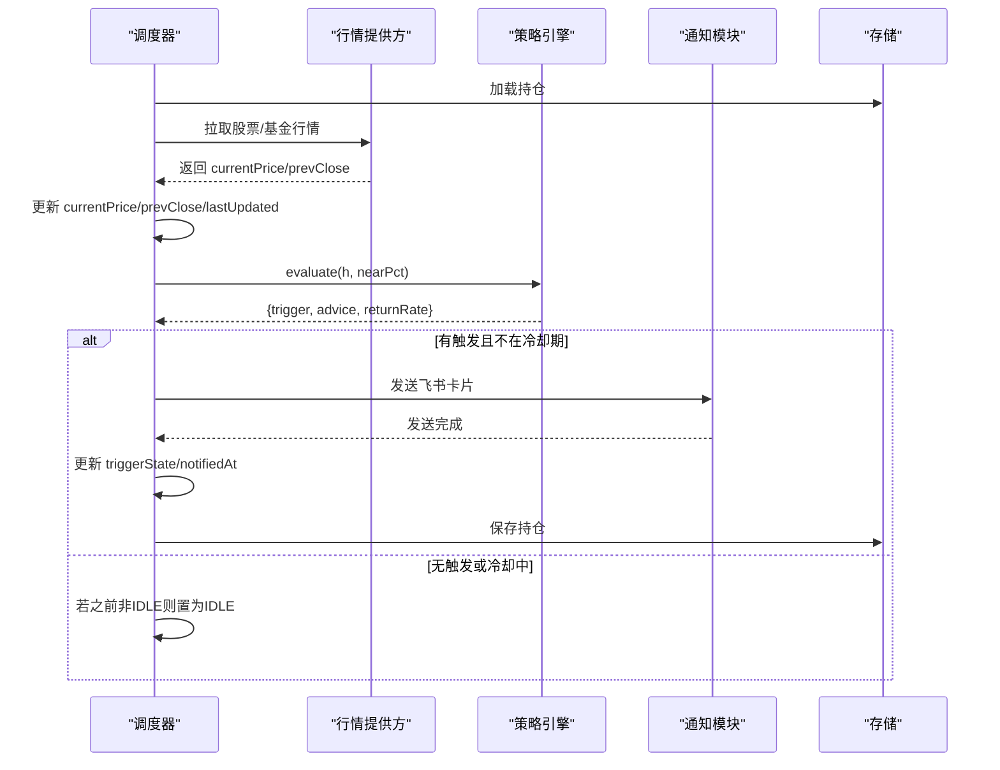
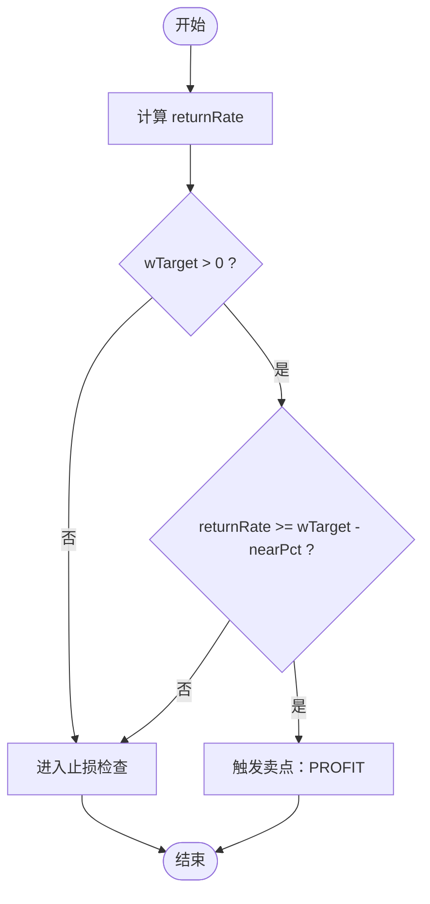
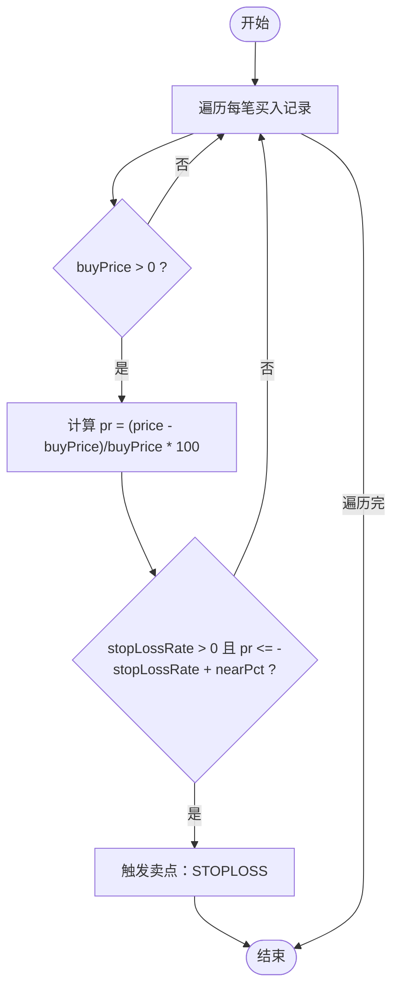
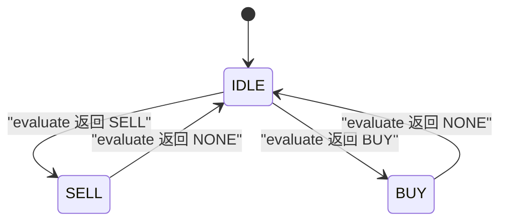
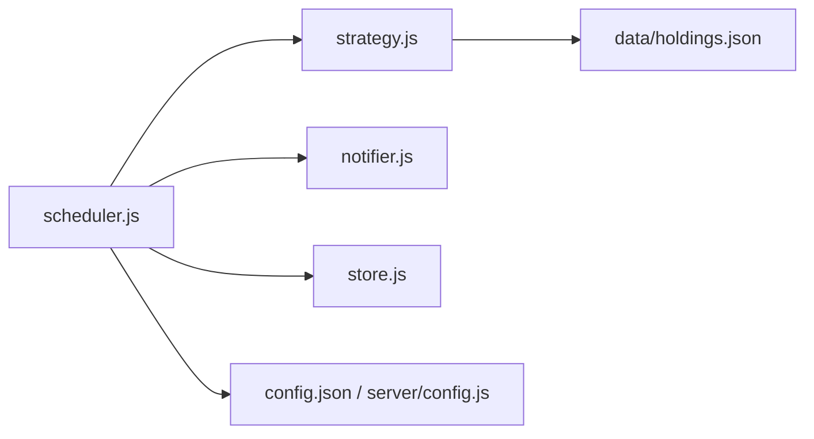

# 止盈止损策略

<cite>
**本文引用的文件**
- [server/strategy.js](file://server/strategy.js)
- [server/scheduler.js](file://server/scheduler.js)
- [server/notifier.js](file://server/notifier.js)
- [server/store.js](file://server/store.js)
- [config.json](file://config.json)
- [server/config.js](file://server/config.js)
- [data/holdings.json](file://data/holdings.json)
- [docs/盈亏计算规则.md](file://docs/盈亏计算规则.md)
</cite>

## 目录
1. [简介](#简介)
2. [项目结构](#项目结构)
3. [核心组件](#核心组件)
4. [架构总览](#架构总览)
5. [详细组件分析](#详细组件分析)
6. [依赖关系分析](#依赖关系分析)
7. [性能考量](#性能考量)
8. [故障排查指南](#故障排查指南)
9. [结论](#结论)
10. [附录](#附录)

## 简介
本文件围绕“止盈止损策略”进行系统化说明，覆盖加权平均成本计算、多次买入记录的成本聚合与权重分配、止盈触发机制（含预期收益率、阈值判断与 nearPct 缓冲区间）、止损执行逻辑（单笔独立评估、跌幅公式与触发条件）、策略状态转换（IDLE 到 TRIGGERED/SELL/BUY）、配置示例、回测验证方法与效果监控指标，以及与行情数据的集成方式和实时评估流程。

## 项目结构
该策略由“策略引擎 + 调度器 + 通知模块 + 数据存储 + 配置文件”组成：
- 策略引擎：负责基于当前价与持仓数据计算收益、判断止盈/止损/补仓信号。
- 调度器：定时拉取行情、更新价格、调用策略评估、写入状态并推送通知。
- 通知模块：将策略结果封装为飞书卡片消息并发送。
- 存储层：持久化 holdings.json，提供内存缓存与串行写盘。
- 配置：定义刷新间隔、冷却时间、nearThresholdPct 等参数。

图表来源
- [server/scheduler.js:65-165](file://server/scheduler.js#L65-L165)
- [server/strategy.js:34-90](file://server/strategy.js#L34-L90)
- [server/notifier.js:81-111](file://server/notifier.js#L81-L111)
- [server/store.js:40-69](file://server/store.js#L40-L69)
- [config.json:1-19](file://config.json#L1-L19)
- [server/config.js:7-10](file://server/config.js#L7-L10)

章节来源
- [server/scheduler.js:65-165](file://server/scheduler.js#L65-L165)
- [server/strategy.js:34-90](file://server/strategy.js#L34-L90)
- [server/notifier.js:81-111](file://server/notifier.js#L81-L111)
- [server/store.js:40-69](file://server/store.js#L40-L69)
- [config.json:1-19](file://config.json#L1-L19)
- [server/config.js:7-10](file://server/config.js#L7-L10)

## 核心组件
- 策略评估 evaluate(h, nearPct)：根据当前价与持仓的多次买入记录，计算加权平均成本、预期收益率与止损线，输出 SELL/BUY/NONE 及建议。
- 聚合函数 agg(h)：汇总 purchases 数组得到 totalCost、totalQty、avgCost、lastBuyPrice，以及按成本加权的 wTarget、wStop。
- 调度循环 runOnce(cfg)：拉取行情、更新 currentPrice/prevClose、调用 evaluate、处理冷却与状态切换、持久化变更。
- 通知 sendCard(cfg, payload)：构造飞书卡片并发送，支持签名与重试。
- 存储 loadHoldings/saveHoldings：内存缓存 + 串行写盘，避免并发冲突。

章节来源
- [server/strategy.js:5-32](file://server/strategy.js#L5-L32)
- [server/strategy.js:34-90](file://server/strategy.js#L34-L90)
- [server/scheduler.js:65-165](file://server/scheduler.js#L65-L165)
- [server/notifier.js:81-111](file://server/notifier.js#L81-L111)
- [server/store.js:40-69](file://server/store.js#L40-L69)

## 架构总览
调度器每 tick 执行一次：读取持仓 → 获取行情 → 更新价格 → 日涨跌告警 → 调用策略评估 → 冷却控制 → 推送通知 → 更新 triggerState 与 notifiedAt → 保存持仓。

图表来源
- [server/scheduler.js:65-165](file://server/scheduler.js#L65-L165)
- [server/strategy.js:34-90](file://server/strategy.js#L34-L90)
- [server/notifier.js:81-111](file://server/notifier.js#L81-L111)
- [server/store.js:40-69](file://server/store.js#L40-L69)

## 详细组件分析

### 加权平均成本与多次买入记录聚合
- 总成本与总数量：遍历 purchases，累加 buyPrice × buyQuantity 与 buyQuantity。
- 均价 avgCost：totalCost / totalQty。
- 最近买入价 lastBuyPrice：按 buyTime 倒序取第一条记录的 buyPrice。
- 成本加权目标与止损：以每笔的 buyPrice × buyQuantity 作为权重，分别对 targetProfitRate 与 stopLossRate 加权求和，再除以 totalCost 得到 wTarget 与 wStop。

复杂度分析
- 时间复杂度：O(N)，N 为 purchases 长度。
- 空间复杂度：O(1)。

优化机会
- 若 purchases 规模较大，可考虑增量维护 totalCost、totalQty、wTarget、wStop，在新增/修改/删除时更新，减少重复计算。

章节来源
- [server/strategy.js:5-32](file://server/strategy.js#L5-L32)
- [data/holdings.json:14-174](file://data/holdings.json#L14-L174)

### 止盈触发机制
- 预期收益率：returnRate = (currentPrice - avgCost) / avgCost × 100。
- 阈值判断：当 wTarget > 0 且 returnRate >= wTarget - nearPct 时，判定接近或达到止盈。
- nearPct 缓冲区间：允许在达到阈值前一定百分比内提前预警，便于用户择机卖出，避免频繁触发。

流程图

图表来源
- [server/strategy.js:34-51](file://server/strategy.js#L34-L51)

章节来源
- [server/strategy.js:34-51](file://server/strategy.js#L34-L51)
- [config.json:14-17](file://config.json#L14-L17)

### 止损执行逻辑
- 单笔独立评估：遍历 purchases，针对每一笔的 buyPrice 单独计算 pr = (currentPrice - buyPrice) / buyPrice × 100。
- 跌幅计算公式：pr 即为该笔相对于其买入价的涨跌幅百分比。
- 触发条件：当 p.stopLossRate > 0 且 pr <= -p.stopLossRate + nearPct 时，触发该笔止损。
- 设计意图：不同批次买入可能设定不同止损比例，按单笔独立评估更贴合实际风控需求。

流程图

图表来源
- [server/strategy.js:53-71](file://server/strategy.js#L53-L71)

章节来源
- [server/strategy.js:53-71](file://server/strategy.js#L53-L71)

### 买点（补仓）逻辑
- 较最近买入价跌幅：dropRate = (lastBuyPrice - currentPrice) / lastBuyPrice × 100。
- 触发条件：满足 refillPrice 且 price <= refillPrice，或 refillDropRate 且 dropRate >= refillDropRate - nearPct。
- 作用：在回调至预设补仓价或接近补仓降幅时提示补仓。

章节来源
- [server/strategy.js:73-87](file://server/strategy.js#L73-L87)
- [data/holdings.json:160-162](file://data/holdings.json#L160-L162)

### 策略状态转换规则
- 初始/无触发：triggerState 为 IDLE。
- 触发卖点或买点：scheduler 将 triggerState 更新为 SELL 或 BUY，并记录 notifiedAt。
- 冷却机制：同一触发态且在 cooldownSeconds 内不重复通知；超过冷却后再次触发会重新通知。
- 回到无触发：若 evaluate 返回 NONE，则将 triggerState 重置为 IDLE。

状态图

图表来源
- [server/scheduler.js:126-157](file://server/scheduler.js#L126-L157)

章节来源
- [server/scheduler.js:126-157](file://server/scheduler.js#L126-L157)

### 配置示例
- nearThresholdPct：用于“接近阈值”的缓冲百分比，默认 2（来自 notify.nearThresholdPct）。
- cooldownSeconds：同一触发态的冷却秒数，默认 3600。
- schedule.intervalSeconds/offHoursIntervalSeconds：交易时段与非交易时段的刷新间隔。
- feishu.webhook/secret：飞书机器人 webhook 与签名密钥。

示例场景
- 保守型：nearThresholdPct=1，cooldownSeconds=7200，refillDropRate=5，stopLossRate=10，targetProfitRate=20。
- 激进型：nearThresholdPct=3，cooldownSeconds=1800，refillDropRate=8，stopLossRate=20，targetProfitRate=40。

章节来源
- [config.json:1-19](file://config.json#L1-L19)

### 回测验证方法与效果监控指标
- 历史数据回放：使用 holdings.json 中的 purchases 与 sells 记录，结合历史行情（可通过 provider 扩展接入），逐日计算 returnRate、wTarget、wStop，统计触发次数、胜率、平均盈亏、最大回撤。
- 关键指标
  - 触发率：SELL/BUY 触发次数 / 交易日数。
  - 命中率：触发后 N 日内实现盈利比例。
  - 平均收益率：触发后的平均 returnRate。
  - 最大回撤：策略运行期间净值曲线最大峰值到谷底跌幅。
  - 冷却影响：相同触发态在冷却期内未重复通知的比例。
- 验证步骤
  - 准备历史行情数据（currentPrice/prevClose）。
  - 按日期顺序模拟调度器 runOnce 流程，记录每次 evaluate 结果与状态变化。
  - 汇总指标并生成报表。

[本节为方法论说明，不直接分析具体代码文件]

### 与行情数据的集成方式与实时评估流程
- 市场与时区：调度器根据 region 判断是否处于交易时段，决定刷新频率。
- 数据源分流：基金走净值接口，股票走腾讯行情接口，统一合并为 prices。
- 更新字段：currentPrice、prevClose、lastUpdated。
- 评估流程：更新价格后调用 evaluate，依据 nearPct 判断接近阈值，结合冷却机制决定是否通知与更新状态。

章节来源
- [server/scheduler.js:8-56](file://server/scheduler.js#L8-L56)
- [server/scheduler.js:65-165](file://server/scheduler.js#L65-L165)

## 依赖关系分析
- 调度器依赖策略引擎、通知模块、存储层与配置。
- 策略引擎仅依赖持仓数据结构（purchases、currentPrice 等）。
- 通知模块依赖配置中的 webhook 与 secret。
- 存储层提供并发安全的读写保障。

图表来源
- [server/scheduler.js:65-165](file://server/scheduler.js#L65-L165)
- [server/strategy.js:34-90](file://server/strategy.js#L34-L90)
- [server/notifier.js:81-111](file://server/notifier.js#L81-L111)
- [server/store.js:40-69](file://server/store.js#L40-L69)
- [config.json:1-19](file://config.json#L1-L19)
- [server/config.js:7-10](file://server/config.js#L7-L10)
- [data/holdings.json:1-462](file://data/holdings.json#L1-L462)

章节来源
- [server/scheduler.js:65-165](file://server/scheduler.js#L65-L165)
- [server/strategy.js:34-90](file://server/strategy.js#L34-L90)
- [server/notifier.js:81-111](file://server/notifier.js#L81-L111)
- [server/store.js:40-69](file://server/store.js#L40-L69)
- [config.json:1-19](file://config.json#L1-L19)
- [server/config.js:7-10](file://server/config.js#L7-L10)
- [data/holdings.json:1-462](file://data/holdings.json#L1-L462)

## 性能考量
- 策略评估 O(N) 复杂度，N 为 purchases 数量，通常较小，性能开销低。
- 调度器批量拉取行情，使用 Promise.all 并行请求，降低延迟。
- 存储层串行写盘，避免并发写冲突，保证一致性。
- 冷却机制减少通知风暴，降低外部系统压力。

[本节为通用性能指导，不直接分析具体代码文件]

## 故障排查指南
- 无行情数据：当 currentPrice 为空时，evaluate 返回 NONE，跳过通知；检查 provider 返回与 region/code 映射。
- 频繁触发：检查 nearThresholdPct 是否过小；适当增大缓冲区间或延长 cooldownSeconds。
- 通知失败：确认 feishu.webhook 与 secret 正确；查看 notifier 的重试日志。
- 状态未恢复：若 evaluate 返回 NONE 但 triggerState 未变回 IDLE，检查调度器逻辑与保存流程。

章节来源
- [server/strategy.js:34-37](file://server/strategy.js#L34-L37)
- [server/scheduler.js:126-157](file://server/scheduler.js#L126-L157)
- [server/notifier.js:81-111](file://server/notifier.js#L81-L111)

## 结论
该止盈止损策略通过多次买入记录的加权平均成本与单笔独立止损评估，兼顾整体收益目标与局部风险控制；nearPct 缓冲区间提升预警灵活性；调度器结合冷却机制与状态管理，确保通知及时且不刷屏；配合配置项可实现多风格策略落地。建议在真实环境中进行回测与监控，持续优化参数与指标。

## 附录
- 盈亏计算规则参考：文档定义了 LIFO 卖出成本、剩余仓位、未实现/已实现盈亏等计算方法，可作为策略评估与回测的基础。
- 持仓数据结构：purchases 数组包含每笔买入的价格、数量、时间与止盈止损比例；sells 数组记录卖出明细与实现盈亏。

章节来源
- [docs/盈亏计算规则.md:9-93](file://docs/盈亏计算规则.md#L9-L93)
- [docs/盈亏计算规则.md:96-145](file://docs/盈亏计算规则.md#L96-L145)
- [data/holdings.json:1-462](file://data/holdings.json#L1-L462)