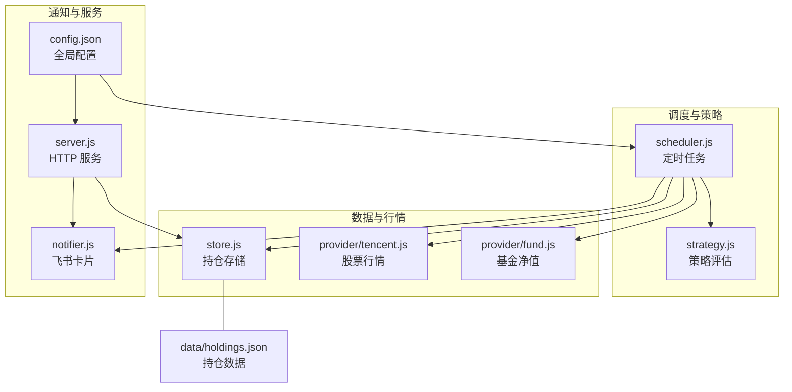
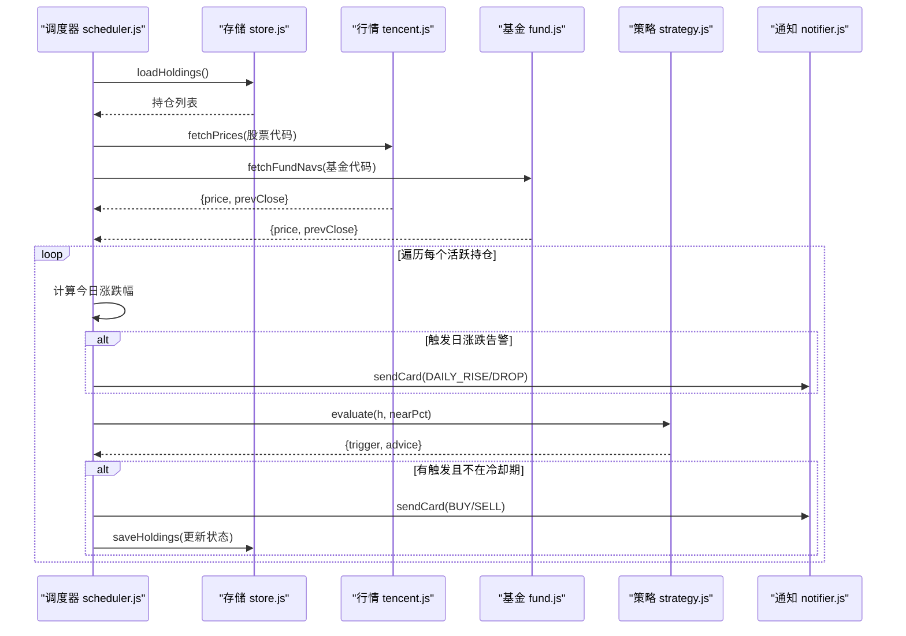
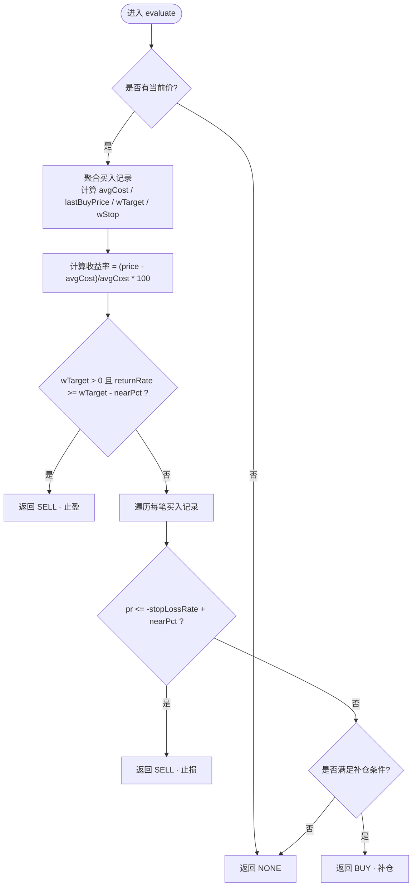
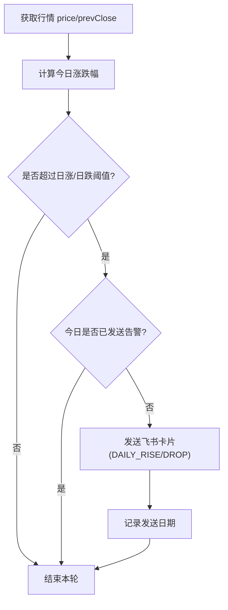
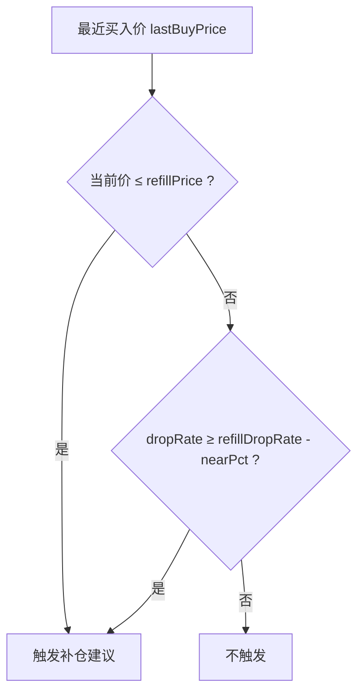
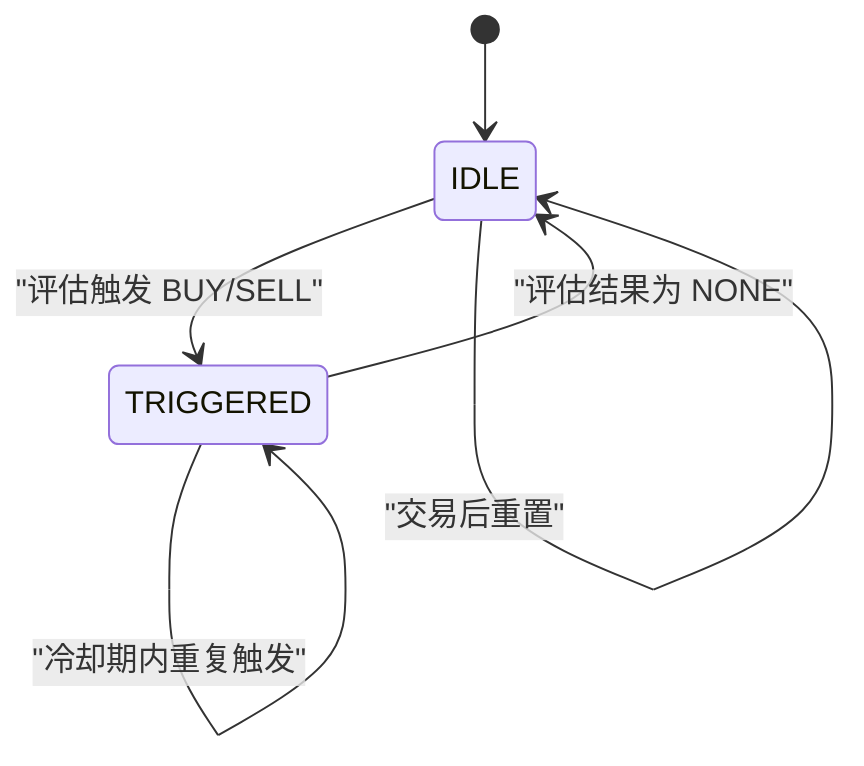
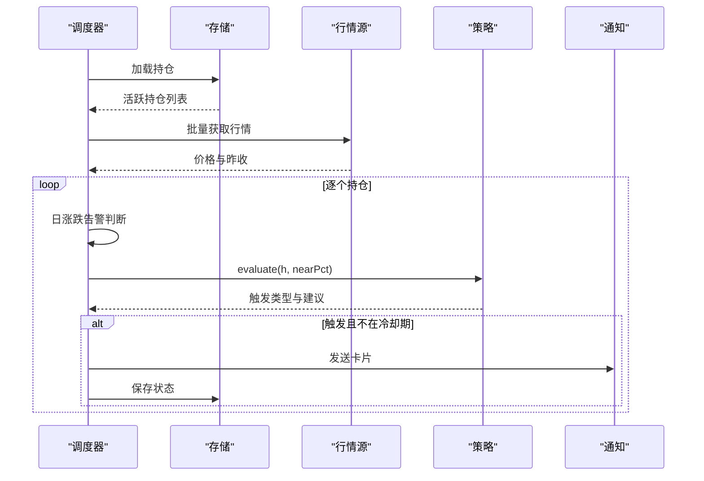
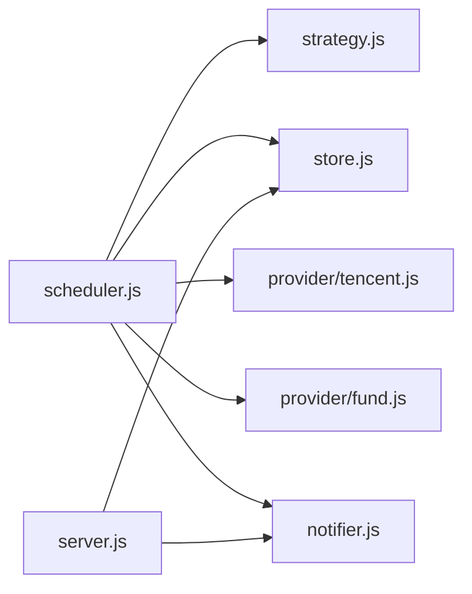

# 策略引擎

<cite>
**本文引用的文件**
- [server/strategy.js](file://server/strategy.js)
- [server/scheduler.js](file://server/scheduler.js)
- [server/notifier.js](file://server/notifier.js)
- [server/store.js](file://server/store.js)
- [server/provider/tencent.js](file://server/provider/tencent.js)
- [server/provider/fund.js](file://server/provider/fund.js)
- [server/server.js](file://server/server.js)
- [config.json](file://config.json)
- [data/holdings.json](file://data/holdings.json)
- [docs/盈亏计算规则.md](file://docs/盈亏计算规则.md)
- [docs/项目计划.md](file://docs/项目计划.md)
</cite>

## 目录
1. [简介](#简介)
2. [项目结构](#项目结构)
3. [核心组件](#核心组件)
4. [架构总览](#架构总览)
5. [详细组件分析](#详细组件分析)
6. [依赖关系分析](#依赖关系分析)
7. [性能考量](#性能考量)
8. [故障排查指南](#故障排查指南)
9. [结论](#结论)
10. [附录：配置与调试示例](#附录配置与调试示例)

## 简介
本文件系统化阐述 Stock Advisor 的策略引擎，覆盖止盈止损、日涨跌告警、补仓计划、状态机设计、评估流程、配置系统、扩展机制与调试方法。目标是让非技术读者也能理解策略如何工作，同时为开发者提供可落地的实现细节与优化建议。

## 项目结构
后端以 Node.js 为核心，采用模块化组织：
- 调度器：定时拉取行情、执行策略判断、发送通知
- 策略引擎：基于持仓的多次买入记录计算加权阈值并触发买卖建议
- 数据层：持久化持仓 JSON，内存缓存并发安全
- 行情源：腾讯股票、东方财富基金净值
- 通知：飞书机器人卡片消息
- 配置：外部 JSON 控制调度频率、冷却期、近阈值等
- Web 服务：提供 API 与静态前端页面

图表来源
- [server/scheduler.js:65-177](file://server/scheduler.js#L65-L177)
- [server/strategy.js:34-90](file://server/strategy.js#L34-L90)
- [server/store.js:40-70](file://server/store.js#L40-L70)
- [server/provider/tencent.js:6-41](file://server/provider/tencent.js#L6-L41)
- [server/provider/fund.js:6-54](file://server/provider/fund.js#L6-L54)
- [server/notifier.js:4-111](file://server/notifier.js#L4-L111)
- [server/server.js:567-593](file://server/server.js#L567-L593)
- [config.json:1-19](file://config.json#L1-L19)

章节来源
- [server/scheduler.js:65-177](file://server/scheduler.js#L65-L177)
- [server/store.js:40-70](file://server/store.js#L40-L70)
- [server/provider/tencent.js:6-41](file://server/provider/tencent.js#L6-L41)
- [server/provider/fund.js:6-54](file://server/provider/fund.js#L6-L54)
- [server/notifier.js:4-111](file://server/notifier.js#L4-L111)
- [server/server.js:567-593](file://server/server.js#L567-L593)
- [config.json:1-19](file://config.json#L1-L19)

## 核心组件
- 策略评估（strategy.js）：聚合多次买入记录，计算加权止盈/止损阈值，结合当前价与最近买入价判断买点/卖点，返回触发类型与建议文案。
- 调度循环（scheduler.js）：按市场交易时段选择刷新间隔，批量获取行情，执行日涨跌告警与策略评估，维护触发状态与冷却期，推送通知并持久化状态。
- 数据存储（store.js）：JSON 文件持久化，内存缓存防抖，串行写入避免并发冲突，支持旧模型迁移。
- 行情适配（tencent.js、fund.js）：分别获取股票与基金的最新价与昨收/上一交易日净值，用于涨跌幅计算。
- 通知模块（notifier.js）：构造飞书交互式卡片，支持签名校验与重试。
- Web 服务（server.js）：REST API 管理持仓、交易记录、导入 CSV、测试通知；提供静态前端托管。
- 配置（config.json）：调度间隔、冷却期、近阈值、飞书 webhook 等。

章节来源
- [server/strategy.js:5-90](file://server/strategy.js#L5-L90)
- [server/scheduler.js:65-177](file://server/scheduler.js#L65-L177)
- [server/store.js:24-70](file://server/store.js#L24-L70)
- [server/provider/tencent.js:6-41](file://server/provider/tencent.js#L6-L41)
- [server/provider/fund.js:6-54](file://server/provider/fund.js#L6-L54)
- [server/notifier.js:4-111](file://server/notifier.js#L4-L111)
- [server/server.js:409-564](file://server/server.js#L409-L564)
- [config.json:1-19](file://config.json#L1-L19)

## 架构总览
调度器驱动整个策略流水线：读取持仓 → 拉取行情 → 计算日涨跌告警 → 调用策略评估 → 状态机与冷却 → 发送通知 → 写回状态。Web 服务暴露接口供前端或外部系统操作持仓与交易。

图表来源
- [server/scheduler.js:65-177](file://server/scheduler.js#L65-L177)
- [server/strategy.js:34-90](file://server/strategy.js#L34-L90)
- [server/provider/tencent.js:6-41](file://server/provider/tencent.js#L6-L41)
- [server/provider/fund.js:6-54](file://server/provider/fund.js#L6-L54)
- [server/notifier.js:81-111](file://server/notifier.js#L81-L111)
- [server/store.js:40-70](file://server/store.js#L40-L70)

## 详细组件分析

### 止盈止损策略实现原理
- 成本与收益率计算
  - 聚合所有买入记录，计算总成本、总数量、平均成本与最近买入价。
  - 对每笔买入记录的成本权重，计算加权止盈率与加权止损率。
  - 当前价相对平均成本的收益率用于止盈判断；单笔买入价相对跌幅用于逐笔止损判断。
- 触发条件
  - 止盈：当加权止盈率大于 0 且当前收益率达到“阈值 - 近阈值”时，判定接近止盈，建议择机卖出。
  - 止损：任一买入记录的跌幅达到该笔止损线（考虑近阈值），即触发止损建议。
  - 买点（补仓）：较最近买入价跌幅达到“补仓降幅 - 近阈值”，或价格低于补仓价，触发补仓建议。
- 执行逻辑
  - 返回触发类型（BUY/SELL/NONE）与建议文案，包含当前价、收益率、下阶段策略提示。
  - 由调度器负责状态机与冷却后发送通知。

图表来源
- [server/strategy.js:5-90](file://server/strategy.js#L5-L90)

章节来源
- [server/strategy.js:5-90](file://server/strategy.js#L5-L90)
- [docs/盈亏计算规则.md:50-144](file://docs/盈亏计算规则.md#L50-L144)

### 日涨跌告警机制
- 涨跌幅计算
  - 今日涨跌幅 = (当前价 - 昨收) / 昨收 × 100%。
  - 对于基金，使用最新净值与上一交易日净值。
- 通知频率控制与冷却期
  - 每日仅推送一次：通过记录当日日期字段，同一天内不重复推送。
  - 策略触发通知具备冷却期：同一触发态在冷却窗口内不重复推送，避免刷屏。
- 触发条件
  - 上涨超过配置的日涨阈值，或下跌超过配置的日跌阈值（绝对值）。
- 执行逻辑
  - 若触发且未发送过当日告警，则发送飞书卡片，并记录发送日期。

图表来源
- [server/scheduler.js:101-124](file://server/scheduler.js#L101-L124)
- [server/notifier.js:4-78](file://server/notifier.js#L4-L78)

章节来源
- [server/scheduler.js:101-124](file://server/scheduler.js#L101-L124)
- [server/provider/tencent.js:6-41](file://server/provider/tencent.js#L6-L41)
- [server/provider/fund.js:6-54](file://server/provider/fund.js#L6-L54)
- [server/notifier.js:4-78](file://server/notifier.js#L4-L78)

### 补仓计划的制定逻辑
- 资金分配与分批建仓
  - 通过多次买入记录体现分批建仓，每笔记录可独立设置止盈/止损比例。
  - 系统按成本加权汇总指标，反映整体仓位风险与收益目标。
- 风险控制
  - 补仓触发条件：价格低于补仓价，或较最近买入价跌幅达到“补仓降幅 - 近阈值”。
  - 结合止损策略，防止越跌越补导致风险放大。
- 执行逻辑
  - 触发补仓建议后，由用户手动执行买入；系统不自动下单。
  - 新增买入记录后，重新计算加权指标并重置触发状态。

图表来源
- [server/strategy.js:73-87](file://server/strategy.js#L73-L87)

章节来源
- [server/strategy.js:73-87](file://server/strategy.js#L73-L87)
- [server/server.js:286-344](file://server/server.js#L286-L344)
- [data/holdings.json:1-462](file://data/holdings.json#L1-L462)

### 策略状态机设计
- 状态定义
  - IDLE：无触发或未处于任何提醒态。
  - NEAR：接近阈值但未正式触发（由 nearThresholdPct 控制）。
  - TRIGGERED：已触发并发送通知（BUY/SELL）。
- 转换规则
  - 当策略评估结果为 NONE 时，状态复位为 IDLE。
  - 当评估结果不为 NONE 且不在冷却期内，进入 TRIGGERED 并记录 notifiedAt。
  - 冷却期内相同触发态不再重复通知。
  - 交易（买入/卖出）后重置状态为 IDLE，等待下一轮评估。

图表来源
- [server/scheduler.js:126-157](file://server/scheduler.js#L126-L157)
- [server/server.js:402-406](file://server/server.js#L402-L406)

章节来源
- [server/scheduler.js:126-157](file://server/scheduler.js#L126-L157)
- [server/server.js:402-406](file://server/server.js#L402-L406)

### 策略评估流程
- 数据收集
  - 从存储加载持仓，过滤“持有”状态的品种。
  - 根据类型分流：股票走腾讯接口，基金走东方财富接口，并行获取行情。
- 条件判断
  - 先进行日涨跌告警判断，再调用策略评估函数。
- 行动执行
  - 若触发且不在冷却期，发送飞书卡片，更新状态与时间戳，必要时写盘。

图表来源
- [server/scheduler.js:65-177](file://server/scheduler.js#L65-L177)
- [server/strategy.js:34-90](file://server/strategy.js#L34-L90)
- [server/notifier.js:81-111](file://server/notifier.js#L81-L111)
- [server/store.js:40-70](file://server/store.js#L40-L70)

章节来源
- [server/scheduler.js:65-177](file://server/scheduler.js#L65-L177)
- [server/strategy.js:34-90](file://server/strategy.js#L34-L90)

### 策略配置系统
- 参数调优
  - schedule.intervalSeconds：交易时段刷新间隔（秒）。
  - schedule.offHoursIntervalSeconds：非交易时段刷新间隔（秒）。
  - notify.cooldownSeconds：通知冷却期（秒）。
  - notify.nearThresholdPct：接近阈值的缓冲百分比。
  - feishu.webhook / secret：飞书机器人地址与签名密钥。
- 回测验证
  - 可通过历史 holdings.json 与行情源回溯评估结果（需自行扩展日志或导出功能）。
- 效果监控
  - 观察飞书通知频率与内容，结合持仓状态变化评估策略有效性。
  - 调整 nearThresholdPct 与 cooldownSeconds 平衡灵敏度与噪音。

章节来源
- [config.json:1-19](file://config.json#L1-L19)
- [docs/项目计划.md:64-67](file://docs/项目计划.md#L64-L67)

### 策略扩展机制
- 自定义策略开发
  - 在 strategy.js 中扩展 evaluate 函数的判断分支，增加新的触发条件与动作。
  - 在 scheduler.js 中接入新策略的评估结果，统一处理状态机与通知。
- 集成方式
  - 保持 evaluate 返回结构一致（trigger、advice、returnRate/dropRate 等）。
  - 如需新通知模板，可在 notifier.js 中扩展 buildCard。
- 配置化
  - 将策略开关或参数放入 config.json 或持仓级字段，便于动态调整。

章节来源
- [server/strategy.js:34-90](file://server/strategy.js#L34-L90)
- [server/scheduler.js:126-157](file://server/scheduler.js#L126-L157)
- [server/notifier.js:4-78](file://server/notifier.js#L4-L78)

## 依赖关系分析
- 低耦合高内聚
  - 策略评估与调度解耦：evaluate 只关注计算与决策，调度负责时序与通知。
  - 行情源抽象：不同市场通过 provider 模块隔离，易于替换或扩展。
  - 存储串行写：避免并发写入冲突，保证数据一致性。
- 直接依赖
  - scheduler.js 依赖 store、provider、strategy、notifier。
  - server.js 依赖 store、notifier、import-csv-core。
  - notifier.js 依赖 crypto（签名）与 fetch（HTTP）。
- 潜在风险
  - 第三方 API 限流或失败：已做错误捕获与降级（返回空对象或跳过）。
  - 美股/港股时区差异：通过区域时区判断交易时段，减少误判。

图表来源
- [server/scheduler.js:1-6](file://server/scheduler.js#L1-L6)
- [server/server.js:5-7](file://server/server.js#L5-L7)
- [server/notifier.js:1-2](file://server/notifier.js#L1-L2)

章节来源
- [server/scheduler.js:1-6](file://server/scheduler.js#L1-L6)
- [server/server.js:5-7](file://server/server.js#L5-L7)

## 性能考量
- 并行获取行情：股票与基金行情并行请求，降低延迟。
- 交易时段降频：非交易时段拉长刷新间隔，节省资源。
- 内存缓存与串行写：避免频繁磁盘 IO 与并发冲突。
- 通知冷却：同一触发态冷却期内不重复推送，降低网络与消息压力。
- 建议
  - 合理设置 intervalSeconds 与 offHoursIntervalSeconds。
  - 根据品种数量与 API 限制调整并发与重试策略。
  - 对高频波动品种可适当提高 nearThresholdPct 以减少误报。

[本节为通用指导，无需具体文件引用]

## 故障排查指南
- 行情获取失败
  - 检查网络与 UA/Referer 头；查看控制台错误日志。
  - 确认股票代码格式（region+code）与基金代码正确。
- 通知未送达
  - 校验飞书 webhook 与 secret；使用测试接口验证。
  - 检查冷却期与日涨跌告警是否已发送过。
- 状态未复位
  - 交易后应重置 triggerState 与 notifiedAt；检查接口调用是否正确。
- 数据不一致
  - 确认串行写链正常；检查外部修改 holdings.json 后的重载逻辑。

章节来源
- [server/provider/tencent.js:6-41](file://server/provider/tencent.js#L6-L41)
- [server/provider/fund.js:6-54](file://server/provider/fund.js#L6-L54)
- [server/notifier.js:81-111](file://server/notifier.js#L81-L111)
- [server/server.js:545-562](file://server/server.js#L545-L562)
- [server/store.js:61-70](file://server/store.js#L61-L70)

## 结论
Stock Advisor 的策略引擎以简洁清晰的模块化设计实现了止盈止损、日涨跌告警与补仓计划，配合状态机与冷却机制确保通知及时且不刷屏。通过外部配置与可扩展的评估函数，用户可灵活调优策略并持续监控效果。建议在实盘中结合历史数据与交易记录进行回测与参数校准，逐步优化策略表现。

[本节为总结性内容，无需具体文件引用]

## 附录：配置与调试示例
- 基本配置
  - 设置交易时段与非交易时段刷新间隔，避免过度请求。
  - 配置飞书 webhook 与 secret，启用签名校验。
  - 调整 nearThresholdPct 与 cooldownSeconds，平衡灵敏度与噪音。
- 持仓级参数
  - 设置 dailyDropAlertPct / dailyRiseAlertPct 开启日涨跌告警。
  - 设置 refillDropRate / refillPrice 制定补仓计划。
  - 在每次买入记录中设置 targetProfitRate / stopLossRate，精细化风控。
- 调试方法
  - 使用测试接口发送飞书消息，验证通知通道。
  - 观察调度日志中的 tick 输出，确认刷新频率与状态变更。
  - 通过 API 修改持仓参数后，等待下一轮评估验证效果。

章节来源
- [config.json:1-19](file://config.json#L1-L19)
- [server/server.js:545-562](file://server/server.js#L545-L562)
- [server/scheduler.js:167-177](file://server/scheduler.js#L167-L177)
- [server/server.js:452-465](file://server/server.js#L452-L465)