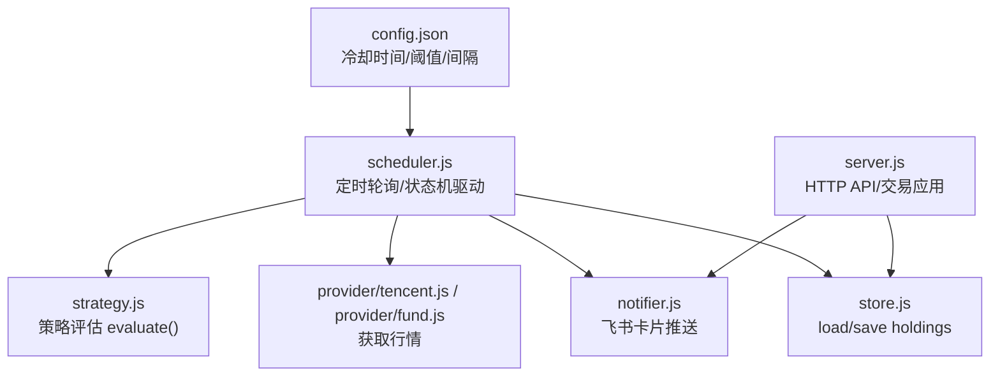
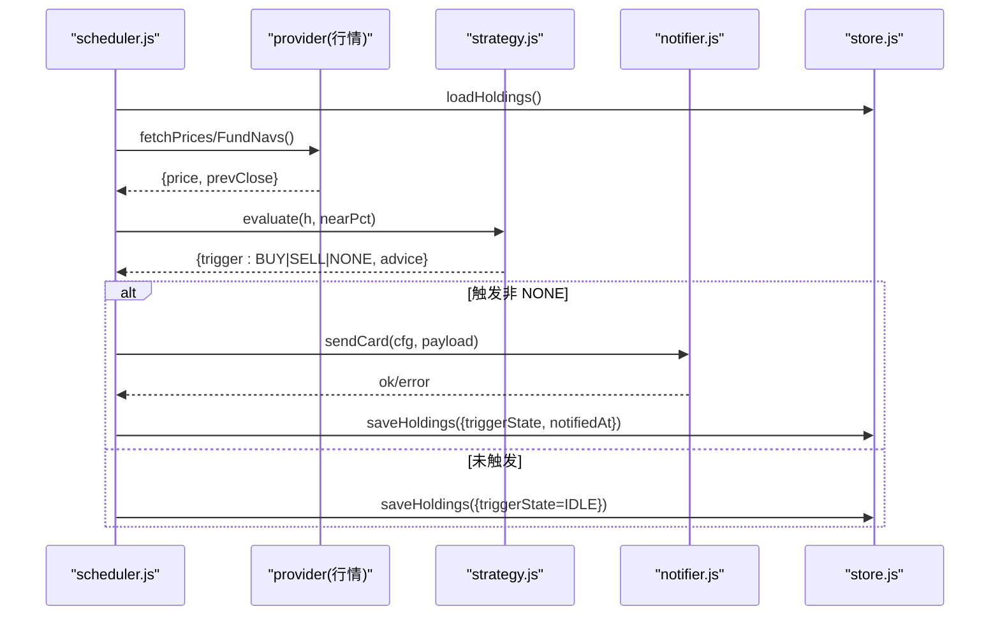
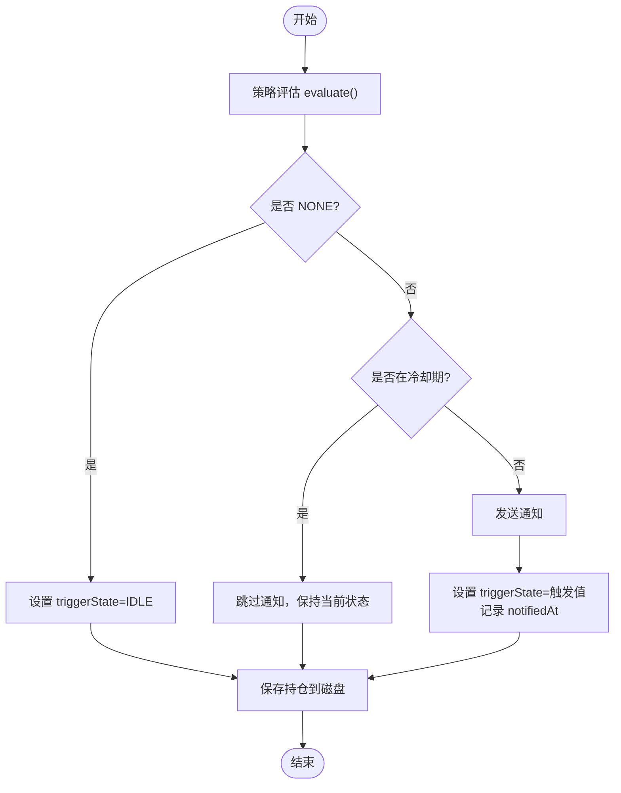
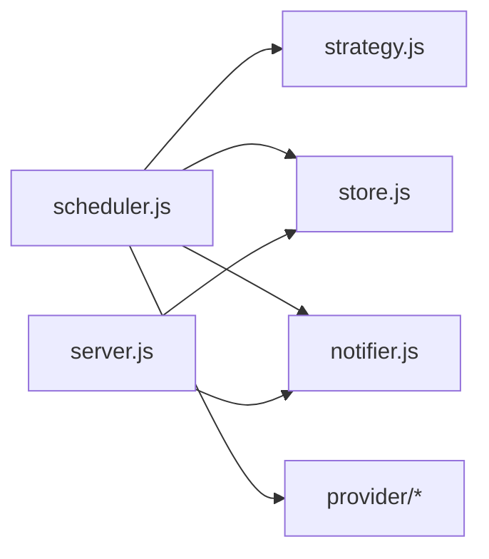
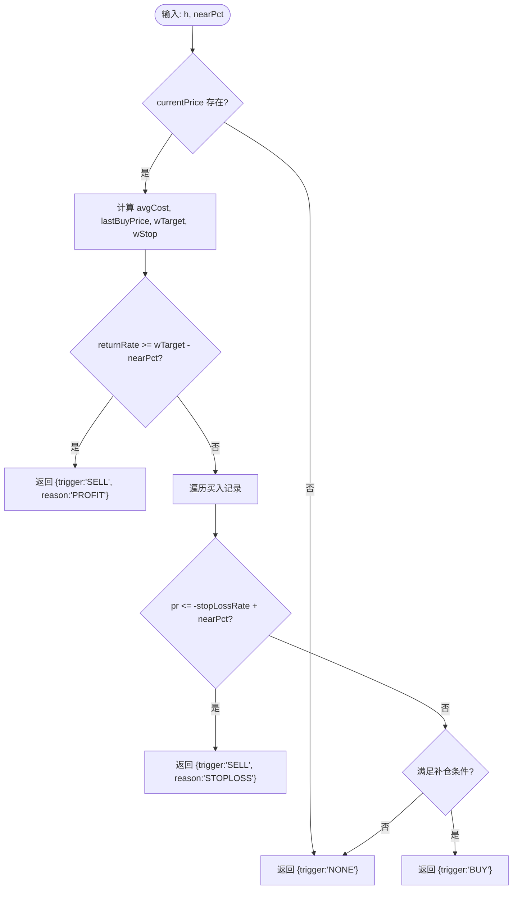

# 策略状态机

<cite>
**本文引用的文件**
- [server/strategy.js](file://server/strategy.js)
- [server/scheduler.js](file://server/scheduler.js)
- [server/store.js](file://server/store.js)
- [server/notifier.js](file://server/notifier.js)
- [server/server.js](file://server/server.js)
- [config.json](file://config.json)
</cite>

## 目录
1. [简介](#简介)
2. [项目结构](#项目结构)
3. [核心组件](#核心组件)
4. [架构总览](#架构总览)
5. [详细组件分析](#详细组件分析)
6. [依赖关系分析](#依赖关系分析)
7. [性能考量](#性能考量)
8. [故障排查指南](#故障排查指南)
9. [结论](#结论)
10. [附录](#附录)

## 简介
本文件围绕“策略状态机”进行系统化文档化，聚焦以下目标：
- 明确状态定义与含义（IDLE、NEAR、TRIGGERED）
- 详述状态转换规则（触发条件、转换逻辑、边界处理）
- 解释状态持久化机制（存储、恢复、同步）
- 阐述监控与调试能力（日志、可视化、诊断）
- 描述与外部事件交互模式（监听、响应、异常恢复）
- 提供扩展指南（自定义状态接入）
- 给出性能优化建议与最佳实践

该状态机用于对每个持仓品种在行情更新时进行策略评估，并输出操作建议（买入/卖出/无），同时通过冷却机制避免重复通知。

## 项目结构
与状态机直接相关的后端模块如下：
- 策略评估：strategy.js
- 调度与状态机驱动：scheduler.js
- 数据持久化：store.js
- 通知推送：notifier.js
- HTTP API 与交易应用：server.js
- 配置项：config.json

图表来源
- [server/scheduler.js:65-165](file://server/scheduler.js#L65-L165)
- [server/strategy.js:34-90](file://server/strategy.js#L34-L90)
- [server/store.js:40-70](file://server/store.js#L40-L70)
- [server/notifier.js:81-111](file://server/notifier.js#L81-L111)
- [server/server.js:437-543](file://server/server.js#L437-L543)
- [config.json:1-19](file://config.json#L1-L19)

章节来源
- [server/scheduler.js:65-165](file://server/scheduler.js#L65-L165)
- [server/strategy.js:34-90](file://server/strategy.js#L34-L90)
- [server/store.js:40-70](file://server/store.js#L40-L70)
- [server/notifier.js:81-111](file://server/notifier.js#L81-L111)
- [server/server.js:437-543](file://server/server.js#L437-L543)
- [config.json:1-19](file://config.json#L1-L19)

## 核心组件
- 策略评估器（evaluate）：根据当前价、成本加权止盈/止损、补仓条件计算触发类型（BUY/SELL/NONE）。
- 调度器（runOnce/startScheduler）：定时拉取行情，调用 evaluate 并驱动状态机，结合冷却窗口决定是否推送通知。
- 存储层（store）：内存缓存 + 文件持久化，支持并发串行写盘与外部文件变更检测。
- 通知器（notifier）：构造飞书卡片消息并发送，具备重试与签名能力。
- 服务器（server）：暴露 REST API 管理持仓、交易记录，并在交易后重置状态机。

章节来源
- [server/strategy.js:34-90](file://server/strategy.js#L34-L90)
- [server/scheduler.js:65-165](file://server/scheduler.js#L65-L165)
- [server/store.js:40-70](file://server/store.js#L40-L70)
- [server/notifier.js:81-111](file://server/notifier.js#L81-L111)
- [server/server.js:437-543](file://server/server.js#L437-L543)

## 架构总览
下图展示了状态机的运行时流程：调度器每轮读取持仓与行情，调用策略评估，依据结果更新 triggerState 与 notifiedAt，必要时发送通知；所有变更最终落盘。

图表来源
- [server/scheduler.js:65-165](file://server/scheduler.js#L65-L165)
- [server/strategy.js:34-90](file://server/strategy.js#L34-L90)
- [server/notifier.js:81-111](file://server/notifier.js#L81-L111)
- [server/store.js:40-70](file://server/store.js#L40-L70)

## 详细组件分析

### 状态定义与语义
- IDLE（空闲）：当前无有效触发或已回到无触发区间。表示策略未发出买卖信号。
- NEAR（接近）：当前价格接近触发阈值但未完全达到（例如接近止盈/止损或接近补仓线）。用于提前预警。
- TRIGGERED（已触发）：已达到明确的触发条件（如 BUY/SELL），并已执行通知与状态锁定（冷却期内不重复通知）。

注意：代码中实际持久化的状态字段为 triggerState，其值来源于 evaluate 返回的 trigger 或显式设置为 IDLE。NEAR 作为概念性中间态，可通过前端展示或日志体现。

章节来源
- [server/scheduler.js:126-157](file://server/scheduler.js#L126-L157)
- [server/server.js:315-343](file://server/server.js#L315-L343)

### 状态转换规则
- 初始状态：新建持仓时默认 triggerState = 'IDLE'。
- 进入 TRIGGERED：当 evaluate 返回 BUY 或 SELL，且不在冷却期，则发送通知并将 triggerState 设为对应触发值，记录 notifiedAt。
- 回到 IDLE：当 evaluate 返回 NONE，将 triggerState 置回 IDLE。
- 冷却机制：若同一触发态且在 cooldownSeconds 内，跳过再次通知，保持当前 triggerState 不变。

图表来源
- [server/scheduler.js:126-157](file://server/scheduler.js#L126-L157)
- [server/store.js:62-70](file://server/store.js#L62-L70)

章节来源
- [server/scheduler.js:126-157](file://server/scheduler.js#L126-L157)
- [server/store.js:62-70](file://server/store.js#L62-L70)

### 触发条件与边界处理
- 卖点（SELL）：
  - 止盈：按成本加权的预期收益率被触及或接近（考虑 nearPct）。
  - 止损：任一买入记录的跌幅达到该笔止损比例或接近。
- 买点（BUY）：
  - 补仓：当前价低于补仓价，或较最近买入价跌幅达到补仓降幅阈值或接近。
- 边界：
  - 若无当前价，返回 NONE。
  - 若任何价格/数量为无效值，策略内部会跳过或归零处理。
  - 冷却期内不会重复通知，避免刷屏。

章节来源
- [server/strategy.js:34-90](file://server/strategy.js#L34-L90)
- [config.json:14-17](file://config.json#L14-L17)

### 状态持久化机制
- 存储位置：data/holdings.json。
- 加载策略：首次或文件 mtime 变化时从磁盘读取，否则使用内存缓存。
- 写入策略：串行写链防止并发覆盖；写后更新 mtime 避免误判外部修改。
- 迁移：旧版扁平结构自动迁移为 purchases 数组模型，并写回磁盘。
- 同步点：每次 tick 若状态改变则保存；交易接口（买入/卖出）应用后也会重置状态并保存。

章节来源
- [server/store.js:24-70](file://server/store.js#L24-L70)
- [server/scheduler.js:160-161](file://server/scheduler.js#L160-L161)
- [server/server.js:346-407](file://server/server.js#L346-L407)

### 监控与调试
- 日志：
  - 调度器每轮输出模式（交易时段/非交易时段）、持仓数量与状态更新摘要。
  - 行情拉取失败、通知失败等错误均打印日志。
- 可视化：
  - 前端通过 withDerived 派生字段展示交易明细、收益、均价、目标/止损价等，便于观察状态背景。
- 诊断工具：
  - 提供测试飞书推送接口，验证通知链路。
  - 可通过查看 holdings.json 中的 triggerState、notifiedAt、lastUpdated 等字段定位问题。

章节来源
- [server/scheduler.js:161-163](file://server/scheduler.js#L161-L163)
- [server/server.js:147-245](file://server/server.js#L147-L245)
- [server/server.js:545-562](file://server/server.js#L545-L562)

### 与外部事件的交互模式
- 事件来源：
  - 行情数据（股票/基金）由 provider 拉取。
  - 用户交易（买入/卖出）通过 HTTP API 提交。
- 响应处理：
  - 调度器每轮统一评估并驱动状态机。
  - 交易接口应用后重置 triggerState 与 notifiedAt，确保下一轮重新评估。
- 异常恢复：
  - 行情拉取失败不影响其他持仓处理。
  - 通知失败记录错误并继续后续流程。
  - 写盘失败记录错误但不中断主流程。

章节来源
- [server/scheduler.js:72-86](file://server/scheduler.js#L72-L86)
- [server/server.js:467-543](file://server/server.js#L467-L543)
- [server/notifier.js:96-111](file://server/notifier.js#L96-L111)

### 扩展指南（添加自定义状态）
- 新增状态值：
  - 在状态机判断分支中添加新状态（例如 NEAR），并确保 evaluate 或调度器能识别。
- 调整评估逻辑：
  - 在 strategy.js 的 evaluate 中增加新的触发条件或近阈判断。
- 状态机驱动：
  - 在 scheduler.js 中为新状态设置持久化字段（triggerState）与通知行为（可选）。
- 前端展示：
  - 在 withDerived 或前端组件中映射新状态，提供可视化反馈。
- 配置项：
  - 如需新阈值或冷却策略，可在 config.json 中扩展。

章节来源
- [server/strategy.js:34-90](file://server/strategy.js#L34-L90)
- [server/scheduler.js:126-157](file://server/scheduler.js#L126-L157)
- [server/server.js:147-245](file://server/server.js#L147-L245)
- [config.json:1-19](file://config.json#L1-L19)

## 依赖关系分析
- scheduler.js 依赖：
  - store.js（读写持仓）
  - provider（行情）
  - strategy.js（评估）
  - notifier.js（通知）
- server.js 依赖：
  - store.js（读写持仓）
  - notifier.js（测试通知）
  - import-csv-core.js（导入 CSV）
- store.js 依赖：
  - Node fs/promises（文件 IO）
- notifier.js 依赖：
  - crypto（签名）
  - fetch（网络请求）

图表来源
- [server/scheduler.js:1-5](file://server/scheduler.js#L1-L5)
- [server/server.js:1-8](file://server/server.js#L1-L8)
- [server/store.js:1-3](file://server/store.js#L1-L3)
- [server/notifier.js:1-2](file://server/notifier.js#L1-L2)

章节来源
- [server/scheduler.js:1-5](file://server/scheduler.js#L1-L5)
- [server/server.js:1-8](file://server/server.js#L1-L8)
- [server/store.js:1-3](file://server/store.js#L1-L3)
- [server/notifier.js:1-2](file://server/notifier.js#L1-L2)

## 性能考量
- 并行拉取行情：使用 Promise.all 并行获取股票与基金行情，降低延迟。
- 串行写盘：writeChain 保证并发安全，避免覆盖。
- 冷却机制：减少重复通知与写盘频率。
- 降频策略：非交易时段拉长轮询间隔，节省资源。
- 内存缓存：避免频繁读盘，仅在 mtime 变化时重载。

[本节为通用性能讨论，无需特定文件引用]

## 故障排查指南
- 无行情：检查 provider 返回为空的情况，确认市场与时区判断是否正确。
- 通知失败：查看 notifier 的错误日志，确认 webhook 与 secret 配置正确。
- 状态未更新：检查 evaluate 返回值是否为 NONE，或是否处于冷却期。
- 写盘失败：查看 store 的错误日志，确认磁盘权限与路径。
- 交易后状态异常：确认 applyTransaction 是否正确重置 triggerState 与 notifiedAt。

章节来源
- [server/scheduler.js:78-86](file://server/scheduler.js#L78-L86)
- [server/notifier.js:96-111](file://server/notifier.js#L96-L111)
- [server/store.js:62-70](file://server/store.js#L62-L70)
- [server/server.js:346-407](file://server/server.js#L346-L407)

## 结论
该策略状态机以简洁清晰的方式实现了基于行情的买卖触发与提醒，并通过冷却机制与持久化保障稳定性与可观测性。未来可按需扩展状态与阈值，配合前端可视化提升用户体验。

[本节为总结性内容，无需特定文件引用]

## 附录

### 关键流程图（算法实现）

图表来源
- [server/strategy.js:34-90](file://server/strategy.js#L34-L90)