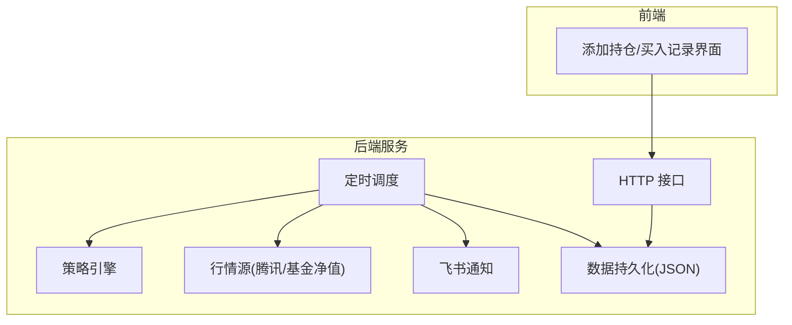
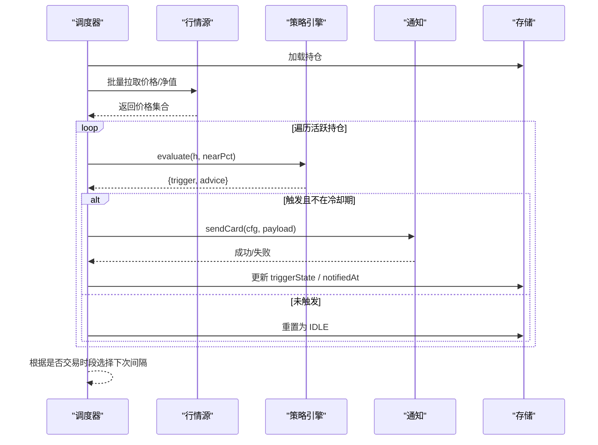
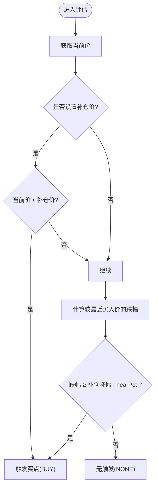
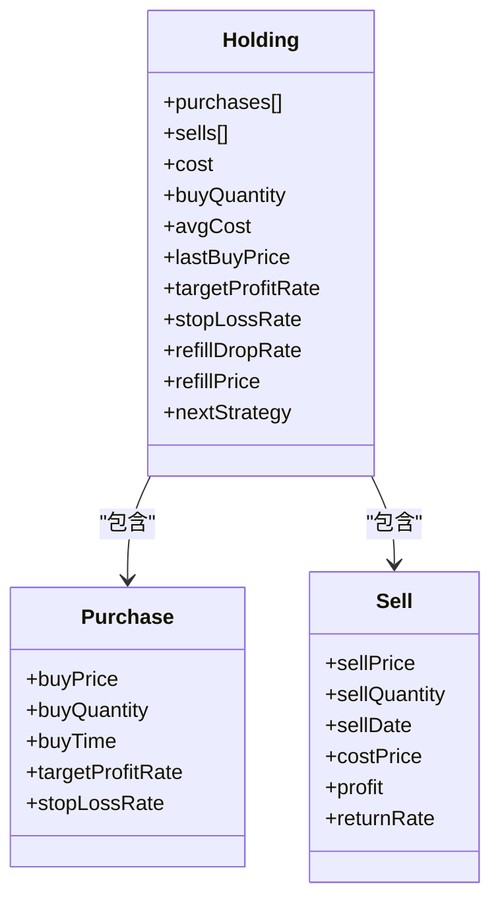
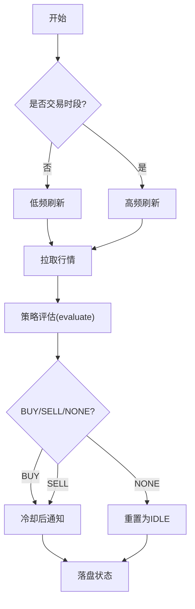
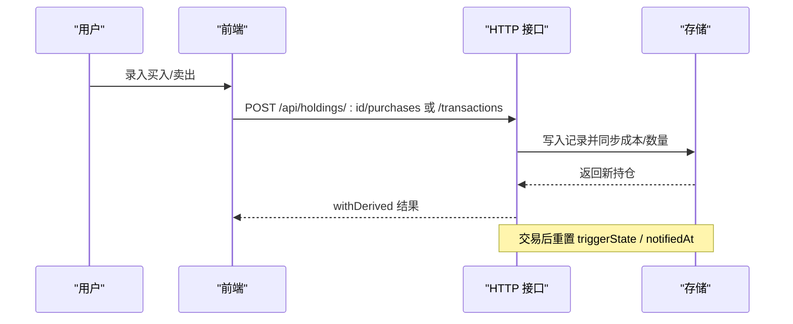
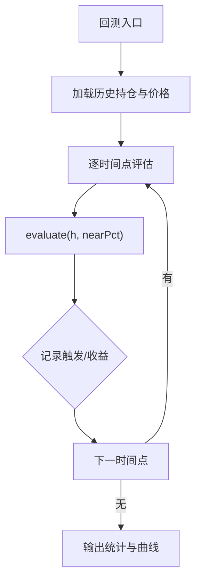
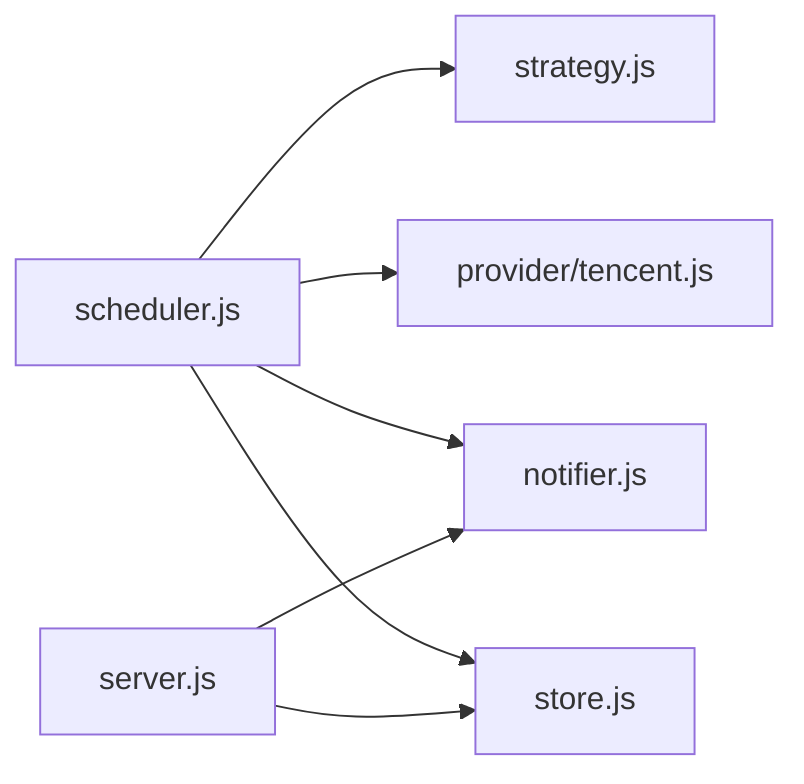

# 补仓计划策略

<cite>
**本文引用的文件**
- [server/strategy.js](file://server/strategy.js)
- [server/scheduler.js](file://server/scheduler.js)
- [server/server.js](file://server/server.js)
- [server/store.js](file://server/store.js)
- [server/provider/tencent.js](file://server/provider/tencent.js)
- [server/notifier.js](file://server/notifier.js)
- [config.json](file://config.json)
- [data/holdings.json](file://data/holdings.json)
- [web/src/components/AddHoldingModal.vue](file://web/src/components/AddHoldingModal.vue)
- [web/src/components/BuyRecordModal.vue](file://web/src/components/BuyRecordModal.vue)
- [docs/项目计划.md](file://docs/项目计划.md)
- [docs/盈亏计算规则.md](file://docs/盈亏计算规则.md)
</cite>

## 目录
1. [简介](#简介)
2. [项目结构](#项目结构)
3. [核心组件](#核心组件)
4. [架构总览](#架构总览)
5. [详细组件分析](#详细组件分析)
6. [依赖关系分析](#依赖关系分析)
7. [性能与可靠性](#性能与可靠性)
8. [故障排查指南](#故障排查指南)
9. [结论](#结论)
10. [附录：配置示例与回测建议](#附录配置示例与回测建议)

## 简介
本文件围绕“补仓计划策略”进行系统化说明，覆盖触发条件、资金分配与仓位管理、时机判断逻辑、执行流程、效果跟踪与回测、异常恢复等。系统通过定时调度抓取行情，基于持仓的多笔买入记录计算成本均价与最近买入价，结合固定补仓价与动态跌幅比例判定买点；同时集成止盈止损与日涨跌告警，并通过飞书机器人推送提醒。

## 项目结构
- 服务端提供 HTTP API、定时任务调度、行情抓取、策略评估、通知推送与数据持久化。
- 前端提供添加持仓、录入买入记录、查看交易流水与汇总指标的能力。
- 配置文件集中管理调度间隔、服务端口、飞书 Webhook 与冷却参数。
- 数据层以 JSON 文件持久化持仓与交易记录，支持多次买入记录模型与 LIFO 卖出成本计算。

图表来源
- [server/server.js:409-565](file://server/server.js#L409-L565)
- [server/scheduler.js:65-165](file://server/scheduler.js#L65-L165)
- [server/strategy.js:34-90](file://server/strategy.js#L34-L90)
- [server/provider/tencent.js:6-41](file://server/provider/tencent.js#L6-L41)
- [server/notifier.js:81-111](file://server/notifier.js#L81-L111)
- [server/store.js:40-69](file://server/store.js#L40-L69)

章节来源
- [server/server.js:409-565](file://server/server.js#L409-L565)
- [server/scheduler.js:65-165](file://server/scheduler.js#L65-L165)
- [server/strategy.js:34-90](file://server/strategy.js#L34-L90)
- [server/provider/tencent.js:6-41](file://server/provider/tencent.js#L6-L41)
- [server/notifier.js:81-111](file://server/notifier.js#L81-L111)
- [server/store.js:40-69](file://server/store.js#L40-L69)

## 核心组件
- 策略引擎：基于多笔买入记录计算加权止盈/止损阈值，并以最近买入价为基准计算跌幅，触发补仓或卖点。
- 调度器：按市场交易时段选择刷新频率，批量拉取行情，调用策略评估并发送通知。
- 数据层：内存缓存 + JSON 文件持久化，串行写盘避免并发冲突，自动迁移旧模型。
- 通知模块：构建飞书卡片消息，支持签名与重试。
- 行情源：腾讯财经 A/港/美股报价与昨收，基金净值独立适配。

章节来源
- [server/strategy.js:5-32](file://server/strategy.js#L5-L32)
- [server/scheduler.js:65-165](file://server/scheduler.js#L65-L165)
- [server/store.js:24-69](file://server/store.js#L24-L69)
- [server/notifier.js:81-111](file://server/notifier.js#L81-L111)
- [server/provider/tencent.js:6-41](file://server/provider/tencent.js#L6-L41)

## 架构总览
补仓策略在调度循环中运行：读取持仓 → 获取行情 → 计算收益/跌幅 → 评估买点/卖点 → 冷却去重 → 推送通知 → 落盘状态。

图表来源
- [server/scheduler.js:65-165](file://server/scheduler.js#L65-L165)
- [server/strategy.js:34-90](file://server/strategy.js#L34-L90)
- [server/notifier.js:81-111](file://server/notifier.js#L81-L111)
- [server/store.js:40-69](file://server/store.js#L40-L69)

## 详细组件分析

### 补仓触发条件
- 固定补仓价：当当前价低于等于配置的补仓价时触发买点。
- 动态跌幅比例：以最近一次买入价为基准计算跌幅，当跌幅达到或接近配置的补仓降幅（考虑 nearPct 容差）时触发买点。
- 参考机制：使用最近买入价作为基准，确保补仓决策对最新建仓成本敏感。
- 容差控制：nearPct 用于“接近即触发”，避免频繁抖动。

图表来源
- [server/strategy.js:73-87](file://server/strategy.js#L73-L87)
- [config.json:14-17](file://config.json#L14-L17)

章节来源
- [server/strategy.js:73-87](file://server/strategy.js#L73-L87)
- [config.json:14-17](file://config.json#L14-L17)

### 资金分配算法与仓位管理
- 分批建仓：每笔买入记录独立保存，支持不同日期、价格、数量与各自止盈/止损比例。
- 成本均价：按所有买入记录的加权平均计算，用于整体收益率评估。
- 剩余仓位：总买入数量减去累计卖出数量；剩余成本按 LIFO 扣减卖出部分成本。
- 风险控制：单笔买入可设止损比例；整体加权止损阈值用于统一风控。
- 仓位管理字段：持仓级 refillDropRate、refillPrice、nextStrategy 用于指导后续操作。

图表来源
- [server/server.js:247-284](file://server/server.js#L247-L284)
- [server/server.js:346-407](file://server/server.js#L346-L407)
- [docs/盈亏计算规则.md:50-93](file://docs/盈亏计算规则.md#L50-L93)

章节来源
- [server/server.js:247-284](file://server/server.js#L247-L284)
- [server/server.js:346-407](file://server/server.js#L346-L407)
- [docs/盈亏计算规则.md:50-93](file://docs/盈亏计算规则.md#L50-L93)

### 补仓时机判断逻辑
- 市场趋势分析：调度器依据市场本地时间判断交易时段，非交易时段降频刷新，减少无效计算。
- 技术面信号：以最近买入价为基准的跌幅阈值作为主要信号；近阈容差 nearPct 提升稳定性。
- 基本面评估：策略层不直接接入基本面数据，但可通过 nextStrategy 字段记录策略意图，配合人工决策。
- 综合输出：evaluate 返回 BUY/SELL/NONE，并附带建议文案与下阶段策略提示。

图表来源
- [server/scheduler.js:37-63](file://server/scheduler.js#L37-L63)
- [server/scheduler.js:65-165](file://server/scheduler.js#L65-L165)
- [server/strategy.js:34-90](file://server/strategy.js#L34-L90)

章节来源
- [server/scheduler.js:37-63](file://server/scheduler.js#L37-L63)
- [server/scheduler.js:65-165](file://server/scheduler.js#L65-L165)
- [server/strategy.js:34-90](file://server/strategy.js#L34-L90)

### 补仓执行流程
- 自动下单接口：当前版本未实现自动下单，仅生成结构化提醒，由用户手动执行。
- 交易确认：通过前端录入买入/卖出记录，后端校验并写入 purchases/sells。
- 持仓更新：每次交易后重新计算剩余成本/数量/均价，并重置触发态以便下一轮评估。

图表来源
- [server/server.js:467-543](file://server/server.js#L467-L543)
- [server/server.js:346-407](file://server/server.js#L346-L407)

章节来源
- [server/server.js:467-543](file://server/server.js#L467-L543)
- [server/server.js:346-407](file://server/server.js#L346-L407)

### 补仓效果跟踪
- 成本摊薄：新增买入后，加权均价下降，未实现盈亏改善。
- 收益分析：持有收益 = 未实现盈亏 + 已实现盈亏；收益率分母为总买入成本。
- 策略回测：可基于历史 holdings.json 与价格序列回放 evaluate 过程，统计触发次数、成功率与收益曲线。

[此图为概念性流程图，无需源码映射]

章节来源
- [docs/盈亏计算规则.md:96-145](file://docs/盈亏计算规则.md#L96-L145)
- [server/strategy.js:34-90](file://server/strategy.js#L34-L90)

### 补仓策略配置示例
- 保守型：较小补仓降幅（如 3%），较高补仓价保护，较大止盈目标，严格止损。
- 平衡型：适中补仓降幅（如 5%），适度补仓价，均衡止盈止损。
- 激进型：较大补仓降幅（如 10%+），放宽补仓价，允许更大波动。

可在添加持仓界面设置 refillDropRate、refillPrice、targetProfitRate、stopLossRate 与 dailyDropAlertPct/dailyRiseAlertPct。

章节来源
- [web/src/components/AddHoldingModal.vue:117-140](file://web/src/components/AddHoldingModal.vue#L117-L140)
- [server/server.js:302-344](file://server/server.js#L302-L344)

## 依赖关系分析
- 调度器依赖策略引擎、行情源、通知与存储。
- 策略引擎依赖持仓数据与 nearPct 配置。
- 通知模块依赖飞书 Webhook 与签名配置。
- 存储模块负责并发安全与数据迁移。

图表来源
- [server/scheduler.js:1-6](file://server/scheduler.js#L1-L6)
- [server/server.js:1-8](file://server/server.js#L1-L8)

章节来源
- [server/scheduler.js:1-6](file://server/scheduler.js#L1-L6)
- [server/server.js:1-8](file://server/server.js#L1-L8)

## 性能与可靠性
- 交易时段自适应：交易时段高频刷新，非交易时段降频，降低资源消耗。
- 并发安全：内存缓存 + 串行写盘，避免竞态与覆盖。
- 去重与冷却：同一触发态在冷却期内不重复通知，防止刷屏。
- 降级与重试：行情抓取失败记录日志并跳过；通知失败最多重试三次。

章节来源
- [server/scheduler.js:58-63](file://server/scheduler.js#L58-L63)
- [server/scheduler.js:135-141](file://server/scheduler.js#L135-L141)
- [server/store.js:61-69](file://server/store.js#L61-L69)
- [server/notifier.js:96-111](file://server/notifier.js#L96-L111)

## 故障排查指南
- 无行情：若某品种无价格返回，调度器会跳过并记录警告，检查代码与地区前缀是否正确。
- 通知失败：检查飞书 Webhook 与 secret 配置，查看错误日志；必要时调整冷却时长。
- 数据不一致：确认 purchases/sells 是否完整，必要时通过 CSV 导入修复。
- 误触发：调整 nearPct、refillDropRate、refillPrice 或冷却时间，观察触发频率变化。

章节来源
- [server/scheduler.js:77-86](file://server/scheduler.js#L77-L86)
- [server/notifier.js:81-111](file://server/notifier.js#L81-L111)
- [server/server.js:416-435](file://server/server.js#L416-L435)

## 结论
本系统的补仓计划策略以“固定补仓价 + 动态跌幅比例”为核心，结合最近买入价与 nearPct 容差，形成稳健的买点判断；通过多笔买入记录与 LIFO 卖出成本计算，实现精细化的成本摊薄与收益分析。调度器按市场时段自适应刷新，通知模块提供可靠提醒。未来可扩展自动下单、更多行情源与回测工具，进一步提升自动化程度与策略验证能力。

## 附录：配置示例与回测建议
- 配置要点
  - schedule.intervalSeconds：交易时段刷新间隔
  - schedule.offHoursIntervalSeconds：非交易时段刷新间隔
  - notify.cooldownSeconds：通知冷却时长
  - notify.nearThresholdPct：近阈容差
  - feishu.webhook / secret：飞书通知通道
- 回测建议
  - 基于 holdings.json 与历史价格，逐点运行 evaluate，统计触发次数、成功率与收益曲线。
  - 对比不同 risk profile 下的 refillDropRate/refillPrice 组合，选择最优参数。

章节来源
- [config.json:1-18](file://config.json#L1-L18)
- [docs/项目计划.md:102-108](file://docs/项目计划.md#L102-L108)