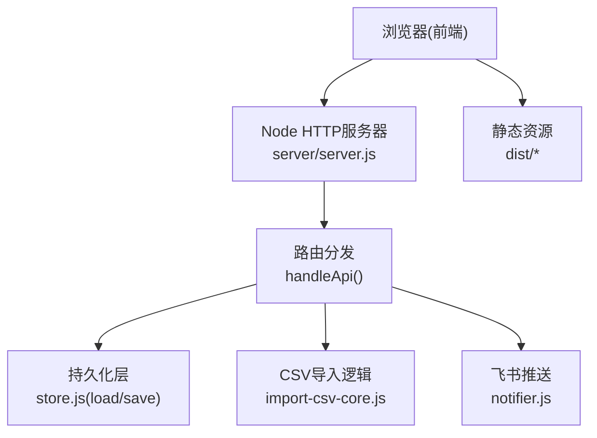
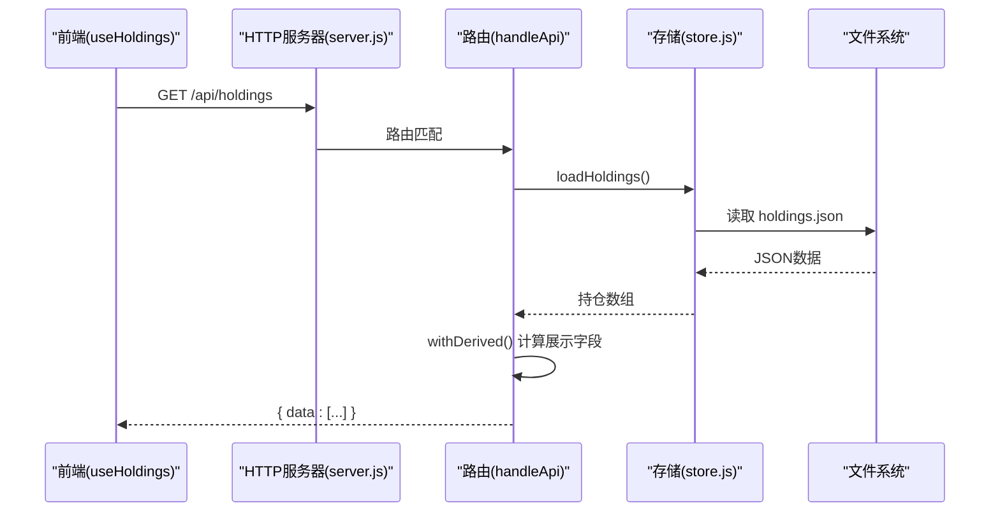
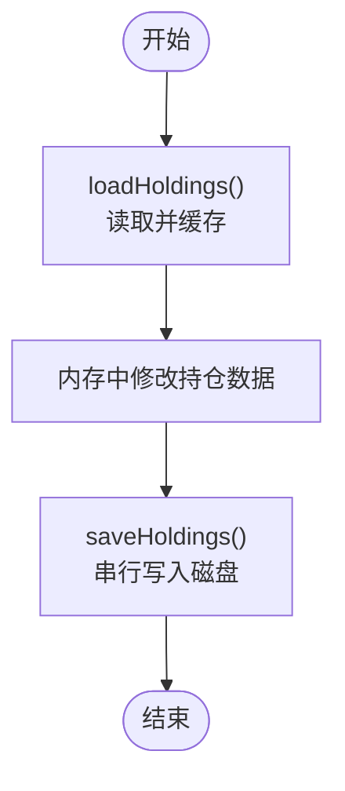
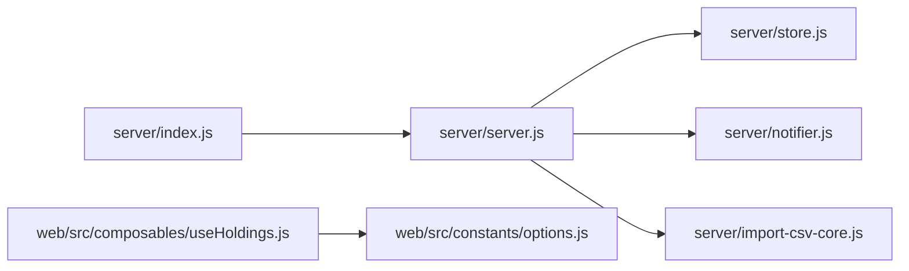
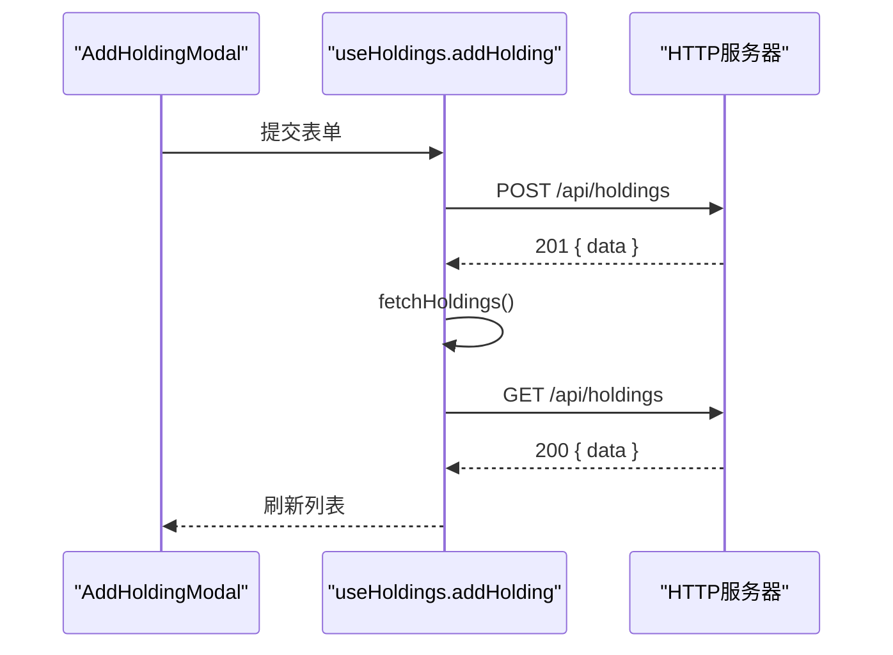
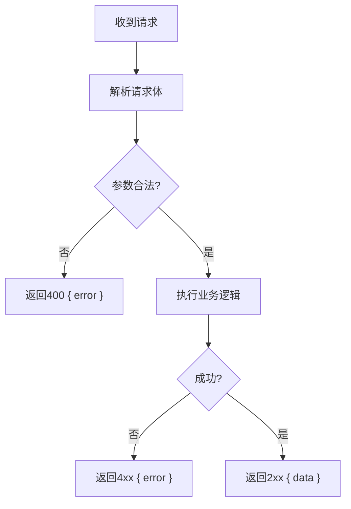

# API通信机制

<cite>
**本文引用的文件**
- [server/server.js](file://server/server.js)
- [server/index.js](file://server/index.js)
- [server/store.js](file://server/store.js)
- [server/config.js](file://server/config.js)
- [web/src/composables/useHoldings.js](file://web/src/composables/useHoldings.js)
- [web/src/constants/options.js](file://web/src/constants/options.js)
- [web/src/components/AddHoldingModal.vue](file://web/src/components/AddHoldingModal.vue)
- [web/src/components/TransactionModal.vue](file://web/src/components/TransactionModal.vue)
- [config.json](file://config.json)
- [package.json](file://package.json)
</cite>

## 目录
1. [简介](#简介)
2. [项目结构](#项目结构)
3. [核心组件](#核心组件)
4. [架构总览](#架构总览)
5. [详细组件分析](#详细组件分析)
6. [依赖关系分析](#依赖关系分析)
7. [性能与一致性](#性能与一致性)
8. [故障排查指南](#故障排查指南)
9. [结论](#结论)
10. [附录：API规范与示例](#附录api规范与示例)

## 简介
本文件面向Stock Advisor系统的API通信机制，聚焦前后端RESTful接口的设计模式、HTTP请求/响应格式、错误处理、数据验证规则、路由设计原则（如/api/holdings等）、跨域策略、请求拦截与响应包装、批量操作与事务一致性、并发控制，以及完整的调用示例和调试方法。目标是帮助开发者快速理解并高效联调。

## 项目结构
系统采用“Node后端 + Vue前端”的单体部署方式：
- 后端通过原生http模块提供静态页面托管与REST接口；
- 前端使用Vue构建SPA，通过fetch调用后端/api/*接口；
- 数据存储为本地JSON文件，由store模块提供内存缓存与串行写入；
- 配置集中管理于config.json。

图表来源
- [server/server.js:35-58](file://server/server.js#L35-L58)
- [server/server.js:409-565](file://server/server.js#L409-L565)
- [server/store.js:40-70](file://server/store.js#L40-L70)

章节来源
- [server/index.js:1-17](file://server/index.js#L1-L17)
- [server/server.js:567-594](file://server/server.js#L567-L594)
- [config.json:1-19](file://config.json#L1-L19)
- [package.json:1-32](file://package.json#L1-L32)

## 核心组件
- 路由与处理器：统一入口在server/server.js中，所有/api/*请求由handleApi集中分发。
- 数据存取：store.js提供loadHoldings/saveHoldings，内置内存缓存与串行写盘，避免并发覆盖。
- 前端通信：useHoldings.js封装了所有API调用，包含自动刷新、错误提示与列表刷新。
- 配置加载：config.js读取根目录config.json，供调度器与服务器使用。

章节来源
- [server/server.js:409-565](file://server/server.js#L409-L565)
- [server/store.js:40-70](file://server/store.js#L40-L70)
- [web/src/composables/useHoldings.js:15-154](file://web/src/composables/useHoldings.js#L15-L154)
- [server/config.js:7-10](file://server/config.js#L7-L10)

## 架构总览
后端以单进程http服务承载静态资源与API，前端通过同域或同源访问/api路径。由于未显式设置CORS头，默认仅允许同源访问；若需跨域，需在服务器层添加Access-Control-Allow-*头。

图表来源
- [server/server.js:409-414](file://server/server.js#L409-L414)
- [server/store.js:40-59](file://server/store.js#L40-L59)
- [web/src/composables/useHoldings.js:15-29](file://web/src/composables/useHoldings.js#L15-L29)

## 详细组件分析

### 路由设计与协议
- 基础约定
  - 所有API以/api开头；非/api且GET的请求返回静态页面（SPA兜底）。
  - 统一JSON响应：成功返回{ data }，失败返回{ error }。
  - 状态码：200/201表示成功，400参数错误，404资源不存在，500服务端异常。
  - Content-Type：application/json; charset=utf-8。
  - 请求体：JSON字符串，需设置Content-Type: application/json。

- 核心路由
  - GET /api/holdings：获取全部持仓（含派生字段）。
  - POST /api/holdings：新建持仓（买入建仓），支持附带purchases。
  - PATCH /api/holdings/:id：更新持仓级字段（如日涨跌告警阈值）。
  - POST /api/holdings/:id/purchases：追加买入记录。
  - PATCH /api/holdings/:id/purchases/:pid：修改某条买入记录的止盈/止损等。
  - DELETE /api/holdings/:id/purchases/:pid：删除某条买入记录。
  - POST /api/holdings/:id/transactions：兼容旧接口，提交买入/卖出交易。
  - POST /api/import-csv：批量导入CSV买卖记录。
  - POST /api/test-feishu：测试飞书机器人推送。

- 请求/响应示例（说明性）
  - 创建持仓
    - 请求：POST /api/holdings，body包含name、code、region、type等必填字段，可选strategy、targetProfitRate、stopLossRate等。
    - 响应：201 { data: 新持仓对象(withDerived后的展示字段) }
  - 追加买入
    - 请求：POST /api/holdings/:id/purchases，body包含buyPrice、buyQuantity、buyTime等。
    - 响应：200 { data: 更新后的持仓对象 }
  - 提交交易
    - 请求：POST /api/holdings/:id/transactions，body包含type(BUY/SELL)、price、quantity、date。
    - 响应：200 { data: 更新后的持仓对象 }
  - 导入CSV
    - 请求：POST /api/import-csv，body包含csv文本与createMissing布尔值。
    - 响应：200 { data: 导入结果摘要 }

章节来源
- [server/server.js:409-565](file://server/server.js#L409-L565)
- [web/src/composables/useHoldings.js:67-130](file://web/src/composables/useHoldings.js#L67-L130)

### 数据模型与验证规则
- 持仓创建必填字段：name、code、region、type；缺失将返回400错误。
- 买入记录校验：buyPrice与buyQuantity必须为正数；否则返回400错误。
- 交易校验：quantity与price必须为正；type必须为BUY或SELL；否则返回400错误。
- 导出字段：withDerived会计算成本、市值、盈亏、收益率、今日收益、均价、目标价/止损价等，供前端展示。

章节来源
- [server/server.js:286-344](file://server/server.js#L286-L344)
- [server/server.js:346-407](file://server/server.js#L346-L407)
- [server/server.js:146-245](file://server/server.js#L146-L245)

### 跨域请求处理
- 当前实现未显式设置CORS头，默认仅允许同源访问。
- 如需跨域，请在服务器入口处为/api/*响应添加Access-Control-Allow-Origin、Access-Control-Allow-Methods、Access-Control-Allow-Headers等头，并在OPTIONS预检时正确响应。

[本节为通用建议，不直接分析具体代码]

### 请求拦截器与响应包装器
- 后端：统一通过sendJSON输出JSON，错误统一返回{ error }，异常捕获后返回500。
- 前端：useHoldings中对每个写操作进行res.ok判断，若失败则抛出错误信息；读操作在catch中设置error状态。

章节来源
- [server/server.js:55-58](file://server/server.js#L55-L58)
- [server/server.js:571-586](file://server/server.js#L571-L586)
- [web/src/composables/useHoldings.js:15-29](file://web/src/composables/useHoldings.js#L15-L29)
- [web/src/composables/useHoldings.js:67-130](file://web/src/composables/useHoldings.js#L67-L130)

### 批量操作、事务与并发控制
- 批量导入：/api/import-csv接收CSV文本，按代码匹配已有明细，忽略重复项，必要时可创建缺失持仓。
- 事务语义：每次写操作先loadHoldings，再在内存中修改，最后saveHoldings落盘；同一时间只有一份内存缓存，保证读写一致。
- 并发控制：store.js维护writeChain串行队列，确保多次写入不会互相覆盖；同时通过mtime检测外部文件变更，避免覆盖手动编辑。

图表来源
- [server/store.js:40-70](file://server/store.js#L40-L70)

章节来源
- [server/server.js:416-435](file://server/server.js#L416-L435)
- [server/store.js:40-70](file://server/store.js#L40-L70)

### 实时数据获取
- 前端通过useHoldings.startAutoRefresh启动定时器，每REFRESH_MS毫秒调用GET /api/holdings刷新数据。
- 后端返回的数据已包含派生字段，无需前端二次计算。

章节来源
- [web/src/composables/useHoldings.js:35-43](file://web/src/composables/useHoldings.js#L35-L43)
- [web/src/constants/options.js:31-33](file://web/src/constants/options.js#L31-L33)
- [server/server.js:409-414](file://server/server.js#L409-L414)

## 依赖关系分析
- server/index.js负责加载配置、启动服务器与调度器。
- server/server.js依赖store.js进行数据存取，依赖notifier.js发送飞书消息，依赖import-csv-core.js解析CSV。
- 前端useHoldings.js依赖constants/options.js中的刷新间隔与枚举。

图表来源
- [server/index.js:1-17](file://server/index.js#L1-L17)
- [server/server.js:1-8](file://server/server.js#L1-L8)
- [web/src/composables/useHoldings.js:1-3](file://web/src/composables/useHoldings.js#L1-L3)

章节来源
- [server/index.js:1-17](file://server/index.js#L1-L17)
- [server/server.js:1-8](file://server/server.js#L1-L8)
- [web/src/composables/useHoldings.js:1-3](file://web/src/composables/useHoldings.js#L1-L3)

## 性能与一致性
- 内存缓存：loadHoldings仅在首次或文件mtime变化时重读磁盘，减少IO。
- 串行写入：saveHoldings通过Promise链串行执行，避免并发覆盖。
- 派生计算：withDerived在服务端完成复杂计算，降低前端负担。
- 建议：在高并发场景下，可将JSON文件替换为数据库，或使用锁机制增强一致性。

[本节为通用优化建议，不直接分析具体代码]

## 故障排查指南
- 常见错误
  - 400：参数缺失或非法（如缺少name/code/region/type、buyPrice/buyQuantity非正、quantity/price非正、type不是BUY/SELL）。
  - 404：资源不存在（持仓ID或买入记录ID无效）。
  - 500：服务端异常（如文件读写失败、JSON解析失败）。
- 定位步骤
  - 检查浏览器Network面板，确认请求URL、Method、Headers、Body与响应体。
  - 查看后端控制台日志，关注[server]与[store]前缀的错误信息。
  - 核对config.json中的server.host/port是否与启动一致。
- 工具与方法
  - 使用curl或Postman构造请求，验证接口行为。
  - 对CSV导入，确保csv字段与系统映射一致。
  - 对飞书推送，使用/api/test-feishu验证配置。

章节来源
- [server/server.js:55-58](file://server/server.js#L55-L58)
- [server/server.js:416-565](file://server/server.js#L416-L565)
- [server/store.js:62-70](file://server/store.js#L62-L70)
- [config.json:6-9](file://config.json#L6-L9)

## 结论
本系统通过简洁的REST接口与统一的响应格式，实现了持仓CRUD、交易记录、CSV批量导入与飞书通知等功能。store层的内存缓存与串行写入保障了数据一致性。前端通过composable封装API调用，提供自动刷新与错误提示。建议在需要跨域或高并发时扩展CORS与持久化方案。

[本节为总结，不直接分析具体代码]

## 附录：API规范与示例

### 接口清单
- GET /api/holdings
  - 描述：获取全部持仓（含派生字段）
  - 响应：200 { data: 数组 }
- POST /api/holdings
  - 描述：新建持仓
  - 请求体：{ name, code, region, type, ... }
  - 响应：201 { data: 对象 }
- PATCH /api/holdings/:id
  - 描述：更新持仓级字段（如dailyDropAlertPct/dailyRiseAlertPct）
  - 请求体：{ dailyDropAlertPct?: number|null, dailyRiseAlertPct?: number|null }
  - 响应：200 { data: 对象 }
- POST /api/holdings/:id/purchases
  - 描述：追加买入记录
  - 请求体：{ buyPrice, buyQuantity, buyTime? }
  - 响应：200 { data: 对象 }
- PATCH /api/holdings/:id/purchases/:pid
  - 描述：修改买入记录（价格、数量、日期、止盈/止损）
  - 请求体：{ buyPrice?, buyQuantity?, buyTime?, targetProfitRate?, stopLossRate? }
  - 响应：200 { data: 对象 }
- DELETE /api/holdings/:id/purchases/:pid
  - 描述：删除买入记录
  - 响应：200 { data: 对象 }
- POST /api/holdings/:id/transactions
  - 描述：提交买入/卖出交易（兼容旧接口）
  - 请求体：{ type: "BUY"|"SELL", price, quantity, date? }
  - 响应：200 { data: 对象 }
- POST /api/import-csv
  - 描述：批量导入CSV
  - 请求体：{ csv: string, createMissing?: boolean }
  - 响应：200 { data: 导入结果 }
- POST /api/test-feishu
  - 描述：测试飞书推送
  - 响应：200 { ok: true, data } 或 502 { error }

章节来源
- [server/server.js:409-565](file://server/server.js#L409-L565)

### 调用示例（说明性）
- 创建持仓
  - curl -X POST http://localhost:3000/api/holdings -H "Content-Type: application/json" -d '{"name":"腾讯控股","code":"00700","region":"hk","type":"股票","strategy":"long"}'
- 追加买入
  - curl -X POST http://localhost:3000/api/holdings/{id}/purchases -H "Content-Type: application/json" -d '{"buyPrice":300,"buyQuantity":100,"buyTime":"2026-01-01"}'
- 提交卖出
  - curl -X POST http://localhost:3000/api/holdings/{id}/transactions -H "Content-Type: application/json" -d '{"type":"SELL","price":320,"quantity":50,"date":"2026-01-10"}'
- 导入CSV
  - curl -X POST http://localhost:3000/api/import-csv -H "Content-Type: application/json" -d '{"csv":"...CSV内容...","createMissing":true}'

[以上为说明性示例，实际字段与行为以接口规范为准]

### 前端交互流程（序列图）

图表来源
- [web/src/components/AddHoldingModal.vue:38-63](file://web/src/components/AddHoldingModal.vue#L38-L63)
- [web/src/composables/useHoldings.js:67-76](file://web/src/composables/useHoldings.js#L67-L76)
- [server/server.js:437-450](file://server/server.js#L437-L450)

### 错误处理流程图

图表来源
- [server/server.js:55-58](file://server/server.js#L55-L58)
- [server/server.js:416-565](file://server/server.js#L416-L565)