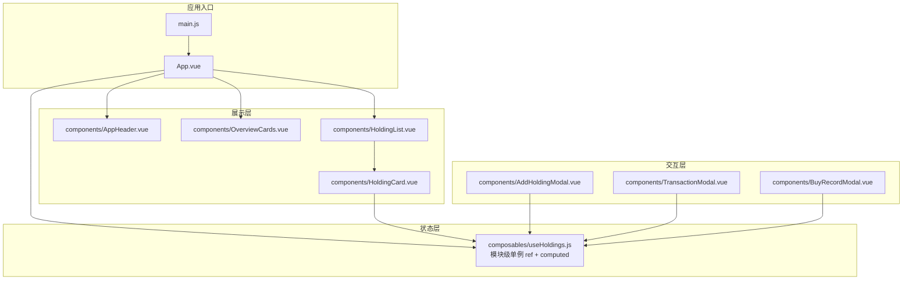
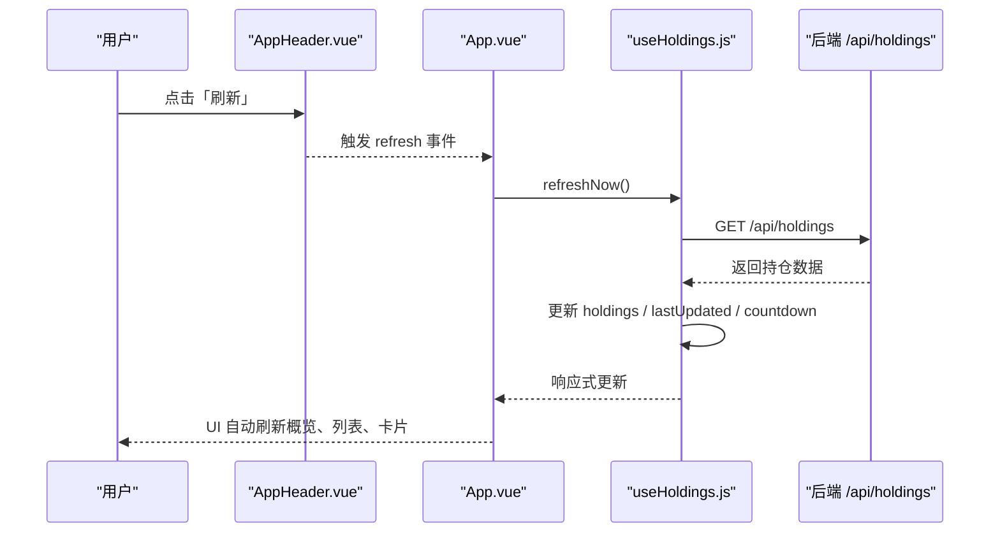
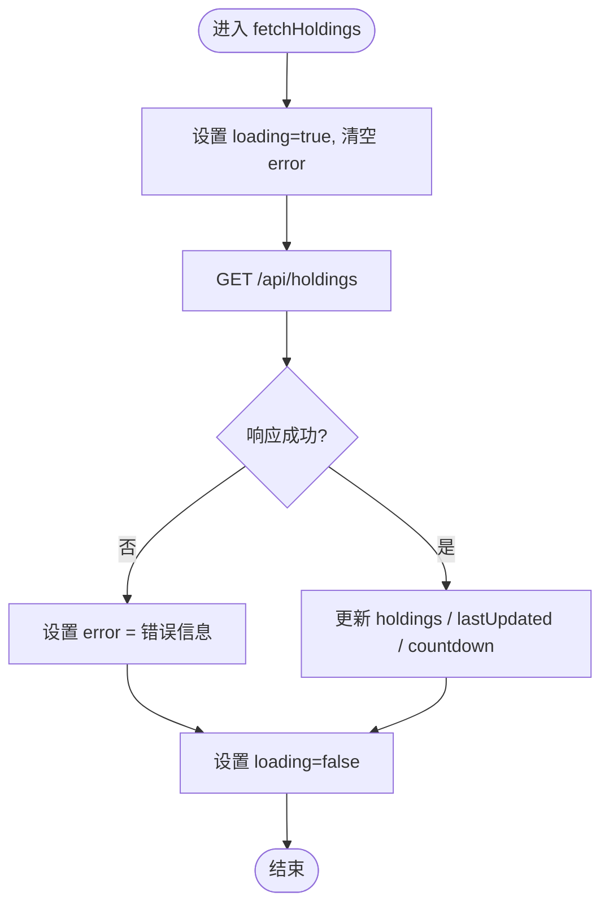
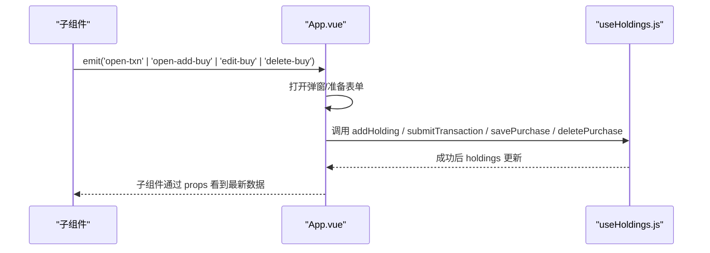
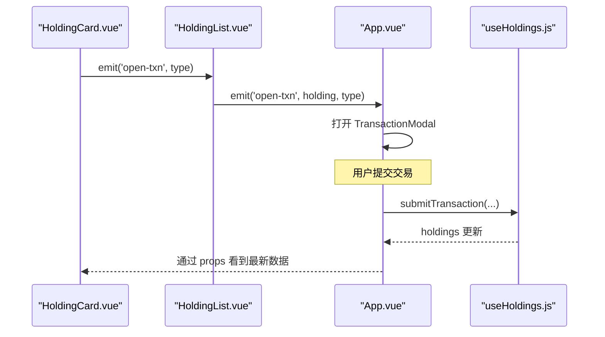
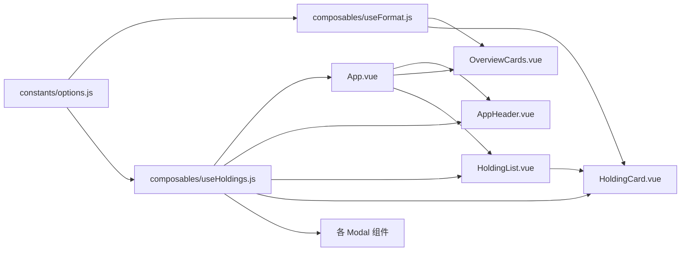

# 前端状态管理

<cite>
**本文引用的文件**
- [useHoldings.js](file://web/src/composables/useHoldings.js)
- [App.vue](file://web/src/App.vue)
- [HoldingList.vue](file://web/src/components/HoldingList.vue)
- [HoldingCard.vue](file://web/src/components/HoldingCard.vue)
- [OverviewCards.vue](file://web/src/components/OverviewCards.vue)
- [AppHeader.vue](file://web/src/components/AppHeader.vue)
- [AddHoldingModal.vue](file://web/src/components/AddHoldingModal.vue)
- [TransactionModal.vue](file://web/src/components/TransactionModal.vue)
- [BuyRecordModal.vue](file://web/src/components/BuyRecordModal.vue)
- [useFormat.js](file://web/src/composables/useFormat.js)
- [options.js](file://web/src/constants/options.js)
- [main.js](file://web/src/main.js)
</cite>

## 目录
1. [简介](#简介)
2. [项目结构](#项目结构)
3. [核心组件](#核心组件)
4. [架构总览](#架构总览)
5. [详细组件分析](#详细组件分析)
6. [依赖关系分析](#依赖关系分析)
7. [性能考量](#性能考量)
8. [故障排查指南](#故障排查指南)
9. [结论](#结论)
10. [附录](#附录)

## 简介
本文件面向 Stock Advisor 的前端状态管理，聚焦 Vue 3 Composition API 下的组合式函数 useHoldings 的实现原理、响应式数据绑定机制与跨组件状态共享策略。文档将系统说明持仓数据的获取、缓存与更新流程（含与后端 API 的交互模式、错误处理与数据同步），解释组件如何监听状态变化并自动更新 UI（计算属性、watchers、性能优化），以及用户操作触发的事件流链路（从点击到状态更新）。文末提供最佳实践示例路径与常见问题解决方案。

## 项目结构
前端采用“组合式函数 + 单例模块级状态”的模式：
- 组合式函数 useHoldings 维护全局唯一的持仓状态（ref 单例），通过 computed 暴露汇总指标，并提供统一的写操作方法。
- App 作为根容器，负责生命周期内启动自动刷新、挂载主题、集中处理弹窗与过滤逻辑。
- 子组件仅消费状态或派发事件，不直接持有业务状态，保证低耦合与高内聚。

图表来源
- [main.js:1-6](file://web/src/main.js#L1-L6)
- [App.vue:1-197](file://web/src/App.vue#L1-L197)
- [useHoldings.js:1-154](file://web/src/composables/useHoldings.js#L1-L154)
- [AppHeader.vue:1-64](file://web/src/components/AppHeader.vue#L1-L64)
- [OverviewCards.vue:1-41](file://web/src/components/OverviewCards.vue#L1-L41)
- [HoldingList.vue:1-36](file://web/src/components/HoldingList.vue#L1-L36)
- [HoldingCard.vue:1-161](file://web/src/components/HoldingCard.vue#L1-L161)
- [AddHoldingModal.vue:1-151](file://web/src/components/AddHoldingModal.vue#L1-L151)
- [TransactionModal.vue:1-81](file://web/src/components/TransactionModal.vue#L1-L81)
- [BuyRecordModal.vue:1-94](file://web/src/components/BuyRecordModal.vue#L1-L94)

章节来源
- [main.js:1-6](file://web/src/main.js#L1-L6)
- [App.vue:1-197](file://web/src/App.vue#L1-L197)

## 核心组件
- useHoldings：模块级单例状态与业务方法中心，封装数据获取、写入、自动刷新与汇总计算。
- App：编排页面生命周期、主题、过滤、弹窗与事件分发。
- HoldingList / HoldingCard：列表与卡片渲染，透传事件至父级。
- OverviewCards：基于 computed 汇总的概览指标展示。
- AppHeader：显示更新时间、加载态、错误信息、倒计时环形进度，触发刷新与主题切换等。
- AddHoldingModal / TransactionModal / BuyRecordModal：表单弹窗，调用 useHoldings 的写方法并提交后关闭。

章节来源
- [useHoldings.js:1-154](file://web/src/composables/useHoldings.js#L1-L154)
- [App.vue:1-197](file://web/src/App.vue#L1-L197)
- [HoldingList.vue:1-36](file://web/src/components/HoldingList.vue#L1-L36)
- [HoldingCard.vue:1-161](file://web/src/components/HoldingCard.vue#L1-L161)
- [OverviewCards.vue:1-41](file://web/src/components/OverviewCards.vue#L1-L41)
- [AppHeader.vue:1-64](file://web/src/components/AppHeader.vue#L1-L64)
- [AddHoldingModal.vue:1-151](file://web/src/components/AddHoldingModal.vue#L1-L151)
- [TransactionModal.vue:1-81](file://web/src/components/TransactionModal.vue#L1-L81)
- [BuyRecordModal.vue:1-94](file://web/src/components/BuyRecordModal.vue#L1-L94)

## 架构总览
整体采用“组合式函数单例 + 组件单向数据流”的架构：
- 单一真相源：useHoldings 中的模块级 ref 是全局唯一的数据源，所有组件通过解构使用。
- 读多写少：读取通过 computed 派生汇总；写操作统一在 useHoldings 中完成，并在成功后拉取最新数据以保持一致性。
- 自动刷新：使用 setInterval 驱动倒计时与定时刷新，避免多定时器漂移。
- 事件冒泡：子组件通过 emit 向上抛出事件，由 App 统一处理并调用 useHoldings 的方法。

图表来源
- [AppHeader.vue:1-64](file://web/src/components/AppHeader.vue#L1-L64)
- [App.vue:1-197](file://web/src/App.vue#L1-L197)
- [useHoldings.js:1-154](file://web/src/composables/useHoldings.js#L1-L154)

## 详细组件分析

### 组合式函数 useHoldings：状态管理与数据流
- 状态设计
  - holdings：模块级 ref，存储持仓数组，作为全局唯一数据源。
  - lastUpdated：记录最近一次更新时间字符串。
  - loading/error：请求态与错误信息。
  - countdown：自动刷新倒计时秒数。
- 计算属性
  - totalCost / totalMarket / totalHoldingProfit / totalTodayProfit：对 holdings 进行 reduce 聚合，用于概览展示。
- 数据获取与缓存
  - fetchHoldings：发起 GET /api/holdings，成功后更新 holdings、lastUpdated，并重置倒计时。
  - startAutoRefresh / stopAutoRefresh：单一定时器每秒递减 countdown，归零时触发 fetchHoldings，避免多定时器漂移。
- 写操作与一致性
  - addHolding：POST /api/holdings，成功后重新拉取列表。
  - submitTransaction：POST /api/holdings/{id}/transactions，成功后重新拉取列表。
  - savePurchase：PATCH/POST /api/holdings/{id}/purchases[/{pid}]，成功后重新拉取列表。
  - deletePurchase：DELETE /api/holdings/{id}/purchases/{p.id}，成功后重新拉取列表。
  - updateHolding：PATCH /api/holdings/{id}，成功后重新拉取列表。
- 错误处理
  - 网络或业务错误统一捕获，设置 error 消息，loading 最终置为 false。
  - 删除等操作失败时 alert 提示并中断后续流程。

图表来源
- [useHoldings.js:15-29](file://web/src/composables/useHoldings.js#L15-L29)

章节来源
- [useHoldings.js:1-154](file://web/src/composables/useHoldings.js#L1-L154)

### App.vue：生命周期、事件编排与过滤
- 生命周期
  - onMounted：初始化主题、首次拉取数据、启动自动刷新。
  - onUnmounted：停止自动刷新、清理测试消息定时器。
- 事件编排
  - 接收 AppHeader 的 refresh/toggle-theme/test-feishu/add/import-csv 事件并转发到对应逻辑。
  - 打开/关闭各弹窗，维护弹窗状态与表单数据。
- 过滤逻辑
  - activeFilters：类型与市场多选过滤。
  - filteredHoldings：computed 根据 activeFilters 过滤 holdings，支持地区中文名与短码映射。
- 倒计时可视化
  - progress/ringOffset：基于 countdown 与 REFRESH_MS 计算环形进度。

图表来源
- [App.vue:1-197](file://web/src/App.vue#L1-L197)
- [useHoldings.js:1-154](file://web/src/composables/useHoldings.js#L1-L154)

章节来源
- [App.vue:1-197](file://web/src/App.vue#L1-L197)

### HoldingList.vue / HoldingCard.vue：列表与卡片的事件透传与局部编辑
- HoldingList
  - 接收 holdings 数组，渲染 HoldingCard。
  - 将子组件事件带上 holding 对象透传给父级（App）。
- HoldingCard
  - 本地展开/收起明细。
  - 日涨跌告警阈值行内编辑：startEditAlert/saveAlert/cancelAlert，调用 updateHolding 并处理错误。
  - 按钮触发 open-txn/open-add-buy 事件，交由父级处理。

图表来源
- [HoldingList.vue:1-36](file://web/src/components/HoldingList.vue#L1-L36)
- [HoldingCard.vue:1-161](file://web/src/components/HoldingCard.vue#L1-L161)
- [App.vue:1-197](file://web/src/App.vue#L1-L197)
- [useHoldings.js:1-154](file://web/src/composables/useHoldings.js#L1-L154)

章节来源
- [HoldingList.vue:1-36](file://web/src/components/HoldingList.vue#L1-L36)
- [HoldingCard.vue:1-161](file://web/src/components/HoldingCard.vue#L1-L161)

### OverviewCards.vue：基于 computed 的概览指标
- 接收 totalCost / totalMarket / totalTodayProfit / totalHoldingProfit 等数值。
- 使用格式化函数 fmtMoney 与 profitCls 展示金额与红绿样式。

章节来源
- [OverviewCards.vue:1-41](file://web/src/components/OverviewCards.vue#L1-L41)
- [useFormat.js:1-70](file://web/src/composables/useFormat.js#L1-L70)

### AppHeader.vue：顶部状态与操作
- 展示 lastUpdated、loading、error、countdown。
- 触发 toggle-theme、refresh、test-feishu、add、import-csv 事件。
- 环形进度条由 App 计算的 ringC/ringOffset 传入。

章节来源
- [AppHeader.vue:1-64](file://web/src/components/AppHeader.vue#L1-L64)
- [App.vue:1-197](file://web/src/App.vue#L1-L197)

### 弹窗组件：AddHoldingModal / TransactionModal / BuyRecordModal
- AddHoldingModal：收集新增持仓表单，调用 addHolding，成功后关闭。
- TransactionModal：买入/卖出记录，调用 submitTransaction，成功后关闭。
- BuyRecordModal：添加/修改买入记录，调用 savePurchase，成功后关闭。
- 均使用 watch 监听 show 以重置表单与错误信息。

章节来源
- [AddHoldingModal.vue:1-151](file://web/src/components/AddHoldingModal.vue#L1-L151)
- [TransactionModal.vue:1-81](file://web/src/components/TransactionModal.vue#L1-L81)
- [BuyRecordModal.vue:1-94](file://web/src/components/BuyRecordModal.vue#L1-L94)

## 依赖关系分析
- 模块级单例：useHoldings 中的 holdings/ref 在模块加载时创建，所有导入该模块的组件共享同一份状态。
- 常量配置：REFRESH_MS、枚举选项集中在 options.js，便于前后端一致性与可维护性。
- 工具函数：useFormat.js 提供纯函数格式化与徽章映射，无副作用，利于复用与测试。
- 组件耦合：子组件仅依赖 props/emits，业务逻辑集中在 useHoldings，降低耦合度。

图表来源
- [options.js:1-33](file://web/src/constants/options.js#L1-L33)
- [useFormat.js:1-70](file://web/src/composables/useFormat.js#L1-L70)
- [useHoldings.js:1-154](file://web/src/composables/useHoldings.js#L1-L154)
- [App.vue:1-197](file://web/src/App.vue#L1-L197)
- [AppHeader.vue:1-64](file://web/src/components/AppHeader.vue#L1-L64)
- [OverviewCards.vue:1-41](file://web/src/components/OverviewCards.vue#L1-L41)
- [HoldingList.vue:1-36](file://web/src/components/HoldingList.vue#L1-L36)
- [HoldingCard.vue:1-161](file://web/src/components/HoldingCard.vue#L1-L161)
- [AddHoldingModal.vue:1-151](file://web/src/components/AddHoldingModal.vue#L1-L151)
- [TransactionModal.vue:1-81](file://web/src/components/TransactionModal.vue#L1-L81)
- [BuyRecordModal.vue:1-94](file://web/src/components/BuyRecordModal.vue#L1-L94)

章节来源
- [options.js:1-33](file://web/src/constants/options.js#L1-L33)
- [useFormat.js:1-70](file://web/src/composables/useFormat.js#L1-L70)
- [useHoldings.js:1-154](file://web/src/composables/useHoldings.js#L1-L154)

## 性能考量
- 单一定时器：startAutoRefresh 使用单一 setInterval 驱动倒计时与刷新，避免多定时器导致的漂移与资源浪费。
- 计算属性：totalCost/totalMarket/totalHoldingProfit/totalTodayProfit 仅在 holdings 变化时重算，减少重复计算。
- 过滤计算：filteredHoldings 基于 activeFilters 计算，仅在过滤条件或 holdings 变化时重算。
- 最小化 DOM 更新：子组件只接收必要 props，事件透传保持单向数据流，避免不必要的 re-render。
- 懒展开：HoldingCard 的明细默认折叠，减少初始渲染开销。
- 格式化函数纯函数：useFormat 的函数无副作用，易于缓存与复用。

[本节为通用性能建议，无需特定文件引用]

## 故障排查指南
- 无法获取持仓数据
  - 检查网络请求是否成功，查看 error 状态与浏览器控制台。
  - 确认后端接口 /api/holdings 可用且返回格式正确。
  - 参考实现位置：[useHoldings.js:15-29](file://web/src/composables/useHoldings.js#L15-L29)
- 自动刷新未生效
  - 确认已调用 startAutoRefresh，且在 onUnmounted 中 stopAutoRefresh。
  - 检查 REFRESH_MS 配置是否正确。
  - 参考实现位置：[useHoldings.js:35-50](file://web/src/composables/useHoldings.js#L35-L50)、[App.vue:121-129](file://web/src/App.vue#L121-L129)
- 写操作失败
  - 检查 HTTP 状态码与返回的 error 字段。
  - 确认请求体字段与后端契约一致。
  - 参考实现位置：
    - 添加持仓：[useHoldings.js:67-76](file://web/src/composables/useHoldings.js#L67-L76)
    - 交易提交：[useHoldings.js:78-92](file://web/src/composables/useHoldings.js#L78-L92)
    - 保存买入记录：[useHoldings.js:94-104](file://web/src/composables/useHoldings.js#L94-L104)
    - 删除买入记录：[useHoldings.js:106-118](file://web/src/composables/useHoldings.js#L106-L118)
    - 更新持仓字段：[useHoldings.js:120-130](file://web/src/composables/useHoldings.js#L120-L130)
- 弹窗表单未重置
  - 确保 watch(show) 在打开时重置表单与错误信息。
  - 参考实现位置：
    - AddHoldingModal：[AddHoldingModal.vue:27-36](file://web/src/components/AddHoldingModal.vue#L27-L36)
    - TransactionModal：[TransactionModal.vue:18-28](file://web/src/components/TransactionModal.vue#L18-L28)
    - BuyRecordModal：[BuyRecordModal.vue:23-35](file://web/src/components/BuyRecordModal.vue#L23-L35)

章节来源
- [useHoldings.js:15-130](file://web/src/composables/useHoldings.js#L15-L130)
- [App.vue:121-129](file://web/src/App.vue#L121-L129)
- [AddHoldingModal.vue:27-36](file://web/src/components/AddHoldingModal.vue#L27-L36)
- [TransactionModal.vue:18-28](file://web/src/components/TransactionModal.vue#L18-L28)
- [BuyRecordModal.vue:23-35](file://web/src/components/BuyRecordModal.vue#L23-L35)

## 结论
本项目通过 useHoldings 的组合式函数实现了清晰、可维护的前端状态管理：
- 模块级单例 ref 作为唯一数据源，配合 computed 派生汇总指标，保证数据一致性与高效渲染。
- 统一的写操作方法在成功后主动拉取最新数据，确保多组件视图同步。
- 自动刷新使用单一定时器，避免漂移与资源浪费。
- 组件间通过 props/emits 单向传递数据与事件，职责清晰、易于扩展。
- 错误处理覆盖网络与业务异常，提供友好的用户反馈。

[本节为总结性内容，无需特定文件引用]

## 附录

### 用户操作到状态更新的完整事件流示例
- 添加持仓
  - 用户在 AddHoldingModal 填写表单并点击保存。
  - 组件调用 useHoldings.addHolding，发送 POST /api/holdings。
  - 成功后调用 fetchHoldings 刷新列表，弹窗关闭。
  - 参考路径：[AddHoldingModal.vue:38-63](file://web/src/components/AddHoldingModal.vue#L38-L63)、[useHoldings.js:67-76](file://web/src/composables/useHoldings.js#L67-L76)
- 提交交易（买入/卖出）
  - 用户在 TransactionModal 输入价格、数量与日期。
  - 组件调用 useHoldings.submitTransaction，发送 POST /api/holdings/{id}/transactions。
  - 成功后刷新列表，弹窗关闭。
  - 参考路径：[TransactionModal.vue:30-44](file://web/src/components/TransactionModal.vue#L30-L44)、[useHoldings.js:78-92](file://web/src/composables/useHoldings.js#L78-L92)
- 保存/修改买入记录
  - 用户在 BuyRecordModal 填写买入价、数量、日期与止盈止损比例。
  - 组件调用 useHoldings.savePurchase，发送 PATCH/POST /api/holdings/{id}/purchases[/{pid}]。
  - 成功后刷新列表，弹窗关闭。
  - 参考路径：[BuyRecordModal.vue:37-53](file://web/src/components/BuyRecordModal.vue#L37-L53)、[useHoldings.js:94-104](file://web/src/composables/useHoldings.js#L94-L104)
- 删除买入记录
  - 用户在 HoldingCard 中触发删除。
  - 事件冒泡至 App，调用 useHoldings.deletePurchase，发送 DELETE /api/holdings/{id}/purchases/{p.id}。
  - 成功后刷新列表。
  - 参考路径：[HoldingCard.vue:152-157](file://web/src/components/HoldingCard.vue#L152-L157)、[App.vue:72-74](file://web/src/App.vue#L72-L74)、[useHoldings.js:106-118](file://web/src/composables/useHoldings.js#L106-L118)

### 最佳实践清单
- 使用组合式函数集中管理状态与副作用，避免分散的组件内状态。
- 写操作后统一拉取最新数据，保证多组件视图一致。
- 使用 computed 派生复杂计算，减少模板中的逻辑复杂度。
- 使用 watch 监听弹窗显示状态，及时重置表单与错误信息。
- 使用常量集中管理枚举与配置，便于前后端对齐与维护。
- 错误处理覆盖网络与业务异常，提供清晰的提示信息。

[本节为通用最佳实践，无需特定文件引用]