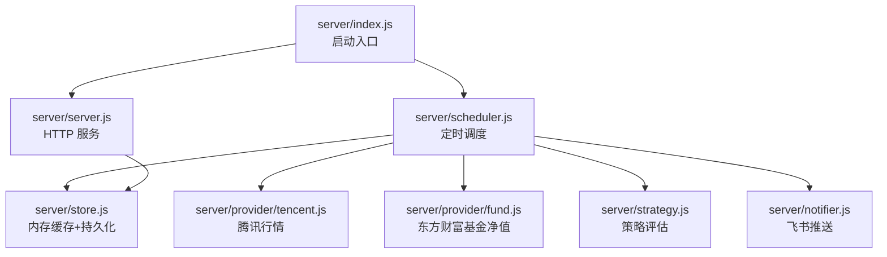
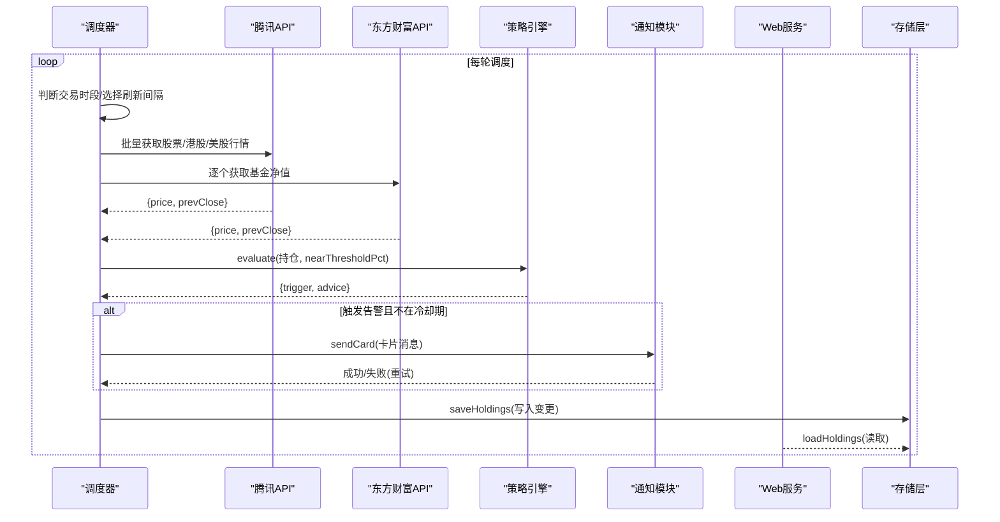
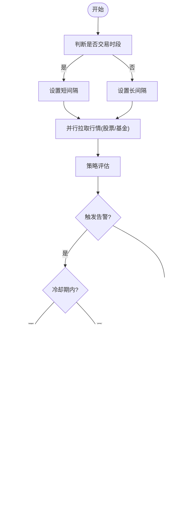
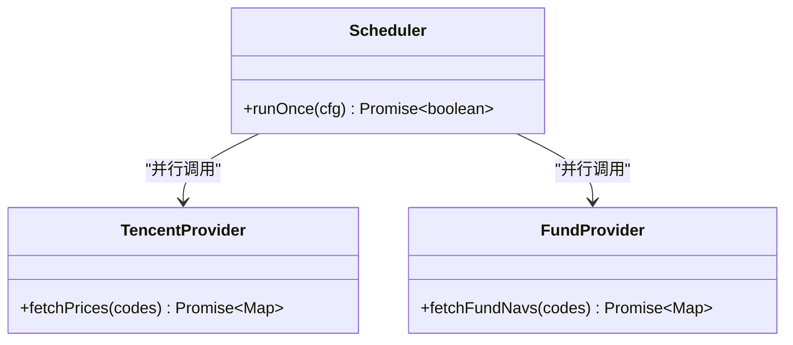
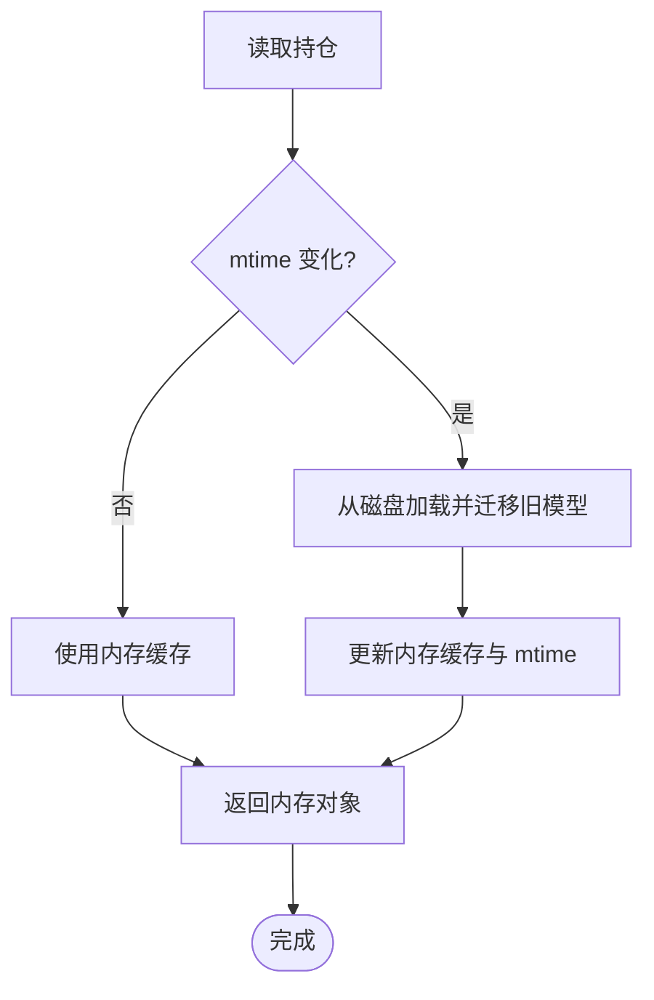
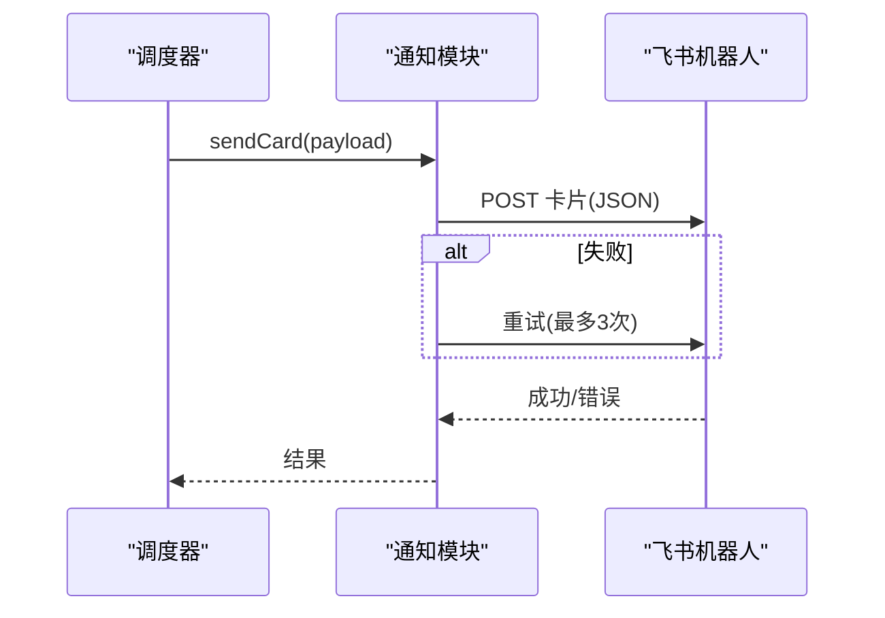
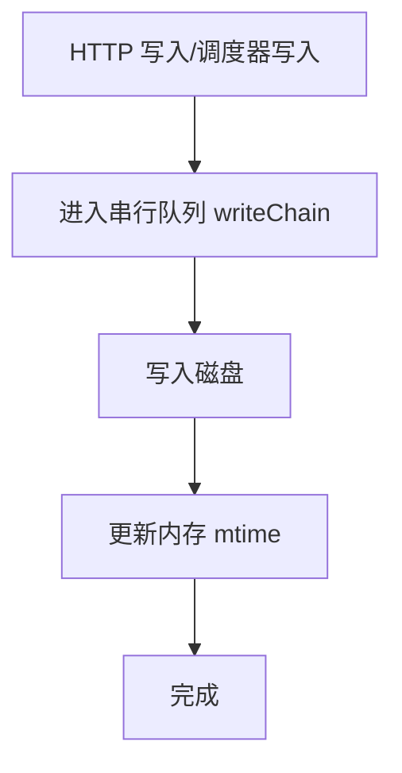
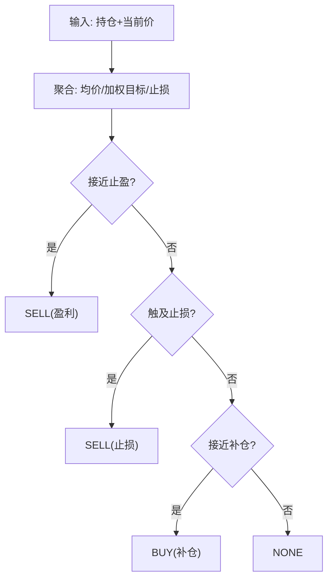
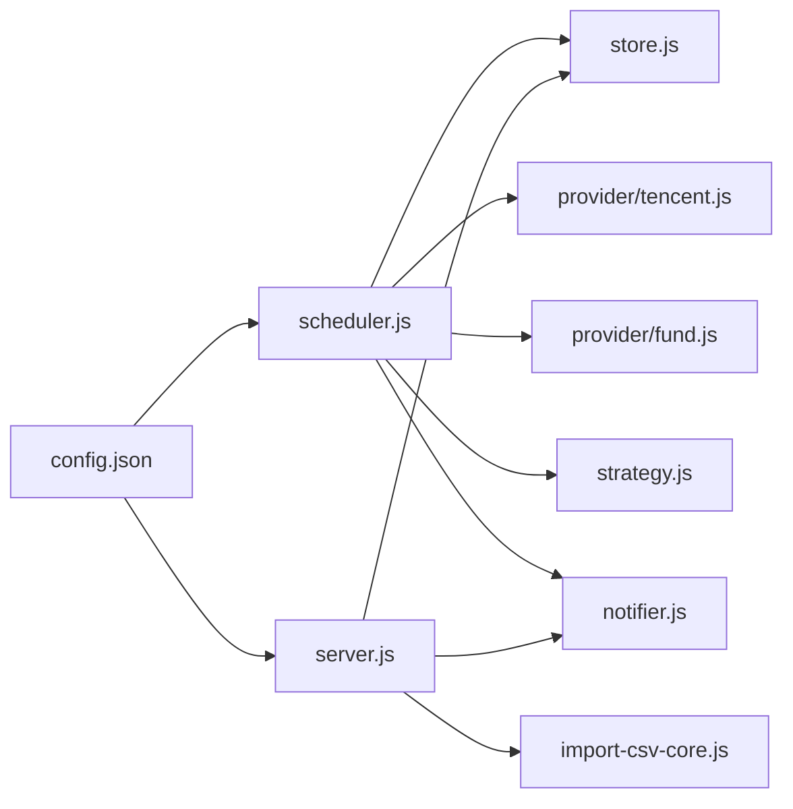

# 实时数据同步

<cite>
**本文引用的文件**
- [server/index.js](file://server/index.js)
- [server/scheduler.js](file://server/scheduler.js)
- [server/provider/tencent.js](file://server/provider/tencent.js)
- [server/provider/fund.js](file://server/provider/fund.js)
- [server/store.js](file://server/store.js)
- [server/server.js](file://server/server.js)
- [server/notifier.js](file://server/notifier.js)
- [server/strategy.js](file://server/strategy.js)
- [config.json](file://config.json)
</cite>

## 目录
1. [简介](#简介)
2. [项目结构](#项目结构)
3. [核心组件](#核心组件)
4. [架构总览](#架构总览)
5. [详细组件分析](#详细组件分析)
6. [依赖关系分析](#依赖关系分析)
7. [性能考量](#性能考量)
8. [故障排除指南](#故障排除指南)
9. [结论](#结论)
10. [附录：配置与使用示例](#附录：配置与使用示例)

## 简介
本文件面向 Stock Advisor 的“实时数据同步”能力，系统性说明定时任务调度、多数据源集成（腾讯财经与东方财富）、价格缓存与一致性、策略评估与通知推送、以及并发更新与冲突解决机制。文档同时提供可操作的配置示例与常见问题排查建议，帮助开发者快速理解与维护该功能。

## 项目结构
后端采用 Node.js 原生 HTTP 服务，配合轻量调度器与数据提供者模块，实现以下职责划分：
- 调度器：负责交易时段判断、刷新频率控制、任务优先级管理（股票 vs 基金）
- 数据源：分别对接腾讯财经（股票/港股/美股）与东方财富（场外基金净值）
- 存储层：内存缓存 + 串行写盘，保证并发安全与外部修改感知
- 策略引擎：基于持仓与买入记录计算买卖信号
- 通知模块：飞书机器人卡片消息推送
- Web 服务：提供静态页面与 REST API

图表来源
- [server/index.js:1-17](file://server/index.js#L1-L17)
- [server/scheduler.js:1-178](file://server/scheduler.js#L1-L178)
- [server/provider/tencent.js:1-42](file://server/provider/tencent.js#L1-L42)
- [server/provider/fund.js:1-55](file://server/provider/fund.js#L1-L55)
- [server/strategy.js:1-91](file://server/strategy.js#L1-L91)
- [server/notifier.js:1-112](file://server/notifier.js#L1-L112)
- [server/store.js:1-71](file://server/store.js#L1-L71)

章节来源
- [server/index.js:1-17](file://server/index.js#L1-L17)

## 核心组件
- 定时任务调度器：根据市场交易时段动态调整刷新间隔；按类型分流（股票走腾讯、基金走东方财富）；对每个活跃持仓执行策略评估与告警冷却；变更时持久化。
- 多数据源集成：统一返回标准化数据结构 { price, prevClose }，屏蔽底层差异。
- 价格缓存与一致性：内存缓存 + mtime 检测 + 串行写盘，避免覆盖与重复加载。
- 策略与通知：基于成本加权止盈止损、补仓触发条件；飞书卡片消息支持签名与重试。
- Web 服务：提供持仓 CRUD、CSV 导入、测试推送等接口，并托管前端静态资源。

章节来源
- [server/scheduler.js:1-178](file://server/scheduler.js#L1-L178)
- [server/provider/tencent.js:1-42](file://server/provider/tencent.js#L1-L42)
- [server/provider/fund.js:1-55](file://server/provider/fund.js#L1-L55)
- [server/store.js:1-71](file://server/store.js#L1-L71)
- [server/strategy.js:1-91](file://server/strategy.js#L1-L91)
- [server/notifier.js:1-112](file://server/notifier.js#L1-L112)
- [server/server.js:1-594](file://server/server.js#L1-L594)

## 架构总览
系统以“调度器”为核心驱动，周期性拉取行情，结合策略引擎生成操作建议并通过通知模块下发。Web 服务暴露 REST API 供前端交互，所有读写通过 store 层进行并发保护与持久化。

图表来源
- [server/scheduler.js:65-178](file://server/scheduler.js#L65-L178)
- [server/provider/tencent.js:6-42](file://server/provider/tencent.js#L6-L42)
- [server/provider/fund.js:6-55](file://server/provider/fund.js#L6-L55)
- [server/strategy.js:34-91](file://server/strategy.js#L34-L91)
- [server/notifier.js:81-112](file://server/notifier.js#L81-L112)
- [server/store.js:40-71](file://server/store.js#L40-L71)
- [server/server.js:409-565](file://server/server.js#L409-L565)

## 详细组件分析

### 定时任务调度器
- 交易时段判断：基于各市场时区与本地时间窗口（A股/港股/美股），周末直接判定为休市。
- 刷新频率控制：交易时段使用短间隔，非交易时段使用较长间隔，降低无效请求。
- 任务优先级管理：将活跃持仓按类型分流，股票与基金并行抓取，提升吞吐。
- 日涨跌告警：按当日涨跌幅阈值触发一次，避免重复推送。
- 冷却机制：同一触发态在冷却期内不重复推送，防止刷屏。
- 持久化：仅当有状态变更时写盘，减少 I/O。

图表来源
- [server/scheduler.js:8-63](file://server/scheduler.js#L8-L63)
- [server/scheduler.js:65-178](file://server/scheduler.js#L65-L178)

章节来源
- [server/scheduler.js:8-63](file://server/scheduler.js#L8-L63)
- [server/scheduler.js:65-178](file://server/scheduler.js#L65-L178)

### 多数据源集成（腾讯财经与东方财富）
- 腾讯财经（股票/港股/美股）：
  - 批量请求，文本响应，GBK/UTF-8 兼容解码
  - 解析字段：当前价、昨收价，统一映射为 { price, prevClose }
- 东方财富（场外基金净值）：
  - JSONP 响应，去除包裹后解析最新与上一交易日净值
  - 单基金逐条查询，异常与空数据降级处理

图表来源
- [server/provider/tencent.js:6-42](file://server/provider/tencent.js#L6-L42)
- [server/provider/fund.js:6-55](file://server/provider/fund.js#L6-L55)
- [server/scheduler.js:72-87](file://server/scheduler.js#L72-L87)

章节来源
- [server/provider/tencent.js:1-42](file://server/provider/tencent.js#L1-L42)
- [server/provider/fund.js:1-55](file://server/provider/fund.js#L1-L55)
- [server/scheduler.js:72-87](file://server/scheduler.js#L72-L87)

### 价格缓存机制与数据一致性
- 内存缓存：首次或文件被外部修改时从磁盘加载，否则复用内存对象，避免频繁 I/O。
- 外部变更检测：通过文件 mtime 对比，感知手动编辑导致的变更。
- 串行写盘：写操作排队执行，避免并发覆盖；写后同步 mtime，防止误判为外部改动。
- 读路径：loadHoldings 始终返回最新内存视图；写路径 saveHoldings 保证顺序落盘。

图表来源
- [server/store.js:14-59](file://server/store.js#L14-L59)
- [server/store.js:61-71](file://server/store.js#L61-L71)

章节来源
- [server/store.js:1-71](file://server/store.js#L1-L71)

### 实时数据推送机制（通知）
- 消息构造：根据触发类型（买点/卖点/日涨跌）生成不同样式的飞书卡片。
- 签名与重试：可选 secret 签名，失败自动重试三次，指数退避。
- 触发时机：仅在策略评估触发且不在冷却期时发送。

图表来源
- [server/notifier.js:4-112](file://server/notifier.js#L4-L112)
- [server/scheduler.js:101-157](file://server/scheduler.js#L101-L157)

章节来源
- [server/notifier.js:1-112](file://server/notifier.js#L1-L112)
- [server/scheduler.js:101-157](file://server/scheduler.js#L101-L157)

### 数据冲突解决与版本控制
- 并发写保护：writeChain 串行化写盘，避免调度器与 HTTP 接口同时写入导致覆盖。
- 读一致性：loadHoldings 基于内存缓存，确保同一进程内读到的数据一致。
- 外部变更感知：mtime 比较，若检测到外部修改则重新加载并持久化迁移后的新模型。
- 交易原子性：applyTransaction 在内存中先修正状态，再统一保存，保证买入/卖出逻辑一致性。

图表来源
- [server/store.js:61-71](file://server/store.js#L61-L71)
- [server/server.js:346-407](file://server/server.js#L346-L407)

章节来源
- [server/store.js:1-71](file://server/store.js#L1-L71)
- [server/server.js:346-407](file://server/server.js#L346-L407)

### 策略评估与告警冷却
- 成本加权止盈：按总成本加权平均目标收益率，接近阈值即提示卖出。
- 单笔止损：任一买入记录达到其止损线即提示止损。
- 补仓触发：较最近买入价跌幅或触及补仓价即提示补仓。
- 冷却期：同一触发态在冷却时间内不重复推送，避免信息轰炸。

图表来源
- [server/strategy.js:5-91](file://server/strategy.js#L5-L91)
- [server/scheduler.js:126-157](file://server/scheduler.js#L126-L157)

章节来源
- [server/strategy.js:1-91](file://server/strategy.js#L1-L91)
- [server/scheduler.js:126-157](file://server/scheduler.js#L126-L157)

## 依赖关系分析
- 调度器依赖：
  - 存储层：loadHoldings/saveHoldings
  - 数据源：tencent/fund
  - 策略：evaluate
  - 通知：sendCard
- Web 服务依赖：
  - 存储层：loadHoldings/saveHoldings
  - 通知：sendCard
  - CSV 导入：import-csv-core
- 配置：
  - schedule.intervalSeconds/offHoursIntervalSeconds
  - server.host/port
  - feishu.webhook/secret
  - notify.cooldownSeconds/nearThresholdPct

图表来源
- [server/scheduler.js:1-178](file://server/scheduler.js#L1-L178)
- [server/server.js:1-594](file://server/server.js#L1-L594)
- [config.json:1-19](file://config.json#L1-L19)

章节来源
- [server/scheduler.js:1-178](file://server/scheduler.js#L1-L178)
- [server/server.js:1-594](file://server/server.js#L1-L594)
- [config.json:1-19](file://config.json#L1-L19)

## 性能考量
- 并行拉取：股票与基金数据并行获取，缩短整体延迟。
- 降频策略：非交易时段拉长间隔，减少无效请求与网络开销。
- 串行写盘：避免并发写冲突，提高数据一致性。
- 内存缓存：减少磁盘 I/O，提升读取性能。
- 通知重试：有限重试与退避，平衡可靠性与负载。

[本节为通用性能讨论，不直接分析具体文件]

## 故障排除指南
- 行情为空或解析失败
  - 检查网络与 User-Agent/Referer 头
  - 查看控制台日志中的 [stock-fetch]/[fund-fetch] 警告
  - 确认代码格式（如 sh/hk/us 前缀）正确
- 飞书推送失败
  - 校验 webhook 与 secret 配置
  - 关注 notifier 的重试日志与错误码
- 数据未更新
  - 确认调度器是否在运行（查看启动日志）
  - 检查 config.json 的 intervalSeconds 与 offHoursIntervalSeconds
  - 观察 store 的保存日志与磁盘文件是否被外部修改
- 告警重复或不触发
  - 调整 notify.cooldownSeconds
  - 检查 dailyDropAlertPct/dailyRiseAlertPct 与 nearThresholdPct
- 并发写入冲突
  - 避免同时编辑 holdings.json 与调用 API
  - 等待串行写盘完成后再次验证

章节来源
- [server/scheduler.js:72-87](file://server/scheduler.js#L72-L87)
- [server/notifier.js:81-112](file://server/notifier.js#L81-L112)
- [server/store.js:40-71](file://server/store.js#L40-L71)
- [config.json:1-19](file://config.json#L1-L19)

## 结论
Stock Advisor 的实时数据同步机制以调度器为中心，结合多数据源并行拉取、内存缓存与串行写盘的一致性保障、策略驱动的精准告警与通知推送，形成稳定高效的闭环。通过合理的交易时段判断、刷新频率控制与冷却机制，系统在低开销下实现了高可用的实时提醒能力。

[本节为总结性内容，不直接分析具体文件]

## 附录：配置与使用示例
- 基本配置（config.json）
  - schedule.intervalSeconds：交易时段刷新间隔（秒）
  - schedule.offHoursIntervalSeconds：非交易时段刷新间隔（秒）
  - server.host/server.port：Web 服务监听地址与端口
  - feishu.webhook/secret：飞书机器人回调地址与签名密钥
  - notify.cooldownSeconds：告警冷却时间（秒）
  - notify.nearThresholdPct：接近阈值百分比（用于提示“即将触发”）
- 启动方式
  - 正常模式：node server/index.js，启动 Web 服务与调度器
  - 单次模式：ONCE=1 node server/index.js，执行一轮后退出
- 常用接口
  - GET /api/holdings：获取持仓列表（含派生字段）
  - POST /api/holdings：新建持仓
  - PATCH /api/holdings/:id：更新持仓级字段（如日涨跌告警阈值）
  - POST /api/holdings/:id/purchases：追加买入记录
  - DELETE /api/holdings/:id/purchases/:pid：删除买入记录
  - POST /api/import-csv：导入 CSV 买卖记录
  - POST /api/test-feishu：测试飞书推送

章节来源
- [config.json:1-19](file://config.json#L1-L19)
- [server/index.js:1-17](file://server/index.js#L1-L17)
- [server/server.js:409-565](file://server/server.js#L409-L565)