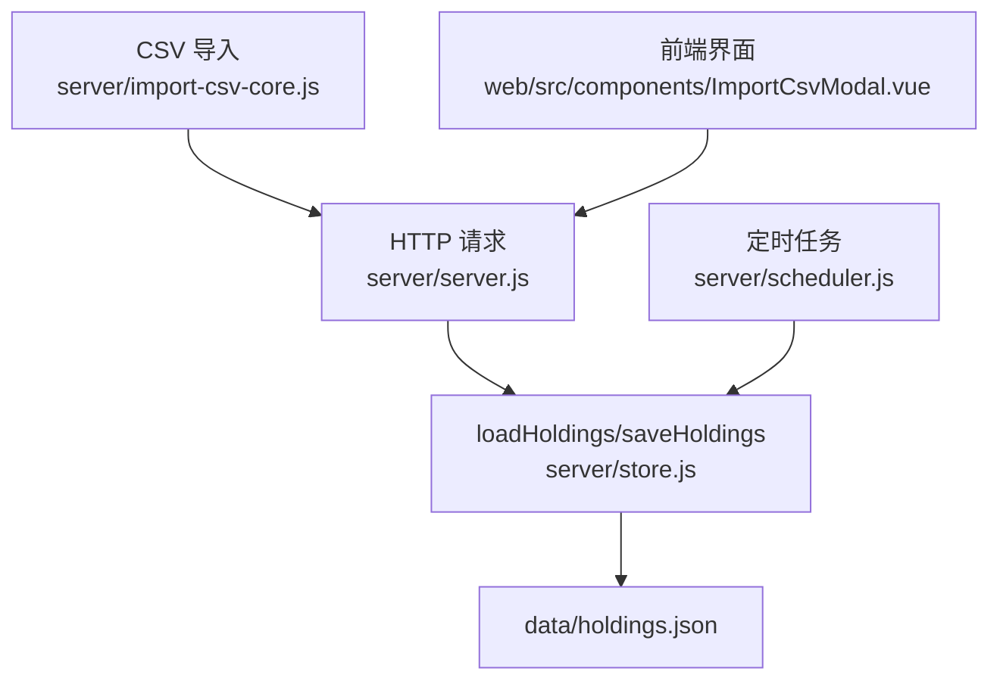
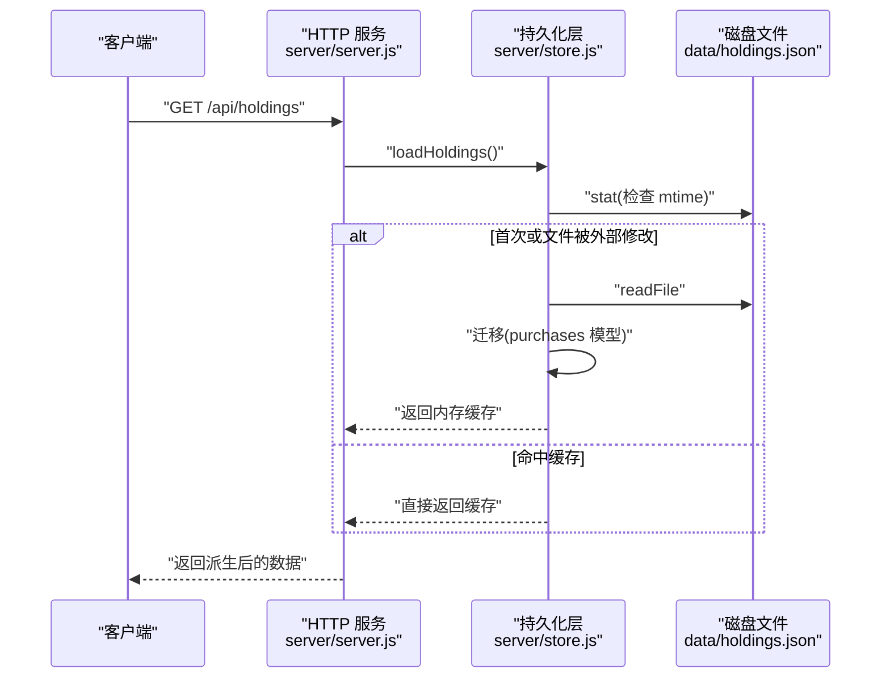
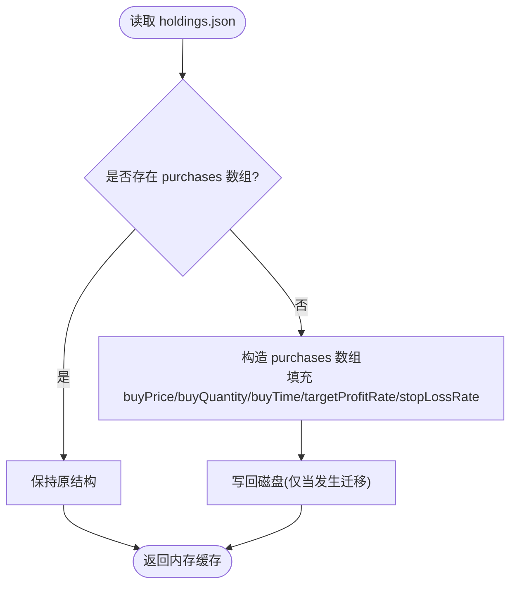
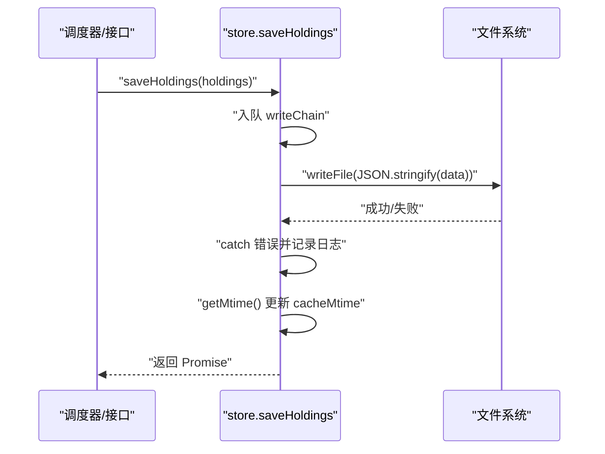
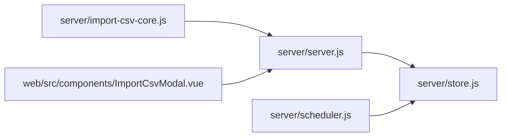

# 数据持久化

<cite>
**本文引用的文件**
- [server/store.js](file://server/store.js)
- [server/server.js](file://server/server.js)
- [server/scheduler.js](file://server/scheduler.js)
- [data/holdings.json](file://data/holdings.json)
- [config.json](file://config.json)
- [server/import-csv-core.js](file://server/import-csv-core.js)
- [web/src/components/ImportCsvModal.vue](file://web/src/components/ImportCsvModal.vue)
</cite>

## 目录
1. [简介](#简介)
2. [项目结构](#项目结构)
3. [核心组件](#核心组件)
4. [架构总览](#架构总览)
5. [详细组件分析](#详细组件分析)
6. [依赖关系分析](#依赖关系分析)
7. [性能考量](#性能考量)
8. [故障排查指南](#故障排查指南)
9. [结论](#结论)
10. [附录](#附录)

## 简介
本文件面向 Stock Advisor 的数据持久化机制，围绕 JSON 文件存储、内存缓存、并发控制、数据迁移与版本管理、备份恢复、完整性校验与错误恢复等方面，提供系统化说明与实践建议。目标是帮助读者理解并安全地扩展该系统的持久化能力。

## 项目结构
- 数据存储位置：data/holdings.json（JSON 数组，每个元素为一个持仓）
- 持久化模块：server/store.js（负责加载、缓存、串行写入、mtime 检测与数据迁移）
- 业务入口：server/server.js（HTTP API 读写）、server/scheduler.js（定时任务更新行情与策略状态）
- 配置：config.json（调度间隔、通知冷却等）
- CSV 导入：server/import-csv-core.js（幂等导入逻辑），前端通过 web/src/components/ImportCsvModal.vue 触发

图表来源
- [server/server.js:409-564](file://server/server.js#L409-L564)
- [server/store.js:40-70](file://server/store.js#L40-L70)
- [server/scheduler.js:65-165](file://server/scheduler.js#L65-L165)
- [server/import-csv-core.js:212-306](file://server/import-csv-core.js#L212-L306)
- [web/src/components/ImportCsvModal.vue:154-168](file://web/src/components/ImportCsvModal.vue#L154-L168)

章节来源
- [server/store.js:1-70](file://server/store.js#L1-L70)
- [server/server.js:1-594](file://server/server.js#L1-L594)
- [server/scheduler.js:1-178](file://server/scheduler.js#L1-L178)
- [data/holdings.json:1-462](file://data/holdings.json#L1-L462)
- [config.json:1-19](file://config.json#L1-L19)

## 核心组件
- 持久化层（store.js）
  - 内存缓存：进程内共享同一份 holdings 列表，避免重复 IO
  - mtime 检测：当外部修改了 holdings.json，下次 load 自动感知并刷新缓存
  - 串行写盘：writeChain 保证多次写入顺序执行，防止覆盖
  - 数据迁移：首次加载时把旧版扁平结构迁移为 purchases 数组模型，并落盘
- 业务层（server.js）
  - HTTP API 统一通过 store 的 load/save 进行读/写
  - 交易处理（买入/卖出）后调用 syncFromPurchases 同步汇总字段，再保存
- 调度层（scheduler.js）
  - 定时拉取行情，计算策略触发态，必要时保存状态变更
- 导入层（import-csv-core.js）
  - 幂等导入：以 (code, 操作, 日期, 数量, 价格) 为唯一键去重
  - 支持创建缺失持仓（可选）

章节来源
- [server/store.js:8-70](file://server/store.js#L8-L70)
- [server/server.js:247-407](file://server/server.js#L247-L407)
- [server/scheduler.js:65-165](file://server/scheduler.js#L65-L165)
- [server/import-csv-core.js:212-306](file://server/import-csv-core.js#L212-L306)

## 架构总览
系统采用“内存缓存 + JSON 文件”的轻量级持久化方案。所有读写均通过 store.js 暴露的接口完成，确保并发安全与一致性。调度器与 HTTP 服务共享同一份内存缓存，减少磁盘 IO 与竞争。

图表来源
- [server/server.js:411-414](file://server/server.js#L411-L414)
- [server/store.js:40-59](file://server/store.js#L40-L59)

章节来源
- [server/server.js:409-414](file://server/server.js#L409-L414)
- [server/store.js:40-59](file://server/store.js#L40-L59)

## 详细组件分析

### 数据存储结构与版本演进
- 数据结构
  - holdings.json 是一个数组，每项代表一个持仓，包含基础信息、purchases（多次买入记录）、sells（卖出记录）、策略与告警字段、行情快照等
  - purchases 中的每条记录包含买入价、数量、时间、目标止盈比例、止损比例等
- 版本迁移
  - 旧版为扁平结构（单条买入），新模型为 purchases 数组；首次加载时自动迁移并落盘
  - 迁移逻辑在 store.js 中实现，确保历史数据兼容

图表来源
- [server/store.js:24-57](file://server/store.js#L24-L57)

章节来源
- [server/store.js:24-57](file://server/store.js#L24-L57)
- [data/holdings.json:1-462](file://data/holdings.json#L1-L462)

### 文件读写与并发访问控制
- 读路径
  - 每次读取前先 stat 获取 mtime；若首次加载或 mtime 大于缓存记录的 mtime，则重新从磁盘读取并解析
  - 解析后执行迁移（如有），更新内存缓存与 cacheMtime
- 写路径
  - 使用 writeChain 将多次写入排队串行执行，避免并发覆盖
  - 写入完成后再次 stat 更新 cacheMtime，避免误判为外部修改而重复重载
- 异常处理
  - 写入失败会捕获并打印错误日志，不中断后续队列

图表来源
- [server/store.js:62-70](file://server/store.js#L62-L70)

章节来源
- [server/store.js:14-22](file://server/store.js#L14-L22)
- [server/store.js:62-70](file://server/store.js#L62-L70)

### 内存缓存机制
- 设计要点
  - 进程内全局缓存，供调度器与 HTTP 接口共享，避免并发读写冲突
  - 基于 mtime 的外部变更检测，保证手动编辑文件后能自动刷新
- 失效规则
  - 首次加载或文件 mtime 变化时失效并重建缓存
  - 写入成功后立即更新 mtime，避免自我覆盖导致的误判
- 性能优化
  - 减少不必要的磁盘 IO，仅在必要时读取
  - 序列化输出使用缩进便于人工维护与 diff

章节来源
- [server/store.js:8-12](file://server/store.js#L8-L12)
- [server/store.js:40-59](file://server/store.js#L40-L59)
- [server/store.js:62-70](file://server/store.js#L62-L70)

### 数据迁移与版本管理
- 迁移策略
  - 在 loadHoldings 中检测旧结构并转换为 purchases 数组模型
  - 迁移后立即写盘，使后续加载不再重复迁移
- 兼容性
  - 对缺失字段提供默认值（如 stopLossRate 缺省为 0）
  - 保留历史字段，确保向前兼容

章节来源
- [server/store.js:24-57](file://server/store.js#L24-L57)

### 数据备份与恢复
- 现状
  - data 目录下存在多个备份文件（例如 holdings-0724备份.json、holdings-备份20260728.json），用于历史快照
- 建议实践
  - 自动备份：在每次 saveHoldings 前复制当前文件为带时间戳的备份，或使用 cron 定期拷贝
  - 手动恢复：替换 holdings.json 为目标备份文件，重启服务或等待下一次 loadHoldings 触发读取
  - 注意：由于缓存基于 mtime，恢复后需确保文件 mtime 变化或重启服务以刷新缓存

章节来源
- [data/holdings.json:1-462](file://data/holdings.json#L1-L462)

### 数据完整性校验与错误恢复
- 输入校验
  - 新建持仓与交易接口对必填字段与数值范围进行校验，非法输入抛出错误
  - CSV 导入对表头、数值合法性进行校验，错误记录并返回给前端展示
- 运行时容错
  - 网络请求失败（行情获取）不影响整体流程，记录警告并跳过对应品种
  - 写入失败捕获并记录日志，避免阻塞后续写入队列
- 前端反馈
  - 导入错误在前端集中展示，便于定位问题

章节来源
- [server/server.js:286-407](file://server/server.js#L286-L407)
- [server/import-csv-core.js:1-306](file://server/import-csv-core.js#L1-L306)
- [web/src/components/ImportCsvModal.vue:154-168](file://web/src/components/ImportCsvModal.vue#L154-L168)

### 代码示例与最佳实践
- 读取与写入
  - 通过 store.loadHoldings 获取最新数据，必要时通过 store.saveHoldings 持久化
  - 建议在批量更新后统一调用一次 saveHoldings，减少写盘次数
- 交易处理
  - 使用 applyTransaction 或 normalizePurchase 规范化数据，再通过 syncFromPurchases 同步汇总字段
- CSV 导入
  - 使用 importCsvText 进行幂等导入，结合 createMissing 选项按需创建缺失持仓
- 参考路径
  - [server/server.js:437-543](file://server/server.js#L437-L543)
  - [server/import-csv-core.js:212-306](file://server/import-csv-core.js#L212-L306)

章节来源
- [server/server.js:437-543](file://server/server.js#L437-L543)
- [server/import-csv-core.js:212-306](file://server/import-csv-core.js#L212-L306)

## 依赖关系分析
- server/server.js 依赖 store.js 的 load/save 接口
- server/scheduler.js 依赖 store.js 以及 provider 获取行情
- import-csv-core.js 可被命令行脚本与 HTTP 接口复用
- 前端 ImportCsvModal.vue 通过 HTTP 接口触发导入并展示错误

图表来源
- [server/server.js:5-7](file://server/server.js#L5-L7)
- [server/scheduler.js:1-5](file://server/scheduler.js#L1-L5)
- [server/import-csv-core.js:1-6](file://server/import-csv-core.js#L1-L6)
- [web/src/components/ImportCsvModal.vue:154-168](file://web/src/components/ImportCsvModal.vue#L154-L168)

章节来源
- [server/server.js:1-594](file://server/server.js#L1-L594)
- [server/scheduler.js:1-178](file://server/scheduler.js#L1-L178)
- [server/import-csv-core.js:1-306](file://server/import-csv-core.js#L1-L306)
- [web/src/components/ImportCsvModal.vue:154-168](file://web/src/components/ImportCsvModal.vue#L154-L168)

## 性能考量
- 读多写少场景下，内存缓存显著降低磁盘 IO
- 串行写盘避免锁竞争，但高并发写入可能成为瓶颈；可考虑批量化合并写入
- mtime 检测在频繁外部编辑场景下可能引发多次重载，建议配合备份策略减少误判
- 序列化格式使用缩进便于人类可读，但在大数据量时体积较大；可按需调整压缩或分片存储

[本节为通用指导，无需特定文件引用]

## 故障排查指南
- 无法读取 holdings.json
  - 检查文件路径与权限；确认 getMtime 是否返回有效值
  - 若文件不存在，loadHoldings 会返回空结果，需初始化数据
- 写入失败
  - 查看控制台日志中的 “[store] save error”，确认磁盘空间与权限
  - 检查 writeChain 是否被长时间阻塞（例如上游未 await）
- 数据不一致
  - 确认是否在多处直接修改 holdings.json 而未通过 saveHoldings
  - 利用 mtime 机制验证是否触发重载；必要时重启服务
- CSV 导入错误
  - 检查表头是否包含必需列；核对数值合法性
  - 前端 ImportCsvModal.vue 会展示错误明细，按提示修正

章节来源
- [server/store.js:62-70](file://server/store.js#L62-L70)
- [server/import-csv-core.js:187-306](file://server/import-csv-core.js#L187-L306)
- [web/src/components/ImportCsvModal.vue:154-168](file://web/src/components/ImportCsvModal.vue#L154-L168)

## 结论
Stock Advisor 采用“内存缓存 + JSON 文件”的简洁持久化方案，具备以下特点：
- 通过 mtime 检测实现外部变更感知与缓存失效
- 串行写盘保障并发安全
- 内置数据迁移，支持历史数据兼容
- 完善的输入校验与错误处理，提升鲁棒性
- 现有备份文件可作为恢复依据，建议引入自动化备份策略

在实际使用中，建议遵循统一通过 store 接口进行读写、批量更新后统一落盘、结合外部备份与监控的策略，以确保数据一致性与可靠性。

[本节为总结，无需特定文件引用]

## 附录
- 配置项（调度与通知）
  - schedule.intervalSeconds：交易时段刷新间隔
  - schedule.offHoursIntervalSeconds：非交易时段刷新间隔
  - notify.cooldownSeconds：通知冷却时间
  - notify.nearThresholdPct：接近阈值百分比
- 参考路径
  - [config.json:1-19](file://config.json#L1-L19)

章节来源
- [config.json:1-19](file://config.json#L1-L19)