# 数据流设计

<cite>
**本文引用的文件**
- [server/index.js](file://server/index.js)
- [server/server.js](file://server/server.js)
- [server/store.js](file://server/store.js)
- [server/scheduler.js](file://server/scheduler.js)
- [server/strategy.js](file://server/strategy.js)
- [server/notifier.js](file://server/notifier.js)
- [web/src/App.vue](file://web/src/App.vue)
- [web/src/composables/useHoldings.js](file://web/src/composables/useHoldings.js)
- [web/src/constants/options.js](file://web/src/constants/options.js)
- [data/holdings.json](file://data/holdings.json)
- [config.json](file://config.json)
- [docs/盈亏计算规则.md](file://docs/盈亏计算规则.md)
</cite>

## 目录
1. [引言](#引言)
2. [项目结构](#项目结构)
3. [核心组件](#核心组件)
4. [架构总览](#架构总览)
5. [详细组件分析](#详细组件分析)
6. [依赖关系分析](#依赖关系分析)
7. [性能与一致性](#性能与一致性)
8. [故障排查指南](#故障排查指南)
9. [结论](#结论)
10. [附录：数据模型与API契约](#附录数据模型与api契约)

## 引言
本文件面向Stock Advisor系统的数据流设计，完整描述从用户操作触发前端状态更新，到后端REST接口处理、策略评估、行情获取、缓存与持久化，再到前端响应式渲染的全链路过程。重点说明实时数据同步机制（行情获取、缓存、推送）、前后端交互模式、并发一致性与冲突解决策略，以及关键数据模型（持仓对象、交易记录、策略状态）的结构与关系映射。文末提供数据流图与时间序列图，覆盖常见场景的数据流转。

## 项目结构
系统采用前后端分离的单体部署方式：Node.js HTTP服务同时托管静态前端页面与REST API；调度器定时拉取行情并执行策略；数据以JSON文件持久化。

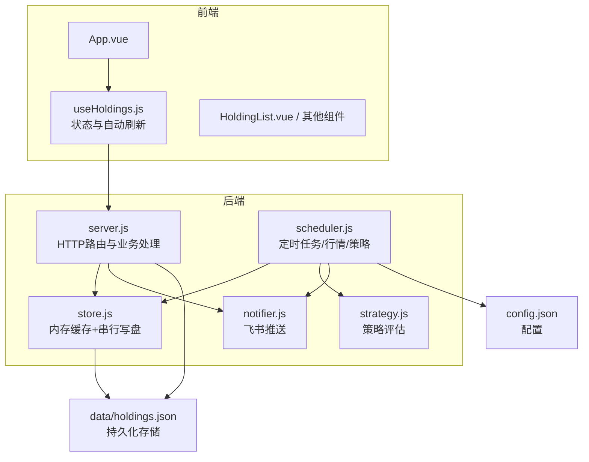

图表来源
- [server/index.js:1-17](file://server/index.js#L1-L17)
- [server/server.js:567-594](file://server/server.js#L567-L594)
- [server/store.js:40-71](file://server/store.js#L40-L71)
- [server/scheduler.js:65-178](file://server/scheduler.js#L65-L178)
- [web/src/App.vue:121-129](file://web/src/App.vue#L121-L129)
- [web/src/composables/useHoldings.js:15-43](file://web/src/composables/useHoldings.js#L15-L43)

章节来源
- [server/index.js:1-17](file://server/index.js#L1-L17)
- [server/server.js:567-594](file://server/server.js#L567-L594)
- [server/store.js:40-71](file://server/store.js#L40-L71)
- [server/scheduler.js:65-178](file://server/scheduler.js#L65-L178)
- [web/src/App.vue:121-129](file://web/src/App.vue#L121-L129)
- [web/src/composables/useHoldings.js:15-43](file://web/src/composables/useHoldings.js#L15-L43)

## 核心组件
- 前端状态与刷新：使用Vue组合式函数维护全局持仓列表、加载态、错误态、倒计时；每固定间隔轮询后端接口，实现近实时展示。
- 后端HTTP服务：统一路由解析，提供持仓CRUD、交易记录、CSV导入、测试推送等接口；对请求体进行校验，返回派生后的展示数据。
- 数据存储层：内存缓存+文件持久化；通过mtime检测外部变更；串行写入避免并发覆盖。
- 调度器：按市场时段选择刷新频率；并行拉取股票与基金行情；执行策略评估；发送飞书通知；落盘状态变化。
- 策略引擎：基于多次买入记录的成本加权止盈/止损与补仓条件判断；支持“接近阈值”提示。
- 通知模块：构造飞书卡片消息，支持签名与重试。

章节来源
- [web/src/composables/useHoldings.js:15-154](file://web/src/composables/useHoldings.js#L15-L154)
- [server/server.js:89-245](file://server/server.js#L89-L245)
- [server/store.js:8-71](file://server/store.js#L8-L71)
- [server/scheduler.js:65-178](file://server/scheduler.js#L65-L178)
- [server/strategy.js:34-91](file://server/strategy.js#L34-L91)
- [server/notifier.js:81-112](file://server/notifier.js#L81-L112)

## 架构总览
系统由“前端-后端-存储-调度-通知”五层构成。前端通过REST轮询获取数据；后端在读取时合并派生字段，写入时保证一致性；调度器周期性更新行情与策略状态；通知模块将告警推送到飞书。

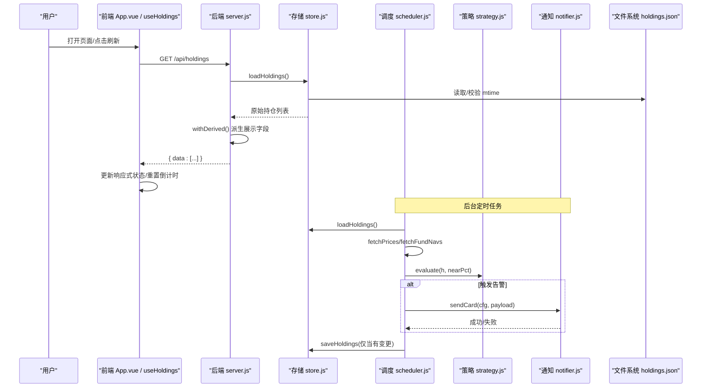

图表来源
- [web/src/App.vue:121-129](file://web/src/App.vue#L121-L129)
- [web/src/composables/useHoldings.js:15-43](file://web/src/composables/useHoldings.js#L15-L43)
- [server/server.js:409-465](file://server/server.js#L409-L465)
- [server/store.js:40-71](file://server/store.js#L40-L71)
- [server/scheduler.js:65-178](file://server/scheduler.js#L65-L178)
- [server/strategy.js:34-91](file://server/strategy.js#L34-L91)
- [server/notifier.js:81-112](file://server/notifier.js#L81-L112)

## 详细组件分析

### 前端响应式数据绑定与轮询
- 单例状态：模块级ref持有持仓列表、加载态、错误信息、更新时间与倒计时。
- 自动刷新：启动单一定时器每秒递减，归零时调用fetch；避免多定时器漂移。
- 写操作封装：添加持仓、提交交易、保存买入记录、删除买入记录、更新持仓字段均通过统一fetch调用，成功后再刷新列表，确保UI与后端一致。
- 概览汇总：computed聚合成本、市值、持仓收益、今日收益等指标。

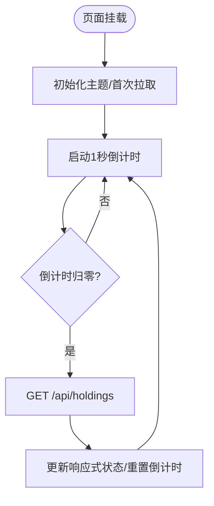

图表来源
- [web/src/App.vue:121-129](file://web/src/App.vue#L121-L129)
- [web/src/composables/useHoldings.js:15-43](file://web/src/composables/useHoldings.js#L15-L43)
- [web/src/constants/options.js:31-33](file://web/src/constants/options.js#L31-L33)

章节来源
- [web/src/App.vue:121-129](file://web/src/App.vue#L121-L129)
- [web/src/composables/useHoldings.js:15-154](file://web/src/composables/useHoldings.js#L15-L154)
- [web/src/constants/options.js:1-33](file://web/src/constants/options.js#L1-L33)

### 后端REST接口与数据处理
- 路由分发：/api/*交由handleApi处理；非/api路径返回静态页面。
- 读接口：GET /api/holdings 读取原始数据并通过withDerived生成transactions、均价、收益、今日涨跌等展示字段。
- 写接口：
  - POST /api/holdings：创建持仓，校验必填字段，生成ID，同步成本/数量/均价后落盘。
  - PATCH /api/holdings/:id：更新持仓级字段（如日涨跌告警阈值），重置当日告警标记。
  - POST /api/holdings/:id/purchases：追加买入记录，标准化字段，同步成本/均价，重置触发态。
  - PATCH /api/holdings/:id/purchases/:pid：修改某笔买入记录的单价/数量/日期/止盈/止损，重新同步。
  - DELETE /api/holdings/:id/purchases/:pid：删除买入记录，若为空则置为已卖出。
  - POST /api/holdings/:id/transactions：提交买入或卖出；卖出采用LIFO计算成本价，不修改买入记录。
  - POST /api/import-csv：批量导入买卖记录，按代码匹配，缺失可创建。
  - POST /api/test-feishu：测试飞书推送。
- 错误处理：参数校验失败返回400；资源不存在返回404；未知路由返回404；未捕获异常返回500。

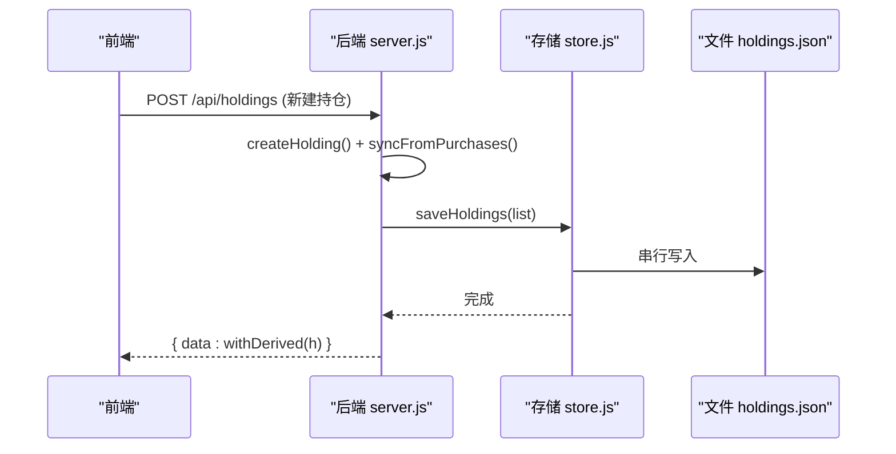

图表来源
- [server/server.js:437-450](file://server/server.js#L437-L450)
- [server/server.js:247-284](file://server/server.js#L247-L284)
- [server/store.js:62-71](file://server/store.js#L62-L71)

章节来源
- [server/server.js:409-565](file://server/server.js#L409-L565)
- [server/server.js:89-245](file://server/server.js#L89-L245)

### 数据存储与并发控制
- 内存缓存：进程内共享同一份持仓数组，避免重复IO。
- 外部变更检测：通过文件mtime判断是否被外部修改，必要时重载并迁移旧版扁平结构至purchases模型。
- 串行写盘：writeChain队列串行化所有写操作，防止调度器与HTTP接口并发写造成覆盖。
- 写后同步mtime：避免误判为外部改动而重复加载。

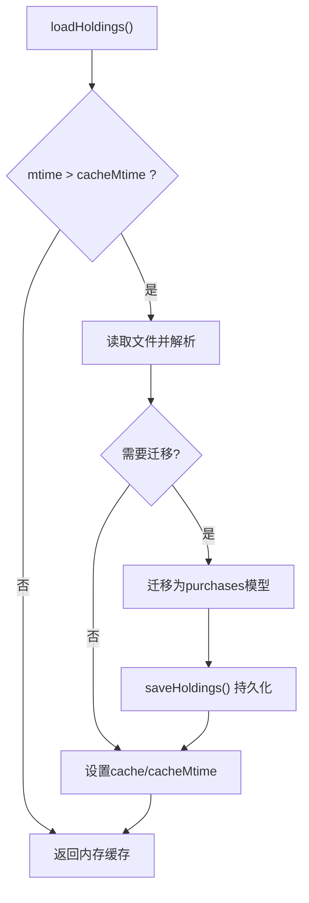

图表来源
- [server/store.js:40-71](file://server/store.js#L40-L71)

章节来源
- [server/store.js:8-71](file://server/store.js#L8-L71)

### 实时数据同步机制（行情获取、缓存与推送）
- 市场时段判断：根据region与时区判断当前是否处于交易时段；交易时段短间隔刷新，非交易时段降频。
- 并行拉取：股票与基金分别走不同数据源，Promise.all并发获取，合并为统一价格字典。
- 策略评估：对每个活跃持仓调用evaluate，结合成本加权止盈/止损与补仓条件，输出触发类型与建议。
- 冷却机制：同一触发态且在冷却窗口内跳过推送，避免刷屏。
- 日涨跌告警：独立于策略的每日涨跌幅阈值告警，按天去重。
- 状态落盘：仅在发生变动时保存，减少磁盘IO。

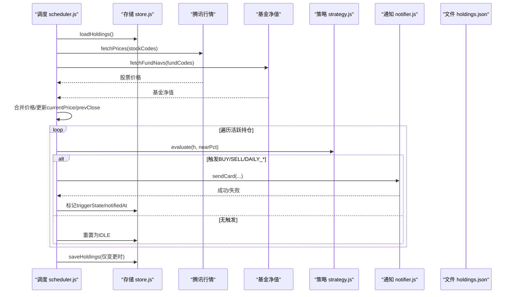

图表来源
- [server/scheduler.js:65-178](file://server/scheduler.js#L65-L178)
- [server/strategy.js:34-91](file://server/strategy.js#L34-L91)
- [server/notifier.js:81-112](file://server/notifier.js#L81-L112)

章节来源
- [server/scheduler.js:65-178](file://server/scheduler.js#L65-L178)
- [server/strategy.js:34-91](file://server/strategy.js#L34-L91)
- [server/notifier.js:81-112](file://server/notifier.js#L81-L112)

### 关键数据模型与关系映射
- 持仓 Holding：包含基础信息、多次买入记录purchases[]、卖出记录sells[]、补仓计划、当前价、昨收、最后更新时间、触发状态、通知时间等。
- 买入记录 Purchase：单价、数量、日期、单笔止盈/止损比例。
- 卖出记录 Sell：卖出价、数量、日期、成本均价（LIFO）、利润、收益率。
- 派生字段：transactions（合并排序的交易流水）、剩余数量/成本/均价、市值、持仓盈亏、今日盈亏、加权止盈/止损等。

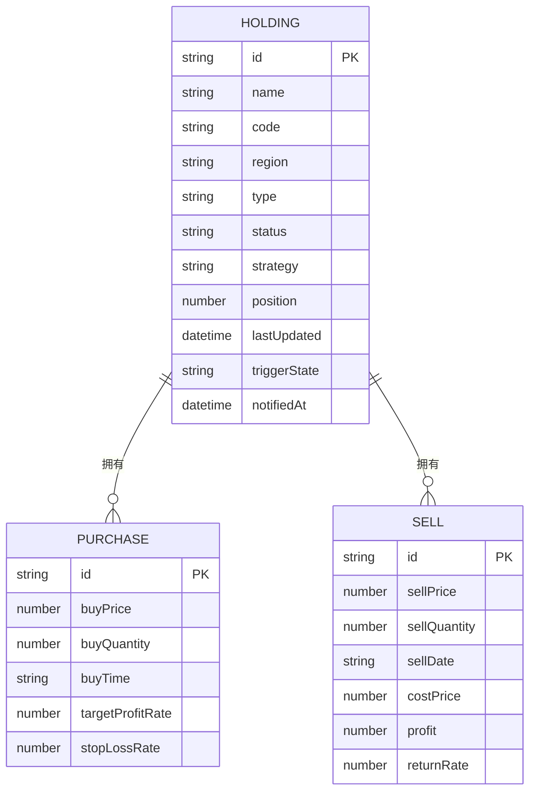

图表来源
- [data/holdings.json:1-462](file://data/holdings.json#L1-L462)
- [server/server.js:247-284](file://server/server.js#L247-L284)
- [docs/盈亏计算规则.md:9-46](file://docs/盈亏计算规则.md#L9-L46)

章节来源
- [data/holdings.json:1-462](file://data/holdings.json#L1-L462)
- [server/server.js:247-284](file://server/server.js#L247-L284)
- [docs/盈亏计算规则.md:9-46](file://docs/盈亏计算规则.md#L9-L46)

### 典型场景数据流时序图

#### 场景A：用户新增一笔买入记录
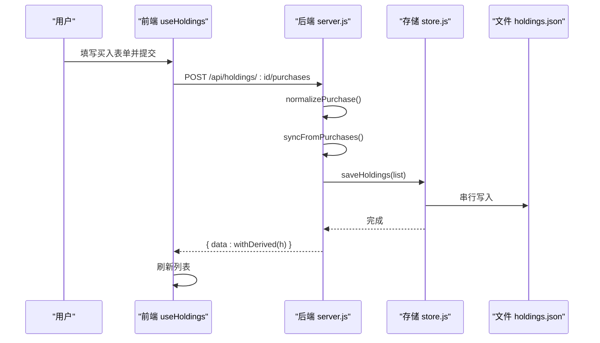

图表来源
- [web/src/composables/useHoldings.js:94-104](file://web/src/composables/useHoldings.js#L94-L104)
- [server/server.js:467-488](file://server/server.js#L467-L488)
- [server/server.js:247-284](file://server/server.js#L247-L284)
- [server/store.js:62-71](file://server/store.js#L62-L71)

#### 场景B：用户提交一笔卖出交易
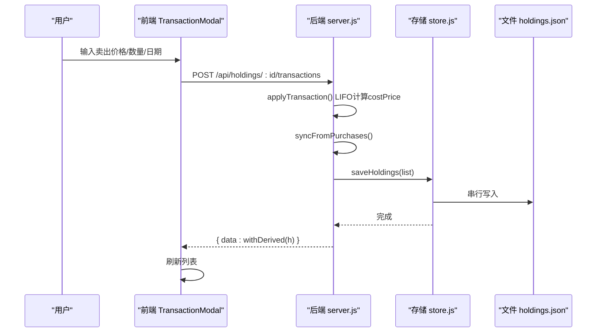

图表来源
- [web/src/components/TransactionModal.vue:30-44](file://web/src/components/TransactionModal.vue#L30-L44)
- [server/server.js:529-543](file://server/server.js#L529-L543)
- [server/server.js:346-407](file://server/server.js#L346-L407)
- [server/store.js:62-71](file://server/store.js#L62-L71)

#### 场景C：后台定时刷新行情并推送策略提醒
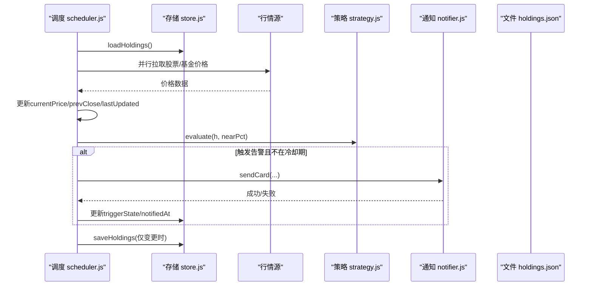

图表来源
- [server/scheduler.js:65-178](file://server/scheduler.js#L65-L178)
- [server/strategy.js:34-91](file://server/strategy.js#L34-L91)
- [server/notifier.js:81-112](file://server/notifier.js#L81-L112)
- [server/store.js:62-71](file://server/store.js#L62-L71)

## 依赖关系分析
- 前端依赖：App.vue引入useHoldings与组件；useHoldings依赖常量选项REFRESH_MS；组件通过事件向上透传用户操作。
- 后端依赖：server.js依赖store.js读写数据、notifier.js推送、import-csv-core导入；scheduler.js依赖store.js、provider（腾讯/基金）、strategy.js、notifier.js。
- 数据依赖：holdings.json为唯一持久化源；config.json驱动调度间隔、服务器端口、飞书Webhook与冷却策略。

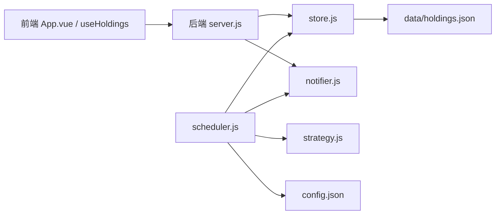

图表来源
- [web/src/App.vue:1-197](file://web/src/App.vue#L1-197)
- [web/src/composables/useHoldings.js:1-154](file://web/src/composables/useHoldings.js#L1-L154)
- [server/server.js:1-594](file://server/server.js#L1-L594)
- [server/store.js:1-71](file://server/store.js#L1-L71)
- [server/scheduler.js:1-178](file://server/scheduler.js#L1-L178)
- [server/strategy.js:1-91](file://server/strategy.js#L1-L91)
- [server/notifier.js:1-112](file://server/notifier.js#L1-L112)
- [config.json:1-19](file://config.json#L1-L19)

章节来源
- [web/src/App.vue:1-197](file://web/src/App.vue#L1-L197)
- [web/src/composables/useHoldings.js:1-154](file://web/src/composables/useHoldings.js#L1-L154)
- [server/server.js:1-594](file://server/server.js#L1-L594)
- [server/store.js:1-71](file://server/store.js#L1-L71)
- [server/scheduler.js:1-178](file://server/scheduler.js#L1-L178)
- [server/strategy.js:1-91](file://server/strategy.js#L1-L91)
- [server/notifier.js:1-112](file://server/notifier.js#L1-L112)
- [config.json:1-19](file://config.json#L1-L19)

## 性能与一致性
- 并发安全：
  - 读：内存缓存+mtime检测，避免频繁IO。
  - 写：串行队列writeChain保证顺序写入，防止覆盖。
- 实时性：
  - 前端固定间隔轮询（默认20秒），与后端调度间隔保持一致，降低抖动。
  - 后台按市场时段动态调整刷新频率，交易时段更频繁。
- 一致性：
  - 写操作后统一syncFromPurchases重新计算剩余成本/数量/均价，保证派生数据与原始记录一致。
  - 策略评估结果与通知状态落盘，避免重启丢失。
- 扩展性：
  - 策略与地区枚举集中定义，便于前后端同步。
  - 数据源抽象（腾讯/基金），易于替换或扩展。

[本节为通用指导，无需特定文件引用]

## 故障排查指南
- 前端获取失败：检查网络与后端服务是否运行；查看error状态与日志；确认REFRESH_MS配置合理。
- 后端接口报错：
  - 400：参数校验失败（如缺少必填字段、数值非法）。
  - 404：资源不存在（持仓或买入记录ID无效）。
  - 500：未捕获异常；查看控制台日志定位。
- 行情缺失：检查provider返回；scheduler会跳过无行情品种并记录警告。
- 通知失败：检查飞书Webhook与secret配置；notifier内置重试逻辑；查看错误日志。
- 数据不一致：确认writeChain串行写入；检查外部是否直接修改了holdings.json导致mtime变化。

章节来源
- [server/server.js:545-565](file://server/server.js#L545-L565)
- [server/scheduler.js:72-86](file://server/scheduler.js#L72-L86)
- [server/notifier.js:96-112](file://server/notifier.js#L96-L112)
- [server/store.js:62-71](file://server/store.js#L62-L71)

## 结论
Stock Advisor通过清晰的前后端分层、内存缓存与串行写盘的一致性保障、按市场时段的智能调度与策略评估、以及飞书通知闭环，实现了从用户操作到数据持久化的完整数据生命周期管理。其设计兼顾实时性与可靠性，适合中小规模投资跟踪与策略提醒场景。

[本节为总结，无需特定文件引用]

## 附录：数据模型与API契约

### 关键数据模型
- 持仓对象：包含基础信息、多次买入记录、卖出记录、补仓计划、当前价、昨收、最后更新时间、触发状态、通知时间等。
- 买入记录：单价、数量、日期、单笔止盈/止损比例。
- 卖出记录：卖出价、数量、日期、成本均价（LIFO）、利润、收益率。
- 派生字段：transactions（合并排序的交易流水）、剩余数量/成本/均价、市值、持仓盈亏、今日盈亏、加权止盈/止损等。

章节来源
- [data/holdings.json:1-462](file://data/holdings.json#L1-L462)
- [docs/盈亏计算规则.md:9-46](file://docs/盈亏计算规则.md#L9-L46)
- [server/server.js:247-284](file://server/server.js#L247-L284)

### RESTful API摘要
- GET /api/holdings：获取持仓列表（含派生字段）。
- POST /api/holdings：创建持仓。
- PATCH /api/holdings/:id：更新持仓级字段。
- POST /api/holdings/:id/purchases：追加买入记录。
- PATCH /api/holdings/:id/purchases/:pid：修改买入记录。
- DELETE /api/holdings/:id/purchases/:pid：删除买入记录。
- POST /api/holdings/:id/transactions：提交买入或卖出。
- POST /api/import-csv：导入CSV买卖记录。
- POST /api/test-feishu：测试飞书推送。

章节来源
- [server/server.js:409-565](file://server/server.js#L409-L565)