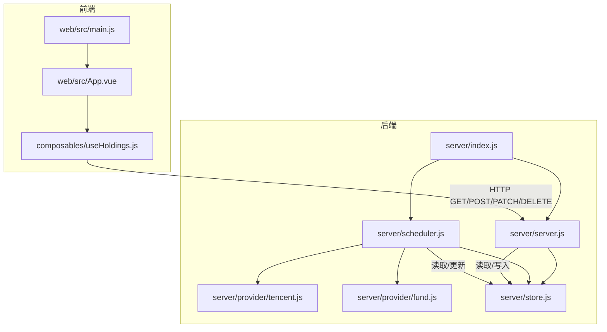
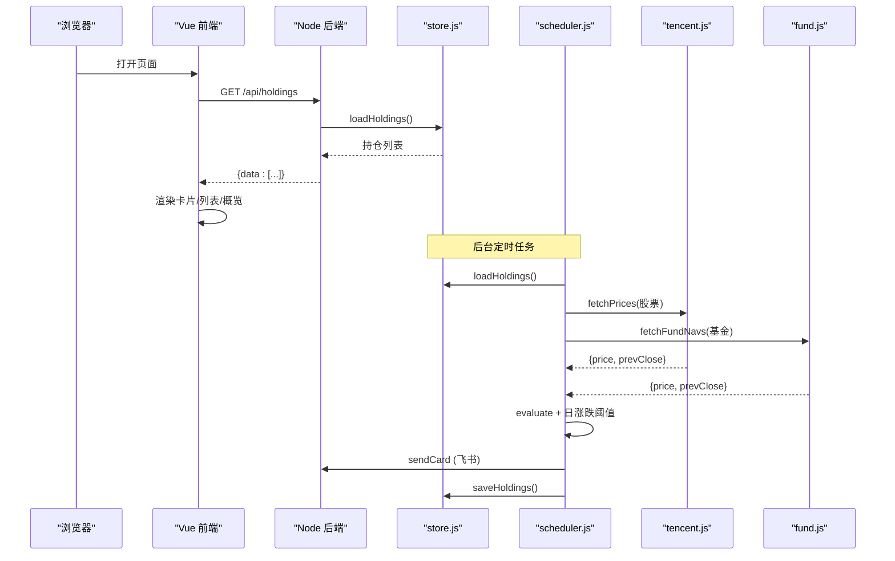
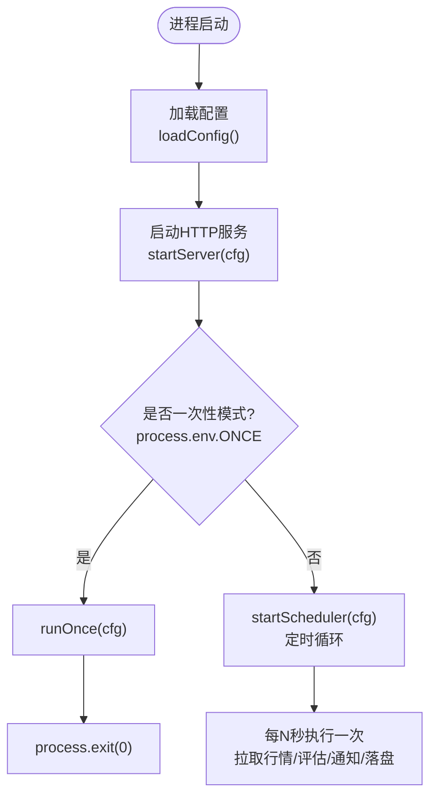
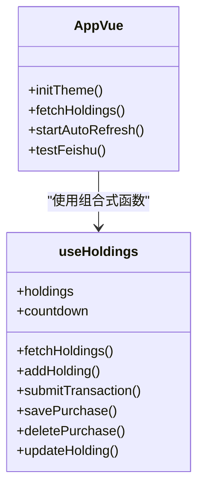
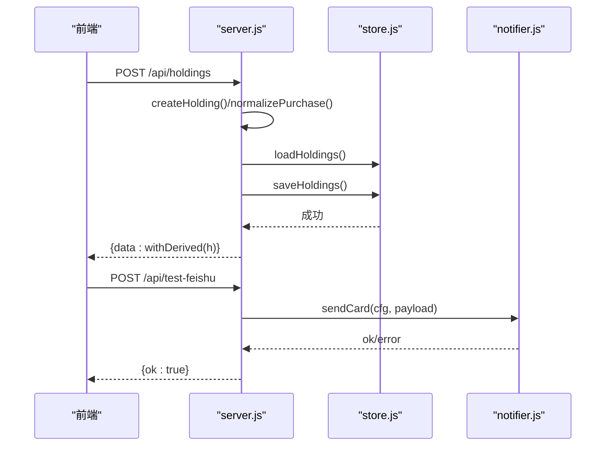
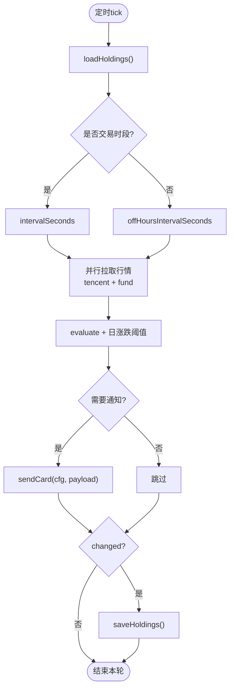
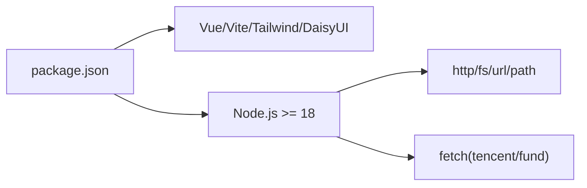
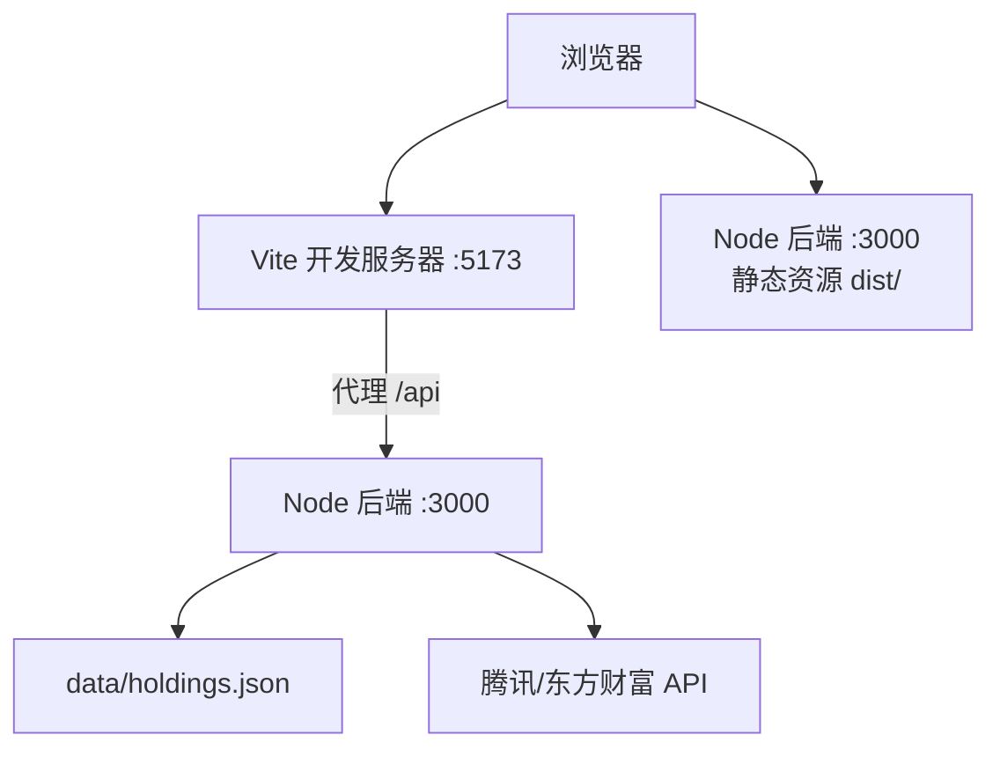

# 整体架构设计

<cite>
**本文引用的文件**
- [server/index.js](file://server/index.js)
- [server/server.js](file://server/server.js)
- [server/scheduler.js](file://server/scheduler.js)
- [server/config.js](file://server/config.js)
- [server/store.js](file://server/store.js)
- [server/provider/tencent.js](file://server/provider/tencent.js)
- [server/provider/fund.js](file://server/provider/fund.js)
- [web/src/main.js](file://web/src/main.js)
- [web/src/App.vue](file://web/src/App.vue)
- [web/src/composables/useHoldings.js](file://web/src/composables/useHoldings.js)
- [vite.config.js](file://vite.config.js)
- [tailwind.config.js](file://tailwind.config.js)
- [package.json](file://package.json)
- [config.json](file://config.json)
- [start.sh](file://start.sh)
</cite>

## 目录
1. [简介](#简介)
2. [项目结构](#项目结构)
3. [核心组件](#核心组件)
4. [架构总览](#架构总览)
5. [详细组件分析](#详细组件分析)
6. [依赖关系分析](#依赖关系分析)
7. [性能与可扩展性](#性能与可扩展性)
8. [部署拓扑与运行环境](#部署拓扑与运行环境)
9. [故障排查指南](#故障排查指南)
10. [结论](#结论)

## 简介
本系统为“股票秘书”（Stock Advisor）前后端分离的持仓管理与行情监控系统。前端基于 Vue 3 + Vite + Tailwind CSS + DaisyUI，提供可视化界面、自动刷新与交互操作；后端基于 Node.js（ES Modules），提供 HTTP API、静态资源托管、定时调度与第三方数据源集成（腾讯财经、东方财富基金净值），并支持飞书机器人通知。系统通过配置驱动启动流程，实现“交易时段高频刷新、非交易时段降频”的智能调度策略。

## 项目结构
- 后端服务位于 server/：入口 index.js，HTTP 服务 server.js，调度器 scheduler.js，配置加载 config.js，持久化 store.js，数据源 provider/tencent.js 与 provider/fund.js，通知 notifier.js，策略 strategy.js。
- 前端应用位于 web/：Vue 3 单页应用，入口 main.js，根组件 App.vue，组合式函数 composables/，常量 constants/，样式 style.css。
- 构建与运行：Vite 构建产物输出到 dist/，由后端统一托管；开发模式通过 Vite 代理 /api 到后端。
- 配置：config.json 定义调度间隔、服务器地址端口、飞书 Webhook、通知冷却等。
- 启动脚本 start.sh 支持一键生产/开发模式。

图表来源
- [server/index.js:1-17](file://server/index.js#L1-L17)
- [server/server.js:567-594](file://server/server.js#L567-L594)
- [server/scheduler.js:65-178](file://server/scheduler.js#L65-L178)
- [web/src/main.js:1-6](file://web/src/main.js#L1-L6)
- [web/src/App.vue:1-197](file://web/src/App.vue#L1-L197)
- [web/src/composables/useHoldings.js:1-154](file://web/src/composables/useHoldings.js#L1-L154)

章节来源
- [package.json:1-32](file://package.json#L1-L32)
- [vite.config.js:1-26](file://vite.config.js#L1-L26)
- [tailwind.config.js:1-54](file://tailwind.config.js#L1-L54)
- [config.json:1-19](file://config.json#L1-L19)

## 核心组件
- 启动入口：server/index.js 负责加载配置、启动 HTTP 服务与调度器，支持一次性执行模式（ONCE）。
- HTTP 服务：server/server.js 提供静态资源托管与 RESTful API（持仓列表、新建、买入/卖出记录、CSV 导入、飞书测试消息等）。
- 调度器：server/scheduler.js 按市场时区判断交易时段，并行拉取股票与基金行情，计算收益与触发告警，并通过 notifier 推送。
- 数据源：provider/tencent.js 获取股票实时行情；provider/fund.js 获取场外基金净值。
- 存储：server/store.js 内存缓存 + JSON 文件持久化，串行写盘避免并发覆盖。
- 前端：web/src/App.vue 聚合状态与 UI，useHoldings.js 封装数据请求与自动刷新逻辑。

章节来源
- [server/index.js:1-17](file://server/index.js#L1-L17)
- [server/server.js:1-594](file://server/server.js#L1-L594)
- [server/scheduler.js:1-178](file://server/scheduler.js#L1-L178)
- [server/provider/tencent.js:1-41](file://server/provider/tencent.js#L1-L41)
- [server/provider/fund.js:1-54](file://server/provider/fund.js#L1-L54)
- [server/store.js:1-71](file://server/store.js#L1-L71)
- [web/src/App.vue:1-197](file://web/src/App.vue#L1-L197)
- [web/src/composables/useHoldings.js:1-154](file://web/src/composables/useHoldings.js#L1-L154)

## 架构总览
系统采用前后端分离架构：
- 前端职责：用户交互、数据展示、自动刷新、主题切换、弹窗表单提交。
- 后端职责：API 路由、业务计算（收益、均价、止盈止损）、数据持久化、外部数据抓取、定时任务与通知。
- 数据流：前端调用 /api/*；后端根据路径分发处理，读写 data/holdings.json；调度器周期性更新行情与状态，必要时发送飞书通知。

图表来源
- [web/src/composables/useHoldings.js:15-29](file://web/src/composables/useHoldings.js#L15-L29)
- [server/server.js:409-565](file://server/server.js#L409-L565)
- [server/scheduler.js:65-178](file://server/scheduler.js#L65-L178)
- [server/provider/tencent.js:6-41](file://server/provider/tencent.js#L6-L41)
- [server/provider/fund.js:6-54](file://server/provider/fund.js#L6-L54)
- [server/store.js:40-71](file://server/store.js#L40-L71)

## 详细组件分析

### 启动流程（从 index.js 开始）
- 加载配置：server/config.js 读取 config.json，返回 schedule、server、feishu、notify 等配置项。
- 启动 HTTP 服务：server/server.js 监听 host/port，提供 /api/* 与静态资源托管（dist/）。
- 启动调度器：server/scheduler.js 进入循环，按交易时段选择刷新间隔，拉取行情、评估策略、发送通知、落盘更新。
- 一次性模式：设置环境变量 ONCE 时，仅执行一次 runOnce 后退出进程。

图表来源
- [server/index.js:1-17](file://server/index.js#L1-L17)
- [server/config.js:1-11](file://server/config.js#L1-L11)
- [server/server.js:567-594](file://server/server.js#L567-L594)
- [server/scheduler.js:167-178](file://server/scheduler.js#L167-L178)

章节来源
- [server/index.js:1-17](file://server/index.js#L1-L17)
- [server/config.js:1-11](file://server/config.js#L1-L11)
- [server/server.js:567-594](file://server/server.js#L567-L594)
- [server/scheduler.js:167-178](file://server/scheduler.js#L167-L178)

### 前端应用（Vue 3 + Vite + Tailwind + DaisyUI）
- 入口：web/src/main.js 创建 Vue 应用并挂载到 #app。
- 根组件：web/src/App.vue 管理主题、过滤、弹窗、自动刷新倒计时、测试飞书消息。
- 数据层：web/src/composables/useHoldings.js 封装 fetch 请求、自动刷新定时器、汇总计算与写操作。
- 构建与开发：vite.config.js 将 root 指向 web，构建输出到 ../dist；开发模式通过 proxy 将 /api 转发到 :3000。
- 样式：tailwind.config.js 启用 darkMode: class，配置 DaisyUI 主题 stocklight/stockdark。

图表来源
- [web/src/App.vue:1-197](file://web/src/App.vue#L1-L197)
- [web/src/composables/useHoldings.js:1-154](file://web/src/composables/useHoldings.js#L1-L154)

章节来源
- [web/src/main.js:1-6](file://web/src/main.js#L1-L6)
- [web/src/App.vue:1-197](file://web/src/App.vue#L1-L197)
- [web/src/composables/useHoldings.js:1-154](file://web/src/composables/useHoldings.js#L1-L154)
- [vite.config.js:1-26](file://vite.config.js#L1-L26)
- [tailwind.config.js:1-54](file://tailwind.config.js#L1-L54)

### 后端服务（HTTP + API + 静态托管）
- 静态托管：serveStatic 优先精确匹配文件，不存在则回退到 index.html，支持 SPA 路由。
- API 路由：handleApi 处理 /api/holdings（GET/POST/PATCH/DELETE）、/api/import-csv、/api/test-feishu 等。
- 业务计算：withDerived 派生交易明细、成本、市值、盈亏、今日收益、均价、止盈止损等；applyTransaction 处理买入/卖出（LIFO 成本分摊）。
- 错误处理：readBody/readRawBody 解析请求体，sendJSON 统一响应格式，catch 捕获异常返回 500。

图表来源
- [server/server.js:35-594](file://server/server.js#L35-L594)
- [server/store.js:40-71](file://server/store.js#L40-L71)

章节来源
- [server/server.js:1-594](file://server/server.js#L1-L594)

### 调度器（行情拉取 + 策略评估 + 通知）
- 交易时段判断：isMarketOpen 基于区域时区与时间区间判断；anyMarketOpen 检查是否有活跃持仓处于交易时段。
- 数据源分流：股票走 tencent.js，基金走 fund.js；Promise.all 并行请求提升吞吐。
- 策略评估：evaluate 结合 nearThresholdPct 计算触发态；每日涨跌阈值触发 DAILY_DROP/DAILY_RISE。
- 通知冷却：cooldownSeconds 内同一触发态不重复推送；保存 notifiedAt 与 triggerState。
- 落盘：changed 标志决定是否 saveHoldings。

图表来源
- [server/scheduler.js:7-178](file://server/scheduler.js#L7-L178)
- [server/provider/tencent.js:6-41](file://server/provider/tencent.js#L6-L41)
- [server/provider/fund.js:6-54](file://server/provider/fund.js#L6-L54)
- [server/store.js:40-71](file://server/store.js#L40-L71)

章节来源
- [server/scheduler.js:1-178](file://server/scheduler.js#L1-L178)

### 技术栈选择与优势
- 前端
  - Vue 3：组合式 API 与响应式状态管理，组件化良好，生态成熟。
  - Vite：快速构建与热更新，开发体验佳，插件体系完善。
  - Tailwind CSS + DaisyUI：原子化样式与现成 UI 组件，主题切换便捷，减少自定义 CSS 维护成本。
- 后端
  - Node.js + ES Modules：原生模块系统，异步 I/O 适合高并发 IO 场景（HTTP、网络请求）。
  - 无框架轻量 HTTP：减少依赖，便于理解与控制请求处理流程。
  - 多数据源适配器：解耦不同数据提供方，易于扩展新数据源。
- 调度与通知
  - 基于 setTimeout 的简单调度，满足低频轮询需求；冷却机制避免通知风暴。
  - 飞书 Webhook 通知，无需额外服务端，降低运维复杂度。

章节来源
- [package.json:1-32](file://package.json#L1-L32)
- [vite.config.js:1-26](file://vite.config.js#L1-L26)
- [tailwind.config.js:1-54](file://tailwind.config.js#L1-L54)
- [server/server.js:1-594](file://server/server.js#L1-L594)
- [server/scheduler.js:1-178](file://server/scheduler.js#L1-L178)

### 模块化设计与解耦策略
- 分层清晰：入口（index.js）、HTTP（server.js）、调度（scheduler.js）、数据源（provider/*）、存储（store.js）、通知（notifier.js）、策略（strategy.js）。
- 接口契约：各模块通过明确导出函数进行通信（如 loadConfig、startServer、runOnce、fetchPrices、loadHoldings/saveHoldings）。
- 数据源抽象：tencent.js 与 fund.js 提供统一返回值结构，便于调度器合并结果。
- 前端组合式函数：useHoldings.js 集中状态与副作用，组件只关注视图与交互。

章节来源
- [server/index.js:1-17](file://server/index.js#L1-L17)
- [server/server.js:1-594](file://server/server.js#L1-L594)
- [server/scheduler.js:1-178](file://server/scheduler.js#L1-L178)
- [server/provider/tencent.js:1-41](file://server/provider/tencent.js#L1-L41)
- [server/provider/fund.js:1-54](file://server/provider/fund.js#L1-L54)
- [web/src/composables/useHoldings.js:1-154](file://web/src/composables/useHoldings.js#L1-L154)

## 依赖关系分析
- 前端依赖：Vue 3、Vite、Tailwind CSS、DaisyUI。
- 后端依赖：Node.js 内置 http/fs/url/path，外部依赖较少；数据源通过 fetch 访问腾讯与东方财富。
- 运行时依赖：Node >= 18（package.json engines），确保 ES Modules 与 fetch 可用。

图表来源
- [package.json:1-32](file://package.json#L1-L32)

章节来源
- [package.json:1-32](file://package.json#L1-L32)

## 性能与可扩展性
- 并行数据拉取：调度器对股票与基金数据源使用 Promise.all，降低延迟。
- 内存缓存与串行写盘：store.js 使用内存缓存与 mtime 检测，避免频繁读盘；writeChain 串行写盘防止覆盖。
- 动态刷新间隔：交易时段高频、非交易时段降频，节省资源。
- 通知冷却：cooldownSeconds 控制重复通知频率，避免刷屏。
- 可扩展点：新增数据源只需实现 provider/* 并接入调度器；新增策略在 strategy.js 中扩展；新增通知渠道可在 notifier.js 中扩展。

[本节为通用性能讨论，不直接分析具体代码文件]

## 部署拓扑与运行环境
- 开发模式
  - 后端：node server/index.js 监听 :3000，提供 API 与静态资源。
  - 前端：npx vite --host 监听 :5173，代理 /api 到 :3000，支持 HMR。
- 生产模式
  - 构建前端：npm run build 输出到 dist/。
  - 后端托管：node server/index.js 同时提供 API 与静态资源，默认 http://127.0.0.1:3000。
- 启动脚本：start.sh 支持一键启动（prod/dev），自动安装依赖、检查 Node 版本、构建与启动。
- 运行环境要求
  - Node.js >= 18（ES Modules、fetch 支持）。
  - 网络可访问腾讯财经与东方财富 API。
  - 可选：配置飞书 Webhook 与密钥以启用通知。

图表来源
- [vite.config.js:14-24](file://vite.config.js#L14-L24)
- [server/server.js:567-594](file://server/server.js#L567-L594)
- [start.sh:51-99](file://start.sh#L51-L99)

章节来源
- [start.sh:1-100](file://start.sh#L1-L100)
- [vite.config.js:1-26](file://vite.config.js#L1-L26)
- [package.json:15-17](file://package.json#L15-L17)

## 故障排查指南
- 无法获取行情
  - 检查网络连通性与 User-Agent/Referer 头；查看控制台日志中的 [stock-fetch]/[fund-fetch] 错误信息。
  - 确认股票代码/基金代码正确，且对应数据源有返回。
- 飞书通知失败
  - 检查 config.json 中 feishu.webhook 与 secret 是否正确；使用 /api/test-feishu 验证。
- 数据未落盘或覆盖
  - 检查 store.js 的 writeChain 与 mtime 逻辑；确认没有外部进程同时修改 holdings.json。
- 前端无法刷新
  - 开发模式确认 Vite 代理 /api 到 :3000；生产模式确认 dist/ 存在且后端已启动。
- 启动报错
  - 确认 Node 版本 >= 18；检查 package.json 依赖是否安装完成。

章节来源
- [server/scheduler.js:77-86](file://server/scheduler.js#L77-L86)
- [server/server.js:545-565](file://server/server.js#L545-L565)
- [server/store.js:40-71](file://server/store.js#L40-L71)
- [vite.config.js:18-23](file://vite.config.js#L18-L23)
- [package.json:15-17](file://package.json#L15-L17)

## 结论
Stock Advisor 采用前后端分离架构，前端聚焦用户体验与交互，后端专注数据处理、调度与通知。通过模块化设计与数据源抽象，系统具备良好的可扩展性与可维护性。启动流程简洁清晰，支持开发与生产两种模式，配合配置驱动与智能调度，满足日常持仓监控与提醒需求。建议在后续迭代中持续优化数据源容错、增加更多策略与通知渠道，并完善监控与日志体系。