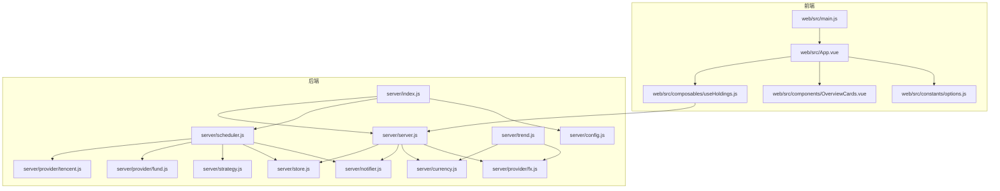
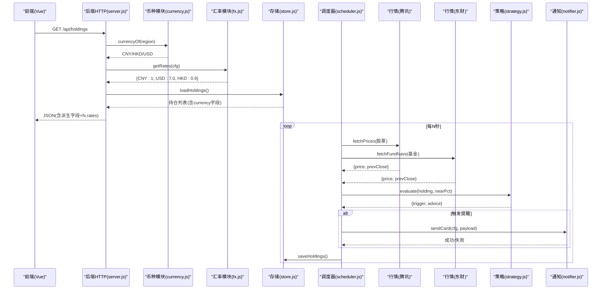
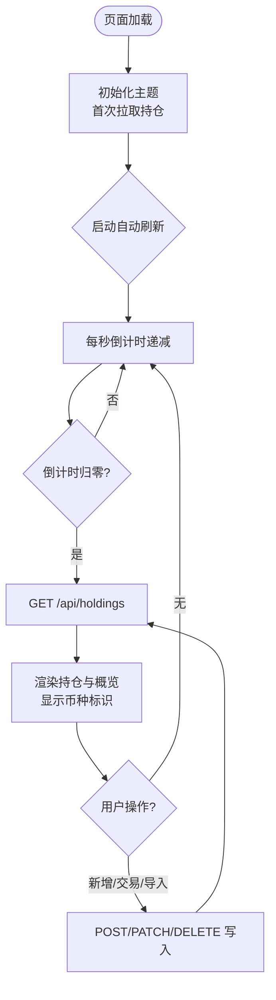
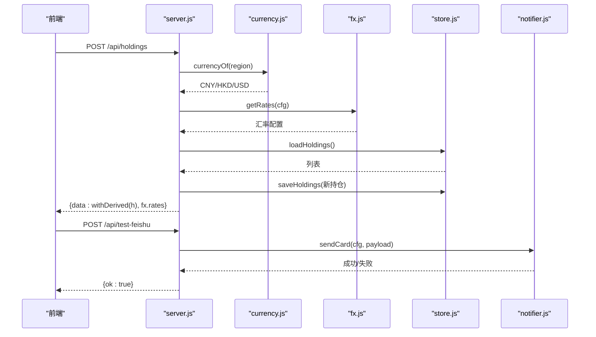
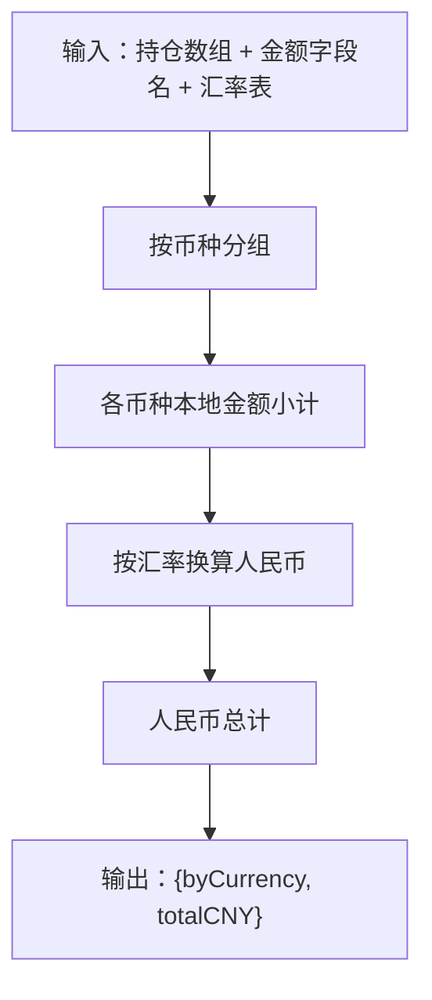
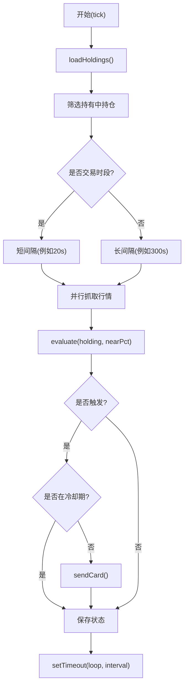
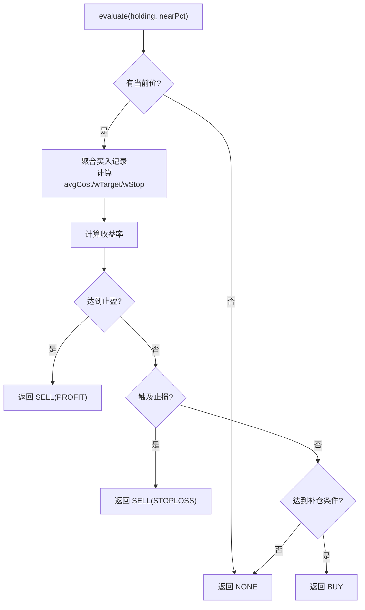
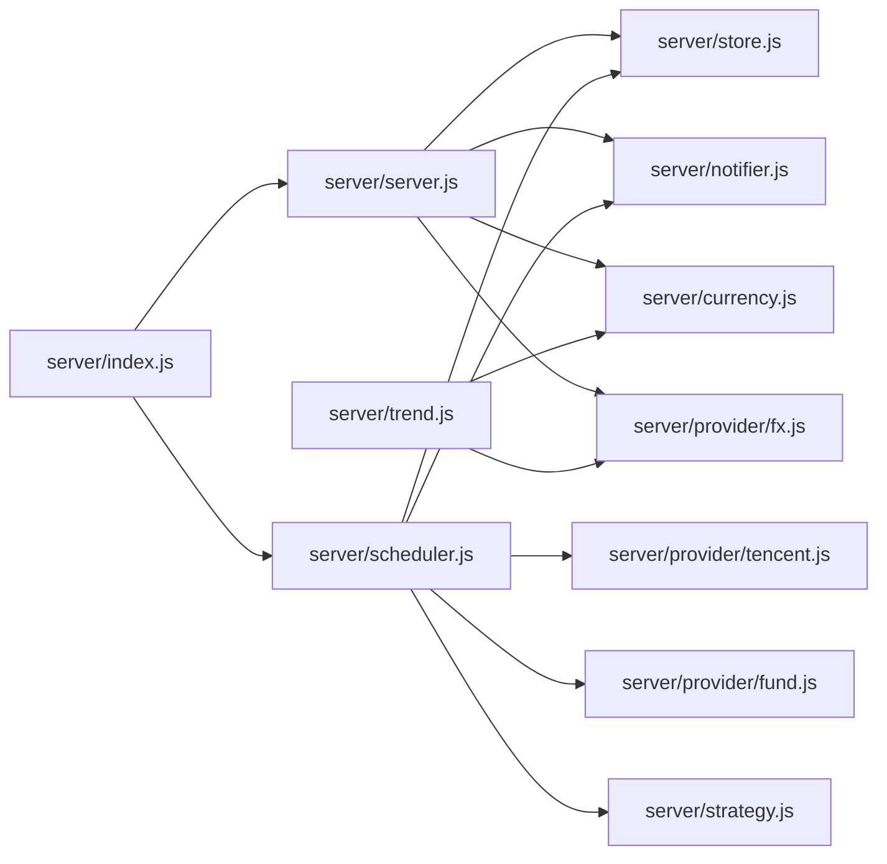

# 系统架构

<cite>
**本文引用的文件**
- [server/index.js](file://server/index.js)
- [server/server.js](file://server/server.js)
- [server/scheduler.js](file://server/scheduler.js)
- [server/strategy.js](file://server/strategy.js)
- [server/store.js](file://server/store.js)
- [server/notifier.js](file://server/notifier.js)
- [server/currency.js](file://server/currency.js)
- [server/provider/fx.js](file://server/provider/fx.js)
- [server/provider/tencent.js](file://server/provider/tencent.js)
- [server/provider/fund.js](file://server/provider/fund.js)
- [server/config.js](file://server/config.js)
- [server/trend.js](file://server/trend.js)
- [web/src/main.js](file://web/src/main.js)
- [web/src/App.vue](file://web/src/App.vue)
- [web/src/composables/useHoldings.js](file://web/src/composables/useHoldings.js)
- [web/src/components/OverviewCards.vue](file://web/src/components/OverviewCards.vue)
- [web/src/constants/options.js](file://web/src/constants/options.js)
- [config.json](file://config.json)
- [package.json](file://package.json)
</cite>

## 更新摘要
**变更内容**
- 新增多货币支持模块，实现跨市场币种映射与汇率换算
- 扩展持仓数据模型，增加币种字段和显示代码
- 增强趋势计算，支持按币种折算人民币汇总
- 前端界面支持分币种小计展示和汇率配置显示
- 配置中心新增汇率配置项，支持环境变量覆盖

## 目录
1. [简介](#简介)
2. [项目结构](#项目结构)
3. [核心组件](#核心组件)
4. [架构总览](#架构总览)
5. [详细组件分析](#详细组件分析)
6. [依赖关系分析](#依赖关系分析)
7. [性能考量](#性能考量)
8. [故障排查指南](#故障排查指南)
9. [结论](#结论)
10. [附录：API 与数据模型](#附录api-与数据模型)

## 简介
本系统为"股票秘书"（Stock Advisor）的轻量级个人投顾工具，采用前后端分离架构：前端基于 Vue 构建用户界面与交互；后端基于 Node.js 提供 HTTP API、静态资源托管、持仓数据持久化、定时调度、行情抓取、策略评估与飞书机器人推送。系统支持多市场（A股、港股、美股）与基金净值获取，通过阈值策略实现买点/卖点提醒，并以结构化卡片形式推送到飞书。**新增多货币支持功能**，可自动识别不同市场的交易币种，进行汇率换算和统一人民币汇总展示。

## 项目结构
- 前端（web）
  - 入口：web/src/main.js
  - 根组件：web/src/App.vue
  - 状态与网络：web/src/composables/useHoldings.js
  - 概览组件：web/src/components/OverviewCards.vue
  - 常量与枚举：web/src/constants/options.js
- 后端（server）
  - 启动与装配：server/index.js
  - HTTP 服务与 API：server/server.js
  - 定时调度：server/scheduler.js
  - 策略引擎：server/strategy.js
  - 数据持久化：server/store.js
  - 通知推送：server/notifier.js
  - **多货币支持：server/currency.js**
  - **汇率配置：server/provider/fx.js**
  - 趋势计算：server/trend.js
  - 配置加载：server/config.js
  - 行情源：server/provider/tencent.js（腾讯财经）、server/provider/fund.js（东方财富基金净值）
- 配置与脚本
  - 运行时配置：config.json
  - 包管理与脚本：package.json

**图表来源**
- [server/index.js:1-17](file://server/index.js#L1-L17)
- [server/server.js:567-594](file://server/server.js#L567-L594)
- [server/scheduler.js:65-178](file://server/scheduler.js#L65-L178)
- [server/strategy.js:34-90](file://server/strategy.js#L34-L90)
- [server/store.js:40-71](file://server/store.js#L40-L71)
- [server/notifier.js:81-112](file://server/notifier.js#L81-L112)
- [server/currency.js:1-49](file://server/currency.js#L1-L49)
- [server/provider/fx.js:1-24](file://server/provider/fx.js#L1-L24)
- [server/trend.js:1-189](file://server/trend.js#L1-L189)
- [server/provider/tencent.js:6-42](file://server/provider/tencent.js#L6-L42)
- [server/provider/fund.js:6-55](file://server/provider/fund.js#L6-L55)
- [web/src/main.js:1-6](file://web/src/main.js#L1-L6)
- [web/src/App.vue:1-197](file://web/src/App.vue#L1-L197)
- [web/src/composables/useHoldings.js:15-154](file://web/src/composables/useHoldings.js#L15-L154)

**章节来源**
- [server/index.js:1-17](file://server/index.js#L1-L17)
- [server/server.js:567-594](file://server/server.js#L567-L594)
- [web/src/main.js:1-6](file://web/src/main.js#L1-L6)
- [web/src/App.vue:1-197](file://web/src/App.vue#L1-L197)
- [web/src/composables/useHoldings.js:15-154](file://web/src/composables/useHoldings.js#L15-L154)

## 核心组件
- 前端应用（Vue）
  - 负责展示持仓概览、交易记录、买入/卖出操作、CSV 导入、主题切换与自动刷新倒计时。
  - 通过组合式函数 useHoldings 统一发起 API 请求并维护全局状态。
  - **新增多货币支持**：支持按币种分组展示成本、市值、收益等指标的小计信息。
- 后端服务（Node.js）
  - HTTP 服务器：提供 RESTful API 与静态页面托管。
  - 数据存储：JSON 文件持久化，内存缓存 + 串行写盘保证一致性。
  - 调度器：按市场交易时段动态调整刷新间隔，拉取行情、执行策略、发送通知。
  - 策略引擎：基于成本加权止盈/止损与补仓条件计算触发信号。
  - 通知模块：构造飞书交互式卡片消息并发送，支持签名与重试。
  - **多货币支持模块**：实现地区到币种的映射、汇率换算、分币种汇总计算。
  - **汇率配置模块**：提供汇率获取逻辑，支持环境变量、配置文件和默认值三级优先级。
  - 趋势计算模块：支持按币种折算人民币的历史收益序列计算。
  - 行情适配器：分别对接腾讯财经（股票）与东方财富（基金净值）。
- 配置中心
  - config.json 集中管理调度频率、服务器地址端口、飞书 Webhook、冷却时间、**汇率配置**等。

**章节来源**
- [web/src/App.vue:1-197](file://web/src/App.vue#L1-L197)
- [web/src/composables/useHoldings.js:15-154](file://web/src/composables/useHoldings.js#L15-L154)
- [web/src/components/OverviewCards.vue:1-127](file://web/src/components/OverviewCards.vue#L1-L127)
- [server/server.js:55-565](file://server/server.js#L55-L565)
- [server/scheduler.js:65-178](file://server/scheduler.js#L65-L178)
- [server/strategy.js:34-90](file://server/strategy.js#L34-L90)
- [server/notifier.js:81-112](file://server/notifier.js#L81-L112)
- [server/currency.js:1-49](file://server/currency.js#L1-L49)
- [server/provider/fx.js:1-24](file://server/provider/fx.js#L1-L24)
- [server/trend.js:1-189](file://server/trend.js#L1-L189)
- [server/provider/tencent.js:6-42](file://server/provider/tencent.js#L6-L42)
- [server/provider/fund.js:6-55](file://server/provider/fund.js#L6-L55)
- [config.json:1-22](file://config.json#L1-L22)

## 架构总览
系统采用前后端分离与模块化设计：
- 前端通过浏览器发起 HTTP 请求到后端 /api/* 接口，渲染持仓列表与交易表单。
- 后端在独立进程中运行，同时承担静态资源托管与业务 API。
- 调度器周期性执行"行情抓取 → 策略评估 → 通知推送"，并将结果落盘。
- **多货币支持贯穿整个数据流**：从持仓数据标注币种，到收益计算时按汇率折算，再到前端展示时分币种统计。
- 外部系统集成点包括腾讯财经 API（股票实时行情）、东方财富 API（基金净值）、飞书机器人 Webhook（通知）。

**图表来源**
- [server/server.js:410-565](file://server/server.js#L410-L565)
- [server/currency.js:8-10](file://server/currency.js#L8-L10)
- [server/provider/fx.js:18-23](file://server/provider/fx.js#L18-L23)
- [server/store.js:40-71](file://server/store.js#L40-L71)
- [server/scheduler.js:65-178](file://server/scheduler.js#L65-L178)
- [server/provider/tencent.js:6-42](file://server/provider/tencent.js#L6-L42)
- [server/provider/fund.js:6-55](file://server/provider/fund.js#L6-L55)
- [server/strategy.js:34-90](file://server/strategy.js#L34-L90)
- [server/notifier.js:81-112](file://server/notifier.js#L81-L112)

## 详细组件分析

### 前端应用（Vue）
- 职责
  - 展示持仓概览、交易明细、买入/卖出弹窗、CSV 导入、主题切换。
  - 自动刷新：使用定时器每秒递减倒计时，归零时调用 /api/holdings 刷新数据。
  - 过滤与聚合：按类型与市场进行多选过滤，汇总总成本、总市值、持有收益与今日收益。
  - **多货币支持**：接收后端返回的 fx.rates 配置，在前端进行本地汇率换算和分币种统计展示。
- 关键流程
  - 初始化：挂载应用、读取主题、首次拉取数据、启动自动刷新。
  - 写操作：新增持仓、追加买入记录、提交交易、删除买入记录、更新持仓级告警阈值。
  - 飞书测试：调用 /api/test-feishu 验证推送链路。

**图表来源**
- [web/src/App.vue:121-197](file://web/src/App.vue#L121-L197)
- [web/src/composables/useHoldings.js:15-154](file://web/src/composables/useHoldings.js#L15-L154)

**章节来源**
- [web/src/main.js:1-6](file://web/src/main.js#L1-L6)
- [web/src/App.vue:1-197](file://web/src/App.vue#L1-L197)
- [web/src/composables/useHoldings.js:15-154](file://web/src/composables/useHoldings.js#L15-L154)
- [web/src/components/OverviewCards.vue:1-127](file://web/src/components/OverviewCards.vue#L1-L127)
- [web/src/constants/options.js:1-33](file://web/src/constants/options.js#L1-L33)

### 后端 HTTP 服务与 API
- 职责
  - 静态资源托管：将 Vite 构建产物作为 SPA 托管，非 /api 路径回退到 index.html。
  - API 路由：持仓 CRUD、CSV 导入、交易记录、飞书测试消息。
  - 数据派生：对持仓数据进行收益、均价、买卖记录合并等派生计算后返回给前端。
  - **多货币支持集成**：为每个持仓标注币种字段，返回汇率配置供前端使用。
- 关键接口
  - GET /api/holdings：返回持仓列表（含派生字段、币种信息、汇率配置）
  - POST /api/holdings：新建持仓
  - PATCH /api/holdings/:id：更新持仓级字段（如日涨跌告警阈值）
  - POST /api/holdings/:id/purchases：追加买入记录
  - PATCH /api/holdings/:id/purchases/:pid：修改买入记录
  - DELETE /api/holdings/:id/purchases/:pid：删除买入记录
  - POST /api/holdings/:id/transactions：提交买入/卖出交易（兼容旧接口）
  - POST /api/import-csv：批量导入 CSV 买卖记录
  - POST /api/test-feishu：发送测试飞书消息

**图表来源**
- [server/server.js:410-565](file://server/server.js#L410-L565)
- [server/currency.js:8-10](file://server/currency.js#L8-L10)
- [server/provider/fx.js:18-23](file://server/provider/fx.js#L18-L23)
- [server/store.js:40-71](file://server/store.js#L40-L71)
- [server/notifier.js:81-112](file://server/notifier.js#L81-L112)

**章节来源**
- [server/server.js:35-594](file://server/server.js#L35-L594)
- [server/store.js:40-71](file://server/store.js#L40-L71)
- [server/notifier.js:81-112](file://server/notifier.js#L81-L112)

### 多货币支持模块
- 职责
  - **地区到币种映射**：根据市场前缀（sh/sz/hk/us）或中文标签（A股/港股/美股）确定交易币种。
  - **汇率换算**：将外币金额按汇率转换为人民币，支持非法值的容错处理。
  - **分币种汇总**：对一批持仓的指定金额字段进行按币种分组统计和人民币合计计算。
- 关键逻辑
  - 币种映射：REGION_CURRENCY 表定义地区前缀到标准币种代码的映射。
  - 汇率换算：fxToCNY 函数处理数值验证、汇率查找和乘法运算。
  - 汇总计算：breakdownByCurrency 函数实现分组累加和最终人民币转换。

**图表来源**
- [server/currency.js:35-48](file://server/currency.js#L35-L48)

**章节来源**
- [server/currency.js:1-49](file://server/currency.js#L1-L49)

### 汇率配置模块
- 职责
  - **多级优先级汇率获取**：环境变量 > 配置文件 > 内置默认值。
  - **汇率标准化**：统一返回 {CNY: 1, USD: x, HKD: y} 格式。
  - **数值验证**：确保汇率值为正数，无效值使用默认值。
- 关键特性
  - 环境变量支持：FX_USD_CNY、FX_HKD_CNY 可直接覆盖配置。
  - 配置文件支持：config.json 中 fx.rates 对象。
  - 默认值兜底：USD=7.0, HKD=0.9, CNY=1。

**章节来源**
- [server/provider/fx.js:1-24](file://server/provider/fx.js#L1-L24)
- [config.json:18-20](file://config.json#L18-L20)

### 趋势计算模块（多货币支持）
- 职责
  - **历史收益序列计算**：基于标的历史收盘价和交易记录，逐日重放计算持仓收益。
  - **多币种折算**：所有金额计算均按对应币种汇率转换为人民币。
  - **日期轴对齐**：合并多个标的的交易日期，生成统一的时间序列。
- 关键算法
  - 每日持仓数量：累计买入数量减去累计卖出数量。
  - 持仓收益：市值 - 累计买入成本 + 累计卖出金额（均折算人民币）。
  - 今日收益：(当日收盘 - 前收盘) × 当日持仓数量（折算人民币）。

**章节来源**
- [server/trend.js:1-189](file://server/trend.js#L1-L189)

### 调度器与行情抓取
- 职责
  - 判断当前市场是否处于交易时段，动态选择刷新间隔。
  - 并行抓取股票（腾讯）与基金（东方财富）价格，合并到持仓对象。
  - 执行策略评估，必要时发送飞书通知，并落盘状态变更。
- 关键逻辑
  - 交易时段判断：基于各市场本地时区与交易时间窗口。
  - 日涨跌告警：根据持仓配置的涨跌幅阈值触发 DAILY_RISE/DAILY_DROP。
  - 冷却机制：同一触发态在冷却时间内不重复推送。

**图表来源**
- [server/scheduler.js:65-178](file://server/scheduler.js#L65-L178)
- [server/provider/tencent.js:6-42](file://server/provider/tencent.js#L6-L42)
- [server/provider/fund.js:6-55](file://server/provider/fund.js#L6-L55)
- [server/strategy.js:34-90](file://server/strategy.js#L34-L90)

**章节来源**
- [server/scheduler.js:65-178](file://server/scheduler.js#L65-L178)
- [server/provider/tencent.js:6-42](file://server/provider/tencent.js#L6-L42)
- [server/provider/fund.js:6-55](file://server/provider/fund.js#L6-L55)

### 策略引擎
- 职责
  - 基于多次买入记录计算成本加权止盈/止损线。
  - 依据当前价与最近买入价判断买点（补仓）或卖点（止盈/止损）。
  - 输出触发类型与建议文案供通知模块使用。
- 关键点
  - 成本加权：以每笔买入的成本权重计算平均止盈/止损比例。
  - 近阈值提示：nearPct 用于提前预警接近阈值的情况。
  - 买点条件：达到补仓价或较最近买入价跌幅达到阈值。

**图表来源**
- [server/strategy.js:34-90](file://server/strategy.js#L34-L90)

**章节来源**
- [server/strategy.js:34-90](file://server/strategy.js#L34-L90)

### 数据持久化与并发控制
- 职责
  - 从 JSON 文件加载持仓数据，支持旧版扁平结构迁移至"多次买入记录"模型。
  - 内存缓存避免频繁读盘；串行写队列防止并发覆盖。
  - 写盘后同步 mtime，避免误判外部修改导致重复重载。
- 关键点
  - 迁移：首次加载时将旧模型转换为 purchases 数组。
  - 并发：saveHoldings 使用 Promise 链串行写入。

**章节来源**
- [server/store.js:24-71](file://server/store.js#L24-L71)

### 通知模块（飞书机器人）
- 职责
  - 构造交互式卡片消息（买点/卖点/日涨跌告警），支持签名与重试。
  - 通过 Webhook 推送至飞书自定义机器人。
- 关键点
  - 模板：不同触发类型对应不同标题与配色。
  - 安全：可选 secret 签名，timestamp + sign。
  - 容错：最多三次尝试，指数退避。

**章节来源**
- [server/notifier.js:4-112](file://server/notifier.js#L4-L112)

### 行情适配器
- 腾讯财经（股票）
  - 批量请求，解析 GBK/UTF-8 文本，提取当前价与昨收。
- 东方财富（基金净值）
  - 逐个查询，解析 JSONP，提取最新与上一交易日净值。

**章节来源**
- [server/provider/tencent.js:6-42](file://server/provider/tencent.js#L6-L42)
- [server/provider/fund.js:6-55](file://server/provider/fund.js#L6-L55)

## 依赖关系分析
- 组件耦合
  - server/index.js 仅负责装配：加载配置、启动服务与调度器。
  - server/server.js 依赖 store、notifier、import-csv-core、**currency、fx**，暴露 API。
  - scheduler 依赖 provider、strategy、notifier、store，形成"抓取→评估→通知→落盘"闭环。
  - web 层通过 useHoldings 与 server 解耦，仅依赖 REST 接口。
  - **新增依赖**：trend.js 依赖 currency.js 和 fx.js 进行多币种收益计算。
- 外部依赖
  - 腾讯财经 API（股票实时行情）
  - 东方财富 API（基金净值）
  - 飞书机器人 Webhook（通知）
- 潜在循环依赖
  - 当前模块间单向依赖，未见循环引用。

**图表来源**
- [server/index.js:1-17](file://server/index.js#L1-L17)
- [server/server.js:567-594](file://server/server.js#L567-L594)
- [server/scheduler.js:65-178](file://server/scheduler.js#L65-L178)
- [server/trend.js:1-189](file://server/trend.js#L1-L189)

**章节来源**
- [server/index.js:1-17](file://server/index.js#L1-L17)
- [server/server.js:567-594](file://server/server.js#L567-L594)
- [server/scheduler.js:65-178](file://server/scheduler.js#L65-L178)

## 性能考量
- 刷新频率自适应：交易时段短间隔、非交易时长间隔，降低无效请求。
- 并行抓取：股票与基金行情并行请求，减少整体延迟。
- 内存缓存与串行写盘：避免频繁 IO 与并发冲突。
- 通知冷却：同一触发态在冷却期内不重复推送，降低外部系统压力。
- 前端单定时器：统一倒计时与刷新，避免多定时器漂移。
- **多货币性能优化**：汇率计算使用纯函数，避免重复计算；前端本地汇率缓存减少网络请求。

[本节为通用指导，无需特定文件引用]

## 故障排查指南
- 行情抓取失败
  - 检查腾讯/东方财富接口可达性与响应码；查看日志中的抓取错误信息。
  - 确认代码格式（GBK/UTF-8）与字段解析是否正确。
- 飞书推送失败
  - 校验 webhook 与 secret 配置；检查签名生成逻辑。
  - 关注重试次数与错误响应体，定位具体失败原因。
- 数据不一致
  - 检查是否有外部手动修改 holdings.json；确认 mtime 检测与缓存失效逻辑。
  - 观察串行写队列是否阻塞，必要时重启服务恢复。
- 策略未触发
  - 核对 nearThresholdPct 与持仓阈值设置；确认当前价与昨收值有效。
  - 检查冷却时间与触发态，避免被冷却机制抑制。
- **多货币相关问题**
  - 币种识别错误：检查 region 字段格式是否正确（应为 sh/sz/hk/us 或 A股/港股/美股）。
  - 汇率异常：验证环境变量 FX_USD_CNY、FX_HKD_CNY 和 config.json 中的 fx.rates 配置。
  - 换算结果异常：确认汇率值为正数，检查前端使用的汇率是否与后端一致。

**章节来源**
- [server/provider/tencent.js:6-42](file://server/provider/tencent.js#L6-L42)
- [server/provider/fund.js:6-55](file://server/provider/fund.js#L6-L55)
- [server/notifier.js:81-112](file://server/notifier.js#L81-L112)
- [server/store.js:40-71](file://server/store.js#L40-L71)
- [server/scheduler.js:65-178](file://server/scheduler.js#L65-L178)
- [server/currency.js:1-49](file://server/currency.js#L1-L49)
- [server/provider/fx.js:1-24](file://server/provider/fx.js#L1-L24)

## 结论
本系统以简洁的前后端分离架构实现了个人股票秘书的核心能力：多市场持仓管理、定时行情抓取、阈值策略评估与飞书通知推送。**新增的多货币支持功能**使系统能够正确处理跨市场投资场景，自动识别不同市场的交易币种，进行准确的汇率换算和统一的人民币汇总展示。通过模块化设计与清晰的职责划分，系统在扩展性、可维护性与稳定性方面具备良好基础。后续可在多源降级、更多提醒渠道、历史回测等方面持续演进。

[本节为总结性内容，无需特定文件引用]

## 附录：API 与数据模型

### API 定义
- GET /api/holdings
  - 功能：获取持仓列表（含派生字段、币种信息、汇率配置）
  - 响应：{ data: Holding[], fx: { rates: Object, source: string } }
- POST /api/holdings
  - 功能：新建持仓
  - 请求体：{ name, code, region, type, strategy?, snapshotDate?, ... }
  - 响应：{ data: Holding }
- PATCH /api/holdings/:id
  - 功能：更新持仓级字段（如 dailyDropAlertPct/dailyRiseAlertPct）
  - 请求体：{ dailyDropAlertPct?, dailyRiseAlertPct? }
  - 响应：{ data: Holding }
- POST /api/holdings/:id/purchases
  - 功能：追加买入记录
  - 请求体：{ buyPrice, buyQuantity, buyTime?, targetProfitRate?, stopLossRate? }
  - 响应：{ data: Holding }
- PATCH /api/holdings/:id/purchases/:pid
  - 功能：修改买入记录
  - 请求体：同追加字段
  - 响应：{ data: Holding }
- DELETE /api/holdings/:id/purchases/:pid
  - 功能：删除买入记录
  - 响应：{ data: Holding }
- POST /api/holdings/:id/transactions
  - 功能：提交买入/卖出交易（兼容旧接口）
  - 请求体：{ type: 'BUY'|'SELL', price, quantity, date? }
  - 响应：{ data: Holding }
- POST /api/import-csv
  - 功能：批量导入 CSV 买卖记录
  - 请求体：{ csv: string, createMissing?: boolean }
  - 响应：{ data: result }
- POST /api/test-feishu
  - 功能：发送测试飞书消息
  - 响应：{ ok: true, data }

**章节来源**
- [server/server.js:410-565](file://server/server.js#L410-L565)

### 数据模型（简化）
- Holding
  - id, name, code, region, type, status
  - purchases[], sells[]
  - cost, buyQuantity, sellQuantity, unsoldQuantity, avgCost, lastBuyPrice
  - marketValue, holdingProfit, holdingReturnRate
  - todayProfit, todayReturnRate
  - targetProfitRate, stopLossRate, dropRate
  - currentPrice, prevClose, lastUpdated
  - triggerState, notifiedAt
  - refillPrice, refillDropRate, nextStrategy
  - dailyDropAlertPct, dailyRiseAlertPct, dailyAlertSentDate
  - **currency: CNY/HKD/USD（按地区映射）**
  - **currencyCode: 币种显示代码**

**章节来源**
- [server/server.js:147-245](file://server/server.js#L147-L245)
- [server/server.js:302-344](file://server/server.js#L302-L344)
- [server/currency.js:8-17](file://server/currency.js#L8-L17)

### 汇率配置模型
- fx.rates
  - CNY: 1（基准货币）
  - USD: 美元兑人民币汇率（如 7.0）
  - HKD: 港币兑人民币汇率（如 0.9）
- 配置来源优先级
  - 环境变量：FX_USD_CNY、FX_HKD_CNY
  - 配置文件：config.json 中的 fx.rates
  - 默认值：USD=7.0, HKD=0.9

**章节来源**
- [server/provider/fx.js:18-23](file://server/provider/fx.js#L18-L23)
- [config.json:18-20](file://config.json#L18-L20)