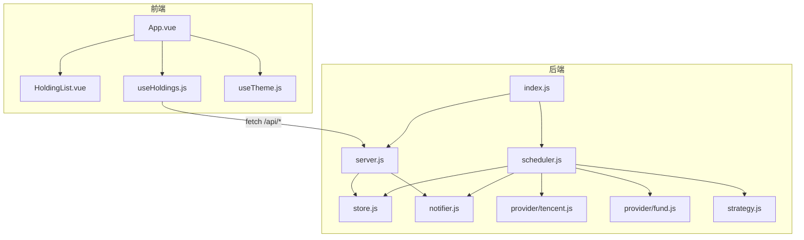
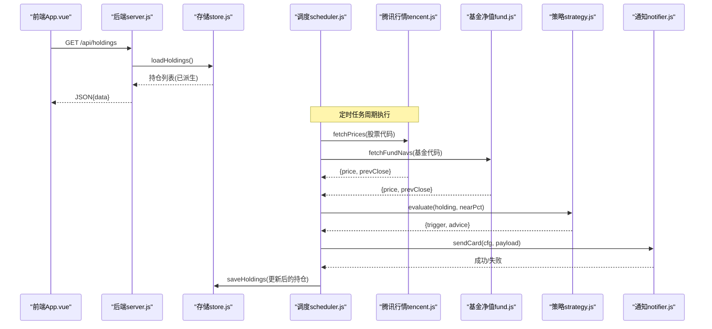
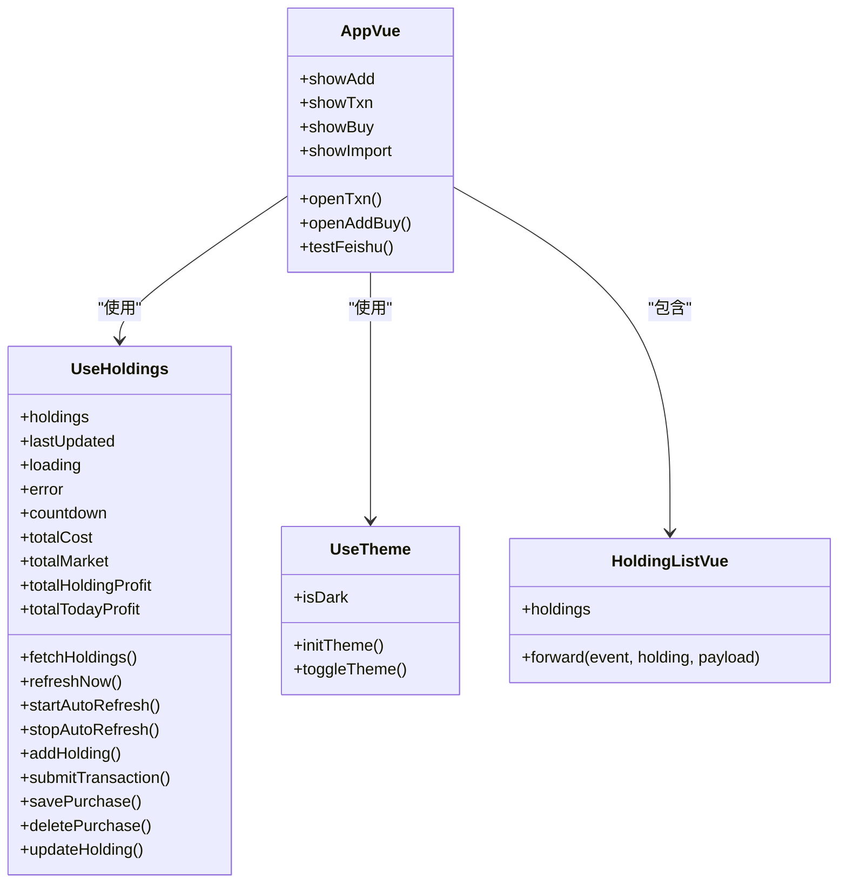
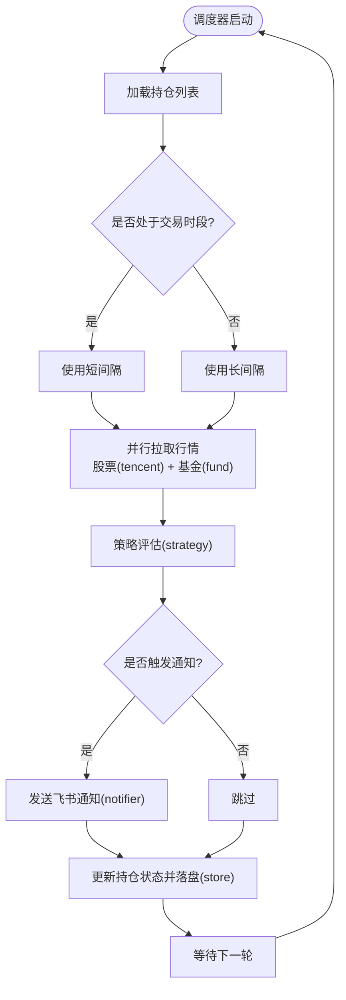
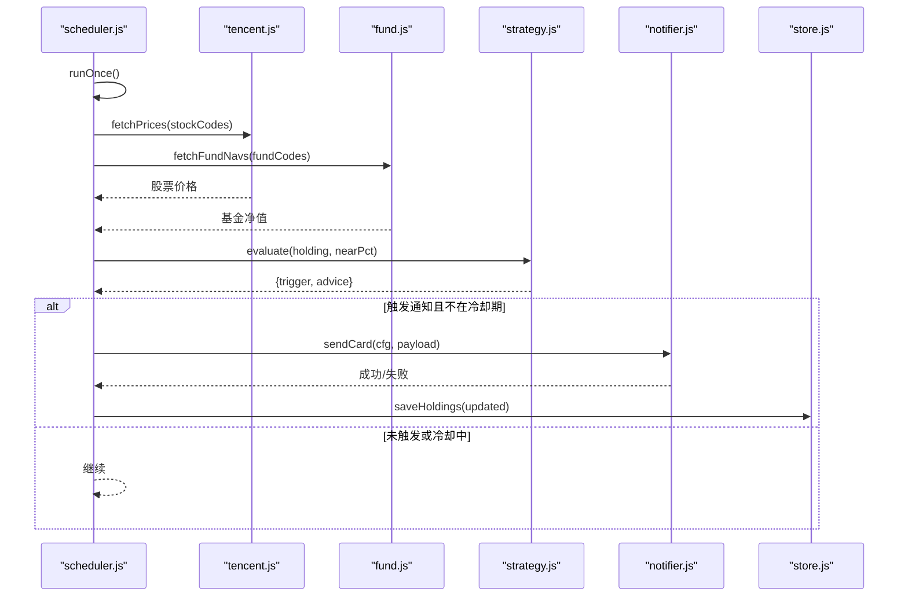
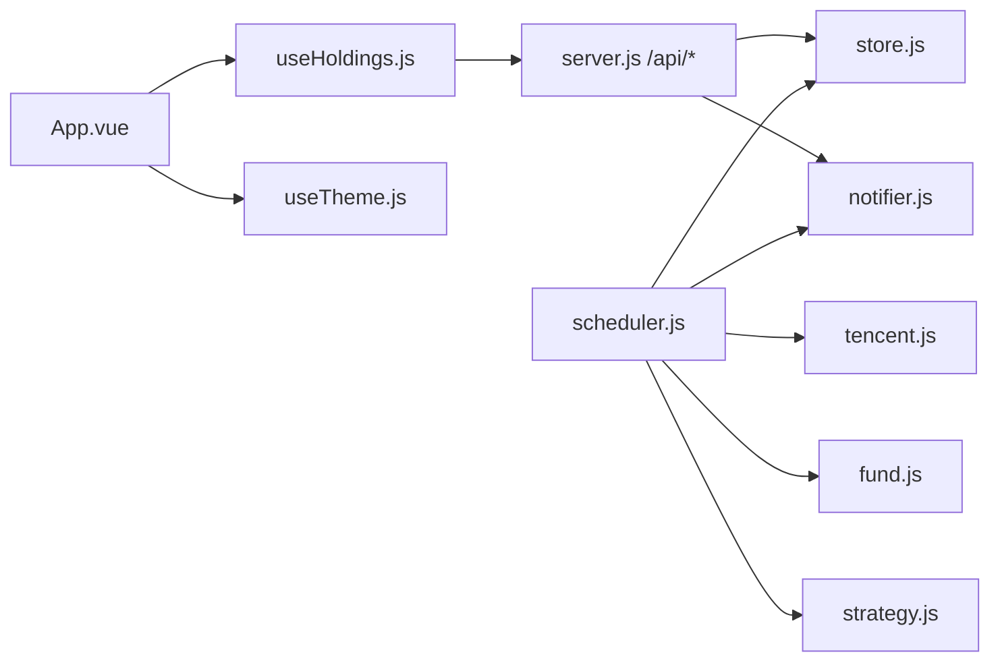

# 组件关系与通信

<cite>
**本文引用的文件**
- [server/index.js](file://server/index.js)
- [server/server.js](file://server/server.js)
- [server/scheduler.js](file://server/scheduler.js)
- [server/store.js](file://server/store.js)
- [server/notifier.js](file://server/notifier.js)
- [server/provider/tencent.js](file://server/provider/tencent.js)
- [server/provider/fund.js](file://server/provider/fund.js)
- [server/strategy.js](file://server/strategy.js)
- [config.json](file://config.json)
- [web/src/main.js](file://web/src/main.js)
- [web/src/App.vue](file://web/src/App.vue)
- [web/src/composables/useHoldings.js](file://web/src/composables/useHoldings.js)
- [web/src/composables/useTheme.js](file://web/src/composables/useTheme.js)
- [web/src/components/HoldingList.vue](file://web/src/components/HoldingList.vue)
</cite>

## 目录
1. [简介](#简介)
2. [项目结构](#项目结构)
3. [核心组件](#核心组件)
4. [架构总览](#架构总览)
5. [详细组件分析](#详细组件分析)
6. [依赖关系分析](#依赖关系分析)
7. [性能考量](#性能考量)
8. [故障排查指南](#故障排查指南)
9. [结论](#结论)
10. [附录：API契约与错误处理](#附录api契约与错误处理)

## 简介
本文件面向Stock Advisor系统，系统性梳理前后端组件关系与通信机制。重点包括：
- 前端Vue组件层次结构与组合式函数（composables）的职责划分与复用策略
- 后端服务模块协作模式：HTTP路由处理器、数据存储层、外部API适配器、通知系统的交互
- 事件驱动与调度器如何协调定时任务与异步操作
- 组件间通信协议：前后端API契约、消息格式与错误处理
- 外部系统集成点：腾讯财经API、东方财富基金净值API、飞书机器人集成与容错

## 项目结构
系统分为前后端两部分：
- 前端：基于Vue 3的单页应用，提供持仓管理、交易记录、CSV导入、自动刷新等能力
- 后端：Node.js HTTP服务，提供REST API、静态资源托管、定时调度、数据持久化、外部数据拉取与通知推送

图表来源
- [server/index.js:1-17](file://server/index.js#L1-L17)
- [server/server.js:567-594](file://server/server.js#L567-L594)
- [server/scheduler.js:65-178](file://server/scheduler.js#L65-L178)
- [web/src/App.vue:1-197](file://web/src/App.vue#L1-L197)
- [web/src/composables/useHoldings.js:1-154](file://web/src/composables/useHoldings.js#L1-L154)

章节来源
- [server/index.js:1-17](file://server/index.js#L1-L17)
- [server/server.js:35-58](file://server/server.js#L35-L58)
- [web/src/main.js:1-6](file://web/src/main.js#L1-L6)

## 核心组件
- 前端入口与根组件
  - main.js：创建并挂载Vue应用
  - App.vue：编排页面布局、弹窗状态、过滤逻辑、主题切换、自动刷新控制，调用composables获取数据
- 组合式函数
  - useHoldings.js：封装持仓数据的CRUD、自动刷新倒计时、概览汇总计算、与后端API交互
  - useTheme.js：深色/浅色主题切换与持久化
- 后端服务
  - server.js：HTTP服务器、静态资源托管、REST路由处理器、业务派生计算
  - store.js：JSON文件存储、内存缓存、串行写盘、旧模型迁移
  - scheduler.js：定时任务、市场时段判断、行情拉取、策略评估、通知冷却
  - notifier.js：飞书卡片消息构建与发送（含签名与重试）
  - provider/tencent.js：腾讯财经批量行情适配
  - provider/fund.js：东方财富基金净值适配
  - strategy.js：止盈/止损/补仓策略评估
- 配置
  - config.json：调度间隔、服务器地址、飞书Webhook与密钥、通知冷却与阈值

章节来源
- [web/src/main.js:1-6](file://web/src/main.js#L1-L6)
- [web/src/App.vue:1-197](file://web/src/App.vue#L1-L197)
- [web/src/composables/useHoldings.js:1-154](file://web/src/composables/useHoldings.js#L1-L154)
- [web/src/composables/useTheme.js:1-26](file://web/src/composables/useTheme.js#L1-L26)
- [server/server.js:567-594](file://server/server.js#L567-L594)
- [server/store.js:1-71](file://server/store.js#L1-L71)
- [server/scheduler.js:1-178](file://server/scheduler.js#L1-L178)
- [server/notifier.js:1-112](file://server/notifier.js#L1-L112)
- [server/provider/tencent.js:1-42](file://server/provider/tencent.js#L1-L42)
- [server/provider/fund.js:1-55](file://server/provider/fund.js#L1-L55)
- [server/strategy.js:1-91](file://server/strategy.js#L1-L91)
- [config.json:1-19](file://config.json#L1-L19)

## 架构总览
系统采用“前端SPA + Node后端”的单体部署方式。前端通过浏览器发起HTTP请求访问后端REST API；后端同时承担静态资源托管与业务接口。调度器以定时器循环执行行情抓取、策略评估与通知推送，并通过存储层将结果持久化到本地JSON文件。

图表来源
- [server/server.js:409-565](file://server/server.js#L409-L565)
- [server/scheduler.js:65-178](file://server/scheduler.js#L65-L178)
- [server/provider/tencent.js:6-42](file://server/provider/tencent.js#L6-L42)
- [server/provider/fund.js:6-55](file://server/provider/fund.js#L6-L55)
- [server/strategy.js:34-91](file://server/strategy.js#L34-L91)
- [server/notifier.js:81-112](file://server/notifier.js#L81-L112)
- [server/store.js:40-71](file://server/store.js#L40-L71)

## 详细组件分析

### 前端Vue组件层次与依赖
- 根组件App.vue负责整体布局、状态编排与事件分发，使用组合式函数useHoldings和useTheme
- HoldingList.vue作为列表容器，透传事件给父级，具体卡片由子组件渲染
- composables集中封装跨组件共享的状态与行为：
  - useHoldings：统一数据获取、写入、自动刷新、概览汇总
  - useTheme：主题状态与持久化

图表来源
- [web/src/App.vue:1-197](file://web/src/App.vue#L1-L197)
- [web/src/composables/useHoldings.js:1-154](file://web/src/composables/useHoldings.js#L1-L154)
- [web/src/composables/useTheme.js:1-26](file://web/src/composables/useTheme.js#L1-L26)
- [web/src/components/HoldingList.vue:1-36](file://web/src/components/HoldingList.vue#L1-L36)

章节来源
- [web/src/App.vue:1-197](file://web/src/App.vue#L1-L197)
- [web/src/composables/useHoldings.js:1-154](file://web/src/composables/useHoldings.js#L1-L154)
- [web/src/composables/useTheme.js:1-26](file://web/src/composables/useTheme.js#L1-L26)
- [web/src/components/HoldingList.vue:1-36](file://web/src/components/HoldingList.vue#L1-L36)

### 后端服务模块协作
- HTTP路由处理器（server.js）
  - 提供静态资源托管与REST API
  - 处理持仓增删改查、买入/卖出交易、CSV导入、测试飞书推送
  - 对数据进行派生计算（成本、均价、收益、今日涨跌等）
- 数据存储层（store.js）
  - 内存缓存+文件持久化，串行写盘避免并发覆盖
  - 首次加载时进行旧模型迁移
- 外部API适配器
  - tencent.js：批量拉取股票行情（A股/港股/美股），解析GBK/UTF-8文本
  - fund.js：逐个拉取场外基金净值，解析JSONP
- 通知系统（notifier.js）
  - 构建飞书interactive卡片，支持secret签名
  - 带重试机制（最多3次）
- 策略引擎（strategy.js）
  - 基于多次买入记录计算加权止盈/止损线
  - 根据当前价与最近买入价判断买点/卖点
- 调度器（scheduler.js）
  - 按市场时区判断交易时段，动态调整刷新间隔
  - 并行拉取股票与基金行情，评估策略，触发通知，落盘更新

图表来源
- [server/scheduler.js:58-178](file://server/scheduler.js#L58-L178)
- [server/provider/tencent.js:6-42](file://server/provider/tencent.js#L6-L42)
- [server/provider/fund.js:6-55](file://server/provider/fund.js#L6-L55)
- [server/strategy.js:34-91](file://server/strategy.js#L34-L91)
- [server/notifier.js:81-112](file://server/notifier.js#L81-L112)
- [server/store.js:40-71](file://server/store.js#L40-L71)

章节来源
- [server/server.js:409-565](file://server/server.js#L409-L565)
- [server/store.js:1-71](file://server/store.js#L1-L71)
- [server/provider/tencent.js:1-42](file://server/provider/tencent.js#L1-L42)
- [server/provider/fund.js:1-55](file://server/provider/fund.js#L1-L55)
- [server/strategy.js:1-91](file://server/strategy.js#L1-L91)
- [server/scheduler.js:1-178](file://server/scheduler.js#L1-L178)

### 事件驱动与调度器
- 调度器以递归setTimeout实现循环任务，依据市场开放状态选择不同间隔
- 每次tick：
  - 读取持仓，筛选“持有”状态
  - 并行拉取行情（股票与基金）
  - 计算日涨跌告警与策略触发
  - 若触发通知，检查冷却时间，避免重复推送
  - 更新持仓状态并落盘

图表来源
- [server/scheduler.js:65-178](file://server/scheduler.js#L65-L178)
- [server/provider/tencent.js:6-42](file://server/provider/tencent.js#L6-L42)
- [server/provider/fund.js:6-55](file://server/provider/fund.js#L6-L55)
- [server/strategy.js:34-91](file://server/strategy.js#L34-L91)
- [server/notifier.js:81-112](file://server/notifier.js#L81-L112)
- [server/store.js:40-71](file://server/store.js#L40-L71)

章节来源
- [server/scheduler.js:58-178](file://server/scheduler.js#L58-L178)

### 组件间通信协议（前后端API契约）
- 通用约定
  - 内容类型：application/json
  - 响应体：成功返回{data}，失败返回{error}
  - 状态码：200/201/400/404/500/502
- 主要接口
  - GET /api/holdings：获取所有持仓（含派生字段）
  - POST /api/holdings：新建持仓（可附带purchases）
  - PATCH /api/holdings/:id：更新持仓级字段（如日涨跌告警阈值）
  - POST /api/holdings/:id/purchases：追加买入记录
  - PATCH /api/holdings/:id/purchases/:pid：修改某条买入记录
  - DELETE /api/holdings/:id/purchases/:pid：删除某条买入记录
  - POST /api/holdings/:id/transactions：提交买入/卖出交易（兼容旧接口）
  - POST /api/import-csv：导入CSV买卖记录
  - POST /api/test-feishu：测试飞书推送
- 前端调用
  - useHoldings.js统一封装上述接口，并在成功后刷新列表
  - App.vue通过事件触发各操作（添加持仓、交易、导入CSV、测试飞书）

章节来源
- [server/server.js:409-565](file://server/server.js#L409-L565)
- [web/src/composables/useHoldings.js:15-130](file://web/src/composables/useHoldings.js#L15-L130)
- [web/src/App.vue:27-74](file://web/src/App.vue#L27-L74)

### 外部系统集成点与容错
- 腾讯财经API（股票行情）
  - 批量请求，解析GBK/UTF-8文本，提取当前价与昨收
  - 容错：HTTP非2xx抛错；调度器捕获并记录错误，不影响其他标的
- 东方财富基金净值API（场外基金）
  - 逐个查询，解析JSONP，取最新与上一交易日净值
  - 容错：单只基金失败不影响其他；日志记录警告
- 飞书机器人通知
  - 构建interactive卡片，支持secret签名
  - 容错：最多3次重试，指数退避；失败抛出异常供上层记录
- 配置项
  - schedule.intervalSeconds/offHoursIntervalSeconds：交易时段与非交易时段刷新间隔
  - notify.cooldownSeconds：通知冷却时间
  - notify.nearThresholdPct：接近阈值百分比

章节来源
- [server/provider/tencent.js:6-42](file://server/provider/tencent.js#L6-L42)
- [server/provider/fund.js:6-55](file://server/provider/fund.js#L6-L55)
- [server/notifier.js:81-112](file://server/notifier.js#L81-L112)
- [config.json:1-19](file://config.json#L1-L19)

## 依赖关系分析
- 前端依赖
  - App.vue依赖useHoldings与useTheme，组合式函数解耦UI与状态逻辑
  - 组件间通过props与events通信，HoldingList仅转发事件
- 后端依赖
  - index.js聚合启动server与scheduler
  - server.js依赖store、notifier、import-csv-core
  - scheduler.js依赖store、provider、strategy、notifier
  - store.js独立于业务，提供串行写盘与内存缓存
  - provider模块相互独立，分别对接外部数据源
  - strategy模块无副作用，纯函数评估

图表来源
- [web/src/App.vue:1-197](file://web/src/App.vue#L1-L197)
- [web/src/composables/useHoldings.js:1-154](file://web/src/composables/useHoldings.js#L1-L154)
- [server/index.js:1-17](file://server/index.js#L1-L17)
- [server/server.js:567-594](file://server/server.js#L567-L594)
- [server/scheduler.js:65-178](file://server/scheduler.js#L65-L178)

章节来源
- [web/src/App.vue:1-197](file://web/src/App.vue#L1-L197)
- [web/src/composables/useHoldings.js:1-154](file://web/src/composables/useHoldings.js#L1-L154)
- [server/index.js:1-17](file://server/index.js#L1-L17)
- [server/server.js:567-594](file://server/server.js#L567-L594)
- [server/scheduler.js:65-178](file://server/scheduler.js#L65-L178)

## 性能考量
- 前端
  - 使用单一定时器实现自动刷新与倒计时，避免多定时器漂移
  - 概览汇总通过computed派生，减少重复计算
- 后端
  - 存储层使用内存缓存与串行写盘，避免并发写冲突
  - 调度器并行拉取股票与基金行情，缩短整体耗时
  - 通知冷却避免频繁推送导致外部服务限流
  - 非交易时段降低刷新频率，节省资源

[本节为通用指导，不直接分析具体文件]

## 故障排查指南
- 前端获取数据失败
  - 检查网络与后端服务是否启动
  - 查看useHoldings中的错误提示与控制台日志
- 后端接口报错
  - 400：请求参数校验失败（如缺少必填字段、数值非法）
  - 404：资源不存在（持仓或买入记录ID无效）
  - 500：服务端内部错误（请查看控制台错误）
  - 502：飞书推送失败（检查webhook与secret配置）
- 调度器无更新
  - 确认config.json中schedule间隔设置合理
  - 检查外部API可用性（腾讯/东方财富）
  - 查看调度器日志输出与市场开放判断
- 通知未送达
  - 检查飞书webhook与secret是否正确
  - 查看notifier重试日志与错误信息
  - 确认冷却时间未阻止重复推送

章节来源
- [server/server.js:567-594](file://server/server.js#L567-L594)
- [server/notifier.js:81-112](file://server/notifier.js#L81-L112)
- [server/scheduler.js:65-178](file://server/scheduler.js#L65-L178)
- [web/src/composables/useHoldings.js:15-130](file://web/src/composables/useHoldings.js#L15-L130)

## 结论
Stock Advisor系统通过清晰的前后端分层与模块化设计，实现了持仓管理、行情监控、策略评估与通知推送的完整闭环。前端以组合式函数统一管理状态与交互，后端以调度器为核心协调数据拉取、策略计算与通知发送，并通过存储层保证数据一致性。外部系统集成具备容错与重试机制，确保系统在部分依赖不可用时仍能稳定运行。

[本节为总结性内容，不直接分析具体文件]

## 附录：API契约与错误处理
- 请求/响应格式
  - Content-Type: application/json
  - 成功响应：{ data: ... }
  - 失败响应：{ error: "..." }
- 关键接口说明
  - GET /api/holdings：返回持仓列表（含派生字段）
  - POST /api/holdings：新增持仓（可包含purchases）
  - PATCH /api/holdings/:id：更新持仓级字段（如日涨跌告警阈值）
  - POST /api/holdings/:id/purchases：追加买入记录
  - PATCH /api/holdings/:id/purchases/:pid：修改买入记录
  - DELETE /api/holdings/:id/purchases/:pid：删除买入记录
  - POST /api/holdings/:id/transactions：提交买入/卖出交易
  - POST /api/import-csv：导入CSV买卖记录
  - POST /api/test-feishu：测试飞书推送
- 错误处理
  - 前端在composables中统一捕获并展示错误
  - 后端对参数校验失败返回400，资源不存在返回404，未知错误返回500，外部服务失败返回502

章节来源
- [server/server.js:409-565](file://server/server.js#L409-L565)
- [web/src/composables/useHoldings.js:67-130](file://web/src/composables/useHoldings.js#L67-L130)