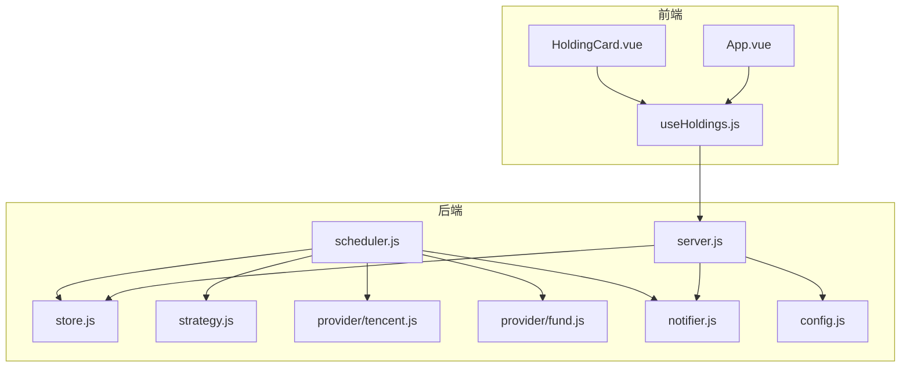
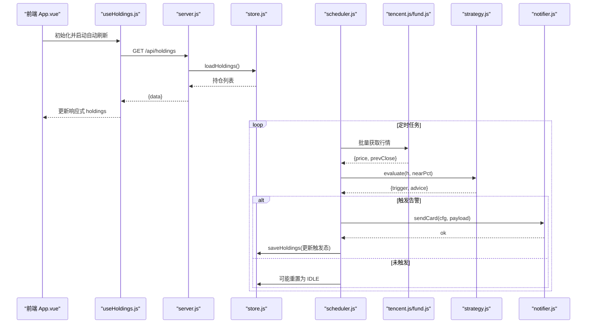
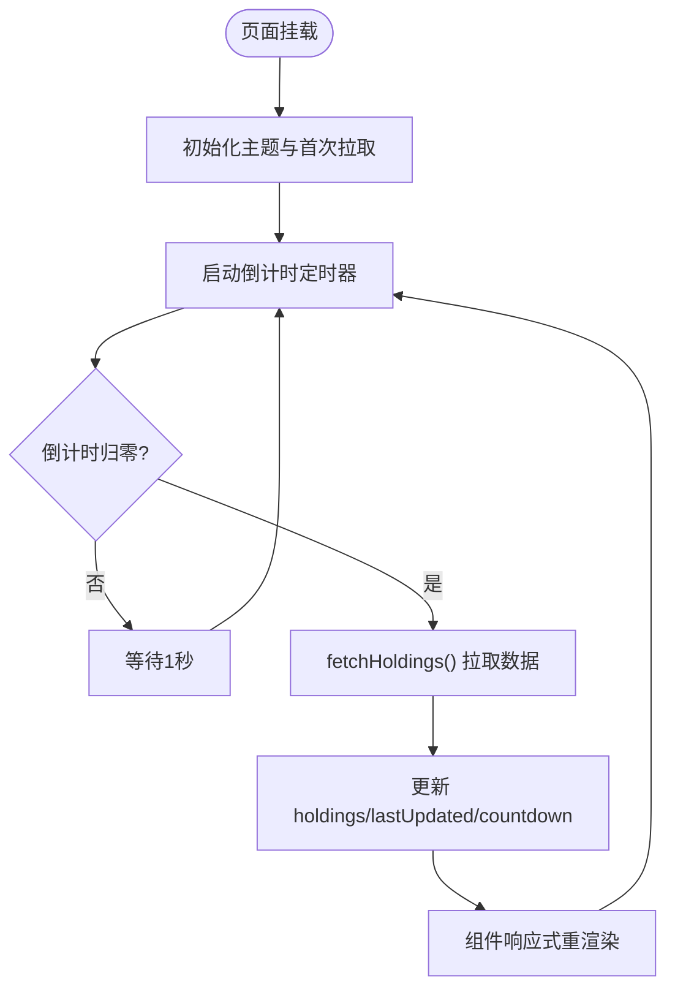
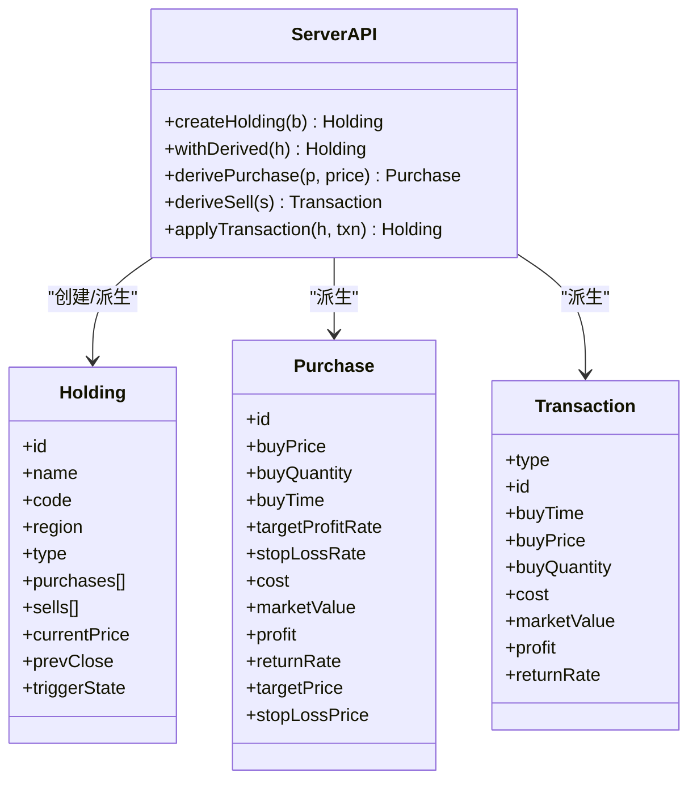
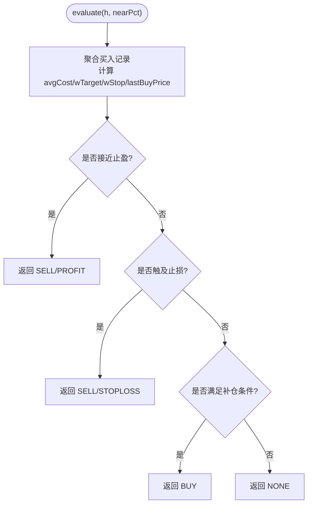
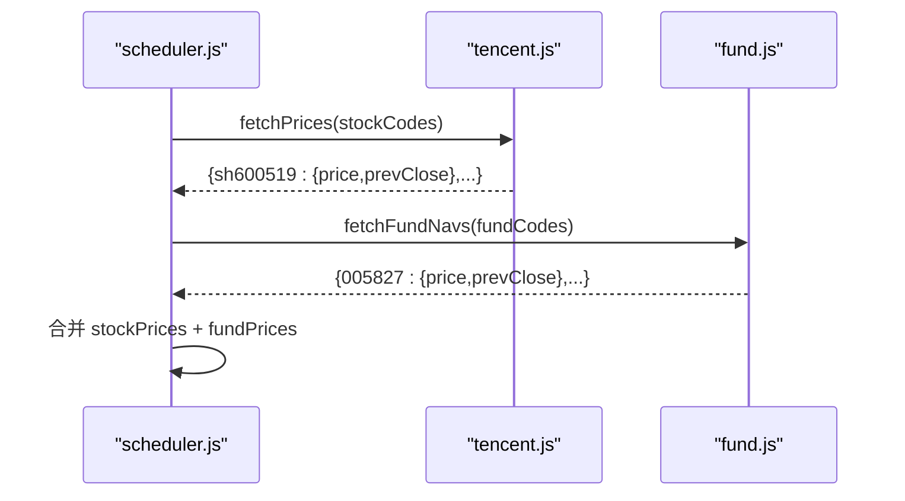
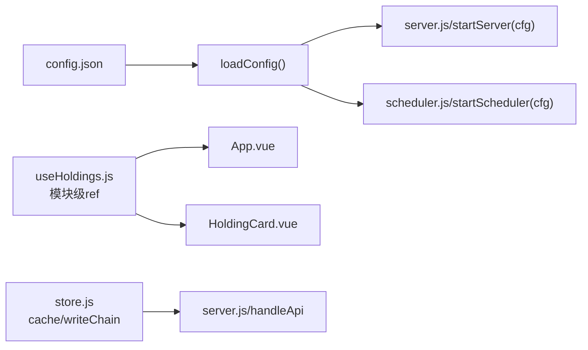
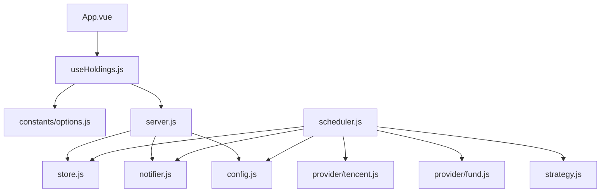

# 设计模式应用

<cite>
**本文引用的文件**
- [server.js](file://server/server.js)
- [strategy.js](file://server/strategy.js)
- [store.js](file://server/store.js)
- [scheduler.js](file://server/scheduler.js)
- [tencent.js](file://server/provider/tencent.js)
- [fund.js](file://server/provider/fund.js)
- [notifier.js](file://server/notifier.js)
- [config.js](file://server/config.js)
- [useHoldings.js](file://web/src/composables/useHoldings.js)
- [App.vue](file://web/src/App.vue)
- [HoldingCard.vue](file://web/src/components/HoldingCard.vue)
- [options.js](file://web/src/constants/options.js)
- [config.json](file://config.json)
</cite>

## 目录
1. [简介](#简介)
2. [项目结构](#项目结构)
3. [核心组件](#核心组件)
4. [架构总览](#架构总览)
5. [详细组件分析](#详细组件分析)
6. [依赖关系分析](#依赖关系分析)
7. [性能考量](#性能考量)
8. [故障排查指南](#故障排查指南)
9. [结论](#结论)

## 简介
本文件聚焦 Stock Advisor 系统中设计模式的系统化应用，围绕以下目标展开：
- 观察者模式在响应式数据绑定中的应用（Vue 3 响应式系统与事件监听）
- 工厂模式在持仓对象创建与数据派生计算中的使用
- 策略模式在告警策略引擎中的实现（止盈止损、补仓等可配置化与可扩展性）
- 适配器模式在外部 API 集成中的应用（统一不同数据源接口差异）
- 单例模式在配置管理与全局状态控制中的使用

文档通过代码级分析与可视化图示，帮助开发者理解并复用这些模式。

## 项目结构
系统分为前后端两部分：
- 后端 Node.js 服务提供 REST API、定时调度、行情获取、策略评估与飞书通知
- 前端 Vue 3 应用负责展示、交互与自动刷新

图表来源
- [App.vue:1-197](file://web/src/App.vue#L1-L197)
- [useHoldings.js:1-154](file://web/src/composables/useHoldings.js#L1-L154)
- [server.js:1-594](file://server/server.js#L1-L594)
- [store.js:1-71](file://server/store.js#L1-L71)
- [scheduler.js:1-178](file://server/scheduler.js#L1-L178)
- [strategy.js:1-91](file://server/strategy.js#L1-L91)
- [tencent.js:1-42](file://server/provider/tencent.js#L1-L42)
- [fund.js:1-55](file://server/provider/fund.js#L1-L55)
- [notifier.js:1-112](file://server/notifier.js#L1-L112)
- [config.js:1-11](file://server/config.js#L1-L11)

章节来源
- [App.vue:1-197](file://web/src/App.vue#L1-L197)
- [useHoldings.js:1-154](file://web/src/composables/useHoldings.js#L1-L154)
- [server.js:1-594](file://server/server.js#L1-L594)
- [store.js:1-71](file://server/store.js#L1-L71)
- [scheduler.js:1-178](file://server/scheduler.js#L1-L178)
- [strategy.js:1-91](file://server/strategy.js#L1-L91)
- [tencent.js:1-42](file://server/provider/tencent.js#L1-L42)
- [fund.js:1-55](file://server/provider/fund.js#L1-L55)
- [notifier.js:1-112](file://server/notifier.js#L1-L112)
- [config.js:1-11](file://server/config.js#L1-L11)

## 核心组件
- 前端响应式状态与自动刷新：useHoldings 组合式函数维护模块级响应式状态，提供拉取、写入、汇总与定时器管理
- 后端数据存储与并发写保护：store.js 提供内存缓存与串行写盘，避免并发覆盖
- 策略引擎：strategy.js 基于多次买入记录计算加权止盈/止损与补仓触发
- 数据源适配：tencent.js 与 fund.js 分别适配股票与基金净值接口，统一返回价格与昨收
- 通知推送：notifier.js 构建飞书卡片消息并发送，支持签名与重试
- 配置加载：config.js 从 config.json 读取运行时配置

章节来源
- [useHoldings.js:1-154](file://web/src/composables/useHoldings.js#L1-L154)
- [store.js:1-71](file://server/store.js#L1-L71)
- [strategy.js:1-91](file://server/strategy.js#L1-L91)
- [tencent.js:1-42](file://server/provider/tencent.js#L1-L42)
- [fund.js:1-55](file://server/provider/fund.js#L1-L55)
- [notifier.js:1-112](file://server/notifier.js#L1-L112)
- [config.js:1-11](file://server/config.js#L1-L11)

## 架构总览
系统采用“前端响应式 + 后端调度”的架构：
- 前端通过 useHoldings 订阅 /api/holdings，自动刷新并驱动视图更新
- 后端 scheduler 定时拉取行情，调用 strategy 评估触发条件，通过 notifier 推送告警
- server.js 暴露 REST API，处理持仓 CRUD、交易记录、CSV 导入等
- store.js 保证持久化一致性与并发安全

图表来源
- [App.vue:1-197](file://web/src/App.vue#L1-L197)
- [useHoldings.js:1-154](file://web/src/composables/useHoldings.js#L1-L154)
- [server.js:1-594](file://server/server.js#L1-L594)
- [store.js:1-71](file://server/store.js#L1-L71)
- [scheduler.js:1-178](file://server/scheduler.js#L1-L178)
- [tencent.js:1-42](file://server/provider/tencent.js#L1-L42)
- [fund.js:1-55](file://server/provider/fund.js#L1-L55)
- [strategy.js:1-91](file://server/strategy.js#L1-L91)
- [notifier.js:1-112](file://server/notifier.js#L1-L112)

## 详细组件分析

### 观察者模式：Vue 3 响应式与事件监听
- 模块级单例状态：useHoldings 中 holdings、loading、error、countdown 等均为 ref，被多个组件共享与消费
- 自动刷新：startAutoRefresh 使用 setInterval 驱动 countdown 递减并在归零时触发 fetchHoldings；stopAutoRefresh 清理定时器
- 视图联动：App.vue 与 HoldingCard.vue 通过 props/emits 与 useHoldings 的组合式 API 进行双向交互，数据变化自动驱动 UI 更新
- 事件流：用户操作（添加持仓、提交交易、编辑阈值）通过 useHoldings 封装的异步方法调用后端 API，成功后重新拉取列表以保持一致

图表来源
- [useHoldings.js:1-154](file://web/src/composables/useHoldings.js#L1-L154)
- [App.vue:1-197](file://web/src/App.vue#L1-L197)
- [HoldingCard.vue:1-161](file://web/src/components/HoldingCard.vue#L1-L161)

章节来源
- [useHoldings.js:1-154](file://web/src/composables/useHoldings.js#L1-L154)
- [App.vue:1-197](file://web/src/App.vue#L1-L197)
- [HoldingCard.vue:1-161](file://web/src/components/HoldingCard.vue#L1-L161)

### 工厂模式：持仓对象创建与数据派生
- 持仓工厂：createHolding 负责校验必填字段、生成唯一 id、初始化默认值，并调用 syncFromPurchases 同步成本/数量/均价等
- 派生工厂：withDerived 将原始持仓数据扩展为展示所需字段（purchases、transactions、avgCost、holdingProfit、todayProfit 等），并对买卖记录进行排序与合并
- 单次买入派生：derivePurchase 根据当前价计算市值、收益、收益率及止盈/止损目标价
- 卖出记录派生：deriveSell 将卖出记录标准化为统一结构，便于与买入记录合并展示

图表来源
- [server.js:90-344](file://server/server.js#L90-L344)
- [server.js:147-245](file://server/server.js#L147-L245)

章节来源
- [server.js:90-344](file://server/server.js#L90-L344)
- [server.js:147-245](file://server/server.js#L147-L245)

### 策略模式：告警策略引擎
- 策略入口：evaluate(h, nearPct) 聚合买入记录，计算加权止盈/止损阈值与最近买入价，按优先级判断买点/卖点
- 卖点规则：
  - 达到预期止盈（按成本加权）且接近阈值
  - 任一买入记录的止损线被触及
- 买点规则：
  - 较最近买入价跌幅达到补仓降幅或触及补仓价
- 可配置化：nearPct 来自配置 notify.nearThresholdPct，用于“接近阈值”的判断容差
- 可扩展性：新增策略只需在 evaluate 中增加分支逻辑，或通过注入新策略函数替换评估流程

图表来源
- [strategy.js:1-91](file://server/strategy.js#L1-L91)
- [scheduler.js:126-157](file://server/scheduler.js#L126-L157)

章节来源
- [strategy.js:1-91](file://server/strategy.js#L1-L91)
- [scheduler.js:1-178](file://server/scheduler.js#L1-L178)

### 适配器模式：外部 API 集成
- 股票行情适配器：tencent.js 解析腾讯财经文本接口，统一返回 {price, prevClose}
- 基金净值适配器：fund.js 解析东方财富 JSONP 接口，逐个查询并返回相同结构
- 调度器统一消费：scheduler.js 根据持仓类型分流到对应适配器，并将结果合并为 prices 字典供后续处理

图表来源
- [scheduler.js:72-87](file://server/scheduler.js#L72-L87)
- [tencent.js:1-42](file://server/provider/tencent.js#L1-L42)
- [fund.js:1-55](file://server/provider/fund.js#L1-L55)

章节来源
- [scheduler.js:1-178](file://server/scheduler.js#L1-L178)
- [tencent.js:1-42](file://server/provider/tencent.js#L1-L42)
- [fund.js:1-55](file://server/provider/fund.js#L1-L55)

### 单例模式：配置管理与全局状态
- 配置单例：config.js 提供 loadConfig 异步加载 config.json，服务端多处复用同一份配置
- 前端全局状态：useHoldings 在模块作用域内定义 holdings、loading、error、countdown 等 ref，作为模块级单例被所有组件共享
- 存储层缓存：store.js 使用模块级变量 cache 与 cacheMtime 作为内存缓存，配合串行写链 writeChain 保证并发安全

图表来源
- [config.js:1-11](file://server/config.js#L1-L11)
- [config.json:1-19](file://config.json#L1-L19)
- [useHoldings.js:1-154](file://web/src/composables/useHoldings.js#L1-L154)
- [store.js:1-71](file://server/store.js#L1-L71)
- [server.js:567-594](file://server/server.js#L567-L594)
- [scheduler.js:167-178](file://server/scheduler.js#L167-L178)

章节来源
- [config.js:1-11](file://server/config.js#L1-L11)
- [config.json:1-19](file://config.json#L1-L19)
- [useHoldings.js:1-154](file://web/src/composables/useHoldings.js#L1-L154)
- [store.js:1-71](file://server/store.js#L1-L71)
- [server.js:567-594](file://server/server.js#L567-L594)
- [scheduler.js:167-178](file://server/scheduler.js#L167-L178)

## 依赖关系分析
- 前端依赖：App.vue 依赖 useHoldings 与若干组件；useHoldings 依赖常量 options.js 中的 REFRESH_MS
- 后端依赖：server.js 依赖 store.js、notifier.js、import-csv-core.js；scheduler.js 依赖 store.js、provider/*、strategy.js、notifier.js
- 配置依赖：scheduler.js 与 server.js 均依赖 config.js 提供的配置项（schedule、notify、feishu、server）

图表来源
- [App.vue:1-197](file://web/src/App.vue#L1-L197)
- [useHoldings.js:1-154](file://web/src/composables/useHoldings.js#L1-L154)
- [options.js:1-33](file://web/src/constants/options.js#L1-L33)
- [server.js:1-594](file://server/server.js#L1-L594)
- [store.js:1-71](file://server/store.js#L1-L71)
- [notifier.js:1-112](file://server/notifier.js#L1-L112)
- [scheduler.js:1-178](file://server/scheduler.js#L1-L178)
- [tencent.js:1-42](file://server/provider/tencent.js#L1-L42)
- [fund.js:1-55](file://server/provider/fund.js#L1-L55)
- [strategy.js:1-91](file://server/strategy.js#L1-L91)
- [config.js:1-11](file://server/config.js#L1-L11)

章节来源
- [App.vue:1-197](file://web/src/App.vue#L1-L197)
- [useHoldings.js:1-154](file://web/src/composables/useHoldings.js#L1-L154)
- [options.js:1-33](file://web/src/constants/options.js#L1-L33)
- [server.js:1-594](file://server/server.js#L1-L594)
- [store.js:1-71](file://server/store.js#L1-L71)
- [notifier.js:1-112](file://server/notifier.js#L1-L112)
- [scheduler.js:1-178](file://server/scheduler.js#L1-L178)
- [tencent.js:1-42](file://server/provider/tencent.js#L1-L42)
- [fund.js:1-55](file://server/provider/fund.js#L1-L55)
- [strategy.js:1-91](file://server/strategy.js#L1-L91)
- [config.js:1-11](file://server/config.js#L1-L11)

## 性能考量
- 前端自动刷新：使用单一定时器与 countdown 避免多定时器漂移；REFRESH_MS 控制刷新频率，降低网络压力
- 后端并发写保护：writeChain 串行化保存操作，防止调度器与 HTTP 接口同时写盘导致数据覆盖
- 行情获取并行：Promise.all 并行请求股票与基金数据，减少整体延迟
- 冷却机制：notify.cooldownSeconds 避免频繁推送相同触发态的消息
- 市场时段降频：非交易时段使用 offHoursIntervalSeconds 降低调度频率

[本节为通用指导，不直接分析具体文件]

## 故障排查指南
- 前端获取失败：useHoldings 捕获错误并设置 error 提示；检查网络与后端 /api/holdings 可用性
- 自动刷新异常：确认 startAutoRefresh 已调用，stopAutoRefresh 正确清理；检查 REFRESH_MS 配置
- 行情缺失：scheduler 会跳过无行情的品种；检查 tencent/fund 适配器返回结构与网络可达性
- 策略未触发：检查 nearPct、dailyDropAlertPct/dailyRiseAlertPct 配置；确认持仓 currentPrice/prevClose 已更新
- 通知失败：notifier 内置重试与错误日志；检查 feishu webhook 与 secret 配置

章节来源
- [useHoldings.js:16-29](file://web/src/composables/useHoldings.js#L16-L29)
- [scheduler.js:77-86](file://server/scheduler.js#L77-L86)
- [scheduler.js:101-124](file://server/scheduler.js#L101-L124)
- [notifier.js:80-112](file://server/notifier.js#L80-L112)

## 结论
Stock Advisor 通过多种设计模式实现了高内聚、低耦合的系统：
- 观察者模式确保前端响应式与事件驱动的流畅体验
- 工厂模式集中封装复杂对象构建与数据派生，提升可维护性
- 策略模式使告警规则可配置、可扩展，便于业务演进
- 适配器模式屏蔽外部数据源差异，统一消费接口
- 单例模式保障配置与全局状态的一致性与线程安全

这些模式共同支撑了系统的稳定性、可扩展性与可观测性，为后续功能迭代提供了坚实基础。