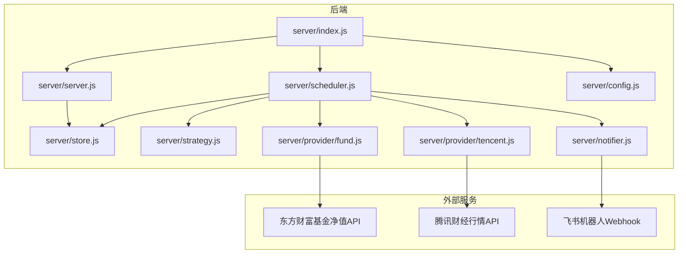
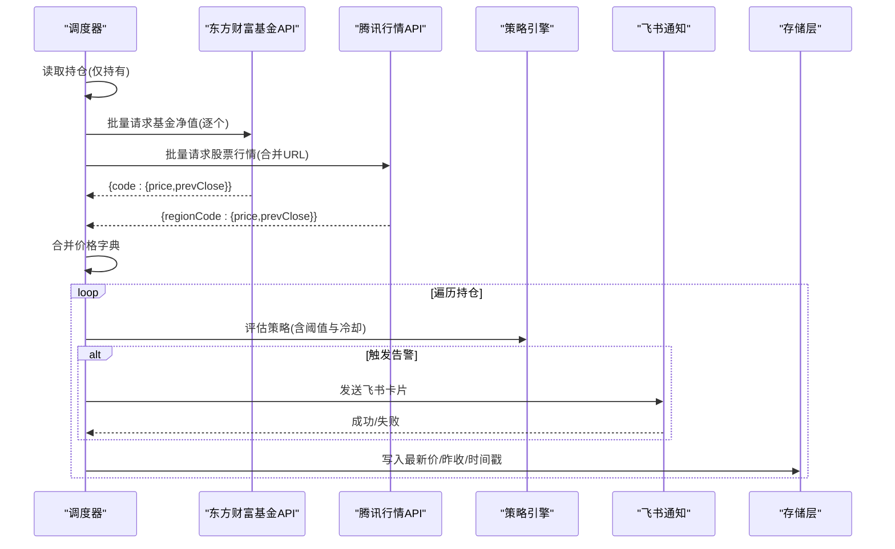
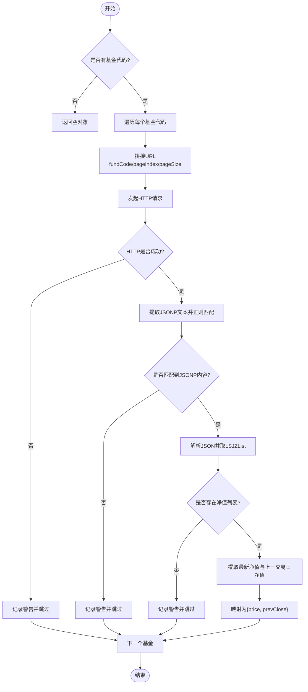
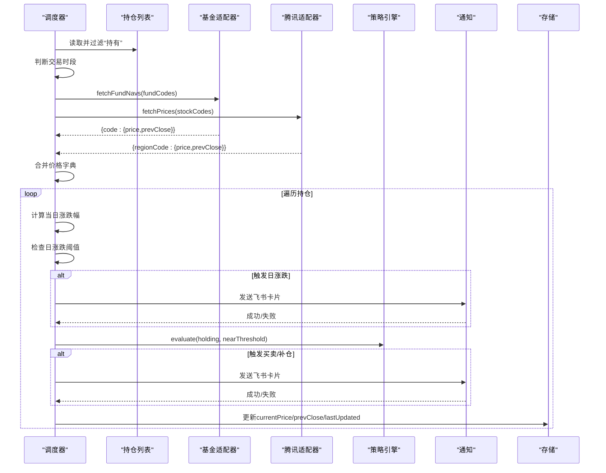
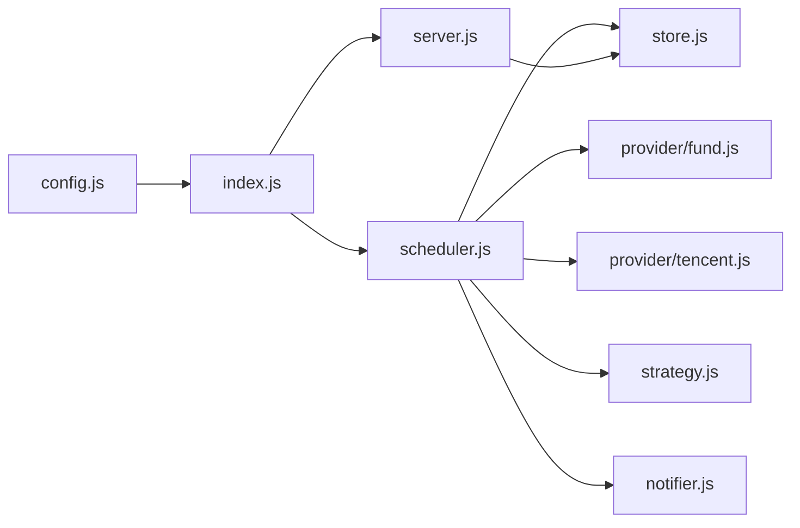

# 东方财富基金API集成

<cite>
**本文引用的文件**
- [fund.js](file://server/provider/fund.js)
- [scheduler.js](file://server/scheduler.js)
- [tencent.js](file://server/provider/tencent.js)
- [store.js](file://server/store.js)
- [config.js](file://server/config.js)
- [index.js](file://server/index.js)
- [server.js](file://server/server.js)
- [strategy.js](file://server/strategy.js)
- [notifier.js](file://server/notifier.js)
- [options.js](file://web/src/constants/options.js)
- [config.json](file://config.json)
- [package.json](file://package.json)
</cite>

## 目录
1. [简介](#简介)
2. [项目结构](#项目结构)
3. [核心组件](#核心组件)
4. [架构总览](#架构总览)
5. [详细组件分析](#详细组件分析)
6. [依赖关系分析](#依赖关系分析)
7. [性能与并发优化](#性能与并发优化)
8. [错误处理与重试机制](#错误处理与重试机制)
9. [数据同步最佳实践](#数据同步最佳实践)
10. [故障排除指南](#故障排除指南)
11. [结论](#结论)

## 简介
本技术文档聚焦于“东方财富基金净值API集成”的实现与使用，覆盖接口调用、参数配置、响应解析、基金代码映射规则、净值数据处理（日期匹配、缺失值、更新策略）、批量获取优化（请求合并、并发控制、性能调优）、错误重试与降级策略，以及基金数据同步的最佳实践与排障方法。目标是帮助开发者快速理解并稳定运行该功能，同时为后续扩展提供清晰指引。

## 项目结构
本项目采用前后端分离的Node.js服务：后端负责调度行情抓取、策略评估与通知推送；前端通过HTTP API展示持仓与交易记录。基金净值数据由东方财富场外基金净值接口提供，股票行情由腾讯财经接口提供，两者在调度层并行拉取并统一归一化。

图表来源
- [index.js:1-17](file://server/index.js#L1-L17)
- [scheduler.js:1-178](file://server/scheduler.js#L1-L178)
- [fund.js:1-55](file://server/provider/fund.js#L1-L55)
- [tencent.js:1-42](file://server/provider/tencent.js#L1-L42)
- [store.js:1-71](file://server/store.js#L1-L71)
- [config.js:1-11](file://server/config.js#L1-L11)
- [notifier.js:1-112](file://server/notifier.js#L1-L112)

章节来源
- [index.js:1-17](file://server/index.js#L1-L17)
- [config.json:1-19](file://config.json#L1-L19)
- [package.json:1-32](file://package.json#L1-L32)

## 核心组件
- 东方财富基金净值适配器：封装东方财富JSONP接口，返回最新净值与前日净值。
- 调度器：按市场交易时段选择刷新频率，分流基金与股票数据源，合并结果后计算涨跌与触发告警。
- 存储层：内存缓存+磁盘持久化，串行写盘避免并发冲突。
- 策略引擎：基于多次买入记录计算加权成本、止盈止损与补仓信号。
- 通知模块：构造飞书卡片消息，支持签名与重试。
- 配置加载：从根目录配置文件读取调度与服务端口等设置。

章节来源
- [fund.js:1-55](file://server/provider/fund.js#L1-L55)
- [scheduler.js:1-178](file://server/scheduler.js#L1-L178)
- [store.js:1-71](file://server/store.js#L1-L71)
- [strategy.js:1-91](file://server/strategy.js#L1-L91)
- [notifier.js:1-112](file://server/notifier.js#L1-L112)
- [config.js:1-11](file://server/config.js#L1-L11)

## 架构总览
调度器在每个周期内：
- 读取持仓列表，筛选“持有”状态品种。
- 根据类型分流：包含“基金”字样的走东方财富净值接口；其他走腾讯行情接口。
- 并行请求两个数据源，合并价格字典。
- 对每个品种计算当日涨跌幅，应用日涨跌告警与策略评估，必要时发送飞书通知。
- 更新持仓的最新价、昨收价与更新时间，落盘保存。

图表来源
- [scheduler.js:65-165](file://server/scheduler.js#L65-L165)
- [fund.js:6-54](file://server/provider/fund.js#L6-L54)
- [tencent.js:6-41](file://server/provider/tencent.js#L6-L41)
- [strategy.js:34-90](file://server/strategy.js#L34-L90)
- [notifier.js:81-111](file://server/notifier.js#L81-L111)
- [store.js:40-70](file://server/store.js#L40-L70)

## 详细组件分析

### 东方财富基金净值适配器
- 接口地址与参数
  - 基础地址：东方财富场外基金净值接口。
  - 关键参数：fundCode（基金代码）、pageIndex=1、pageSize=2（取最新两笔净值）。
  - 请求头：User-Agent、Referer，用于兼容反爬策略。
- 响应解析
  - 返回JSONP格式，需去除jQuery(...)包裹后解析JSON。
  - 数据结构中Data.LSJZList为净值数组，list[0]为最新净值，list[1]为上一交易日净值。
  - 字段DWJZ表示单位净值，转换为数值型作为price；若存在上一交易日则prevClose为其DWJZ，否则为null。
- 错误处理
  - HTTP非2xx时记录警告并跳过该基金。
  - JSONP解析失败或无净值数据时记录警告并跳过。
  - 捕获异常并输出错误信息，保证单个基金失败不影响其他基金。

图表来源
- [fund.js:6-54](file://server/provider/fund.js#L6-L54)

章节来源
- [fund.js:1-55](file://server/provider/fund.js#L1-L55)

### 调度器与数据源分流
- 交易时段判断
  - 根据持仓的市场区域（沪/深/港/美）与时区，判断当前是否处于交易时段。
  - 交易时段使用较短刷新间隔，非交易时段降频以减少资源消耗。
- 数据源分流
  - 若持仓type包含“基金”，则走东方财富净值接口；否则走腾讯行情接口。
  - 股票行情支持批量合并URL请求，基金净值由于接口限制需逐个请求。
- 价格合并与更新
  - 将两个数据源的结果合并为一个价格字典，键为基金代码或“region+code”。
  - 对每个品种更新currentPrice、prevClose与lastUpdated。
- 日涨跌告警
  - 基于当日涨跌幅与配置的阈值，触发DAILY_RISE或DAILY_DROP告警。
  - 同一日内重复告警通过dailyAlertSentDate去重。

图表来源
- [scheduler.js:65-165](file://server/scheduler.js#L65-L165)
- [fund.js:6-54](file://server/provider/fund.js#L6-L54)
- [tencent.js:6-41](file://server/provider/tencent.js#L6-L41)
- [strategy.js:34-90](file://server/strategy.js#L34-L90)
- [notifier.js:81-111](file://server/notifier.js#L81-L111)
- [store.js:40-70](file://server/store.js#L40-L70)

章节来源
- [scheduler.js:1-178](file://server/scheduler.js#L1-L178)

### 存储层与并发写保护
- 内存缓存
  - 首次加载或检测到文件mtime变化时重新读盘，否则复用内存缓存，减少IO。
- 迁移逻辑
  - 旧版扁平持仓结构自动迁移为“多次买入记录”模型，确保一致性。
- 串行写盘
  - 所有写操作通过Promise链串行执行，避免并发写导致的数据覆盖。
  - 写盘后更新mtime，防止误判外部修改。

章节来源
- [store.js:1-71](file://server/store.js#L1-L71)

### 策略引擎与通知
- 策略评估
  - 基于多次买入记录计算加权平均成本、最近买入价与加权止盈/止损比例。
  - 当收益率接近或达到止盈线、单笔触及止损线、或较最近买入价跌幅达到补仓条件时，生成BUY/SELL信号与建议文案。
- 通知模块
  - 构造飞书interactive卡片，支持secret签名。
  - 内置重试机制：最多尝试3次，指数退避（1秒、2秒），失败抛出异常供上层处理。

章节来源
- [strategy.js:1-91](file://server/strategy.js#L1-L91)
- [notifier.js:1-112](file://server/notifier.js#L1-L112)

### 配置与启动
- 配置加载
  - 从根目录config.json读取调度间隔、服务器端口、飞书webhook与secret、通知冷却时间等。
- 启动流程
  - server/index.js加载配置，启动HTTP服务与调度器；支持ONCE模式单次运行后退出。

章节来源
- [config.js:1-11](file://server/config.js#L1-L11)
- [config.json:1-19](file://config.json#L1-L19)
- [index.js:1-17](file://server/index.js#L1-L17)

## 依赖关系分析
- 调度器依赖
  - 存储层：loadHoldings/saveHoldings。
  - 数据源：fund.js与tencent.js。
  - 策略：strategy.js。
  - 通知：notifier.js。
- 前端常量
  - 地区与类型枚举与后端保持一致，便于UI展示与校验。

图表来源
- [scheduler.js:1-178](file://server/scheduler.js#L1-L178)
- [server.js:1-594](file://server/server.js#L1-L594)
- [index.js:1-17](file://server/index.js#L1-L17)
- [config.js:1-11](file://server/config.js#L1-L11)

章节来源
- [scheduler.js:1-178](file://server/scheduler.js#L1-L178)
- [server.js:1-594](file://server/server.js#L1-L594)
- [index.js:1-17](file://server/index.js#L1-L17)
- [config.js:1-11](file://server/config.js#L1-L11)

## 性能与并发优化
- 请求合并
  - 股票行情通过腾讯接口批量合并URL，一次请求多个标的，显著降低网络开销。
  - 基金净值接口不支持批量，当前实现为逐个请求；可通过引入并发池（如p-limit）提升吞吐，但需注意东方财富接口的限流与稳定性。
- 并发控制
  - 调度器对股票与基金数据源并行请求（Promise.all），缩短整体延迟。
  - 存储层串行写盘，避免并发写导致的覆盖问题。
- 性能调优建议
  - 增加基金请求并发度，结合超时与重试策略，提高成功率。
  - 在非交易时段保持较长间隔，减少无效请求。
  - 对频繁失败的基金进行隔离与降级，避免拖慢整体调度。

章节来源
- [scheduler.js:65-165](file://server/scheduler.js#L65-L165)
- [tencent.js:6-41](file://server/provider/tencent.js#L6-L41)
- [store.js:61-70](file://server/store.js#L61-L70)

## 错误处理与重试机制
- 东方财富基金接口
  - HTTP非2xx：记录警告并跳过该基金。
  - JSONP解析失败或无净值数据：记录警告并跳过。
  - 异常捕获：输出错误信息，不影响其他基金处理。
- 腾讯行情接口
  - HTTP非2xx：抛出错误，调度器捕获并记录日志，继续执行。
- 飞书通知
  - 内置重试：最多3次，间隔递增，失败抛出异常。
  - 支持secret签名，增强安全性。
- 降级策略
  - 任一数据源失败不影响其他数据源与整体调度。
  - 对于无行情的品种，跳过更新并记录警告。

章节来源
- [fund.js:10-50](file://server/provider/fund.js#L10-L50)
- [tencent.js:6-41](file://server/provider/tencent.js#L6-L41)
- [scheduler.js:77-86](file://server/scheduler.js#L77-L86)
- [notifier.js:96-111](file://server/notifier.js#L96-L111)

## 数据同步最佳实践
- 基金代码映射规则
  - 基金：直接使用基金代码（如005827）作为键，对应东方财富净值接口。
  - 股票：使用“region+code”作为键（如sh600519、hk00700、usAAPL），对应腾讯行情接口。
  - 前端地区与类型枚举与后端保持一致，确保UI与后端逻辑一致。
- 净值日期匹配
  - 东方财富返回最新净值与上一交易日净值，调度器据此计算当日涨跌幅。
  - 若无上一交易日净值，prevClose为null，当日涨跌幅计算时做防御性处理。
- 缺失值处理
  - 无净值数据或解析失败时，记录警告并跳过该品种，避免影响整体流程。
  - 存储层仅在成功获取有效价格时更新currentPrice/prevClose/lastUpdated。
- 更新策略
  - 交易时段短间隔刷新，非交易时段长间隔刷新。
  - 日涨跌告警每日只触发一次，通过dailyAlertSentDate去重。
  - 策略评估具备冷却窗口，避免频繁通知。

章节来源
- [scheduler.js:72-124](file://server/scheduler.js#L72-L124)
- [fund.js:33-47](file://server/provider/fund.js#L33-L47)
- [tencent.js:25-40](file://server/provider/tencent.js#L25-L40)
- [options.js:11-26](file://web/src/constants/options.js#L11-L26)

## 故障排除指南
- 常见问题
  - 基金显示“无行情”：确认基金代码正确且东方财富接口可访问；检查JSONP解析是否成功。
  - 股票行情乱码：腾讯接口返回GBK编码，已内置解码逻辑；若仍异常，检查网络代理与编码设置。
  - 飞书通知失败：检查webhook与secret配置；查看重试日志与错误响应。
- 排查步骤
  - 查看调度日志中的[fund-fetch]、[stock-fetch]、[notify-daily]、[notify]等关键字。
  - 检查config.json中的schedule.intervalSeconds与offHoursIntervalSeconds是否合理。
  - 验证存储层读写是否正常，关注[store] save error日志。
- 恢复措施
  - 临时禁用问题数据源，保证其他品种正常更新。
  - 调整重试次数与间隔，平衡成功率与资源占用。
  - 清理或修复损坏的holdings.json，重启服务重建缓存。

章节来源
- [scheduler.js:77-86](file://server/scheduler.js#L77-L86)
- [notifier.js:96-111](file://server/notifier.js#L96-L111)
- [store.js:61-70](file://server/store.js#L61-L70)

## 结论
本项目通过东方财富基金净值API与腾讯行情API的组合，实现了基金与股票的统一价格获取与策略评估。调度器按交易时段动态调整刷新频率，存储层保障数据一致性，通知模块提供可靠的消息推送。针对基金净值接口的限制，当前采用逐个请求方式，未来可引入并发池与更完善的限流与重试策略以提升性能与稳定性。遵循本文档的映射规则、数据处理与排障指南，可有效保障系统稳定运行与持续优化。