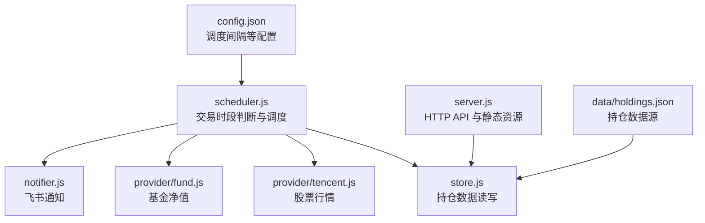
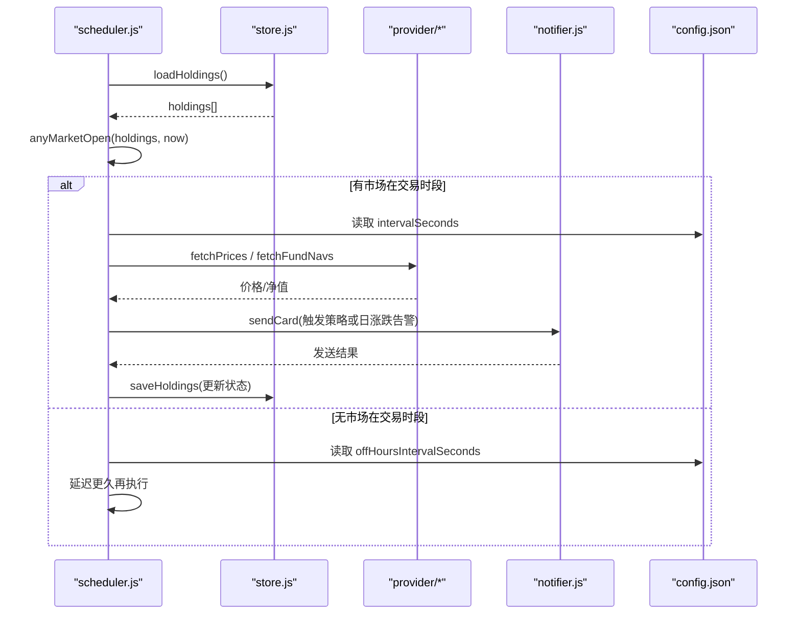
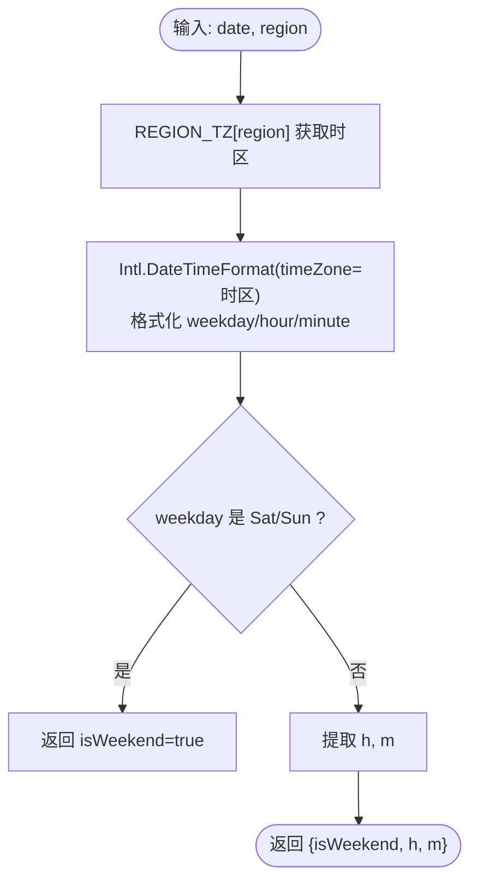
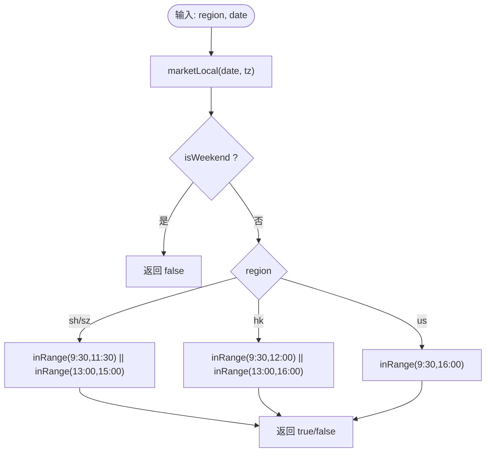
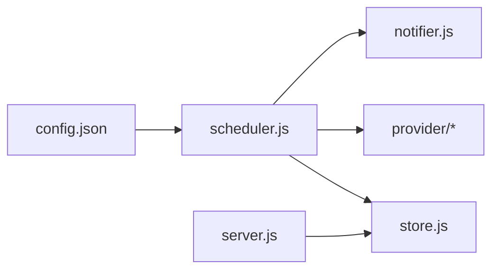

# 交易时段判断

<cite>
**本文引用的文件**
- [server/scheduler.js](file://server/scheduler.js)
- [config.json](file://config.json)
- [server/store.js](file://server/store.js)
- [data/holdings.json](file://data/holdings.json)
- [server/server.js](file://server/server.js)
- [.codebuddy/memory/2026-07-28.md](file://.codebuddy/memory/2026-07-28.md)
</cite>

## 目录
1. [简介](#简介)
2. [项目结构](#项目结构)
3. [核心组件](#核心组件)
4. [架构总览](#架构总览)
5. [详细组件分析](#详细组件分析)
6. [依赖关系分析](#依赖关系分析)
7. [性能考量](#性能考量)
8. [故障排查指南](#故障排查指南)
9. [结论](#结论)
10. [附录：扩展与测试建议](#附录扩展与测试建议)

## 简介
本技术文档聚焦于“交易时段判断”逻辑，覆盖多市场（A股、港股、美股）的开盘收盘规则、节假日与特殊交易日处理现状、时区转换与夏令时处理、交易状态识别（盘前/盘中/盘后/休市）、时间精度控制、以及可扩展的市场配置方法。文档同时提供时间计算示例与测试用例建议，帮助读者在现有代码基础上进行安全增强与功能扩展。

## 项目结构
本项目采用前后端分离结构：后端 Node.js 服务负责数据持久化、定时调度、行情获取与通知；前端为静态页面托管。交易时段判断的核心在后端调度器中实现，结合配置文件决定刷新频率，并基于持仓数据中的 region 字段映射到对应时区与市场规则。

图表来源
- [server/scheduler.js:1-178](file://server/scheduler.js#L1-L178)
- [server/store.js:1-71](file://server/store.js#L1-L71)
- [config.json:1-19](file://config.json#L1-L19)
- [server/server.js:567-594](file://server/server.js#L567-L594)

章节来源
- [server/scheduler.js:1-178](file://server/scheduler.js#L1-L178)
- [config.json:1-19](file://config.json#L1-L19)
- [server/store.js:1-71](file://server/store.js#L1-L71)
- [server/server.js:567-594](file://server/server.js#L567-L594)

## 核心组件
- 交易时段判断模块：位于 scheduler.js，包含时区本地化、区间判断、市场开闭判定、任意市场是否开市的聚合逻辑。
- 调度循环：根据当前是否处于交易时段动态选择刷新间隔，实现交易时段高频、非交易时段降频。
- 持仓数据模型：region 使用 hk/sh/sz/us 标识市场，用于时区映射与行情键名拼接。
- 配置系统：通过 config.json 定义 schedule.intervalSeconds 与 offHoursIntervalSeconds，控制刷新频率。

章节来源
- [server/scheduler.js:7-56](file://server/scheduler.js#L7-L56)
- [server/scheduler.js:58-70](file://server/scheduler.js#L58-L70)
- [data/holdings.json:1-462](file://data/holdings.json#L1-L462)
- [config.json:1-19](file://config.json#L1-L19)

## 架构总览
交易时段判断在调度循环中被调用，影响整体刷新策略与后续行情拉取、策略评估与通知流程。其输入包括当前时间与持仓列表，输出为布尔值表示是否存在任一持仓市场处于交易时段。

图表来源
- [server/scheduler.js:65-178](file://server/scheduler.js#L65-L178)
- [server/store.js:40-71](file://server/store.js#L40-L71)
- [config.json:1-19](file://config.json#L1-L19)

## 详细组件分析

### 时区与本地时间解析
- 使用 Intl.DateTimeFormat 指定目标时区，提取小时与分钟，并判断是否为周末。
- 时区映射 REGION_TZ 将 market region（hk/sh/sz/us）映射到 IANA 时区字符串，自动处理夏令时。

图表来源
- [server/scheduler.js:7-30](file://server/scheduler.js#L7-L30)

章节来源
- [server/scheduler.js:7-30](file://server/scheduler.js#L7-L30)

### 交易时段判定算法
- 对每个市场定义两段或多段交易时间区间，使用 inRange 将时分转换为分钟数进行比较，避免跨天复杂边界。
- A股（sh/sz）：上午 9:30–11:30，下午 13:00–15:00
- 港股（hk）：上午 9:30–12:00，下午 13:00–16:00
- 美股（us）：统一区间 9:30–16:00（纽约时间）

图表来源
- [server/scheduler.js:32-47](file://server/scheduler.js#L32-L47)

章节来源
- [server/scheduler.js:32-47](file://server/scheduler.js#L32-L47)

### 任意市场开市判定
- 仅考虑 status 为“持有”的持仓，遍历其 region，只要有一个市场处于交易时段即返回 true。
- 该结果用于切换调度频率：交易时段使用较短间隔，非交易时段使用较长间隔。

章节来源
- [server/scheduler.js:49-56](file://server/scheduler.js#L49-L56)
- [server/scheduler.js:58-70](file://server/scheduler.js#L58-L70)

### 调度与刷新频率
- pickInterval 根据 open 标志选择 intervalSeconds 或 offHoursIntervalSeconds。
- runOnce 每次执行会加载持仓、判断是否交易时段、拉取行情、评估策略、发送通知，并根据结果保存状态。

章节来源
- [server/scheduler.js:58-70](file://server/scheduler.js#L58-L70)
- [server/scheduler.js:65-178](file://server/scheduler.js#L65-L178)
- [config.json:1-19](file://config.json#L1-L19)

### 节假日与特殊交易日处理
- 当前实现未内置法定节假日与交易所公告的特殊交易日处理，仅在注释中标注“简化：未含法定节假日”。
- 扩展建议：引入外部日历或可配置表，在 isMarketOpen 前增加 holidayCheck(region, date)，若为休市则直接返回 false。

章节来源
- [server/scheduler.js:37-47](file://server/scheduler.js#L37-L47)

### 时区与夏令时处理
- 通过 IANA 时区字符串（Asia/Shanghai、Asia/Hong_Kong、America/New_York）配合 Intl.DateTimeFormat，自动处理夏令时偏移。
- 注意：美股区域使用 America/New_York，能正确反映 EDT/EST 变化；A股与港股不实行夏令时，但时区设置仍保证一致性。

章节来源
- [server/scheduler.js:7-30](file://server/scheduler.js#L7-L30)

### 交易状态识别（盘前/盘中/盘后/休市）
- 当前 isMarketOpen 仅区分“交易中”与“非交易中”，未细分盘前、盘中、盘后。
- 扩展建议：
  - 为各市场定义三段或多段区间（如美股盘前 4:00–9:30、盘中 9:30–16:00、盘后 16:00–20:00），返回枚举状态。
  - 在调度循环中根据状态调整行为（例如盘前仅拉取部分数据或降低频率）。

章节来源
- [server/scheduler.js:32-47](file://server/scheduler.js#L32-L47)

### 时间精度控制与边界情况
- 比较以分钟为单位，忽略秒与毫秒，适合常规交易时段判断。
- 边界情况：
  - 精确边界（如 9:30:00）会被包含在内（>= 起始分钟且 <= 结束分钟）。
  - 跨日区间需拆分为多段或使用日期+分钟组合，当前实现未涉及跨日。
  - 若需毫秒级精度，可将 inRange 改为基于 Date.getTime() 比较，并传入起止毫秒时间戳。

章节来源
- [server/scheduler.js:32-35](file://server/scheduler.js#L32-L35)

### 数据模型与 region 约定
- holdings.json 中 region 使用 hk/sh/sz/us，与 REGION_TZ 一致。
- 历史修复记录表明曾存在中文 key 与数据不一致的问题，现已统一为英文缩写。

章节来源
- [data/holdings.json:1-462](file://data/holdings.json#L1-L462)
- [.codebuddy/memory/2026-07-28.md:1-24](file://.codebuddy/memory/2026-07-28.md#L1-L24)

## 依赖关系分析
- scheduler.js 依赖 store.js 读取/写入持仓数据，依赖 provider/* 获取行情，依赖 notifier.js 发送通知，依赖 config.json 获取调度参数。
- server.js 提供 HTTP API 与静态资源托管，间接影响持仓数据的增删改查，但不参与交易时段判断。

图表来源
- [server/scheduler.js:1-178](file://server/scheduler.js#L1-L178)
- [server/store.js:1-71](file://server/store.js#L1-L71)
- [server/server.js:567-594](file://server/server.js#L567-L594)
- [config.json:1-19](file://config.json#L1-L19)

章节来源
- [server/scheduler.js:1-178](file://server/scheduler.js#L1-L178)
- [server/store.js:1-71](file://server/store.js#L1-L71)
- [server/server.js:567-594](file://server/server.js#L567-L594)
- [config.json:1-19](file://config.json#L1-L19)

## 性能考量
- 交易时段判断为轻量计算，复杂度 O(1) per market，anyMarketOpen 为 O(n) per holdings，n 为持仓数量。
- 调度频率在交易时段较高，可能带来频繁网络请求与存储写操作；建议在 provider 层做缓存与去重，减少重复请求。
- 非交易时段降频可降低服务器负载与第三方接口压力。

## 故障排查指南
- 港股代码前缀问题：历史修复指出腾讯行情接口需要 region + code 前缀格式（如 hk07709），确保 fetchPrices 传参与查找键一致。
- region 与时区映射：确认 holdings.json 中 region 为 hk/sh/sz/us，并与 REGION_TZ 匹配，否则时区解析失败导致交易时段判断错误。
- 节假日误判：当前未内置节假日处理，如遇交易所临时休市，需扩展日历逻辑以避免误判为交易时段。
- 刷新频率异常：检查 config.json 中 schedule.intervalSeconds 与 offHoursIntervalSeconds 配置是否正确。

章节来源
- [.codebuddy/memory/2026-07-28.md:1-24](file://.codebuddy/memory/2026-07-28.md#L1-L24)
- [server/scheduler.js:7-47](file://server/scheduler.js#L7-L47)
- [config.json:1-19](file://config.json#L1-L19)

## 结论
当前交易时段判断实现了多市场的基本开闭规则与时区转换，支持按交易时段与非交易时段动态调整刷新频率。尚未涵盖节假日与特殊交易日、盘前/盘后细分状态、毫秒级精度比较。建议优先扩展节假日与特殊交易日处理，其次完善交易状态枚举与精度控制，最后提供可配置的市场规则以支持自定义市场。

## 附录：扩展与测试建议

### 扩展方法
- 节假日与特殊交易日：
  - 新增 holidayCheck(region, date) 函数，从外部日历或配置表中查询是否为休市。
  - 在 isMarketOpen 开头调用 holidayCheck，若为休市直接返回 false。
- 交易状态细分：
  - 将 isMarketOpen 返回值改为枚举：PRE_MARKET、OPEN、POST_MARKET、CLOSED。
  - 在各市场定义多段区间，并在调度循环中根据状态调整行为。
- 自定义市场支持：
  - 在 REGION_TZ 与 isMarketOpen 中新增市场条目，或在配置文件中集中定义市场规则（时区、区间、节假日）。
  - 保持 holdings.json 中 region 与配置一致。

### 时间计算示例
- A股（sh/sz）：
  - 上海时间 9:30–11:30 与 13:00–15:00 为交易时段。
  - 示例：上海时间 10:00 → 交易时段；上海时间 12:00 → 非交易时段。
- 港股（hk）：
  - 香港时间 9:30–12:00 与 13:00–16:00 为交易时段。
  - 示例：香港时间 11:00 → 交易时段；香港时间 14:00 → 交易时段。
- 美股（us）：
  - 纽约时间 9:30–16:00 为交易时段。
  - 示例：纽约时间 10:00 → 交易时段；纽约时间 17:00 → 非交易时段。

### 测试用例建议
- 单元测试：
  - 验证 marketLocal 在不同时区的 weekend/hour/minute 解析正确性。
  - 验证 inRange 边界条件（等于起始/结束分钟）。
  - 验证 isMarketOpen 对各市场的区间判断。
  - 验证 anyMarketOpen 对多个持仓的聚合逻辑。
- 集成测试：
  - 模拟不同日期与时间，校验调度频率切换是否符合预期。
  - 注入节假日数据，验证休市时 not open。
- 回归测试：
  - 确保 region 与 REGION_TZ 映射一致，避免历史遗留的中文 key 问题。

章节来源
- [server/scheduler.js:15-56](file://server/scheduler.js#L15-L56)
- [server/scheduler.js:58-70](file://server/scheduler.js#L58-L70)
- [data/holdings.json:1-462](file://data/holdings.json#L1-L462)
- [.codebuddy/memory/2026-07-28.md:1-24](file://.codebuddy/memory/2026-07-28.md#L1-L24)