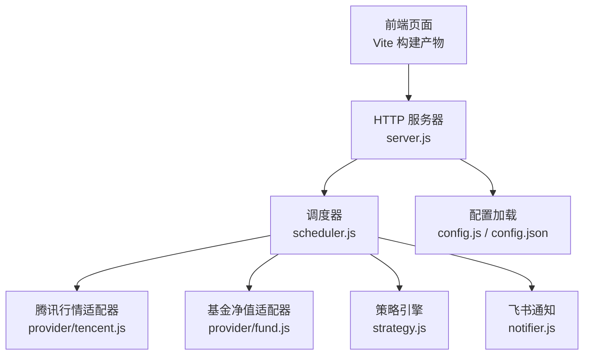
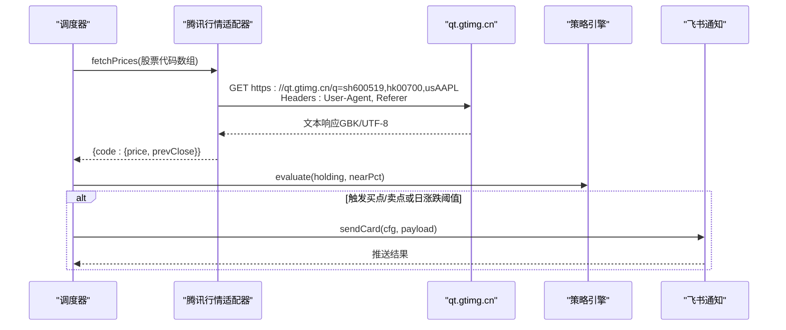
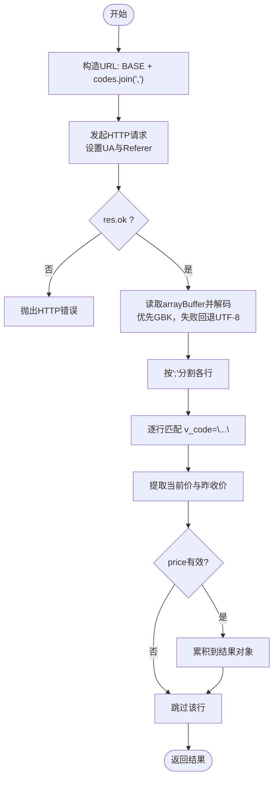
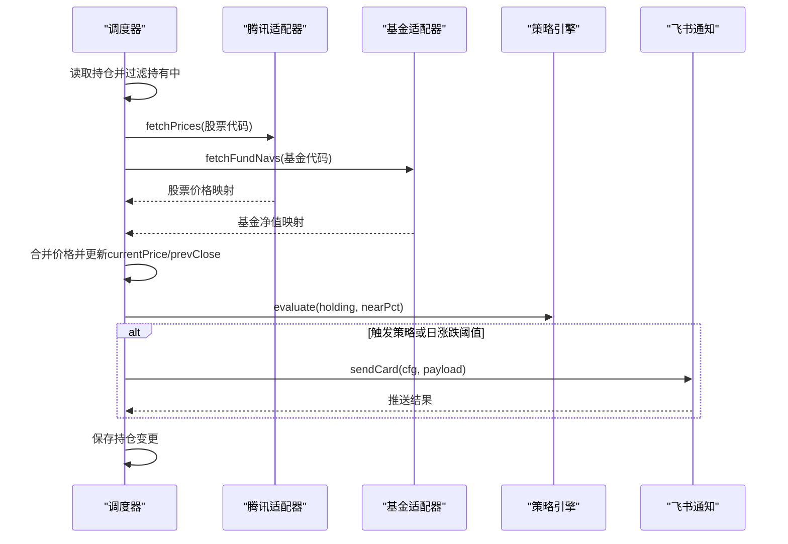
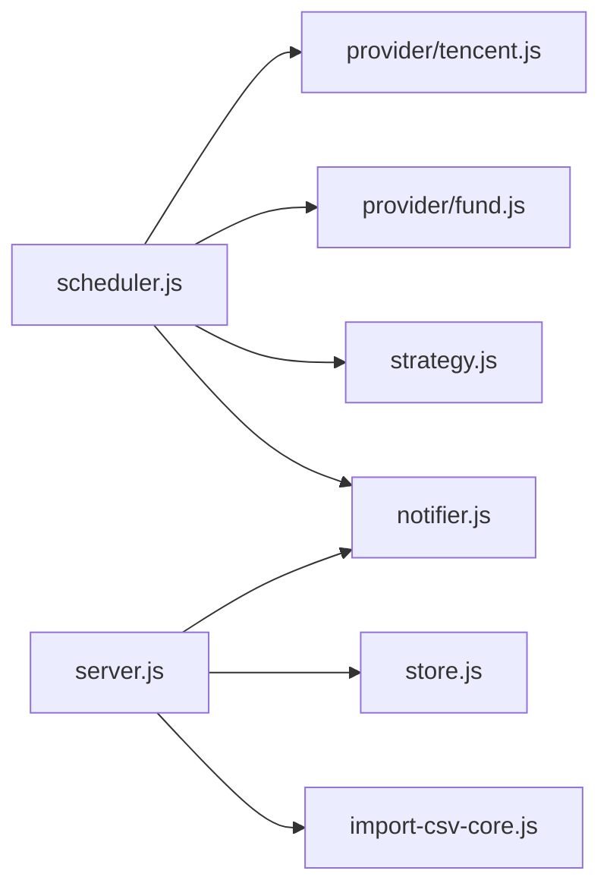

# 腾讯财经API集成

<cite>
**本文引用的文件**
- [server/provider/tencent.js](file://server/provider/tencent.js)
- [server/scheduler.js](file://server/scheduler.js)
- [server/server.js](file://server/server.js)
- [server/index.js](file://server/index.js)
- [config.json](file://config.json)
- [package.json](file://package.json)
</cite>

## 目录
1. [简介](#简介)
2. [项目结构](#项目结构)
3. [核心组件](#核心组件)
4. [架构总览](#架构总览)
5. [详细组件分析](#详细组件分析)
6. [依赖关系分析](#依赖关系分析)
7. [性能考量](#性能考量)
8. [故障排查指南](#故障排查指南)
9. [结论](#结论)
10. [附录：接口调用与使用示例](#附录接口调用与使用示例)

## 简介
本技术文档聚焦于项目中对“腾讯财经行情接口”的集成实现，围绕免Key访问、批量查询、多市场支持（A股/港股/美股）、URL构造与请求头设置、GBK编码转换、响应文本解析、价格字段提取、错误处理机制等关键点进行系统化说明。同时给出调度器如何周期性拉取行情、更新持仓并触发策略告警的整体流程，以及最佳实践建议。

## 项目结构
本项目采用前后端分离的Node.js服务：前端由Vite构建，后端提供HTTP API与定时任务；行情数据通过腾讯财经接口获取，基金净值通过东方财富接口获取，策略评估与飞书通知作为下游环节。

图表来源
- [server/server.js:35-58](file://server/server.js#L35-L58)
- [server/scheduler.js:65-103](file://server/scheduler.js#L65-L103)
- [server/provider/tencent.js:6-41](file://server/provider/tencent.js#L6-L41)
- [server/notifier.js:81-111](file://server/notifier.js#L81-L111)
- [server/config.js:7-10](file://server/config.js#L7-L10)
- [config.json:1-19](file://config.json#L1-L19)

章节来源
- [server/index.js:1-17](file://server/index.js#L1-L17)
- [server/server.js:567-593](file://server/server.js#L567-L593)
- [package.json:1-32](file://package.json#L1-L32)

## 核心组件
- 腾讯行情适配器：负责构造URL、发起HTTP请求、GBK/UTF-8解码、按行分割与正则解析，返回标准化价格对象。
- 调度器：读取持仓列表，区分股票与基金，并行拉取行情，计算日涨跌与策略信号，写入最新价与更新时间，必要时推送飞书卡片。
- HTTP服务器：提供静态页面托管与REST API，供前端交互与导入CSV等操作。
- 配置加载：从配置文件读取调度间隔、服务器端口、飞书Webhook等。

章节来源
- [server/provider/tencent.js:1-41](file://server/provider/tencent.js#L1-L41)
- [server/scheduler.js:1-178](file://server/scheduler.js#L1-L178)
- [server/server.js:55-83](file://server/server.js#L55-L83)
- [server/config.js:1-11](file://server/config.js#L1-L11)

## 架构总览
下图展示了从调度器到腾讯行情接口再到策略与通知的完整链路。

图表来源
- [server/scheduler.js:65-103](file://server/scheduler.js#L65-L103)
- [server/provider/tencent.js:6-41](file://server/provider/tencent.js#L6-L41)
- [server/notifier.js:81-111](file://server/notifier.js#L81-L111)

## 详细组件分析

### 腾讯行情适配器（provider/tencent.js）
- 免Key访问机制
  - 直接访问公开接口，无需鉴权Key。
  - 通过设置User-Agent与Referer降低被拒绝概率。
- URL构造与批量查询
  - 基础地址为固定前缀，多个代码以逗号拼接形成批量请求。
  - 支持A股（sh/sz前缀）、港股（hk前缀）、美股（us前缀）。
- 请求与编码处理
  - 使用fetch发起请求，读取arrayBuffer后优先尝试GBK解码，失败回退UTF-8。
  - 该策略兼容不同环境下的编码差异。
- 响应解析逻辑
  - 按分号分割每只标的的行。
  - 使用正则匹配v_代码="..."结构，提取当前价与昨收价。
  - 将第3段视为当前价，第4段视为昨收价，缺失时置空。
- 数据结构与复杂度
  - 输入：codes数组；输出：{code: {price, prevClose}}。
  - 时间复杂度O(N)，N为返回行数；空间复杂度O(N)。
- 错误处理
  - HTTP非成功状态抛出异常，上层捕获并记录日志。
  - 解析失败或无行情时跳过该标的，不影响其他标的。

图表来源
- [server/provider/tencent.js:6-41](file://server/provider/tencent.js#L6-L41)

章节来源
- [server/provider/tencent.js:1-41](file://server/provider/tencent.js#L1-L41)

### 调度器（scheduler.js）
- 交易时段判断
  - 根据持仓所在市场（sh/sz/hk/us）与时区，判断是否处于交易时段。
  - 交易时段内高频刷新，非交易时段降频。
- 并行拉取行情
  - 股票走腾讯接口，基金走东方财富接口，Promise.all并行执行，提升吞吐。
- 价格更新与日涨跌告警
  - 更新currentPrice、prevClose与lastUpdated。
  - 基于昨收与当前价计算当日涨跌幅，若超过配置的阈值则发送飞书卡片。
- 策略评估与冷却
  - 调用策略引擎评估买点/卖点，结合冷却时间避免重复推送。
  - 更新triggerState与notifiedAt，持久化变更。

图表来源
- [server/scheduler.js:65-103](file://server/scheduler.js#L65-L103)
- [server/scheduler.js:101-164](file://server/scheduler.js#L101-L164)

章节来源
- [server/scheduler.js:1-178](file://server/scheduler.js#L1-178)

### HTTP服务器（server/server.js）
- 静态资源托管：将Vite构建产物作为静态资源提供服务，SPA路由回退index.html。
- JSON响应封装：统一Content-Type与JSON序列化。
- 请求体读取：支持JSON与原始文本（用于CSV导入）。
- 路由分发：/api/*交由handleApi处理，其余GET请求返回静态页面。

章节来源
- [server/server.js:35-83](file://server/server.js#L35-L83)
- [server/server.js:567-593](file://server/server.js#L567-L593)

### 配置加载（config.js / config.json）
- 从项目根目录读取config.json，包含调度间隔、服务器端口、飞书Webhook与签名密钥、通知冷却与阈值等。
- 启动时加载配置，供调度器与服务器使用。

章节来源
- [server/config.js:1-11](file://server/config.js#L1-L11)
- [config.json:1-19](file://config.json#L1-L19)

## 依赖关系分析
- 模块耦合
  - scheduler强依赖tencent与fund适配器，弱依赖strategy与notifier。
  - server依赖store、notifier、import-csv-core等，但不直接依赖行情适配器。
- 外部依赖
  - Node内置http、fs、crypto等。
  - 第三方库：vue（前端）、puppeteer-core（开发工具链），不直接影响行情拉取。
- 潜在循环依赖
  - 当前模块间为单向依赖，未见循环引用。

图表来源
- [server/scheduler.js:1-5](file://server/scheduler.js#L1-L5)
- [server/server.js:5-7](file://server/server.js#L5-L7)

章节来源
- [server/scheduler.js:1-5](file://server/scheduler.js#L1-L5)
- [server/server.js:5-7](file://server/server.js#L5-L7)

## 性能考量
- 批量请求减少网络往返：同一批次多代码合并请求，显著降低延迟与开销。
- 并行拉取：股票与基金行情并行获取，缩短整体耗时。
- 解码容错：优先GBK解码，失败回退UTF-8，提高兼容性。
- 交易时段感知：非交易时段降频，降低无效请求。
- 建议优化
  - 对频繁失败的代码进行去重与重试控制。
  - 增加本地缓存（如最近一次价格与时间戳），在缓存有效期内减少请求。
  - 对超大批量代码进行分片，避免单条URL过长导致服务端限制。

[本节为通用指导，不直接分析具体文件]

## 故障排查指南
- HTTP状态码检查
  - 当res.ok为false时抛出异常，需检查网络、域名解析、UA/Referer是否被拦截。
- 编码问题
  - 若出现乱码，确认服务端返回是否为GBK；当前实现已做回退处理。
- 解析失败
  - 正则未匹配或字段缺失会导致该标的被跳过，检查代码格式与市场前缀是否正确。
- 无行情
  - 某些品种可能不在腾讯接口覆盖范围（如场外基金），应使用基金适配器。
- 通知失败
  - 飞书推送失败会记录错误并重试，检查webhook与secret配置。

章节来源
- [server/provider/tencent.js:15-23](file://server/provider/tencent.js#L15-L23)
- [server/scheduler.js:77-87](file://server/scheduler.js#L77-L87)
- [server/notifier.js:96-111](file://server/notifier.js#L96-L111)

## 结论
本项目对腾讯财经行情接口的集成实现了免Key访问、批量查询与多市场支持，具备健壮的编码处理与解析逻辑，并通过调度器完成周期性的行情更新、策略评估与通知推送。整体架构清晰、扩展性良好，适合进一步引入缓存与重试机制以提升稳定性与性能。

[本节为总结性内容，不直接分析具体文件]

## 附录：接口调用与使用示例

- 接口地址与参数
  - 基础地址：https://qt.gtimg.cn/q=
  - 参数：多个代码以逗号分隔，例如 sh600519,hk00700,usAAPL
  - 支持市场：A股（sh/sz）、港股（hk）、美股（us）

- 请求头设置
  - User-Agent: Mozilla/5.0
  - Referer: https://finance.qq.com

- 编码与解析
  - 优先GBK解码，失败回退UTF-8
  - 按分号分割行，正则匹配v_代码="..."
  - 当前价为第3段，昨收价为第4段

- 错误处理
  - HTTP非2xx抛出异常
  - 解析失败或无行情时跳过该标的

- 使用示例（概念流程）
  - 构造代码数组 -> 调用fetchPrices -> 得到价格映射 -> 更新持仓currentPrice/prevClose -> 计算日涨跌 -> 触发策略与通知

章节来源
- [server/provider/tencent.js:4-41](file://server/provider/tencent.js#L4-L41)
- [server/scheduler.js:72-103](file://server/scheduler.js#L72-L103)