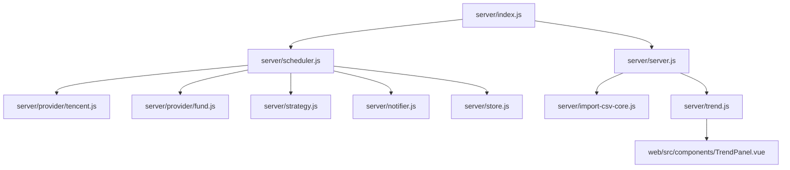
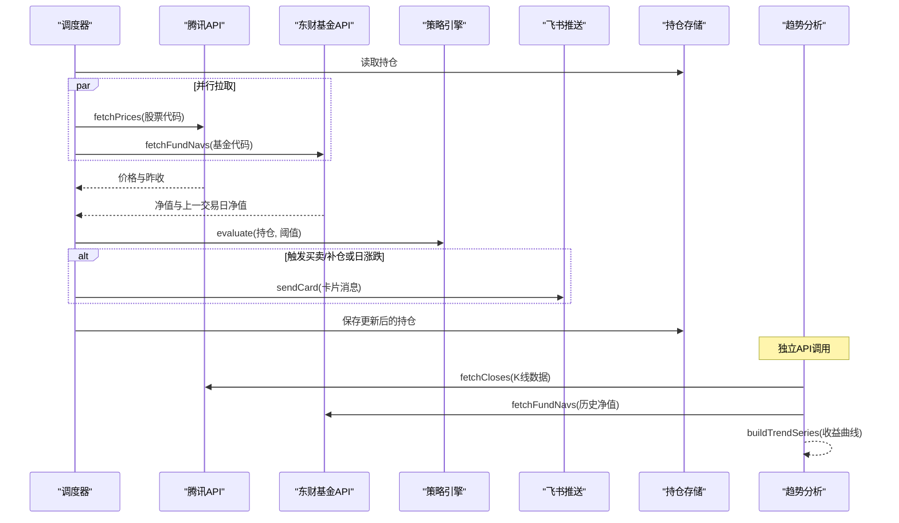
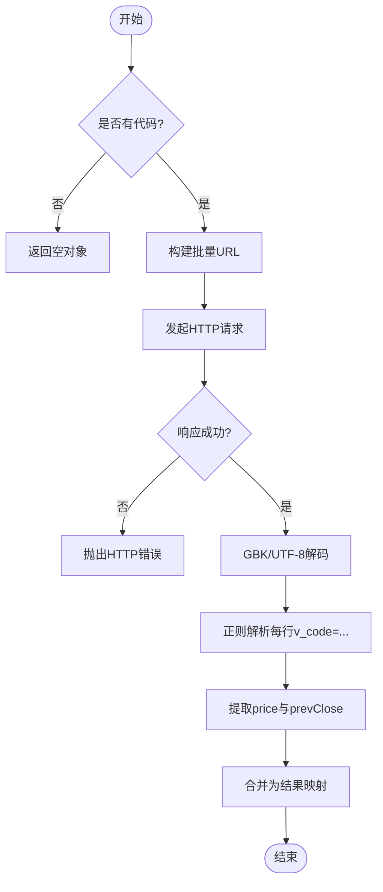
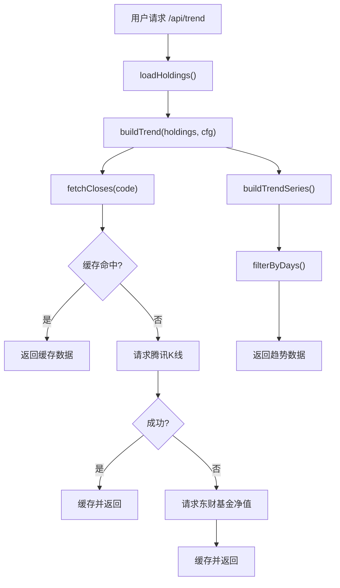
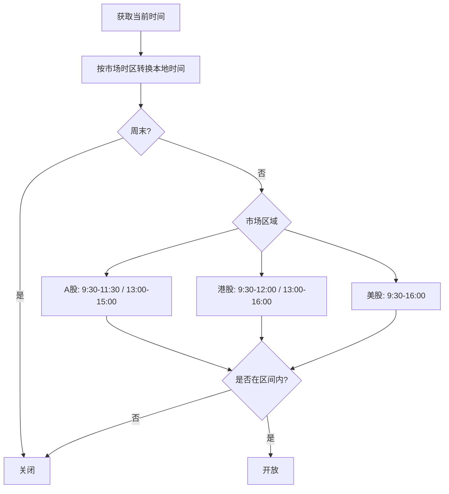
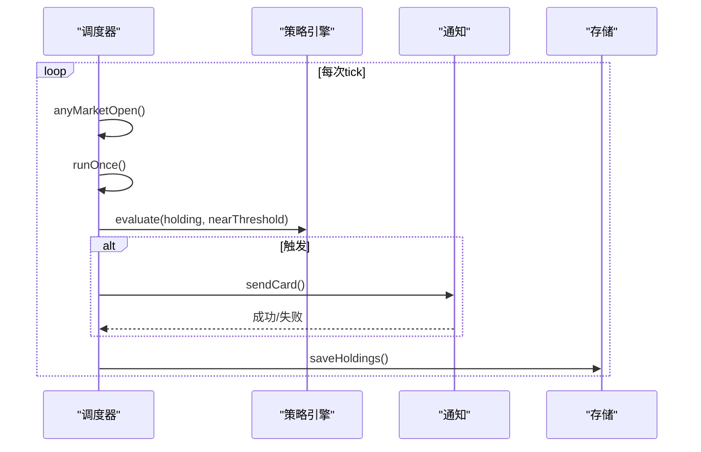
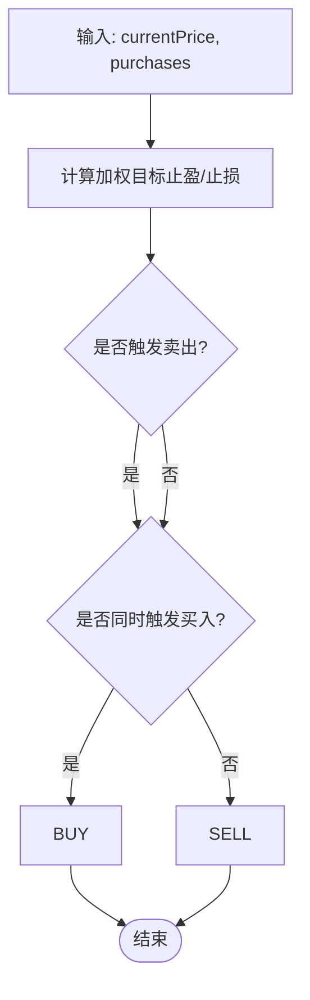
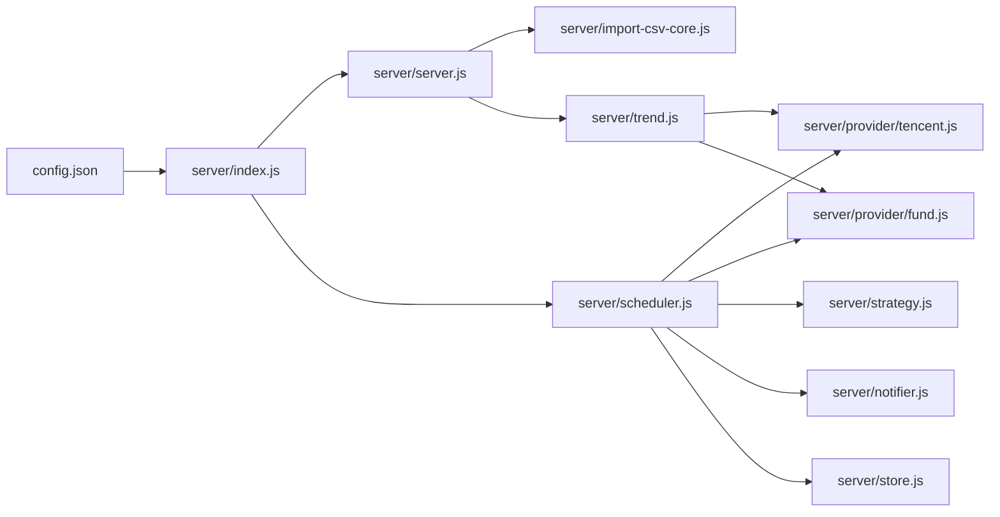

# 行情数据集成

<cite>
**本文引用的文件**
- [server/index.js](file://server/index.js)
- [server/scheduler.js](file://server/scheduler.js)
- [server/provider/tencent.js](file://server/provider/tencent.js)
- [server/provider/fund.js](file://server/provider/fund.js)
- [server/strategy.js](file://server/strategy.js)
- [server/notifier.js](file://server/notifier.js)
- [server/store.js](file://server/store.js)
- [server/server.js](file://server/server.js)
- [server/import-csv-core.js](file://server/import-csv-core.js)
- [server/trend.js](file://server/trend.js)
- [web/src/components/TrendPanel.vue](file://web/src/components/TrendPanel.vue)
- [config.json](file://config.json)
- [data/holdings.json](file://data/holdings.json)
</cite>

## 更新摘要
**变更内容**
- 新增趋势分析系统，支持历史收益曲线计算和可视化展示
- 实现智能缓存机制，包含K线数据10分钟缓存和自动降级策略
- 新增前端趋势面板组件，支持多时间区间切换和实时刷新
- 增强数据源适配层，支持腾讯日K线和东方财富基金净值历史数据
- 完善API接口，新增 `/api/trend` 端点提供趋势数据服务

## 目录
1. [简介](#简介)
2. [项目结构](#项目结构)
3. [核心组件](#核心组件)
4. [架构总览](#架构总览)
5. [详细组件分析](#详细组件分析)
6. [依赖关系分析](#依赖关系分析)
7. [性能考量与优化建议](#性能考量与优化建议)
8. [故障排除指南](#故障排除指南)
9. [结论](#结论)
10. [附录：集成示例与配置说明](#附录：集成示例与配置说明)

## 简介
本系统为 Stock Advisor 的行情数据集成与策略提醒服务，负责从多数据源（腾讯财经、东方财富）获取股票与基金行情，结合持仓与交易记录进行策略评估，并在触发条件时通过飞书机器人推送告警。系统支持不同市场（A股、港股、美股）的交易时段判断与差异化刷新频率，具备幂等导入、并发安全写入、冷却防抖等工程化能力。**新增趋势分析功能**，可基于历史收盘价序列计算逐日收益曲线，并提供可视化的趋势展示界面。

## 项目结构
- server/index.js：应用入口，加载配置，启动 Web 服务与调度器
- server/scheduler.js：定时任务循环、交易时段判断、行情拉取与策略评估、通知发送
- server/provider/tencent.js：腾讯财经 API 适配器（股票/ETF/指数等）
- server/provider/fund.js：东方财富基金净值 API 适配器（场外基金）
- **server/trend.js：趋势分析引擎（历史K线/净值数据处理、收益曲线计算、智能缓存）**
- server/strategy.js：策略引擎（止盈/止损/补仓判定）
- server/notifier.js：飞书卡片消息构建与推送（含签名与重试）
- server/store.js：持仓持久化（JSON 文件），内存缓存与串行写盘
- server/server.js：HTTP 服务器（静态页面托管 + REST API，**新增 /api/trend 端点**）
- **web/src/components/TrendPanel.vue：前端趋势面板组件（ECharts 图表展示）**
- server/import-csv-core.js：CSV 导入核心逻辑（可复用）
- config.json：调度间隔、Web 端口、飞书 webhook、通知冷却等配置
- data/holdings.json：持仓与交易记录存储

**图表来源**
- [server/index.js:1-17](file://server/index.js#L1-L17)
- [server/server.js:427-443](file://server/server.js#L427-L443)
- [server/trend.js:177-188](file://server/trend.js#L177-L188)

**章节来源**
- [server/index.js:1-17](file://server/index.js#L1-L17)
- [config.json:1-22](file://config.json#L1-L22)

## 核心组件
- 调度器（scheduler.js）：按交易时段动态调整刷新间隔；并行拉取股票与基金行情；计算日涨跌并触发告警；执行策略评估；冷却控制；持久化状态变更。
- 数据源适配层：
  - 腾讯财经（tencent.js）：批量请求、GBK/UTF-8 兼容解码、解析当前价与昨收。
  - 东方财富基金（fund.js）：逐个查询基金净值，处理 JSONP 包裹，提取最新与上一交易日净值。
- **趋势分析引擎（trend.js）：基于历史K线/净值数据计算逐日收益曲线，支持智能缓存和自动降级策略。**
- 策略引擎（strategy.js）：基于加权成本计算目标止盈/止损，结合最近买入价判断补仓信号。
- 通知模块（notifier.js）：构造飞书 interactive 卡片，支持 secret 签名与 3 次重试。
- 存储层（store.js）：内存缓存 + mtime 检测外部修改 + 串行写盘避免覆盖。
- Web 服务（server.js）：提供静态页面托管与 REST API（持仓 CRUD、CSV 导入、测试推送、**趋势数据查询**）。
- **前端趋势面板（TrendPanel.vue）：基于 ECharts 的交互式收益趋势图表，支持多时间区间切换。**

**章节来源**
- [server/scheduler.js:1-178](file://server/scheduler.js#L1-L178)
- [server/provider/tencent.js:1-76](file://server/provider/tencent.js#L1-L76)
- [server/provider/fund.js:1-55](file://server/provider/fund.js#L1-L55)
- [server/trend.js:1-189](file://server/trend.js#L1-L189)
- [server/strategy.js:1-91](file://server/strategy.js#L1-L91)
- [server/notifier.js:1-112](file://server/notifier.js#L1-L112)
- [server/store.js:1-71](file://server/store.js#L1-L71)
- [server/server.js:1-623](file://server/server.js#L1-L623)
- [web/src/components/TrendPanel.vue:1-183](file://web/src/components/TrendPanel.vue#L1-L183)

## 架构总览
系统采用"调度驱动"的批处理模式：调度器周期性运行一次完整流程（读取持仓 → 拉取行情 → 策略评估 → 通知 → 保存），并根据是否处于交易时段切换刷新频率。**新增趋势分析模块**，通过独立的API端点提供历史收益曲线数据，前端使用ECharts进行可视化展示。数据源抽象为 provider，便于扩展更多行情接口。

**图表来源**
- [server/scheduler.js:65-165](file://server/scheduler.js#L65-L165)
- [server/provider/tencent.js:6-41](file://server/provider/tencent.js#L6-L41)
- [server/provider/fund.js:6-54](file://server/provider/fund.js#L6-L54)
- [server/strategy.js:34-90](file://server/strategy.js#L34-L90)
- [server/notifier.js:81-111](file://server/notifier.js#L81-L111)
- [server/store.js:40-70](file://server/store.js#L40-L70)
- [server/trend.js:177-188](file://server/trend.js#L177-L188)

## 详细组件分析

### 多数据源集成（腾讯财经与东方财富）
- 腾讯财经
  - 批量接口：将多个代码拼接为逗号分隔的请求 URL，减少网络开销。
  - 编码兼容：优先尝试 GBK 解码，失败回退 UTF-8。
  - 字段解析：正则匹配 v_代码="..."，按 ~ 分割后取第 3 段为当前价、第 4 段为昨收。
  - 错误处理：非 2xx 响应抛出异常，调用方捕获并降级为空结果。
- 东方财富基金
  - 逐只查询：单次接口仅支持一个基金代码，因此循环请求。
  - JSONP 处理：去除 jQuery(...) 包裹后解析 JSON。
  - 净值日期匹配：取 list[0] 为最新净值，list[1] 为上一交易日净值；若缺失则 prevClose 置空。
  - 错误处理：非 2xx 或解析失败时记录警告并跳过该基金。

**图表来源**
- [server/provider/tencent.js:6-41](file://server/provider/tencent.js#L6-L41)

**章节来源**
- [server/provider/tencent.js:1-76](file://server/provider/tencent.js#L1-L76)
- [server/provider/fund.js:1-55](file://server/provider/fund.js#L1-L55)

### 趋势分析系统（新增功能）
**更新** 新增完整的趋势分析系统，支持历史收益曲线计算和可视化展示。

- **数据源整合**
  - 腾讯日K线：通过 `https://web.ifzq.gtimg.cn/appstock/app/fqkline/get` 获取前复权日线数据
  - 东方财富基金净值：通过 `https://fund.eastmoney.com/pingzhongdata/${code}.js` 获取历史净值序列
  - 自动降级：当腾讯K线不可用时，自动回退到东方财富基金净值数据

- **智能缓存机制**
  - K线数据缓存：10分钟TTL的内存缓存，减少重复网络请求
  - 缓存键：基于标的代码的唯一标识
  - 失效策略：基于时间的自动过期机制

- **收益曲线计算**
  - 逐日重放算法：基于交易记录和每日收盘价，精确计算每个时间点的持仓收益
  - 汇率折算：统一使用当前配置汇率将所有币种折算为人民币
  - 多标的聚合：支持同时计算多个持仓的收益曲线并汇总

- **前端可视化**
  - ECharts图表：专业的金融图表库，支持平滑曲线和交互功能
  - 多时间区间：支持今天、近7天、近30天、全部时间范围切换
  - 实时刷新：支持手动刷新和响应式布局

**图表来源**
- [server/trend.js:17-47](file://server/trend.js#L17-L47)
- [server/trend.js:77-157](file://server/trend.js#L77-L157)
- [server/server.js:427-443](file://server/server.js#L427-L443)

**章节来源**
- [server/trend.js:1-189](file://server/trend.js#L1-L189)
- [web/src/components/TrendPanel.vue:1-183](file://web/src/components/TrendPanel.vue#L1-L183)
- [server/server.js:427-443](file://server/server.js#L427-L443)

### 交易时段判断与刷新频率控制
- 市场时区映射：A股（上海/深圳）、港股、美股分别使用对应时区。
- 本地时间换算：使用 Intl.DateTimeFormat 在指定时区下获取星期与时分。
- 交易时段规则（简化版，不含法定节假日）：
  - A股：上午 9:30–11:30，下午 13:00–15:00
  - 港股：上午 9:30–12:00，下午 13:00–16:00
  - 美股：9:30–16:00
- 任意持仓市场处于交易时段即视为"交易中"，否则进入"非交易时段"。
- 刷新间隔：
  - 交易中：使用配置的 intervalSeconds（默认 20 秒）
  - 非交易中：使用 offHoursIntervalSeconds（默认 300 秒）

**图表来源**
- [server/scheduler.js:7-63](file://server/scheduler.js#L7-L63)

**章节来源**
- [server/scheduler.js:7-63](file://server/scheduler.js#L7-L63)
- [config.json:1-22](file://config.json#L1-L22)

### 价格获取策略（频率控制、重试、缓存）
- 请求频率控制
  - 根据交易时段选择不同刷新间隔，降低非交易时段的请求压力。
  - 股票批量请求，基金逐只请求，兼顾效率与兼容性。
- 错误重试机制
  - 行情拉取：调用处对 Promise.all 中的两个源分别 .catch 降级为空对象，保证部分失败不影响整体。
  - 通知推送：飞书推送内置 3 次重试，递增等待间隔。
- 数据缓存策略
  - 持仓数据：内存缓存 + 文件 mtime 检测，避免重复读盘；写操作串行化，防止并发覆盖。
  - 行情数据：本轮拉取结果直接用于评估与展示，未做跨轮次持久化缓存（以 lastUpdated 标记更新时间）。
  - **趋势数据：K线数据10分钟内存缓存，显著减少重复网络请求。**

**章节来源**
- [server/scheduler.js:65-178](file://server/scheduler.js#L65-L178)
- [server/notifier.js:81-111](file://server/notifier.js#L81-L111)
- [server/store.js:8-70](file://server/store.js#L8-L70)
- [server/trend.js:12-46](file://server/trend.js#L12-L46)

### 基金净值特殊处理（日期匹配与缺失数据）
- 净值日期匹配：取最新净值与上一交易日净值，用于计算当日涨跌幅。
- 缺失数据处理：若无上一交易日净值，prevClose 置空；若无净值数据则跳过该基金。
- 容错：解析失败或接口异常时记录警告并继续处理其他基金。

**章节来源**
- [server/provider/fund.js:6-54](file://server/provider/fund.js#L6-L54)

### 调度器实现（定时任务、优先级、执行监控）
- 定时任务管理
  - startScheduler：递归 setTimeout 循环，每次 runOnce 完成后根据是否交易时段决定下一次间隔。
  - runOnce：一次性执行完整流程（读取→拉取→评估→通知→保存）。
- 任务优先级
  - 股票与基金行情并行拉取（Promise.all），缩短总体耗时。
  - 日涨跌告警优先于策略评估，确保每日阈值触发及时推送。
- 执行监控
  - 日志输出：每次 tick 打印模式（交易中/非交易）、持仓数量与状态更新情况。
  - 错误日志：各层 catch 输出错误信息，便于定位问题。

**图表来源**
- [server/scheduler.js:65-178](file://server/scheduler.js#L65-L178)
- [server/strategy.js:34-90](file://server/strategy.js#L34-L90)
- [server/notifier.js:81-111](file://server/notifier.js#L81-L111)
- [server/store.js:40-70](file://server/store.js#L40-L70)

**章节来源**
- [server/scheduler.js:65-178](file://server/scheduler.js#L65-L178)

### 异常处理机制（网络错误、API限流、数据异常）
- 网络错误
  - 行情接口：非 2xx 响应抛错，调用方捕获并降级为空结果，不中断整体流程。
  - 飞书推送：内部重试 3 次，仍失败则向上抛出错误，由上层记录。
- API限流
  - 通过非交易时段降频（默认 300 秒）降低请求频率。
  - 基金净值逐只请求，避免单请求过大导致限流。
- 数据异常
  - 净值缺失：prevClose 置空，参与计算时做防御性判断。
  - CSV 导入：表头校验、必填列检查、幂等去重、错误记录返回。
  - **趋势数据：K线获取失败时自动降级到基金净值，确保数据可用性。**

**章节来源**
- [server/provider/tencent.js:6-41](file://server/provider/tencent.js#L6-L41)
- [server/provider/fund.js:6-54](file://server/provider/fund.js#L6-L54)
- [server/notifier.js:81-111](file://server/notifier.js#L81-L111)
- [server/import-csv-core.js:170-306](file://server/import-csv-core.js#L170-L306)
- [server/trend.js:36-47](file://server/trend.js#L36-L47)

### 策略引擎（止盈/止损/补仓）
- 加权成本：按各笔买入的成本权重计算平均目标止盈与止损比例。
- 卖点触发：
  - 达到预期止盈（考虑 nearThreshold 接近度）
  - 任一买入记录的止损线被触及
- 买点触发：
  - 价格低于补仓价
  - 较最近买入价跌幅达到补仓跌幅阈值（考虑接近度）
- 输出：包含触发类型、原因与建议文案，供通知模块渲染。

**图表来源**
- [server/strategy.js:5-90](file://server/strategy.js#L5-L90)

**章节来源**
- [server/strategy.js:1-91](file://server/strategy.js#L1-L91)

### Web 服务与 API
- 静态资源托管：Vite 构建产物目录，SPA 路由回退到 index.html。
- REST API：
  - GET /api/holdings：返回持仓列表（附带派生字段）
  - POST /api/holdings：新建持仓
  - PATCH /api/holdings/:id：更新持仓级字段（如日涨跌告警阈值）
  - POST /api/holdings/:id/purchases：追加买入记录
  - PATCH /api/holdings/:id/purchases/:pid：修改某条买入记录
  - DELETE /api/holdings/:id/purchases/:pid：删除某条买入记录
  - POST /api/import-csv：导入 CSV 买卖记录
  - POST /api/test-feishu：测试飞书推送
  - **GET /api/trend：获取收益趋势数据（支持 range 参数：day/7d/30d/all）**
- 并发与安全：
  - 所有写操作通过 store.saveHoldings 串行化，避免竞态。
  - 参数校验与错误码返回（400/404/500）。

**章节来源**
- [server/server.js:1-623](file://server/server.js#L1-L623)
- [server/store.js:40-70](file://server/store.js#L40-L70)

## 依赖关系分析
- 调度器依赖：provider（tencent/fund）、strategy、notifier、store
- Web 服务依赖：store、import-csv-core、notifier、**trend**
- 存储层独立：提供 load/save 抽象，屏蔽文件系统细节
- 配置集中：config.json 统一调度、通知、Web 端口等设置
- **趋势分析依赖：provider（tencent/fund）、currency、fx**

**图表来源**
- [server/index.js:1-17](file://server/index.js#L1-L17)
- [config.json:1-22](file://config.json#L1-L22)
- [server/server.js:10](file://server/server.js#L10)
- [server/trend.js:6-8](file://server/trend.js#L6-L8)

**章节来源**
- [server/index.js:1-17](file://server/index.js#L1-L17)
- [server/server.js:596-623](file://server/server.js#L596-L623)
- [server/scheduler.js:1-178](file://server/scheduler.js#L1-L178)

## 性能考量与优化建议
- 连接池管理
  - 当前使用原生 fetch，Node 环境默认复用 TCP 连接；如需更高并发，可引入 http.Agent 或专用 HTTP 客户端库以显式管理连接池。
- 请求合并
  - 股票已批量请求；基金净值因接口限制只能逐只请求。未来可考虑聚合窗口（如 1 秒内累积多个基金请求）以降低总请求数。
- 结果缓存
  - 行情数据可按 code 维度短期缓存（例如 10–30 秒），减少重复请求；注意与 lastUpdated 配合，避免过期数据。
  - **趋势数据已实现10分钟K线缓存，可进一步优化缓存策略和清理机制。**
- 读写分离
  - 读路径可加内存缓存（已实现），写路径保持串行（已实现）；在高并发场景可考虑读写队列进一步削峰。
- 网络超时与重试
  - 可为 provider 增加超时与指数退避重试，提升鲁棒性。
- 前端与后端解耦
  - 当前前后端同进程部署，适合轻量场景；若规模扩大，可将 Web 服务拆分为独立进程并通过 API 通信。

## 故障排除指南
- 无法获取行情
  - 检查网络连通性与 User-Agent/Referer 是否被拦截
  - 查看控制台日志中 [stock-fetch]/[fund-fetch] 的错误信息
  - 确认代码格式正确（股票 region+code，基金纯 code）
- 基金净值缺失
  - 检查 fund.eastmoney.com 接口返回是否为 JSONP 且能正常解析
  - 关注 console.warn 提示"解析失败/无净值数据"
- 飞书推送失败
  - 核对 webhook 地址与 secret 是否正确
  - 使用 /api/test-feishu 接口进行测试
  - 查看 notifier 的重试日志与错误响应
- 持仓数据未更新
  - 确认调度器是否正常运行（查看 tick 日志）
  - 检查 data/holdings.json 是否被外部程序修改导致频繁重载
  - 验证 writeChain 是否阻塞（长时间 IO 错误）
- CSV 导入报错
  - 检查表头是否包含必需列：代码/操作/日期/数量/价格
  - 查看返回的 errors 列表，定位具体失败行
  - 确认 createMissing 选项是否符合预期
- **趋势数据异常**
  - 检查K线缓存是否正常工作（观察console.log输出）
  - 确认腾讯K线接口和东财基金净值接口的可用性
  - 查看前端控制台的网络请求和错误信息
  - 验证汇率配置是否正确影响收益计算

**章节来源**
- [server/scheduler.js:65-178](file://server/scheduler.js#L65-L178)
- [server/provider/fund.js:6-54](file://server/provider/fund.js#L6-L54)
- [server/notifier.js:81-111](file://server/notifier.js#L81-L111)
- [server/import-csv-core.js:170-306](file://server/import-csv-core.js#L170-L306)
- [server/store.js:40-70](file://server/store.js#L40-L70)
- [server/trend.js:36-67](file://server/trend.js#L36-L67)

## 结论
该系统以调度器为核心，整合多数据源行情、策略评估与通知推送，形成闭环的自动化交易辅助工具。通过交易时段感知、并发拉取、串行写盘与冷却机制，实现了稳定可靠的日常运行。**新增的趋势分析系统**提供了强大的历史收益可视化能力，通过智能缓存和自动降级策略确保了数据的可用性和系统的稳定性。后续可在连接池、请求合并、短期缓存等方面进一步优化性能与鲁棒性。

## 附录：集成示例与配置说明
- 启动方式
  - 运行入口：server/index.js，自动加载 config.json，启动 Web 服务与调度器
  - 单次执行：设置环境变量 ONCE=1 后运行，仅执行一次行情抓取与评估
- 关键配置项（config.json）
  - schedule.intervalSeconds：交易中刷新间隔（秒）
  - schedule.offHoursIntervalSeconds：非交易刷新间隔（秒）
  - server.host/server.port：Web 服务监听地址与端口
  - feishu.webhook/secret：飞书机器人 webhook 与签名密钥
  - notify.cooldownSeconds：同一触发态冷却时长（秒）
  - notify.nearThresholdPct：接近阈值百分比（用于"即将触发"的判断）
  - fx.rates：汇率配置（USD_CNY、HKD_CNY等）
- 常用 API
  - GET /api/holdings：获取持仓列表（含派生收益、均价、目标/止损等）
  - POST /api/import-csv：导入 CSV 买卖记录（支持 createMissing）
  - POST /api/test-feishu：测试飞书推送是否正常
  - **GET /api/trend?range={day|7d|30d|all}：获取收益趋势数据**
- 数据模型要点
  - 持仓包含 purchases（多次买入记录）与 sells（卖出记录）
  - 派生字段包括 avgCost、holdingProfit、todayReturnRate、targetProfitRate、stopLossRate 等
  - 最后更新时间 lastUpdated 与 prevClose 用于计算当日盈亏
  - **趋势数据包含 dates、holdingProfit、todayProfit、marketValue、rates、skipped 等字段**

**章节来源**
- [config.json:1-22](file://config.json#L1-L22)
- [server/server.js:427-443](file://server/server.js#L427-L443)
- [data/holdings.json:1-200](file://data/holdings.json#L1-L200)
- [web/src/components/TrendPanel.vue:15-20](file://web/src/components/TrendPanel.vue#L15-L20)