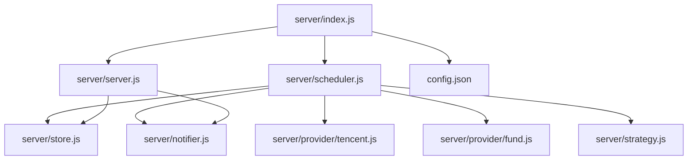
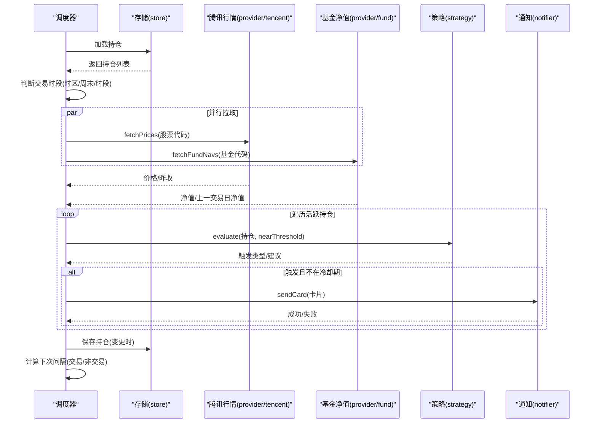
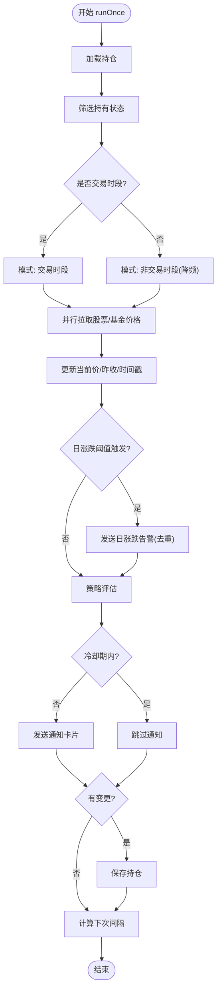
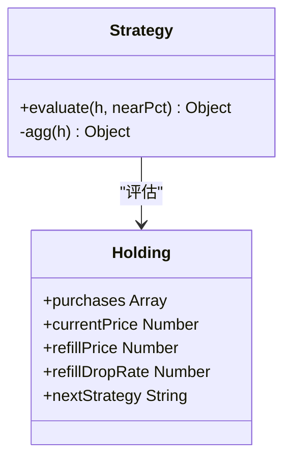
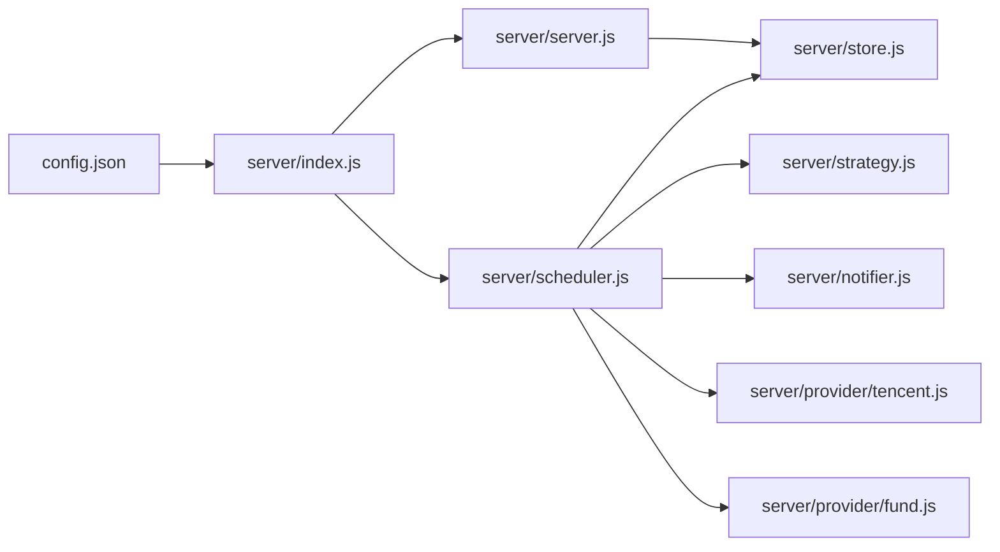

# 调度器系统

<cite>
**本文引用的文件**
- [server/scheduler.js](file://server/scheduler.js)
- [server/config.js](file://server/config.js)
- [config.json](file://config.json)
- [server/index.js](file://server/index.js)
- [server/server.js](file://server/server.js)
- [server/store.js](file://server/store.js)
- [server/notifier.js](file://server/notifier.js)
- [server/strategy.js](file://server/strategy.js)
- [server/provider/tencent.js](file://server/provider/tencent.js)
- [server/provider/fund.js](file://server/provider/fund.js)
- [package.json](file://package.json)
- [start.sh](file://start.sh)
</cite>

## 目录
1. [简介](#简介)
2. [项目结构](#项目结构)
3. [核心组件](#核心组件)
4. [架构总览](#架构总览)
5. [详细组件分析](#详细组件分析)
6. [依赖关系分析](#依赖关系分析)
7. [性能与并发](#性能与并发)
8. [故障恢复与排错](#故障恢复与排错)
9. [配置与调优](#配置与调优)
10. [任务示例与调试方法](#任务示例与调试方法)
11. [结论](#结论)

## 简介
本调度器系统围绕“定时刷新行情、策略评估、阈值告警”的核心目标，提供跨市场（A股、港股、美股）的交易时段判断、按交易时段动态调整刷新频率的任务执行机制。系统通过轻量 HTTP 服务暴露前端页面与 API，结合持久化存储与飞书机器人推送，实现持仓监控与提醒闭环。

## 项目结构
- 入口与启动：server/index.js 负责加载配置、启动 Web 服务与调度循环；支持一次性运行模式（环境变量 ONCE）。
- 调度器：server/scheduler.js 实现交易时段判断、任务执行 runOnce、以及 startScheduler 的循环调度。
- 数据源：server/provider/tencent.js（股票）、server/provider/fund.js（基金净值）。
- 策略引擎：server/strategy.js 基于多次买入记录计算加权成本、止盈止损与补仓信号。
- 通知：server/notifier.js 构建并发送飞书卡片消息，含签名与重试。
- 存储：server/store.js 内存缓存 + 串行写盘，避免并发冲突。
- Web 服务：server/server.js 提供静态资源托管与 REST API（持仓 CRUD、CSV 导入、测试推送等）。
- 配置：config.json 定义调度间隔、服务器端口、飞书 webhook、冷却时间等；server/config.js 读取该配置。

**图表来源**
- [server/index.js:1-17](file://server/index.js#L1-L17)
- [server/scheduler.js:1-178](file://server/scheduler.js#L1-L178)
- [server/server.js:1-594](file://server/server.js#L1-L594)
- [server/store.js:1-71](file://server/store.js#L1-L71)
- [server/notifier.js:1-112](file://server/notifier.js#L1-L112)
- [server/strategy.js:1-91](file://server/strategy.js#L1-L91)
- [server/provider/tencent.js:1-42](file://server/provider/tencent.js#L1-L42)
- [server/provider/fund.js:1-55](file://server/provider/fund.js#L1-L55)
- [config.json:1-19](file://config.json#L1-L19)

**章节来源**
- [server/index.js:1-17](file://server/index.js#L1-L17)
- [server/scheduler.js:1-178](file://server/scheduler.js#L1-L178)
- [server/server.js:1-594](file://server/server.js#L1-L594)
- [server/store.js:1-71](file://server/store.js#L1-L71)
- [server/notifier.js:1-112](file://server/notifier.js#L1-L112)
- [server/strategy.js:1-91](file://server/strategy.js#L1-L91)
- [server/provider/tencent.js:1-42](file://server/provider/tencent.js#L1-L42)
- [server/provider/fund.js:1-55](file://server/provider/fund.js#L1-L55)
- [config.json:1-19](file://config.json#L1-L19)

## 核心组件
- 调度器（scheduler.js）
  - 交易时段判断：isMarketOpen、anyMarketOpen
  - 任务执行：runOnce（拉取行情、策略评估、告警、状态落盘）
  - 循环调度：startScheduler（根据是否交易时段选择刷新间隔）
- 数据提供者（provider/*）
  - 腾讯行情：fetchPrices（批量获取股票当前价与昨收）
  - 基金净值：fetchFundNavs（逐只获取最新与上一交易日净值）
- 策略引擎（strategy.js）
  - evaluate：基于加权成本、最近买入价、补仓价/跌幅阈值，输出触发类型（BUY/SELL/NONE）与建议
- 通知（notifier.js）
  - buildCard/sendCard：构造飞书卡片，支持 secret 签名与重试
- 存储（store.js）
  - loadHoldings/saveHoldings：内存缓存 + mtime 检测 + 串行写盘
- Web 服务（server.js）
  - 静态资源托管、REST API（持仓管理、CSV 导入、测试推送）

**章节来源**
- [server/scheduler.js:1-178](file://server/scheduler.js#L1-L178)
- [server/provider/tencent.js:1-42](file://server/provider/tencent.js#L1-L42)
- [server/provider/fund.js:1-55](file://server/provider/fund.js#L1-L55)
- [server/strategy.js:1-91](file://server/strategy.js#L1-L91)
- [server/notifier.js:1-112](file://server/notifier.js#L1-L112)
- [server/store.js:1-71](file://server/store.js#L1-L71)
- [server/server.js:1-594](file://server/server.js#L1-L594)

## 架构总览
调度器在进程启动后持续循环执行 runOnce：
- 读取持仓列表，过滤“持有”状态
- 判断当前是否有任一市场处于交易时段
- 并行拉取股票与基金价格
- 对每个活跃持仓进行策略评估与日涨跌告警
- 若触发告警且不在冷却期，则发送飞书卡片
- 更新持仓状态并落盘
- 根据是否交易时段决定下一次执行间隔

**图表来源**
- [server/scheduler.js:65-178](file://server/scheduler.js#L65-L178)
- [server/provider/tencent.js:6-42](file://server/provider/tencent.js#L6-L42)
- [server/provider/fund.js:6-55](file://server/provider/fund.js#L6-L55)
- [server/strategy.js:34-91](file://server/strategy.js#L34-L91)
- [server/notifier.js:81-112](file://server/notifier.js#L81-L112)
- [server/store.js:40-71](file://server/store.js#L40-L71)

## 详细组件分析

### 交易时段判断与时区处理
- 时区映射：hk/sh/sz/us 分别对应 Asia/Hong_Kong、Asia/Shanghai、America/New_York
- 本地时间解析：使用 Intl.DateTimeFormat 获取指定时区的星期、小时、分钟
- 周末判定：周六/周日直接视为非交易
- 时段判定：
  - A股(sh/sz)：上午 9:30-11:30，下午 13:00-15:00
  - 港股(hk)：上午 9:30-12:00，下午 13:00-16:00
  - 美股(us)：9:30-16:00
- anyMarketOpen：只要有一个“持有”状态的持仓所在市场处于交易时段，即认为当前为交易时段

注意：当前实现未包含法定节假日处理，节假日仍可能被视为交易时段。

**章节来源**
- [server/scheduler.js:7-56](file://server/scheduler.js#L7-L56)

### 任务执行流程（runOnce）
- 加载持仓并筛选“持有”状态
- 区分股票与基金，分别调用 provider 拉取价格
- 合并价格结果，逐个持仓更新当前价、昨收、更新时间
- 日涨跌告警：基于当日涨跌幅与配置的阈值，每日仅触发一次（按日期去重）
- 策略评估：evaluate 返回 BUY/SELL/NONE 及建议
- 冷却控制：同一触发态且在 cooldownSeconds 内不重复推送
- 状态落盘：有变更时保存持仓
- 日志：打印每次 tick 的模式（交易/非交易）、持仓数量、状态更新情况

**图表来源**
- [server/scheduler.js:65-178](file://server/scheduler.js#L65-L178)

**章节来源**
- [server/scheduler.js:65-178](file://server/scheduler.js#L65-L178)

### 策略引擎（strategy.js）
- 聚合买入记录：计算总成本、总数量、均价、最近买入价
- 加权止盈/止损：按每笔买入的成本权重计算整体止盈/止损比例
- 卖点逻辑：
  - 达到预期止盈（考虑 nearPct 缓冲）
  - 任一买入记录触及止损线（考虑 nearPct 缓冲）
- 买点逻辑：
  - 较最近买入价跌幅达到或接近 refillDropRate
  - 或价格低于 refillPrice
- 输出：trigger（BUY/SELL/NONE）、reason、advice、相关比率

**图表来源**
- [server/strategy.js:1-91](file://server/strategy.js#L1-L91)

**章节来源**
- [server/strategy.js:1-91](file://server/strategy.js#L1-L91)

### 通知与告警（notifier.js）
- 卡片构建：区分日涨跌告警与买卖点提醒，设置标题模板与字段
- 飞书推送：支持 secret 签名（timestamp + sign），最多重试 3 次，指数退避
- 错误处理：网络异常或接口错误抛出异常，由上层捕获并记录

**章节来源**
- [server/notifier.js:1-112](file://server/notifier.js#L1-L112)

### 数据存储与并发控制（store.js）
- 内存缓存：首次加载或文件被外部修改时重新读盘，否则复用内存
- 串行写盘：writeChain 保证写入顺序，避免并发覆盖
- 迁移：旧版单条买入模型自动迁移到 purchases 数组模型
- mtime 同步：写盘后更新 mtime，防止误判外部改动

**章节来源**
- [server/store.js:1-71](file://server/store.js#L1-L71)

### Web 服务与 API（server.js）
- 静态资源托管：优先精确匹配，回退到 index.html（SPA）
- API 路由：
  - GET /api/holdings：返回持仓列表（带衍生字段）
  - POST /api/holdings：新建持仓
  - PATCH /api/holdings/:id：更新持仓级字段（如日涨跌告警阈值）
  - POST /api/holdings/:id/purchases：追加买入记录
  - PATCH /api/holdings/:id/purchases/:pid：修改某条买入记录
  - DELETE /api/holdings/:id/purchases/:pid：删除某条买入记录
  - POST /api/import-csv：导入 CSV 买卖记录
  - POST /api/test-feishu：测试飞书推送
- 派生计算：withDerived 计算均价、市值、收益、今日收益、交易明细等

**章节来源**
- [server/server.js:1-594](file://server/server.js#L1-L594)

## 依赖关系分析
- scheduler.js 依赖：
  - store.js（loadHoldings/saveHoldings）
  - provider/tencent.js（fetchPrices）
  - provider/fund.js（fetchFundNavs）
  - strategy.js（evaluate）
  - notifier.js（sendCard）
- server.js 依赖：
  - store.js（读写持仓）
  - notifier.js（测试推送）
  - import-csv-core.js（CSV 导入）
- config.json 驱动：
  - schedule.intervalSeconds / offHoursIntervalSeconds
  - notify.cooldownSeconds / nearThresholdPct
  - feishu.webhook / secret
  - server.host / port

**图表来源**
- [config.json:1-19](file://config.json#L1-L19)
- [server/index.js:1-17](file://server/index.js#L1-L17)
- [server/scheduler.js:1-178](file://server/scheduler.js#L1-L178)
- [server/server.js:1-594](file://server/server.js#L1-L594)

**章节来源**
- [config.json:1-19](file://config.json#L1-L19)
- [server/index.js:1-17](file://server/index.js#L1-L17)
- [server/scheduler.js:1-178](file://server/scheduler.js#L1-L178)
- [server/server.js:1-594](file://server/server.js#L1-L594)

## 性能与并发
- 并行拉取：股票与基金价格通过 Promise.all 并行请求，减少单次 tick 耗时
- 串行写盘：saveHoldings 使用 writeChain 确保写入顺序，避免竞态
- 内存缓存：loadHoldings 仅在文件变化时重新读盘，降低 IO 开销
- 冷却机制：cooldownSeconds 避免频繁推送，减轻通知通道压力
- 降频策略：非交易时段使用更长的 offHoursIntervalSeconds，降低资源消耗

优化建议
- 若持仓规模较大，可考虑分批拉取或增加超时控制
- 对于高频 tick，可适当增大 intervalSeconds 或在非交易时段进一步延长 offHoursIntervalSeconds
- 对第三方接口增加重试与熔断策略，提升鲁棒性

[本节为通用性能讨论，不直接分析具体文件]

## 故障恢复与排错
- 网络异常：provider 层捕获并返回空对象或警告，调度器继续处理其他持仓
- 通知失败：sendCard 内部重试 3 次，最终失败抛错，上层 catch 记录日志
- 存储异常：saveHoldings 捕获写盘错误并记录日志，不影响后续调度
- 日志定位：
  - [stock-fetch]/[fund-fetch]：行情拉取错误
  - [notify]/[notify-daily]：通知失败
  - [store] save error：存储写入错误
  - [server]：HTTP 服务异常

排查步骤
- 检查 config.json 中 feishu webhook 与 secret 是否正确
- 确认网络可达性与第三方接口可用性
- 查看控制台日志中的错误信息，定位具体环节
- 使用 /api/test-feishu 验证通知链路

**章节来源**
- [server/scheduler.js:77-86](file://server/scheduler.js#L77-L86)
- [server/notifier.js:96-112](file://server/notifier.js#L96-L112)
- [server/store.js:62-71](file://server/store.js#L62-L71)
- [server/server.js:545-562](file://server/server.js#L545-L562)

## 配置与调优
- 调度间隔
  - schedule.intervalSeconds：交易时段刷新频率（秒）
  - schedule.offHoursIntervalSeconds：非交易时段刷新频率（秒），默认 300
- 通知
  - notify.cooldownSeconds：同一触发态冷却时间（秒）
  - notify.nearThresholdPct：接近阈值的缓冲百分比
- 服务器
  - server.host / server.port：监听地址与端口
- 飞书
  - feishu.webhook：机器人 webhook 地址
  - feishu.secret：签名密钥（可选）

调优建议
- 根据持仓数量与网络状况调整 intervalSeconds
- 合理设置 cooldownSeconds，避免告警风暴
- 在非交易时段适当提高 offHoursIntervalSeconds，降低资源占用
- 为第三方接口增加超时与重试策略（可在 provider 层扩展）

**章节来源**
- [config.json:1-19](file://config.json#L1-L19)
- [server/scheduler.js:58-63](file://server/scheduler.js#L58-L63)

## 任务示例与调试方法
- 启动方式
  - 生产模式：./start.sh（自动构建前端并启动后端，http://127.0.0.1:3000）
  - 开发模式：./start.sh dev（后端 :3000 + Vite 前端 :5173）
  - 一次性运行：设置环境变量 ONCE=1 后启动，仅执行一次 runOnce
- 常用 API
  - GET /api/holdings：获取持仓列表（含衍生字段）
  - POST /api/holdings：创建持仓（name/code/region/type 必填）
  - PATCH /api/holdings/:id：更新持仓级字段（如 dailyDropAlertPct/dailyRiseAlertPct）
  - POST /api/holdings/:id/purchases：追加买入记录
  - PATCH /api/holdings/:id/purchases/:pid：修改某条买入记录
  - DELETE /api/holdings/:id/purchases/:pid：删除某条买入记录
  - POST /api/import-csv：导入 CSV 买卖记录
  - POST /api/test-feishu：测试飞书推送
- 调试技巧
  - 观察控制台日志中的 [tick] 行，确认模式与次数
  - 使用 /api/test-feishu 验证通知链路
  - 检查 data/holdings.json 中持仓状态与 lastUpdated
  - 通过浏览器访问 http://127.0.0.1:3000 查看前端展示

**章节来源**
- [start.sh:1-100](file://start.sh#L1-L100)
- [server/server.js:409-565](file://server/server.js#L409-L565)
- [server/index.js:11-16](file://server/index.js#L11-L16)

## 结论
本调度器系统以简洁可靠的 Node.js 实现，完成了跨市场交易时段判断、动态刷新频率、策略评估与告警推送的全流程。通过内存缓存与串行写盘保障数据一致性，借助冷却机制与降频策略平衡实时性与资源消耗。未来可扩展节假日日历、更多数据源与更细粒度的并发控制，进一步提升系统的稳定性与可观测性。