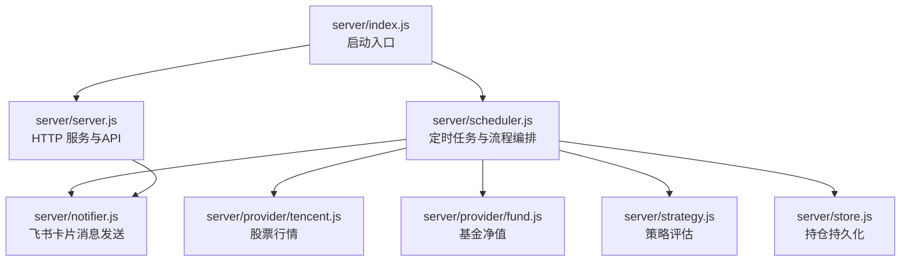
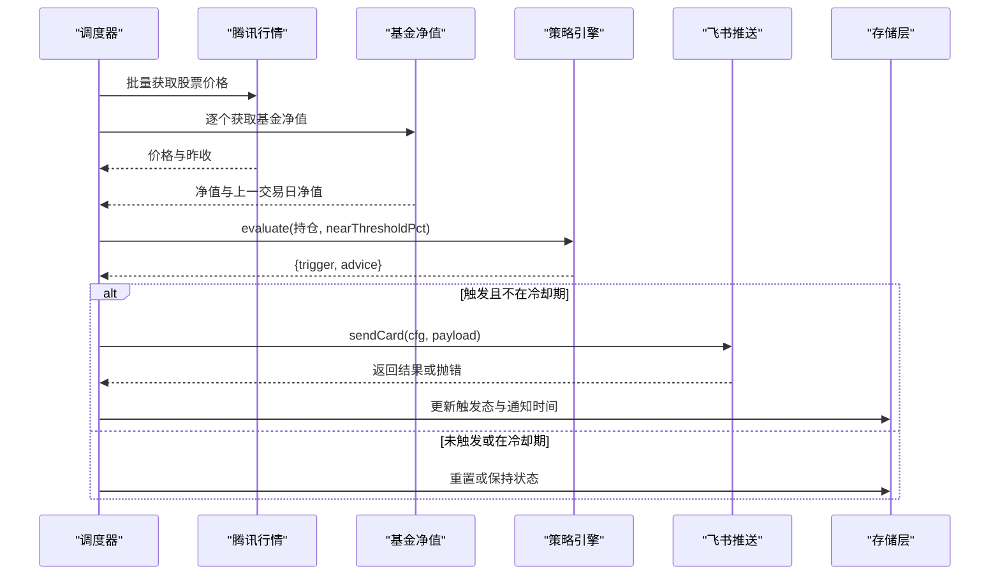
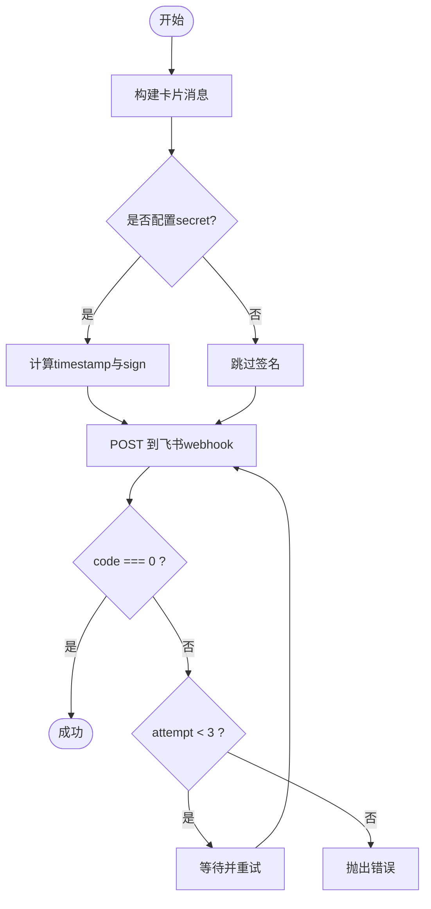
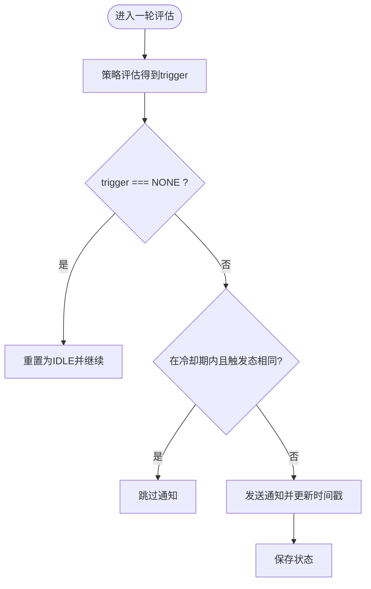
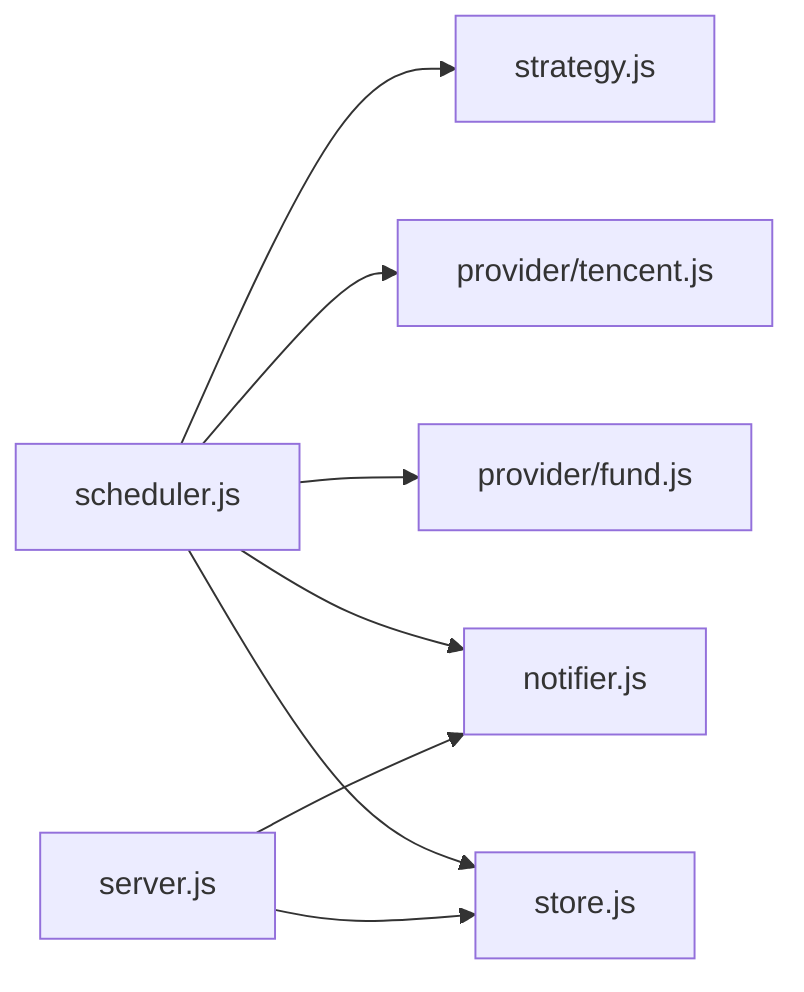

# 通知系统

<cite>
**本文引用的文件**
- [server/notifier.js](file://server/notifier.js)
- [server/scheduler.js](file://server/scheduler.js)
- [server/server.js](file://server/server.js)
- [server/config.js](file://server/config.js)
- [config.json](file://config.json)
- [server/strategy.js](file://server/strategy.js)
- [server/store.js](file://server/store.js)
- [server/provider/tencent.js](file://server/provider/tencent.js)
- [server/provider/fund.js](file://server/provider/fund.js)
- [server/index.js](file://server/index.js)
</cite>

## 目录
1. [简介](#简介)
2. [项目结构](#项目结构)
3. [核心组件](#核心组件)
4. [架构总览](#架构总览)
5. [详细组件分析](#详细组件分析)
6. [依赖关系分析](#依赖关系分析)
7. [性能考虑](#性能考虑)
8. [故障排除指南](#故障排除指南)
9. [结论](#结论)
10. [附录：配置与使用示例](#附录配置与使用示例)

## 简介
本文件为 Stock Advisor 通知系统的技术文档，聚焦于飞书机器人集成的实现细节、消息模板设计、冷却机制、错误处理策略、通知渠道扩展、消息队列设计与可靠性保证，以及性能优化建议。目标是帮助开发者理解并定制通知功能，确保在高并发和外部服务不稳定场景下的稳定运行。

## 项目结构
通知系统由调度器、策略引擎、数据源适配器、存储层、HTTP API 与飞书推送模块组成。整体采用模块化设计，职责清晰，便于扩展与维护。

图表来源
- [server/index.js:1-17](file://server/index.js#L1-L17)
- [server/server.js:567-594](file://server/server.js#L567-L594)
- [server/scheduler.js:65-178](file://server/scheduler.js#L65-L178)
- [server/provider/tencent.js:6-42](file://server/provider/tencent.js#L6-L42)
- [server/provider/fund.js:6-55](file://server/provider/fund.js#L6-L55)
- [server/strategy.js:34-91](file://server/strategy.js#L34-L91)
- [server/notifier.js:81-112](file://server/notifier.js#L81-L112)
- [server/store.js:40-71](file://server/store.js#L40-L71)

章节来源
- [server/index.js:1-17](file://server/index.js#L1-L17)
- [server/server.js:567-594](file://server/server.js#L567-L594)
- [server/scheduler.js:65-178](file://server/scheduler.js#L65-L178)

## 核心组件
- 飞书消息构建与发送：负责构造飞书 interactive 卡片消息，支持签名认证与重试。
- 调度器：按交易时段动态调整刷新频率，拉取行情、评估策略、触发通知、写入状态。
- 策略引擎：基于成本加权止盈/止损与补仓逻辑，输出触发类型与建议文案。
- 数据源适配：腾讯财经（股票）与东方财富（基金净值）的批量或单条查询。
- 存储层：内存缓存 + 串行写盘，避免并发冲突与覆盖。
- HTTP API：提供持仓管理、CSV导入、测试消息等接口。

章节来源
- [server/notifier.js:4-112](file://server/notifier.js#L4-L112)
- [server/scheduler.js:65-178](file://server/scheduler.js#L65-L178)
- [server/strategy.js:34-91](file://server/strategy.js#L34-L91)
- [server/provider/tencent.js:6-42](file://server/provider/tencent.js#L6-L42)
- [server/provider/fund.js:6-55](file://server/provider/fund.js#L6-L55)
- [server/store.js:40-71](file://server/store.js#L40-L71)
- [server/server.js:409-565](file://server/server.js#L409-L565)

## 架构总览
通知系统以“调度器”为核心驱动，周期性执行“拉取行情 → 策略评估 → 冷却判断 → 发送通知 → 持久化状态”的流程。HTTP 服务暴露 REST 接口供前端与管理端调用，同时提供测试消息能力。

图表来源
- [server/scheduler.js:65-178](file://server/scheduler.js#L65-L178)
- [server/provider/tencent.js:6-42](file://server/provider/tencent.js#L6-L42)
- [server/provider/fund.js:6-55](file://server/provider/fund.js#L6-L55)
- [server/strategy.js:34-91](file://server/strategy.js#L34-L91)
- [server/notifier.js:81-112](file://server/notifier.js#L81-L112)
- [server/store.js:40-71](file://server/store.js#L40-L71)

## 详细组件分析

### 飞书机器人集成（Webhook、消息格式、认证）
- Webhook 调用：通过 fetch 向配置的 webhook 地址 POST JSON 请求，Content-Type 为 application/json。
- 消息格式：统一构建 interactive 卡片消息，包含 header（标题与模板色）、elements（字段、分隔线、详情文本、note）。
- 认证机制：若配置了 secret，则计算 timestamp 与 sign（HMAC-SHA256），附加到请求体中。
- 重试逻辑：最多尝试 3 次，指数退避间隔（1s、2s、3s），失败时抛出异常。

图表来源
- [server/notifier.js:4-112](file://server/notifier.js#L4-L112)

章节来源
- [server/notifier.js:4-112](file://server/notifier.js#L4-L112)

### 消息模板设计（文本、卡片、富媒体）
- 日涨跌告警：根据触发类型（大涨/大跌）设置不同 header 模板颜色，展示品种、代码、市场/类型、当前价与详情。
- 买卖点提醒：根据买入/卖出设置不同标题与模板色，展示关键信息与操作建议。
- 富媒体内容：使用 lark_md 渲染 Markdown 片段，note 区域显示摘要信息。

章节来源
- [server/notifier.js:4-78](file://server/notifier.js#L4-L78)

### 冷却机制（防重复通知与资源节约）
- 触发态与通知时间：每个持仓维护 triggerState 与 notifiedAt。
- 冷却窗口：当同一触发态且在 cooldownSeconds 内，跳过再次通知。
- 每日涨跌告警：使用 dailyAlertSentDate 防止同日内重复推送。

图表来源
- [server/scheduler.js:126-158](file://server/scheduler.js#L126-L158)
- [config.json:14-17](file://config.json#L14-L17)

章节来源
- [server/scheduler.js:126-158](file://server/scheduler.js#L126-L158)
- [config.json:14-17](file://config.json#L14-L17)

### 错误处理策略（网络异常、API限流、重试）
- 行情抓取：对腾讯与东财接口进行 try/catch，失败时记录日志并返回空结果，不影响其他标的处理。
- 飞书推送：内置 3 次重试与延迟退避；若最终失败，向上抛出错误并在调度器中捕获记录。
- 调度容错：单次 runOnce 出错后仍继续下一次循环，避免整个调度崩溃。

章节来源
- [server/scheduler.js:77-86](file://server/scheduler.js#L77-L86)
- [server/scheduler.js:167-178](file://server/scheduler.js#L167-L178)
- [server/notifier.js:96-110](file://server/notifier.js#L96-L110)
- [server/provider/tencent.js:6-42](file://server/provider/tencent.js#L6-L42)
- [server/provider/fund.js:6-55](file://server/provider/fund.js#L6-L55)

### 通知渠道扩展机制（支持其他IM平台）
- 抽象化 sendCard：将消息构建与发送解耦，可通过新增适配器函数替换或并行调用多通道。
- 配置驱动：从 config.json 读取各渠道参数（如 webhook、secret），便于运行时切换。
- 扩展建议：
  - 新增企业微信/钉钉通道：实现相同的 buildXxx(payload) 与 sendXxx(cfg, payload) 接口。
  - 统一重试与降级：封装通用重试逻辑，支持失败回退到其他渠道。
  - 路由策略：根据策略或用户偏好选择目标渠道。

章节来源
- [server/notifier.js:81-112](file://server/notifier.js#L81-L112)
- [config.json:10-13](file://config.json#L10-L13)

### 消息队列设计（可靠投递与顺序保证）
- 现状：当前实现为同步发送，无独立消息队列。
- 改进方案：
  - 引入轻量队列（如 Redis Streams 或本地文件队列）缓冲待发送消息。
  - 消费者异步消费，结合幂等键（如持仓ID+触发态+时间窗口）去重。
  - 顺序保证：按持仓ID分区，确保同一标的的通知顺序。
  - 持久化与重试：失败消息持久化，配合死信队列与人工干预。
  - 背压与限流：控制生产者速率，避免外部API限流导致堆积。

[本节为概念性设计，不直接对应具体源码]

### 性能优化建议（批量发送、连接复用、异步处理）
- 批量发送：合并多个标的的通知为一次请求（需飞书侧支持批量接口或自定义聚合卡片）。
- 连接复用：使用全局 HTTP 客户端（如 undici Agent）复用 TCP 连接，减少握手开销。
- 异步处理：将通知发送与策略评估完全异步化，避免阻塞主循环。
- 缓存热点：对频繁访问的配置与静态模板做内存缓存。
- 降频策略：非交易时段拉长刷新间隔，降低网络与计算压力。

[本节为通用优化建议，不直接对应具体源码]

## 依赖关系分析
通知系统的关键依赖如下：
- 调度器依赖策略引擎、数据源适配器、通知模块与存储层。
- HTTP API 依赖存储层与通知模块（测试消息）。
- 数据源适配器各自独立，屏蔽外部差异。
- 存储层提供内存缓存与串行写盘，保障一致性。

图表来源
- [server/scheduler.js:1-6](file://server/scheduler.js#L1-L6)
- [server/server.js:5-7](file://server/server.js#L5-L7)

章节来源
- [server/scheduler.js:1-6](file://server/scheduler.js#L1-L6)
- [server/server.js:5-7](file://server/server.js#L5-L7)

## 性能考虑
- 交易时段与非交易时段差异化刷新：缩短交易时段刷新间隔，提高时效性；非交易时段拉长间隔，节省资源。
- 并行拉取：股票与基金数据并行获取，减少总体延迟。
- 冷却机制：避免短时间内重复通知，降低网络与UI抖动。
- 串行写盘：防止并发写入导致的数据覆盖。
- 错误隔离：单个数据源失败不影响其他标的处理。

章节来源
- [server/scheduler.js:58-63](file://server/scheduler.js#L58-L63)
- [server/scheduler.js:77-86](file://server/scheduler.js#L77-L86)
- [server/store.js:62-71](file://server/store.js#L62-L71)

## 故障排除指南
- 飞书推送失败：
  - 检查 webhook 地址与 secret 是否正确。
  - 查看日志中的错误信息，确认 code !== 0 的具体原因。
  - 使用 /api/test-feishu 接口验证连通性与签名。
- 行情数据缺失：
  - 检查网络与外部API可用性。
  - 查看控制台日志中的 [stock-fetch]/[fund-fetch] 错误。
  - 确认股票代码/基金代码格式正确。
- 通知未触发：
  - 检查策略阈值与 nearThresholdPct 配置。
  - 确认冷却窗口未阻止通知。
  - 查看持仓的 triggerState 与 notifiedAt 状态。
- 数据不一致：
  - 检查 store 的串行写盘是否生效。
  - 确认外部修改 holdings.json 后是否被重新加载。

章节来源
- [server/server.js:545-562](file://server/server.js#L545-L562)
- [server/scheduler.js:77-86](file://server/scheduler.js#L77-L86)
- [server/scheduler.js:126-158](file://server/scheduler.js#L126-L158)
- [server/store.js:40-71](file://server/store.js#L40-L71)

## 结论
该通知系统以调度器为核心，结合策略引擎与数据源适配器，实现了稳定的行情监控与飞书通知。通过冷却机制与错误隔离，提升了鲁棒性。未来可引入消息队列与多通道路由，进一步增强可靠性与可扩展性。

[本节为总结性内容，不直接对应具体源码]

## 附录：配置与使用示例
- 基本配置（config.json）：
  - schedule.intervalSeconds：交易时段刷新间隔（秒）
  - schedule.offHoursIntervalSeconds：非交易时段刷新间隔（秒）
  - server.host/port：HTTP 服务监听地址与端口
  - feishu.webhook/secret：飞书机器人 webhook 与签名密钥
  - notify.cooldownSeconds：冷却窗口（秒）
  - notify.nearThresholdPct：接近阈值百分比

- 常用接口：
  - GET /api/holdings：获取持仓列表（含派生字段）
  - POST /api/holdings：新建持仓
  - PATCH /api/holdings/:id：更新持仓级字段（如日涨跌告警阈值）
  - POST /api/holdings/:id/purchases：追加买入记录
  - POST /api/import-csv：导入 CSV 买卖记录
  - POST /api/test-feishu：发送测试消息到飞书

章节来源
- [config.json:1-19](file://config.json#L1-L19)
- [server/server.js:409-565](file://server/server.js#L409-L565)