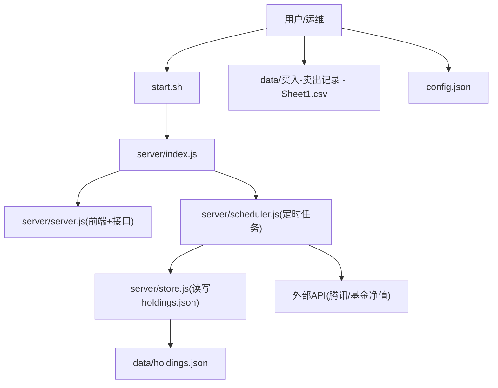
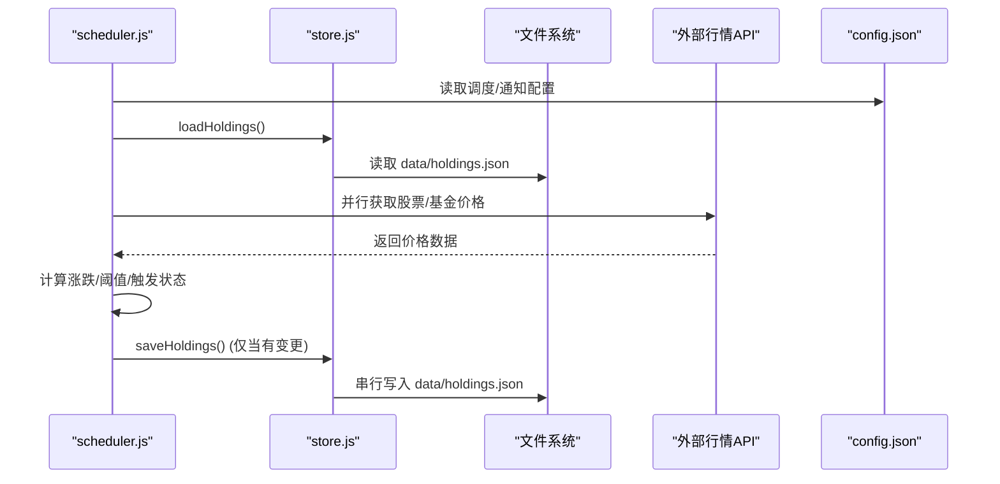
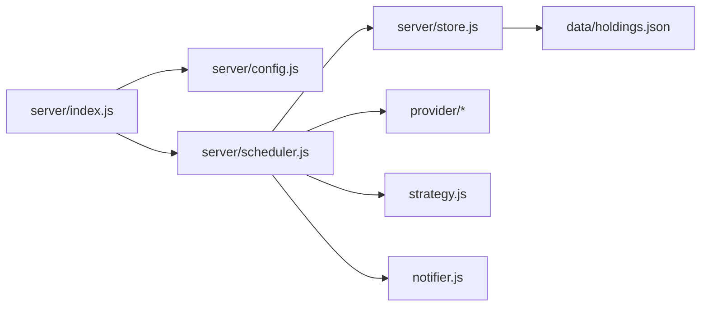

# 备份恢复

<cite>
**本文引用的文件**
- [config.json](file://config.json)
- [server/config.js](file://server/config.js)
- [server/store.js](file://server/store.js)
- [server/scheduler.js](file://server/scheduler.js)
- [server/index.js](file://server/index.js)
- [data/holdings.json](file://data/holdings.json)
- [data/买入-卖出记录 - Sheet1.csv](file://data/买入-卖出记录 - Sheet1.csv)
- [start.sh](file://start.sh)
- [package.json](file://package.json)
</cite>

## 目录
1. [简介](#简介)
2. [项目结构](#项目结构)
3. [核心组件](#核心组件)
4. [架构总览](#架构总览)
5. [详细组件分析](#详细组件分析)
6. [依赖关系分析](#依赖关系分析)
7. [性能考量](#性能考量)
8. [故障排查指南](#故障排查指南)
9. [结论](#结论)
10. [附录：自动化脚本与恢复测试](#附录自动化脚本与恢复测试)

## 简介
本指南面向 Stock Advisor（股票秘书）项目的数据备份与恢复，覆盖持仓数据、交易记录与配置文件的备份范围；提供定时备份、增量备份、异地备份的实现方案；说明完全恢复、部分恢复与数据验证流程；制定灾难恢复计划（含故障场景、恢复优先级、RTO/RPO目标）；并给出备份数据安全存储与自动化脚本、恢复测试流程建议。

## 项目结构
Stock Advisor 的核心数据与运行逻辑集中在以下位置：
- 配置文件：根目录 config.json，由 server/config.js 加载
- 持久化数据：data/holdings.json（持仓主数据），data/买入-卖出记录 - Sheet1.csv（交易流水）
- 运行时调度与写入：server/scheduler.js 定时刷新行情并写回 holdings.json；server/store.js 负责读写并发控制与迁移
- 启动入口：server/index.js 启动 Web 服务与调度器；start.sh 提供一键启动

图表来源
- [server/index.js:1-17](file://server/index.js#L1-L17)
- [server/scheduler.js:1-178](file://server/scheduler.js#L1-L178)
- [server/store.js:1-71](file://server/store.js#L1-L71)
- [data/holdings.json:1-462](file://data/holdings.json#L1-L462)
- [data/买入-卖出记录 - Sheet1.csv:1-26](file://data/买入-卖出记录 - Sheet1.csv#L1-L26)
- [config.json:1-19](file://config.json#L1-L19)

章节来源
- [server/index.js:1-17](file://server/index.js#L1-L17)
- [start.sh:1-100](file://start.sh#L1-L100)
- [server/scheduler.js:1-178](file://server/scheduler.js#L1-L178)
- [server/store.js:1-71](file://server/store.js#L1-L71)
- [data/holdings.json:1-462](file://data/holdings.json#L1-L462)
- [data/买入-卖出记录 - Sheet1.csv:1-26](file://data/买入-卖出记录 - Sheet1.csv#L1-L26)
- [config.json:1-19](file://config.json#L1-L19)

## 核心组件
- 配置管理：server/config.js 读取 config.json，包含调度间隔、通知冷却等参数
- 数据存储：server/store.js 维护内存缓存与串行写盘，处理旧版数据结构迁移，确保并发安全
- 调度引擎：server/scheduler.js 根据市场时段选择刷新频率，拉取行情、评估策略、触发提醒，并在有变更时写回 holdings.json
- 启动脚本：start.sh 统一安装依赖、构建前端、启动后端与调度循环

章节来源
- [server/config.js:1-11](file://server/config.js#L1-L11)
- [server/store.js:1-71](file://server/store.js#L1-L71)
- [server/scheduler.js:1-178](file://server/scheduler.js#L1-L178)
- [start.sh:1-100](file://start.sh#L1-L100)

## 架构总览
Stock Advisor 的数据流围绕“行情抓取 → 策略评估 → 状态更新 → 持久化”展开。备份与恢复应围绕该链路中的关键落盘点（holdings.json）与输入源（CSV）进行设计。

图表来源
- [server/scheduler.js:65-165](file://server/scheduler.js#L65-L165)
- [server/store.js:40-71](file://server/store.js#L40-L71)
- [config.json:1-19](file://config.json#L1-L19)

## 详细组件分析

### 数据备份范围
- 持仓数据：data/holdings.json，包含多市场持仓、多次买入记录、当前价、策略状态、触发时间戳等
- 交易记录：data/买入-卖出记录 - Sheet1.csv，作为历史交易流水的补充来源
- 配置文件：config.json，包含调度间隔、飞书Webhook、通知冷却等运行参数

章节来源
- [data/holdings.json:1-462](file://data/holdings.json#L1-L462)
- [data/买入-卖出记录 - Sheet1.csv:1-26](file://data/买入-卖出记录 - Sheet1.csv#L1-L26)
- [config.json:1-19](file://config.json#L1-L19)

### 备份方案设计

#### 定时备份
- 目标：按固定周期对 holdings.json 与 CSV 做快照备份，保留最近若干份
- 建议实现：使用系统级 cron 或 systemd timer 调用备份脚本；或在 start.sh 中增加子命令执行备份
- 注意事项：
  - 避免在 scheduler 高频写盘期间立即备份导致不一致，建议在保存完成后延迟数秒再拷贝
  - 结合 store.js 的串行写链，可在每次 saveHoldings 成功后触发一次轻量增量备份（见下文）

章节来源
- [server/store.js:62-71](file://server/store.js#L62-L71)
- [server/scheduler.js:167-178](file://server/scheduler.js#L167-L178)
- [start.sh:1-100](file://start.sh#L1-L100)

#### 增量备份
- 基于文件修改时间（mtime）判断是否变化，仅对变更文件生成增量快照
- 可结合 store.js 的 cacheMtime 机制，在每次成功写盘后记录 mtime，用于比对
- 建议：为每次增量备份附加校验和（如 sha256），便于后续完整性校验

章节来源
- [server/store.js:14-22](file://server/store.js#L14-L22)
- [server/store.js:62-71](file://server/store.js#L62-L71)

#### 异地备份
- 将本地备份同步至远程对象存储（如 OSS/S3）或另一台服务器
- 传输方式：rsync/scp + SSH 密钥；或使用云厂商 CLI 工具
- 建议：开启传输加密（SSH/HTTPS）、访问控制（最小权限账号）、失败重试与告警

[本节为通用实践说明，不直接分析具体代码文件]

### 数据恢复流程

#### 完全恢复
- 步骤：
  1) 停止服务（防止继续写入）
  2) 替换 data/holdings.json 与 CSV 为最新备份
  3) 校验 JSON 格式与字段完整性
  4) 重启服务，观察调度日志确认正常
- 风险：若备份时间点与服务停机存在间隙，可能丢失少量数据

章节来源
- [server/store.js:40-59](file://server/store.js#L40-L59)
- [server/scheduler.js:167-178](file://server/scheduler.js#L167-L178)

#### 部分恢复
- 针对单条或多条持仓记录的恢复：从备份中提取对应 id 的记录，合并到当前 holdings.json
- 注意：需保持 purchases 数组结构一致，避免破坏迁移后的模型

章节来源
- [server/store.js:24-38](file://server/store.js#L24-L38)
- [data/holdings.json:1-462](file://data/holdings.json#L1-L462)

#### 数据验证
- JSON 合法性校验：解析 holdings.json 无报错
- 业务字段校验：id、name、code、region、type、purchases 数组、数值字段类型
- 一致性校验：对比备份与恢复后的哈希值；核对 lastUpdated、triggerState 等关键字段

章节来源
- [server/store.js:40-59](file://server/store.js#L40-L59)
- [data/holdings.json:1-462](file://data/holdings.json#L1-L462)

### 灾难恢复计划

#### 故障场景分析
- 磁盘损坏/误删：通过异地备份恢复
- 进程崩溃/异常退出：重启服务并检查 holdings.json 完整性
- 网络中断导致行情缺失：调度器已具备降级与错误捕获，无需回滚数据
- 配置错误：回滚 config.json 至上一版本并重启

章节来源
- [server/scheduler.js:77-86](file://server/scheduler.js#L77-L86)
- [server/store.js:62-71](file://server/store.js#L62-L71)
- [config.json:1-19](file://config.json#L1-L19)

#### 恢复优先级
- P0：holdings.json（核心持仓数据）
- P1：CSV 交易流水（辅助追溯）
- P2：config.json（运行参数）

#### RTO/RPO 目标
- RPO（最大可接受数据丢失量）：建议 ≤ 1 次调度周期（约 20–300 秒，依据交易时段）
- RTO（恢复时间目标）：建议 ≤ 5 分钟（含校验与重启）

[本节为通用规划说明，不直接分析具体代码文件]

### 备份数据安全存储
- 传输加密：使用 SSH/HTTPS 通道进行异地同步
- 访问控制：最小权限原则，限制备份目录/桶的读写主体
- 完整性校验：对每个备份文件计算并保存哈希值（如 sha256sum），恢复前校验一致
- 敏感信息：config.json 中的飞书 secret 等敏感字段建议单独保管，不在备份中明文暴露

[本节为通用安全实践说明，不直接分析具体代码文件]

## 依赖关系分析
- server/index.js 依赖 server/config.js、server/scheduler.js、server/server.js
- server/scheduler.js 依赖 server/store.js、provider/tencent.js、provider/fund.js、strategy.js、notifier.js
- server/store.js 依赖 Node fs/promises，操作 data/holdings.json
- start.sh 驱动 npm scripts，最终调用 node server/index.js

图表来源
- [server/index.js:1-17](file://server/index.js#L1-L17)
- [server/scheduler.js:1-178](file://server/scheduler.js#L1-L178)
- [server/store.js:1-71](file://server/store.js#L1-L71)

章节来源
- [server/index.js:1-17](file://server/index.js#L1-L17)
- [server/scheduler.js:1-178](file://server/scheduler.js#L1-L178)
- [server/store.js:1-71](file://server/store.js#L1-L71)

## 性能考量
- 写盘串行化：store.js 通过 Promise 链串行写入，避免并发覆盖，降低锁竞争
- 交易时段降频：scheduler.js 在非交易时段拉长刷新间隔，减少 IO 与网络压力
- 增量备份：仅在文件 mtime 变化时生成新备份，降低存储与带宽占用

章节来源
- [server/store.js:62-71](file://server/store.js#L62-L71)
- [server/scheduler.js:58-63](file://server/scheduler.js#L58-L63)

## 故障排查指南
- 行情抓取失败：scheduler.js 对 provider 调用做了 try/catch 并记录错误日志，不影响整体调度
- 写盘失败：store.js 捕获写入异常并输出错误日志，可通过日志定位磁盘或权限问题
- 配置加载失败：check config.json 语法与路径，确保 server/config.js 能正确读取

章节来源
- [server/scheduler.js:77-86](file://server/scheduler.js#L77-L86)
- [server/store.js:62-71](file://server/store.js#L62-L71)
- [server/config.js:7-10](file://server/config.js#L7-L10)

## 结论
Stock Advisor 的数据以 holdings.json 为核心，配合 CSV 交易流水与 config.json 配置，形成完整的数据闭环。通过定时备份、增量备份与异地备份组合，可实现低 RPO/RTO 的恢复能力；结合严格的校验与安全存储措施，保障数据可用性与机密性。建议在现有 start.sh 基础上扩展备份与恢复子命令，形成标准化运维流程。

## 附录：自动化脚本与恢复测试

### 自动化备份脚本建议
- 功能要点：
  - 复制 data/holdings.json 与 CSV 到带时间戳的备份目录
  - 计算并保存 sha256 校验和
  - 可选：同步至远端存储（rsync/scp）
  - 失败时记录日志并发送告警（可复用 notifier 模块思路）
- 触发方式：
  - 系统 cron（每 N 分钟）
  - 在 start.sh 中新增 backup 子命令，供手动或定时调用

[本节为实施建议，不直接分析具体代码文件]

### 恢复测试流程
- 准备：
  - 选取一份有效备份（含 holdings.json 与 CSV）
  - 记录当前服务的 PID 或端口
- 步骤：
  1) 停止服务（避免写入）
  2) 替换 data/holdings.json 与 CSV 为备份文件
  3) 校验 JSON 与哈希
  4) 重启服务，观察调度日志与前端展示
  5) 抽样核对关键持仓与交易记录
- 预期结果：
  - 服务正常启动，调度器按配置间隔运行
  - holdings.json 内容与备份一致，lastUpdated 合理
  - 前端显示与预期一致

[本节为通用测试流程说明，不直接分析具体代码文件]