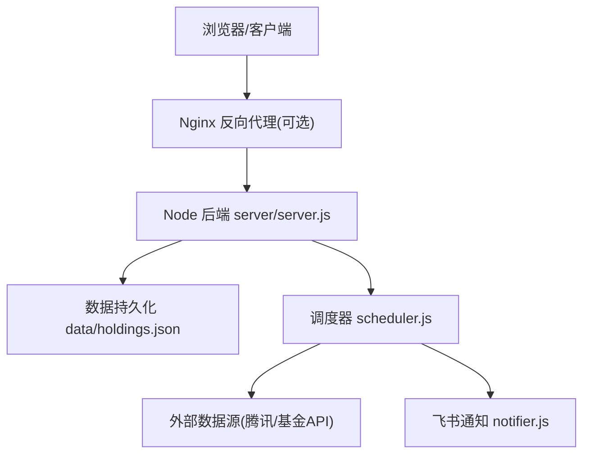
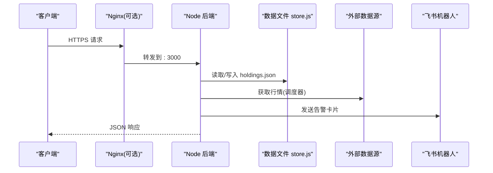
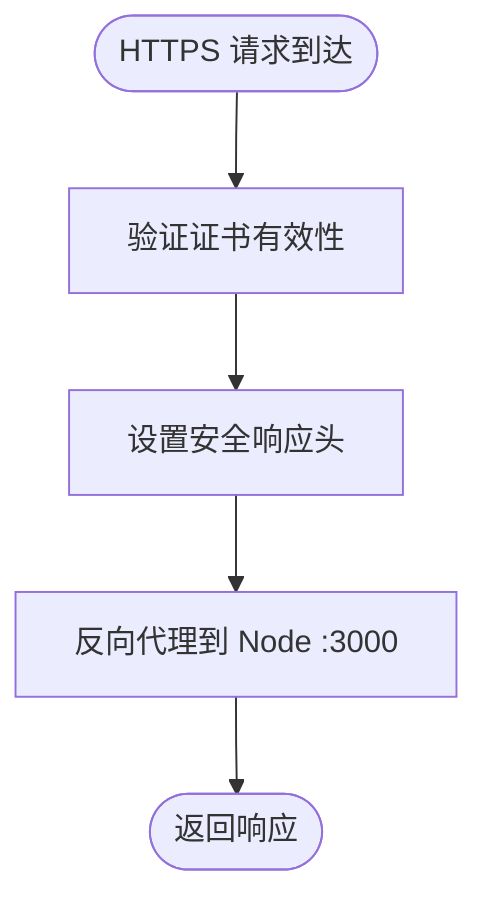
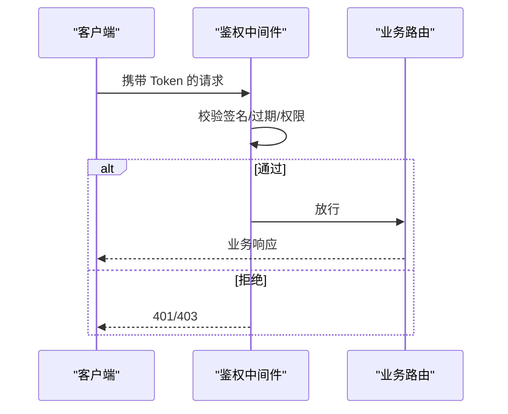
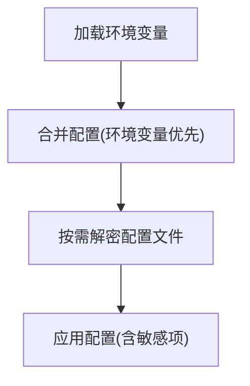
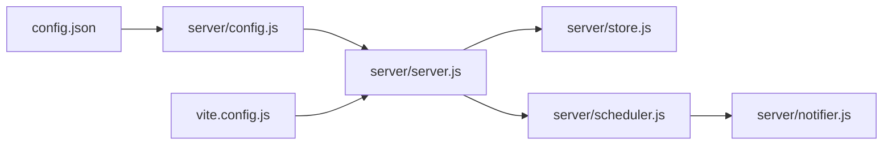

# 安全加固

<cite>
**本文引用的文件**
- [server/server.js](file://server/server.js)
- [server/index.js](file://server/index.js)
- [server/config.js](file://server/config.js)
- [config.json](file://config.json)
- [server/notifier.js](file://server/notifier.js)
- [server/store.js](file://server/store.js)
- [vite.config.js](file://vite.config.js)
- [start.sh](file://start.sh)
- [.gitignore](file://.gitignore)
- [package.json](file://package.json)
</cite>

## 目录
1. [简介](#简介)
2. [项目结构](#项目结构)
3. [核心组件](#核心组件)
4. [架构总览](#架构总览)
5. [详细组件分析](#详细组件分析)
6. [依赖关系分析](#依赖关系分析)
7. [性能与安全权衡](#性能与安全权衡)
8. [故障排查指南](#故障排查指南)
9. [结论](#结论)
10. [附录：实施清单与参考路径](#附录实施清单与参考路径)

## 简介
本指南面向 Stock Advisor（股票秘书）项目的生产部署与运行，目标是提供一套可落地的安全加固方案。内容覆盖 HTTPS 配置、访问控制、敏感信息保护、网络安全措施、安全最佳实践以及事件响应与合规要求。文档基于仓库现有代码进行分析，并给出在现有基础上的增强建议与落地步骤。

## 项目结构
Stock Advisor 由 Node.js 后端服务与 Vue 前端组成：
- 后端通过原生 http 模块提供静态页面托管与 REST API，数据持久化到本地 JSON 文件。
- 前端使用 Vite 构建，开发时通过代理将 /api 请求转发到后端。
- 调度器定时抓取行情、评估策略并通过飞书机器人推送告警。

**图示来源**
- [server/server.js:567-593](file://server/server.js#L567-L593)
- [server/scheduler.js:65-177](file://server/scheduler.js#L65-L177)
- [server/notifier.js:80-111](file://server/notifier.js#L80-L111)
- [server/store.js:40-70](file://server/store.js#L40-L70)

**章节来源**
- [server/server.js:1-594](file://server/server.js#L1-L594)
- [vite.config.js:1-25](file://vite.config.js#L1-L25)
- [start.sh:1-100](file://start.sh#L1-L100)

## 核心组件
- HTTP 服务与路由：server/server.js 暴露 /api/* 接口与静态资源托管。
- 配置加载：server/config.js 读取 config.json。
- 数据存储：server/store.js 读写 data/holdings.json，内存缓存并发写串行化。
- 调度与通知：scheduler.js 定时拉取行情并调用 notifier.js 发送飞书卡片消息。
- 启动入口：server/index.js 加载配置、启动服务与调度。

当前实现的安全现状要点：
- 未内置身份认证与授权机制，所有 /api/* 接口对任意来源开放。
- 未设置 CORS、安全头或速率限制。
- 敏感信息（如飞书 webhook、secret）以明文存储在 config.json。
- 仅支持 HTTP 监听，未启用 TLS。

**章节来源**
- [server/server.js:409-565](file://server/server.js#L409-L565)
- [server/config.js:7-10](file://server/config.js#L7-L10)
- [server/store.js:40-70](file://server/store.js#L40-L70)
- [server/notifier.js:80-111](file://server/notifier.js#L80-L111)
- [server/index.js:1-17](file://server/index.js#L1-L17)

## 架构总览
下图展示从客户端到后端、存储与外部服务的交互流程，标注了需要加固的关键点。

**图示来源**
- [server/server.js:567-593](file://server/server.js#L567-L593)
- [server/store.js:40-70](file://server/store.js#L40-L70)
- [server/notifier.js:80-111](file://server/notifier.js#L80-L111)

## 详细组件分析

### HTTPS 与 Nginx 反向代理
目标：为服务提供加密传输、强制 HTTPS、安全头与证书管理。

- 证书获取与续期
  - 使用 Let's Encrypt 自动签发与续期（certbot）。
  - 将证书放置于受保护的目录，仅服务账户可读。
- Nginx 反向代理
  - 监听 443 端口，终止 TLS，并将 /api 与静态资源转发至后端 :3000。
  - 开启 HSTS、HTTP 到 HTTPS 重定向。
  - 限制协议版本与密码套件，禁用不安全算法。
- 安全头
  - Content-Security-Policy、X-Frame-Options、X-Content-Type-Options、Referrer-Policy、Permissions-Policy 等。
- 日志与审计
  - 记录访问日志与错误日志，定期轮转与脱敏。

[本节为概念性说明，不直接映射具体源码]

### 访问控制机制（身份认证、权限管理、API 访问限制）
当前状态：无鉴权、无 CORS、无 IP 白名单、无速率限制。

建议增强：
- 统一鉴权中间件
  - 基于 Token（JWT）或会话的认证；对 /api/* 强制校验。
  - 角色与权限模型：管理员、普通用户、只读访客。
- 最小权限原则
  - 仅允许必要字段更新；服务端严格校验输入类型与范围。
- 访问限制
  - 基于 IP 的白名单/黑名单。
  - 速率限制：按 IP/用户维度限流，防止滥用。
- CORS 策略
  - 仅允许可信域名；禁止通配符；明确允许的头部与方法。
- 审计日志
  - 记录认证失败、越权尝试、异常操作。

[本节为概念性说明，不直接映射具体源码]

### 敏感信息保护（配置文件加密、环境变量、密钥轮换）
当前状态：config.json 包含飞书 webhook 与 secret，明文存储且随仓库提交风险较高。

建议增强：
- 环境变量注入
  - 将 FEISHU_WEBHOOK、FEISHU_SECRET 等敏感项放入环境变量，避免写入 config.json。
  - 在 server/index.js 中优先读取环境变量，再回退到配置文件。
- 配置文件加密
  - 使用 KMS 或本地加密工具（如 sops、age）加密配置文件，运行时解密。
- 密钥轮换
  - 制定轮换周期与灰度切换流程；保留旧密钥兼容窗口。
- 最小可见性
  - 仅运维与服务进程可读取密钥；日志中脱敏输出。

**章节来源**
- [config.json:1-19](file://config.json#L1-L19)
- [server/config.js:7-10](file://server/config.js#L7-L10)
- [server/notifier.js:80-111](file://server/notifier.js#L80-L111)

### 网络安全措施（防火墙、DDoS 防护、安全扫描）
- 防火墙
  - 仅开放 80/443；内网管理端口限制来源 IP。
  - 出站连接限制：仅允许必要的对外 API（腾讯财经、东方财富、飞书）。
- DDoS 防护
  - 使用云厂商 WAF/CDN 进行清洗；配置连接数与请求速率上限。
  - 针对 /api/import-csv 等大载荷接口增加大小限制与频率限制。
- 安全扫描
  - 依赖漏洞扫描（npm audit）、镜像扫描、容器扫描。
  - 代码安全扫描（SAST/DAST），纳入 CI 流水线。

[本节为通用安全建议，不直接映射具体源码]

### 安全最佳实践（代码审计、依赖漏洞扫描、安全更新）
- 代码安全审计
  - 重点审查输入校验、序列化/反序列化、路径遍历、命令执行风险。
  - 对 CSV 导入、JSON 解析等边界场景加强校验与错误处理。
- 依赖管理
  - 定期运行依赖漏洞扫描，及时升级关键包。
  - 锁定依赖版本，减少供应链风险。
- 安全更新策略
  - 建立补丁发布流程；灰度发布与回滚预案。
  - 监控第三方库公告，快速响应高危漏洞。

[本节为通用安全建议，不直接映射具体源码]

### 安全事件响应流程与合规性
- 事件分级与响应
  - 定义事件等级（低/中/高/严重），规定响应时限与升级路径。
  - 建立应急小组与沟通渠道。
- 取证与留存
  - 保存访问日志、错误日志、系统快照；确保不可篡改。
- 合规要求
  - 遵循最小必要原则收集与处理数据；对用户数据进行脱敏与加密。
  - 满足相关隐私与数据安全法规要求（如个人信息保护）。

[本节为通用安全建议，不直接映射具体源码]

## 依赖关系分析
- 后端服务依赖
  - 配置加载：server/config.js -> config.json
  - 数据存储：server/store.js -> data/holdings.json
  - 外部通信：server/notifier.js -> 飞书 Webhook
  - 调度任务：server/scheduler.js -> 外部行情 API
- 前端与开发
  - vite.config.js 将 /api 代理到后端 :3000，便于开发联调。

**图示来源**
- [server/config.js:7-10](file://server/config.js#L7-L10)
- [server/server.js:567-593](file://server/server.js#L567-L593)
- [server/store.js:40-70](file://server/store.js#L40-L70)
- [server/scheduler.js:65-177](file://server/scheduler.js#L65-L177)
- [server/notifier.js:80-111](file://server/notifier.js#L80-L111)
- [vite.config.js:14-24](file://vite.config.js#L14-L24)

**章节来源**
- [package.json:1-32](file://package.json#L1-L32)
- [vite.config.js:1-25](file://vite.config.js#L1-L25)

## 性能与安全权衡
- 鉴权开销
  - 引入 JWT 校验会增加 CPU 与内存消耗；可通过缓存与短令牌降低影响。
- 速率限制
  - 对高频接口（如 /api/import-csv）设置合理阈值，避免资源耗尽。
- 日志与审计
  - 详细日志有助于排障，但需平衡磁盘 I/O 与隐私脱敏。
- 加密与解密
  - 配置文件解密应在启动阶段完成，避免每次请求解密带来的延迟。

[本节为通用讨论，不直接映射具体源码]

## 故障排查指南
- 常见问题定位
  - 配置加载失败：检查 config.json 格式与权限。
  - 数据写入冲突：store.js 已串行化写盘，若仍出现覆盖问题，检查并发写入逻辑。
  - 飞书推送失败：检查 webhook 与 secret 是否正确，查看重试与错误日志。
- 日志与调试
  - 后端错误日志集中在 server/server.js 的 catch 分支。
  - 调度器错误日志在 scheduler.js 的 catch 分支。
  - 建议接入结构化日志与集中式日志平台。

**章节来源**
- [server/server.js:571-586](file://server/server.js#L571-L586)
- [server/scheduler.js:65-177](file://server/scheduler.js#L65-L177)
- [server/notifier.js:96-111](file://server/notifier.js#L96-L111)
- [server/store.js:62-70](file://server/store.js#L62-L70)

## 结论
当前 Stock Advisor 具备基本的数据管理与通知能力，但在传输安全、访问控制、敏感信息管理等方面存在明显短板。建议优先实施 HTTPS、鉴权与敏感信息外置化，随后逐步完善速率限制、安全头、日志审计与合规流程。通过分层加固与持续改进，可在不影响核心功能的前提下显著提升系统安全性与可维护性。

## 附录：实施清单与参考路径
- HTTPS 与 Nginx
  - 证书管理：certbot 自动化续期
  - 安全头：HSTS、CSP、X-Frame-Options 等
  - 参考：[server/server.js:567-593](file://server/server.js#L567-L593)
- 访问控制
  - 鉴权中间件、角色权限、CORS、速率限制
  - 参考：[server/server.js:409-565](file://server/server.js#L409-L565)
- 敏感信息保护
  - 环境变量注入、配置文件加密、密钥轮换
  - 参考：[config.json:1-19](file://config.json#L1-L19)、[server/config.js:7-10](file://server/config.js#L7-L10)、[server/notifier.js:80-111](file://server/notifier.js#L80-L111)
- 网络安全
  - 防火墙规则、WAF/CDN、依赖漏洞扫描
  - 参考：[package.json:19-30](file://package.json#L19-L30)
- 事件响应与合规
  - 事件分级、取证留存、隐私合规
  - 参考：[server/store.js:40-70](file://server/store.js#L40-L70)