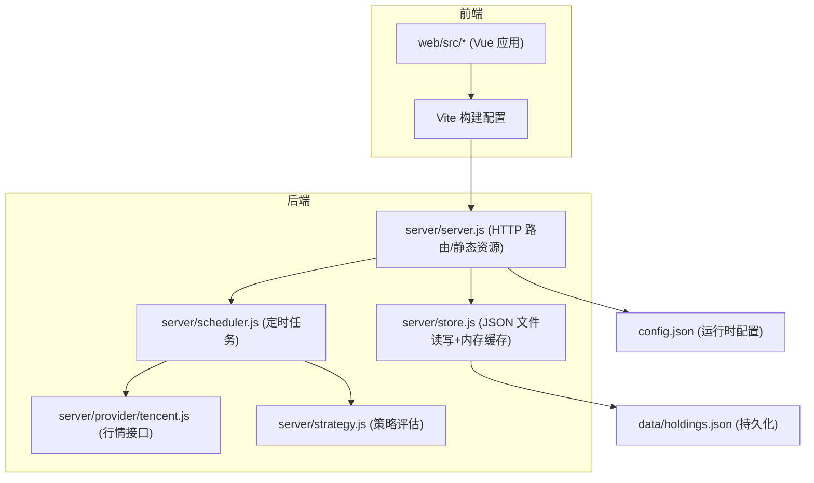
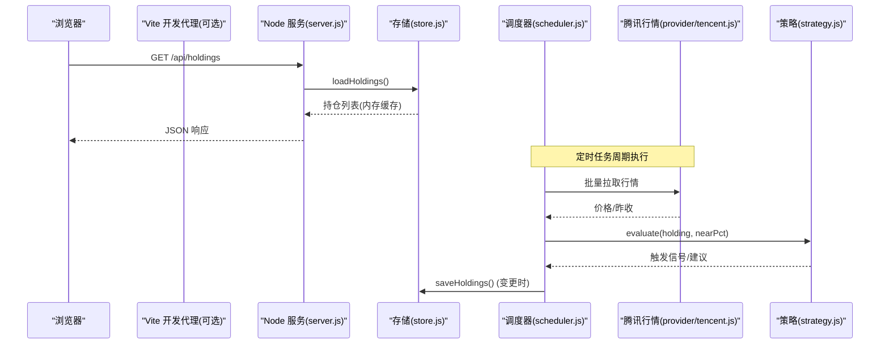
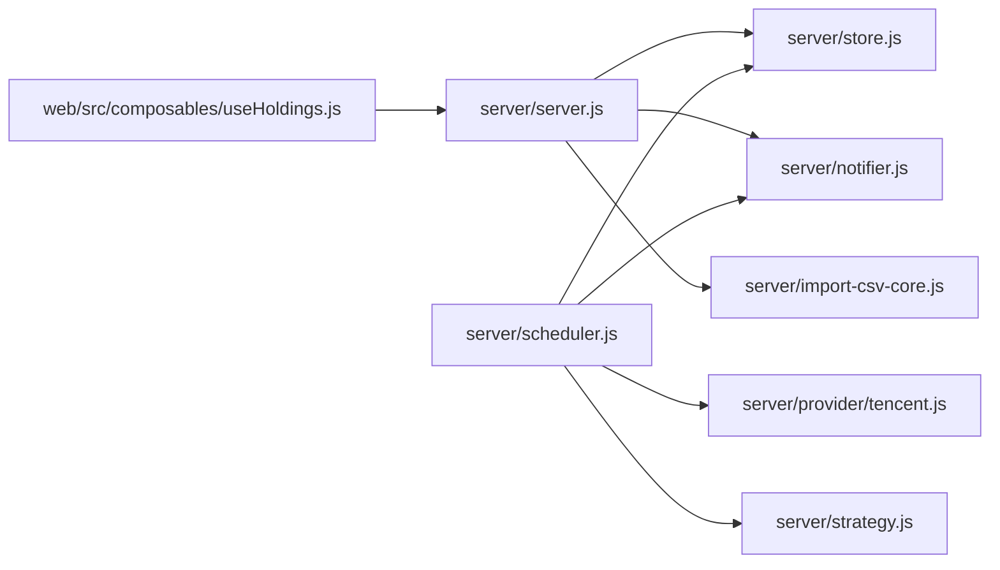

# 性能优化

<cite>
**本文引用的文件**
- [package.json](file://package.json)
- [vite.config.js](file://vite.config.js)
- [server/index.js](file://server/index.js)
- [server/server.js](file://server/server.js)
- [server/store.js](file://server/store.js)
- [server/scheduler.js](file://server/scheduler.js)
- [server/strategy.js](file://server/strategy.js)
- [server/provider/tencent.js](file://server/provider/tencent.js)
- [web/src/main.js](file://web/src/main.js)
- [web/src/App.vue](file://web/src/App.vue)
- [web/src/composables/useHoldings.js](file://web/src/composables/useHoldings.js)
- [config.json](file://config.json)
- [tailwind.config.js](file://tailwind.config.js)
</cite>

## 目录
1. [简介](#简介)
2. [项目结构](#项目结构)
3. [核心组件](#核心组件)
4. [架构总览](#架构总览)
5. [详细组件分析](#详细组件分析)
6. [依赖关系分析](#依赖关系分析)
7. [性能考量与优化建议](#性能考量与优化建议)
8. [故障排查指南](#故障排查指南)
9. [结论](#结论)
10. [附录：基准测试与监控方案](#附录：基准测试与监控方案)

## 简介
本指南面向 Stock Advisor（股票秘书）项目的性能优化，覆盖前端构建与资源、后端 Node.js 进程与内存、数据库（本地 JSON）读写、网络请求与缓存策略、以及指标采集与容量规划。文档基于仓库现有实现进行分析，并给出可落地的优化步骤与效果对比方法。

## 项目结构
Stock Advisor 采用前后端同仓部署：
- 前端：Vue 3 + Vite，源码位于 web/，构建产物输出到 dist/，由后端统一托管静态资源。
- 后端：原生 Node http 服务，提供 REST API 与静态资源托管；数据持久化在 data/holdings.json，通过内存缓存减少磁盘 IO。
- 调度器：定时拉取行情、评估策略、推送通知。

图表来源
- [vite.config.js:7-25](file://vite.config.js#L7-L25)
- [server/server.js:18-53](file://server/server.js#L18-L53)
- [server/store.js:40-70](file://server/store.js#L40-L70)
- [server/scheduler.js:65-177](file://server/scheduler.js#L65-L177)
- [server/provider/tencent.js:6-41](file://server/provider/tencent.js#L6-L41)
- [server/strategy.js:34-90](file://server/strategy.js#L34-L90)
- [config.json:1-19](file://config.json#L1-L19)

章节来源
- [vite.config.js:7-25](file://vite.config.js#L7-L25)
- [server/server.js:18-53](file://server/server.js#L18-L53)
- [server/store.js:40-70](file://server/store.js#L40-L70)
- [server/scheduler.js:65-177](file://server/scheduler.js#L65-L177)
- [server/provider/tencent.js:6-41](file://server/provider/tencent.js#L6-L41)
- [server/strategy.js:34-90](file://server/strategy.js#L34-L90)
- [config.json:1-19](file://config.json#L1-L19)

## 核心组件
- 前端入口与状态管理：main.js 挂载 Vue 应用；App.vue 组织页面与弹窗；useHoldings.js 封装数据获取、自动刷新与写操作。
- 后端 HTTP 服务：server.js 负责静态资源托管与 /api 路由分发；store.js 提供带内存缓存的 JSON 读写；scheduler.js 定时拉取行情并评估策略；provider/tencent.js 批量拉取行情；strategy.js 计算买卖信号。
- 配置：config.json 控制调度间隔、服务器端口、飞书通知等。

章节来源
- [web/src/main.js:1-6](file://web/src/main.js#L1-L6)
- [web/src/App.vue:1-197](file://web/src/App.vue#L1-L197)
- [web/src/composables/useHoldings.js:1-154](file://web/src/composables/useHoldings.js#L1-L154)
- [server/server.js:567-593](file://server/server.js#L567-L593)
- [server/store.js:40-70](file://server/store.js#L40-L70)
- [server/scheduler.js:167-177](file://server/scheduler.js#L167-L177)
- [server/provider/tencent.js:6-41](file://server/provider/tencent.js#L6-L41)
- [server/strategy.js:34-90](file://server/strategy.js#L34-L90)
- [config.json:1-19](file://config.json#L1-L19)

## 架构总览
下图展示了从浏览器发起请求到后端处理、数据读写、外部行情拉取与策略评估的完整链路。

图表来源
- [server/server.js:409-565](file://server/server.js#L409-L565)
- [server/store.js:40-70](file://server/store.js#L40-L70)
- [server/scheduler.js:65-177](file://server/scheduler.js#L65-L177)
- [server/provider/tencent.js:6-41](file://server/provider/tencent.js#L6-L41)
- [server/strategy.js:34-90](file://server/strategy.js#L34-L90)

## 详细组件分析

### 前端性能优化（Vite 构建、静态资源压缩、缓存策略）
- 构建目标与路径
  - root 指向 web/，构建产物输出到 ../dist，便于后端统一托管静态资源。
  - 开发环境通过 proxy 将 /api 转发至本地后端，避免跨域问题。
- 构建优化建议
  - 启用生产模式构建（默认已开启），利用 Vite 内置代码分割与 Tree-shaking。
  - 针对 Tailwind/DaisyUI 的按需生成已在 tailwind.config.js 中配置 content 范围，减少 CSS 体积。
  - 建议在构建后对静态资源进行 gzip/brotli 压缩并在 Nginx/CDN 层开启压缩与缓存头（见“网络性能优化”）。
- 缓存策略建议
  - 为静态资源设置长期缓存（如一年），配合文件名哈希（Vite 默认行为）实现增量更新。
  - HTML 不缓存或短缓存，确保用户始终加载最新入口。
  - 开发阶段使用 Vite 热更新，生产阶段通过 CDN 缓存提升首屏速度。

章节来源
- [vite.config.js:7-25](file://vite.config.js#L7-L25)
- [tailwind.config.js:4-12](file://tailwind.config.js#L4-L12)
- [package.json:7-13](file://package.json#L7-L13)

### 后端性能调优（Node.js 进程、内存管理、查询优化）
- 进程与启动
  - 入口 server/index.js 加载配置并启动服务与调度器；支持一次性运行模式（ONCE 环境变量）。
  - 生产环境建议使用 PM2 多进程模式以利用多核 CPU，并通过集群模式提高并发能力。
- 内存管理
  - store.js 使用内存缓存与串行写盘，避免频繁 IO；注意大对象（大量买入/卖出记录）可能增加内存占用，需定期评估。
  - 可通过 Node 堆快照工具定位潜在泄漏；结合日志观察 RSS/HeapUsed 趋势。
- 查询与数据处理
  - 读取：loadHoldings 仅在首次或文件 mtime 变化时读盘，其余走内存缓存，降低磁盘压力。
  - 写入：saveHoldings 使用 Promise 链串行化，防止并发写冲突；但高并发下仍可能成为瓶颈，可考虑引入轻量级队列或 WAL。
  - 策略评估：strategy.js 对每次 tick 遍历持仓并计算加权阈值，复杂度 O(N)，在持仓规模增长时需关注 CPU 占用。

章节来源
- [server/index.js:1-17](file://server/index.js#L1-L17)
- [server/store.js:40-70](file://server/store.js#L40-L70)
- [server/scheduler.js:65-177](file://server/scheduler.js#L65-L177)
- [server/strategy.js:34-90](file://server/strategy.js#L34-L90)

### 网络性能优化（API 响应、连接池、CDN 加速）
- API 响应优化
  - /api/holdings 返回聚合后的衍生字段，减少前端计算；保持响应体精简，避免冗余字段。
  - 对于高频轮询，可在服务端加入 ETag/Last-Modified 或基于时间戳的幂等校验，减少无效传输。
- 外部请求优化
  - 腾讯行情接口采用批量拉取（codes.join(',')），显著减少请求数；建议在 scheduler.js 中对失败重试与超时做增强。
  - 可引入本地缓存（如 Redis）暂存行情结果，缩短后续请求延迟。
- CDN 与静态资源
  - 将 dist/ 静态资源部署到 CDN，开启 gzip/brotli 与长缓存；HTML 短缓存或无缓存。
  - 域名分片与预加载关键资源（如字体、首屏样式）可进一步提升首屏体验。

章节来源
- [server/server.js:409-565](file://server/server.js#L409-L565)
- [server/provider/tencent.js:6-41](file://server/provider/tencent.js#L6-L41)
- [server/scheduler.js:65-177](file://server/scheduler.js#L65-L177)

### 资源监控与分析（指标采集、瓶颈识别、容量规划）
- 指标采集
  - 在关键路径埋点：API 耗时、错误率、外部请求耗时与成功率、调度周期耗时。
  - 收集 Node 运行时指标：事件循环延迟、堆内存使用、GC 频率。
- 瓶颈识别
  - 若 /api/holdings 慢：检查 store.js 的磁盘 IO 与序列化开销；评估是否缓存热点数据。
  - 若调度器卡顿：检查 strategy.js 的计算复杂度与外部 API 延迟；必要时拆分任务或使用 Worker。
- 容量规划
  - 根据持仓数量与交易频率估算 CPU/内存需求；在高并发场景下考虑水平扩展（多实例+负载均衡）。
  - 对 JSON 文件进行分区或归档，避免单文件过大导致解析缓慢。

[本节为通用指导，不直接分析具体文件]

## 依赖关系分析
- 模块耦合
  - server.js 依赖 store.js、notifier.js、import-csv-core.js 等；scheduler.js 依赖 store.js、provider、strategy、notifier。
  - 前端 useHoldings.js 仅依赖后端 /api 接口，解耦良好。
- 外部依赖
  - 腾讯财经行情接口用于批量拉取价格；策略引擎依赖当前价与历史阈值。
- 循环依赖
  - 当前未发现循环依赖；模块职责清晰。

图表来源
- [server/server.js:1-8](file://server/server.js#L1-L8)
- [server/scheduler.js:1-5](file://server/scheduler.js#L1-L5)
- [web/src/composables/useHoldings.js:15-29](file://web/src/composables/useHoldings.js#L15-L29)

章节来源
- [server/server.js:1-8](file://server/server.js#L1-L8)
- [server/scheduler.js:1-5](file://server/scheduler.js#L1-L5)
- [web/src/composables/useHoldings.js:15-29](file://web/src/composables/useHoldings.js#L15-L29)

## 性能考量与优化建议

### 前端加载时间优化
- 构建产物
  - 使用生产构建（默认），确保 Tree-shaking 与代码分割生效。
  - 对 Tailwind/DaisyUI 的 content 范围精确匹配，减少无用 CSS。
- 资源缓存
  - 静态资源开启强缓存（文件名哈希），HTML 短缓存；CDN 层开启 gzip/brotli。
- 首屏优化
  - 关键 CSS 内联、懒加载非关键组件；图片使用现代格式与尺寸适配。
- 网络请求
  - 合并请求、减少重复 fetch；对 /api/holdings 增加条件请求（ETag/If-None-Match）以降低带宽。

章节来源
- [vite.config.js:7-25](file://vite.config.js#L7-L25)
- [tailwind.config.js:4-12](file://tailwind.config.js#L4-L12)
- [web/src/composables/useHoldings.js:15-29](file://web/src/composables/useHoldings.js#L15-L29)

### 内存泄漏修复与内存管理
- 内存缓存
  - store.js 使用内存缓存与 mtime 检测，避免重复读盘；注意大对象导致的内存增长。
- 定时器与事件
  - 前端 useHoldings.js 使用 setInterval 进行倒计时与刷新，需在组件卸载时清理（onUnmounted 中 stopAutoRefresh）。
- 诊断工具
  - 使用 Node --inspect 与 Chrome DevTools 进行堆快照对比，定位未释放引用。

章节来源
- [server/store.js:40-70](file://server/store.js#L40-L70)
- [web/src/App.vue:121-129](file://web/src/App.vue#L121-L129)
- [web/src/composables/useHoldings.js:35-50](file://web/src/composables/useHoldings.js#L35-L50)

### 并发处理能力提升
- 后端并发
  - 使用 PM2 多进程模式；对静态资源与 API 分别优化（Nginx 反向代理）。
  - 对 write 操作引入队列或锁机制，避免并发写冲突（当前已用 Promise 链串行化）。
- 外部请求
  - 对腾讯行情接口增加重试与超时控制；必要时引入本地缓存减少外部依赖延迟。
- 前端并发
  - 避免同时发起多个相同请求；使用防抖/节流减少不必要的刷新。

章节来源
- [server/store.js:61-70](file://server/store.js#L61-L70)
- [server/scheduler.js:65-177](file://server/scheduler.js#L65-L177)
- [server/provider/tencent.js:6-41](file://server/provider/tencent.js#L6-L41)

### 数据库查询优化（本地 JSON）
- 读优化
  - 利用内存缓存与 mtime 检测，减少磁盘 IO；对热点数据可进一步加内存二级缓存。
- 写优化
  - 串行写盘避免覆盖；对大批量写入可考虑批处理或异步队列。
- 数据模型
  - purchases/sells 数组增长会影响计算复杂度；可对历史数据进行归档或分页加载。

章节来源
- [server/store.js:40-70](file://server/store.js#L40-L70)
- [server/strategy.js:34-90](file://server/strategy.js#L34-L90)

### 网络性能优化（API、连接池、CDN）
- API 响应
  - 精简响应体；对 /api/holdings 增加条件请求支持。
- 连接池
  - 对频繁的外部 HTTP 请求使用连接复用（Node fetch 默认复用）；必要时引入专用客户端（如 axios）并配置连接池。
- CDN 加速
  - 静态资源上 CDN，开启压缩与长缓存；HTML 短缓存或无缓存。

章节来源
- [server/server.js:409-565](file://server/server.js#L409-L565)
- [server/provider/tencent.js:6-41](file://server/provider/tencent.js#L6-L41)

## 故障排查指南
- 常见问题
  - 行情拉取失败：检查 provider/tencent.js 的网络与编码解码逻辑；增加重试与降级策略。
  - 数据不同步：确认 store.js 的 mtime 检测与串行写盘是否正常；检查外部编辑是否导致重复重载。
  - 前端刷新异常：检查 useHoldings.js 的定时器清理与错误处理；确认后端 /api 路由可用。
- 日志与调试
  - 在后端关键路径添加耗时与错误日志；在前端捕获 fetch 错误并提示用户。
  - 使用浏览器 Network 面板与 Performance 面板分析加载与渲染瓶颈。

章节来源
- [server/provider/tencent.js:6-41](file://server/provider/tencent.js#L6-L41)
- [server/store.js:40-70](file://server/store.js#L40-L70)
- [web/src/composables/useHoldings.js:15-29](file://web/src/composables/useHoldings.js#L15-L29)

## 结论
Stock Advisor 的前后端架构清晰，具备较好的可扩展性。通过 Vite 构建优化、静态资源缓存、后端进程与内存管理、JSON 读写优化、外部请求缓存与 CDN 加速，可显著提升加载速度与系统稳定性。建议在生产环境引入 PM2 多进程、CDN 与监控体系，持续跟踪性能指标并迭代优化。

[本节为总结，不直接分析具体文件]

## 附录：基准测试与监控方案

### 前端性能基准
- Lighthouse 审计：评估首屏时间、可访问性、最佳实践与 SEO。
- WebPageTest：模拟真实网络与设备，分析瀑布图与关键渲染路径。
- 自定义指标：在 useHoldings.js 中记录 fetch 耗时与错误率，上报至监控系统。

### 后端性能基准
- 压测工具：使用 autocannon 或 wrk 对 /api/holdings 进行并发压测，观察吞吐与延迟分布。
- 内存与 CPU：使用 node --prof 与 heapdump 分析热点函数与内存增长。
- 调度器耗时：在 scheduler.js 的关键步骤记录耗时，评估外部 API 与策略计算的影响。

### 监控与告警
- 指标采集：API 耗时、错误率、外部请求成功率、调度周期耗时、内存/CPU 使用。
- 告警规则：当错误率或延迟超过阈值时触发告警；对行情接口失败进行快速恢复。
- 容量规划：根据负载曲线调整实例数量与资源配额，确保峰值时段稳定。

[本节为通用指导，不直接分析具体文件]