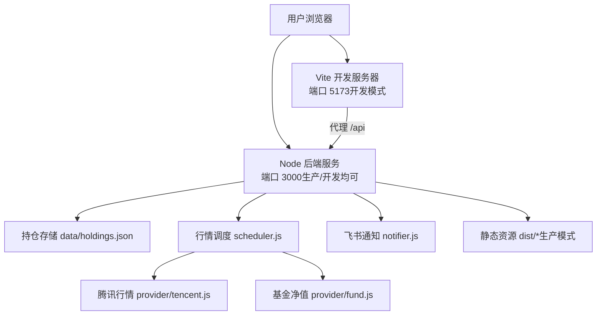
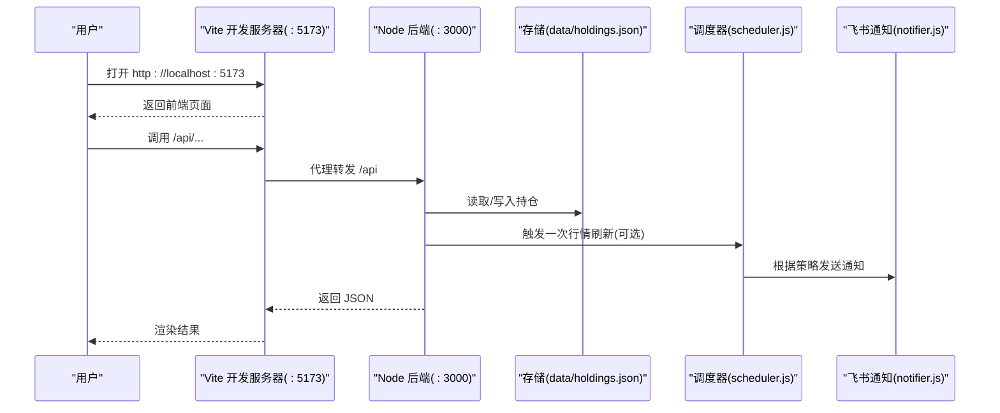
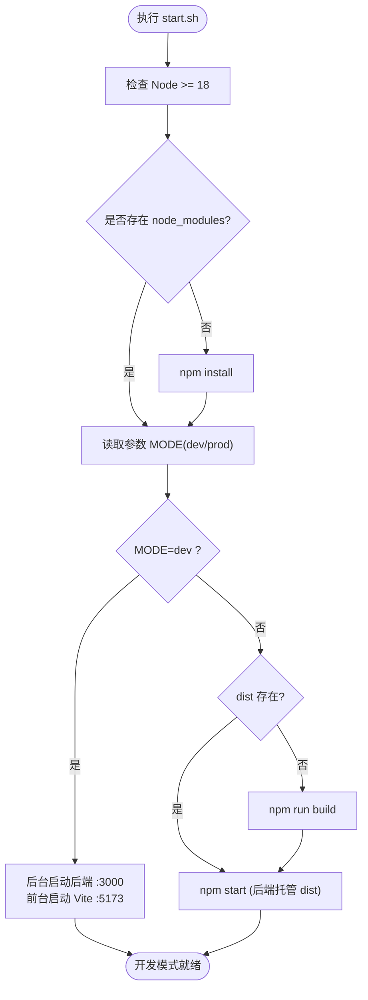
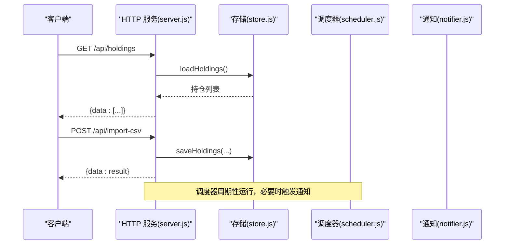
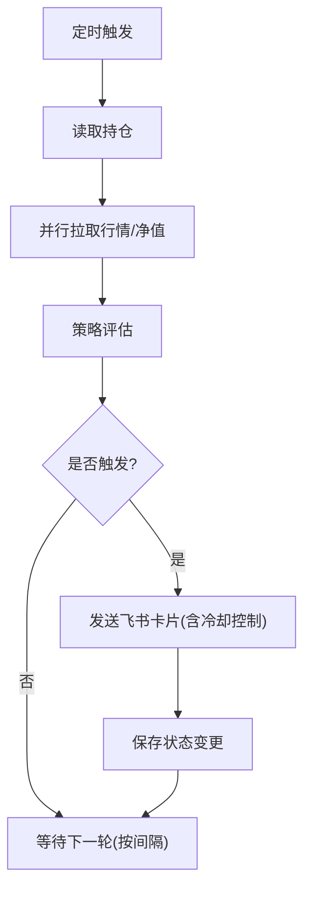

# 环境部署

<cite>
**本文引用的文件**
- [package.json](file://package.json)
- [config.json](file://config.json)
- [start.sh](file://start.sh)
- [vite.config.js](file://vite.config.js)
- [server/index.js](file://server/index.js)
- [server/server.js](file://server/server.js)
- [server/config.js](file://server/config.js)
- [server/scheduler.js](file://server/scheduler.js)
- [server/store.js](file://server/store.js)
- [server/notifier.js](file://server/notifier.js)
- [web/src/main.js](file://web/src/main.js)
- [web/index.html](file://web/index.html)
</cite>

## 目录
1. [简介](#简介)
2. [项目结构](#项目结构)
3. [核心组件](#核心组件)
4. [架构总览](#架构总览)
5. [详细组件分析](#详细组件分析)
6. [依赖与配置](#依赖与配置)
7. [性能与稳定性](#性能与稳定性)
8. [故障排查](#故障排查)
9. [结论](#结论)
10. [附录：部署场景示例](#附录部署场景示例)

## 简介
本指南面向需要在本地、服务器或容器环境中部署 Stock Advisor（股票秘书）的读者，覆盖系统要求、安装步骤、配置文件与环境变量说明、开发/生产模式差异、常用启动方式与参数、以及常见问题排查。项目由 Node.js 后端服务与 Vue 前端组成，后端提供 REST API、行情调度与飞书通知能力，并托管构建后的静态页面。

## 项目结构
- 根目录包含应用入口脚本、配置文件与包管理清单。
- server 目录实现 HTTP 服务、数据持久化、行情抓取、策略评估与通知。
- web 目录为 Vue 3 + Vite 前端源码，构建产物输出到根目录 dist，并由后端统一托管。

图表来源
- [vite.config.js:7-25](file://vite.config.js#L7-L25)
- [server/server.js:567-593](file://server/server.js#L567-L593)
- [server/scheduler.js:65-177](file://server/scheduler.js#L65-L177)
- [server/notifier.js:81-111](file://server/notifier.js#L81-L111)
- [server/store.js:40-70](file://server/store.js#L40-L70)

章节来源
- [package.json:1-32](file://package.json#L1-L32)
- [vite.config.js:1-26](file://vite.config.js#L1-L26)
- [server/server.js:1-594](file://server/server.js#L1-L594)

## 核心组件
- 启动入口：server/index.js 加载配置、启动 HTTP 服务与调度器；支持一次性运行模式。
- HTTP 服务：server/server.js 提供 /api 接口与静态资源托管。
- 配置加载：server/config.js 从 config.json 读取运行时配置。
- 数据存储：server/store.js 将持仓数据持久化到 data/holdings.json，并提供内存缓存与串行写入。
- 行情调度：server/scheduler.js 定时拉取行情、计算策略、发送通知。
- 通知模块：server/notifier.js 构造并推送飞书卡片消息。
- 前端：web 目录使用 Vite 构建，开发时通过代理访问后端 API。

章节来源
- [server/index.js:1-17](file://server/index.js#L1-L17)
- [server/server.js:567-593](file://server/server.js#L567-L593)
- [server/config.js:1-11](file://server/config.js#L1-L11)
- [server/store.js:1-71](file://server/store.js#L1-L71)
- [server/scheduler.js:1-178](file://server/scheduler.js#L1-L178)
- [server/notifier.js:1-112](file://server/notifier.js#L1-L112)
- [web/src/main.js:1-6](file://web/src/main.js#L1-L6)

## 架构总览
系统采用前后端分离但统一托管的模式：
- 开发模式：Vite 开发服务器（默认 5173）提供热更新，并将 /api 请求代理至本地后端（3000）。
- 生产模式：先构建前端到 dist，再由 Node 后端同时提供静态页面与 API（默认 3000）。

图表来源
- [vite.config.js:14-24](file://vite.config.js#L14-L24)
- [server/server.js:567-593](file://server/server.js#L567-L593)
- [server/scheduler.js:65-177](file://server/scheduler.js#L65-L177)
- [server/notifier.js:81-111](file://server/notifier.js#L81-L111)
- [server/store.js:40-70](file://server/store.js#L40-L70)

## 详细组件分析

### 启动流程与模式切换
- 一键脚本 start.sh 负责检查 Node 版本、安装依赖、选择模式并启动服务。
- 开发模式：后台启动后端（:3000），前台启动 Vite（:5173），按 Ctrl+C 同时停止。
- 生产模式：若 dist 不存在则自动构建前端，然后启动后端托管静态资源与 API。

图表来源
- [start.sh:25-99](file://start.sh#L25-L99)

章节来源
- [start.sh:1-100](file://start.sh#L1-L100)
- [server/index.js:1-17](file://server/index.js#L1-L17)

### HTTP 服务与 API
- 监听地址与端口来自配置 server.host 与 server.port（默认 0.0.0.0:3000）。
- /api 路由处理持仓列表、导入 CSV、新建/更新持仓、买入/卖出记录等。
- 非 /api 的 GET 请求会尝试返回 dist 下的静态资源，未命中则回退到 index.html。

图表来源
- [server/server.js:409-565](file://server/server.js#L409-L565)
- [server/server.js:567-593](file://server/server.js#L567-L593)
- [server/store.js:40-70](file://server/store.js#L40-L70)
- [server/scheduler.js:65-177](file://server/scheduler.js#L65-L177)
- [server/notifier.js:81-111](file://server/notifier.js#L81-L111)

章节来源
- [server/server.js:1-594](file://server/server.js#L1-L594)

### 行情调度与通知
- 调度器根据市场交易时段动态调整刷新间隔（交易时段短、非交易时段长）。
- 对股票与基金分别调用不同数据源获取最新价与前收。
- 基于策略与阈值生成提醒，并通过飞书机器人推送卡片消息，支持签名校验与重试。

图表来源
- [server/scheduler.js:58-177](file://server/scheduler.js#L58-L177)
- [server/notifier.js:81-111](file://server/notifier.js#L81-L111)

章节来源
- [server/scheduler.js:1-178](file://server/scheduler.js#L1-L178)
- [server/notifier.js:1-112](file://server/notifier.js#L1-L112)

### 数据存储与迁移
- 数据文件位于 data/holdings.json。
- 首次加载时自动将旧版扁平结构迁移为“多次买入记录”模型，并写回磁盘。
- 读写并发通过内存缓存与串行写链避免冲突。

章节来源
- [server/store.js:1-71](file://server/store.js#L1-L71)

## 依赖与配置

### 系统要求
- Node.js 版本：>= 18（由 engines 字段与启动脚本共同约束）。
- 操作系统：Linux/macOS/Windows 均可（脚本使用 bash，Windows 建议使用 Git Bash 或 WSL）。
- 端口：
  - 后端默认 3000（可配置）。
  - 前端开发服务器默认 5173（Vite 默认，可通过 vite.config.js 修改）。

章节来源
- [package.json:15-17](file://package.json#L15-L17)
- [start.sh:25-36](file://start.sh#L25-L36)
- [config.json:6-9](file://config.json#L6-L9)
- [vite.config.js:14-18](file://vite.config.js#L14-L18)

### 安装步骤
- 克隆仓库后进入项目根目录。
- 确保 Node.js 版本满足要求。
- 安装依赖：
  - 开发模式：直接运行 npm install（或 start.sh dev 会自动检测并安装）。
  - 生产模式：同样需要安装依赖，以便构建前端。
- 构建前端（生产模式）：
  - 使用 npm run build 生成 dist 目录，或由 start.sh 在生产模式下自动构建。

章节来源
- [package.json:7-13](file://package.json#L7-L13)
- [start.sh:38-46](file://start.sh#L38-L46)
- [start.sh:83-90](file://start.sh#L83-L90)

### 配置文件设置
- 配置文件路径：config.json（位于项目根目录）。
- 关键配置项：
  - schedule.intervalSeconds：交易时段刷新间隔（秒）。
  - schedule.offHoursIntervalSeconds：非交易时段刷新间隔（秒）。
  - server.host、server.port：后端监听地址与端口。
  - feishu.webhook、feishu.secret：飞书机器人 Webhook 与密钥（用于签名）。
  - notify.cooldownSeconds：通知冷却时间（秒），防止重复推送。
  - notify.nearThresholdPct：接近阈值百分比（用于策略评估）。

章节来源
- [config.json:1-18](file://config.json#L1-L18)
- [server/config.js:7-10](file://server/config.js#L7-L10)

### 环境变量配置
- ONCE：当设置为真值时，仅执行一次行情刷新后立即退出（常用于一次性任务或测试）。
  - 使用方式：在启动命令前设置，例如 ONCE=true node server/index.js。
- 其他行为由配置文件驱动，无需额外环境变量。

章节来源
- [server/index.js:11-16](file://server/index.js#L11-L16)

### 开发模式与生产模式的区别
- 开发模式（start.sh dev 或 npm run dev）：
  - 前端：Vite 开发服务器（默认 :5173），启用热更新，/api 自动代理到后端 :3000。
  - 后端：独立进程监听 :3000，提供 API。
  - 适合快速迭代前端与联调接口。
- 生产模式（start.sh 或 npm start）：
  - 前端：先构建到 dist，再由后端统一托管静态资源与 API。
  - 后端：监听配置的 host:port（默认 0.0.0.0:3000）。
  - 适合对外提供服务。

章节来源
- [start.sh:48-99](file://start.sh#L48-L99)
- [vite.config.js:7-25](file://vite.config.js#L7-L25)
- [server/server.js:567-593](file://server/server.js#L567-L593)

## 性能与稳定性
- 刷新频率：
  - 交易时段使用较短间隔，非交易时段降频，降低网络与 CPU 占用。
- 并发与一致性：
  - 存储层使用内存缓存与串行写链，避免并发写冲突。
- 通知防抖：
  - 同一触发态在冷却时间内不重复推送，减少噪音。
- 错误恢复：
  - 行情拉取失败会记录日志并跳过该品种，不影响整体循环。
  - 飞书推送失败会重试最多 3 次，指数退避。

章节来源
- [server/scheduler.js:58-177](file://server/scheduler.js#L58-L177)
- [server/store.js:40-70](file://server/store.js#L40-L70)
- [server/notifier.js:96-111](file://server/notifier.js#L96-L111)

## 故障排查
- Node 版本过低：
  - 现象：启动时报错或脚本提示版本不满足要求。
  - 解决：升级 Node.js 至 >= 18。
- 端口被占用：
  - 现象：后端或 Vite 无法绑定端口。
  - 解决：修改 config.json 中的 server.port，或 vite.config.js 中的 server.port，释放占用端口。
- 前端无法访问 API：
  - 开发模式：确认 Vite 已正确代理 /api 到 :3000。
  - 生产模式：确认后端已启动且监听了配置的 host:port。
- 飞书通知失败：
  - 现象：日志中出现推送错误或无消息。
  - 解决：检查 config.json 中 feishu.webhook 与 feishu.secret 是否正确；确认网络可达；查看通知日志。
- 数据未更新：
  - 现象：持仓价格不变化。
  - 解决：确认调度器正常运行；检查网络与数据源；查看调度日志；必要时手动触发一次运行（ONCE=true）。
- 构建产物缺失：
  - 现象：生产模式访问页面 404。
  - 解决：执行 npm run build 生成 dist；或使用 start.sh 自动构建。

章节来源
- [start.sh:25-36](file://start.sh#L25-L36)
- [config.json:6-17](file://config.json#L6-L17)
- [vite.config.js:14-24](file://vite.config.js#L14-L24)
- [server/notifier.js:81-111](file://server/notifier.js#L81-L111)
- [server/scheduler.js:65-177](file://server/scheduler.js#L65-L177)

## 结论
Stock Advisor 提供了开箱即用的本地开发与生产部署方案。通过 start.sh 可一键切换开发/生产模式，配合 config.json 灵活调整端口、刷新频率与通知策略。遵循本文的系统要求与配置指引，可在多种环境下稳定运行。

## 附录：部署场景示例

### 本地开发
- 前置条件：Node.js >= 18。
- 步骤：
  - 安装依赖：npm install。
  - 启动开发模式：./start.sh dev 或 npm run dev。
  - 访问前端：http://localhost:5173（API 自动代理到 :3000）。
- 注意：如需自定义前端端口，修改 vite.config.js 的 server.port。

章节来源
- [start.sh:51-77](file://start.sh#L51-L77)
- [vite.config.js:14-24](file://vite.config.js#L14-L24)

### 服务器部署（单机）
- 前置条件：Node.js >= 18，开放所需端口（默认 3000）。
- 步骤：
  - 安装依赖：npm install。
  - 构建前端：npm run build（或直接 ./start.sh 生产模式）。
  - 启动服务：./start.sh 或 npm start。
  - 访问：http://<服务器IP>:3000。
- 配置建议：
  - 在 config.json 中设置 server.host 为 0.0.0.0，server.port 为期望端口。
  - 配置 feishu.webhook 与 feishu.secret 以启用通知。

章节来源
- [start.sh:79-99](file://start.sh#L79-L99)
- [config.json:6-17](file://config.json#L6-L17)
- [server/server.js:567-593](file://server/server.js#L567-L593)

### 容器化部署（Docker）
- 基础镜像：选择包含 Node.js >= 18 的镜像（如 node:18-alpine）。
- 构建阶段：
  - 复制 package.json 与 pnpm-lock.yaml（如有），安装依赖。
  - 执行 npm run build 生成 dist。
- 运行阶段：
  - 暴露端口 3000。
  - 挂载 data 目录以持久化 holdings.json。
  - 通过环境变量或配置文件注入 feishu.webhook 与 feishu.secret。
  - 启动命令：node server/index.js。
- 注意事项：
  - 确保容器内网络可访问外部数据源与飞书 Webhook。
  - 如需一次性任务，可使用 ONCE=true 启动。

章节来源
- [server/index.js:11-16](file://server/index.js#L11-L16)
- [server/store.js:1-71](file://server/store.js#L1-L71)
- [config.json:10-17](file://config.json#L10-L17)