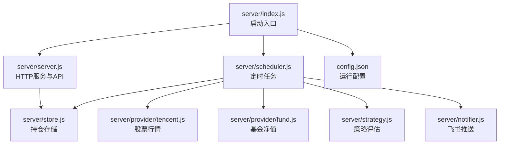
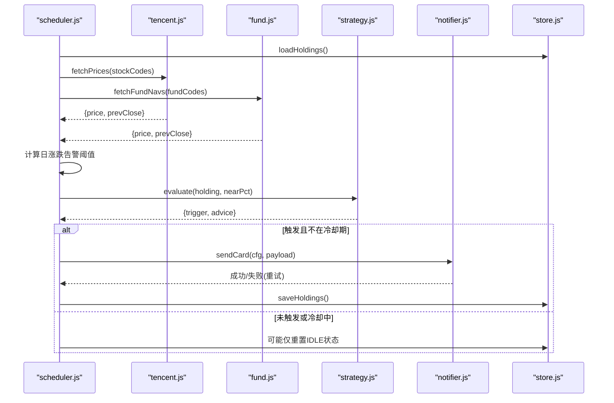
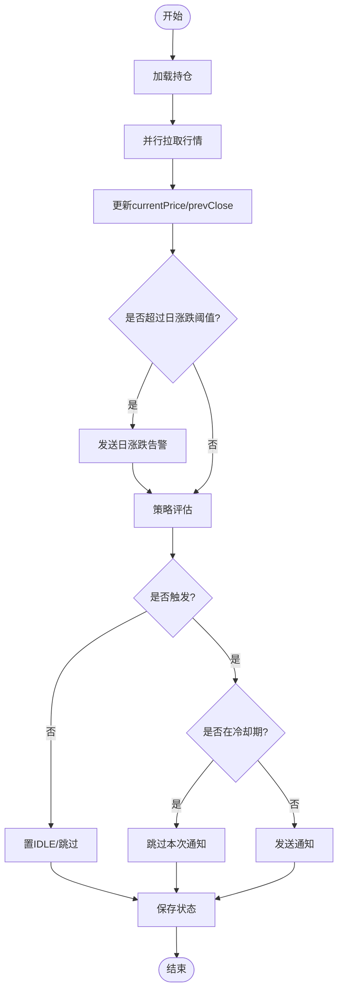
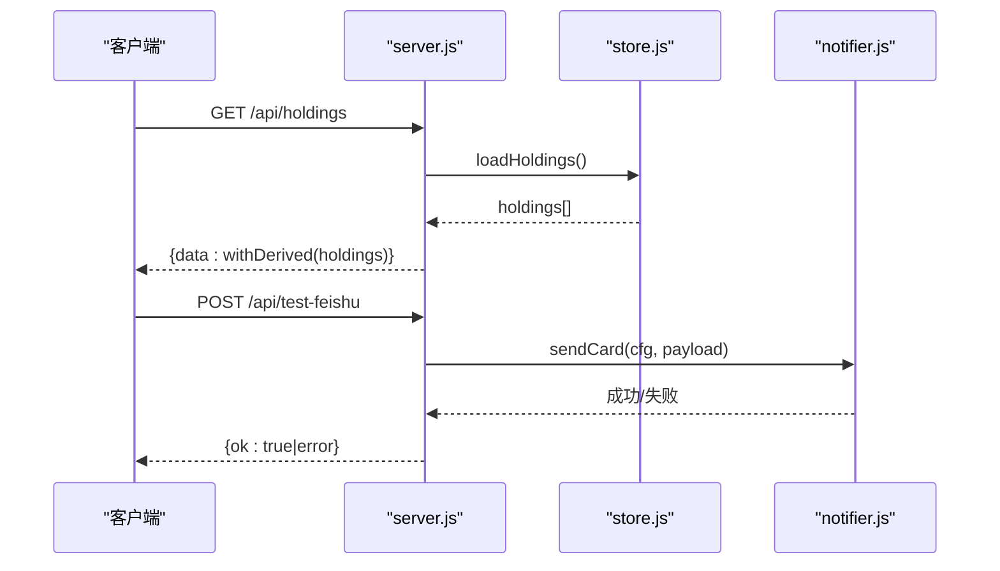
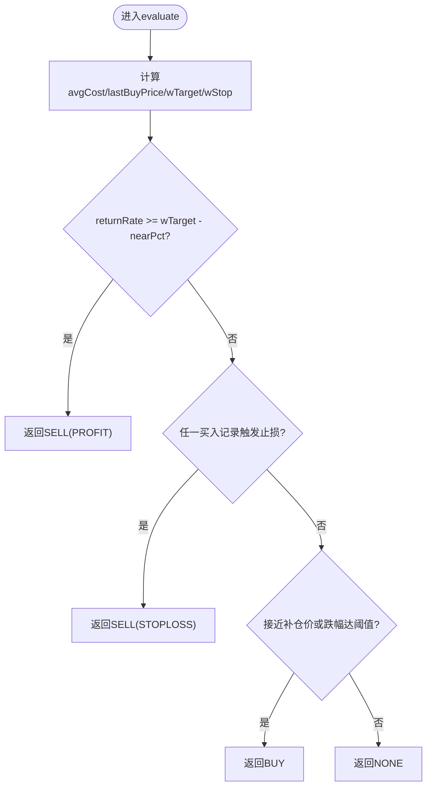
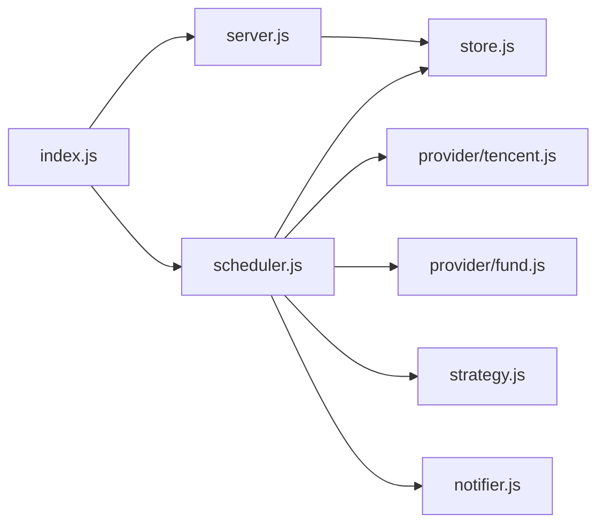

# 监控告警

<cite>
**本文引用的文件**
- [server/index.js](file://server/index.js)
- [server/server.js](file://server/server.js)
- [server/scheduler.js](file://server/scheduler.js)
- [server/strategy.js](file://server/strategy.js)
- [server/notifier.js](file://server/notifier.js)
- [server/store.js](file://server/store.js)
- [server/provider/tencent.js](file://server/provider/tencent.js)
- [server/provider/fund.js](file://server/provider/fund.js)
- [config.json](file://config.json)
- [package.json](file://package.json)
</cite>

## 目录
1. [简介](#简介)
2. [项目结构](#项目结构)
3. [核心组件](#核心组件)
4. [架构总览](#架构总览)
5. [详细组件分析](#详细组件分析)
6. [依赖关系分析](#依赖关系分析)
7. [性能与可观测性建议](#性能与可观测性建议)
8. [故障排查指南](#故障排查指南)
9. [结论](#结论)
10. [附录：指标、面板与告警配置参考](#附录指标面板与告警配置参考)

## 简介
本文件为 Stock Advisor（股票秘书）的“监控告警”专项文档。系统基于 Node.js 服务，定时拉取行情数据，结合策略引擎对持仓进行止盈/止损/补仓评估，并通过飞书机器人推送告警。当前代码库未内置应用性能监控（APM）、结构化日志聚合或指标采集导出能力，但已具备可扩展的调度、通知与存储层。本文在现有实现基础上，给出面向生产环境的监控告警体系设计、集成方案与落地建议，帮助补齐响应时间、内存使用、API调用统计、错误上报、日志聚合、指标可视化、告警降噪与自愈等能力。

## 项目结构
后端采用单进程 HTTP 服务 + 定时调度器模式：
- 入口启动服务与调度器
- HTTP 路由提供前端静态资源与 API
- 调度器按交易时段动态调整刷新频率，拉取行情并执行策略
- 通知模块将告警推送到飞书
- 存储模块负责持久化持仓数据
- 配置集中管理

**图表来源**
- [server/index.js:1-17](file://server/index.js#L1-L17)
- [server/server.js:567-594](file://server/server.js#L567-L594)
- [server/scheduler.js:65-178](file://server/scheduler.js#L65-L178)
- [server/provider/tencent.js:6-42](file://server/provider/tencent.js#L6-L42)
- [server/provider/fund.js:6-55](file://server/provider/fund.js#L6-L55)
- [server/strategy.js:34-91](file://server/strategy.js#L34-L91)
- [server/notifier.js:81-112](file://server/notifier.js#L81-L112)
- [server/store.js:40-71](file://server/store.js#L40-L71)
- [config.json:1-19](file://config.json#L1-L19)

**章节来源**
- [server/index.js:1-17](file://server/index.js#L1-L17)
- [server/server.js:567-594](file://server/server.js#L567-L594)
- [server/scheduler.js:65-178](file://server/scheduler.js#L65-L178)
- [config.json:1-19](file://config.json#L1-L19)

## 核心组件
- 启动与生命周期：入口加载配置、启动 HTTP 服务与调度器；支持一次性运行模式用于调试。
- HTTP 服务：提供静态页面托管与 REST API（持仓列表、导入CSV、新建/更新持仓、买入/卖出记录、测试飞书消息）。
- 调度器：根据市场开闭状态选择刷新间隔，批量拉取行情，计算日涨跌告警与策略触发，写入状态并发送通知。
- 策略引擎：基于多次买入记录计算加权成本、最近买入价、目标止盈/止损线，输出买点/卖点/无触发。
- 通知模块：构造飞书交互式卡片，支持签名校验与重试。
- 存储模块：内存缓存 + 串行写盘，避免并发冲突，自动迁移旧数据结构。
- 数据源：腾讯财经批量接口获取股票行情；东方财富基金净值接口获取基金净值。

**章节来源**
- [server/index.js:1-17](file://server/index.js#L1-L17)
- [server/server.js:55-565](file://server/server.js#L55-L565)
- [server/scheduler.js:65-178](file://server/scheduler.js#L65-L178)
- [server/strategy.js:34-91](file://server/strategy.js#L34-L91)
- [server/notifier.js:81-112](file://server/notifier.js#L81-L112)
- [server/store.js:40-71](file://server/store.js#L40-L71)
- [server/provider/tencent.js:6-42](file://server/provider/tencent.js#L6-L42)
- [server/provider/fund.js:6-55](file://server/provider/fund.js#L6-L55)

## 架构总览
下图展示一次调度周期的关键流程：读取持仓 → 拉取行情 → 计算日涨跌告警 → 策略评估 → 冷却控制 → 发送通知 → 落盘。

**图表来源**
- [server/scheduler.js:65-178](file://server/scheduler.js#L65-L178)
- [server/provider/tencent.js:6-42](file://server/provider/tencent.js#L6-L42)
- [server/provider/fund.js:6-55](file://server/provider/fund.js#L6-L55)
- [server/strategy.js:34-91](file://server/strategy.js#L34-L91)
- [server/notifier.js:81-112](file://server/notifier.js#L81-L112)
- [server/store.js:40-71](file://server/store.js#L40-L71)

## 详细组件分析

### 调度器与告警流
- 交易时段判断：依据各市场时区与本地时间窗口，决定刷新频率（交易时段短间隔，非交易时段长间隔）。
- 行情拉取：并行请求股票与基金数据源，合并结果后逐只持仓更新价格与昨收。
- 日涨跌告警：按持仓配置的涨跌阈值判定是否推送，每日仅推送一次（通过日期标记去重）。
- 策略评估：计算收益/跌幅，匹配止盈、止损、补仓条件，输出动作与建议。
- 冷却机制：同一触发态在冷却时间内不重复推送，避免刷屏。
- 状态落盘：变更时持久化到磁盘，供 HTTP 接口与下次调度复用。

**图表来源**
- [server/scheduler.js:65-178](file://server/scheduler.js#L65-L178)
- [server/strategy.js:34-91](file://server/strategy.js#L34-L91)
- [server/notifier.js:81-112](file://server/notifier.js#L81-L112)
- [server/store.js:40-71](file://server/store.js#L40-L71)

**章节来源**
- [server/scheduler.js:65-178](file://server/scheduler.js#L65-L178)
- [server/strategy.js:34-91](file://server/strategy.js#L34-L91)
- [server/notifier.js:81-112](file://server/notifier.js#L81-L112)
- [server/store.js:40-71](file://server/store.js#L40-L71)

### HTTP 服务与 API
- 静态资源：优先精确路径，否则回退 index.html，支持 SPA。
- API 路由：
  - GET /api/holdings：返回带派生字段的持仓列表
  - POST /api/import-csv：导入买卖记录
  - POST /api/holdings：新建持仓
  - PATCH /api/holdings/:id：更新持仓级字段（如日涨跌告警阈值）
  - POST /api/holdings/:id/purchases：追加买入记录
  - PATCH /api/holdings/:id/purchases/:pid：修改某条买入记录
  - DELETE /api/holdings/:id/purchases/:pid：删除买入记录
  - POST /api/holdings/:id/transactions：兼容旧接口，统一处理买入/卖出
  - POST /api/test-feishu：测试飞书推送
- 错误处理：统一捕获异常并返回 JSON 错误；未知路径返回 404。

**图表来源**
- [server/server.js:55-565](file://server/server.js#L55-L565)
- [server/store.js:40-71](file://server/store.js#L40-L71)
- [server/notifier.js:81-112](file://server/notifier.js#L81-L112)

**章节来源**
- [server/server.js:55-565](file://server/server.js#L55-L565)

### 策略引擎
- 输入：持仓对象（含多次买入记录、最近买入价、补仓阈值等）与近阈值百分比。
- 逻辑：
  - 计算加权平均成本、最近买入价、加权止盈/止损线
  - 若收益率接近或达到止盈线 → 卖点（PROFIT）
  - 若任一买入记录的跌幅触及止损线 → 卖点（STOPLOSS）
  - 若接近补仓价或跌幅达到补仓阈值 → 买点（BUY）
- 输出：触发类型、原因、建议文案。

**图表来源**
- [server/strategy.js:34-91](file://server/strategy.js#L34-L91)

**章节来源**
- [server/strategy.js:34-91](file://server/strategy.js#L34-L91)

### 通知模块（飞书）
- 卡片模板：区分日涨跌告警与买卖点提醒，包含品种、代码、市场/类型、当前价、操作建议与摘要。
- 安全签名：可选 secret 生成 HMAC-SHA256 签名，附带 timestamp。
- 重试机制：最多重试 3 次，指数退避（1s、2s、3s），失败抛错。

**章节来源**
- [server/notifier.js:4-112](file://server/notifier.js#L4-L112)

### 存储模块
- 内存缓存：首次加载或检测到外部文件修改时重新读盘，避免频繁 IO。
- 串行写盘：通过 Promise 链保证写操作的顺序性，防止并发覆盖。
- 数据迁移：自动将旧版扁平持仓迁移为多次买入记录模型。

**章节来源**
- [server/store.js:1-71](file://server/store.js#L1-L71)

### 数据源适配
- 股票行情：批量查询腾讯财经，解析 GBK/UTF-8 文本，提取当前价与昨收。
- 基金净值：逐个查询东方财富，解析 JSONP，提取最新与上一交易日净值。

**章节来源**
- [server/provider/tencent.js:6-42](file://server/provider/tencent.js#L6-L42)
- [server/provider/fund.js:6-55](file://server/provider/fund.js#L6-L55)

## 依赖关系分析
- server/index.js 依赖 config、scheduler、server
- server/server.js 依赖 store、notifier、import-csv-core
- server/scheduler.js 依赖 store、provider/tencent、provider/fund、strategy、notifier
- server/strategy.js 无外部依赖
- server/notifier.js 无外部依赖（使用 crypto）
- server/store.js 无外部依赖（fs/promises）
- provider 模块无外部依赖（fetch）

**图表来源**
- [server/index.js:1-17](file://server/index.js#L1-L17)
- [server/server.js:5-7](file://server/server.js#L5-L7)
- [server/scheduler.js:1-5](file://server/scheduler.js#L1-L5)

**章节来源**
- [server/index.js:1-17](file://server/index.js#L1-L17)
- [server/server.js:5-7](file://server/server.js#L5-L7)
- [server/scheduler.js:1-5](file://server/scheduler.js#L1-L5)

## 性能与可观测性建议
说明：以下内容为基于现有代码结构的扩展建议，便于在生产环境补齐监控告警能力。

- 应用性能监控（APM）
  - 响应时间监控：在 HTTP 中间件层记录每个请求的开始/结束时间，计算耗时并上报至 Prometheus 或时序数据库。
  - 内存使用监控：定期采样 process.memoryUsage()，暴露 RSS、堆大小等指标，设置内存增长告警。
  - API 调用统计：对关键 API（/api/holdings、/api/import-csv、/api/test-feishu）计数与延迟分布，识别热点与慢请求。
  - 外部调用监控：对腾讯/东财接口与飞书 webhook 的请求成功率、延迟、错误码进行统计。

- 错误监控与日志分析
  - 异常捕获：在服务层统一 try/catch 捕获异常，记录上下文（URL、方法、参数摘要、用户代理、IP）。
  - 错误上报：将错误事件发送到集中式日志平台（ELK/Loki）或错误追踪服务（Sentry）。
  - 日志聚合：统一日志格式（JSON），包含时间戳、级别、模块、traceId、业务键（如持仓ID），便于检索与分析。
  - 告警关联：当错误率或特定错误类型突增时触发告警，联动通知渠道。

- 指标采集与可视化
  - 关键业务指标：
    - 调度周期耗时、拉取行情成功率、策略触发次数（BUY/SELL/NONE）
    - 日涨跌告警触发次数、冷却命中次数
    - 持仓数量、活跃持仓数、最近更新时间
  - 监控面板配置：
    - 使用 Grafana 创建仪表盘，展示趋势图、热力图、告警历史
    - 分维度筛选：市场（A股/港股/美股/基金）、策略类型、时间段
  - 趋势分析：
    - 观察行情拉取失败率与延迟变化，定位网络或服务端问题
    - 跟踪策略触发频率，评估阈值合理性

- 告警规则配置
  - 阈值设置：
    - 服务健康：CPU/内存/句柄数超阈、进程重启次数
    - 业务健康：行情拉取失败率 > 5%、策略连续 N 次无触发（可能数据异常）
    - 通知通道：飞书推送失败率 > 10%
  - 告警渠道配置：
    - 主通道：飞书机器人（已有）
    - 备用通道：邮件、企业微信、短信（通过回调或第三方服务）
  - 通知模板定制：
    - 统一模板变量：时间、服务名、实例、指标、阈值、建议
    - 分级通知：警告、严重、灾难对应不同模板与接收人

- 监控工具集成指南
  - Prometheus：
    - 引入 prom-client，暴露 /metrics 端点
    - 定义计数器、直方图、仪表盘标签
    - 配置 scrape 与 alertmanager 规则
  - Grafana：
    - 连接 Prometheus 数据源
    - 构建仪表盘与告警规则
  - ELK Stack：
    - 使用 winston/pino 输出结构化日志
    - Filebeat/Fluent Bit 收集日志到 Elasticsearch
    - Kibana 检索与告警

- 告警降噪与故障自愈
  - 降噪策略：
    - 去重：相同告警在冷却期内合并
    - 抑制：已知维护窗口内抑制非关键告警
    - 分组：按服务/实例/指标维度分组
  - 自愈策略：
    - 自动重启：进程崩溃或内存泄漏检测后重启
    - 降级：外部依赖不可用时切换缓存或跳过非关键步骤
    - 限流：对高频外部调用增加限流与退避

[本节为通用建议，不直接分析具体文件]

## 故障排查指南
- 常见问题定位
  - 行情拉取失败：检查网络、User-Agent/Referer 头、编码解码（GBK/UTF-8）
  - 基金净值解析失败：确认 JSONP 包裹格式与字段存在性
  - 飞书推送失败：核对 webhook 地址与 secret 签名，查看重试日志
  - 策略未触发：检查持仓数据完整性、阈值配置、nearThresholdPct 设置
  - 存储写入冲突：确认串行写盘链路未被阻塞，检查磁盘权限

- 日志与调试
  - 查看控制台输出中的错误前缀（如 [stock-fetch]、[fund]、[notify-daily]、[notify]、[store]）
  - 使用 /api/test-feishu 验证通知通道
  - 通过 /api/holdings 检查持仓派生字段是否正确

**章节来源**
- [server/provider/tencent.js:6-42](file://server/provider/tencent.js#L6-L42)
- [server/provider/fund.js:6-55](file://server/provider/fund.js#L6-L55)
- [server/notifier.js:81-112](file://server/notifier.js#L81-L112)
- [server/scheduler.js:65-178](file://server/scheduler.js#L65-L178)
- [server/server.js:567-594](file://server/server.js#L567-L594)

## 结论
Stock Advisor 已具备稳定的调度、策略与通知能力，适合在现有基础上快速接入 APM、日志聚合与指标可视化，形成完整的监控告警闭环。建议优先补齐请求级耗时与错误统计、外部依赖健康度监控、以及统一的日志格式与告警降噪策略，以提升系统的可观测性与稳定性。

[本节为总结性内容，不直接分析具体文件]

## 附录：指标、面板与告警配置参考
- 关键业务指标定义
  - 调度周期耗时：每次 runOnce 的起止时间差
  - 行情拉取成功率：成功返回 price 的比例
  - 策略触发次数：BUY/SELL/NONE 计数
  - 日涨跌告警次数：DAILY_RISE/DAILY_DROP 计数
  - 通知成功率：sendCard 成功比例
  - 内存占用：RSS、堆使用量
- 监控面板配置（Grafana）
  - 概览：服务健康、调度耗时、拉取成功率、触发次数
  - 详情：各市场/基金/股票的触发趋势、失败率
  - 告警：错误率突增、通知失败、内存超限
- 告警规则示例
  - 行情拉取失败率 > 5% 持续 5 分钟
  - 飞书推送失败率 > 10% 持续 10 分钟
  - 内存使用 > 80% 持续 5 分钟
  - 策略连续 10 次 NONE（可能数据异常）

[本节为概念性配置参考，不直接分析具体文件]