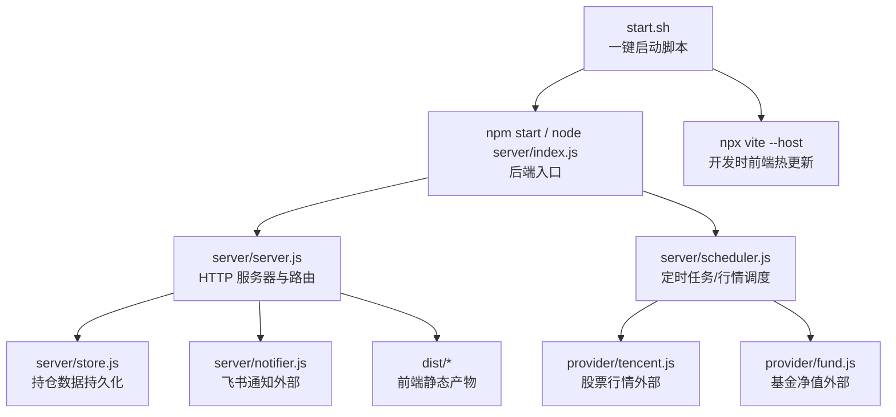
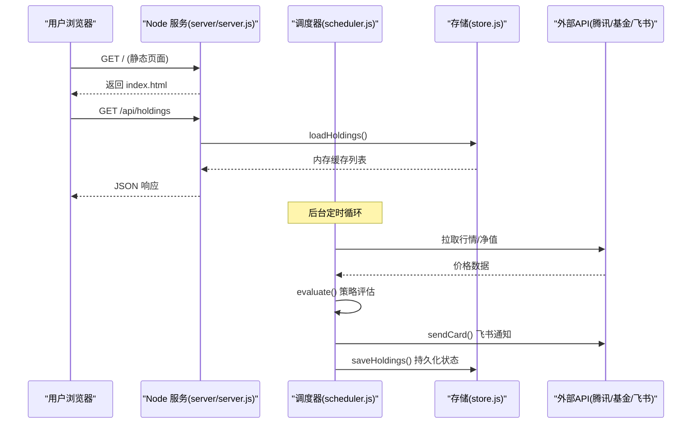
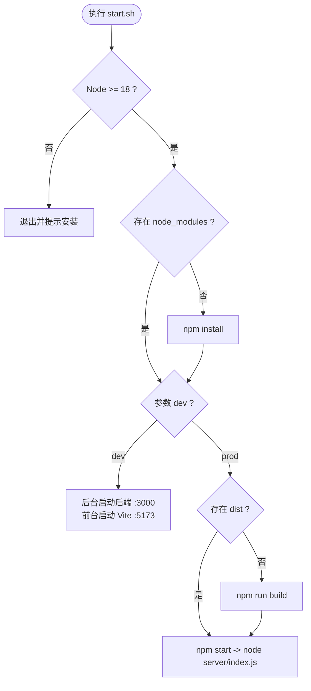
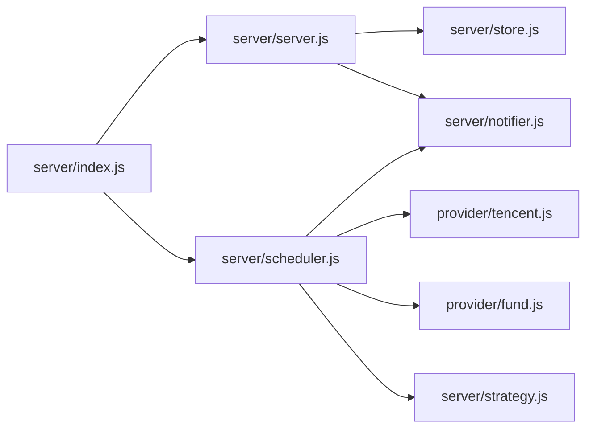

# 进程管理

<cite>
**本文引用的文件**
- [package.json](file://package.json)
- [start.sh](file://start.sh)
- [config.json](file://config.json)
- [server/index.js](file://server/index.js)
- [server/server.js](file://server/server.js)
- [server/scheduler.js](file://server/scheduler.js)
- [server/config.js](file://server/config.js)
- [server/store.js](file://server/store.js)
- [vite.config.js](file://vite.config.js)
- [web/src/main.js](file://web/src/main.js)
</cite>

## 目录
1. [简介](#简介)
2. [项目结构](#项目结构)
3. [核心组件](#核心组件)
4. [架构总览](#架构总览)
5. [详细组件分析](#详细组件分析)
6. [依赖关系分析](#依赖关系分析)
7. [性能与资源优化](#性能与资源优化)
8. [故障排查指南](#故障排查指南)
9. [结论](#结论)
10. [附录](#附录)

## 简介
本文件面向 Stock Advisor 的进程管理与运维，覆盖服务启动流程、前后端构建顺序、进程监控与健康检查、日志管理、进程重启与优雅关闭、以及生产部署建议（含 PM2/systemd）。文档基于仓库现有实现进行梳理，并给出可操作的扩展建议。

## 项目结构
Stock Advisor 采用“后端 Node 服务 + 前端 Vue/Vite”的单体部署模式：
- 后端提供 HTTP API 和静态页面托管，端口默认 3000。
- 前端通过 Vite 构建为静态资源，由后端在运行时直接托管。
- 调度器周期性抓取行情、评估策略、推送通知，并在交易时段与非交易时段自动调整刷新频率。

图表来源
- [start.sh:48-99](file://start.sh#L48-L99)
- [server/index.js:1-17](file://server/index.js#L1-L17)
- [server/server.js:567-593](file://server/server.js#L567-L593)
- [server/scheduler.js:167-177](file://server/scheduler.js#L167-L177)
- [server/store.js:40-70](file://server/store.js#L40-L70)
- [vite.config.js:7-25](file://vite.config.js#L7-L25)

章节来源
- [start.sh:25-99](file://start.sh#L25-L99)
- [package.json:1-32](file://package.json#L1-L32)
- [vite.config.js:1-26](file://vite.config.js#L1-L26)

## 核心组件
- 启动入口：server/index.js 加载配置、启动 HTTP 服务、启动调度器或一次性运行。
- HTTP 服务：server/server.js 提供 /api/* 接口与静态资源托管。
- 调度器：server/scheduler.js 按市场交易时段动态调整刷新间隔，执行行情抓取、策略评估与通知。
- 配置：config.json 定义调度间隔、服务器地址端口、飞书通知参数、冷却时间等。
- 存储：server/store.js 提供内存缓存与串行写盘，避免并发冲突。
- 前端：web/src/main.js 挂载 Vue 应用；Vite 负责开发与构建。

章节来源
- [server/index.js:1-17](file://server/index.js#L1-L17)
- [server/server.js:567-593](file://server/server.js#L567-L593)
- [server/scheduler.js:58-177](file://server/scheduler.js#L58-L177)
- [config.json:1-19](file://config.json#L1-L19)
- [server/store.js:1-71](file://server/store.js#L1-L71)
- [web/src/main.js:1-6](file://web/src/main.js#L1-L6)

## 架构总览
Stock Advisor 的进程模型如下：
- 单进程 Node 服务同时承载 HTTP API 与静态页面。
- 调度器以 setTimeout 循环驱动，根据是否处于交易时段选择不同刷新间隔。
- 数据层使用内存缓存 + 文件持久化，写入串行化保证一致性。
- 通知通过飞书 Webhook 发送，失败不影响主流程。

图表来源
- [server/server.js:567-593](file://server/server.js#L567-L593)
- [server/scheduler.js:65-177](file://server/scheduler.js#L65-L177)
- [server/store.js:40-70](file://server/store.js#L40-L70)

## 详细组件分析

### 启动流程与构建顺序
- 生产模式
  - 若 dist/ 不存在则先执行前端构建，再启动后端服务。
  - 后端监听 3000 端口，同时托管静态资源与 API。
- 开发模式
  - 同时启动后端（:3000）与 Vite 开发服务器（:5173），/api 请求由 Vite 代理到后端。
  - Ctrl+C 会清理所有子进程。

图表来源
- [start.sh:25-99](file://start.sh#L25-L99)
- [package.json:7-14](file://package.json#L7-L14)
- [vite.config.js:7-25](file://vite.config.js#L7-L25)

章节来源
- [start.sh:25-99](file://start.sh#L25-L99)
- [package.json:7-14](file://package.json#L7-L14)
- [vite.config.js:7-25](file://vite.config.js#L7-L25)

### 进程监控与健康检查
- 当前实现未暴露健康检查端点。可通过以下方式快速验证：
  - 健康探针：GET http://127.0.0.1:3000/ 应返回 HTML（SPA 入口）。
  - 接口探针：GET http://127.0.0.1:3000/api/holdings 应返回 JSON 列表。
- 建议在 server/server.js 中新增 /health 端点，返回进程 PID、启动时间、最近一次调度结果等指标，便于容器编排或系统级健康检查。

章节来源
- [server/server.js:567-593](file://server/server.js#L567-L593)

### 日志管理方案
- 当前日志输出方式
  - 控制台日志：console.log/console.error 用于关键步骤与错误信息。
  - 调度日志：每轮 tick 输出时间与模式（交易/非交易）、持仓数量。
  - 错误日志：网络请求失败、通知失败等通过 console.error 输出。
- 日志级别与轮转
  - 当前未实现分级与轮转。建议：
    - 引入日志库（如 pino/winston）并按 level 输出。
    - 配置文件输出与文件轮转（按大小/日期），保留最近 N 天。
    - 将错误日志单独落盘，便于告警与审计。
- 错误日志收集
  - 在生产环境建议接入集中式日志平台（ELK/Loki/Sentry），统一采集 stdout/stderr。
  - 对关键异常（网络超时、磁盘写入失败）增加结构化字段（模块、方法、耗时、错误码）。

章节来源
- [server/scheduler.js:161-163](file://server/scheduler.js#L161-L163)
- [server/server.js:583-586](file://server/server.js#L583-L586)

### 进程重启机制与优雅关闭
- 当前行为
  - 无内置优雅关闭逻辑；Ctrl+C 终止进程后，调度器循环停止。
  - 无自动重启机制。
- 推荐实践
  - 使用 PM2 或 systemd 管理进程，实现崩溃自动重启、开机自启、日志轮转。
  - 在 server/server.js 中注册 SIGTERM/SIGINT 处理器，关闭 HTTP 服务后再退出。
  - 在调度器中记录最近一次成功 tick 的时间，作为健康检查依据。

章节来源
- [server/index.js:1-17](file://server/index.js#L1-L17)
- [server/server.js:567-593](file://server/server.js#L567-L593)
- [server/scheduler.js:167-177](file://server/scheduler.js#L167-L177)

### 进程管理工具使用指南

#### PM2 配置建议
- 启动命令：node server/index.js
- 实例数：1（单进程设计）
- 环境变量：ONCE=1 可执行一次性任务后退出（用于批量导入或补数据）
- 日志：启用 PM2 日志轮转与聚合
- 示例要点（概念性说明）
  - 设置 restart-delay 与 max_memory_restart 防止频繁重启。
  - 使用 pm2 monit 观察 CPU/内存与日志。
  - 结合 pm2 deploy 或 CI/CD 完成灰度发布。

章节来源
- [package.json:7-14](file://package.json#L7-L14)
- [server/index.js:12-16](file://server/index.js#L12-L16)

#### systemd 服务配置建议
- 服务单元要点（概念性说明）
  - ExecStart 指向 node server/index.js。
  - Restart=always 配合 RestartSec 实现崩溃恢复。
  - StandardOutput=journal 将日志输出到 journald。
  - 设置 User/Group 与 WorkingDirectory。
  - 添加 HealthCheck 或 ExecStartPre 校验端口可用性。

[本节为通用指导，不直接分析具体代码文件]

## 依赖关系分析
- 启动链路
  - start.sh → npm scripts → node server/index.js → server/server.js + server/scheduler.js
- 运行时依赖
  - server/server.js 依赖 store.js（数据）、notifier.js（通知）、import-csv-core.js（导入）。
  - scheduler.js 依赖 provider/tencent.js、provider/fund.js、strategy.js、notifier.js。
- 外部依赖
  - 腾讯财经 API、基金净值 API、飞书机器人 Webhook。

图表来源
- [server/index.js:1-17](file://server/index.js#L1-L17)
- [server/server.js:1-8](file://server/server.js#L1-L8)
- [server/scheduler.js:1-5](file://server/scheduler.js#L1-L5)

章节来源
- [server/index.js:1-17](file://server/index.js#L1-L17)
- [server/server.js:1-8](file://server/server.js#L1-L8)
- [server/scheduler.js:1-5](file://server/scheduler.js#L1-L5)

## 性能与资源优化
- 调度频率
  - 交易时段：intervalSeconds（默认 20s）
  - 非交易时段：offHoursIntervalSeconds（默认 300s）
  - 建议根据持仓数量与外部 API 限流策略调优。
- 数据读写
  - 使用内存缓存减少磁盘 IO；写入串行化避免竞争。
  - 建议定期压缩历史数据或归档旧 holdings。
- 网络请求
  - 合并请求、增加重试与退避策略，降低外部 API 失败影响。
- 前端构建
  - 生产环境仅构建一次，后端直接托管静态资源，减少冷启动开销。
- 资源限制
  - 在 PM2/systemd 中设置内存上限，触发自动重启保护。
  - 监控 CPU/内存峰值，必要时水平拆分（如独立调度进程）。

章节来源
- [config.json:1-19](file://config.json#L1-L19)
- [server/scheduler.js:58-63](file://server/scheduler.js#L58-L63)
- [server/store.js:8-12](file://server/store.js#L8-L12)

## 故障排查指南
- 常见问题定位
  - 无法访问页面：检查 dist/ 是否存在，端口 3000 是否被占用。
  - 接口报错：查看 /api/holdings 返回与后端日志。
  - 行情缺失：确认外部 API 可达性与股票代码格式。
  - 通知失败：检查飞书 webhook 与 secret 配置。
- 日志与诊断
  - 查看控制台日志中的 [tick]、[notify]、[store] 等前缀。
  - 在 PM2/systemd 中查看进程日志与崩溃堆栈。
- 恢复步骤
  - 重启服务：PM2 自动重启或 systemctl restart。
  - 修复配置后重载：PM2 reload 或 systemctl reload。
  - 数据回滚：从 data/holdings.json 备份恢复。

章节来源
- [server/scheduler.js:101-163](file://server/scheduler.js#L101-L163)
- [server/server.js:583-586](file://server/server.js#L583-L586)
- [server/store.js:62-70](file://server/store.js#L62-L70)

## 结论
Stock Advisor 当前以单进程 Node 服务承载前后端，具备基础的调度与通知能力。为满足生产环境的稳定性与可观测性，建议补充健康检查端点、完善日志体系，并通过 PM2/systemd 实现进程守护、自动重启与优雅关闭。同时，结合业务规模调优调度频率与外部 API 调用策略，确保系统在交易时段的高可用与低延迟。

## 附录

### 启动与运行速查
- 生产模式：./start.sh
- 开发模式：./start.sh dev
- 端口：后端 3000，前端开发 5173
- 配置文件：config.json

章节来源
- [start.sh:48-99](file://start.sh#L48-L99)
- [config.json:1-19](file://config.json#L1-L19)
- [vite.config.js:7-25](file://vite.config.js#L7-L25)